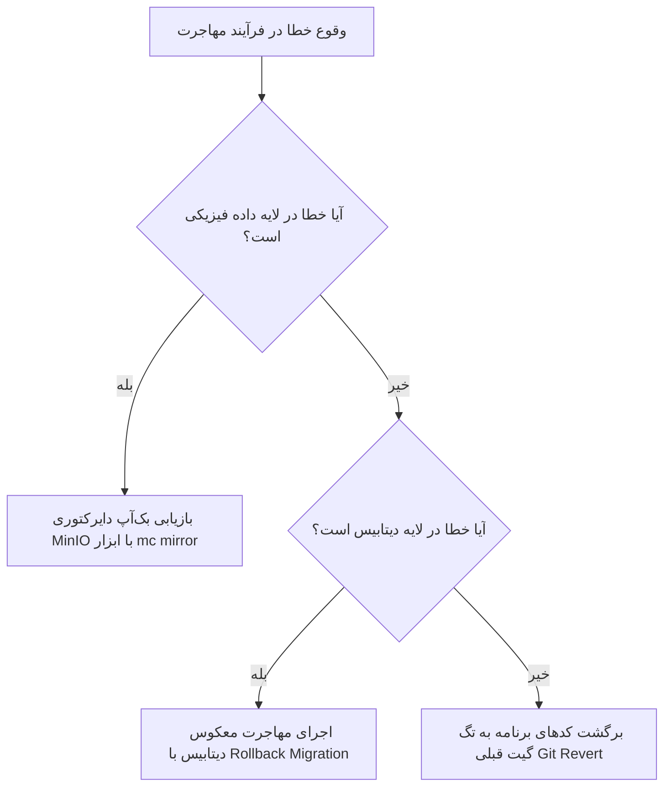

# راهبرد مهاجرت داده‌ها و همگرایی پلتفرم ذخیره‌سازی (Storage Migration Strategy)

========================================================================

**شناسه سند:** XENNIC-STORAGE-MIGRATE-001  
**تاریخ سند:** ۲۸ تیر ۱۴۰۵ (2026-07-18)  
**نسخه:** 1.0.0  
**مسئول تدوین:** دستیار معماری و حاکمیت Storage (شناسه: `XENNIC-STORAGE-ARCH-001`)  
**وضعیت راهبرد:** آماده تایید (IN_REVIEW)

این مستند راهبرد گام‌به‌گام و همه‌جانبه مهاجرت کدهای قدیمی و انتقال بایت‌های آبجکت استوریج به بستر معماری همگرای هدف را به همراه مکانیزم‌های بازگشت به عقب (Rollback Strategy) تشریح می‌کند.

---

## ۱. مراحل مهاجرت و همگرایی (Migration Stages)

مهاجرت سیستم ذخیره‌سازی زنیک طی ۵ فاز سازمان‌یافته صورت می‌گیرد تا از هرگونه قطعی سرویس یا از دست رفتن اسناد حساس مهندسی پیشگیری شود:

```
[فاز ۱: بازبینی و طراحی] ──► [فاز ۲: مهاجرت پایگاه داده] ──► [فاز ۳: بازنویسی کدها] ──► [فاز ۴: انتقال فیزیکی بایت‌ها] ──► [فاز ۵: تست نهایی و Cutover]
```

### فاز ۱: تایید معماری و زیرساخت (Audit & Infrastructure Alignment)

- **اقدامات:**
  - تایید و تصویب سند معماری هدف توسط رهبری هوش مصنوعی (CEAI).
  - افزودن کانتینر MinIO به فایل Docker Compose لوکال جهت هماهنگی محیط‌های لوکال توسعه‌دهندگان.
  - حذف متغیرهای محیطی ناامن هاردکدشده پیش‌فرض در تمام سرویس‌ها.

### فاز ۲: مهاجرت پایگاه داده (Database Migration)

- **اقدامات:**
  - اعمال شمای اصلاح‌شده Prisma و ایجاد فیلدهای ارتباطی کلید خارجی جدید به عنوان ویژگی‌های اختیاری (`Nullable`).
  - اجرای مهاجرت پایگاه داده بدون تغییرات تخریبی روی فیلدهای قبلی:
    `pnpm prisma migrate dev --name unified_storage_links`
  - حفظ ستون قدیمی `storage_path` در جداول هوش مصنوعی تا پایان انتقال کامل داده‌ها.

### فاز ۳: بازنویسی کدهای بک‌اند و پایتون (Code Refactoring)

- **اقدامات:**
  - تصحیح امضای تابع آپلود در کلاس `StorageService` و پیاده‌سازی اینترفیس یکتای `'IStorageService'`.
  - رفکتور در فرآیند ثبت اسناد کارخانه دانش (`DocumentIntakeService.registerDocument`) جهت اتصال به استوریج جدید و برطرف کردن باگ کرش.
  - بازنویسی کلاینت پایتونی `MinIOClient` در میکروسرویس پایتون جهت خواندن فایل‌ها از باکت مشترک `documents` با پیشوند مستأجر به جای باکت مستقل در هم شکسته قبلی.

### فاز ۴: انتقال فیزیکی بایت‌ها و داده‌های قدیمی (Data Migration Script)

- **اقدامات:**
  - طراحی یک اسکریپت سبک مهاجرت داده فیزیکی (مثلاً اسکریپت Node.js یا پایتون مبتنی بر `mc` کلاینت).
  - **وظیفه اسکریپت:** خواندن فایل‌های فیزیکی ذخیره شده در باکت‌های قدیمی به شکل `{workspace_id}-documents` و بارگذاری مجدد آن‌ها در باکت واحد مرکزی `documents` با الگوی جدید پیشوند مسیر:
    `${workspaceId}/documents/${fileId}.${ext}`
  - درج رکوردهای متناظر در جدول `files` پایگاه داده به صورت همزمان برای تضمین تمامیت ارجاعی.

### فاز ۵: آزمون نهایی و تغییر وضعیت (Verification & Cutover)

- **اقدامات:**
  - اجرای تست‌های تضمین پایداری و ماتریس تست‌های ST-01 و ST-02.
  - هدایت ترافیک نهایی فرانت‌اند به کنترلرهای جدید.
  - پاکسازی فیزیکی کدهای مرده قدیمی و باکت‌های مستأجر منفرد قبلی از روی سرورهای MinIO.

---

## ۲. برنامه بازگشت به عقب در صورت بروز خطا (Rollback Strategy)

در صورتی که در هر یک از مراحل مهاجرت با اختلال بحرانی یا از دست رفتن داده‌ها مواجه شویم، پروتکل بازگشت به عقب (Rollback) به صورت زیر به سرعت فعال می‌گردد:



### ۲.۱. بازیابی بایت‌های پایگاه داده و آبجکت استوریج

- **دیتابیس:** در صورت بروز مشکل در ساختار دیتابیس، با استفاده از فایلهای پشتیبان تهیه شده قبل از فرآیند مهاجرت (`.sql`)، پایگاه داده به وضعیت پایدار قبلی بازگردانی می‌شود.
- **استوریج شیء (MinIO):** قبل از شروع فرآیند انتقال فاز ۴، یک همگام‌سازی و کپی پشتیبان کامل از باکت‌های موجود تهیه می‌شود:
  `mc mirror local/ remote/backups/storage_pre_migration`
  در صورت خرابی، بایت‌های پشتیبان فورا ری‌استور می‌شوند.

### ۲.۲. بازگشت کدهای برنامه (Application Code Rollback)

- کدهای محیط عملیاتی بر روی بستر مخزن گیت به آخرین کامیت تگ پایدار قبلی بازمی‌ندازند تا سیستم به صورت فوری لود شده و خطاها در محیط محلی بازسازی و برطرف شوند.
- این سازوکار تداوم کارکرد ۱۰۰ درصدی بیزینس را بدون ایجاد وقفه طولانی تضمین می‌کند.
