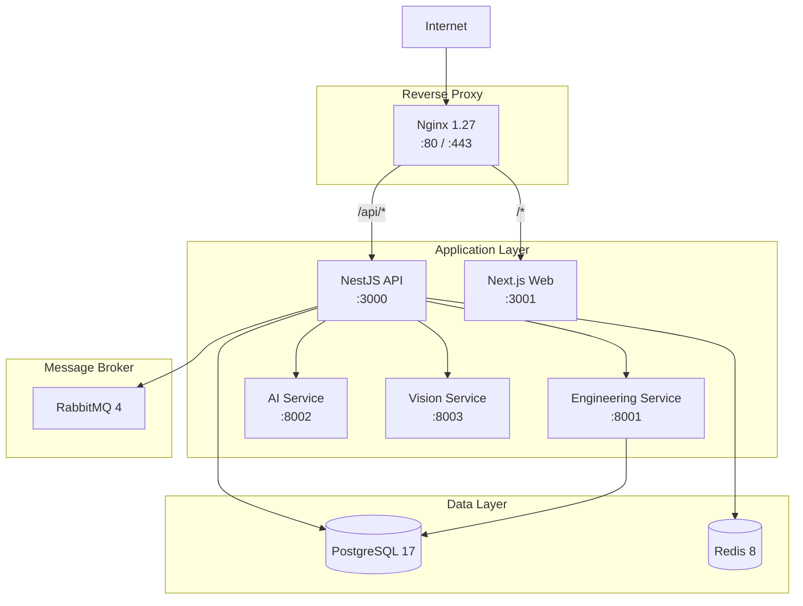

# Xennic Infrastructure

## Architecture



## Services

| Service | Port | Dockerfile | Language |
|---------|------|------------|----------|
| Nginx | 80/443 | `nginx:1.27-alpine` | - |
| NestJS API | 3000 | `apps/api/Dockerfile` | TypeScript |
| Next.js Web | 3001 | `apps/web/Dockerfile` | TypeScript |
| Engineering Service | 8001 | `workspace/services/engineering-service/Dockerfile` | Python |
| AI Service | 8002 | `workspace/services/ai-service/Dockerfile` | Python |
| Vision Service | 8003 | `workspace/services/vision-service/Dockerfile` | Python |
| PostgreSQL | 5432 | `postgres:17-alpine` | - |
| Redis | 6379 | `redis:8-alpine` | - |
| RabbitMQ | 5672 | `rabbitmq:4-management-alpine` | - |

## Quick Start

### Prerequisites

- Docker & Docker Compose v2
- Make sure ports 80, 443, 3000, 3001 are free

### Production

```bash
cd infrastructure/docker/compose/production
cp .env.production.template .env
# Edit .env with your secrets
docker compose up -d
```

### Development (base stack)

```bash
./infrastructure/docker/scripts/up.sh
```

## Docker Build Contexts

The monorepo Dockerfiles use the repository root as build context for Node.js services
(to resolve workspace dependencies), and the service directory for Python services.

| Service | Build Context | Dockerfile |
|---------|--------------|------------|
| API | `.` (repo root) | `apps/api/Dockerfile` |
| Web | `.` (repo root) | `apps/web/Dockerfile` |
| Engineering Service | `workspace/services/engineering-service/` | `Dockerfile` |
| Vision Service | `workspace/services/vision-service/` | `Dockerfile` |
| AI Service | `workspace/services/ai-service/` | `Dockerfile` |

## Directory Structure

```
infrastructure/
├── docker/
│   ├── compose/
│   │   ├── base/              # Dev infrastructure (PG, Redis, RabbitMQ + services)
│   │   │   └── docker-compose.yml
│   │   └── production/        # Full production stack + Nginx
│   │       ├── docker-compose.yml
│   │       └── .env.production.template
│   ├── scripts/               # Dev helper scripts
│   │   ├── up.sh
│   │   ├── down.sh
│   │   └── reset.sh
│   └── secrets/               # JWT keys (rotate before production)
├── nginx/
│   ├── nginx.conf             # Main nginx config
│   └── conf.d/
│       └── default.conf       # Site config with reverse proxy
└── ssl/                       # SSL certificates (self-signed or Let's Encrypt)
    ├── fullchain.pem
    └── privkey.pem
```

## Nginx Features

- SSL/TLS termination (TLS 1.2/1.3)
- Rate limiting (100 req/s general, 10 req/s for auth endpoints)
- WebSocket proxy support
- Gzip compression
- Security headers (X-Frame-Options, XSS-Protection, HSTS, etc.)
- Request ID tracking
- Structured JSON logging
- Static asset caching (365 days for Next.js build assets)

## CI/CD

GitHub Actions workflows:

- **CI** (`.github/workflows/ci.yml`): Runs on every push/PR
  - Lint & format check
  - TypeScript type checking
  - Node.js tests (with PostgreSQL service container)
  - Python tests (ruff, mypy, pytest with coverage)
  - Docker build check for all services

- **CD** (`.github/workflows/cd-deploy.yml`): Runs on main branch pushes
  - Builds & pushes Docker images to GHCR
  - Deploys via SSH to production server

## Security Checklist

- [ ] Rotate JWT keys before production
- [ ] Set strong passwords in `.env`
- [ ] Configure SSL certificates via Let's Encrypt
- [ ] Set `REDIS_PASSWORD` (currently empty in dev)
- [ ] Remove committed API keys from git history
- [ ] Configure firewall rules (limit port exposure)
- [ ] Enable Docker content trust
- [ ] Set up regular database backups
