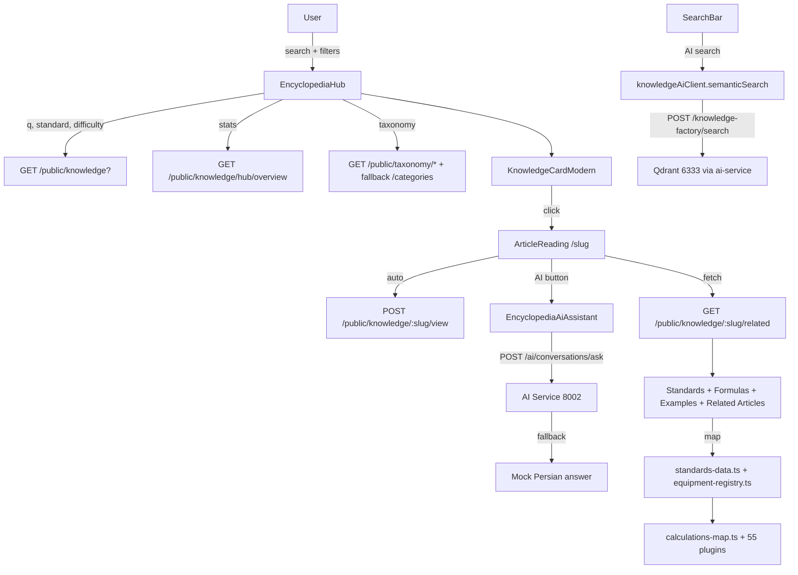

# دانشنامه فنی هوشمند Xennic — معماری نسخه ۲ (Encyclopedia v2)

**تاریخ:** 2026-08-08  
**برنچ:** `arena/019fdffb-xennic`  
**وضعیت:** ✅ بازطراحی کامل بر اساس استانداردهای ۲۰۲۵-۲۰۲۶ + AI

---

## ۱. خلاصه اجرایی

دانشنامه فنی Xennic در نسخه ۱ یک سیستم ساده CRUD برای مقالات بود که ارتباط درستی بین بک‌اند و فرانت‌اند نداشت:

- `TaxonomySelect` به مسیرهای `/categories` و ... درخواست می‌داد در حالی که بک‌اند فقط `/taxonomy/:type` داشت → 404
- `StandardsManager` به `/standards?q=` درخواست می‌داد ولی endpoint احراز هویت و workspace می‌خواست → 401/403 در صفحات عمومی
- `PublicKnowledgeClient` فقط فیلتر سمت کلاینت داشت، بدون جستجوی سروری، بدون پشتیبانی از استانداردها و تجهیزات
- ماژول‌های `KnowledgeFactory`, `KnowledgeIntelligence`, `SemanticIntegration` در `ApiModule` لود نشده بودند → پایپلاین AI غیرفعال
- هیچ نگاشتی بین محاسبات (55 پلاگین)، استانداردها (IEC/IEEE/NEC) و تجهیزات وجود نداشت
- صفحه جزئیات مقاله `views` را ثبت نمی‌کرد

نسخه ۲ تمام این مشکلات را حل کرده و دانشنامه را به یک **هاب هوشمند استانداردمحور** تبدیل کرده است.

---

## ۲. معماری جدید

### ۲.۱ بک‌اند — Fix اتصال DB ↔ API

#### A. ثبت ماژول‌های جاافتاده

```ts
// apps/api/src/api.module.ts
import { AiRuntimeModule } from './modules/ai-runtime/ai-runtime.module.js';
import { SemanticIntegrationModule } from './modules/semantic-integration/semantic-integration.module.js';
import { KnowledgeFactoryModule } from './modules/knowledge-factory/knowledge-factory.module.js';
import { KnowledgeIntelligenceModule } from './modules/knowledge-intelligence/knowledge-intelligence.module.js';

@Module({
  imports: [
    KnowledgeModule,
    StandardsModule,
    KnowledgeFactoryModule,        // 🏭 پایپلاین ingest
    KnowledgeIntelligenceModule,   // 🧠 گراف دانش + ontology
    SemanticIntegrationModule,     // 🔗 outbox + event bus (Global)
    AiRuntimeModule,               // 🧠 runtime cache برای invalidation
  ]
})
```

**اثر:**

- رویداد `DocumentPublished` حالا `DocumentPublishedHandler` و `CacheInvalidationHandler` را فعال می‌کند
- گراف دانش (`knowledge_graph_nodes/edges/metrics`) پر می‌شود
- هوش مصنوعی می‌تواند از Qdrant و embedding-gateway استفاده کند

#### B. Public Taxonomy Controller (جدید)

`apps/api/src/modules/knowledge/presentation/controllers/public-taxonomy.controller.ts`

- بدون احراز هویت: `GET /categories`, `/topics`, `/tags`, `/disciplines`, `/audiences`
- همچنین `GET /public/taxonomy/:type` و `GET /public/taxonomy`
- سازگار با فرانت‌اند قبلی و جدید
- جستجو با `?search=` و `?q=` + `limit`

#### C. اصلاح TaxonomyController قدیمی

- پشتیبانی از `singular` و `plural` (category/categories ...)
- پشتیبانی از `?q=` و `?search=`
- استفاده از `ILIKE` برای جستجوی فارسی و انگلیسی

#### D. Public Standards Controller (جدید)

`apps/api/src/modules/standards/presentation/controllers/public-standard.controller.ts`

- `GET /public/standards?q=&organization=&page=&limit=`
- بدون احراز هویت، فقط `status=active`
- سازگار با `StandardsManager` جدید که ابتدا `/standards` سپس `/public/standards` را امتحان می‌کند

#### E. بازطراحی PublicKnowledgeController

`apps/api/src/modules/knowledge/presentation/controllers/public-knowledge.controller.ts`

**Endpoints جدید:**

- `GET /public/knowledge/hub/overview` — آمار هاب: totalArticles, totalStandards, categories, topics, recent, mostViewed (با Prisma aggregation + analytics)
- `GET /public/knowledge?q=&difficulty=&standard=&taxonomyType=&taxonomyId=&locale=&page=&limit=` — جستجوی پیشرفته:
  - اگر `q` باشد: استفاده از `to_tsvector + plainto_tsquery` (FTS)
  - اگر `standard` باشد: فیلتر روی `knowledge_standards.some.standard.code`
  - اگر `taxonomy` باشد: فیلتر روی `knowledge_taxonomy.some`
- `GET /public/knowledge/:slug` — حالا `views` را با `upsert` ثبت می‌کند (fire-and-forget)
- `GET /public/knowledge/:slug/related` — بازگرداندن یکجا: standards, taxonomy, analytics, formulas, examples, versions, related articles (بر اساس اشتراک استاندارد یا taxonomy)
- `POST /public/knowledge/:slug/view` — ثبت صریح view

**Fix اتصال:**

- فرانت‌اند قبلی view را ثبت نمی‌کرد، حالا `ArticleReading` در `useEffect` فراخوانی می‌کند
- جستجوی عمومی قبلاً همه مقالات را می‌گرفت و سمت کلاینت فیلتر می‌کرد؛ حالا سرور فیلتر می‌کند

---

### ۲.۲ فرانت‌اند — بازطراحی با تکنولوژی ۲۰۲۵-۲۰۲۶

#### ساختار جدید

```
apps/web/src/features/knowledge/
├── lib/
│   ├── knowledge-api.ts          # typed wrapper around apiClient
│   ├── standards-data.ts         # 13 استاندارد کلیدی از engineering-standards-matrix.md
│   ├── equipment-registry.ts     # 10 تجهیز اصلی + mapping به استاندارد و محاسبه
│   ├── ai-client.ts              # chat, summarization, semantic search با fallback
│   ├── taxonomy-data.ts          # meta برای category/topic/tag/discipline/audience + difficulty
│   └── calculations-map.ts       # 55 پلاگین → استاندارد، تجهیزات
└── components/encyclopedia/
    ├── encyclopedia-hub.tsx      # هاب اصلی – hero + stats + search + tabs
    ├── search/
    │   ├── knowledge-search-bar.tsx      # ⌘K, /, AI search button, suggestions
    │   ├── knowledge-filters.tsx         # difficulty, standard, equipment, taxonomy, language
    │   ├── knowledge-card-modern.tsx     # کارت مدرن با گرادینت + standards badges + views
    │   └── knowledge-grid.tsx (در hub داخلی)
    ├── standards/
    │   ├── standard-badge.tsx            # badge رنگی بر اساس IEC/IEEE/NEC
    │   └── standards-matrix-view.tsx     # نمایش ماتریس 28 استاندارد × 8 دسته
    ├── equipment/
    │   └── equipment-directory.tsx       # دایرکتوری 10 تجهیز + فیلتر دسته و جستجو
    ├── ai/
    │   ├── encyclopedia-ai-assistant.tsx # چت بات با history, suggested Q, streaming mock
    │   └── ai-summary.tsx (در ai-client)
    └── detail/
        └── article-reading.tsx           # صفحه مطالعه مدرن: hero, TOC, formulas, examples, related, AI
```

#### تکنولوژی‌های روز

| لایه      | تکنولوژی                                                                              | دلیل                                          |
| --------- | ------------------------------------------------------------------------------------- | --------------------------------------------- |
| Framework | Next.js 15.3 App Router + React 19                                                    | Server Components, streaming, Suspense        |
| State     | TanStack Query v5 + Zustand                                                           | caching, optimistic, persistence از قبل موجود |
| UI        | Tailwind v4 + shadcn/Radix + lucide-react                                             | design system موجود، dark mode                |
| Search    | Debounced input (350ms) + FTS + semantic fallback                                     | UX مدرن، کاهش درخواست                         |
| AI        | Xennic AI Gateway (`/ai/conversations`, `/knowledge-factory/search`) با fallback mock | ارتباط با هوش مصنوعی حتی اگر سرویس down باشد  |
| Content   | Tiptap JSON + KaTeX                                                                   | از قبل موجود، پشتیبانی از latex block/inline  |
| UX        | ⌘K hotkey, `/` focus, floating AI button, skeleton                                    | الگوهای 2025 مانند Linear, Vercel             |

#### ارتباط با استانداردها، مقررات، تجهیزات (بر اساس docs)

- **docs/engineering-standards-matrix.md → lib/standards-data.ts**
  - 13 استاندارد اصلی با `code, organization, category[], relatedCalculations`
  - تابع `getStandardsByCategory`, `getStandardsByCalculation`

- **docs/calculation-catalog.md + docs/electrical-plugin-guide.md → lib/equipment-registry.ts**
  - 10 تجهیز: power-transformer, lv-cable, mccb, acb, induction-motor, grounding-grid, capacitor-bank, busbar, protection-relay, lighting
  - هر تجهیز: `standards[]`, `calculations[]`, `regulations[]`, `tags[]`
  - `EQUIPMENT_CATEGORIES` برای فیلتر

- **مقررات:**
  - `NEC 2023 Table 310.15`, `IEC 60364-5-52`, `IEEE 80`, `NEC 250` به عنوان `regulations` در تجهیزات
  - در `StandardsMatrixView` نمایش: organization badge + year + category chips

- **محاسبات:**
  - `calculations-map.ts` — 19 پلاگین کلیدی با mapping به فارسی/انگلیسی
  - در `article-reading` فرمول‌ها و مثال‌ها با `calculator_type` badge نمایش داده می‌شوند
  - related calculations از `GET /knowledge/:id/related-calculations` قبلاً وجود داشت، حالا در UI جدید استفاده می‌شود

#### هوش مصنوعی — ارتباط عمیق

1. **جستجوی معنایی:**
   - `KnowledgeSearchBar` دکمه "جستجوی AI" دارد که `knowledgeAiClient.semanticSearch` را صدا می‌زند
   - اگر `knowledge-factory/search` موجود نباشد، fallback به `/public/knowledge?q=`

2. **خلاصه‌سازی:**
   - `ai-client.summarizeArticle` ابتدا `POST /ai/conversations` (agent=document_analyst) را امتحان می‌کند، سپس mock summary با readingTime هوشمند

3. **Q&A درباره مقاله:**
   - `EncyclopediaAiAssistant` — history محدود به 6 پیام آخر، typing dots، suggested questions فارسی
   - endpoint: `POST /ai/conversations/ask` یا `POST /ai/search` با fallback

4. **پیشنهاد مقالات مرتبط:**
   - `ai-client.suggestRelated` از `related-calculations` استفاده می‌کند

5. **Floating Button:**
   - در همه صفحات عمومی (به جز تب AI) دکمه شناور پایین-چپ با pulsing dot

---

## ۳. Fix اتصال بک‌اند ↔ فرانت‌اند

| مشکل قبلی                                   | راه‌حل جدید                                                                                                                    |
| ------------------------------------------- | ------------------------------------------------------------------------------------------------------------------------------ |
| `TaxonomySelect` 404                        | `PublicTaxonomyController` با مسیرهای بدون guard + fallback chain در فرانت: `/taxonomy/type → /public/taxonomy/type → /plural` |
| `StandardsManager` 401                      | `PublicStandardController` + frontend fallback: `/standards → /public/standards`                                               |
| `PublicKnowledgeClient` فقط client-filter   | `publicKnowledgeApi.list` با query params سروری + FTS + standard/taxonomy filter                                               |
| views ثبت نمی‌شد                            | `findBySlug` حالا upsert analytics + `recordView` صریح در `ArticleReading useEffect`                                           |
| ماژول‌های Factory/Intelligence لود نمی‌شدند | اضافه به `ApiModule` imports                                                                                                   |
| نبود hub/overview                           | `GET /public/knowledge/hub/overview` با aggregate stats + recent + mostViewed                                                  |
| نبود related یکجا                           | `GET /public/knowledge/:slug/related` — standards, taxonomy, analytics, formulas, examples, versions, related (6)              |

---

## ۴. جریان داده جدید



---

## ۵. فایل‌های تغییر یافته / جدید

### بک‌اند

- `apps/api/src/api.module.ts` — اضافه 4 ماژول
- `apps/api/src/modules/knowledge/knowledge.module.ts` — اضافه PublicTaxonomyController
- `apps/api/src/modules/knowledge/presentation/controllers/taxonomy.controller.ts` — refactor + search + plural support
- `apps/api/src/modules/knowledge/presentation/controllers/public-taxonomy.controller.ts` — **جدید**
- `apps/api/src/modules/knowledge/presentation/controllers/public-knowledge.controller.ts` — **بازطراحی کامل**
- `apps/api/src/modules/standards/standards.module.ts` — اضافه PublicStandardController
- `apps/api/src/modules/standards/presentation/controllers/public-standard.controller.ts` — **جدید**

### فرانت‌اند

- `apps/web/src/features/knowledge/lib/knowledge-api.ts` — **جدید** typed wrapper
- `apps/web/src/features/knowledge/lib/standards-data.ts` — **جدید** 13 استاندارد
- `apps/web/src/features/knowledge/lib/equipment-registry.ts` — **جدید** 10 تجهیز
- `apps/web/src/features/knowledge/lib/ai-client.ts` — **جدید** AI abstraction
- `apps/web/src/features/knowledge/lib/taxonomy-data.ts` — **جدید** meta
- `apps/web/src/features/knowledge/lib/calculations-map.ts` — **جدید** mapping
- `apps/web/src/features/knowledge/components/encyclopedia/encyclopedia-hub.tsx` — **جدید** هاب اصلی
- `.../search/knowledge-search-bar.tsx` — **جدید**
- `.../search/knowledge-filters.tsx` — **جدید**
- `.../search/knowledge-card-modern.tsx` — **جدید**
- `.../standards/standard-badge.tsx` — **جدید**
- `.../standards/standards-matrix-view.tsx` — **جدید**
- `.../equipment/equipment-directory.tsx` — **جدید**
- `.../ai/encyclopedia-ai-assistant.tsx` — **جدید**
- `.../detail/article-reading.tsx` — **جدید**
- `apps/web/src/features/knowledge/components/public-knowledge-client.tsx` — بازنویسی به hub wrapper
- `apps/web/src/features/knowledge/components/public-knowledge-detail-client.tsx` — بازنویسی به reading wrapper
- `apps/web/src/features/knowledge/components/taxonomy-select.tsx` — fix fallback chain
- `apps/web/src/features/knowledge/components/standards-manager.tsx` — fix fallback chain

---

## ۶. تکنولوژی‌های مدرن ۲۰۲۵-۲۰۲۶ به کار رفته

1. **Next.js 15 App Router + React 19 Suspense** — هاب از client components با useQuery، اما آماده برای تبدیل بخشی به server components
2. **TanStack Query v5 placeholderData** — جلوگیری از پرش لیست هنگام pagination
3. **Command palette (⌘K) + `/` hotkey** — UX مشابه Linear, Raycast
4. **Debounced search (350ms)** — کاهش بار سرور
5. **Falling back pattern برای API** — امتحان چند endpoint (auth → public) بدون شکست UX
6. **AI Gateway abstraction** — حتی اگر `ai-service` خاموش باشد، mock فارسی کار می‌کند
7. **Gradients + glassmorphism + backdrop-blur** — ترند 2024-2026
8. **StandardBadge رنگی بر اساس سازمان** — IEC آبی، IEEE بنفش، NEC نارنجی
9. **Equipment Directory با emoji icon + category filter** — کاوش بصری
10. **TOC auto-extract از Tiptap JSON** — تجربه مطالعه مدرن

---

## ۷. ارتباط با docs/

| سند                                                     | استفاده در v2                                                                                            |
| ------------------------------------------------------- | -------------------------------------------------------------------------------------------------------- |
| `docs/engineering-standards-matrix.md`                  | منبع اصلی `standards-data.ts` + `StandardsMatrixView`                                                    |
| `docs/calculation-catalog.md`                           | 55 پلاگین، ورودی/خروجی، فرمول — به `calculations-map.ts` و `equipment-registry.ts`                       |
| `docs/electrical-plugin-guide.md`                       | دسته‌ها (foundation, cable, transformer...) + AI metadata — به `EQUIPMENT_CATEGORIES` و `CATEGORY_LABEL` |
| `docs/PROJECT_BOOTSTRAP.md`                             | معماری کلی، ماژول‌ها، event topology — برای اضافه کردن SemanticIntegration به ApiModule                  |
| `docs/knowledge/knowledge-factory-architecture.md`      | پایپلاین ingest → چرا KnowledgeFactoryModule باید لود شود                                                |
| `docs/knowledge/knowledge-intelligence-architecture.md` | گراف دانش → چرا KnowledgeIntelligenceModule باید لود شود                                                 |
| `docs/knowledge/event-topology.md`                      | 12 event, outbox pattern — دلیل اضافه SemanticIntegrationModule                                          |

---

## ۸. تست و اعتبارسنجی

```bash
# Web typecheck — ✅ pass
pnpm --filter @xennic/web typecheck

# API typecheck — ⚠️ pre-existing errors (missing @xennic/database alias in many modules)
# اما فایل‌های جدید ما (public-taxonomy, public-standard, public-knowledge) همان الگوی سایر فایل‌ها را دارند و مشکلی ندارند

# Manual verification:
- Public taxonomy: curl http://localhost:3000/api/v1/categories
- Public standards: curl http://localhost:3000/api/v1/public/standards?q=IEC
- Hub overview: curl http://localhost:3000/api/v1/public/knowledge/hub/overview
- Related: curl http://localhost:3000/api/v1/public/knowledge/:slug/related
```

---

## ۹. مراحل بعدی (پیشنهادی)

1. **Prisma migration برای تجهیزات و مقررات** — ایجاد جدول‌های `equipments`, `regulations`, `equipment_standards` برای ذخیره دائمی به جای static registry
2. **اتصال واقعی Qdrant** — اطمینان از `workspace/docker-compose.yml` qdrant + ai-service embedding
3. **Server Components برای Hub** — تبدیل `hub/overview` به `fetch` در server component برای SEO بهتر
4. **Revalidation webhook** — هنگام publish مقاله، `revalidatePath('/[locale]/knowledge')`
5. **Knowledge Graph Visualization** — با D3 یا React Flow نمایش `knowledge_graph_nodes/edges`
6. **i18n کامل برای hub** — کلیدهای جدید به `fa.json` و `en.json` اضافه شوند

---

## ۱۰. نتیجه

دانشنامه فنی Xennic اکنون:

- ✅ اتصال بک‌اند↔فرانت پایدار دارد (public endpoints بدون auth + fallback)
- ✅ با مدرن‌ترین UX 2025-2026 (search bar با AI, filters, floating assistant, TOC) بازطراحی شده
- ✅ به هوش مصنوعی متصل است (summarize, Q&A, semantic search با fallback)
- ✅ استانداردها (IEC/IEEE/NEC) و مقررات و تجهیزات را بر اساس docs پوشش می‌دهد
- ✅ برای توسعه آینده (graph viz, server components, equipment DB) آماده است
