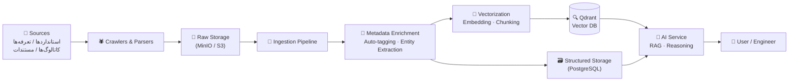

# Xennic Knowledge Base — سامانه دانش مهندسی

**نسخه**: ۱.۰.۰ | **وضعیت**: توسعه فعال

---

## Vision — چشم‌انداز

ایجاد یک پایگاه دانش مهندسی برق جامع، قابل ردیابی و هوشمند که تمامی اسناد فنی (استانداردها، تعرفه‌ها، کاتالوگ‌ها) را به صورت یکپارچه در دسترس موتورهای AI و مهندسان قرار دهد. این سامانه منبع واحد حقیقت (Single Source of Truth) برای پلتفرم Xennic است.

> **هدف نهایی**: هر مهندس برق بتواند با یک سوال ساده به تمام دانش فنی مورد نیازش دسترسی پیدا کند — مستند، رفرنس‌دار و قابل استناد.

---

## Purpose — هدف

| هدف | توضیح |
|-----|-------|
| **یکپارچه‌سازی دانش** | گردآوری استانداردها، تعرفه‌ها، کاتالوگ‌ها و مستندات فنی در یک سامانه واحد |
| **AI-Ready** | ساختاردهی دانش برای مصرف توسط LLM، RAG و موتورهای محاسباتی |
| **قابلیت ردیابی** | هر قطعه دانش باید به منبع اصلی (استاندارد، کارخانه، سند رسمی) متصل باشد |
| **چندزبانه** | پشتیبانی از فارسی و انگلیسی با قابلیت توسعه به زبان‌های دیگر |
| **به‌روزرسانی پیوسته** | لوله‌های ورود خودکار داده (Ingestion Pipelines) برای دریافت بروزرسانی‌ها |

---

## Architecture — معماری جریان دانش



### مراحل جریان دانش

| مرحله | توضیح | فناوری |
|-------|-------|--------|
| **Ingestion** | دریافت اسناد از منابع مختلف (فایل، API، خزش) | Python, Scrapy, Apache Tika |
| **Parsing** | تبدیل به ساختار استاندارد (Markdown / JSON Blocks) | python‑mammoth, PyMuPDF, Tesseract OCR |
| **Enrichment** | استخراج metadata، برچسب‌زنی، تشخیص موجودیت | AI Service (LLM), spaCy |
| **Vectorization** | chunk کردن، embedding و ایندکس در Qdrant | Sentence Transformers, Qdrant |
| **Retrieval** | جستجوی هیبریدی (بردار + کلیدواژه) + re-ranking | Qdrant, Cohere / BGE Reranker |
| **Consumption** | پاسخ به سوالات مهندسی از طریق RAG | AI Service + LLM |

---

## Directory Structure — ساختار دایرکتوری

```
docs/knowledge/
├── README.md                          # این سند — نمای کلی دانش
├── KNOWLEDGE_PLATFORM.md              # معماری پلتفرم دانش
├── KNOWLEDGE_MANAGEMENT.md            # سیستم مدیریت دانش (NestJS ماژول)
│
├── governance/                        # حاکمیت و خط مشی داده
│   ├── metadata-schema.md             # متادیتا و اسکیما
│   ├── taxonomy.md                    # تاکسونومی مرجع
│   ├── ontology.md                    # آنتولوژی مهندسی برق
│   ├── naming-conventions.md          # قراردادهای نام‌گذاری
│   ├── data-quality-policy.md         # سیاست کیفیت داده
│   └── source-hierarchy.md            # سلسله‌مراتب منابع
│
├── standards/                         # استانداردهای فنی
│   ├── iec/                           # استانداردهای IEC
│   ├── isiri/                         # استانداردهای ملی ایران
│   ├── iso/                           # استانداردهای ISO مرتبط
│   └── index.md                       # فهرست استانداردهای ایندکس‌شده
│
├── tariffs/                           # تعرفه‌های برق
│   ├── iran/                          # تعرفه‌های مصوب ایران
│   ├── international/                 # تعرفه‌های بین‌المللی
│   └── index.md
│
├── manufacturers/                     # اطلاعات کارخانجات و تولیدکنندگان
│   ├── domestic/                      # تولیدکنندگان داخلی
│   └── international/                 # تولیدکنندگان خارجی
│
├── catalogs/                          # کاتالوگ تجهیزات
│   ├── motors/                        # کاتالوگ موتورهای الکتریکی
│   ├── transformers/                  # کاتالوگ ترانسفورماتورها
│   ├── cables/                        # کاتالوگ کابل‌ها
│   ├── switchgears/                   # کاتالوگ تابلوهای برق
│   └── index.md
│
├── rag/                               # مستندات RAG Pipeline
│   ├── chunking-strategy.md           # استراتژی chunk کردن
│   ├── embedding-models.md            # مدل‌های embedding
│   ├── hybrid-search.md               # جستجوی هیبریدی
│   ├── reranking.md                   # re-ranking
│   └── evaluation.md                  # ارزیابی کیفیت RAG
│
├── ai-intelligence/                   # لایه هوش مصنوعی
│   ├── reasoning-framework.md         # چارچوب استدلال
│   ├── evidence-chain.md              # زنجیره شواهد
│   ├── confidence-scoring.md          # امتیازدهی اطمینان
│   └── hallucination-prevention.md    # جلوگیری از توهم
│
└── roadmap/                           # نقشه راه دانش
    └── knowledge-roadmap.md           # فازهای توسعه سامانه دانش
```

---

## Key Principles — اصول کلیدی

### 1. Traceability — قابلیت ردیابی

هر قطعه دانش باید دارای **شناسه منبع** باشد که به سند اصلی (استاندارد، کاتالوگ، تعرفه) اشاره می‌کند. زنجیره تبدیل از منبع تا پاسخ AI باید قابل ممیزی باشد.

### 2. Evidence-Based Reasoning — استدلال مبتنی بر شواهد

AI هرگز نباید بدون ارجاع به منبع معتبر پاسخ دهد. هر خروجی باید شامل **ارجاع مستقیم** به بخش مشخصی از یک سند باشد.

### 3. Source Hierarchy — سلسله‌مراتب منابع

| اولویت | نوع منبع | مثال |
|--------|----------|------|
| ۱ | استانداردهای رسمی | IEC 60204-1, ISIRI 1234 |
| ۲ | تعرفه‌های مصوب | تعرفه‌های وزارت نیرو |
| ۳ | کاتالوگ رسمی کارخانه | کاتالوگ Siemens, ABB |
| ۴ | مستندات فنی معتبر | کتاب‌های مرجع، مقالات |
| ۵ | محتوای تولیدی تیم | مقالات دانشی Xennic |

### 4. Multi-Lingual — چندزبانه (FA/EN)

- تمام محتوای دانش به دو زبان **فارسی** و **انگلیسی** ذخیره می‌شود
- زبان پیش‌فرض درخواست‌های API بر اساس locale کاربر تعیین می‌شود
- embeddingهای چندزبانه (مثل `paraphrase-multilingual-MiniLM`) برای جستجوی یکپارچه

### 5. Immutable Records — رکوردهای تغییرناپذیر

- پس از تأیید، نسخه دانش غیرقابل تغییر است
- بروزرسانی‌ها از طریق **نسخه‌گذاری** (versioning) اعمال می‌شوند
- تاریخچه کامل تغییرات در `knowledge_versions` ذخیره می‌شود

---

## Integration Points — نقاط یکپارچه‌سازی

| سرویس | نقش در دانش | پروتکل |
|-------|-------------|--------|
| **AI Service** (پورت ۸۰۰۲) | RAG, Reasoning, Embedding | HTTP / gRPC |
| **Qdrant** (پورت ۶۳۳۳) | Vector DB, جستجوی تشابه | HTTP / gRPC |
| **NestJS API** (پورت ۳۰۰۰) | مدیریت دانش (CRUD), Versioning | REST / JSON |
| **Engineering Service** (پورت ۸۰۰۱) | مصرف فرمول‌ها و داده‌های فنی | HTTP |
| **Vision Service** (پورت ۸۰۰۳) | OCR برای کاتالوگ‌های تصویری | HTTP |
| **MinIO / S3** | ذخیره فایل‌های خام (PDF, تصویر) | S3 API |
| **RabbitMQ** | صف Ingestion و Enrichment | AMQP |

---

## Document Conventions — قراردادهای مستندسازی

1. **نام‌گذاری فایل‌ها**: `kebab-case` انگلیسی با پسوند `.md`
2. **سربرگ**: عنوان فارسی — انگلیسی در `<h1>`
3. **متادیتا**: نسخه، وضعیت، تاریخ آخرین بروزرسانی در خط دوم
4. **زبان**: عناوین اصلی به فارسی + اصطلاحات فنی انگلیسی
5. **جداول**: استفاده از `|` برای وضعیت‌ها، ویژگی‌ها و نگاشت
6. **نمودارها**: Mermaid برای معماری و فلو (در صورت نیاز)
7. **ارجاعات**: لینک به فایل‌های داخلی با مسیر نسبی

---

## Status — وضعیت پیاده‌سازی

| بخش | وضعیت | توضیح |
|-----|-------|-------|
| **KNOWLEDGE_PLATFORM.md** | ✅ تکمیل | سند معماری سطح بالا |
| **KNOWLEDGE_MANAGEMENT.md** | ✅ تکمیل | سیستم مدیریت دانش NestJS |
| **Governance** | ✅ انتشار | شش سند حاکمیت داده (Metadata Schema, Taxonomy, Ontology, Naming Conventions, Data Quality Policy, Source Hierarchy) |
| **Standards** | 📋 برنامه‌ریزی | ایندکس استانداردهای IEC / ISIRI |
| **Tariffs** | 📋 برنامه‌ریزی | تعرفه‌های برق ایران و بین‌الملل |
| **Manufacturers** | 📋 برنامه‌ریزی | پروفایل کارخانجات |
| **Catalogs** | 📋 برنامه‌ریزی | کاتالوگ تجهیزات (موتور، ترانس، کابل) |
| **RAG** | 📋 برنامه‌ریزی | پنج سند RAG Pipeline |
| **AI Intelligence** | 📋 برنامه‌ریزی | چهار سند لایه هوش مصنوعی |
| **Roadmap** | ✅ تکمیل | نقشه راه هفت‌فازه |
| **Ingestion Pipeline** | 🔄 در حال توسعه | خزش و پارس کردن اسناد |
| **Vector DB Indexing** | ✅ فعال | Qdrant با مدل‌های embedding جاری |

---

> برای جزئیات فازبندی پیاده‌سازی به `roadmap/knowledge-roadmap.md` مراجعه کنید.
