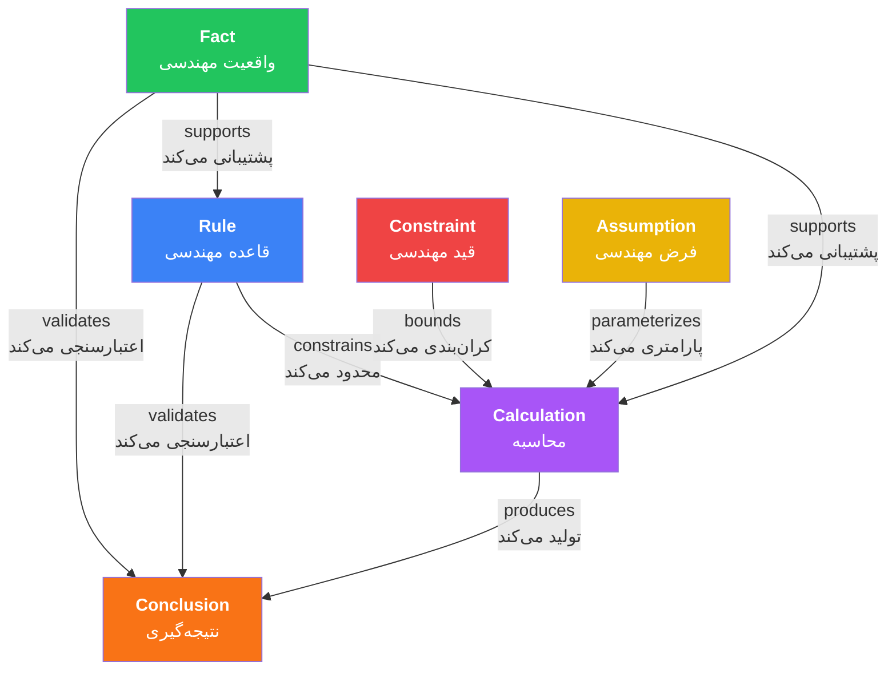
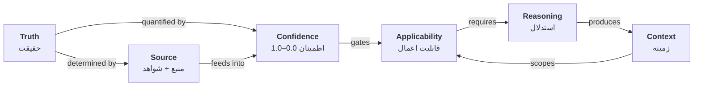
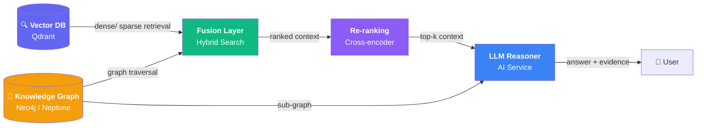

# مدل مفهومی مهندسی — Engineering Concept Model

**Version:** 1.0.0 | **Status:** Draft | **Last Updated:** Tir 1405

---

## Section 1: What is a Concept — مفهوم چیست

A **Concept** is the fundamental unit of engineering knowledge in the Xennic knowledge base. It represents a **reusable, canonical engineering idea** with a formal definition, explicit boundaries, and typed relationships to other concepts and entities.

### Concept Properties

| Property | Type | Required | Description | Example |
|----------|------|----------|-------------|---------|
| `concept_id` | String (pattern: `XEN-CON-{TYPE}-{SEQ}`) | ✅ | Unique identifier for the concept | `XEN-CON-SHORT-CIRCUIT-001` |
| `name` | Object `{fa: String, en: String}` | ✅ | Human-readable name in Persian and English | `{"fa": "جریان اتصال کوتاه", "en": "Short-circuit current"}` |
| `definition` | Text (Markdown) | ✅ | Formal description of the concept | `Maximum current during a bolted three-phase fault at the 20 kV busbar` |
| `type` | Enum | ✅ | Concept type classification | `calculation` |
| `domains` | Array[Enum] | ✅ | Engineering disciplines covered | `["power", "protection"]` |
| `sources` | Array[Object] | ✅ | References to authoritative documents with tier, section, and excerpt | `[{"tier": 1, "standard": "IEC 60909", "section": "§4.2"}]` |
| `relationships` | Array[Object] | Optional | Connections to other concepts and entities | `[{"target": "XEN-CON-VOLTAGE-001", "type": "depends_on", "weight": 1.0}]` |
| `version` | String (SemVer) | ✅ | Version of the concept definition | `1.0.0` |
| `status` | Enum | ✅ | Lifecycle stage | `draft`, `reviewed`, `approved`, `superseded` |

### Concept Identity

Every concept is uniquely identified by a `concept_id` following the pattern:

```
XEN-CON-{TYPE}-{DOMAIN}-{SEQ}
```

| Segment | Description | Example |
|---------|-------------|---------|
| `XEN` | Xennic namespace | `XEN` |
| `CON` | Concept type indicator | `CON` |
| `TYPE` | Concept type abbreviation | `FACT`, `RULE`, `CONS`, `ASMP`, `CALC`, `CLUS` |
| `DOMAIN` | Engineering domain | `SHORT-CIRCUIT`, `CABLE`, `PROTECTION` |
| `SEQ` | 3-digit sequential number | `001`, `042`, `123` |

**Example:** `XEN-CON-CALC-SHORT-CIRCUIT-001`

---

## Section 2: Concept Types — انواع مفاهیم

Six concept types form the complete engineering reasoning taxonomy. Each type has distinct characteristics, validation rules, and roles in the reasoning chain.

### 2.1 Engineering Fact — واقعیت مهندسی

A **verified, observable truth** about electrical systems that is empirically verifiable and source-backed.

| Aspect | Description |
|--------|-------------|
| **Definition** | A statement of measurable or documented reality about an electrical system, component, or phenomenon |
| **Characteristics** | Empirically verified, repeatable, source-backed, independent of interpretation |
| **Graph Label** | `Fact` |
| **Graph Color** | Green |
| **Example** | `The frequency of Iran's power grid is 50 Hz` |
| **Validation** | MUST cite a Tier 1 or Tier 2 source with specific section reference |
| **Counterexample** | `The fault current is high` — not a fact (imprecise, unverifiable) |

**Structure:**

```json
{
  "concept_id": "XEN-CON-FACT-GRID-FREQUENCY-001",
  "name": {"fa": "فرکانس شبکه برق ایران", "en": "Iran Grid Frequency"},
  "definition": "The nominal frequency of Iran's interconnected power grid is 50 Hz ± 0.5 Hz under normal operating conditions per Tavanir grid code.",
  "type": "fact",
  "domains": ["power"],
  "sources": [{"tier": 2, "standard": "Tavanir Grid Code", "section": "§3.1.1", "edition": "1402"}],
  "version": "1.0.0",
  "status": "approved"
}
```

### 2.2 Engineering Rule — قاعده مهندسی

A **prescriptive statement** derived from standards, regulations, or established engineering practice.

| Aspect | Description |
|--------|-------------|
| **Definition** | A normative directive that prescribes how to perform a task, select a parameter, or validate a design |
| **Characteristics** | Normative, condition-action form (`IF X THEN Y`), source-mandated |
| **Graph Label** | `Rule` |
| **Graph Color** | Blue |
| **Example** | `IF cable length > 100 m THEN voltage drop must be calculated per IEC 60364` |
| **Validation** | MUST cite a standard reference (Tier 1–2); may include manufacturer guidance (Tier 3) as supplement |
| **Counterexample** | `Use larger cables for long runs` — not a rule (no condition, no standard reference) |

**Structure:**

```json
{
  "concept_id": "XEN-CON-RULE-CABLE-VDROP-001",
  "name": {"fa": "محاسبه افت ولتاژ کابل", "en": "Cable Voltage Drop Calculation Rule"},
  "definition": "IF cable length exceeds 100 m OR total voltage drop exceeds 3% of nominal voltage THEN detailed voltage drop calculation per IEC 60364-5-52 §6.3 is required.",
  "type": "rule",
  "domains": ["cable", "power"],
  "sources": [{"tier": 1, "standard": "IEC 60364-5-52", "section": "§6.3", "edition": "2022"}],
  "version": "1.0.0",
  "status": "approved"
}
```

### 2.3 Engineering Constraint — قید مهندسی

A **boundary condition or limitation** on design parameters, often imposed by regulations, physics, or equipment limits.

| Aspect | Description |
|--------|-------------|
| **Definition** | A limit, threshold, or restriction that bounds engineering design space |
| **Characteristics** | Defines limits (max/min), often regulatory or physical, jurisdiction-dependent |
| **Graph Label** | `Constraint` |
| **Graph Color** | Red |
| **Example** | `Maximum allowable touch voltage in HV substations is 520 V (Tavanir regulation)` |
| **Validation** | Source MUST match jurisdiction; Tier 1–3 acceptable depending on regulatory scope |
| **Counterexample** | `Keep voltage low` — not a constraint (no numeric bound, no source) |

**Structure:**

```json
{
  "concept_id": "XEN-CON-CONS-TOUCH-VOLTAGE-001",
  "name": {"fa": "حداکثر ولتاژ تماس مجاز", "en": "Maximum Allowable Touch Voltage"},
  "definition": "Maximum allowable touch voltage in HV substations (36–230 kV) within Iran is 520 V per Tavanir technical regulation, regardless of fault clearing time.",
  "type": "constraint",
  "domains": ["grounding", "power"],
  "sources": [{"tier": 2, "standard": "Tavanir Technical Regulation", "section": "§4.3.2", "edition": "1401"}],
  "version": "1.0.0",
  "status": "approved"
}
```

### 2.4 Engineering Assumption — فرض مهندسی

An **accepted simplification** made for the purpose of engineering analysis, explicitly stated with justification and applicability bounds.

| Aspect | Description |
|--------|-------------|
| **Definition** | A deliberate simplification or approximation adopted to enable analysis where exact data is unavailable or unnecessary |
| **Characteristics** | Explicitly stated, justified, bounded in applicability, documented impact |
| **Graph Label** | `Assumption` |
| **Graph Color** | Yellow |
| **Example** | `Assume soil resistivity = 100 Ω·m for preliminary earthing design in urban areas` |
| **Validation** | MUST document why the assumption is valid, its range of applicability, and the sensitivity of results to this assumption |
| **Counterexample** | `Assume ideal conditions` — not an assumption (vague, unbounded, unjustified) |

**Structure:**

```json
{
  "concept_id": "XEN-CON-ASMP-SOIL-RESISTIVITY-001",
  "name": {"fa": "مقاومت ویژه خاک", "en": "Soil Resistivity Assumption"},
  "definition": "Assume uniform soil resistivity of 100 Ω·m for preliminary earthing design in typical urban environments. Valid for feasibility studies and preliminary design only.",
  "type": "assumption",
  "domains": ["grounding"],
  "sources": [{"tier": 5, "standard": "Common engineering practice", "section": "N/A"}],
  "justification": "Based on typical values for urban areas with mixed soil composition. Conservative for most preliminary designs. Sensitivity: ±50 Ω·m changes touch voltage by approximately ±15%.",
  "applicability_bounds": "Valid only for preliminary design. Detailed soil resistivity measurement required for final design per IEEE 80.",
  "version": "1.0.0",
  "status": "approved"
}
```

### 2.5 Engineering Calculation — محاسبه مهندسی

A **computational procedure** with defined inputs, outputs, and methodology, producing reproducible results.

| Aspect | Description |
|--------|-------------|
| **Definition** | A formula-based or algorithmic procedure that transforms input parameters into output results within defined constraints |
| **Characteristics** | Formula-based, reproducible, bounded by constraints, parameterized by assumptions |
| **Graph Label** | `Calculation` |
| **Graph Color** | Purple |
| **Example** | `Short-circuit current per IEC 60909: Ik = c × Un / (√3 × Zk)` |
| **Validation** | MUST define input/output schema, formula reference, and constraints; result must be reproducible |
| **Counterexample** | `Calculate the fault current` — not a calculation (no formula, no inputs, no method) |

**Structure:**

```json
{
  "concept_id": "XEN-CON-CALC-SHORT-CIRCUIT-001",
  "name": {"fa": "جریان اتصال کوتاه سه‌فاز", "en": "Three-Phase Short-Circuit Current"},
  "definition": "Initial symmetrical short-circuit current per IEC 60909: Ik = c × Un / (√3 × Zk) where c is the voltage factor, Un is nominal voltage, and Zk is short-circuit impedance.",
  "type": "calculation",
  "domains": ["power", "protection"],
  "inputs": [
    {"name": "Un", "description": "Nominal system voltage", "unit": "V", "required": true},
    {"name": "Zk", "description": "Short-circuit impedance at fault point", "unit": "Ω", "required": true},
    {"name": "c", "description": "Voltage factor per IEC 60909 Table 1", "unit": "pu", "required": true, "default": 1.1}
  ],
  "outputs": [
    {"name": "Ik", "description": "Initial symmetrical short-circuit current", "unit": "A"}
  ],
  "formula": "Ik = (c × Un) / (√3 × Zk)",
  "constraints": ["Fault is bolted (Zf = 0)", "Pre-fault voltage = 1.0 pu"],
  "sources": [{"tier": 1, "standard": "IEC 60909-0", "section": "§4.2", "edition": "2016"}],
  "version": "1.0.0",
  "status": "approved"
}
```

### 2.6 Engineering Conclusion — نتیجه‌گیری مهندسی

A **derived insight** produced by applying rules, calculations, and facts to a specific engineering context.

| Aspect | Description |
|--------|-------------|
| **Definition** | A judgment or decision that synthesizes facts, rules, constraints, assumptions, and calculations into a context-dependent engineering statement |
| **Characteristics** | Context-dependent, time-limited, includes confidence score, references full evidence chain |
| **Graph Label** | `Conclusion` |
| **Graph Color** | Orange |
| **Example** | `The 20 kV busbar requires 31.5 kA rated short-circuit withstand capacity` |
| **Validation** | MUST include full evidence chain (facts → rules → calculations → conclusion) with confidence scoring |
| **Counterexample** | `Use a 31.5 kA breaker` — not a conclusion (no evidence chain, no context, no confidence) |

**Structure:**

```json
{
  "concept_id": "XEN-CON-CLUS-BUSBAR-SC-001",
  "name": {"fa": "مقاومت اتصال کوتاه باسبار ۲۰ کیلوولت", "en": "20 kV Busbar Short-Circuit Withstand"},
  "definition": "The 20 kV main busbar in substation XEN-SUB-004 requires 31.5 kA rated short-circuit withstand capacity based on calculated fault level of 28.5 kA with 1.1 safety factor.",
  "type": "conclusion",
  "domains": ["power", "protection"],
  "evidence_chain": [
    "XEN-CON-FACT-GRID-FREQUENCY-001",
    "XEN-CON-FACT-NOMINAL-VOLTAGE-001",
    "XEN-CON-RULE-IEC-60909-001",
    "XEN-CON-CONS-BREAKER-RATING-001",
    "XEN-CON-ASMP-BOLTED-FAULT-001",
    "XEN-CON-CALC-SHORT-CIRCUIT-001"
  ],
  "confidence": 0.92,
  "sources": [{"tier": 1, "standard": "IEC 60909-0", "section": "§4.2"}, {"tier": 3, "standard": "Siemens LV Switchgear Catalog", "section": "§2.1"}],
  "valid_until": "2028-06-15",
  "version": "1.0.0",
  "status": "reviewed"
}
```

### Concept Type Summary

| Type | Label | Color | Source Tier | Mutable? | Time-Bound? |
|------|-------|-------|-------------|----------|-------------|
| Fact | `Fact` | 🟢 Green | 1–2 | No | Yes (standards supersede) |
| Rule | `Rule` | 🔵 Blue | 1–2 | No | Yes (edition-dependent) |
| Constraint | `Constraint` | 🔴 Red | 1–3 | No | Yes (jurisdiction changes) |
| Assumption | `Assumption` | 🟡 Yellow | 2–5 | Yes (can be refined) | Yes (analysis-dependent) |
| Calculation | `Calculation` | 🟣 Purple | 1–3 | No | No (formulas are invariant) |
| Conclusion | `Conclusion` | 🟠 Orange | 1–3 | Yes (recalculated) | Yes (context-dependent) |

---

## Section 3: Component Relationships — روابط مؤلفه‌ها

The six concept types form a directed reasoning graph. Each relationship type has a defined semantic meaning and role in engineering inference.

### Relationship Map



### Relationship Table

| Source Type | Target Type | Relation | Description | Edge Direction | Weight Range |
|-------------|-------------|----------|-------------|----------------|--------------|
| Fact | Calculation | `supports` | Facts provide foundational data for calculations | F → CA | 0.5–1.0 |
| Fact | Rule | `supports` | Facts justify the basis of engineering rules | F → R | 0.7–1.0 |
| Fact | Conclusion | `validates` | Facts confirm or refute a conclusion | F → CL | 0.3–1.0 |
| Rule | Calculation | `constrains` | Rules define methodology constraints for calculations | R → CA | 0.8–1.0 |
| Rule | Conclusion | `validates` | Rules validate that a conclusion conforms to standards | R → CL | 0.8–1.0 |
| Constraint | Calculation | `bounds` | Constraints set upper/lower bounds on calculation inputs or outputs | CS → CA | 0.9–1.0 |
| Assumption | Calculation | `parameterizes` | Assumptions supply input values where exact data is unavailable | A → CA | 0.2–0.8 |
| Calculation | Conclusion | `produces` | Calculations generate the numerical results for conclusions | CA → CL | 0.7–1.0 |

### Relationship Properties

Each relationship edge carries the following attributes:

| Property | Type | Required | Description |
|----------|------|----------|-------------|
| `relation_type` | Enum | ✅ | One of: `supports`, `validates`, `constrains`, `bounds`, `parameterizes`, `produces`, `contradicts` |
| `weight` | Float [0, 1] | ✅ | Strength of the relationship (higher = stronger influence) |
| `direction` | Enum | ✅ | `directed` or `bidirectional` |
| `confidence` | Float [0, 1] | ✅ | Confidence in the existence of this relationship |
| `evidence` | String | Optional | Source reference justifying the relationship |
| `conditional` | Boolean | ✅ | Whether the relationship is unconditional or context-dependent |

### Reasoning Paths

The concept model supports these canonical reasoning paths:

**Forward Chaining (bottom-up):**
```
Facts + Rules → Calculation → Conclusion
```

**Backward Chaining (top-down):**
```
Conclusion → requires → Calculation → requires → Facts + Rules + Assumptions
```

**Validation Path:**
```
Conclusion ← validates — (Facts + Rules)
     ↑
  produces
     ↑
Calculation ← bounds — Constraints
     ↑
parameterizes — Assumptions
```

---

## Section 4: Engineering Truth Model — مدل حقیقت مهندسی

### 4.1 What is Engineering Truth

Engineering truth is **probabilistic, authority-based, and jurisdiction-dependent**. Unlike mathematical truth (absolute) or scientific truth (falsifiable), engineering truth exists on a spectrum defined by:

| Dimension | Description | Implication |
|-----------|-------------|-------------|
| **Probabilistic** | Truth is never 100% certain in engineering | Every conclusion carries a confidence score < 1.0 |
| **Authority-Based** | Truth derives from recognized standards and regulations | Higher-tier sources = higher truth value |
| **Jurisdiction-Dependent** | What is true in one country may not apply in another | Truth is scoped by regulatory jurisdiction |
| **Temporal** | Truth degrades as standards are superseded | Version tracking and currency windows are mandatory |
| **Contextual** | Truth depends on specific system parameters | A conclusion valid for one substation may not apply to another |

### 4.2 The Five Elements of Engineering Truth

Every engineering conclusion — and every concept that asserts a truth claim — MUST be backed by exactly **five elements**. AI services MUST NOT generate engineering conclusions without all five elements present and validated.

| # | Element | FA | Description | Required For | Validation |
|---|---------|----|-------------|--------------|------------|
| 1 | **Source** | منبع | The authoritative document from which truth is derived (with tier, edition, section) | All concept types | Must exist in source registry; tier must be valid |
| 2 | **Evidence** | شاهد | The specific excerpt, table, formula, or figure within the source that supports the claim | Facts, Rules, Constraints | Must be a direct quote or parameterized extraction |
| 3 | **Reasoning** | استدلال | The logical steps connecting evidence to conclusion, including reasoning mode (deductive, inductive, abductive) | Conclusions | Must be explicit, traceable, and auditable |
| 4 | **Confidence** | اطمینان | Numerical score (0.0–1.0) computed per `confidence-scoring.md` | All concept types | Must be algorithmically computed, not arbitrarily assigned |
| 5 | **Version** | نسخه | The version of the concept at the time of conclusion | All concept types | Must match concept lifecycle state |

### 4.3 Truth Degradation Over Time

Engineering truth is not static. Standards get superseded, regulations change, and equipment evolves. Truth degrades through the following mechanisms:

| Mechanism | Description | Detection | Action |
|-----------|-------------|-----------|--------|
| **Standard Supersession** | A new edition of a standard replaces an old one | Track via `superseded_by` in metadata | Flag concepts citing old edition; trigger re-validation |
| **Regulatory Update** | National regulations are revised or replaced | Track via jurisdiction watch | Flag concepts citing old regulation; require re-source |
| **Tier Currency Expiry** | Source exceeds its currency window | Check per `source-hierarchy.md` Rule 6 | Downgrade truth value; flag for review |
| **Context Drift** | The original context no longer applies (e.g., load growth) | Monitor via system parameters | Recalculate conclusion with updated inputs |

**Truth Decay Function:**

```
truth_value = base_confidence × decay_factor(t)

where:
  decay_factor(t) = max(0.5, 1.0 - (t_elapsed / t_currency) × 0.5)
  t_elapsed  = time since source edition publication
  t_currency = currency window per source tier
```

### 4.4 Truth Conflict Resolution

When two concepts assert conflicting truths, resolution follows the source hierarchy with jurisdictional overrides:

| Conflict Type | Resolution Method | Priority |
|---------------|-------------------|----------|
| Same tier, different values | Prefer most recent edition | — |
| Different tiers | Higher tier prevails | Rule 2 (Source Hierarchy) |
| Tier 1 vs Tier 2 (Iran jurisdiction) | Tier 2 prevails on national matters | Rule 5 (Jurisdictional Override) |
| Same tier, same edition, different values | Flag for human review | — |
| Different jurisdictions | Apply jurisdiction matching; discard non-matching | — |

### 4.5 Truth, Confidence, and Applicability

The relationship between these three dimensions:



| Dimension | Definition | Range | Determinants |
|-----------|------------|-------|--------------|
| **Truth** | The degree to which a statement corresponds to authoritative engineering reality | Binary per source (valid/superseded) + Continuous per context | Source tier, edition currency, jurisdiction match |
| **Confidence** | The AI system's quantified certainty in the statement | 0.0–1.0 | Source tier, evidence quality, reasoning chain completeness, conflict status |
| **Applicability** | Whether the concept can be safely applied in a given context | Boolean (applicable/not applicable) | Jurisdiction match, parameter bounds, temporal validity, context match |

### 4.6 Hard Requirement for AI Services

> **AI services MUST NOT generate engineering conclusions without all five elements of engineering truth (Source, Evidence, Reasoning, Confidence, Version).**
>
> Any AI-generated conclusion that lacks one or more of these elements SHALL be considered **incomplete** and SHALL be flagged by the validation pipeline. The AI Service MUST return a structured response containing all five elements alongside the conclusion payload.
>
> Violation of this requirement is classified as a **critical quality failure** per the Data Quality Policy.

---

## Section 5: Graph RAG Readiness — آمادگی برای Graph RAG

The concept model is designed for native integration with Graph RAG architectures. This section defines the exact mapping from the conceptual model to knowledge graph representations.

### 5.1 Mapping Overview

| Concept Model Element | Knowledge Graph Mapping | Standard |
|------------------------|------------------------|----------|
| Concept | Node (Vertex) | RDF: `owl:NamedIndividual`, PG: Vertex |
| Relationship | Edge (Directed) | RDF: `rdf:Statement`, PG: Edge |
| Concept property (scalar) | Node attribute | RDF: `owl:DatatypeProperty`, PG: Property |
| Concept property (object) | Edge to another node | RDF: `owl:ObjectProperty`, PG: Relation |
| Metadata | Node/Edge annotation | RDF: Reification, PG: Property |
| Confidence score | Edge/Node weight | PG: `weight` property |
| Source tier | Node classification | RDF: `skos:ConceptScheme`, PG: Label |
| Domain | Node category | RDF: `dcterms:subject`, PG: Label |

### 5.2 RDF/OWL Serialization

The concept model SHALL be serializable to RDF/OWL using the following ontology mappings:

| OWL Construct | Concept Model Mapping | Example |
|---------------|-----------------------|---------|
| `owl:Class` | Concept type | `xen:Fact`, `xen:Rule`, `xen:Calculation` |
| `owl:NamedIndividual` | Specific concept instance | `xen:CON-CALC-SHORT-CIRCUIT-001` |
| `owl:ObjectProperty` | Relationship between concepts | `xen:supports`, `xen:produces` |
| `owl:DatatypeProperty` | Scalar concept property | `xen:definition`, `xen:confidence` |
| `owl:AnnotationProperty` | Metadata | `xen:version`, `xen:lastUpdated` |
| `rdfs:subClassOf` | Type hierarchy | `xen:Calculation rdfs:subClassOf xen:Concept` |
| `skos:ConceptScheme` | Domain taxonomy | `xen:ElectricalEngineeringDomain` |

**Example RDF/Turtle fragment:**

```turtle
@prefix xennic: <http://xennic.ai/knowledge/> .
@prefix xsd: <http://www.w3.org/2001/XMLSchema#> .

xennic:CON-CALC-SHORT-CIRCUIT-001 a xennic:Calculation ;
    xennic:name_fa "جریان اتصال کوتاه سه‌فاز"@fa ;
    xennic:name_en "Three-Phase Short-Circuit Current"@en ;
    xennic:definition "Ik = c × Un / (√3 × Zk)"@en ;
    xennic:confidence 0.92 ;
    xennic:domain xennic:PowerEngineering ;
    xennic:source_tier 1 ;
    xennic:version "1.0.0"^^xsd:string .
```

### 5.3 Property Graph Model

For Property Graph databases (Neo4j, Amazon Neptune, ArangoDB):

| PG Element | Concept Model | Properties |
|------------|---------------|------------|
| **Vertex label** | `Concept` | — |
| **Vertex sub-label** | Concept type | `Fact`, `Rule`, `Constraint`, `Assumption`, `Calculation`, `Conclusion` |
| **Vertex properties** | All concept properties | `concept_id`, `name_fa`, `name_en`, `definition`, `confidence`, `version`, `status` |
| **Edge type** | Relationship verb | `SUPPORTS`, `VALIDATES`, `CONSTRAINS`, `BOUNDS`, `PARAMETERIZES`, `PRODUCES` |
| **Edge properties** | Relationship metadata | `weight`, `confidence`, `conditional`, `evidence` |

### 5.4 SPARQL Query Support

The concept model SHALL support the following SPARQL query patterns:

| Query Type | Description | Example |
|------------|-------------|---------|
| **Concept retrieval** | Get concept by ID | `SELECT ?concept WHERE { xennic:CON-CALC-001 ?p ?o }` |
| **Neighbor finding** | Get all concepts related to a given concept | `SELECT ?neighbor WHERE { xennic:CON-FACT-001 xennic:supports ?neighbor }` |
| **Path traversal** | Find paths between two concepts | `SELECT ?path WHERE { xennic:CON-FACT-001 (xennic:supports|xennic:produces)+ xennic:CON-CLUS-001 }` |
| **Type filter** | Get all concepts of a specific type | `SELECT ?c WHERE { ?c a xennic:Calculation }` |
| **Confidence filter** | Get concepts with confidence above threshold | `SELECT ?c WHERE { ?c xennic:confidence ?conf . FILTER(?conf > 0.85) }` |
| **Domain filter** | Get concepts in a specific domain | `SELECT ?c WHERE { ?c xennic:domain xennic:ProtectionEngineering }` |
| **Sub-graph extraction** | Extract a sub-graph centered on a concept | `CONSTRUCT { ?s ?p ?o } WHERE { { xennic:CON-CALC-001 ?p ?o } UNION { ?s ?p xennic:CON-CALC-001 } }` |

### 5.5 Graph Traversal Operations

The knowledge graph SHALL support these graph traversal primitives:

| Operation | Description | Use Case | Complexity |
|-----------|-------------|----------|------------|
| **BFS (Breadth-First Search)** | Level-order traversal from a start node | Find all directly and indirectly related concepts | O(V + E) |
| **DFS (Depth-First Search)** | Deep traversal along a single path | Trace a full evidence chain | O(V + E) |
| **Shortest Path** | Minimum edge path between two concepts | Find the strongest reasoning chain between a fact and a conclusion | O((V + E) log V) |
| **k-Hop Neighborhood** | All nodes within k edges of a given node | Context building for RAG; extract the reasoning context | O(E^k) bounded |
| **Multi-Hop Reasoning** | Traverse ≥ 3 edges in sequence | Answer complex questions requiring chained reasoning | Path-specific |
| **Sub-Graph Extraction** | Export a connected sub-graph | Feed context to AI Service for focused reasoning | O(V + E) |

### 5.6 Multi-Hop Reasoning Support

Multi-hop reasoning is the ability to traverse across multiple concept types to derive insights. The concept model explicitly supports chains of length ≥ 3:

**Example 3-hop chain:**
```
Fact (Nominal Voltage = 20 kV) 
    → supports → Rule (IEC 60909 requires Zk calculation) 
        → constrains → Calculation (Ik = c × Un / (√3 × Zk)) 
            → produces → Conclusion (Busbar requires 31.5 kA rating)
```

**Example 5-hop chain:**
```
Fact (Grid f = 50 Hz) → supports → Rule (IEC 60909 §4.2) 
    → constrains → Calculation (Zk = √(R² + X²)) 
        → bounded by → Constraint (X/R ratio ≥ 10) 
            → produces → Calculation (Ik = c × Un / (√3 × Zk)) 
                → produces → Conclusion (Switchgear rating = 31.5 kA)
```

### 5.7 RAG Integration Architecture



| Layer | Technology | Role | Concept Model Input |
|-------|------------|------|---------------------|
| **Vector DB** | Qdrant | Dense retrieval of concept definitions and evidence text | Concept definitions as embedded text chunks |
| **Knowledge Graph** | Neo4j / Neptune | Graph traversal for relationship-aware retrieval | Concept nodes, typed edges with weights |
| **Fusion Layer** | Hybrid Search | Combine vector similarity + graph relevance scores | Weighted combination of dense and graph scores |
| **Re-ranking** | Cross-encoder LLM | Re-rank retrieved context by relevance to query | Full concept definitions + relationship context |
| **LLM Reasoner** | AI Service | Generate answer with evidence chain and confidence | Retrieved concept sub-graph as structured context |

---

## Section 6: Examples — مثال‌های کاربردی

### Example 1: Short-Circuit Current Calculation for a 20 kV Substation

**Scenario:** Calculate the three-phase short-circuit current for a 20 kV indoor substation fed by a 50 MVA transformer with 10% impedance, connected to a 132 kV grid with 5 GVA short-circuit capacity.

#### Fact Chain

| ID | Fact | Source | Tier |
|----|------|--------|------|
| F1 | Nominal system voltage = 20 kV | IEC 60038 | 1 |
| F2 | Grid frequency = 50 Hz | Tavanir Grid Code §3.1.1 | 2 |
| F3 | Transformer rated power = 50 MVA | Nameplate data | 3 |
| F4 | Transformer impedance = 10% | Nameplate data | 3 |
| F5 | Grid short-circuit capacity = 5 GVA | Utility data | 2 |

#### Rule Chain

| ID | Rule | Source | Tier |
|----|------|--------|------|
| R1 | Short-circuit calculation MUST follow IEC 60909 methodology | IEC 60909-0 §1 | 1 |
| R2 | Voltage factor c = 1.1 for maximum short-circuit current (20 kV, < 35 kV) | IEC 60909-0 Table 1 | 1 |
| R3 | Initial symmetrical short-circuit current: Ik = c × Un / (√3 × Zk) | IEC 60909-0 §4.2 | 1 |

#### Constraint Chain

| ID | Constraint | Source | Tier |
|----|------------|--------|------|
| C1 | Circuit breaker rated short-circuit breaking current ≥ calculated Ik | IEC 62271-100 §4.4 | 1 |
| C2 | Cable thermal withstand must be verified for fault duration | IEC 60364-5-54 §5.3 | 1 |
| C3 | Maximum allowable touch voltage in HV = 520 V per Tavanir | Tavanir Technical Reg §4.3.2 | 2 |

#### Assumption Chain

| ID | Assumption | Justification | Bounds |
|----|------------|---------------|--------|
| A1 | Fault is bolted (Zf = 0 Ω) | Conservative for maximum fault current calculation | Valid for initial symmetrical SC; not valid for arcing faults |
| A2 | Pre-fault voltage = 1.0 pu | Standard IEC 60909 assumption | Within ±5% for steady-state conditions |
| A3 | Transformer tap at nominal position | No tap changer information available; conservative | Typical range: ±5% taps; impact on Zk is minimal |

#### Calculation

**Formula:** Ik = c × Un / (√3 × Zk)

**Step 1 — Grid contribution to Zk:**

```
Z_grid = (c × Un²) / Sk_grid = (1.1 × 400) / 5000 = 0.088 Ω  (referred to 20 kV)
```

**Step 2 — Transformer contribution to Zk:**

```
Z_tx = (uk / 100) × (Un² / Sr) = (10 / 100) × (400 / 50) = 0.8 Ω  (referred to 20 kV)
```

**Step 3 — Total Zk:**

```
Zk = Z_grid + Z_tx = 0.088 + 0.8 = 0.888 Ω
```

**Step 4 — Short-circuit current:**

```
Ik = (1.1 × 20000) / (√3 × 0.888) = 22000 / 1.538 = 14,303 A ≈ 14.3 kA
```

**Symmetric breaking current:** Ik = 14.3 kA (initial symmetrical SC)

**Peak making current:** Ip = κ × √2 × Ik where κ = 1.8 (per IEC 60909, X/R ≈ 15) => Ip = 1.8 × 1.414 × 14.3 = 36.4 kA

#### Conclusion

| Parameter | Value | Confidence | Evidence Chain |
|-----------|-------|------------|----------------|
| Initial symmetrical SC (Ik) | **14.3 kA** | 0.92 | F1–F5, R1–R3, A1–A3 |
| Peak making current (Ip) | **36.4 kA** | 0.88 | F1–F5, R1–R3, A1–A3 |
| Required breaker rating (sym) | **≥ 16 kA** (next standard: 20 kA) | 0.95 | R1–R3 + C1 |
| Required breaker rating (peak) | **≥ 40 kA** (next standard: 40 or 50 kA) | 0.88 | R1–R3 + C1 |

**Final engineering conclusion:** The 20 kV substation switchgear SHALL BE rated for **20 kA** symmetrical short-circuit breaking current and **40 kA** peak making current per IEC 62271-100.

---

### Example 2: Cable Sizing for a 400 V Motor Feeder

**Scenario:** Size a 3-core XLPE/PVC copper cable for a 400 V, 160 kW, 3-phase induction motor feeder. Cable length = 150 m, ambient temperature = 40 °C, installed in cable tray (touching, single layer).

#### Fact Chain

| ID | Fact | Source | Tier |
|----|------|--------|------|
| F1 | Motor rated power = 160 kW | Motor nameplate | 3 |
| F2 | System voltage = 400 V, 3-phase, 50 Hz | IEC 60038 | 1 |
| F3 | Motor efficiency = 94.5% (IE3 class) | IEC 60034-30 | 1 |
| F4 | Motor power factor = 0.87 | Motor datasheet | 3 |
| F5 | Cable length = 150 m | Site plan | 2 |

#### Rule Chain

| ID | Rule | Source | Tier |
|----|------|--------|------|
| R1 | Cable ampacity MUST be per IEC 60364-5-52 | IEC 60364-5-52 §4 | 1 |
| R2 | Voltage drop MUST NOT exceed 3% for motor feeders | IEC 60364-5-52 §6.3 | 1 |
| R3 | Cable thermal withstand MUST be verified for starting current | IEC 60364-5-54 §5.3 | 1 |

#### Constraint Chain

| ID | Constraint | Source | Tier |
|----|------------|--------|------|
| C1 | Maximum conductor temperature: XLPE = 90 °C (normal), 250 °C (SC) | IEC 60502-2 | 1 |
| C2 | Ambient temperature correction factor for 40 °C = 0.87 | IEC 60364-5-52 Table B.52.14 | 1 |
| C3 | Grouping factor for single layer touching = 0.80 | IEC 60364-5-52 Table B.52.20 | 1 |

#### Assumption Chain

| ID | Assumption | Justification | Bounds |
|----|------------|---------------|--------|
| A1 | Starting current = 6 × FLA | Typical for IE3 motors; 5–7 × FLA range | Valid for DOL starting; reduce for VFD |
| A2 | Starting duration = 5 s | Standard acceleration time for 160 kW pump | 3–10 s typical; longer starts may require de-rating |
| A3 | Soil resistivity not applicable | Cable is in air (tray), not buried | — |

#### Calculation

**Step 1 — Full Load Amps (FLA):**

```
FLA = P / (√3 × V × η × PF) = 160000 / (√3 × 400 × 0.945 × 0.87) = 160000 / 569.5 = 281 A
```

**Step 2 — Required ampacity (steady-state):**

```
I_req = FLA × (1 / k_amb) × (1 / k_group) = 281 × (1 / 0.87) × (1 / 0.80) = 281 × 1.149 × 1.25 = 404 A
```

**Step 3 — Cable selection:**

Per IEC 60364-5-52 Table B.52.4 (XLPE, 90 °C, copper, tray):
- 1 × 185 mm²: 415 A → sufficient (415 A > 404 A)
- Margin: 415 / 404 - 1 = 2.7% (adequate)

**Step 4 — Voltage drop:**

```
V_drop = (√3 × I × L × (R cos φ + X sin φ)) / 1000

Using 185 mm² Cu XLPE: R = 0.099 Ω/km, X = 0.080 Ω/km

V_drop = (√3 × 281 × 0.150 × (0.099 × 0.87 + 0.080 × 0.49)) / 1000
      = (1.732 × 281 × 0.150 × (0.086 + 0.039)) / 1000
      = (1.732 × 281 × 0.150 × 0.125) / 1000
      = 9.11 V

Percentage drop: 9.11 / 400 × 100 = 2.28% → < 3% ✅
```

**Step 5 — Starting current check:**

```
Starting current = 6 × 281 = 1686 A for 5 s
Cable thermal withstand: k²S² ≥ I²t
k = 143 (Cu, XLPE, 250 °C SC limit)
143² × 185² = 20449 × 34225 = 700 × 10⁶
I²t = 1686² × 5 = 14.2 × 10⁶
700 × 10⁶ >> 14.2 × 10⁶ ✅ (cable can withstand starting current)
```

#### Conclusion

| Parameter | Value | Confidence | Evidence Chain |
|-----------|-------|------------|----------------|
| Selected cable | **1 × 185 mm² Cu XLPE/PVC** | 0.91 | F1–F5, R1, A1–A3, C1–C3 |
| FLA | 281 A | 0.95 | F1–F4 |
| Voltage drop | 2.28% | 0.90 | F5, R2, C1 |
| Starting withstand | ✅ Verified | 0.88 | R3, A1–A2 |

**Final engineering conclusion:** Use **1 × 185 mm² copper XLPE/PVC 3-core cable** for the 160 kW motor feeder. Voltage drop (2.28%) is within the 3% limit. Starting current thermal withstand is verified. Ambient and grouping correction factors have been applied.

---

### Example 3: Transformer Protection Setting Determination

**Scenario:** Determine protection settings for a 20/0.4 kV, 2 MVA cast resin transformer in an indoor substation. Transformer connected to a 20 kV busbar with 14.3 kA short-circuit level.

#### Fact Chain

| ID | Fact | Source | Tier |
|----|------|--------|------|
| F1 | Transformer rating: 2 MVA, 20/0.4 kV, Dyn11, uk = 6% | Nameplate | 3 |
| F2 | 20 kV busbar fault level: 14.3 kA | From Example 1 | 1 |
| F3 | System: solidly earthed 20 kV, TN-S 400 V | Design basis | 2 |
| F4 | Protection CT ratio on 20 kV side: 100/1 A | Protection design | 2 |
| F5 | Protection CT ratio on 0.4 kV side: 3000/1 A | Protection design | 2 |

#### Rule Chain

| ID | Rule | Source | Tier |
|----|------|--------|------|
| R1 | Transformer protection MUST comply with IEEE C37.91 | IEEE C37.91-2021 §1 | 1 |
| R2 | Differential protection pickup: 0.2–0.4 pu (20–40% of rated current) | IEEE C37.91-2021 §4.2 | 1 |
| R3 | Instantaneous overcurrent element: 125–150% of transformer inrush | IEEE C37.91-2021 §4.3 | 1 |
| R4 | Overcurrent time dial: coordinate with downstream protection (0.3–0.4 s margin) | IEEE 242-2001 §8.5 | 1 |

#### Constraint Chain

| ID | Constraint | Source | Tier |
|----|------------|--------|------|
| C1 | Transformer withstand: through-fault current withstand = 25 × rated for 2 s | IEC 60076-5 | 1 |
| C2 | Inrush current: 8–12 × FLA for first cycle, decaying to 2–3 × FLA in 0.1 s | IEEE C37.91 §4.3 | 1 |
| C3 | Maximum fault clearing time at transformer terminals: 2 s | IEC 60076-5 §4.1 | 1 |

#### Assumption Chain

| ID | Assumption | Justification | Bounds |
|----|------------|---------------|--------|
| A1 | No-load tap changer at nominal position (0%) | Default assumption; actual tap may vary | Impact on protection: ±2.5% negligible |
| A2 | Vector group Dyn11 standard phase shift (30°) | Per nameplate; confirmed by standard | Differential relay must compensate |
| A3 | CT saturation neglected for setting calculation | Conservative for high-set elements | Valid for P class CTs with 5P10 rating |

#### Calculation

**Step 1 — Transformer rated current:**

```
20 kV side: I_rated_HV = 2000 / (√3 × 20) = 57.7 A
0.4 kV side: I_rated_LV = 2000 / (√3 × 0.4) = 2886.8 A
```

**Step 2 — Differential protection pickup:**

```
Pickup (per IEEE C37.91): 0.3 pu (mid-range of 0.2–0.4 pu)
Pickup on HV side: 0.3 × 57.7 = 17.3 A (primary) → 17.3 / 100 = 0.173 A (secondary)
Pickup on LV side: 0.3 × 2886.8 = 866 A (primary) → 866 / 3000 = 0.289 A (secondary)
```

**Step 3 — High-set instantaneous overcurrent:**

```
Transformer through-fault current at 20 kV side:
If_max = 100 / uk × I_rated = 100 / 6 × 57.7 = 962 A (primary, 20 kV side)

High-set pickup = 125% of If_max = 1.25 × 962 = 1202 A
In secondary: 1202 / 100 = 12.02 A

Inrush restraint: Second harmonic blocking at 15% (per IEEE C37.91)
```

**Step 4 — Overcurrent time dial setting:**

```
Coordination with downstream 0.4 kV feeder:
- Feeder CB clears in 0.2 s at transformer secondary fault current
- Margin required: 0.3 s
- Transformer OC must operate ≥ 0.5 s at secondary fault level

Using IEC standard inverse curve (TMS = 0.15):
Operating time at 962 A (20 kV, transformer through-fault):
t = 0.14 × TMS / ((I / Is)⁰·⁰² - 1) = 0.14 × 0.15 / ((962 / 57.7)⁰·⁰² - 1)
  = 0.021 / ((16.67)⁰·⁰² - 1) = 0.021 / (1.058 - 1) = 0.021 / 0.058 = 0.36 s

Add 0.1 s for CB operating time => total 0.46 s → sufficient margin ✅
```

#### Conclusion

| Setting Element | Value | Confidence | Evidence Chain |
|-----------------|-------|------------|----------------|
| Differential pickup (HV secondary) | **0.173 A** | 0.93 | F1, F4, R2, A1 |
| Differential pickup (LV secondary) | **0.289 A** | 0.93 | F1, F5, R2, A1 |
| High-set OC pickup | **12.0 A** (secondary) / 1202 A (primary) | 0.90 | F1, R3, C2 |
| Inrush 2nd harmonic block | **15%** | 0.95 | C2, R3 |
| OC TMS (IEC SI) | **0.15** | 0.88 | F1, R4, C1, C3 |
| OC pickup | **1.0 × I_rated (57.7 A primary)** | 0.95 | R1, R2 |

**Final engineering conclusion:** The transformer SHALL BE protected using a numerical differential relay with:
- Differential pickup = 0.3 pu (17.3 A primary @ 20 kV)
- High-set instantaneous = 1202 A primary (125% of through-fault)
- IEC SI overcurrent with TMS = 0.15
- Second harmonic inrush blocking at 15%
- All settings per IEEE C37.91-2021

---

> For the complete concept registry, see `concept-registry.md` (planned, sprint K1.6). For calculation template automation, see `calculation-templates.md` (planned, sprint K1.7).
