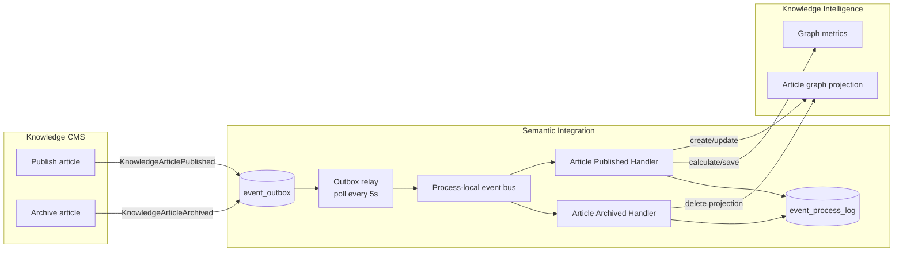
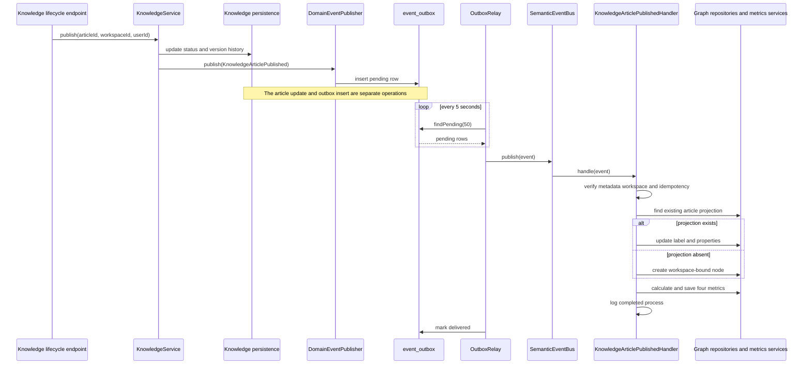
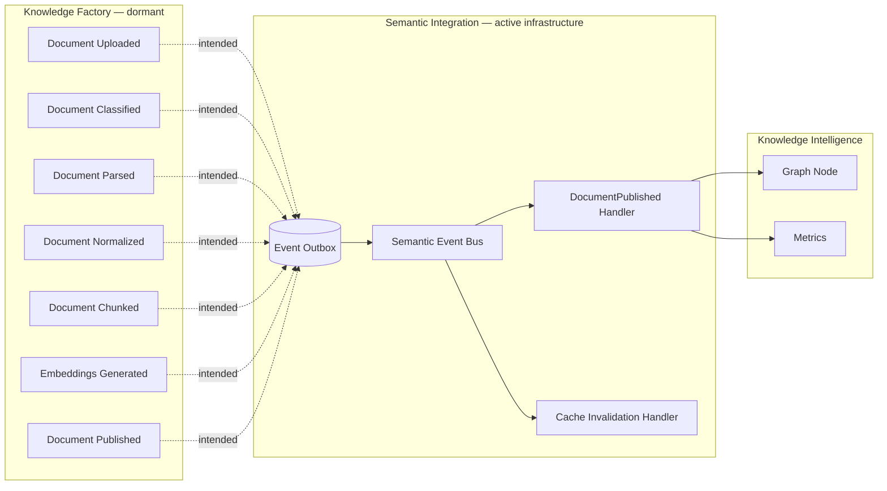

# Event Topology — Semantic Integration Layer

> **Runtime status (audited 2026-08-19):** the Knowledge CMS publish/archive flow is active. The Knowledge Factory document path shown below is dormant because `KnowledgeFactoryModule` is not registered. The current registry contains 14 event contracts and four registered handlers.

## Active Knowledge CMS flow



### Publish sequence



### Archive sequence

```mermaid
sequenceDiagram
    participant API as Knowledge lifecycle endpoint
    participant KS as KnowledgeService
    participant DP as DomainEventPublisher
    participant OB as event_outbox
    participant OR as OutboxRelay
    participant H as KnowledgeArticleArchivedHandler
    participant KI as GraphNodeRepository

    API->>KS: archive(articleId, workspaceId, userId)
    KS->>KS: update status and version history
    KS->>DP: publish(KnowledgeArticleArchived)
    DP->>OB: insert pending row
    OR->>H: dispatch through SemanticEventBus
    H->>H: verify metadata workspace and idempotency
    H->>KI: findByEntity(knowledge, articleId, workspaceId)
    alt scoped projection exists
        H->>KI: deleteByEntity(knowledge, articleId, workspaceId)
        Note over KI: one transaction explicitly deletes citations, then the node; edges and metrics cascade
    end
    H->>H: log completed process
    OR->>OB: mark delivered
```

## Dormant Knowledge Factory flow

The following source path exists but does not run in the current API module graph:



`DocumentPublishedHandler` and `CacheInvalidationHandler` are registered, but there is no active Factory producer while `KnowledgeFactoryModule` remains unimported.

## Event registry

| #   | Event                       | Intended/active source          | Current consumer                                       |
| --- | --------------------------- | ------------------------------- | ------------------------------------------------------ |
| 1   | `DocumentUploaded`          | Factory, dormant                | None                                                   |
| 2   | `DocumentClassified`        | Factory, dormant                | None                                                   |
| 3   | `DocumentParsed`            | Factory, dormant                | None                                                   |
| 4   | `DocumentNormalized`        | Factory, dormant                | None                                                   |
| 5   | `DocumentChunked`           | Factory, dormant                | None                                                   |
| 6   | `EmbeddingsGenerated`       | Factory, dormant                | None                                                   |
| 7   | `DocumentPublished`         | Factory, dormant                | `DocumentPublishedHandler`, `CacheInvalidationHandler` |
| 8   | `KnowledgeArticlePublished` | Knowledge CMS, active           | `KnowledgeArticlePublishedHandler`                     |
| 9   | `KnowledgeArticleArchived`  | Knowledge CMS, active           | `KnowledgeArticleArchivedHandler`                      |
| 10  | `GraphNodeCreated`          | Semantic Integration follow-up  | None                                                   |
| 11  | `GraphEdgesCreated`         | Semantic Integration follow-up  | None                                                   |
| 12  | `OntologyUpdated`           | Knowledge Intelligence contract | None                                                   |
| 13  | `MetricsCalculated`         | Semantic Integration follow-up  | None                                                   |
| 14  | `SearchIndexUpdated`        | Semantic Integration contract   | None                                                   |

## Domain event schema

```typescript
interface DomainEvent<T> {
  eventId: string;
  eventType: EventType;
  eventVersion: number;
  correlationId: string;
  causationId: string;
  tracingId: string;
  timestamp: string;
  source: string;
  data: T;
  metadata: {
    userId?: string;
    workspaceId: string;
    retryCount: number;
  };
}
```

## Delivery qualification

- `event_outbox` persists pending, delivered, failed, and dead-letter state.
- The relay polls up to 50 pending rows every five seconds.
- Relay-level exceptions are retried on a later fixed poll up to three attempts; exponential backoff is not implemented.
- Handlers maintain idempotency records in `event_process_log`.
- `SemanticEventBus` catches handler errors rather than propagating them. A failed handler can therefore be logged while the relay still marks the event delivered.
- Source updates and outbox inserts are separate operations.
- The bus is process-local; multiple API replicas do not share subscriptions.

These constraints mean the runtime is not currently a strict exactly-once or guaranteed-delivery implementation.
