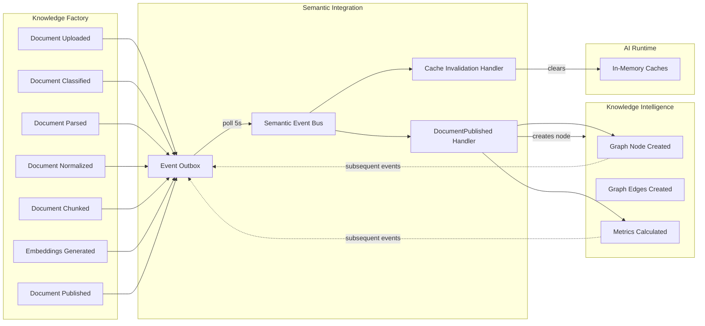
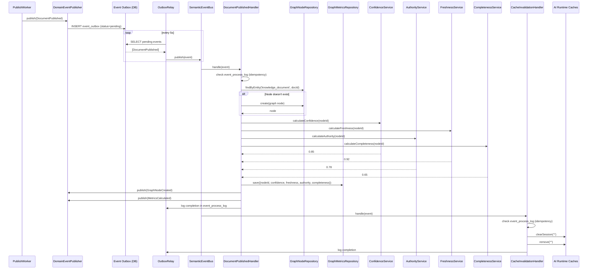

# Event Topology — Semantic Integration Layer

## Event Pipeline



## Document Published Event Flow



## Domain Event Schema

```typescript
interface DomainEvent<T> {
  eventId: string; // UUID v4
  eventType: EventType; // Enum: DocumentUploaded..SearchIndexUpdated
  eventVersion: number; // Schema version (starts at 1)
  correlationId: string; // Links all events from same document
  causationId: string; // Links to the causing event
  tracingId: string; // End-to-end trace
  timestamp: string; // ISO 8601
  source: string; // Module name
  data: T; // Typed payload
  metadata: {
    userId?: string;
    workspaceId: string;
    retryCount: number;
  };
}
```

## Outbox Table Schema

```sql
CREATE TABLE event_outbox (
  id              UUID PRIMARY KEY DEFAULT gen_random_uuid(),
  event_id        UUID NOT NULL UNIQUE,
  event_type      VARCHAR(50) NOT NULL,
  event_version   INT DEFAULT 1,
  correlation_id  UUID NOT NULL,
  causation_id    UUID,
  tracing_id      UUID NOT NULL,
  source          VARCHAR(50) NOT NULL,
  payload         JSONB NOT NULL,
  metadata        JSONB DEFAULT '{}',
  workspace_id    UUID NOT NULL,
  status          VARCHAR(20) DEFAULT 'pending',
  retry_count     INT DEFAULT 0,
  max_retries     INT DEFAULT 3,
  last_error      TEXT,
  created_at      TIMESTAMPTZ DEFAULT NOW(),
  last_attempt_at TIMESTAMPTZ
);

CREATE INDEX idx_outbox_status ON event_outbox(status, created_at);
CREATE INDEX idx_outbox_correlation ON event_outbox(correlation_id);
CREATE INDEX idx_outbox_workspace ON event_outbox(workspace_id);
```

## Event Chaining (Correlation)

When a document is processed through the pipeline, events form a chain:

```
DocumentUploaded (correlationId: A)
  └─ causationId: A
  └─ tracingId: T

DocumentPublished (correlationId: A, causationId: prev-event-id)
  └─ tracingId: T

GraphNodeCreated (correlationId: A, causationId: doc-published-event-id)
  └─ tracingId: T

MetricsCalculated (correlationId: A, causationId: doc-published-event-id)
  └─ tracingId: T
```

- All events for one document share the same `correlationId`
- Each event records what caused it via `causationId`
- `tracingId` is preserved end-to-end for distributed tracing
