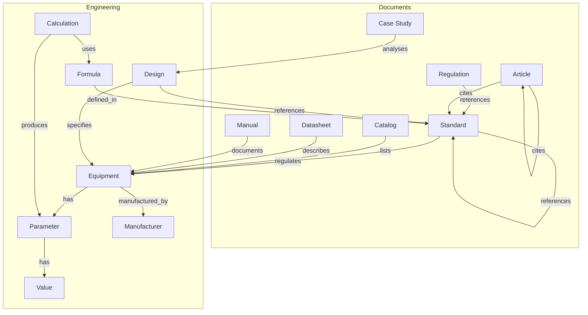

# هستان‌شناسی مهندسی — Engineering Ontology

**Version:** 1.0.0 | **Status:** Published | **Last Updated:** Tir 1405

---

## 1. Core Entity-Relationship Diagram



---

## 2. Entity Definitions

| Entity | FA | EN | Description |
|--------|----|----|-------------|
| `Standard` | استاندارد | A normative document issued by a standards body | `IEC 60909`, `IEEE 80` |
| `Equipment` | تجهیزات | Any electrical power system component | `Transformer 20/0.4 kV 1000 kVA` |
| `Parameter` | پارامتر | A measurable or qualifiable property of equipment | `Rated voltage`, `Impedance` |
| `Value` | مقدار | The specific numeric or categorical value of a parameter | `20 kV`, `Oil-immersed` |
| `Design` | طراحی | The engineering design process or output | `Substation earthing design per IEEE 80` |
| `Calculation` | محاسبه | A set of engineering computations | `Short-circuit calculation per IEC 60909` |
| `Formula` | فرمول | A mathematical expression for deriving values | `Ik" = c · Un / (√3 · Zk)` |
| `Manufacturer` | سازنده | An entity that produces electrical equipment | `Siemens`, `ABB`, `Schneider` |
| `Catalog` | کاتالوگ | A manufacturer listing of product offerings | `Siemens SIVACON S8 catalog` |
| `Datasheet` | دیتاشیت | Technical specifications for a single product | `ABB VD4 12 kV breaker datasheet` |
| `Case Study` | مطالعه موردی | A documented real-world engineering project | `Bakhtar Dam 230 kV substation case` |

---

## 3. Relationship Types

### 3.1 Hierarchical Relationships

| Subject | Predicate | Object | Type | Example |
|---------|-----------|--------|------|---------|
| `CircuitBreaker` | `is_a` | `Switchgear` | Inheritance | A vacuum circuit breaker IS A switchgear device |
| `IEEClass` | `subclass_of` | `Standard` | Specialization | IEC 60038 IS A SUBCLASS OF IEC standard |
| `RatedCurrent` | `is_property_of` | `CircuitBreaker` | Attribution | Rated current IS A PROPERTY OF circuit breaker |
| `HVSubstation` | `part_of` | `PowerSystem` | Composition | A 230 kV substation IS PART OF the transmission system |
| `ProtectionRelay` | `part_of` | `ProtectionSystem` | Composition | A numerical relay IS PART OF the protection system |

### 3.2 Associative Relationships

| Subject | Predicate | Object | Type | Example |
|---------|-----------|--------|------|---------|
| `IEC 60909` | `regulates` | `ShortCircuitStudy` | Regulation | IEC 60909 REGULATES short-circuit study methodology |
| `IEC 60076` | `regulates` | `PowerTransformer` | Regulation | IEC 60076 REGULATES power transformer testing |
| `TransformerDesign` | `references` | `IEC 60076` | Reference | A transformer design REFERENCES IEC 60076 |
| `ShortCircuitCalc` | `uses` | `Formula_IEC60909` | Usage | Short-circuit calculation USES IEC 60909 formula |
| `ManufacturerA` | `produces` | `Catalog_X` | Production | Siemens PRODUCES the SIVACON catalog |
| `Catalog` | `lists` | `Equipment` | Listing | A manufacturer catalog LISTS equipment models |
| `Article` | `cites` | `Standard` | Citation | A journal article CITES IEC standards |
| `Datasheet` | `describes` | `Equipment` | Description | A datasheet DESCRIBES a specific circuit breaker model |

### 3.3 Temporal Relationships

| Subject | Predicate | Object | Type | Example |
|---------|-----------|--------|------|---------|
| `IEC 60038:2021` | `supersedes` | `IEC 60038:2009` | Supersession | The 2021 edition SUPERSEDES the 2009 edition |
| `Doc_v2` | `version_of` | `Doc_v1` | Versioning | Version 2 IS A VERSION OF version 1 |
| `Doc_B` | `derived_from` | `Doc_A` | Derivation | A translated standard IS DERIVED FROM the original |
| `Reg_1404` | `precedes` | `Reg_1405` | Chronology | 1404 regulation PRECEDES 1405 regulation |

---

## 4. Property Types

### 4.1 Quantitative Properties

| Property | Domain | Unit | Datatype | Example |
|----------|--------|------|----------|---------|
| `rated_voltage` | Equipment | kV | Float | `20.0` |
| `rated_current` | Equipment | A | Float | `630.0` |
| `short_circuit_current` | Equipment | kA | Float | `25.0` |
| `impedance` | Transformer | % | Float | `6.0` |
| `power_rating` | Transformer/Generator | MVA | Float | `100.0` |
| `frequency` | System | Hz | Float | `50.0` |
| `soil_resistivity` | Grounding | Ω·m | Float | `100.0` |
| `cable_length` | Cable | m | Float | `150.0` |

### 4.2 Qualitative Properties

| Property | Domain | Values | Example |
|----------|--------|--------|---------|
| `winding_type` | Transformer | `copper`, `aluminum` | `copper` |
| `cooling_type` | Transformer | `ONAN`, `ONAF`, `OFAF`, `ODWF` | `ONAN` |
| `insulation_medium` | Switchgear | `SF6`, `vacuum`, `air`, `oil` | `vacuum` |
| `enclosure_type` | Panel | `indoor`, `outdoor` | `indoor` |
| `installation_type` | Cable | `buried`, `aerial`, `tray`, `conduit` | `tray` |

### 4.3 Relational Properties

| Property | Domain | Range | Example |
|----------|--------|-------|---------|
| `has_standard` | Equipment | Standard | `{equipment: MV_Cable} → has_standard → {standard: IEC 60502}` |
| `has_manufacturer` | Equipment | Manufacturer | `{equipment: CB_VD4} → has_manufacturer → {mfg: ABB}` |
| `has_formula` | Calculation | Formula | `{calc: SC_Study} → has_formula → {formula: IEC_60909_4a}` |
| `applies_to` | Standard | Equipment | `{standard: IEEE_80} → applies_to → {equipment: Grounding_Grid}` |

---

## 5. RDF Triple Representation

All relationships can be serialized as RDF triples:

```turtle
@prefix xen: <https://xennic.io/ontology/> .
@prefix rdf: <http://www.w3.org/1999/02/22-rdf-syntax-ns#> .
@prefix rdfs: <http://www.w3.org/2000/01/rdf-schema#> .

xen:IEC_60076 a xen:Standard ;
    xen:title "IEC 60076 Power Transformers" ;
    xen:regulates xen:PowerTransformer ;
    xen:supersedes xen:IEC_60076_2008 .

xen:PowerTransformer a xen:Equipment ;
    xen:hasParameter xen:RatedVoltage ;
    xen:hasParameter xen:RatedPower ;
    xen:manufacturedBy xen:Siemens .

xen:RatedVoltage a xen:Parameter ;
    xen:hasValue "20 kV" .
```

---

## 6. Ontology Governance Rules

1. All entities MUST have a UUID identifier and at least one label (FA or EN).
2. Relationships are directional; inverse relationships MAY be inferred (e.g., `supersedes` ↔ `superseded_by`).
3. New entity types require a governance amendment approved by the ontology review board.
4. Properties are inherited along the `is_a` hierarchy (e.g., if `Switchgear` has `rated_voltage`, then `CircuitBreaker` also has `rated_voltage`).
5. Cycles in `supersedes` are forbidden; a standard may not supersede its own superseder.
