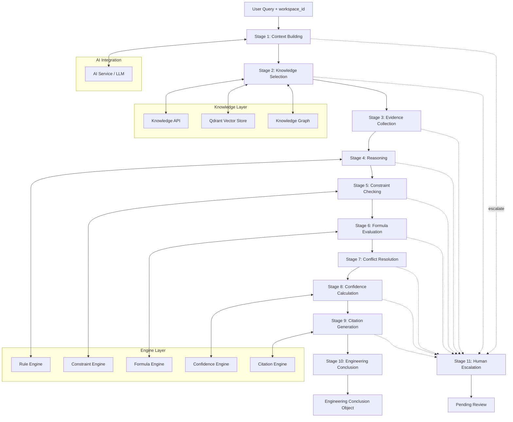

# رانتایم استدلال — Reasoning Runtime

**Version:** 1.0.0 | **Status:** Draft | **Last Updated:** Tir 1405

---

## Runtime Architecture Overview — نمای کلی معماری رانتایم

The Reasoning Runtime is an event-driven, stateful orchestration engine that transforms validated Engineering Knowledge Objects (EKOs) into Engineering Conclusions with evidence, confidence, and citations. It is the K2.5 layer in the Xennic knowledge architecture, consuming EKOs from K2.0 Acquisition Runtime and serving conclusions to K3.0 AI Consumption Layer.

| مشخصه | توضیح |
|-------|-------|
| **محرک** | Event-driven (مانند K2.0 Acquisition Runtime) |
| **وضعیت** | Stateful per reasoning session |
| **مدیر** | Reasoning Orchestrator |
| **ارتباط با** | AI Service, Knowledge API, Qdrant, Knowledge Graph, Rule Engine, Constraint Engine, Formula Engine, Confidence Engine, Citation Engine |

### Integrated Components — اجزای یکپارچه

| مؤلفه | نقش | پروتکل |
|-------|-----|--------|
| **AI Service** | LLM-based query understanding, entity extraction, language detection | gRPC / REST |
| **Knowledge API** | EKO retrieval, filtering, ranking | REST (internal) |
| **Qdrant** | Vector similarity search for semantic EKO retrieval | gRPC |
| **Knowledge Graph** | Graph traversal for relationship-based EKO discovery | SPARQL / REST |
| **Rule Engine** | IF-THEN rule application for Rule-Based Reasoning | Internal API |
| **Constraint Engine** | Constraint validation and satisfaction checking | Internal API |
| **Formula Engine** | Mathematical formula evaluation and calculation | Internal API |
| **Confidence Engine** | Multi-component confidence score computation | Internal API |
| **Citation Engine** | Formatted citation generation per source tier | Internal API |

---

## Runtime Stages — مراحل رانتایم

The Reasoning Orchestrator executes exactly 11 stages in sequence. Each stage consumes the output of the previous stage and may trigger Human Escalation.

### Stage 1: Context Building — ساخت زمینه

| مشخصه | توضیح |
|-------|-------|
| **ورودی** | User query + workspace_id + optional filters |
| **فرآیند** | Detect language, extract domain, identify entities and concepts |
| **خروجی** | Query context (domain, entities, concepts, constraints) |
| **یکپارچه‌سازی AI** | LLM for query understanding and entity extraction |

### Stage 2: Knowledge Selection — انتخاب دانش

| مشخصه | توضیح |
|-------|-------|
| **ورودی** | Query context |
| **فرآیند** | Search Knowledge API for relevant EKOs, rank by relevance |
| **روش‌های بازیابی** | Vector search (Qdrant), keyword search, graph traversal |
| **خروجی** | Ranked list of candidate EKOs with relevance scores |

### Stage 3: Evidence Collection — جمع‌آوری شواهد

| مشخصه | توضیح |
|-------|-------|
| **ورودی** | Candidate EKOs |
| **فرآیند** | Extract evidence nodes from selected EKOs, filter by relevance threshold |
| **خروجی** | Evidence set with confidence scores and source tiers |

### Stage 4: Reasoning — استدلال

| مشخصه | توضیح |
|-------|-------|
| **ورودی** | Evidence set |
| **فرآیند** | Apply reasoning mode (per reasoning-modes.md), build evidence chain |
| **زیرمراحل** | Deductive check, inductive pattern matching, abductive hypothesis generation, case-based retrieval |
| **خروجی** | Reasoning path (evidence chain DAG) |

### Stage 5: Constraint Checking — بررسی قیود

| مشخصه | توضیح |
|-------|-------|
| **ورودی** | Reasoning path |
| **فرآیند** | Validate against engineering constraints (per constraint-engine.md) |
| **خروجی** | Constraint validation results (pass / fail / flag) |

### Stage 6: Formula Evaluation — ارزیابی فرمول

| مشخصه | توضیح |
|-------|-------|
| **ورودی** | Reasoning path + constraints passed |
| **فرآیند** | Execute any required formulas (per formula-engine.md) |
| **خروجی** | Calculated values with formula references |

### Stage 7: Conflict Resolution — رفع تعارض

| مشخصه | توضیح |
|-------|-------|
| **ورودی** | Reasoning path + constraints + formula results |
| **فرآیند** | Check for conflicting evidence or conclusions, resolve per conflict-resolution.md |
| **خروجی** | Resolved conclusion path |

### Stage 8: Confidence Calculation — محاسبه اطمینان

| مشخصه | توضیح |
|-------|-------|
| **ورودی** | Resolved conclusion path |
| **فرآیند** | Calculate confidence per confidence-engine.md |
| **خروجی** | Final confidence score with breakdown |

### Stage 9: Citation Generation — تولید ارجاع

| مشخصه | توضیح |
|-------|-------|
| **ورودی** | Conclusion + evidence chain + confidence |
| **فرآیند** | Generate formatted citations per citation-engine.md |
| **خروجی** | Complete citation block |

### Stage 10: Engineering Conclusion Generation — تولید نتیجه مهندسی

| مشخصه | توضیح |
|-------|-------|
| **ورودی** | All above |
| **فرآیند** | Assemble final response: Answer + Reasoning Path + Evidence + Confidence + Limitations |
| **خروجی** | Engineering Conclusion object |

### Stage 11: Human Escalation — ارجاع به انسان

| مشخصه | توضیح |
|-------|-------|
| **ورودی** | Any stage can trigger escalation |
| **محرک‌ها** | Confidence < 0.3, conflicting Tier 1 sources, safety-critical query, incomplete evidence |
| **فرآیند** | Package context for human reviewer, queue for review |
| **خروجی** | Pending review status (reasoning paused) |

---

## Architecture Diagram — نمودار معماری

---

## Escalation Rules — قوانین ارجاع

| شرط | اقدام | وضعیت رانتایم |
|-----|-------|--------------|
| Overall confidence < 0.30 | Escalate to human | Paused |
| Tier 1 source conflicts | Escalate to human | Paused |
| Safety-critical query detected | Escalate to human | Paused |
| Evidence set is empty | Escalate to human | Paused |
| Constraint violation not resolvable | Flag + continue | Warning issued |
| Confidence 0.30–0.50 | Flag + continue | Low confidence warning |
| Confidence 0.50–0.75 | Continue with caveats | Moderate confidence |
| Confidence ≥ 0.75 | Continue directly | High confidence |

---

## Output Contract — قرارداد خروجی

Each Engineering Conclusion MUST contain:

| بخش | توضیح | الزام |
|-----|-------|-------|
| **Answer** | پاسخ مستقیم به سوال کاربر | الزامی |
| **Reasoning Path** | زنجیره استدلال گام‌به‌گام با حالت استدلال | الزامی |
| **Evidence** | شواهد مستند با تایر منبع و امتیاز بازیابی | الزامی |
| **Confidence** | امتیاز اطمینان نهایی با تفکیک مؤلفه‌ها | الزامی |
| **Limitations** | محدودیت‌های پاسخ و موارد پوشش‌داده‌نشده | الزامی |
