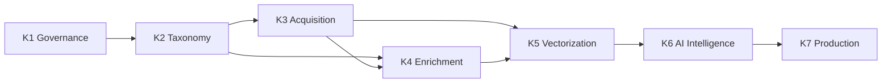

# Knowledge Roadmap — نقشه راه سامانه دانش

**آخرین بروزرسانی**: خرداد ۱۴۰۵ | **وضعیت**: برنامه‌ریزی | **فاز جاری**: K1

---

## Timeline Overview — نمای کلی زمان‌بندی

| فاز | عنوان | بازه پیشنهادی | وضعیت |
|-----|-------|---------------|-------|
| **K1** | Governance — حاکمیت داده | Q3 2026 | 🔄 در حال اجرا |
| **K2** | Taxonomy — طبقه‌بندی | Q3 2026 | 📋 برنامه‌ریزی |
| **K3** | Knowledge Acquisition — اکتساب دانش | Q3-Q4 2026 | 📋 برنامه‌ریزی |
| **K4** | Metadata Enrichment — غنی‌سازی متادیتا | Q4 2026 | 📋 برنامه‌ریزی |
| **K5** | Vectorization — برداری‌سازی | Q4 2026 | 📋 برنامه‌ریزی |
| **K6** | AI Intelligence Layer — لایه هوش مصنوعی | Q1 2027 | 📋 برنامه‌ریزی |
| **K7** | Production Deployment — استقرار تولید | Q1-Q2 2027 | 📋 برنامه‌ریزی |

---

## Phase K1 — Governance (حاکمیت داده)

**Objective**: ایجاد چارچوب حاکمیت داده برای تضمین کیفیت، قابلیت ردیابی و یکپارچگی دانش مهندسی.

| مورد | توضیح |
|------|-------|
| **هدف** | تعریف استانداردهای داده، متادیتا، تاکسونومی و آنتولوژی پیش از ورود داده |
| **دلایل نیاز** | بدون حاکمیت داده، دانش تبدیل به هرج‌ومرج می‌شود و قابلیت اعتماد ندارد |

### Key Deliverables

| شماره | تحویلی | توضیح |
|-------|--------|-------|
| K1.1 | `metadata-schema.md` | طراحی اسکیما و ساختار متادیتا برای تمام انواع اسناد |
| K1.2 | `taxonomy.md` | تاکسونومی مرجع (طبقه‌بندی سلسله‌مراتبی) |
| K1.3 | `ontology.md` | آنتولوژی مهندسی برق (روابط بین موجودیت‌ها) |
| K1.4 | `naming-conventions.md` | قراردادهای نام‌گذاری فایل‌ها، IDها و فیلدها |
| K1.5 | `data-quality-policy.md` | سیاست کیفیت داده (صحت، کامل بودن، یکتایی) |
| K1.6 | `source-hierarchy.md` | سلسله‌مراتب منابع و اولویت‌بندی اعتبار آنها |

**Dependencies**:
- دانش دامنه‌ای مهندسی برق (تیم فنی)
- خروجی جلسات معماری Xennic

**Success Criteria**:
- تصویب تمام ۶ سند توسط تیم فنی
- وجود schema registry برای validation
- ابزارهای بررسی کیفیت در CI/CD

**Estimated Effort**: ۲-۳ هفته (۲ نفر)

---

## Phase K2 — Taxonomy (طبقه‌بندی)

**Objective**: ایجاد ساختار طبقه‌بندی چندبعدی برای دسته‌بندی و جستجوی دانش مهندسی.

| مورد | توضیح |
|------|-------|
| **هدف** | طراحی taxonomy tree قابل استفاده در Prisma (`categories`, `topics`, `disciplines`, `tags`) |

### Key Deliverables

| شماره | تحویلی | توضیح |
|-------|--------|-------|
| K2.1 | Domain Classification Tree | درخت طبقه‌بندی دامنه‌های مهندسی برق |
| K2.2 | Equipment Taxonomy | طبقه‌بندی تجهیزات (موتور، ترانس، کابل، تابلو، رله و ...) |
| K2.3 | Standards Taxonomy | طبقه‌بندی استانداردها (IEC, ISIRI, ISO و ...) |
| K2.4 | Document Type Taxonomy | طبقه‌بندی انواع سند (کاتالوگ، دیتاشیت، استاندارد، مقاله و ...) |

**Dependencies**:
- فاز K1 (Governance) — ساختارهای متادیتا و naming conventions
- مشارکت مهندسان برق برای validation taxonomy

**Success Criteria**:
- taxonomy tree کامل با حداقل ۱۰۰ گره
- قابلیت import به Prisma و Qdrant
- پشتیبانی از multi-label classification

**Estimated Effort**: ۲ هفته (۱ نفر)

---

## Phase K3 — Knowledge Acquisition (اکتساب دانش)

**Objective**: ایجاد لوله‌های ورود خودکار داده (Ingestion Pipelines) برای جمع‌آوری اسناد از منابع مختلف.

| مورد | توضیح |
|------|-------|
| **هدف** | اتوماسیون فرآیند جمع‌آوری استانداردها، تعرفه‌ها و کاتالوگ‌ها |

### Key Deliverables

| شماره | تحویلی | توضیح |
|-------|--------|-------|
| K3.1 | Standards Ingestion Pipeline | لوله ورود استانداردهای IEC, ISIRI, ISO |
| K3.2 | Tariff Ingestion Pipeline | لوله ورود تعرفه‌های برق (مصوب وزارت نیرو و بین‌الملل) |
| K3.3 | Manufacturer Catalog Scraper | خزش خودکار کاتالوگ‌های کارخانجات |
| K3.4 | Document Parsing Infrastructure | زیرساخت پارس کردن (PDF, DOCX, HTML, XML) |
| K3.5 | OCR Integration | اتصال به Vision Service برای OCR کاتالوگ‌های تصویری |

**Dependencies**:
- فاز K2 (Taxonomy) — برای برچسب‌زنی خودکار اسناد ورودی
- Vision Service موجود (پورت ۸۰۰۳)
- RabbitMQ برای صف‌بندی ingestion jobs
- MinIO/S3 برای ذخیره فایل‌های خام

**Success Criteria**:
- ingestion pipeline حداقل ۵۰ سند را بدون خطا پردازش کند
- پوشش OCR برای اسناد تصویری (دقت > ۹۰٪)
- قابلیت schedule روزانه/هفتگی برای خزش

**Estimated Effort**: ۴-۶ هفته (۲ نفر)

---

## Phase K4 — Metadata Enrichment (غنی‌سازی متادیتا)

**Objective**: استخراج خودکار metadata از محتوای اسناد و غنی‌سازی آنها برای جستجوی بهتر.

| مورد | توضیح |
|------|-------|
| **هدف** | خودکارسازی برچسب‌زنی، استخراج موجودیت‌ها و امتیازدهی کیفیت |

### Key Deliverables

| شماره | تحویلی | توضیح |
|-------|--------|-------|
| K4.1 | Auto-Tagging Pipeline | برچسب‌زنی خودکار بر اساس taxonomy |
| K4.2 | Multi-Label Classification | طبقه‌بندی چندبرچسبی (یک سند می‌تواند به چند دسته تعلق داشته باشد) |
| K4.3 | Entity Extraction | استخراج موجودیت‌ها (نام کارخانه، مدل، ولتاژ، جریان و ...) |
| K4.4 | Relationship Mapping | نگاشت روابط بین اسناد (یک کاتالوگ به چه استانداردی ارجاع می‌دهد؟) |
| K4.5 | Quality Scoring | امتیازدهی کیفیت سند بر اساس کامل بودن metadata و صحت |

**Dependencies**:
- فاز K2 (Taxonomy) — برای auto-tagging
- فاز K3 (Acquisition) — برای داشتن داده
- AI Service (LLM) برای extraction

**Success Criteria**:
- دقت auto-tagging > ۸۵٪
- دقت entity extraction > ۸۰٪
- quality score pipeline قابلیت flag کردن اسناد بی‌کیفیت را داشته باشد

**Estimated Effort**: ۳-۴ هفته (۲ نفر)

---

## Phase K5 — Vectorization (برداری‌سازی)

**Objective**: تبدیل اسناد به embedding بردار برای جستجوی معنایی و RAG.

| مورد | توضیح |
|------|-------|
| **هدف** | ایندکس کردن تمام دانش در Qdrant با استراتژی chunking بهینه |

### Key Deliverables

| شماره | تحویلی | توضیح |
|-------|--------|-------|
| K5.1 | Embedding Pipeline | لوله embedding با Sentence Transformers |
| K5.2 | Chunking Strategy | استراتژی chunk کردن (بر اساس سرفصل، پاراگراف، پنجره لغزشی) |
| K5.3 | Vector DB Indexing | ایندکس کردن در Qdrant با metadata filtering |
| K5.4 | Hybrid Search | جستجوی ترکیبی (بردار + BM25/keyword) |
| K5.5 | Re-Ranking | مرتب‌سازی مجدد نتایج با cross-encoder |

**Dependencies**:
- فاز K3 (Acquisition) و K4 (Enrichment) — داده غنی‌شده
- Qdrant در حال اجرا
- مدل embedding مناسب (چندزبانه)

**Success Criteria**:
- زمان جستجوی زیر ۲۰۰ms برای ۱۰۰٬۰۰۰ chunk
- Recall@10 > ۰٫۹۰
- پشتیبانی از metadata filtering (تاریخ، کارخانه، استاندارد)

**Estimated Effort**: ۳-۴ هفته (۱-۲ نفر)

---

## Phase K6 — AI Intelligence Layer (لایه هوش مصنوعی)

**Objective**: پیاده‌سازی چارچوب استدلال مبتنی بر شواهد برای پاسخ‌های دقیق و قابل اعتماد.

| مورد | توضیح |
|------|-------|
| **هدف** | AI که هرگز بدون ارجاع به منبع پاسخ نمی‌دهد و زنجیره استدلال خود را نمایش می‌دهد |

### Key Deliverables

| شماره | تحویلی | توضیح |
|-------|--------|-------|
| K6.1 | Source-of-Truth Enforcement | اجبار به استفاده از دانش ایندکس‌شده و محدودیت دانش LLM عمومی |
| K6.2 | Reasoning Framework | چارچوب استدلال گام‌به‌گام (Chain-of-Thought + Source Verification) |
| K6.3 | Evidence Chain | زنجیره شواهد — نمایش مسیر از سوال تا پاسخ با ارجاع به بخش‌های سند |
| K6.4 | Confidence Scoring | امتیازدهی اطمینان به پاسخ بر اساس تعداد و کیفیت منابع |
| K6.5 | Hallucination Prevention | مکانیزم‌های جلوگیری از توهم (self-consistency check, source grounding) |

**Dependencies**:
- فاز K5 (Vectorization) — برای دسترسی به embedding و جستجو
- AI Service با LLM
- فاز K1 (Source Hierarchy) — برای اولویت‌بندی منابع

**Success Criteria**:
- ۱۰۰٪ پاسخ‌ها دارای حداقل یک ارجاع به منبع
- کاهش hallucination به زیر ۵٪
- confidence score با correlation > ۰٫۸ با ارزیابی انسانی

**Estimated Effort**: ۴-۶ هفته (۲ نفر)

---

## Phase K7 — Production Deployment (استقرار تولید)

**Objective**: آماده‌سازی سامانه دانش برای بار واقعی، مقیاس‌پذیری و بهره‌برداری مداوم.

| مورد | توضیح |
|------|-------|
| **هدف** | سامانه‌ای پایدار، مقیاس‌پذیر و قابل مشاهده که به صورت ۲۴/۷ کار می‌کند |

### Key Deliverables

| شماره | تحویلی | توضیح |
|-------|--------|-------|
| K7.1 | Scaling Strategy | استراتژی مقیاس‌پذیری (horizontal scaling Qdrant, embedding cache, CDN) |
| K7.2 | Monitoring & Observability | Prometheus metrics, Grafana dashboards, logging (ELK/Loki) |
| K7.3 | Continuous Ingestion Pipeline | لوله ورود مداوم داده با scheduler و retry mechanism |
| K7.4 | Feedback Loop | حلقه بازخورد — کاربران می‌توانند کیفیت پاسخ را ارزیابی کنند |
| K7.5 | Performance Optimization | بهینه‌سازی latency, throughput, cache hit ratio |

**Dependencies**:
- تمام فازهای K1-K6
- زیرساخت Docker/Kubernetes
- ابزارهای monitoring (Prometheus + Grafana)

**Success Criteria**:
- SLA ۹۹٫۹٪ uptime
- P95 latency < ۵۰۰ms برای جستجو + RAG
- توانایی پردازش ۱۰۰۰ سند در روز
- feedback loop با نرخ مشارکت > ۱۰٪

**Estimated Effort**: ۴-۶ هفته (۲ نفر)

---

## Dependency Graph — گراف وابستگی فازها

---

## Resource Summary — خلاصه منابع

| فاز | نفر-هفته | وابسته به | ریسک |
|-----|----------|-----------|------|
| K1 | ۴-۶ | — | کم |
| K2 | ۲ | K1 | کم |
| K3 | ۸-۱۲ | K2 | متوسط (کیفیت OCR) |
| K4 | ۶-۸ | K2, K3 | متوسط (دقت extraction) |
| K5 | ۳-۶ | K3, K4 | متوسط (کیفیت embedding) |
| K6 | ۸-۱۲ | K5 | بالا (کیفیت reasoning) |
| K7 | ۸-۱۲ | K1-K6 | کم (اگر فازهای قبل درست انجام شوند) |

---

> این نقشه راه بر اساس معماری `KNOWLEDGE_PLATFORM.md` و نیازمندی‌های محصول Xennic تهیه شده است. اولویت‌بندی ممکن است بر اساس بازخورد کاربران و نیازمندی‌های کسب‌وکار تغییر کند.
