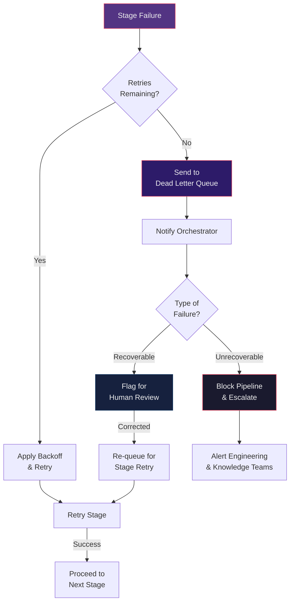

# چرخه حیات سند — Document Lifecycle

**Version:** 1.0.0 | **Status:** Draft | **Last Updated:** Tir 1405

---

## 1. Document Received — دریافت سند

| Property | Value |
|----------|-------|
| **Purpose** | Accept a raw engineering document from any ingestion source and register it in the system |
| **Inputs** | Binary file, metadata stub (source, tier, document type, language) |
| **Outputs** | Acknowledged document with unique tracking ID; initial lifecycle record in PostgreSQL |
| **Dependencies** | Ingestion Service, PostgreSQL |
| **Quality Gates** | Format check (allowed MIME types), size check (< 100 MB), malware scan pass |
| **Retry Policy** | No retry on format/size rejection; network failures retry 3× with exponential backoff |
| **Failure Conditions** | Unsupported format → reject with error code; oversized → reject with suggestion; malware detected → quarantine and alert |
| **Responsible Component** | Ingestion Service |

---

## 2. Virus Scan — اسکن ویروس

| Property | Value |
|----------|-------|
| **Purpose** | Ensure the document is safe before any processing begins |
| **Inputs** | Binary file, tracking ID |
| **Outputs** | Clean bill of health or quarantine alert |
| **Dependencies** | ClamAV or equivalent antivirus engine |
| **Quality Gates** | Scan must complete with zero threats detected |
| **Retry Policy** | Scan timeout > 60 s → retry 2×; persistent failure → escalate |
| **Failure Conditions** | Threat detected → quarantine, notify security, block pipeline; scan engine unavailable → retry, escalate after 3 failures |
| **Responsible Component** | Ingestion Service (delegates to antivirus engine) |

---

## 3. Integrity Verification — تأیید یکپارچگی

| Property | Value |
|----------|-------|
| **Purpose** | Verify the document is not corrupted and matches its declared checksum |
| **Inputs** | Binary file, expected checksum (SHA-256), tracking ID |
| **Outputs** | Integrity verified or corruption detected |
| **Dependencies** | Object Storage (MinIO) for checksum retrieval |
| **Quality Gates** | Computed checksum must match expected checksum; for PDF documents, structure validation via PDF/A compliance check |
| **Retry Policy** | Retry 2× with fresh checksum computation |
| **Failure Conditions** | Checksum mismatch → reject as corrupted; file format inconsistent with extension → flag for manual review; PDF/A non-compliance → log warning, proceed |
| **Responsible Component** | Ingestion Service |

---

## 4. OCR — تشخیص نویسه نوری

| Property | Value |
|----------|-------|
| **Purpose** | Extract machine-readable text from scanned documents and images |
| **Inputs** | Image/scanned PDF, tracking ID, language hint |
| **Outputs** | Extracted text with per-page layout metadata, OCR confidence per segment |
| **Dependencies** | Vision Service (gRPC), AI Service for advanced OCR (handwriting, low-quality scans) |
| **Quality Gates** | OCR confidence per page > 0.7 (configurable per tier); minimum text coverage > 60% of estimated page content |
| **Retry Policy** | Confidence below threshold → retry with enhanced preprocessing (deskew, denoise, contrast); max 3 retries |
| **Failure Conditions** | All retries exhausted → flag as unable-to-OCR, human review; Vision Service unavailable → queue for later processing |
| **Responsible Component** | OCR Service |

---

## 5. Parser — تجزیه سند

| Property | Value |
|----------|-------|
| **Purpose** | Parse the document format into a standardised internal structured representation |
| **Inputs** | Raw file (PDF, DOCX, HTML, Markdown, TXT), tracking ID, format hint |
| **Outputs** | Parsed document tree with sections, headings, tables, paragraphs, lists, code blocks |
| **Dependencies** | Parser Service (format-specific parsers), Object Storage (MinIO) |
| **Quality Gates** | Parsing success (no structural errors); section hierarchy depth preserved; table structure extracted with cell boundaries |
| **Retry Policy** | Parsing failure → retry with alternate parser library; max 2 retries |
| **Failure Conditions** | Unparseable format → escalate to engineering team; partial parse (e.g., corrupted PDF) → extract what is possible, flag remainder |
| **Responsible Component** | Parser Service |

---

## 6. Cleaning — پالایش متن

| Property | Value |
|----------|-------|
| **Purpose** | Remove OCR artifacts, normalise whitespace, fix encoding errors, standardise line endings |
| **Inputs** | Parsed document tree, tracking ID |
| **Outputs** | Clean, normalised text with structural markers preserved |
| **Dependencies** | Processing Service (cleaning module) |
| **Quality Gates** | Encoding validated (UTF-8); no control characters in content text; whitespace normalised to single spaces |
| **Retry Policy** | Not applicable (deterministic operation) |
| **Failure Conditions** | Encoding detection failure → try all common encodings, flag if ambiguous; excessive artifact ratio > 10% → flag for human review |
| **Responsible Component** | Processing Service |

---

## 7. Metadata Builder — ساخت فراداده

| Property | Value |
|----------|-------|
| **Purpose** | Construct full metadata record per `governance/metadata-schema.md` |
| **Inputs** | Clean document content, tracking ID, initial metadata stub, parsed structure |
| **Outputs** | Complete metadata record with Core, Electrical Engineering, AI Intelligence, RAG, and Traceability fields |
| **Dependencies** | Metadata Service, PostgreSQL (for existing metadata validation) |
| **Quality Gates** | All required fields populated; field types and constraints validated against schema; source tier reflected in citation fields |
| **Retry Policy** | Schema validation failure → reapply defaults for optional fields; 1 retry |
| **Failure Conditions** | Required fields cannot be determined → escalate for manual metadata entry; schema version mismatch → migrate or reject |
| **Responsible Component** | Metadata Service |

---

## 8. Concept Extraction — استخراج مفهوم

| Property | Value |
|----------|-------|
| **Purpose** | Identify engineering concepts present in the document text and map them to the canonical concept registry |
| **Inputs** | Clean document content, metadata record, tracking ID |
| **Outputs** | List of identified concepts with concept IDs (where resolvable), confidence scores, and source segments |
| **Dependencies** | Concept Resolver, AI Service (LLM-based concept identification), `concepts/canonical-concepts.md` |
| **Quality Gates** | Each extracted concept must have confidence > 0.6; unresolved concepts flagged for manual mapping |
| **Retry Policy** | AI Service timeout → retry 2× with reduced batch size |
| **Failure Conditions** | AI Service persistently unavailable → fall back to keyword-based extraction; concept registry lookup fails → flag unmapped |
| **Responsible Component** | Concept Resolver |

---

## 9. Ontology Resolution — تفکیک هستی‌شناسی

| Property | Value |
|----------|-------|
| **Purpose** | Map extracted concepts to ontology entities defined in the governance ontology |
| **Inputs** | Extracted concepts, metadata record, tracking ID |
| **Outputs** | Ontology-mapped entities with entity IDs, type assignments, and property mappings |
| **Dependencies** | Concept Resolver, `governance/ontology.md`, `concepts/engineering-entities.md` |
| **Quality Gates** | Every extracted concept resolves to at most one ontology entity; entity types are valid per ontology schema |
| **Retry Policy** | Not applicable (deterministic mapping after concept extraction) |
| **Failure Conditions** | Concept-to-ontology ambiguity → flag for manual disambiguation; unmapped concept → log warning, proceed without ontology link |
| **Responsible Component** | Concept Resolver |

---

## 10. Semantic Resolution — تفکیک معنایی

| Property | Value |
|----------|-------|
| **Purpose** | Resolve terms and phrases to canonical semantic forms using the engineering semantic layer |
| **Inputs** | Clean document content, extracted concepts, ontology entities, tracking ID |
| **Outputs** | Semantically resolved document with synonyms normalised, acronyms expanded, units normalised, and vocabulary unified |
| **Dependencies** | Semantic Resolution module, AI Service, `semantics/engineering-vocabulary.md`, `semantics/acronym-dictionary.md`, `semantics/unit-normalization.md` |
| **Quality Gates** | Acronym expansion confidence > 0.8; unit conversion validated bidirectionally; no unresolved high-value terms remain |
| **Retry Policy** | AI Service semantic enrichment timeout → retry 2× with smaller segments |
| **Failure Conditions** | Term ambiguity > 3 candidates → flag for human resolution; unit conversion impossible → flag with original value and suggested alternatives |
| **Responsible Component** | Processing Service (Semantic Resolution module) |

---

## 11. Entity Extraction — استخراج موجودیت

| Property | Value |
|----------|-------|
| **Purpose** | Extract engineering entities — equipment types, standards, manufacturers, voltage levels, cable types, protection devices |
| **Inputs** | Semantically resolved document, tracking ID |
| **Outputs** | Extracted entities with type classification, canonical name, confidence score, and source segment references |
| **Dependencies** | Entity Extractor, AI Service, `concepts/engineering-entities.md` |
| **Quality Gates** | Entity type must be a valid engineering entity type per entity model; each entity must have confidence > 0.65; duplicate entities merged |
| **Retry Policy** | AI Service extraction timeout → retry 2× with smaller batches |
| **Failure Conditions** | Entity type cannot be classified → flag as generic entity; entity confidence persistently low → flag for human validation |
| **Responsible Component** | Entity Extractor |

---

## 12. Relationship Extraction — استخراج رابطه

| Property | Value |
|----------|-------|
| **Purpose** | Extract typed relationships between extracted entities |
| **Inputs** | Extracted entities, semantically resolved document, tracking ID |
| **Outputs** | Typed relationships with source entity, target entity, relationship type, direction, weight, and confidence |
| **Dependencies** | Relationship Extractor, AI Service, `concepts/engineering-relations.md` |
| **Quality Gates** | Relationship type must be valid per relation taxonomy; relationship must connect two known entities; confidence > 0.6 |
| **Retry Policy** | AI Service extraction timeout → retry 2× with reduced context window |
| **Failure Conditions** | Relationship between unknown entities → flag orphan relationship; relationship type unclear → flag ambiguous; self-referencing relationship → reject |
| **Responsible Component** | Relationship Extractor |

---

## 13. Engineering Validation — اعتبارسنجی مهندسی

| Property | Value |
|----------|-------|
| **Purpose** | Validate extracted knowledge against engineering rules, source hierarchy compliance, and tier-appropriate citation requirements |
| **Inputs** | Extracted entities, relationships, concepts, metadata record, tracking ID |
| **Outputs** | Validation report with pass/fail per rule; overall engineering validation score |
| **Dependencies** | Validation Service, `governance/source-hierarchy.md`, `governance/taxonomy.md`, `concepts/concept-model.md` |
| **Quality Gates** | All Tier 1 sources must have full-text citations; Tier 2+ sources must have at minimum standard/section reference; no contradictory attributions |
| **Retry Policy** | Not applicable (deterministic validation) |
| **Failure Conditions** | Source tier mismatch → fail with citation instructions; contradictory entity attributes → fail with conflict report; missing required citations → fail with gap analysis |
| **Responsible Component** | Validation Service |

---

## 14. Knowledge Validation — اعتبارسنجی دانش

| Property | Value |
|----------|-------|
| **Purpose** | Validate knowledge completeness and consistency by cross-referencing with the existing knowledge base |
| **Inputs** | Validated engineering output, metadata record, tracking ID, existing knowledge base references |
| **Outputs** | Knowledge validation score; list of conflicts, duplicates, and gaps identified |
| **Dependencies** | Validation Service, PostgreSQL, Qdrant, Knowledge Graph, Knowledge API |
| **Quality Gates** | No unresolved conflicts with existing knowledge; duplicate concepts merged consistently; coverage completeness > 80% for expected entity types |
| **Retry Policy** | Not applicable (deterministic validation) |
| **Failure Conditions** | Critical conflict with existing knowledge → block publication, flag for curator review; excessive duplication > 50% overlap → flag for merge evaluation; coverage gap critical → supplement with automated search before publication |
| **Responsible Component** | Validation Service |

---

## 15. Chunk Generation — تولید قطعه

| Property | Value |
|----------|-------|
| **Purpose** | Split the processed document into optimal-sized chunks for RAG retrieval |
| **Inputs** | Clean document content with structural markers, metadata record, tracking ID |
| **Outputs** | Ordered list of chunks with chunk IDs, content, structural context, and overlap regions |
| **Dependencies** | Chunk Generator, document type-specific chunk strategy configuration |
| **Quality Gates** | Chunk size within configured bounds (256–1024 tokens default); chunk boundaries respect section/paragraph boundaries; overlap regions preserved for context continuity |
| **Retry Policy** | Not applicable (deterministic operation) |
| **Failure Conditions** | Chunk size violation → adjust strategy and re-chunk; structural markers missing → fall back to sliding window with warning |
| **Responsible Component** | Chunk Generator |

---

## 16. Embedding Generation — تولید Embedding

| Property | Value |
|----------|-------|
| **Purpose** | Generate vector embeddings for each chunk using the configured embedding model |
| **Inputs** | Chunks with content and metadata, tracking ID, embedding model identifier |
| **Outputs** | Vector embeddings with metadata tags; embedding dimension and model version recorded |
| **Dependencies** | Embedding Service, AI Service (model inference), Qdrant (dimension validation) |
| **Quality Gates** | Embedding dimension matches target model; embedding values within valid range; no zero/null vectors |
| **Retry Policy** | Embedding computation failure → retry 3× with exponential backoff; GPU OOM → reduce batch size and retry |
| **Failure Conditions** | Model dimension mismatch → flag configuration error; persistent embedding failure → escalate to AI Service team; zero vector produced → flag chunk content as problematic |
| **Responsible Component** | Embedding Service |

---

## 17. Vector Publishing — انتشار برداری

| Property | Value |
|----------|-------|
| **Purpose** | Write embeddings and associated metadata to Qdrant vector database |
| **Inputs** | Embeddings with chunk IDs, metadata, tracking ID |
| **Outputs** | Confirmed upsert in Qdrant; vector count and dimension verified |
| **Dependencies** | Publication Service, Qdrant (gRPC) |
| **Quality Gates** | Embedding dimension matches collection schema; upsert confirmed with no errors; point count matches chunk count |
| **Retry Policy** | Upsert failure → retry 3× with exponential backoff; connection failure → queue for later batch publication |
| **Failure Conditions** | Dimension mismatch → fail with collection schema details; partial upsert → retry remaining points; Qdrant unavailable → queue, escalate after 5 minutes |
| **Responsible Component** | Publication Service |

---

## 18. Graph Publishing — انتشار گراف

| Property | Value |
|----------|-------|
| **Purpose** | Write entities as nodes and relationships as edges to the knowledge graph |
| **Inputs** | Extracted entities (nodes), relationships (edges), metadata record, tracking ID |
| **Outputs** | Confirmed graph write with node/edge IDs; graph transaction committed |
| **Dependencies** | Publication Service, Neo4j/Age (Bolt protocol) |
| **Quality Gates** | All entities written as nodes with required properties; all relationships written as directed edges with type and weight; no duplicate nodes created (merge on canonical ID) |
| **Retry Policy** | Transaction conflict → retry 2×; connection failure → queue for batch sync |
| **Failure Conditions** | Node property missing → fail with property schema; edge references non-existent node → fail orphan edge; graph constraint violation → fail with constraint details |
| **Responsible Component** | Publication Service |

---

## 19. Knowledge Publication — انتشار دانش

| Property | Value |
|----------|-------|
| **Purpose** | Make the validated knowledge object available via the Knowledge API for consumption by applications |
| **Inputs** | Complete knowledge object (metadata, chunks, entities, relationships, confidence scores), tracking ID |
| **Outputs** | Published knowledge object with status set to Published; cache invalidation triggered; search index updated |
| **Dependencies** | Publication Service, Knowledge API (NestJS), PostgreSQL, search engine (e.g., Meilisearch/Elasticsearch) |
| **Quality Gates** | Knowledge object status transitioned from validated → published; API returns 200 on retrieval; search index includes new object |
| **Retry Policy** | API publication failure → retry 3× with exponential backoff; cache invalidation failure → log warning, continue |
| **Failure Conditions** | Knowledge API unavailable → queue publication, escalate after 5 minutes; search index update failure → publish to API only, flag for search sync; partial publication → roll back and retry from last checkpoint |
| **Responsible Component** | Publication Service |

---

## 20. Monitoring — پایش

| Property | Value |
|----------|-------|
| **Purpose** | Post-publication quality monitoring to ensure knowledge objects remain valid and effective |
| **Inputs** | Published knowledge object ID, usage metrics, retrieval logs, user feedback signals |
| **Outputs** | Monitoring dashboard updates; alerts for quality drift; periodic quality reports |
| **Dependencies** | Monitoring Service, PostgreSQL (usage logs), Qdrant (retrieval metrics), Knowledge API (access logs) |
| **Quality Gates** | Retrieval success rate > 95%; average confidence score stable within ±5% of publication baseline; no negative user feedback spikes |
| **Retry Policy** | Not applicable (continuous monitoring) |
| **Failure Conditions** | Confidence drift > 10% → flag for re-validation; retrieval success rate < 85% → trigger re-chunking and re-embedding; user complaints > threshold → alert knowledge curator |
| **Responsible Component** | Orchestrator |

---

## 21. Lifecycle Management — مدیریت چرخه حیات

| Property | Value |
|----------|-------|
| **Purpose** | Manage ongoing updates, versioning, deprecation, and scheduled review of published knowledge objects |
| **Inputs** | Published knowledge object ID, trigger event (new document version, standard update, scheduled review, user feedback) |
| **Outputs** | Updated knowledge object with new version; deprecated object with supersession link; review-required flag |
| **Dependencies** | Orchestrator, PostgreSQL, Knowledge API, Event Bus |
| **Quality Gates** | Version increment follows SemVer; deprecation preserves access to previous version via version history; scheduled review completed within review window |
| **Retry Policy** | Not applicable (trigger-based operations) |
| **Failure Conditions** | Version conflict → block, manual resolution required; deprecation cascade failure → roll back, notify curator; missed review deadline → escalate to knowledge management team |
| **Responsible Component** | Orchestrator |

---

## Lifecycle Summary — خلاصه چرخه حیات

| Stage | Name | Phase | Component | Quality Gate |
|-------|------|-------|-----------|--------------|
| 1 | Document Received | Ingestion | Ingestion Service | Format, size, malware check |
| 2 | Virus Scan | Ingestion | Ingestion Service | Zero threats |
| 3 | Integrity Verification | Ingestion | Ingestion Service | Checksum match |
| 4 | OCR | Processing | OCR Service | Confidence > 0.7 |
| 5 | Parser | Processing | Parser Service | No structural errors |
| 6 | Cleaning | Processing | Processing Service | UTF-8, whitespace normalised |
| 7 | Metadata Builder | Processing | Metadata Service | All required fields |
| 8 | Concept Extraction | Processing | Concept Resolver | Confidence > 0.6 |
| 9 | Ontology Resolution | Processing | Concept Resolver | One-to-one mapping |
| 10 | Semantic Resolution | Processing | Processing Service | Acronym confidence > 0.8 |
| 11 | Entity Extraction | Processing | Entity Extractor | Confidence > 0.65 |
| 12 | Relationship Extraction | Processing | Relationship Extractor | Confidence > 0.6 |
| 13 | Engineering Validation | Validation | Validation Service | Tier compliance, no conflicts |
| 14 | Knowledge Validation | Validation | Validation Service | No conflicts, coverage > 80% |
| 15 | Chunk Generation | Publication | Chunk Generator | Size 256–1024 tokens |
| 16 | Embedding Generation | Publication | Embedding Service | Dimension match, no zero vectors |
| 17 | Vector Publishing | Publication | Publication Service | Upsert confirmed |
| 18 | Graph Publishing | Publication | Publication Service | All nodes and edges written |
| 19 | Knowledge Publication | Publication | Publication Service | Status → Published, 200 OK |
| 20 | Monitoring | Post-Publication | Orchestrator | Retrieval > 95%, stable confidence |
| 21 | Lifecycle Management | Post-Publication | Orchestrator | SemVer, review deadlines met |

---

## Lifecycle Diagram — نمودار چرخه حیات

```mermaid
graph LR
    S1[1. Document Received] --> S2[2. Virus Scan]
    S2 --> S3[3. Integrity Verification]
    S3 --> S4{Scan/Image?}
    S4 -->|Yes| S5[4. OCR]
    S4 -->|No| S6[5. Parser]
    S5 --> S6
    S6 --> S7[6. Cleaning]
    S7 --> S8[7. Metadata Builder]
    S8 --> S9[8. Concept Extraction]
    S9 --> S10[9. Ontology Resolution]
    S10 --> S11[10. Semantic Resolution]
    S11 --> S12[11. Entity Extraction]
    S12 --> S13[12. Relationship Extraction]
    S13 --> S14[13. Engineering Validation]
    S14 --> S15{Pass?}
    S15 -->|Yes| S16[14. Knowledge Validation]
    S15 -->|No| S13
    S16 --> S17{Pass?}
    S17 -->|Yes| S18[15. Chunk Generation]
    S17 -->|No| S13
    S18 --> S19[16. Embedding Generation]
    S19 --> S20[17. Vector Publishing]
    S20 --> S21[18. Graph Publishing]
    S21 --> S22[19. Knowledge Publication]
    S22 --> S23[20. Monitoring]
    S23 --> S24[21. Lifecycle Management]
    S24 -->|New Version| S8
    S24 -->|Deprecate| S22

    style S1 fill:#1a1a2e,stroke:#e94560,color:#eee
    style S2 fill:#1a1a2e,stroke:#e94560,color:#eee
    style S3 fill:#1a1a2e,stroke:#e94560,color:#eee
    style S4 fill:#16213e,stroke:#0f3460,color:#eee
    style S5 fill:#16213e,stroke:#0f3460,color:#eee
    style S6 fill:#16213e,stroke:#0f3460,color:#eee
    style S7 fill:#16213e,stroke:#0f3460,color:#eee
    style S8 fill:#16213e,stroke:#0f3460,color:#eee
    style S9 fill:#16213e,stroke:#0f3460,color:#eee
    style S10 fill:#16213e,stroke:#0f3460,color:#eee
    style S11 fill:#16213e,stroke:#0f3460,color:#eee
    style S12 fill:#16213e,stroke:#0f3460,color:#eee
    style S13 fill:#16213e,stroke:#0f3460,color:#eee
    style S14 fill:#2d1b69,stroke:#e94560,color:#eee
    style S15 fill:#533483,stroke:#e94560,color:#eee
    style S16 fill:#2d1b69,stroke:#e94560,color:#eee
    style S17 fill:#533483,stroke:#e94560,color:#eee
    style S18 fill:#0f3460,stroke:#533483,color:#eee
    style S19 fill:#0f3460,stroke:#533483,color:#eee
    style S20 fill:#0f3460,stroke:#533483,color:#eee
    style S21 fill:#0f3460,stroke:#533483,color:#eee
    style S22 fill:#0f3460,stroke:#533483,color:#eee
    style S23 fill:#1a1a2e,stroke:#e94560,color:#eee
    style S24 fill:#1a1a2e,stroke:#e94560,color:#eee
```

---

## Retry Policy Summary — خلاصه سیاست تلاش مجدد

| Stage | Max Retries | Backoff | Escalation Path |
|-------|-------------|---------|-----------------|
| Document Received | 3 (network) | Exponential 5 s, 25 s, 125 s | Dead-letter queue → manual upload retry |
| Virus Scan | 2 | Immediate retry | Escalate to security team |
| Integrity Verification | 2 | Immediate | Reject as corrupted |
| OCR | 3 | Exponential 10 s, 30 s, 90 s | Flag as unable-to-OCR → human review |
| Parser | 2 | Exponential 5 s, 25 s | Escalate to engineering team |
| Cleaning | 0 | — | Flag encoding issues → human review |
| Metadata Builder | 1 | Immediate | Manual metadata entry |
| Concept Extraction | 2 | Exponential 5 s, 25 s | Fall back to keyword extraction |
| Ontology Resolution | 0 | — | Flag unmapped concepts |
| Semantic Resolution | 2 | Exponential 5 s, 25 s | Flag ambiguous terms → human resolution |
| Entity Extraction | 2 | Exponential 5 s, 25 s | Flag low-confidence → human validation |
| Relationship Extraction | 2 | Exponential 5 s, 25 s | Flag orphan/ambiguous relationships |
| Engineering Validation | 0 | — | Block with citation instructions |
| Knowledge Validation | 0 | — | Block for curator review |
| Chunk Generation | 0 | — | Fall back to sliding window |
| Embedding Generation | 3 | Exponential 10 s, 30 s, 90 s | Escalate to AI Service team |
| Vector Publishing | 3 | Exponential 5 s, 25 s, 125 s | Queue → escalate after 5 min |
| Graph Publishing | 2 | Exponential 5 s, 25 s | Queue for batch sync |
| Knowledge Publication | 3 | Exponential 5 s, 25 s, 125 s | Queue → escalate after 5 min |
| Monitoring | 0 | — | Alert knowledge curator |
| Lifecycle Management | 0 | — | Escalate to knowledge management |

---

## Failure Recovery Flow — جریان بازیابی خطا

