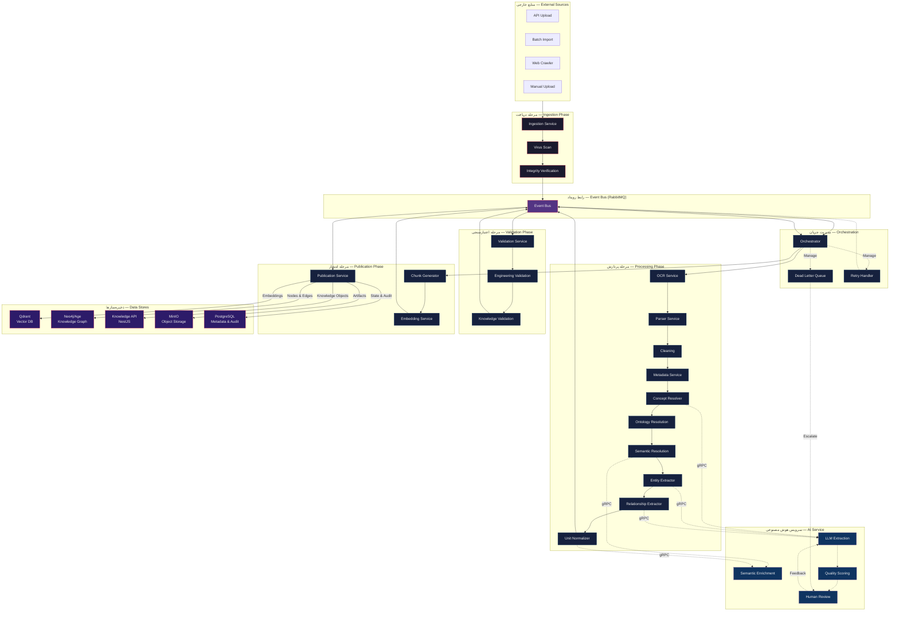

# معماری رانتایم — Runtime Architecture Overview

**Version:** 1.0.0 | **Status:** Draft | **Last Updated:** Tir 1405

---

## 1. Architecture Overview — نمای کلی معماری

The Knowledge Acquisition Runtime is an **event-driven, multi-service pipeline** that transforms a **Raw Engineering Document** into a **Validated Engineering Knowledge Object**. The complete lifecycle spans 21 stages across 4 phases — Ingestion, Processing, Validation, and Publication — coordinated by an Orchestrator over an asynchronous Event Bus.

```
Raw Engineering Document
         │
         ▼
┌─────────────────────────────────────────────────┐
│                 INGESTION PHASE                   │
│  Receive → Virus Scan → Integrity → Track        │
└──────────────────────┬──────────────────────────┘
                       │
                       ▼
┌─────────────────────────────────────────────────┐
│                PROCESSING PHASE                   │
│  OCR → Parse → Clean → Metadata →                │
│  Concept Extraction → Ontology Resolution →      │
│  Semantic Resolution → Entity Extraction →       │
│  Relationship Extraction                         │
└──────────────────────┬──────────────────────────┘
                       │
                       ▼
┌─────────────────────────────────────────────────┐
│                VALIDATION PHASE                   │
│  Engineering Validation → Knowledge Validation   │
└──────────────────────┬──────────────────────────┘
                       │
                       ▼
┌─────────────────────────────────────────────────┐
│               PUBLICATION PHASE                   │
│  Chunk Generation → Embedding →                  │
│  Vector DB → Graph DB → Knowledge API            │
└─────────────────────────────────────────────────┘
                       │
                       ▼
        Validated Engineering Knowledge Object
```

---

## 2. Runtime Boundaries — مرزهای رانتایم

### What the Runtime DOES

| Function | Description |
|----------|-------------|
| **Ingest** | Accept documents from API upload, batch import, web crawler, and manual upload channels |
| **Process** | Extract, normalize, and enrich document content via OCR, parsing, cleaning, and NLP pipelines |
| **Validate** | Apply multi-layer validation rules for engineering correctness, knowledge consistency, and quality thresholds |
| **Publish** | Deliver validated knowledge objects to vector database, knowledge graph, Knowledge API, and search indexes |
| **Manage Lifecycle** | Track document state through 21 lifecycle stages with full audit trail and failure recovery |

### What the Runtime DOES NOT

| Out of Scope | Explanation |
|--------------|-------------|
| **User Content Generation** | End-user content creation within Xennic applications is governed separately by the application layer |
| **Real-Time SCADA Data** | Operational telemetry and real-time monitoring data are handled by the data ingestion pipeline |
| **AI Model Training** | Training data preparation, model fine-tuning, and experiment tracking are governed by AI training policy |
| **Authentication & Authorisation** | User identity, access control, and workspace isolation are handled by the API gateway and auth service |
| **Frontend Presentation** | UI rendering, user dashboards, and interactive visualisations are the responsibility of the web application |

---

## 3. Runtime Responsibilities — مسئولیت‌های رانتایم

| Responsibility | Description |
|---------------|-------------|
| **Document Ingestion** | Accept documents from multiple sources; validate format, size, and integrity; assign tracking ID |
| **Content Extraction** | Extract text via OCR for scanned/images; parse structured formats (PDF, DOCX, HTML, Markdown) |
| **Content Normalisation** | Remove artifacts, normalise whitespace, fix encoding errors, standardise line endings |
| **Metadata Construction** | Build metadata per `governance/metadata-schema.md` including core, engineering, AI, RAG, and traceability fields |
| **Concept Extraction** | Identify and extract engineering concepts from document content referencing `concepts/canonical-concepts.md` |
| **Ontology Resolution** | Map extracted concepts to ontology entities per `governance/ontology.md` and `concepts/engineering-entities.md` |
| **Semantic Resolution** | Resolve terms via the semantic layer: synonym resolution, vocabulary matching, acronym expansion, unit normalisation |
| **Entity Extraction** | Identify engineering entities: equipment types, standards, manufacturers, voltage levels, cable types |
| **Relationship Extraction** | Extract typed relationships between entities per `concepts/engineering-relations.md` |
| **Multi-Layer Validation** | Engineering validation (source hierarchy, tier compliance) and knowledge validation (completeness, consistency) |
| **Chunk Generation** | Split documents into optimal segments for RAG retrieval based on document type and structure |
| **Embedding Generation** | Generate vector embeddings for each chunk using the configured embedding model |
| **Vector Publication** | Write embeddings to Qdrant vector database with metadata enrichment |
| **Graph Publication** | Write entities (nodes) and relationships (edges) to Neo4j/Age knowledge graph |
| **Knowledge API Publication** | Make knowledge available via the NestJS Knowledge API; set status to Published |
| **Lifecycle Management** | Handle versioning, deprecation, scheduled review, and re-ingestion of updated documents |
| **Audit Trail** | Log every operation with timestamp, service, input, output, and outcome |
| **Failure Recovery** | Retry with configurable policy, dead-letter queues for unrecoverable failures, manual intervention triggers |

---

## 4. Internal Services — سرویس‌های داخلی

| Service | Responsibility | Key Operations |
|---------|---------------|----------------|
| **Ingestion Service** | Accept documents from all channels; validate format, size, and integrity; assign tracking ID; initiate virus scan | `receive()`, `validate()`, `track()`, `ack()` |
| **Processing Service** | Coordinate the end-to-end processing pipeline; manage state transitions through processing stages | `process()`, `progress()`, `fail()` |
| **OCR Service** | Extract text from scanned documents and images via Vision Service integration | `extract_text()`, `deskew()`, `denoise()` |
| **Parser Service** | Parse structured document formats into standardised internal representation | `parse_pdf()`, `parse_docx()`, `parse_html()`, `parse_md()` |
| **Metadata Service** | Construct and validate metadata per universal metadata schema | `build()`, `validate()`, `enrich()` |
| **Concept Resolver** | Identify engineering concepts in document text; resolve against canonical concept registry | `identify()`, `resolve()`, `disambiguate()` |
| **Entity Extractor** | Extract engineering entities (equipment, standards, manufacturers) with type classification | `extract()`, `classify()`, `normalize()` |
| **Relationship Extractor** | Extract typed relationships between entities; assign direction, weight, and confidence | `extract()`, `type()`, `score()` |
| **Unit Normalizer** | Normalise measurement units to SI/canonical forms; convert between equivalent unit systems | `normalize()`, `convert()`, `validate()` |
| **Chunk Generator** | Split documents into optimal chunks for RAG; apply chunk strategy per document type | `chunk()`, `strategy()`, `overlap()` |
| **Embedding Service** | Generate vector embeddings for each chunk using the configured embedding model | `embed()`, `batch()`, `dimension_check()` |
| **Validation Service** | Execute multi-layer validation: engineering rules, knowledge consistency, quality thresholds | `validate_engineering()`, `validate_knowledge()`, `score()` |
| **Publication Service** | Publish validated knowledge to Qdrant, Neo4j/Age, Knowledge API, and search indexes | `publish_vector()`, `publish_graph()`, `publish_api()`, `publish_search()` |
| **Orchestrator** | Coordinate pipeline execution; manage state machine, retries, dead-letter handling, and human-in-the-loop gates | `orchestrate()`, `state()`, `retry()`, `escalate()` |
| **Event Bus** | Asynchronous message transport between services; publish/subscribe for stage completion, failure, and escalation events | `publish()`, `subscribe()`, `dead_letter()` |

---

## 5. External Integrations — یکپارچه‌سازی‌های خارجی

| External System | Integration Type | Purpose | Protocol |
|-----------------|-----------------|---------|----------|
| **AI Service** | gRPC / REST | LLM-based extraction, concept resolution, semantic enrichment, quality scoring | HTTP/2, Protobuf |
| **Vision Service** | gRPC / REST | OCR for scanned documents, image preprocessing, layout analysis | HTTP/2, Protobuf |
| **Knowledge API** | REST (NestJS) | CRUD operations for knowledge objects; query and retrieval | HTTP/1.1, JSON |
| **Vector Database (Qdrant)** | gRPC | Store and query vector embeddings for semantic search | gRPC, Protobuf |
| **Knowledge Graph (Neo4j/Age)** | Bolt / Cypher | Store entities, relationships, and concepts as graph nodes and edges | Bolt protocol |
| **Event Bus (RabbitMQ)** | AMQP 0-9-1 | Asynchronous communication between runtime services | AMQP, STOMP |
| **Object Storage (MinIO)** | S3-compatible API | Store raw documents, processed artifacts, and intermediate files | S3 REST API |
| **PostgreSQL** | SQL (Prisma) | Store metadata, lifecycle state, audit logs, and configuration | TCP/5432 |

---

## 6. AI Service Interaction — تعامل با سرویس هوش مصنوعی

### LLM-Based Extraction

The runtime delegates computationally intensive extraction tasks to the AI Service. The Processing Service sends document chunks to the AI Service, which returns structured extractions including entities, relationships, and concepts.

| Interaction | Description |
|-------------|-------------|
| **Entity Extraction** | AI Service processes document content and returns identified entities with type classification and confidence scores |
| **Relationship Extraction** | AI Service identifies semantic relationships between entities with direction, type, and weight |
| **Concept Resolution** | AI Service maps extracted terms to canonical concepts from the concept registry |
| **Ontology Mapping** | AI Service resolves extracted entities against ontology entities defined in `governance/ontology.md` |

### Semantic Enrichment

| Interaction | Description |
|-------------|-------------|
| **Synonym Resolution** | AI Service matches extracted terms against known synonyms in the semantic layer; returns canonical form |
| **Acronym Expansion** | AI Service resolves abbreviations using the acronym dictionary; returns full term and context |
| **Unit Normalisation** | AI Service normalises measurement units to SI/canonical forms with conversion validation |
| **Term Translation** | AI Service provides bilingual (FA/EN) term pairs for extracted engineering vocabulary |

### Quality Scoring

| Interaction | Description |
|-------------|-------------|
| **Confidence Computation** | AI Service computes per-field confidence scores based on extraction certainty, source quality, and cross-reference validation |
| **Confidence Threshold Enforcement** | Fields below the minimum confidence threshold are flagged for review or excluded per `ai-intelligence/confidence-scoring.md` |
| **Evidence Chain Generation** | AI Service constructs evidence chains linking each extracted field to source document segments |

### Human Review

| Interaction | Description |
|-------------|-------------|
| **Low-Confidence Flagging** | AI Service flags documents or fields where confidence scores fall below the configurable threshold |
| **Review Queue** | Flagged items are routed to a human review queue managed by the Orchestrator |
| **Review Feedback** | Human reviewers can approve, reject, or correct flagged extractions; corrections are fed back to improve future AI Service performance |
| **Escalation** | Documents that fail validation after multiple retries are escalated for manual intervention |

---

## 7. Architecture Diagram — نمودار معماری



---

## Service Topology Summary — خلاصه توپولوژی سرویس‌ها

| Service | Scale | Stateful | Language | Dependencies |
|---------|-------|----------|----------|--------------|
| Ingestion Service | Horizontal | No | TypeScript | PostgreSQL, MinIO, RabbitMQ |
| Processing Service | Horizontal | No | TypeScript | RabbitMQ, AI Service |
| OCR Service | Horizontal | No | Python | Vision Service, RabbitMQ |
| Parser Service | Horizontal | No | TypeScript | MinIO, RabbitMQ |
| Metadata Service | Horizontal | Yes (cache) | TypeScript | PostgreSQL, RabbitMQ |
| Concept Resolver | Horizontal | Yes (cache) | Python | AI Service, RabbitMQ |
| Entity Extractor | Horizontal | No | Python | AI Service, RabbitMQ |
| Relationship Extractor | Horizontal | No | Python | AI Service, RabbitMQ |
| Unit Normalizer | Horizontal | No | Python | AI Service, RabbitMQ |
| Chunk Generator | Horizontal | No | TypeScript | RabbitMQ |
| Embedding Service | Horizontal | Yes (GPU) | Python | Qdrant, RabbitMQ |
| Validation Service | Horizontal | No | TypeScript | PostgreSQL, RabbitMQ |
| Publication Service | Horizontal | No | TypeScript | Qdrant, Neo4j, Knowledge API, RabbitMQ |
| Orchestrator | Singleton | Yes | TypeScript | PostgreSQL, RabbitMQ |
| Event Bus | Cluster | Yes | RabbitMQ | — |
