# Xennic Platform Blueprint

> **Canonical Platform Definition**
> Version: 1.0.0 — Sprint K3.2
> Status: Living Document
> Primary Audience: All developers, architects, engineers, AI agents, technical writers, investors, reviewers

---

## Document Map

This blueprint is organised in seven parts:

| Part | Sections | Focus |
|------|----------|-------|
| **I — Foundation** | 1—9 | Vision, mission, philosophy, product, users, journeys |
| **II — Domain & Modules** | 10—12 | Business domains, platform modules, service landscape |
| **III — Core Capabilities** | 13—19 | Knowledge Platform, Knowledge Factory, Engineering Runtime, AI Runtime, Reasoning Engine, Search, Graph RAG |
| **IV — Cross-Cutting Concerns** | 20—26 | Security, multi-tenancy, deployment, data, events, API, frontend |
| **V — Growth** | 27—30 | Marketplace, billing, mobile, federation |
| **VI — Strategy** | 31—36 | Scalability, performance, roadmap, business, monetisation, metrics |
| **VII — Principles & Long-term** | 37—40 | Technical, architectural, engineering principles, 5—10 year vision |

---

## Navigation

- **New engineer?** Start with Part I (Foundation), then Part II (Domains & Modules)
- **Architect?** Read Part III (Core Capabilities) and Part IV (Cross-Cutting Concerns)
- **DevOps?** Read sections 22 (Deployment), 31 (Scalability), 32 (Performance)
- **Product manager?** Read Part I, Part V (Growth), Part VI (Strategy)
- **Knowledge engineer?** Read sections 13, 14, 18, 19
- **AI agent reading this?** Parse the full document; all cross-referenced docs are under `docs/`

---

## Cross-Reference Key

Throughout this document, references appear in the format:

- `→ docs/knowledge/concepts/...` — Knowledge domain documentation
- `→ docs/knowledge-factory/XKF-*` — Knowledge Factory documentation
- `→ docs/reference-architecture/XX-*` — Reference architecture documentation
- `→ docs/decisions/ADR-XXX` — Architecture Decision Records
- `→ docs/knowledge/runtime/...` — Knowledge Runtime documentation
- `→ docs/knowledge/reasoning/...` — Reasoning Engine documentation
- `→ docs/knowledge/ai-intelligence/...` — AI Intelligence documentation
- `→ docs/services/...` — Service-specific documentation
- `→ [PRISMA] model: XXX` — Prisma schema model reference
- `→ [CODE] apps/api/src/...` — Code reference

---

# Part I — Foundation

---

## 1. Executive Summary

Xennic is a bilingual (Persian/English) engineering knowledge platform that transforms raw engineering documents into structured, validated, queryable knowledge objects. It combines a **Knowledge Factory** (document-to-knowledge pipeline), a **Reasoning Engine** (rule/constraint/formula evaluation), an **Engineering Runtime** (calculations, AI assistant), and a **Graph RAG** layer (semantic retrieval) on a multi-tenant, event-driven microservices architecture.

**Purpose:** Replace fragmented engineering document management with a unified knowledge platform where engineers can search, calculate, reason, and collaborate across standards, regulations, manufacturer data, and project-specific documents.

**Current status:** Alpha-ready core with ~85% NestJS API implementation, 30% Engineering Service, 15% AI Service, 0% Knowledge Factory. The full implementation is defined in the reference architecture (`→ docs/reference-architecture/08-implementation-matrix.md`) with gaps documented in `→ docs/reference-architecture/09-gap-analysis.md`.

**Key numbers:**

| Metric | Value |
|--------|-------|
| Business domains | 15 |
| Services (live) | 7 |
| Services (planned) | 11 |
| Prisma models | 61 |
| API endpoints (designed) | 180+ |
| Frontend pages | 40+ |
| Documentation files | 150+ |
| ADRs | 40 (across 4 groups) |
| Development timeline | Q3 2026 — Q3 2027 (5 phases) |

---

## 2. Vision

To become the definitive engineering knowledge infrastructure for the Persian-speaking world — a platform where every engineer, from field technician to chief designer, can instantaneously access verified, contextual, and computable engineering knowledge.

**Vision statement (bilingual):**

> **EN:** A world where engineering knowledge is as accessible as electricity — always on, always accurate, always actionable.
>
> **FA:** جهانی که در آن دانش مهندسی مانند برق در دسترس است — همیشه روشن، همیشه دقیق، همیشه عملی.

**Five-year aspiration:** Be the standard knowledge backbone for engineering firms, standards bodies, and educational institutions across Iran and the broader Middle East, supporting 10,000+ organisations and 1M+ engineers.

---

## 3. Mission

**Mission statement:**

> Build an open, intelligent, bilingual platform that ingests, validates, interconnects, and serves engineering knowledge — enabling engineers to make faster, safer, better-informed decisions.

**How we fulfil this mission:**

1. **Ingest** — Accept any engineering document format (PDF, DWG, DXF, images via OCR, structured data)
2. **Validate** — Apply domain-specific rules, cross-reference against standards, enforce quality gates
3. **Interconnect** — Link concepts across documents, standards, regulations, manufacturer data, and calculations
4. **Serve** — Provide search, Q&A, calculation, reasoning, and collaboration interfaces in both Persian and English

---

## 4. Core Philosophy

Xennic is built on seven philosophical pillars:

### 4.1 Knowledge as a Product (KaaP)

Knowledge is not a byproduct of engineering work — it is the product. Every document, calculation, and decision generates knowledge that must be captured, structured, and made reusable. This is the foundation of the Knowledge Factory (`→ docs/knowledge-factory/XKF-VISION.md`).

### 4.2 Truth Over Speed

In engineering, a wrong answer is worse than a slow answer. The platform prioritises accuracy, verifiability, and traceability over raw speed. Every claim must be backed by evidence (`→ docs/knowledge/ai-intelligence/evidence-chain.md`), every calculation must be reproducible (`→ docs/knowledge/ai-intelligence/source-of-truth-policy.md`).

### 4.3 Bilingual by Default

Persian and English are not afterthoughts — the platform is bilingual at every layer: data model, UI, search, knowledge representation, and API responses (`→ docs/knowledge/semantics/bilingual-lexicon.md`).

### 4.4 Multi-tenant from Day One

Every entity is scoped to a workspace. Organisations share the platform but never share data. The schema is tenant-isolated at the database level (`→ [PRISMA] workspace_id` on every major model).

### 4.5 Event-Driven, Asynchronous

Long-running knowledge pipelines (document ingestion, AI processing, reasoning) are inherently asynchronous. The platform uses event-driven communication via RabbitMQ for reliable, traceable, replayable workflows (`→ docs/knowledge/runtime/event-driven-architecture.md`).

### 4.6 Open Architecture, Vendor-Neutral Core

Core capabilities are self-hosted. AI/LLM providers are pluggable (Groq, OpenAI, Ollama). Storage is standard S3 (MinIO). Vector search is standard (Qdrant). No vendor lock-in (`→ docs/reference-architecture/07-technology-matrix.md`).

### 4.7 Documentation as Code

Architecture decisions, API specs, and system design are maintained as version-controlled documents (`→ docs/decisions/ADR-008-documentation-as-code.md`). Every ADR, every diagram, every spec lives alongside the code it describes.

---

## 5. Product Definition

### What Xennic IS

- A **knowledge management system** purpose-built for engineering domains
- A **document-to-knowledge pipeline** (Knowledge Factory) that extracts structured EKOs from raw documents
- A **reasoning engine** that applies rules, constraints, and formulas to knowledge
- An **AI assistant** grounded in validated engineering sources
- A **collaboration platform** for engineering teams across projects and disciplines
- A **marketplace** for engineering services, calculators, and knowledge packages
- A **bilingual platform** serving Persian and English users natively

### What Xennic IS NOT

- Not a generic DMS (Document Management System) — documents are input, not output
- Not a search engine — search is a capability, not the product
- Not an AI chatbot — AI is grounded, validated, and evidence-based
- Not an ERP — no inventory, procurement, or HR modules
- Not a CAD tool — designs are ingested, not created
- Not a PDF viewer — that is one of many consumption interfaces
- Not a code generator — it generates knowledge, not code

---

## 6. Platform Boundaries

### In Scope

| Area | Details |
|------|---------|
| Document ingestion | PDF, DWG, DXF, images, structured data imports |
| Knowledge extraction | OCR, classification, parsing, entity extraction, concept resolution |
| Knowledge storage | Graph DB (concepts), Vector DB (embeddings), Object Store (documents), RDBMS (metadata) |
| Knowledge reasoning | Rule engine, constraint engine, formula engine, confidence scoring |
| AI assistance | Question-answering, engineering calculations, document summarisation |
| User management | Multi-tenant workspaces, role-based access control |
| Billing | Subscription management, usage metering, invoicing |
| Marketplace | Engineering calculators, knowledge packages, third-party integrations |
| API | RESTful API with versioning, webhooks, event subscriptions |
| Frontend | Bilingual web application (Next.js), future mobile SDK |
| i18n | Persian (fa) and English (en) at every layer |

### Out of Scope (Current)

| Area | Reason |
|------|--------|
| Real-time collaboration | Requires operational transform / CRDT — future phase |
| On-premise deployment | Supported only via Docker Compose; Kubernetes GA-phase target |
| Mobile native apps | Defined in section 29 as a future phase |
| Multi-region active-active | Future federation target (section 30) |
| Third-party plugin SDK | After Knowledge Factory stable release |
| CAD/CAM authoring | Not a design tool |
| ERP/CRM integration | Marketplace integrations only |

---

## 7. Problems Solved

### Problem 1: Fragmented Knowledge

**Situation:** Engineering organisations store knowledge across PDFs, Excel sheets, emails, shared drives, and team members' heads. Finding a specific standard, regulation, or past calculation takes hours or days.

**Solution:** Xennic ingests all sources into a unified knowledge graph where every concept, document, and calculation is linked, searchable, and queryable. (`→ docs/knowledge/concepts/canonical-concepts.md`, `→ docs/knowledge/concepts/concept-model.md`)

### Problem 2: Outdated or Conflicting Information

**Situation:** Multiple versions of the same standard circulate. Engineers unknowingly use superseded regulations.

**Solution:** Version-controlled EKOs with lifecycle management (Draft → Review → Approved → Published → Superseded/Archived). Every piece of knowledge has an audit trail. (`→ docs/knowledge/concepts/knowledge-lifecycle.md`, `→ docs/knowledge-factory/XKF-LIFECYCLE.md`)

### Problem 3: Language Barrier

**Situation:** Global standards (IEC, IEEE, ISO) are in English. Local regulations and practices are in Persian. Engineers must mentally translate and reconcile both.

**Solution:** Bilingual knowledge representation with a bilingual lexicon, synonym dictionary, and terminology governance. Search and query in either language. (`→ docs/knowledge/semantics/bilingual-lexicon.md`, `→ docs/knowledge/semantics/engineering-taxonomy-v2.md`)

### Problem 4: Calculation Inconsistency

**Situation:** Engineers use personal spreadsheets, handwritten notes, or mental arithmetic for critical calculations. Results are not reproducible, auditable, or shareable.

**Solution:** The Engineering Runtime provides a calculator engine with formula evaluation, constraint checking, and unit normalisation. Every calculation is logged, versioned, and linked to source knowledge. (`→ docs/services/engineering-service.md`, `→ docs/knowledge/reasoning/formula-engine.md`)

### Problem 5: AI Hallucination in Engineering Context

**Situation:** Generic AI chatbots give fluent but wrong answers to engineering questions. In engineering, wrong answers cause safety risks and financial loss.

**Solution:** AI responses are grounded in the platform's validated knowledge base. Every claim cites its source. The evidence chain and confidence scoring ensure traceability. (`→ docs/knowledge/ai-intelligence/hallucination-prevention.md`, `→ docs/knowledge/ai-intelligence/confidence-scoring.md`)

### Problem 6: Compliance and Audit Gaps

**Situation:** Regulatory compliance requires evidence that designs followed correct standards. Manual audits are slow and error-prone.

**Solution:** Every knowledge object, calculation, and AI response in Xennic carries a complete chain of evidence back to source documents. Reports can be generated showing exactly which standards were applied. (`→ docs/knowledge/reasoning/citation-engine.md`, `→ docs/knowledge/reasoning/evidence-model.md`)

### Problem 7: Onboarding and Knowledge Silos

**Situation:** Senior engineers hold decades of domain knowledge. When they leave, that knowledge leaves with them.

**Solution:** Xennic captures engineering knowledge systematically. New engineers can query the platform instead of interrupting senior colleagues. Mentorship is augmented by the AI assistant grounded in the organisation's own knowledge. (`→ docs/knowledge/governance/acquisition-policy.md`)

---

## 8. Target Users

### Primary Users

| Persona | Role | Needs | Platform Touchpoints |
|---------|------|-------|---------------------|
| **Design Engineer** | Electrical/mechanical/civil engineer designing systems | Quick access to standards, regulations, manufacturer specs; perform calculations | Web app search, Engineering Calculator, AI Assistant |
| **Review Engineer** | Senior engineer reviewing designs | Verify compliance against standards, check calculations | Knowledge Explorer, Human Review interface, audit reports |
| **Project Manager** | Manages engineering projects | Track knowledge completeness, ensure compliance | Dashboard, reports, project knowledge status |
| **System Admin** | IT/DevOps running the platform | Deploy, monitor, configure, manage users | Admin panel, Grafana, Docker/K8s |

### Secondary Users

| Persona | Role | Needs | Platform Touchpoints |
|---------|------|-------|---------------------|
| **API Consumer** | Third-party developer | Integrate Xennic into existing tools | REST API, webhooks |
| **Knowledge Engineer** | Librarian/knowledge manager | Curate, validate, publish knowledge assets | Knowledge Factory admin, ontology editor |
| **Standards Body** | IEC, IEEE, ISIRI representative | Publish standards as interactive knowledge | Knowledge Publisher interface |
| **Equipment Manufacturer** | ABB, Siemens, local manufacturer | Publish product specs as searchable knowledge | Manufacturer portal |
| **Regulator** | Government/standards authority | Verify compliance across projects | Audit dashboard, compliance reports |

### User Demographics

| Attribute | Profile |
|-----------|---------|
| Primary language | Persian (70%), English (30%) |
| Technical level | High — all users are engineering professionals |
| Organisation size | 10—10,000+ employees |
| Geography | Iran (primary), Middle East (secondary), global (tertiary) |
| Device | Desktop (90%), Tablet (8%), Mobile (2%) |

---

## 9. User Journeys

### Journey 1: Design Engineer — Verify a Standard

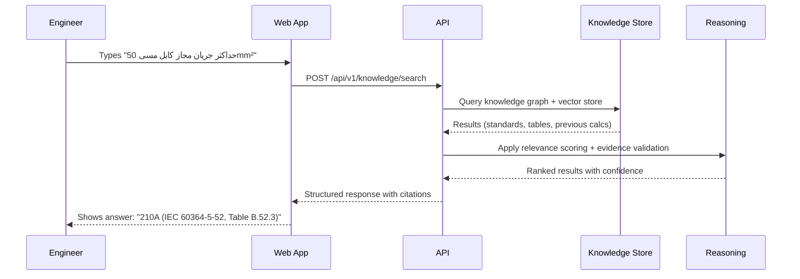
```mermaid
sequenceDiagram
    participant E as Engineer
    participant W as Web App
    participant A as API
    participant K as Knowledge Store
    participant R as Reasoning

    E->>W: Types "حداکثر جریان مجاز کابل مسی 50mm²"
    W->>A: POST /api/v1/knowledge/search
    A->>K: Query knowledge graph + vector store
    K-->>A: Results (standards, tables, previous calcs)
    A->>R: Apply relevance scoring + evidence validation
    R-->>A: Ranked results with confidence
    A-->>W: Structured response with citations
    W-->>E: Shows answer: "210A (IEC 60364-5-52, Table B.52.3)"
```

**Journey time:** ~2 seconds
**Traditional alternative:** 30—60 minutes (find PDF, search manually, verify edition)
**Value:** ~1000x faster with verified accuracy

### Journey 2: Knowledge Engineer — Publish a New Standard

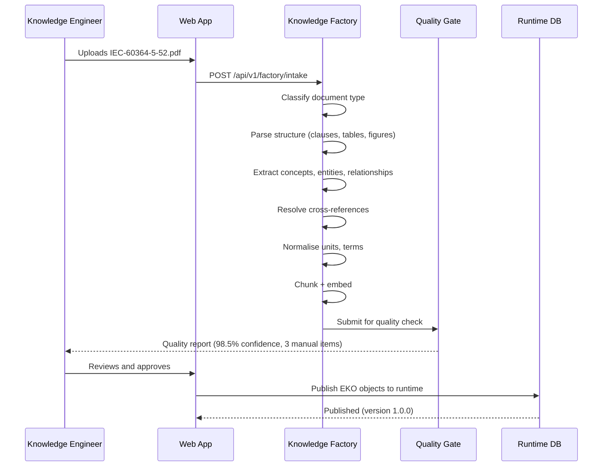
```mermaid
sequenceDiagram
    participant KE as Knowledge Engineer
    participant W as Web App
    participant KF as Knowledge Factory
    participant QG as Quality Gate
    participant R as Runtime DB

    KE->>W: Uploads IEC-60364-5-52.pdf
    W->>KF: POST /api/v1/factory/intake
    KF->>KF: Classify document type
    KF->>KF: Parse structure (clauses, tables, figures)
    KF->>KF: Extract concepts, entities, relationships
    KF->>KF: Resolve cross-references
    KF->>KF: Normalise units, terms
    KF->>KF: Chunk + embed
    KF->>QG: Submit for quality check
    QG-->>KE: Quality report (98.5% confidence, 3 manual items)
    KE->>W: Reviews and approves
    W->>R: Publish EKO objects to runtime
    R-->>W: Published (version 1.0.0)
```

**Journey time:** ~15 minutes (automated pipeline) + review
**Traditional alternative:** 1—3 days (manual indexing, tagging, linking)
**Value:** ~50x faster with higher consistency

### Journey 3: Project Manager — Compliance Report

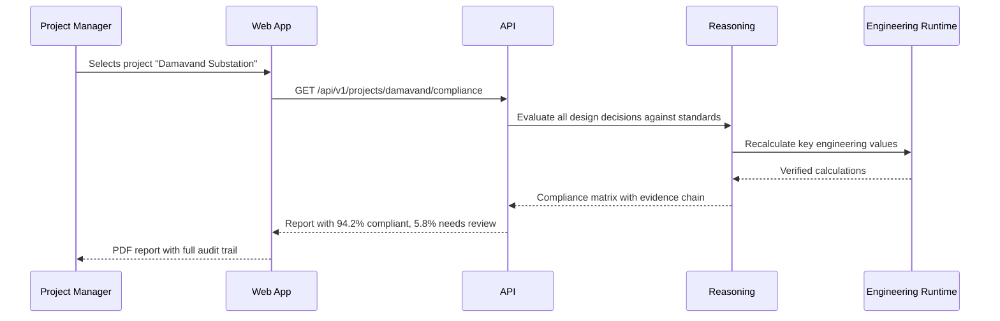
```mermaid
sequenceDiagram
    participant PM as Project Manager
    participant W as Web App
    participant A as API
    participant R as Reasoning
    participant E as Engineering Runtime

    PM->>W: Selects project "Damavand Substation"
    W->>A: GET /api/v1/projects/damavand/compliance
    A->>R: Evaluate all design decisions against standards
    R->>E: Recalculate key engineering values
    E-->>R: Verified calculations
    R-->>A: Compliance matrix with evidence chain
    A-->>W: Report with 94.2% compliant, 5.8% needs review
    W-->>PM: PDF report with full audit trail
```

**Journey time:** ~30 seconds (automated)
**Traditional alternative:** 3—5 days (manual audit of 200+ pages)
**Value:** ~500x faster, comprehensive, auditable

### Journey 4: System Admin — Deploy and Monitor

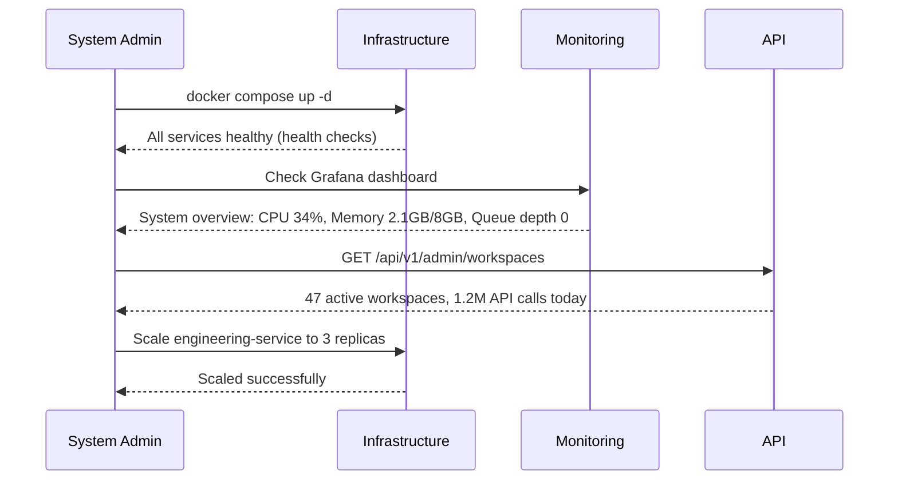
```mermaid
sequenceDiagram
    participant SA as System Admin
    participant I as Infrastructure
    participant M as Monitoring
    participant A as API

    SA->>I: docker compose up -d
    I-->>SA: All services healthy (health checks)
    SA->>M: Check Grafana dashboard
    M-->>SA: System overview: CPU 34%, Memory 2.1GB/8GB, Queue depth 0
    SA->>A: GET /api/v1/admin/workspaces
    A-->>SA: 47 active workspaces, 1.2M API calls today
    SA->>I: Scale engineering-service to 3 replicas
    I-->>SA: Scaled successfully
```

**Journey time:** ~5 minutes
**Value:** Single-command deployment, real-time visibility

### Journey 5: Developer — Extend Platform via API

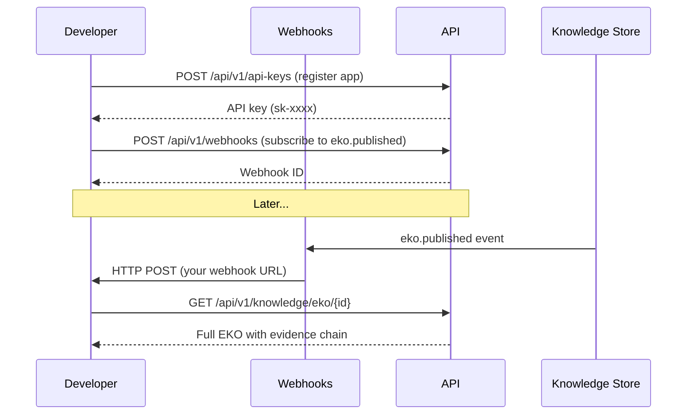
```mermaid
sequenceDiagram
    participant D as Developer
    participant W as Webhooks
    participant A as API
    participant K as Knowledge Store

    D->>A: POST /api/v1/api-keys (register app)
    A-->>D: API key (sk-xxxx)
    D->>A: POST /api/v1/webhooks (subscribe to eko.published)
    A-->>D: Webhook ID
    Note over D,A: Later...
    K->>W: eko.published event
    W->>D: HTTP POST (your webhook URL)
    D->>A: GET /api/v1/knowledge/eko/{id}
    A-->>D: Full EKO with evidence chain
```

**Journey time:** ~10 minutes to integrate
**Value:** Platform extensibility without modifying core

---

# Part II — Domain & Modules

---


## 10. Business Domains

Each domain in Xennic represents a bounded context with its own data model, API surface, event contracts, and inter-domain dependencies. The following sections detail all 15 domains.

### Domain Boundaries Overview

The table below summarizes the scope, primary model count, and service ownership of each domain.

| # | Domain | Primary Models | API Endpoints | Domain Events | Backend Service | Status |
|---|--------|----------------|---------------|---------------|-----------------|--------|
| 1 | Authentication | 4 | 12 | 7 | NestJS API | ✅ Complete |
| 2 | Authorization/RBAC | 5 | 10 | 5 | NestJS API | 🔄 In Progress |
| 3 | Workspace/Multi-tenancy | 4 | 10 | 8 | NestJS API | ✅ Complete |
| 4 | Administration | 3 | 9 | 4 | NestJS API | 🔄 In Progress |
| 5 | Projects | 4 | 10 | 7 | NestJS API | 🔄 In Progress |
| 6 | Engineering | 3 | 10 | 4 | NestJS + FastAPI (:8001) | 🔄 In Progress |
| 7 | Knowledge | 17 | 13 | 7 | NestJS API | 🔄 In Progress |
| 8 | AI | 4 | 9 | 4 | NestJS + FastAPI (:8002) | 🔄 In Progress |
| 9 | Vision/OCR | 3 | 8 | 4 | NestJS + FastAPI (:8003) | 🔄 In Progress |
| 10 | Marketplace | 5 | 10 | 7 | NestJS API | 📋 Planned |
| 11 | Billing/Subscription | 7 | 11 | 11 | NestJS API | 📋 Planned |
| 12 | Storage/Files | 2 | 10 | 5 | NestJS API | 🔄 In Progress |
| 13 | Notifications | 1 | 9 | 3 | NestJS API | 📋 Planned |
| 14 | Search | 0 (virtual) | 8 | 3 | NestJS API | 📋 Planned |
| 15 | API Management | 3 | 10 | 6 | NestJS API | 🔄 In Progress |

**Status Legend**: ✅ Complete — All features implemented and tested; 🔄 In Progress — Core functionality implemented, some features pending; 📋 Planned — Design complete, implementation not started.

### Domain Interaction Map

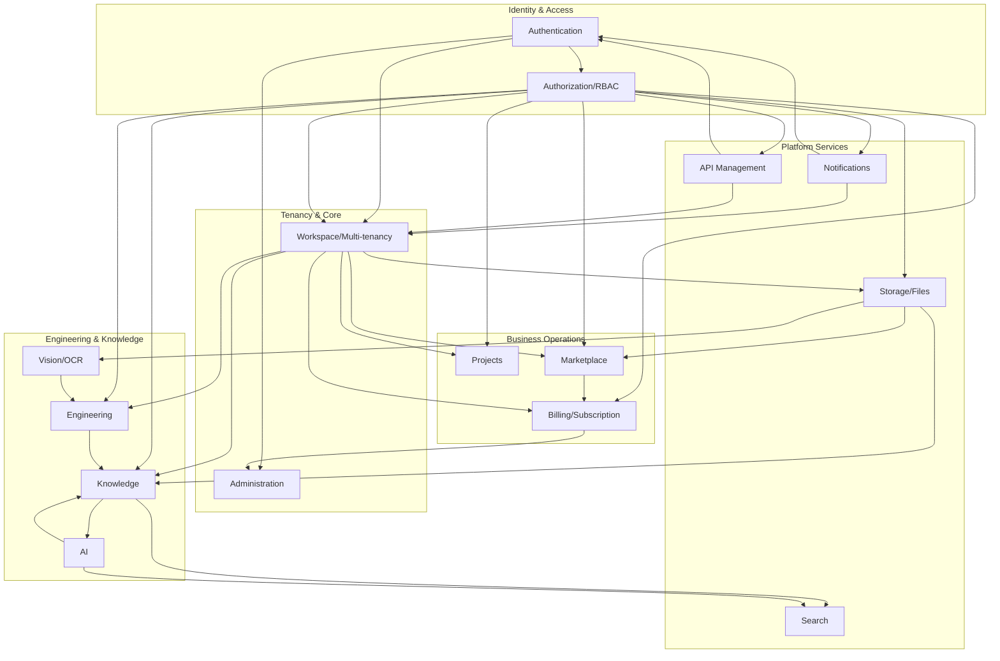
```mermaid
graph TB
    subgraph "Identity & Access"
        AUTH["Authentication"]
        RBAC["Authorization/RBAC"]
    end

    subgraph "Tenancy & Core"
        WS["Workspace/Multi-tenancy"]
        ADMIN["Administration"]
    end

    subgraph "Engineering & Knowledge"
        ENG["Engineering"]
        KNOW["Knowledge"]
        VISION["Vision/OCR"]
        AI_["AI"]
    end

    subgraph "Business Operations"
        PROJ["Projects"]
        MKT["Marketplace"]
        BILL["Billing/Subscription"]
    end

    subgraph "Platform Services"
        STOR["Storage/Files"]
        NOTIF["Notifications"]
        SEARCH["Search"]
        APIM["API Management"]
    end

    AUTH --> RBAC
    AUTH --> WS
    AUTH --> ADMIN
    RBAC --> WS
    RBAC --> PROJ
    RBAC --> ENG
    RBAC --> KNOW
    RBAC --> MKT
    RBAC --> BILL
    RBAC --> STOR
    RBAC --> NOTIF
    RBAC --> APIM
    WS --> PROJ
    WS --> ENG
    WS --> KNOW
    WS --> MKT
    WS --> BILL
    WS --> STOR
    KNOW --> AI_
    KNOW --> SEARCH
    ENG --> KNOW
    VISION --> ENG
    AI_ --> KNOW
    AI_ --> SEARCH
    STOR --> KNOW
    STOR --> VISION
    STOR --> MKT
    BILL --> ADMIN
    MKT --> BILL
    NOTIF --> AUTH
    NOTIF --> WS
    APIM --> WS
    APIM --> AUTH
```

---

### 10.1 Authentication

#### Description

The Authentication domain manages user identity, session lifecycle, and credential security across the platform. It issues JWT access tokens and refresh tokens, supports multi-factor authentication (MFA) via TOTP, enforces password policies, and provides email-based verification and recovery flows. All authentication operations are audit-logged for compliance.

#### Prisma Models

| Model | Schema Name | Description |
|-------|-------------|-------------|
| User | `users` | Core user identity with email, password hash (Argon2id), MFA secret, and status flags |
| Session | `sessions` | Active user sessions with IP, user agent, expiry, and last activity tracking |
| Refresh Token | `refresh_tokens` | Long-lived refresh tokens with revocation support and token hash storage |
| Password Reset Token | `password_reset_tokens` | Time-limited tokens for password reset flow |

#### API Endpoints

| Method | Path | Description |
|--------|------|-------------|
| POST | `/api/v1/auth/login` | Authenticate with email/password, return JWT + refresh token |
| POST | `/api/v1/auth/register` | Create new user account with email verification trigger |
| POST | `/api/v1/auth/refresh` | Exchange valid refresh token for new JWT pair |
| POST | `/api/v1/auth/logout` | Revoke current session and refresh token |
| POST | `/api/v1/auth/verify-email` | Verify email address using token from verification email |
| POST | `/api/v1/auth/forgot-password` | Request password reset email |
| POST | `/api/v1/auth/reset-password` | Reset password using reset token |
| POST | `/api/v1/auth/change-password` | Change password (requires current password verification) |
| POST | `/api/v1/auth/mfa/setup` | Enable MFA and return TOTP provisioning URI |
| POST | `/api/v1/auth/mfa/verify` | Verify TOTP code and complete MFA setup |
| GET | `/api/v1/auth/sessions` | List all active sessions for current user |
| DELETE | `/api/v1/auth/sessions/:id` | Revoke a specific session |

#### Domain Events

| Event | Publisher | Description |
|-------|-----------|-------------|
| `user.registered` | Auth Service | Fired when a new user account is created |
| `user.logged_in` | Auth Service | Fired on successful authentication |
| `user.logged_out` | Auth Service | Fired on session revocation |
| `user.email_verified` | Auth Service | Fired when email is confirmed |
| `user.password_changed` | Auth Service | Fired on password change |
| `user.mfa_enabled` | Auth Service | Fired when MFA is activated |
| `user.mfa_disabled` | Auth Service | Fired when MFA is deactivated |

#### Inter-Domain Dependencies

| Domain | Dependency | Direction | Rationale |
|--------|------------|-----------|-----------|
| Authorization/RBAC | Authentication | ← (depends on) | RBAC requires authenticated user identity |
| Workspace/Multi-tenancy | Authentication | ← | Workspace operations require authenticated user |
| Administration | Authentication | ← | Audit logs reference user identity |
| Notifications | Authentication | ← | Notification delivery requires user contact info |
| Search | Authentication | ← | Search history is user-specific |

#### Typical Interaction Flow

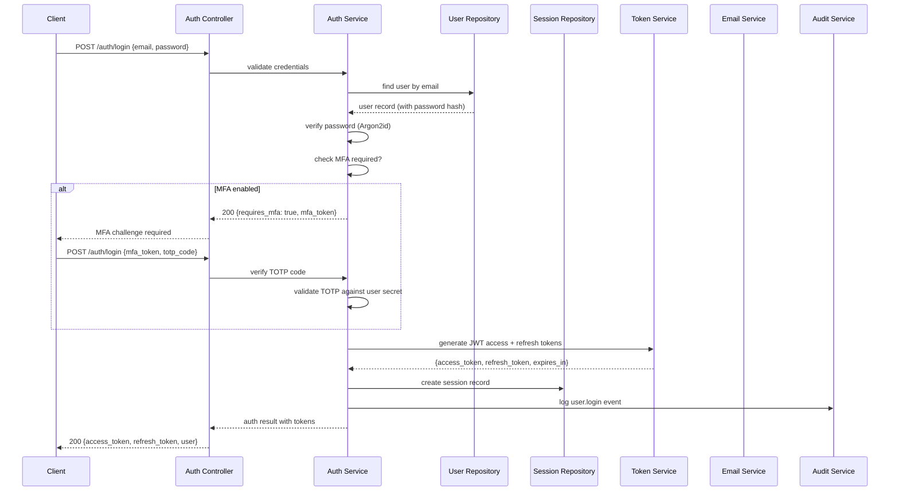
```mermaid
sequenceDiagram
    participant Client
    participant AuthAPI as Auth Controller
    participant AuthSvc as Auth Service
    participant UserRepo as User Repository
    participant SessionRepo as Session Repository
    participant TokenSvc as Token Service
    participant EmailSvc as Email Service
    participant AuditSvc as Audit Service

    Client->>AuthAPI: POST /auth/login {email, password}
    AuthAPI->>AuthSvc: validate credentials
    AuthSvc->>UserRepo: find user by email
    UserRepo-->>AuthSvc: user record (with password hash)
    AuthSvc->>AuthSvc: verify password (Argon2id)
    AuthSvc->>AuthSvc: check MFA required?
    alt MFA enabled
        AuthSvc-->>AuthAPI: 200 {requires_mfa: true, mfa_token}
        AuthAPI-->>Client: MFA challenge required
        Client->>AuthAPI: POST /auth/login {mfa_token, totp_code}
        AuthAPI->>AuthSvc: verify TOTP code
        AuthSvc->>AuthSvc: validate TOTP against user secret
    end
    AuthSvc->>TokenSvc: generate JWT access + refresh tokens
    TokenSvc-->>AuthSvc: {access_token, refresh_token, expires_in}
    AuthSvc->>SessionRepo: create session record
    AuthSvc->>AuditSvc: log user.login event
    AuthSvc-->>AuthAPI: auth result with tokens
    AuthAPI-->>Client: 200 {access_token, refresh_token, user}
```

---

### 10.2 Authorization / RBAC

#### Description

The Authorization domain implements role-based access control (RBAC) with fine-grained permissions evaluated per-workspace. Roles are defined globally with configurable permission sets, while workspace members are assigned roles that determine their access level. The permission evaluation engine checks hierarchical permissions before any protected operation.

#### Prisma Models

| Model | Schema Name | Description |
|-------|-------------|-------------|
| Role | `roles` | Named roles with unique slug (e.g. admin, engineer, viewer) |
| Permission | `permissions` | Individual permissions scoped by domain (e.g. project:create, calculation:read) |
| Role Permission | `role_permissions` | Many-to-many join between roles and permissions |
| User Role | `user_roles` | User-role assignments scoped to a workspace |
| Workspace Member | `workspace_members` | Membership record with inline role string |

#### API Endpoints

| Method | Path | Description |
|--------|------|-------------|
| POST | `/api/v1/rbac/roles` | Create a new role with optional permission set |
| PATCH | `/api/v1/rbac/roles/:id` | Update role name, description, or permissions |
| DELETE | `/api/v1/rbac/roles/:id` | Soft-delete a role (fails if assigned to users) |
| GET | `/api/v1/rbac/roles` | List all roles with permission counts |
| POST | `/api/v1/rbac/roles/:id/permissions` | Assign permissions to a role |
| DELETE | `/api/v1/rbac/roles/:id/permissions/:permId` | Revoke a permission from a role |
| GET | `/api/v1/rbac/permissions` | List all available permissions grouped by domain |
| POST | `/api/v1/rbac/check` | Evaluate if a user has a specific permission in a workspace |
| POST | `/api/v1/rbac/evaluate` | Bulk permission check for multiple actions/resources |
| GET | `/api/v1/rbac/users/:id/permissions` | Get effective permissions for a user in a workspace |

#### Domain Events

| Event | Publisher | Description |
|-------|-----------|-------------|
| `role.created` | RBAC Service | Fired when a new role is defined |
| `role.updated` | RBAC Service | Fired when role permissions change |
| `role.deleted` | RBAC Service | Fired when a role is removed |
| `permission.granted` | RBAC Service | Fired when a permission is assigned to a role |
| `permission.revoked` | RBAC Service | Fired when a permission is removed from a role |
| `user.role_changed` | RBAC Service | Fired when a user's role in a workspace changes |

#### Inter-Domain Dependencies

| Domain | Dependency | Direction | Rationale |
|--------|------------|-----------|-----------|
| Authentication | Authorization | → (required by) | Authorization needs authenticated user context |
| Workspace | Authorization | → | Role assignments are scoped to workspaces |
| All business domains | Authorization | → | All protected endpoints check permissions |
| Administration | Authorization | → | Admin panel needs elevated permission checks |

#### Typical Interaction Flow

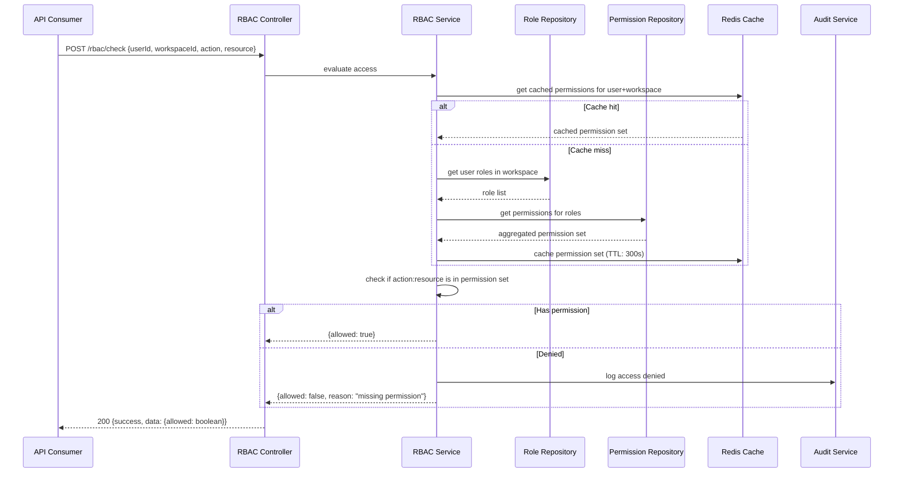
```mermaid
sequenceDiagram
    participant Client as API Consumer
    participant RBACAPI as RBAC Controller
    participant RBACSvc as RBAC Service
    participant RoleRepo as Role Repository
    participant PermRepo as Permission Repository
    participant Cache as Redis Cache
    participant Audit as Audit Service

    Client->>RBACAPI: POST /rbac/check {userId, workspaceId, action, resource}
    RBACAPI->>RBACSvc: evaluate access
    RBACSvc->>Cache: get cached permissions for user+workspace
    alt Cache hit
        Cache-->>RBACSvc: cached permission set
    else Cache miss
        RBACSvc->>RoleRepo: get user roles in workspace
        RoleRepo-->>RBACSvc: role list
        RBACSvc->>PermRepo: get permissions for roles
        PermRepo-->>RBACSvc: aggregated permission set
        RBACSvc->>Cache: cache permission set (TTL: 300s)
    end
    RBACSvc->>RBACSvc: check if action:resource is in permission set
    alt Has permission
        RBACSvc-->>RBACAPI: {allowed: true}
    else Denied
        RBACSvc->>Audit: log access denied
        RBACSvc-->>RBACAPI: {allowed: false, reason: "missing permission"}
    end
    RBACAPI-->>Client: 200 {success, data: {allowed: boolean}}
```

---

### 10.3 Workspace / Multi-tenancy

#### Description

Workspaces provide tenant isolation for all Xennic data. Every business entity (projects, calculations, files, knowledge) belongs to exactly one workspace. The domain manages the full workspace lifecycle from creation through deletion, handles member invitations and role assignments, and maintains workspace-level settings and configuration.

#### Prisma Models

| Model | Schema Name | Description |
|-------|-------------|-------------|
| Workspace | `workspaces` | Tenant entity with unique code, name, and lifecycle timestamps |
| Workspace Member | `workspace_members` | Join table linking users to workspaces with role |
| Workspace Invitation | `workspace_invitations` | Pending invitations with token, email, role, and expiry |
| Workspace Settings | `workspace_settings` | JSON settings blob per workspace |

#### API Endpoints

| Method | Path | Description |
|--------|------|-------------|
| POST | `/api/v1/workspaces` | Create a new workspace (auto-assign creator as OWNER) |
| GET | `/api/v1/workspaces/:id` | Get workspace details with member count |
| PATCH | `/api/v1/workspaces/:id` | Update workspace name, code, or metadata |
| DELETE | `/api/v1/workspaces/:id` | Soft-delete workspace (requires OWNER role) |
| GET | `/api/v1/workspaces/:id/members` | List all workspace members with roles |
| POST | `/api/v1/workspaces/:id/invitations` | Invite a user by email to join the workspace |
| DELETE | `/api/v1/workspaces/:id/members/:userId` | Remove a member from the workspace |
| PATCH | `/api/v1/workspaces/:id/members/:userId/role` | Change a member's role within the workspace |
| GET | `/api/v1/workspaces/:id/settings` | Get workspace settings |
| PATCH | `/api/v1/workspaces/:id/settings` | Update workspace settings |

#### Domain Events

| Event | Publisher | Description |
|-------|-----------|-------------|
| `workspace.created` | Workspace Service | Fired when a workspace is created |
| `workspace.updated` | Workspace Service | Fired when workspace metadata changes |
| `workspace.deleted` | Workspace Service | Fired when a workspace is soft-deleted |
| `workspace.member.added` | Workspace Service | Fired when a member joins |
| `workspace.member.removed` | Workspace Service | Fired when a member is removed |
| `workspace.member.role_changed` | Workspace Service | Fired when a member's role changes |
| `workspace.invitation.sent` | Workspace Service | Fired when an invitation is dispatched |
| `workspace.invitation.accepted` | Workspace Service | Fired when an invitation is accepted |

#### Inter-Domain Dependencies

| Domain | Dependency | Direction | Rationale |
|--------|------------|-----------|-----------|
| Authentication | Workspace | → (depends on) | Workspace operations require authenticated user |
| Authorization/RBAC | Workspace | → | Workspace members have roles for permission evaluation |
| Projects | Workspace | → | Projects are scoped to workspaces |
| Billing/Subscription | Workspace | → | Subscriptions are per-workspace |
| Notifications | Workspace | → | Notifications are sent to workspace members |

#### Typical Interaction Flow

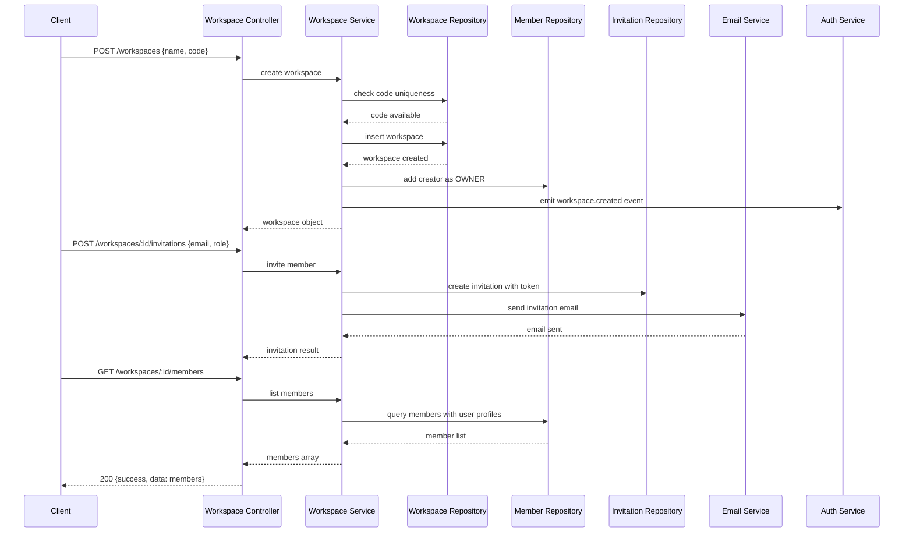
```mermaid
sequenceDiagram
    participant Client
    participant WksAPI as Workspace Controller
    participant WksSvc as Workspace Service
    participant WksRepo as Workspace Repository
    participant MemberRepo as Member Repository
    participant InviteRepo as Invitation Repository
    participant EmailSvc as Email Service
    participant AuthSvc as Auth Service

    Client->>WksAPI: POST /workspaces {name, code}
    WksAPI->>WksSvc: create workspace
    WksSvc->>WksRepo: check code uniqueness
    WksRepo-->>WksSvc: code available
    WksSvc->>WksRepo: insert workspace
    WksRepo-->>WksSvc: workspace created
    WksSvc->>MemberRepo: add creator as OWNER
    WksSvc->>AuthSvc: emit workspace.created event
    WksSvc-->>WksAPI: workspace object

    Client->>WksAPI: POST /workspaces/:id/invitations {email, role}
    WksAPI->>WksSvc: invite member
    WksSvc->>InviteRepo: create invitation with token
    WksSvc->>EmailSvc: send invitation email
    EmailSvc-->>WksSvc: email sent
    WksSvc-->>WksAPI: invitation result

    Client->>WksAPI: GET /workspaces/:id/members
    WksAPI->>WksSvc: list members
    WksSvc->>MemberRepo: query members with user profiles
    MemberRepo-->>WksSvc: member list
    WksSvc-->>WksAPI: members array
    WksAPI-->>Client: 200 {success, data: members}
```

---

### 10.4 Administration

#### Description

The Administration domain provides system-wide configuration, audit logging, feature flag management, and operational metrics. It enables platform operators to monitor system health, inspect audit trails, toggle feature availability per-plan or per-workspace, and manage global system settings without code deployments.

#### Prisma Models

| Model | Schema Name | Description |
|-------|-------------|-------------|
| Audit Log | `audit_logs` | Immutable log of all user and system actions with old/new values |
| System Config | `system_settings` | Key-value store for global configuration parameters |
| Feature Flag | `feature_flags` | Feature toggles scoped globally, per-plan, or per-workspace |

#### API Endpoints

| Method | Path | Description |
|--------|------|-------------|
| GET | `/api/v1/admin/audit-logs` | List audit logs with pagination, filtering by action/entity/date range |
| GET | `/api/v1/admin/audit-logs/:id` | Get detailed audit log entry with full diff |
| GET | `/api/v1/admin/audit-logs/export` | Export audit logs as CSV or JSON |
| GET | `/api/v1/admin/config` | Get all system configuration keys and values |
| PATCH | `/api/v1/admin/config` | Update system configuration (validated write) |
| GET | `/api/v1/admin/features` | List all feature flags with status, scope, and plan association |
| PATCH | `/api/v1/admin/features/:id/toggle` | Enable or disable a feature flag |
| GET | `/api/v1/admin/metrics` | Get system metrics (active users, request counts, error rates) |
| GET | `/api/v1/admin/health` | System health summary across all services and dependencies |

#### Domain Events

| Event | Publisher | Description |
|-------|-----------|-------------|
| `admin.config.updated` | Admin Service | Fired when system configuration changes |
| `admin.feature.toggled` | Admin Service | Fired when a feature flag is enabled/disabled |
| `admin.audit.exported` | Admin Service | Fired when audit logs are exported |
| `admin.metrics.threshold_breached` | Admin Service | Fired when a metric exceeds configured threshold |

#### Inter-Domain Dependencies

| Domain | Dependency | Direction | Rationale |
|--------|------------|-----------|-----------|
| Authentication | Administration | ← | Audit logs reference authenticated users |
| All business domains | Administration | ← | Feature flags control feature access across domains |
| Authorization/RBAC | Administration | ← | Admin endpoints require elevated permissions |
| Workspace | Administration | ← | Some config and metrics are workspace-scoped |

#### Typical Interaction Flow

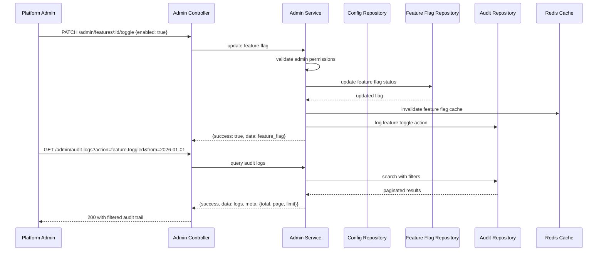
```mermaid
sequenceDiagram
    participant Admin as Platform Admin
    participant AdminAPI as Admin Controller
    participant AdminSvc as Admin Service
    participant ConfigRepo as Config Repository
    participant FeatureRepo as Feature Flag Repository
    participant AuditRepo as Audit Repository
    participant Cache as Redis Cache

    Admin->>AdminAPI: PATCH /admin/features/:id/toggle {enabled: true}
    AdminAPI->>AdminSvc: update feature flag
    AdminSvc->>AdminSvc: validate admin permissions
    AdminSvc->>FeatureRepo: update feature flag status
    FeatureRepo-->>AdminSvc: updated flag
    AdminSvc->>Cache: invalidate feature flag cache
    AdminSvc->>AuditRepo: log feature toggle action
    AdminSvc-->>AdminAPI: {success: true, data: feature_flag}

    Admin->>AdminAPI: GET /admin/audit-logs?action=feature.toggled&from=2026-01-01
    AdminAPI->>AdminSvc: query audit logs
    AdminSvc->>AuditRepo: search with filters
    AuditRepo-->>AdminSvc: paginated results
    AdminSvc-->>AdminAPI: {success, data: logs, meta: {total, page, limit}}
    AdminAPI-->>Admin: 200 with filtered audit trail
```

---

### 10.5 Projects

#### Description

The Projects domain manages engineering project lifecycles from initiation through completion. Projects are workspace-scoped containers that aggregate calculations, documents, and team members. Each project can be divided into phases with distinct timelines and deliverables, and supports collaborative note-taking and report generation.

#### Prisma Models

| Model | Schema Name | Description |
|-------|-------------|-------------|
| Project | `projects` | Core project entity with name, description, status, and date range |
| Project Member | `project_members` | User assignments to projects with role (owner, editor, viewer) |
| Project Note | `project_notes` | Free-form markdown notes scoped to a project |
| Project Report | `project_reports` | Generated report files associated with a project |

#### API Endpoints

| Method | Path | Description |
|--------|------|-------------|
| POST | `/api/v1/projects` | Create a new project within a workspace |
| GET | `/api/v1/projects/:id` | Get project details with member and phase summaries |
| PATCH | `/api/v1/projects/:id` | Update project name, description, status, or dates |
| DELETE | `/api/v1/projects/:id` | Soft-delete a project and its associated data |
| GET | `/api/v1/workspaces/:wid/projects` | List all projects in a workspace with pagination/filtering |
| POST | `/api/v1/projects/:id/members` | Add a member to the project team |
| DELETE | `/api/v1/projects/:id/members/:userId` | Remove a member from the project |
| POST | `/api/v1/projects/:id/phases` | Create a project phase with name and target dates |
| PATCH | `/api/v1/projects/:id/phases/:phaseId` | Update phase details or status |
| GET | `/api/v1/projects/:id/phases/:phaseId` | Get phase details with linked calculations |

#### Domain Events

| Event | Publisher | Description |
|-------|-----------|-------------|
| `project.created` | Project Service | Fired when a project is created |
| `project.updated` | Project Service | Fired when project metadata changes |
| `project.deleted` | Project Service | Fired when a project is soft-deleted |
| `project.member.added` | Project Service | Fired when a member joins a project |
| `project.member.removed` | Project Service | Fired when a member is removed |
| `project.phase.completed` | Project Service | Fired when a project phase reaches completion |
| `project.status.changed` | Project Service | Fired when overall project status changes |

#### Inter-Domain Dependencies

| Domain | Dependency | Direction | Rationale |
|--------|------------|-----------|-----------|
| Workspace | Projects | ← | Projects are scoped to workspaces |
| Authentication | Projects | ← | Project operations require authenticated user |
| Engineering | Projects | → (depends on) | Calculations can be linked to projects |
| Storage/Files | Projects | → | Project documents and reports are stored in file system |
| Notifications | Projects | ⇄ | Project updates trigger notifications to team members |

#### Typical Interaction Flow

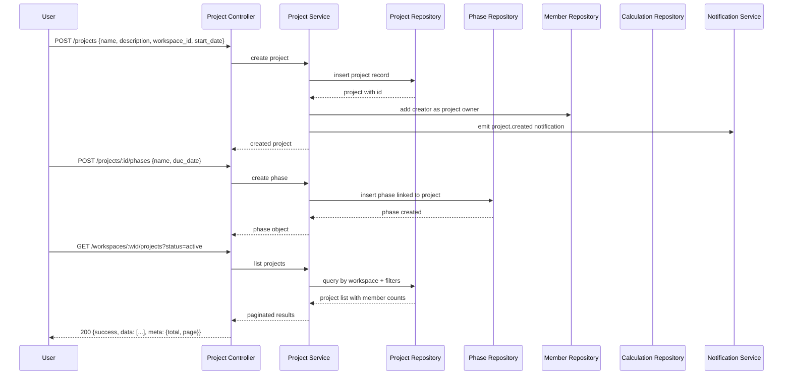
```mermaid
sequenceDiagram
    participant User
    participant ProjAPI as Project Controller
    participant ProjSvc as Project Service
    participant ProjRepo as Project Repository
    participant PhaseRepo as Phase Repository
    participant MemberRepo as Member Repository
    participant CalcRepo as Calculation Repository
    participant NotifSvc as Notification Service

    User->>ProjAPI: POST /projects {name, description, workspace_id, start_date}
    ProjAPI->>ProjSvc: create project
    ProjSvc->>ProjRepo: insert project record
    ProjRepo-->>ProjSvc: project with id
    ProjSvc->>MemberRepo: add creator as project owner
    ProjSvc->>NotifSvc: emit project.created notification
    ProjSvc-->>ProjAPI: created project

    User->>ProjAPI: POST /projects/:id/phases {name, due_date}
    ProjAPI->>ProjSvc: create phase
    ProjSvc->>PhaseRepo: insert phase linked to project
    PhaseRepo-->>ProjSvc: phase created
    ProjSvc-->>ProjAPI: phase object

    User->>ProjAPI: GET /workspaces/:wid/projects?status=active
    ProjAPI->>ProjSvc: list projects
    ProjSvc->>ProjRepo: query by workspace + filters
    ProjRepo-->>ProjSvc: project list with member counts
    ProjSvc-->>ProjAPI: paginated results
    ProjAPI-->>User: 200 {success, data: [...], meta: {total, page}}
```

---

### 10.6 Engineering

#### Description

The Engineering domain is the core calculation engine of Xennic. It executes electrical engineering formulas for motor analysis, transformer analysis, protection coordination, cable sizing, power quality, and solar energy calculations. The domain maintains a formula catalog with versioned calculation definitions, standard references, and unit conversion utilities. Results are persisted for auditability and can be linked to projects.

#### Prisma Models

| Model | Schema Name | Description |
|-------|-------------|-------------|
| Calculation | `calculations` | Executed calculation record with inputs, results, engine version |
| Calculation Template | `calculation_templates` | Saved calculation templates with predefined input schemas |
| Engineering Standard | `engineering_standards` | Reference standards (IEC, IEEE, ANSI, ISIRI) with metadata |

#### API Endpoints

| Method | Path | Description |
|--------|------|-------------|
| POST | `/api/v1/engineering/run` | Execute a calculation by type with provided inputs |
| GET | `/api/v1/engineering/calculations` | List calculation history with type, date, and user filters |
| GET | `/api/v1/engineering/calculations/:id` | Get detailed calculation result with full input/output JSON |
| POST | `/api/v1/engineering/verify` | Re-verify a calculation against current formula version |
| GET | `/api/v1/engineering/catalog` | List available calculation catalog with formula metadata |
| GET | `/api/v1/engineering/catalog/:code` | Get formula details including inputs, outputs, and standard reference |
| POST | `/api/v1/engineering/convert` | Convert a value between units (e.g. kW to hp) |
| POST | `/api/v1/engineering/templates` | Save a calculation as a reusable template |
| GET | `/api/v1/engineering/templates` | List saved calculation templates |
| DELETE | `/api/v1/engineering/templates/:id` | Delete a calculation template |

#### Supported Calculation Types

| Code | Category | Description | Standards | Input Count |
|------|----------|-------------|-----------|-------------|
| BASIC-001 | Ohm's Law | Voltage, current, resistance, power calculations | IEC 60038 | 2 |
| MOTOR-001 | Motor Analysis | Full motor parameter analysis (power, torque, efficiency) | IEC 60034, NEMA MG1 | 8 |
| MOTOR-002 | Motor Starting | Starting current, voltage drop, starting time | IEC 60034-12 | 5 |
| TRANS-001 | Transformer Analysis | Transformer rating, impedance, regulation | IEC 60076 | 6 |
| TRANS-002 | Transformer Loss | No-load and load loss calculations | IEC 60076-1 | 4 |
| CABLE-001 | Cable Sizing | Conductor sizing based on current, length, material | IEC 60364, NEC | 7 |
| CABLE-002 | Voltage Drop | Voltage drop calculation for AC/DC circuits | IEC 60364-5-52 | 5 |
| PROT-001 | Protection Coordination | Relay setting calculation and coordination | IEC 60255, ANSI C37 | 6 |
| PROT-002 | Short Circuit | Short circuit current calculation (symmetrical/asymmetrical) | IEC 60909 | 4 |
| PQ-001 | Power Factor | Power factor correction capacitor sizing | IEC 61000 | 4 |
| PQ-002 | Harmonic Analysis | Total harmonic distortion (THD) calculation | IEEE 519 | 3 |
| SOLAR-001 | PV Sizing | Solar panel array sizing and energy yield | IEC 61724 | 6 |
| SOLAR-002 | Inverter Sizing | Inverter selection and string sizing | IEC 62116 | 4 |
| LIGHT-001 | Illuminance | Indoor/outdoor lighting level calculations | CIE S 026, IEC 60598 | 5 |

#### Formula Catalog

| Field | Description |
|-------|-------------|
| `code` | Unique calculation identifier (e.g. `MOTOR-001`) |
| `version` | Semantic version of the formula |
| `name` | Human-readable formula name |
| `name_fa` | Persian formula name |
| `category` | Engineering category grouping |
| `standard` | Reference standard code |
| `inputs` | Array of input parameter definitions with name, type, unit, validation |
| `outputs` | Array of output parameter definitions with name, type, unit |
| `formula` | LaTeX or MathML expression of the formula |
| `validation_rules` | Business rules for input validation |
| `deprecated` | Boolean flag for deprecated formulas |
| `superseded_by` | Code of replacement formula if deprecated |

#### Domain Events

| Event | Publisher | Description |
|-------|-----------|-------------|
| `calculation.executed` | Engineering Service | Fired when a calculation completes successfully |
| `calculation.verified` | Engineering Service | Fired when a past calculation is re-verified |
| `calculation.template.created` | Engineering Service | Fired when a template is saved |
| `catalog.updated` | Engineering Service | Fired when the formula catalog version changes |

#### Inter-Domain Dependencies

| Domain | Dependency | Direction | Rationale |
|--------|------------|-----------|-----------|
| Workspace | Engineering | ← | Calculations are scoped to workspaces |
| Authentication | Engineering | ← | User attribution for calculation history |
| Projects | Engineering | ⇄ | Calculations can be linked to/from projects |
| Knowledge | Engineering | → | Engineering results can reference knowledge entries |
| AI | Engineering | → | AI uses engineering results for recommendations |

#### Typical Interaction Flow

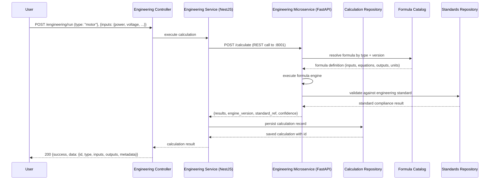
```mermaid
sequenceDiagram
    participant User
    participant EngAPI as Engineering Controller
    participant EngSvc as Engineering Service (NestJS)
    participant EngMS as Engineering Microservice (FastAPI)
    participant CalcRepo as Calculation Repository
    participant Catalog as Formula Catalog
    participant StdRepo as Standards Repository

    User->>EngAPI: POST /engineering/run {type: "motor"}, {inputs: {power, voltage, ...}}
    EngAPI->>EngSvc: execute calculation
    EngSvc->>EngMS: POST /calculate (REST call to :8001)
    EngMS->>Catalog: resolve formula by type + version
    Catalog-->>EngMS: formula definition (inputs, equations, outputs, units)
    EngMS->>EngMS: execute formula engine
    EngMS->>StdRepo: validate against engineering standard
    StdRepo-->>EngMS: standard compliance result
    EngMS-->>EngSvc: {results, engine_version, standard_ref, confidence}
    EngSvc->>CalcRepo: persist calculation record
    CalcRepo-->>EngSvc: saved calculation with id
    EngSvc-->>EngAPI: calculation result
    EngAPI-->>User: 200 {success, data: {id, type, inputs, outputs, metadata}}
```

---

### 10.7 Knowledge

#### Description

The Knowledge domain is the structured engineering knowledge management system (EKO — Engineering Knowledge Objects). It manages multi-dimensional taxonomy (categories, topics, tags, disciplines, audiences), block-based rich content with multimedia, versioned revisions, workflow-based publishing, multilingual translations, and formulas with interactive calculators. Knowledge entries support full-text and semantic search, comments, and analytics tracking.

#### Prisma Models

| Model | Schema Name | Description |
|-------|-------------|-------------|
| Knowledge | `knowledge` | Core knowledge entry with status, visibility, language, content blocks |
| Knowledge Version | `knowledge_versions` | Versioned snapshots of knowledge content |
| Knowledge Translation | `knowledge_translations` | Locale-specific titles, SEO metadata, and translated content |
| Knowledge Taxonomy | `knowledge_taxonomy` | Polymorphic taxonomy join (category, topic, tag, discipline, audience) |
| Knowledge Media | `knowledge_media` | Multimedia attachments (images, PDFs, CAD files, videos) |
| Knowledge Formula | `knowledge_formulas` | LaTeX/MathML formulas linked to calculator types |
| Knowledge Example | `knowledge_examples` | Step-by-step worked examples with difficulty levels |
| Knowledge Standard | `knowledge_standards` | Many-to-many link to engineering standards |
| Knowledge Comment | `knowledge_comments` | Threaded comments on knowledge entries |
| Knowledge Workflow | `knowledge_workflows` | Publishing workflow state machine (draft → review → published) |
| Knowledge Workflow History | `knowledge_workflow_history` | Audit trail of workflow transitions |
| Knowledge Analytics | `knowledge_analytics` | View counts, likes, bookmarks, shares, reading time |
| Category | `categories` | Hierarchical knowledge categories (tree structure) |
| Topic | `topics` | Cross-cutting knowledge topics |
| Tag | `tags` | Free-form knowledge tags |
| Discipline | `disciplines` | Engineering discipline classification |
| Audience | `audiences` | Target audience classification |
| Engineering Standard | `engineering_standards` | Reference engineering standards |

#### API Endpoints

| Method | Path | Description |
|--------|------|-------------|
| POST | `/api/v1/knowledge` | Create a new knowledge entry (draft status) |
| GET | `/api/v1/knowledge/:id` | Get knowledge entry with taxonomy, media, formulas |
| PATCH | `/api/v1/knowledge/:id` | Update knowledge content, metadata, or taxonomy |
| POST | `/api/v1/knowledge/:id/publish` | Submit for review or publish directly |
| POST | `/api/v1/knowledge/:id/supersede` | Mark as superseded by linking to newer entry |
| POST | `/api/v1/knowledge/:id/archive` | Archive knowledge (remove from active listings) |
| GET | `/api/v1/knowledge` | List knowledge entries with filters (status, language, category) |
| POST | `/api/v1/knowledge/:id/comments` | Add a comment to a knowledge entry |
| POST | `/api/v1/knowledge/concepts` | Create a concept definition |
| GET | `/api/v1/knowledge/concepts/:id` | Get concept with relationships |
| POST | `/api/v1/knowledge/relationships` | Relate two knowledge entries or concepts |
| GET | `/api/v1/knowledge/search` | Full-text search across knowledge base |
| GET | `/api/v1/knowledge/graph` | Get knowledge graph for a specific entry or category |

#### Content Block Types

| Block Type | Description | JSON Structure |
|------------|-------------|----------------|
| `heading` | Section heading with level (2-4) | `{type: "heading", data: {level: 2, text: "..."}}` |
| `paragraph` | Rich text paragraph (Markdown) | `{type: "paragraph", data: {text: "...", format: "markdown"}}` |
| `image` | Embedded image with captions | `{type: "image", data: {url, caption_fa, caption_en, alt, width}}` |
| `video` | Embedded video | `{type: "video", data: {url, caption_fa, caption_en, duration}}` |
| `code` | Code block with language | `{type: "code", data: {language, code}}` |
| `formula` | LaTeX/MathML formula | `{type: "formula", data: {latex, mathml, calculator_type}}` |
| `table` | Structured data table | `{type: "table", data: {headers: [...], rows: [[...]]}}` |
| `list` | Ordered or unordered list | `{type: "list", data: {style: "ordered|unordered", items: [...]}}` |
| `callout` | Highlighted callout box | `{type: "callout", data: {style: "info|warning|tip|note", text: "..."}}` |
| `example` | Worked example with steps | `{type: "example", data: {difficulty, steps: [...], answer}}` |
| `reference` | Cross-reference to other knowledge | `{type: "reference", data: {knowledge_id, slug, title}}` |
| `attachment` | Downloadable file attachment | `{type: "attachment", data: {file_id, filename, mime_type, size}}` |

#### Workflow States

| State | Description | Allowed Transitions |
|-------|-------------|--------------------|
| `draft` | Initial state, entry being authored | `submit` → `in_review` |
| `in_review` | Under review by assigned reviewer | `approve` → `published`, `reject` → `draft`, `request_changes` → `changes_requested` |
| `changes_requested` | Author needs to address reviewer feedback | `resubmit` → `in_review` |
| `published` | Live and visible according to visibility setting | `archive` → `archived`, `supersede` → `superseded` |
| `archived` | Removed from active listings, retained for reference | `restore` → `draft` |
| `superseded` | Replaced by newer knowledge entry | — (terminal) |

#### Visibility Levels

| Level | Description |
|-------|-------------|
| `public` | Visible to all users (including unauthenticated) |
| `workspace` | Visible only to members of the owning workspace |
| `internal` | Visible only to workspace members with explicit permission |
| `private` | Visible only to author, reviewer, and workspace admins |

#### Analytics Dimensions

| Metric | Collection Method | Description |
|--------|-------------------|-------------|
| Views | Incremented on knowledge GET | Total page views |
| Unique Views | Cookie/session-based dedup | Unique visitor count |
| Likes | User toggle action | Total likes (user must be authenticated) |
| Bookmarks | User bookmark action | Saved for later reading |
| Shares | Share button click | Count of share actions |
| Downloads | Media/PDF download count | PDF or attachment downloads |
| Avg Reading Time | Scroll depth + time on page | Average time spent reading |
| Daily Stats | Cron-aggregated hourly | Daily view/like/share breakdown stored as JSON |

#### Domain Events

| Event | Publisher | Description |
|-------|-----------|-------------|
| `knowledge.created` | Knowledge Service | Fired when a knowledge entry is created |
| `knowledge.updated` | Knowledge Service | Fired when content or metadata changes |
| `knowledge.published` | Knowledge Service | Fired when entry moves to published status |
| `knowledge.superseded` | Knowledge Service | Fired when an entry is superseded by a newer version |
| `knowledge.archived` | Knowledge Service | Fired when an entry is archived |
| `knowledge.comment.added` | Knowledge Service | Fired when a new comment is posted |
| `knowledge.version.created` | Knowledge Service | Fired when a new version snapshot is saved |

#### Inter-Domain Dependencies

| Domain | Dependency | Direction | Rationale |
|--------|------------|-----------|-----------|
| Workspace | Knowledge | ← | Knowledge entries are workspace-scoped |
| Authentication | Knowledge | ← | Author/reviewer attribution |
| Engineering | Knowledge | → | Knowledge formulas reference calculator types |
| AI | Knowledge | → | AI uses knowledge base for RAG |
| Search | Knowledge | → | Knowledge entries are the primary search target |
| Storage/Files | Knowledge | → | Knowledge media files stored in file system |
| Notifications | Knowledge | → | Workflow transitions trigger notifications |

#### Typical Interaction Flow

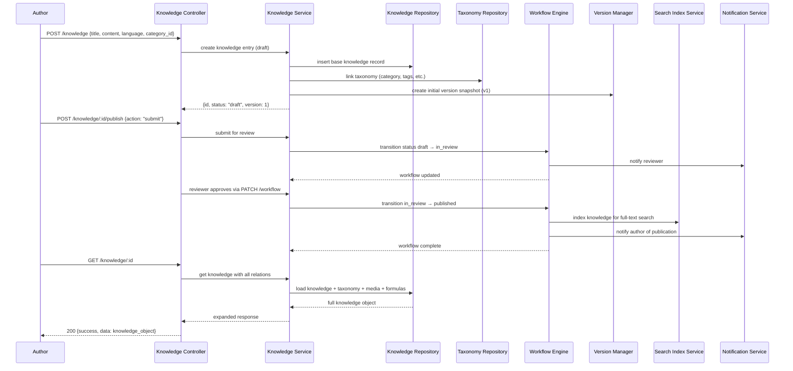
```mermaid
sequenceDiagram
    participant Author
    participant KnowAPI as Knowledge Controller
    participant KnowSvc as Knowledge Service
    participant KnowRepo as Knowledge Repository
    participant TaxRepo as Taxonomy Repository
    participant Workflow as Workflow Engine
    participant Version as Version Manager
    participant SearchSvc as Search Index Service
    participant NotifSvc as Notification Service

    Author->>KnowAPI: POST /knowledge {title, content, language, category_id}
    KnowAPI->>KnowSvc: create knowledge entry (draft)
    KnowSvc->>KnowRepo: insert base knowledge record
    KnowSvc->>TaxRepo: link taxonomy (category, tags, etc.)
    KnowSvc->>Version: create initial version snapshot (v1)
    KnowSvc-->>KnowAPI: {id, status: "draft", version: 1}

    Author->>KnowAPI: POST /knowledge/:id/publish {action: "submit"}
    KnowAPI->>KnowSvc: submit for review
    KnowSvc->>Workflow: transition status draft → in_review
    Workflow->>NotifSvc: notify reviewer
    Workflow-->>KnowSvc: workflow updated

    KnowAPI->>KnowSvc: reviewer approves via PATCH /workflow
    KnowSvc->>Workflow: transition in_review → published
    Workflow->>SearchSvc: index knowledge for full-text search
    Workflow->>NotifSvc: notify author of publication
    Workflow-->>KnowSvc: workflow complete

    Author->>KnowAPI: GET /knowledge/:id
    KnowAPI->>KnowSvc: get knowledge with all relations
    KnowSvc->>KnowRepo: load knowledge + taxonomy + media + formulas
    KnowRepo-->>KnowSvc: full knowledge object
    KnowSvc-->>KnowAPI: expanded response
    KnowAPI-->>Author: 200 {success, data: knowledge_object}
```

---

### 10.8 AI

#### Description

The AI domain provides conversational AI capabilities through managed threads and agent-powered conversations. Users can interact with domain-specific AI agents for engineering assistance, document analysis, and technical Q&A. The domain tracks token usage per workspace for billing, supports message ratings for quality improvement, and provides AI suggestions for calculations and knowledge search.

#### Prisma Models

| Model | Schema Name | Description |
|-------|-------------|-------------|
| Agent | `agents` | AI agent definitions with versioning and activation |
| Conversation | `conversations` | Conversation threads scoped to workspace and agent |
| Message | `messages` | Individual messages within a conversation with role and metadata |
| AI Usage | `ai_usage` | Token and cost tracking per user/workspace/agent |

#### API Endpoints

| Method | Path | Description |
|--------|------|-------------|
| POST | `/api/v1/ai/conversations` | Create a new conversation thread with an agent |
| POST | `/api/v1/ai/conversations/:id/messages` | Send a message and receive AI response |
| GET | `/api/v1/ai/conversations/:id` | Get conversation with message history |
| GET | `/api/v1/ai/conversations` | List user's conversations with last message preview |
| DELETE | `/api/v1/ai/conversations/:id` | Delete a conversation and all its messages |
| GET | `/api/v1/ai/conversations/:id/thread` | Get full thread export with metadata |
| POST | `/api/v1/ai/messages/:id/rate` | Rate a message response (helpful/not helpful) |
| GET | `/api/v1/ai/suggestions` | Get AI suggestions based on context (calculation, knowledge) |
| GET | `/api/v1/ai/usage` | Get AI usage statistics for current workspace |

#### Domain Events

| Event | Publisher | Description |
|-------|-----------|-------------|
| `conversation.created` | AI Service | Fired when a new conversation starts |
| `message.sent` | AI Service | Fired when a message is exchanged |
| `message.rated` | AI Service | Fired when a user rates an AI response |
| `ai.usage.threshold` | AI Service | Fired when usage approaches plan limits |
| `conversation.deleted` | AI Service | Fired when a conversation is removed |

#### Inter-Domain Dependencies

| Domain | Dependency | Direction | Rationale |
|--------|------------|-----------|-----------|
| Workspace | AI | ← | Conversations are workspace-scoped |
| Authentication | AI | ← | User attribution for messages and usage tracking |
| Knowledge | AI | → | AI performs RAG over knowledge base |
| Engineering | AI | → | AI provides engineering calculation suggestions |
| Billing/Subscription | AI | → | AI usage counts towards subscription limits |
| Notifications | AI | → | AI can trigger notification delivery |

#### Typical Interaction Flow

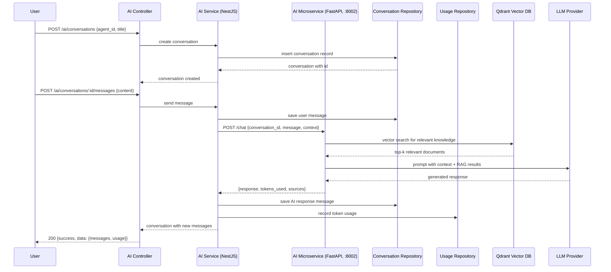
```mermaid
sequenceDiagram
    participant User
    participant AIAPI as AI Controller
    participant AISvc as AI Service (NestJS)
    participant AIMS as AI Microservice (FastAPI, :8002)
    participant ConvRepo as Conversation Repository
    participant UsageRepo as Usage Repository
    participant Qdrant as Qdrant Vector DB
    participant LLM as LLM Provider

    User->>AIAPI: POST /ai/conversations {agent_id, title}
    AIAPI->>AISvc: create conversation
    AISvc->>ConvRepo: insert conversation record
    ConvRepo-->>AISvc: conversation with id
    AISvc-->>AIAPI: conversation created

    User->>AIAPI: POST /ai/conversations/:id/messages {content}
    AIAPI->>AISvc: send message
    AISvc->>ConvRepo: save user message
    AISvc->>AIMS: POST /chat {conversation_id, message, context}
    AIMS->>Qdrant: vector search for relevant knowledge
    Qdrant-->>AIMS: top-k relevant documents
    AIMS->>LLM: prompt with context + RAG results
    LLM-->>AIMS: generated response
    AIMS-->>AISvc: {response, tokens_used, sources}
    AISvc->>ConvRepo: save AI response message
    AISvc->>UsageRepo: record token usage
    AISvc-->>AIAPI: conversation with new messages
    AIAPI-->>User: 200 {success, data: {messages, usage}}
```

---

### 10.9 Vision / OCR

#### Description

The Vision domain handles automated document image processing and optical character recognition (OCR) for engineering documents. It uses a cascading pipeline (EasyOCR → Tesseract → Vision LLM) for resilient text extraction, auto-detects document types (nameplates, bills, diagrams), and can detect structured elements like tables, formulas, and diagrams within engineering drawings.

#### Prisma Models

| Model | Schema Name | Description |
|-------|-------------|-------------|
| Document Page | (analysis records in `analyses`) | Processed document pages with status and confidence |
| OCR Result | (stored as JSON output in analyses) | Extracted text with bounding boxes and confidence scores |
| Text Detection | (stored as JSON in analyses) | Detected text regions with classifications |

#### API Endpoints

| Method | Path | Description |
|--------|------|-------------|
| POST | `/api/v1/vision/submit` | Submit a document page image for processing |
| GET | `/api/v1/vision/status/:id` | Get processing status for a submitted page |
| GET | `/api/v1/vision/result/:id` | Get OCR results with extracted text and confidence scores |
| POST | `/api/v1/vision/reprocess/:id` | Reprocess a page with different pipeline configuration |
| POST | `/api/v1/vision/detect/tables` | Detect and extract table structures from document |
| POST | `/api/v1/vision/detect/formulas` | Detect mathematical/engineering formulas in document |
| POST | `/api/v1/vision/detect/diagrams` | Detect and classify diagrams in engineering drawings |
| GET | `/api/v1/vision/modes` | List available OCR engines and pipeline modes |

#### Domain Events

| Event | Publisher | Description |
|-------|-----------|-------------|
| `document.submitted` | Vision Service | Fired when a document is submitted for processing |
| `document.processed` | Vision Service | Fired when OCR processing completes |
| `document.reprocessing` | Vision Service | Fired when a document is queued for reprocessing |
| `table.detected` | Vision Service | Fired when table detection completes on a document |
| `formula.detected` | Vision Service | Fired when formula detection completes |

#### Inter-Domain Dependencies

| Domain | Dependency | Direction | Rationale |
|--------|------------|-----------|-----------|
| Workspace | Vision | ← | Documents are workspace-scoped (via analysis) |
| Authentication | Vision | ← | Processing attribution |
| Engineering | Vision | → | Extracted data is sent to engineering for validation |
| Storage/Files | Vision | → | Document images are stored and retrieved |
| AI | Vision | → | LLM-based OCR and document analysis |

#### Typical Interaction Flow

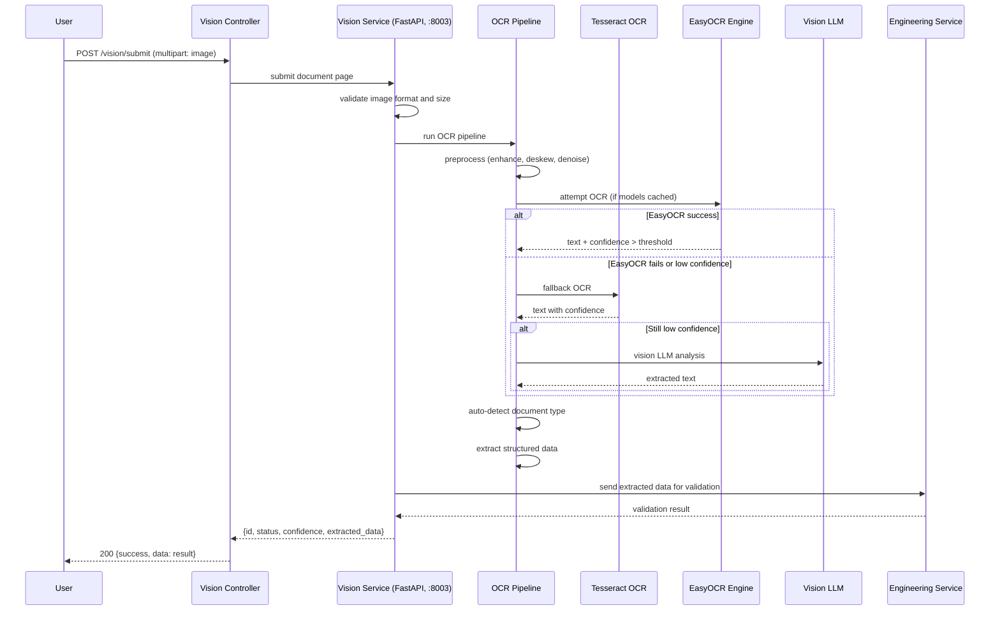
```mermaid
sequenceDiagram
    participant User
    participant VisionAPI as Vision Controller
    participant VisionSvc as Vision Service (FastAPI, :8003)
    participant Pipeline as OCR Pipeline
    participant Tesseract as Tesseract OCR
    participant EasyOCR as EasyOCR Engine
    participant LLM as Vision LLM
    participant EngSvc as Engineering Service

    User->>VisionAPI: POST /vision/submit (multipart: image)
    VisionAPI->>VisionSvc: submit document page
    VisionSvc->>VisionSvc: validate image format and size
    VisionSvc->>Pipeline: run OCR pipeline
    Pipeline->>Pipeline: preprocess (enhance, deskew, denoise)
    Pipeline->>EasyOCR: attempt OCR (if models cached)
    alt EasyOCR success
        EasyOCR-->>Pipeline: text + confidence > threshold
    else EasyOCR fails or low confidence
        Pipeline->>Tesseract: fallback OCR
        Tesseract-->>Pipeline: text with confidence
        alt Still low confidence
            Pipeline->>LLM: vision LLM analysis
            LLM-->>Pipeline: extracted text
        end
    end
    Pipeline->>Pipeline: auto-detect document type
    Pipeline->>Pipeline: extract structured data
    VisionSvc->>EngSvc: send extracted data for validation
    EngSvc-->>VisionSvc: validation result
    VisionSvc-->>VisionAPI: {id, status, confidence, extracted_data}
    VisionAPI-->>User: 200 {success, data: result}
```

---

### 10.10 Marketplace

#### Description

The Marketplace domain enables a B2B/B2C engineering equipment and service trading platform within Xennic. Vendors list engineering products (cables, transformers, switchgear, PPE, etc.) with technical specifications, pricing, and multilingual descriptions. Buyers can search, filter by technical parameters, submit reviews, and place orders. The domain manages listing versions, review ratings, and order lifecycle.

#### Prisma Models

| Model | Schema Name | Description |
|-------|-------------|-------------|
| Vendor | `vendors` | Vendor/supplier entity with name, slug, and status |
| Product | `products` | Product listings with type, category, specs, SKU, price |
| Product Translation | `product_translations` | Locale-specific titles and descriptions |
| Order | `orders` | Customer orders with status and totals |
| Order Item | `order_items` | Line items within an order |

#### API Endpoints

| Method | Path | Description |
|--------|------|-------------|
| POST | `/api/v1/marketplace/listings` | Create a new product listing |
| GET | `/api/v1/marketplace/listings/:id` | Get listing with vendor info, specs, and reviews |
| PATCH | `/api/v1/marketplace/listings/:id` | Update listing details, specs, or pricing |
| POST | `/api/v1/marketplace/listings/:id/publish` | Publish a draft listing to make it visible |
| GET | `/api/v1/marketplace/categories` | List product categories with hierarchy |
| GET | `/api/v1/marketplace/search` | Search listings by keyword, category, specs, price range |
| POST | `/api/v1/marketplace/listings/:id/reviews` | Submit a product review with rating |
| POST | `/api/v1/marketplace/orders` | Create an order with multiple line items |
| GET | `/api/v1/marketplace/orders/:id` | Get order details with status tracking |
| GET | `/api/v1/marketplace/listings/:id/versions` | Get listing version history |

#### Domain Events

| Event | Publisher | Description |
|-------|-----------|-------------|
| `listing.created` | Marketplace Service | Fired when a listing is created |
| `listing.published` | Marketplace Service | Fired when a listing goes live |
| `listing.updated` | Marketplace Service | Fired when listing details change |
| `listing.price_changed` | Marketplace Service | Fired when price is modified |
| `order.created` | Marketplace Service | Fired when a new order is placed |
| `order.status_changed` | Marketplace Service | Fired on order status transitions |
| `review.submitted` | Marketplace Service | Fired when a product review is posted |

#### Inter-Domain Dependencies

| Domain | Dependency | Direction | Rationale |
|--------|------------|-----------|-----------|
| Workspace | Marketplace | ← | Orders and listings are workspace-scoped |
| Authentication | Marketplace | ← | User attribution for orders and reviews |
| Billing/Subscription | Marketplace | ← | Listing creation may require active subscription |
| Storage/Files | Marketplace | → | Product images and catalogs stored in file system |
| Notifications | Marketplace | → | Order updates trigger email/in-app notifications |

#### Typical Interaction Flow

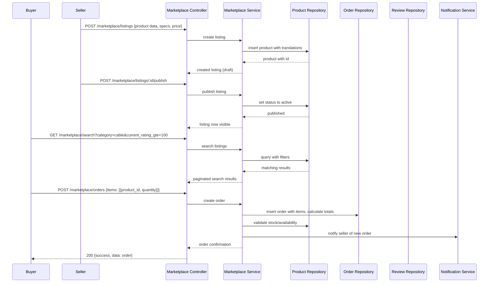
```mermaid
sequenceDiagram
    participant Buyer
    participant Seller
    participant MktAPI as Marketplace Controller
    participant MktSvc as Marketplace Service
    participant ProdRepo as Product Repository
    participant OrderRepo as Order Repository
    participant RevRepo as Review Repository
    participant NotifSvc as Notification Service

    Seller->>MktAPI: POST /marketplace/listings {product data, specs, price}
    MktAPI->>MktSvc: create listing
    MktSvc->>ProdRepo: insert product with translations
    ProdRepo-->>MktSvc: product with id
    MktSvc-->>MktAPI: created listing (draft)

    Seller->>MktAPI: POST /marketplace/listings/:id/publish
    MktAPI->>MktSvc: publish listing
    MktSvc->>ProdRepo: set status to active
    ProdRepo-->>MktSvc: published
    MktSvc-->>MktAPI: listing now visible

    Buyer->>MktAPI: GET /marketplace/search?category=cable&current_rating_gte=100
    MktAPI->>MktSvc: search listings
    MktSvc->>ProdRepo: query with filters
    ProdRepo-->>MktSvc: matching results
    MktSvc-->>MktAPI: paginated search results

    Buyer->>MktAPI: POST /marketplace/orders {items: [{product_id, quantity}]}
    MktAPI->>MktSvc: create order
    MktSvc->>OrderRepo: insert order with items, calculate totals
    MktSvc->>ProdRepo: validate stock/availability
    MktSvc->>NotifSvc: notify seller of new order
    MktSvc-->>MktAPI: order confirmation
    MktAPI-->>Buyer: 200 {success, data: order}
```

---

### 10.11 Billing / Subscription

#### Description

The Billing and Subscription domain manages the platform's monetization model. It defines subscription plans with feature sets and pricing (monthly/yearly), tracks workspace subscriptions through their lifecycle, generates invoices for recurring and one-time charges, processes payments through multiple gateways, and manages stored payment methods. Usage-based billing is supported through integration with the AI usage tracking system.

#### Prisma Models

| Model | Schema Name | Description |
|-------|-------------|-------------|
| Subscription Plan | `plans` | Plan definitions with name, slug, pricing, features JSON |
| Subscription | `subscriptions` | Workspace subscription with status, start/end/cancelled dates |
| Subscription Payment | `subscription_payments` | Payment records linked to subscriptions |
| Invoice | `invoices` | Billing invoices with line items, taxes, totals |
| Payment | `payments` | Payment transactions with gateway and reference info |
| Transaction | `transactions` | Individual financial transaction records |
| Payment Method | `payment_methods` | Stored payment methods per workspace/user |
| Usage Log | `usage_logs` | Feature usage tracking for usage-based billing |

#### API Endpoints

| Method | Path | Description |
|--------|------|-------------|
| GET | `/api/v1/billing/plans` | List available subscription plans with features and pricing |
| POST | `/api/v1/billing/subscriptions` | Subscribe a workspace to a plan |
| POST | `/api/v1/billing/subscriptions/cancel` | Cancel current subscription at period end |
| PATCH | `/api/v1/billing/subscriptions/plan` | Change subscription plan (prorated) |
| GET | `/api/v1/billing/invoices` | List all invoices for a workspace with pagination |
| GET | `/api/v1/billing/invoices/:id` | Get invoice details with line items |
| POST | `/api/v1/billing/payments` | Create and process a payment |
| GET | `/api/v1/billing/payment-methods` | List stored payment methods |
| POST | `/api/v1/billing/payment-methods` | Add a new payment method |
| DELETE | `/api/v1/billing/payment-methods/:id` | Remove a stored payment method |
| GET | `/api/v1/billing/usage` | Get current billing period usage statistics |

#### Supported Plans

| Plan Slug | Name | Monthly Price | Yearly Price | Key Features |
|-----------|------|---------------|--------------|--------------|
| `free` | Free | $0 | $0 | 1 workspace, 3 projects, 50 calculations/month, basic knowledge access |
| `starter` | Starter | $29 | $290 | 3 workspaces, 20 projects, 500 calculations/month, AI chat (100 msg/day) |
| `professional` | Professional | $79 | $790 | 10 workspaces, unlimited projects, 5000 calculations/month, AI chat (500 msg/day), API access |
| `enterprise` | Enterprise | $199 | $1,990 | Unlimited workspaces, unlimited projects, unlimited calculations, AI chat (unlimited), API access, SSO, dedicated support |

#### Payment Gateways

| Gateway | Status | Currencies | Features |
|---------|--------|------------|----------|
| Stripe | ✅ Active | USD, EUR, GBP | Cards, Apple Pay, Google Pay, SEPA, automatic renewal |
| Zarinpal | ✅ Active | IRR, IRT | Iranian payment gateway, card-to-card, bank transfer |
| PayPing | ✅ Active | IRR, IRT | Iranian payment gateway, card-to-card |
| PayPal | ⚠️ Planned | USD, EUR | International payments |

#### Billing Cycles

| Cycle | Description | Discount |
|-------|-------------|----------|
| Monthly | Billed every 30 days from subscription start | — |
| Yearly | Billed annually, 12 months for price of 10 | ~17% discount |
| Custom | Enterprise: custom billing terms | Negotiable |

#### Domain Events

| Event | Publisher | Description |
|-------|-----------|-------------|
| `subscription.created` | Billing Service | Fired when a subscription is activated |
| `subscription.cancelled` | Billing Service | Fired when a subscription is cancelled |
| `subscription.plan_changed` | Billing Service | Fired when plan is upgraded/downgraded |
| `subscription.renewed` | Billing Service | Fired on automatic renewal |
| `subscription.expiring` | Billing Service | Fired 7 days before subscription expiry |
| `invoice.generated` | Billing Service | Fired when an invoice is created |
| `invoice.paid` | Billing Service | Fired on successful payment |
| `invoice.overdue` | Billing Service | Fired when payment is past due |
| `payment.failed` | Billing Service | Fired when a payment transaction fails |
| `payment.method_added` | Billing Service | Fired when a payment method is stored |
| `payment.method_removed` | Billing Service | Fired when a payment method is removed |

#### Inter-Domain Dependencies

| Domain | Dependency | Direction | Rationale |
|--------|------------|-----------|-----------|
| Workspace | Billing | ← | Subscriptions are per-workspace |
| Authentication | Billing | ← | Payment methods require authenticated user |
| Administration | Billing | ⇄ | Feature flags reference plans; plans control features |
| Marketplace | Billing | ← | Marketplace orders may generate invoices |
| AI | Billing | ← | AI usage contributes to billing |
| Notifications | Billing | → | Billing events trigger payment/overdue notifications |

#### Typical Interaction Flow

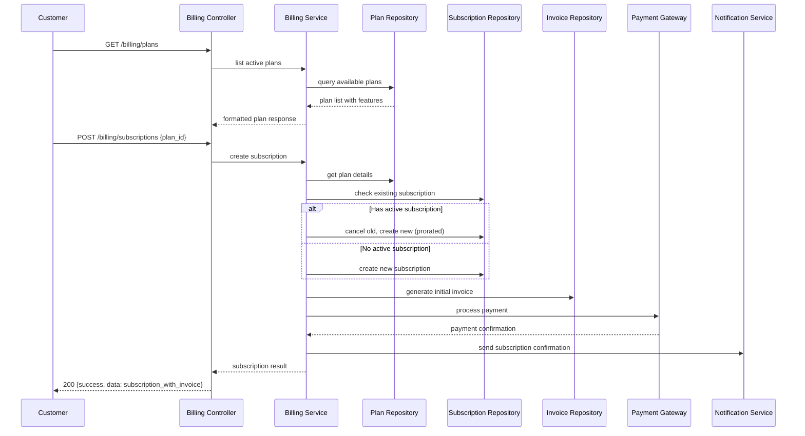
```mermaid
sequenceDiagram
    participant Customer
    participant BillAPI as Billing Controller
    participant BillSvc as Billing Service
    participant PlanRepo as Plan Repository
    participant SubRepo as Subscription Repository
    participant InvoiceRepo as Invoice Repository
    participant PaymentGateway as Payment Gateway
    participant NotifSvc as Notification Service

    Customer->>BillAPI: GET /billing/plans
    BillAPI->>BillSvc: list active plans
    BillSvc->>PlanRepo: query available plans
    PlanRepo-->>BillSvc: plan list with features
    BillSvc-->>BillAPI: formatted plan response

    Customer->>BillAPI: POST /billing/subscriptions {plan_id}
    BillAPI->>BillSvc: create subscription
    BillSvc->>PlanRepo: get plan details
    BillSvc->>SubRepo: check existing subscription
    alt Has active subscription
        BillSvc->>SubRepo: cancel old, create new (prorated)
    else No active subscription
        BillSvc->>SubRepo: create new subscription
    end
    BillSvc->>InvoiceRepo: generate initial invoice
    BillSvc->>PaymentGateway: process payment
    PaymentGateway-->>BillSvc: payment confirmation
    BillSvc->>NotifSvc: send subscription confirmation
    BillSvc-->>BillAPI: subscription result

    BillAPI-->>Customer: 200 {success, data: subscription_with_invoice}
```

---

### 10.12 Storage / Files

#### Description

The Storage domain provides file management capabilities across the platform. Files are organized into logical buckets (documents, images, reports, etc.), stored with versioning support, and linked to various business entities. Each file stores metadata including MIME type, size, checksum, and original filename. Versioning preserves file history and allows restoration of previous versions.

#### Prisma Models

| Model | Schema Name | Description |
|-------|-------------|-------------|
| File | `files` | File records with bucket, path, metadata, and soft-delete |
| File Version | `file_versions` | Versioned snapshots of file content with checksums |

#### API Endpoints

| Method | Path | Description |
|--------|------|-------------|
| POST | `/api/v1/storage/upload` | Upload a file (multipart) to a specified bucket |
| GET | `/api/v1/storage/files/:id/download` | Download file content with stream |
| GET | `/api/v1/storage/files` | List files with bucket, type, date, and size filters |
| DELETE | `/api/v1/storage/files/:id` | Soft-delete a file (moves to trash) |
| GET | `/api/v1/storage/files/:id` | Get file metadata and info |
| POST | `/api/v1/storage/buckets` | Create a new storage bucket |
| GET | `/api/v1/storage/buckets` | List all buckets with file counts and total sizes |
| GET | `/api/v1/storage/files/:id/versions` | List all versions of a file |
| GET | `/api/v1/storage/files/:id/versions/:versionId` | Get specific version metadata |
| POST | `/api/v1/storage/files/:id/restore/:versionId` | Restore a file to a previous version |

#### Domain Events

| Event | Publisher | Description |
|-------|-----------|-------------|
| `file.uploaded` | Storage Service | Fired when a file upload completes |
| `file.deleted` | Storage Service | Fired when a file is soft-deleted |
| `file.version_created` | Storage Service | Fired when a new file version is saved |
| `file.version_restored` | Storage Service | Fired when a previous version is restored |
| `bucket.created` | Storage Service | Fired when a bucket is created |

#### Inter-Domain Dependencies

| Domain | Dependency | Direction | Rationale |
|--------|------------|-----------|-----------|
| Workspace | Storage | ← | Files are workspace-scoped |
| Authentication | Storage | ← | Upload attribution |
| Projects | Storage | ⇄ | Projects store documents; files link to projects |
| Knowledge | Storage | ⇄ | Knowledge entries embed media files |
| Vision | Storage | → | Vision service stores processable documents |
| Marketplace | Storage | → | Product images and catalogs |

#### Typical Interaction Flow

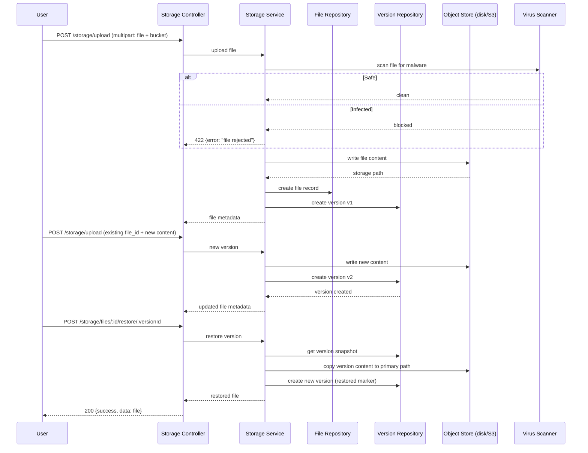
```mermaid
sequenceDiagram
    participant User
    participant FileAPI as Storage Controller
    participant FileSvc as Storage Service
    participant FileRepo as File Repository
    participant VersionRepo as Version Repository
    participant ObjectStore as Object Store (disk/S3)
    participant VirusScan as Virus Scanner

    User->>FileAPI: POST /storage/upload (multipart: file + bucket)
    FileAPI->>FileSvc: upload file
    FileSvc->>VirusScan: scan file for malware
    alt Safe
        VirusScan-->>FileSvc: clean
    else Infected
        VirusScan-->>FileSvc: blocked
        FileSvc-->>FileAPI: 422 {error: "file rejected"}
    end
    FileSvc->>ObjectStore: write file content
    ObjectStore-->>FileSvc: storage path
    FileSvc->>FileRepo: create file record
    FileSvc->>VersionRepo: create version v1
    FileSvc-->>FileAPI: file metadata

    User->>FileAPI: POST /storage/upload (existing file_id + new content)
    FileAPI->>FileSvc: new version
    FileSvc->>ObjectStore: write new content
    FileSvc->>VersionRepo: create version v2
    VersionRepo-->>FileSvc: version created
    FileSvc-->>FileAPI: updated file metadata

    User->>FileAPI: POST /storage/files/:id/restore/:versionId
    FileAPI->>FileSvc: restore version
    FileSvc->>VersionRepo: get version snapshot
    FileSvc->>ObjectStore: copy version content to primary path
    FileSvc->>VersionRepo: create new version (restored marker)
    FileSvc-->>FileAPI: restored file
    FileAPI-->>User: 200 {success, data: file}
```

---

### 10.13 Notifications

#### Description

The Notifications domain provides multi-channel alert delivery across the platform. Users receive in-app notifications (bell icon) for events relevant to them, and can opt into email digests for specific event types. The domain manages notification templates with locale support, user preference settings for channel selection and frequency, and delivery status tracking.

#### Prisma Models

| Model | Schema Name | Description |
|-------|-------------|-------------|
| Notification | `notifications` | Notification records per user with type, channel, content, status |

#### API Endpoints

| Method | Path | Description |
|--------|------|-------------|
| GET | `/api/v1/notifications` | List user notifications with pagination and unread filter |
| PATCH | `/api/v1/notifications/:id/read` | Mark a single notification as read |
| PATCH | `/api/v1/notifications/read-all` | Mark all notifications as read |
| GET | `/api/v1/notifications/preferences` | Get user notification preferences |
| PATCH | `/api/v1/notifications/preferences` | Update notification channel and frequency preferences |
| GET | `/api/v1/notifications/templates` | List available notification templates |
| POST | `/api/v1/notifications/templates` | Create a new notification template |
| PATCH | `/api/v1/notifications/templates/:id` | Update a notification template |
| GET | `/api/v1/notifications/unread-count` | Get count of unread notifications |

#### Domain Events

| Event | Publisher | Description |
|-------|-----------|-------------|
| `notification.sent` | Notification Service | Fired when a notification is dispatched |
| `notification.read` | Notification Service | Fired when a user reads a notification |
| `preferences.updated` | Notification Service | Fired when user notification preferences change |

#### Inter-Domain Dependencies

| Domain | Dependency | Direction | Rationale |
|--------|------------|-----------|-----------|
| Authentication | Notifications | ← | Notification delivery targets users |
| Workspace | Notifications | ← | Some notifications are workspace-scoped |
| All domains | Notifications | ← (consumer) | Various domains publish events that become notifications |
| Administration | Notifications | → | Email templates managed in admin settings |

#### Typical Interaction Flow

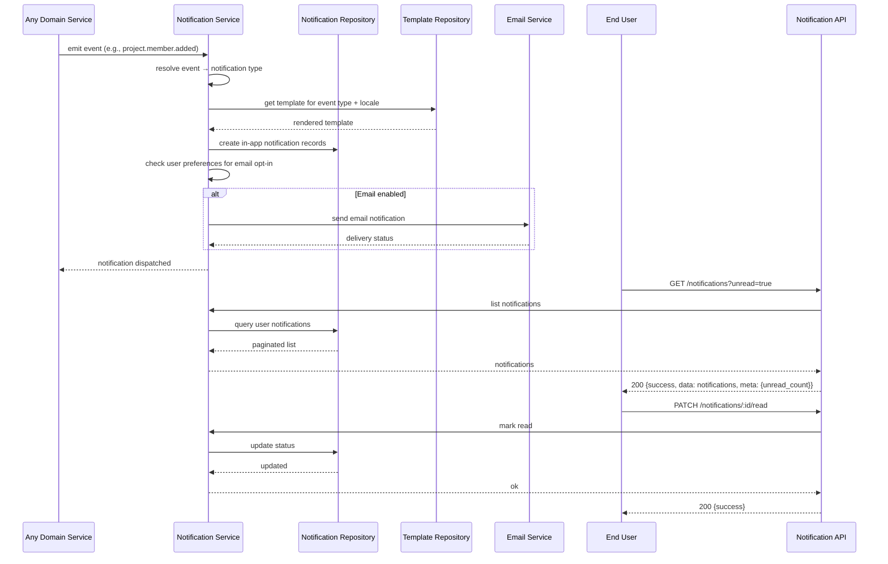
```mermaid
sequenceDiagram
    participant DomainSvc as Any Domain Service
    participant NotifSvc as Notification Service
    participant NotifRepo as Notification Repository
    participant TemplateRepo as Template Repository
    participant EmailSvc as Email Service
    participant User as End User
    participant NotifAPI as Notification API

    DomainSvc->>NotifSvc: emit event (e.g., project.member.added)
    NotifSvc->>NotifSvc: resolve event → notification type
    NotifSvc->>TemplateRepo: get template for event type + locale
    TemplateRepo-->>NotifSvc: rendered template
    NotifSvc->>NotifRepo: create in-app notification records
    NotifSvc->>NotifSvc: check user preferences for email opt-in
    alt Email enabled
        NotifSvc->>EmailSvc: send email notification
        EmailSvc-->>NotifSvc: delivery status
    end
    NotifSvc-->>DomainSvc: notification dispatched

    User->>NotifAPI: GET /notifications?unread=true
    NotifAPI->>NotifSvc: list notifications
    NotifSvc->>NotifRepo: query user notifications
    NotifRepo-->>NotifSvc: paginated list
    NotifSvc-->>NotifAPI: notifications
    NotifAPI-->>User: 200 {success, data: notifications, meta: {unread_count}}

    User->>NotifAPI: PATCH /notifications/:id/read
    NotifAPI->>NotifSvc: mark read
    NotifSvc->>NotifRepo: update status
    NotifRepo-->>NotifSvc: updated
    NotifSvc-->>NotifAPI: ok
    NotifAPI-->>User: 200 {success}
```

---

### 10.14 Search

#### Description

The Search domain provides both full-text and semantic search across the platform's knowledge base, marketplace listings, projects, and documents. Full-text search is powered by database indexes with relevance scoring, while semantic search uses vector embeddings stored in Qdrant. Faceted filtering enables users to narrow results by category, type, date range, and other metadata dimensions. Autocomplete suggestions and search history enhance the user experience.

#### Prisma Models

| Model | Schema Name | Description |
|-------|-------------|-------------|
| (No dedicated model) | — | Search operates over knowledge, products, projects, and files models. Search history is stored in memory/session. |

#### API Endpoints

| Method | Path | Description |
|--------|------|-------------|
| POST | `/api/v1/search` | Unified search across all indexed content types |
| POST | `/api/v1/search/advanced` | Advanced search with structured query, filters, and sort |
| GET | `/api/v1/search/autocomplete` | Autocomplete suggestions as user types |
| GET | `/api/v1/search/facets` | Get available facet values and counts for current query |
| GET | `/api/v1/search/history` | Get current user's recent search history |
| POST | `/api/v1/search/save` | Save a search query for later reuse |
| GET | `/api/v1/search/saved` | List saved searches for current user |
| DELETE | `/api/v1/search/saved/:id` | Delete a saved search |

#### Domain Events

| Event | Publisher | Description |
|-------|-----------|-------------|
| `search.executed` | Search Service | Fired when a search is performed (for analytics) |
| `search.saved` | Search Service | Fired when a search is bookmarked |
| `search.history.cleared` | Search Service | Fired when search history is cleared |

#### Inter-Domain Dependencies

| Domain | Dependency | Direction | Rationale |
|--------|------------|-----------|-----------|
| Knowledge | Search | → | Knowledge entries are the primary search target |
| Marketplace | Search | → | Product listings participate in search |
| Projects | Search | → | Projects are included in global search results |
| AI | Search | → | Semantic search uses AI embedding service |
| Authentication | Search | ← | Search history is user-specific |

#### Typical Interaction Flow

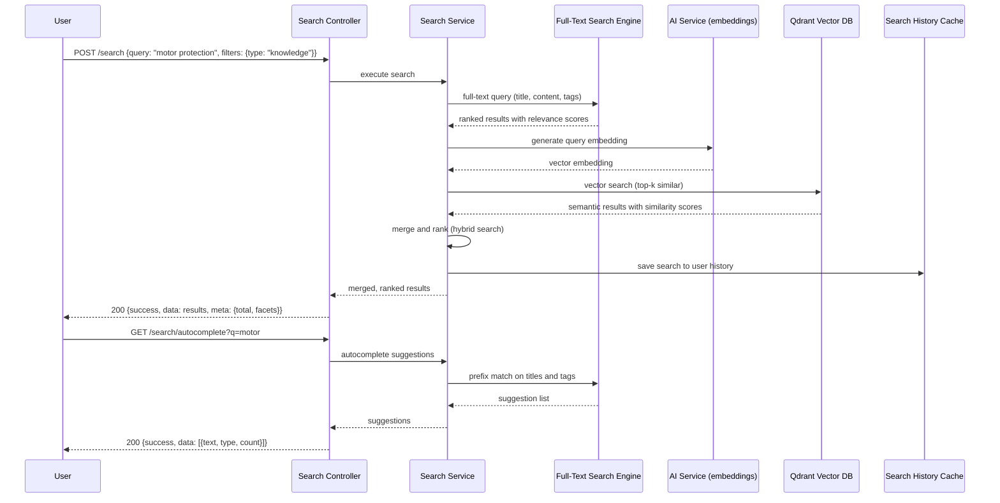
```mermaid
sequenceDiagram
    participant User
    participant SearchAPI as Search Controller
    participant SearchSvc as Search Service
    participant FullText as Full-Text Search Engine
    participant AIMS as AI Service (embeddings)
    participant Qdrant as Qdrant Vector DB
    participant HistoryRepo as Search History Cache

    User->>SearchAPI: POST /search {query: "motor protection", filters: {type: "knowledge"}}
    SearchAPI->>SearchSvc: execute search
    SearchSvc->>FullText: full-text query (title, content, tags)
    FullText-->>SearchSvc: ranked results with relevance scores
    SearchSvc->>AIMS: generate query embedding
    AIMS-->>SearchSvc: vector embedding
    SearchSvc->>Qdrant: vector search (top-k similar)
    Qdrant-->>SearchSvc: semantic results with similarity scores
    SearchSvc->>SearchSvc: merge and rank (hybrid search)
    SearchSvc->>HistoryRepo: save search to user history
    SearchSvc-->>SearchAPI: merged, ranked results
    SearchAPI-->>User: 200 {success, data: results, meta: {total, facets}}

    User->>SearchAPI: GET /search/autocomplete?q=motor
    SearchAPI->>SearchSvc: autocomplete suggestions
    SearchSvc->>FullText: prefix match on titles and tags
    FullText-->>SearchSvc: suggestion list
    SearchSvc-->>SearchAPI: suggestions
    SearchAPI-->>User: 200 {success, data: [{text, type, count}]}
```

---

### 10.15 API Management

#### Description

The API Management domain governs programmatic access to the Xennic platform. It manages API keys for third-party integrations with granular permission scopes, configures webhooks for event-driven integrations with automatic retry and delivery logging, and enforces rate limiting rules to protect backend services from abuse.

#### Prisma Models

| Model | Schema Name | Description |
|-------|-------------|-------------|
| API Key | `api_keys` | API key records with name, key hash, last used, and optional expiry |
| Webhook | `webhooks` | Webhook endpoint configurations with URL, secret, and event subscriptions |
| Rate Limit Rule | (Redis-based) | Rate limit configurations stored in Redis with sliding window |

#### API Endpoints

| Method | Path | Description |
|--------|------|-------------|
| POST | `/api/v1/api-keys` | Create a new API key with name and optional expiry |
| DELETE | `/api/v1/api-keys/:id` | Revoke an API key immediately |
| GET | `/api/v1/api-keys` | List all API keys for workspace (masked keys) |
| POST | `/api/v1/webhooks` | Register a webhook endpoint with event subscriptions |
| PATCH | `/api/v1/webhooks/:id` | Update webhook URL, secret, or subscribed events |
| DELETE | `/api/v1/webhooks/:id` | Delete a webhook registration |
| GET | `/api/v1/webhooks` | List all webhooks for workspace with status |
| GET | `/api/v1/webhooks/:id/deliveries` | Get webhook delivery logs |
| POST | `/api/v1/webhooks/:id/deliveries/:deliveryId/retry` | Retry a failed webhook delivery |
| GET | `/api/v1/rate-limits` | Get current rate limit status and usage |

#### Domain Events

| Event | Publisher | Description |
|-------|-----------|-------------|
| `api_key.created` | API Management Service | Fired when a new API key is generated |
| `api_key.revoked` | API Management Service | Fired when an API key is revoked |
| `webhook.created` | API Management Service | Fired when a webhook is registered |
| `webhook.updated` | API Management Service | Fired when webhook configuration changes |
| `webhook.deleted` | API Management Service | Fired when a webhook is removed |
| `webhook.delivery.succeeded` | API Management Service | Fired on successful webhook delivery |
| `webhook.delivery.failed` | API Management Service | Fired on failed webhook delivery |

#### Inter-Domain Dependencies

| Domain | Dependency | Direction | Rationale |
|--------|------------|-----------|-----------|
| Workspace | API Management | ← | API keys and webhooks are workspace-scoped |
| Authentication | API Management | ← | API key authentication replaces user auth |
| All domains | API Management | → | Rate limiting applies to all API endpoints |
| All domains | API Management | → | Webhooks deliver events from all domains |

#### Typical Interaction Flow

```mermaid
sequenceDiagram
    participant Developer
    participant API as API Management Controller
    participant Svc as API Management Service
    participant KeyRepo as API Key Repository
    participant WebhookRepo as Webhook Repository
    participant DeliverySvc as Webhook Delivery Service
    participant DomainSvc as Any Domain Service
    participant External as External System

    Developer->>API: POST /api-keys {name: "CI/CD Integration"}
    API->>Svc: generate API key
    Svc->>KeyRepo: store key hash
    KeyRepo-->>Svc: key record (with raw key in response only)
    Svc-->>API: {id, name, key: "xen_abc123...", created_at}
    API-->>Developer: 201 {success, data: {key (shown once)}}

    Developer->>API: POST /webhooks {url, secret, events: ["project.*", "calculation.*"]}
    API->>Svc: register webhook
    Svc->>Svc: validate URL reachability
    Svc->>Svc: generate signing secret
    Svc->>WebhookRepo: store webhook configuration
    WebhookRepo-->>Svc: webhook registered
    Svc-->>API: webhook configuration
    API-->>Developer: 201 {success, data: webhook}

    DomainSvc->>DeliverySvc: emit event (e.g., calculation.executed)
    DeliverySvc->>Svc: resolve webhooks subscribed to "calculation.*"
    Svc->>WebhookRepo: find matching webhooks
    WebhookRepo-->>Svc: webhook list
    DeliverySvc->>DeliverySvc: construct payload + sign with secret
    DeliverySvc->>External: POST webhook URL (with signature header)
    alt Success
        External-->>DeliverySvc: 200 OK
        DeliverySvc->>DeliverySvc: log successful delivery
    else Failure / Timeout
        DeliverySvc->>DeliverySvc: schedule retry (exponential backoff)
        DeliverySvc->>DeliverySvc: log failed delivery
    end

    Developer->>API: GET /webhooks/:id/deliveries
    API->>Svc: get delivery logs
    Svc->>DeliverySvc: query delivery history
    DeliverySvc-->>Svc: delivery logs
    Svc-->>API: paginated delivery log
    API-->>Developer: 200 {success, data: deliveries}
```

---

### 12.7 Common Environment Variables Reference

The following environment variables are shared across multiple services.

| Variable | Used By | Description |
|----------|---------|-------------|
| `DATABASE_URL` | NestJS, Engineering MS, AI MS | PostgreSQL connection string |
| `REDIS_URL` | NestJS | Redis connection string |
| `RABBITMQ_URL` | NestJS | RabbitMQ AMQP connection string |
| `JWT_SECRET` | NestJS | HMAC secret for JWT signing |
| `JWT_EXPIRES_IN` | NestJS | Access token validity (e.g. `15m`) |
| `REFRESH_TOKEN_EXPIRES_IN` | NestJS | Refresh token validity (e.g. `7d`) |
| `SMTP_HOST` | NestJS | Email SMTP server hostname |
| `SMTP_PORT` | NestJS | Email SMTP server port |
| `SMTP_USER` | NestJS | SMTP authentication username |
| `SMTP_PASS` | NestJS | SMTP authentication password |
| `SMTP_FROM` | NestJS | Default sender email address |
| `CORS_ORIGINS` | NestJS, all MS | Comma-separated allowed origins |
| `LOG_LEVEL` | NestJS, all MS | Logging verbosity (debug, info, warn, error) |
| `NODE_ENV` | NestJS, Web | Runtime environment (development, staging, production) |
| `GROQ_API_KEY` | AI MS, Vision MS | Groq API key for LLM access |
| `OPENAI_API_KEY` | AI MS | OpenAI API key for GPT access |
| `QDRANT_URL` | AI MS | Qdrant vector database URL |
| `RATE_LIMIT_TTL` | NestJS | Rate limiting window in seconds |
| `RATE_LIMIT_MAX` | NestJS | Maximum requests per window |

### 12.8 Service Port Allocation

| Port | Service | Protocol | Notes |
|------|---------|----------|-------|
| `3000` | NestJS API | HTTP | Primary API endpoint |
| `3001` | Next.js Frontend | HTTP | Web application |
| `5432` | PostgreSQL | TCP | Database |
| `6379` | Redis | TCP | Cache and session store |
| `5672` | RabbitMQ AMQP | TCP | Message broker |
| `15672` | RabbitMQ Management | HTTP | Admin UI |
| `6333` | Qdrant REST | HTTP | Vector search API |
| `6334` | Qdrant gRPC | gRPC | Vector search (internal) |
| `8001` | Engineering Service | HTTP | Calculation engine |
| `8002` | AI Service | HTTP | AI/LLM proxy |
| `8003` | Vision Service | HTTP | OCR and document processing |
| `11434` | Ollama | HTTP | Local LLM (optional) |

---

## 11. Platform Modules

The Xennic NestJS API is organized into feature modules that mirror the business domains. Each module encapsulates its controllers, services, DTOs, and Prisma integration.

### 11.1 Module Dependency Table

| Module | File Path | Depends On | Provides |
|--------|-----------|------------|----------|
| AuthModule | `apps/api/src/modules/auth/` | UserModule, EmailModule | Authentication controllers, JWT strategy, guards |
| UserModule | `apps/api/src/modules/user/` | — | User profile CRUD, avatar management |
| RbacModule | `apps/api/src/modules/rbac/` | UserModule | Role and permission management, access guard |
| WorkspaceModule | `apps/api/src/modules/workspace/` | UserModule, RbacModule | Workspace CRUD, member management, invitations |
| ProjectModule | `apps/api/src/modules/project/` | WorkspaceModule | Project CRUD, phases, team management |
| EngineeringModule | `apps/api/src/modules/engineering/` | WorkspaceModule | Calculation orchestration, engineering proxy |
| KnowledgeModule | `apps/api/src/modules/knowledge/` | WorkspaceModule, UserModule | Knowledge CRUD, taxonomy, workflow, search |
| AiModule | `apps/api/src/modules/ai/` | KnowledgeModule, WorkspaceModule | Conversation management, AI proxy |
| VisionModule | `apps/api/src/modules/vision/` | WorkspaceModule | Document submission, OCR status polling |
| AdminModule | `apps/api/src/modules/admin/` | UserModule, WorkspaceModule | Audit logs, system config, feature flags |
| BillingModule | `apps/api/src/modules/billing/` | WorkspaceModule, SubscriptionModule | Invoice management, payment processing |
| SubscriptionModule | `apps/api/src/modules/subscription/` | WorkspaceModule | Plan and subscription lifecycle |
| MarketplaceModule | `apps/api/src/modules/marketplace/` | WorkspaceModule, StorageModule | Product listings, orders, reviews |
| StorageModule | `apps/api/src/modules/storage/` | WorkspaceModule | File upload, versioning, bucket management |
| NotificationModule | `apps/api/src/modules/notification/` | UserModule | Notification CRUD, preferences, templates |
| SearchModule | `apps/api/src/modules/search/` | KnowledgeModule, AiModule | Full-text and semantic search orchestration |
| ApiKeysModule | `apps/api/src/modules/api-keys/` | WorkspaceModule | API key management |
| WebhooksModule | `apps/api/src/modules/webhooks/` | WorkspaceModule | Webhook registration, delivery, retry |
| HealthModule | `apps/api/src/modules/health/` | — | Health check endpoint, service status |
| StandardsModule | `apps/api/src/modules/standards/` | — | Engineering standards reference data |
| EmailModule | `apps/api/src/modules/email/` | — | Email sending via configured provider |
| FeatureFlagsModule | `apps/api/src/modules/feature-flags/` | SubscriptionModule | Feature flag evaluation and management |
| ConsultationsModule | `apps/api/src/modules/consultations/` | WorkspaceModule, AiModule | Engineering consultation session management |

### 11.2 Implementation Status

| Module | NestJS Module | Controller | Service | DTOs | Tests | Status |
|--------|---------------|------------|---------|------|-------|--------|
| Auth | ✅ `auth.module.ts` | ✅ | ✅ | ✅ | ✅ | Complete |
| User | ✅ `user.module.ts` | ✅ | ✅ | ✅ | ✅ | Complete |
| RBAC | ✅ `rbac.module.ts` | ✅ | ✅ | ✅ | ⚠️ Partial | In Progress |
| Workspace | ✅ `workspace.module.ts` | ✅ | ✅ | ✅ | ✅ | Complete |
| Project | ✅ `project.module.ts` | ✅ | ✅ | ✅ | ⚠️ Partial | In Progress |
| Engineering | ✅ `engineering.module.ts` | ✅ | ✅ | ✅ | ⚠️ Partial | In Progress |
| Knowledge | ✅ `knowledge.module.ts` | ✅ | ✅ | ✅ | ❌ | In Progress |
| AI | ✅ `ai.module.ts` | ✅ | ✅ | ✅ | ❌ | In Progress |
| Vision | ✅ `vision.module.ts` | ✅ | ✅ | ✅ | ❌ | In Progress |
| Admin | ✅ `admin.module.ts` | ✅ | ✅ | ✅ | ❌ | In Progress |
| Billing | ✅ `billing.module.ts` | ✅ | ✅ | ⚠️ Partial | ❌ | Planned |
| Subscription | ✅ `subscription.module.ts` | ✅ | ✅ | ⚠️ Partial | ❌ | Planned |
| Marketplace | ✅ `marketplace.module.ts` | ✅ | ✅ | ⚠️ Partial | ❌ | Planned |
| Storage | ✅ `storage.module.ts` | ✅ | ✅ | ✅ | ❌ | In Progress |
| Notification | ✅ `notification.module.ts` | ✅ | ✅ | ⚠️ Partial | ❌ | Planned |
| Search | ✅ `search.module.ts` | ⚠️ Partial | ⚠️ Partial | ⚠️ Partial | ❌ | Planned |
| API Keys | ✅ `api-keys.module.ts` | ✅ | ✅ | ✅ | ❌ | In Progress |
| Webhooks | ✅ `webhooks.module.ts` | ✅ | ✅ | ✅ | ❌ | Planned |
| Health | ✅ `health.module.ts` | ✅ | ✅ | — | ✅ | Complete |
| Standards | ✅ `standards.module.ts` | ✅ | ✅ | ✅ | ❌ | In Progress |
| Email | ✅ `email.module.ts` | — (internal) | ✅ | ✅ | ✅ | Complete |
| Feature Flags | ✅ `feature-flags.module.ts` | ✅ | ✅ | ✅ | ❌ | In Progress |
| Consultations | ✅ `consultations.module.ts` | ⚠️ Partial | ⚠️ Partial | ❌ | ❌ | Planned |

**Legend**: ✅ Complete, ⚠️ Partial, ❌ Not Started

### 11.3 Module Interface Class Diagram

```mermaid
classDiagram
    class BaseModule {
        #configureProviders()
        #setupGuards()
    }

    class AuthModule {
        +JwtAuthGuard
        +OptionalAuthGuard
        +CurrentUser decorator
        -jwtService
        -sessionService
    }

    class RbacModule {
        +PermissionGuard
        +checkPermission()
        -roleService
        -permissionService
    }

    class WorkspaceModule {
        +WorkspaceGuard
        +CurrentWorkspace decorator
        -workspaceService
        -memberService
    }

    class ProjectModule {
        -projectService
        -phaseService
        +ProjectGuard
    }

    class EngineeringModule {
        -calculationService
        -catalogService
        +proxyEngineeringMicroservice()
    }

    class KnowledgeModule {
        -knowledgeService
        -taxonomyService
        -workflowService
        +searchIndex()
    }

    class AiModule {
        -conversationService
        -messageService
        +proxyAiMicroservice()
    }

    class VisionModule {
        -documentService
        +proxyVisionMicroservice()
    }

    class BillingModule {
        -invoiceService
        -paymentService
        +paymentGateway()
    }

    class SubscriptionModule {
        -planService
        -subscriptionService
        +checkFeatureAccess()
    }

    class StorageModule {
        -fileService
        -bucketService
        +objectStorageProvider()
    }

    class NotificationModule {
        -notificationService
        -templateService
        +dispatchMultiChannel()
    }

    class SearchModule {
        -searchService
        +hybridSearch()
        +indexContent()
    }

    class AdminModule {
        -auditService
        -configService
        -featureFlagService
    }

    class WebhooksModule {
        -webhookService
        -deliveryService
        +dispatchEvent()
        +retryDelivery()
    }

    BaseModule <|-- AuthModule
    BaseModule <|-- RbacModule
    BaseModule <|-- WorkspaceModule
    BaseModule <|-- ProjectModule
    BaseModule <|-- EngineeringModule
    BaseModule <|-- KnowledgeModule
    BaseModule <|-- AiModule
    BaseModule <|-- VisionModule
    BaseModule <|-- BillingModule
    BaseModule <|-- SubscriptionModule
    BaseModule <|-- StorageModule
    BaseModule <|-- NotificationModule
    BaseModule <|-- SearchModule
    BaseModule <|-- AdminModule
    BaseModule <|-- WebhooksModule

    AuthModule --> RbacModule : provides identity
    WorkspaceModule --> RbacModule : checks permissions
    ProjectModule --> WorkspaceModule : scoped to workspace
    EngineeringModule --> WorkspaceModule : scoped to workspace
    KnowledgeModule --> WorkspaceModule : scoped to workspace
    AiModule --> WorkspaceModule : scoped to workspace
    KnowledgeModule --> EngineeringModule : links to calculations
    AiModule --> KnowledgeModule : RAG over knowledge
    SearchModule --> AiModule : semantic embeddings
    SearchModule --> KnowledgeModule : indexes content
    BillingModule --> SubscriptionModule : checks plan
    SubscriptionModule --> WorkspaceModule : per-workspace
    AdminModule --> AuthModule : admin identity
    AdminModule --> SubscriptionModule : feature plans
    NotificationModule --> UserModule : delivery targets
```

---

## 12. Service Landscape

Xennic's runtime consists of one NestJS monolith API, three Python microservices, supporting infrastructure services, and a Next.js frontend. The following sections detail configuration, API routing, and network connectivity.

### 12.1 Service Configuration Matrix

#### NestJS API

| Property | Value |
|----------|-------|
| **Port** | `3000` |
| **Config File** | `apps/api/.env` |
| **Dependencies** | PostgreSQL 17, Redis 8 |
| **Health Check** | `GET /api/v1/health` |
| **CPU Limit** | 2 cores (recommended) |
| **Memory Limit** | 1 GB (recommended) |
| **Replicas** | 2 (production) |

| Environment Variable | Default | Description |
|----------------------|---------|-------------|
| `PORT` | `3000` | HTTP listen port |
| `NODE_ENV` | `development` | Environment mode |
| `DATABASE_URL` | — | PostgreSQL connection string |
| `REDIS_URL` | — | Redis connection string |
| `JWT_SECRET` | — | JWT signing secret |
| `JWT_EXPIRES_IN` | `15m` | Access token TTL |
| `REFRESH_TOKEN_EXPIRES_IN` | `7d` | Refresh token TTL |
| `CORS_ORIGINS` | `http://localhost:3001` | Allowed CORS origins |
| `ENGINEERING_SERVICE_URL` | `http://localhost:8001` | Engineering microservice URL |
| `AI_SERVICE_URL` | `http://localhost:8002` | AI microservice URL |
| `VISION_SERVICE_URL` | `http://localhost:8003` | Vision microservice URL |
| `SMTP_HOST` | — | Email SMTP host |
| `SMTP_PORT` | `587` | Email SMTP port |
| `SMTP_USER` | — | SMTP username |
| `SMTP_PASS` | — | SMTP password |
| `LOG_LEVEL` | `debug` | Logging level |
| `RATE_LIMIT_TTL` | `60` | Rate limit window in seconds |
| `RATE_LIMIT_MAX` | `100` | Max requests per window |

#### Engineering Service (FastAPI)

| Property | Value |
|----------|-------|
| **Port** | `8001` |
| **Config File** | `workspace/services/engineering-service/.env` |
| **Dependencies** | PostgreSQL 17, Formula Catalog |
| **Health Check** | `GET /health` |
| **CPU Limit** | 2 cores |
| **Memory Limit** | 512 MB |
| **Replicas** | 2 |

| Environment Variable | Default | Description |
|----------------------|---------|-------------|
| `ENGINEERING_PORT` | `8001` | HTTP listen port |
| `DATABASE_URL` | — | PostgreSQL connection string (read replica) |
| `CATALOG_PATH` | `./catalog` | Formula catalog JSON directory |
| `STANDARD_VERSION` | `iec-2025` | Default engineering standard version |
| `LOG_LEVEL` | `INFO` | Logging level |
| `MAX_CALCULATION_TIMEOUT` | `30` | Calculation timeout in seconds |
| `CORS_ORIGINS` | `http://localhost:3000` | Allowed CORS origins |

#### AI Service (FastAPI)

| Property | Value |
|----------|-------|
| **Port** | `8002` |
| **Config File** | `workspace/services/ai-service/.env` |
| **Dependencies** | Qdrant, LLM Providers |
| **Health Check** | `GET /health` |
| **CPU Limit** | 4 cores |
| **Memory Limit** | 2 GB |
| **Replicas** | 1 (stateful) |

| Environment Variable | Default | Description |
|----------------------|---------|-------------|
| `AI_PORT` | `8002` | HTTP listen port |
| `QDRANT_URL` | `http://localhost:6333` | Qdrant vector DB URL |
| `QDRANT_COLLECTION` | `xennic-knowledge` | Default collection name |
| `LLM_PROVIDER` | `groq` | Primary LLM provider |
| `GROQ_API_KEY` | — | Groq API key |
| `OPENAI_API_KEY` | — | OpenAI API key |
| `OLLAMA_BASE_URL` | `http://localhost:11434` | Ollama local endpoint |
| `EMBEDDING_MODEL` | `BAAI/bge-small-en-v1.5` | Embedding model name |
| `CHUNK_SIZE` | `512` | Document chunk size for indexing |
| `CHUNK_OVERLAP` | `64` | Chunk overlap in tokens |
| `LOG_LEVEL` | `INFO` | Logging level |
| `CORS_ORIGINS` | `http://localhost:3000` | Allowed CORS origins |

#### Vision Service (FastAPI)

| Property | Value |
|----------|-------|
| **Port** | `8003` |
| **Config File** | `workspace/services/vision-service/.env` |
| **Dependencies** | Tesseract OCR, EasyOCR (optional), LLM (optional) |
| **Health Check** | `GET /health` |
| **CPU Limit** | 2 cores |
| **Memory Limit** | 1 GB |
| **Replicas** | 2 |

| Environment Variable | Default | Description |
|----------------------|---------|-------------|
| `VISION_PORT` | `8003` | HTTP listen port |
| `OCR_ENGINE_MODE` | `auto` | Cascade mode: auto | easyocr | tesseract | llm |
| `TESSERACT_LANGS` | `fas+eng` | Tesseract language pack(s) |
| `PADDLE_LANGS` | `["fa","en"]` | EasyOCR/PaddleOCR languages |
| `VISION_LLM_PROVIDER` | `groq` | Vision LLM provider |
| `GROQ_API_KEY` | — | Groq API key for vision LLM |
| `MAX_IMAGE_SIZE_MB` | `20` | Maximum upload size |
| `ALLOWED_EXTENSIONS` | `.jpg,.jpeg,.png,.tiff,.bmp,.pdf` | Accepted file types |
| `PDF_DPI` | `150` | PDF rasterization DPI |
| `LOG_LEVEL` | `INFO` | Logging level |
| `CORS_ORIGINS` | `*` | Allowed CORS origins (temporary) |

#### Frontend (Next.js)

| Property | Value |
|----------|-------|
| **Port** | `3001` |
| **Config File** | `apps/web/.env.local` |
| **Dependencies** | NestJS API, Vision Service (CORS direct) |
| **Health Check** | `GET /api/health` (via rewrite) |
| **CPU Limit** | 2 cores |
| **Memory Limit** | 512 MB |
| **Replicas** | 2 |

| Environment Variable | Default | Description |
|----------------------|---------|-------------|
| `PORT` | `3001` | HTTP listen port |
| `NEXT_PUBLIC_API_URL` | `http://localhost:3000` | NestJS API base URL |
| `NEXT_PUBLIC_VISION_URL` | `http://localhost:8003` | Vision service direct URL |
| `NEXT_PUBLIC_APP_NAME` | `Xennic` | Application display name |
| `NEXT_PUBLIC_DEFAULT_LOCALE` | `fa` | Default language |
| `NEXT_PUBLIC_SUPPORTED_LOCALES` | `fa,en` | Available languages |

#### Infrastructure Services

| Service | Version | Port(s) | Health Check | Persistence |
|---------|---------|---------|--------------|-------------|
| PostgreSQL | 17 | `5432` | `pg_isready` | Persistent volume (Docker volume) |
| Redis | 8 | `6379` | `PING → PONG` | Persistent volume (AOF) |
| RabbitMQ | 4 | `5672` (AMQP), `15672` (UI) | `GET /api/health/checks/alarms` | Persistent volume |
| Qdrant | latest | `6333` (REST), `6334` (gRPC) | `GET /health` | Persistent volume |

### 12.2 API Path Routing

The following table shows how API paths are routed from the Next.js frontend to the appropriate backend service.

| Path Prefix | Target Service | Routing Method | Notes |
|-------------|---------------|----------------|-------|
| `/api/v1/auth/*` | NestJS API (:3000) | Next.js rewrites | All auth endpoints |
| `/api/v1/users/*` | NestJS API (:3000) | Next.js rewrites | User profile management |
| `/api/v1/rbac/*` | NestJS API (:3000) | Next.js rewrites | Role and permission management |
| `/api/v1/workspaces/*` | NestJS API (:3000) | Next.js rewrites | Workspace CRUD and member management |
| `/api/v1/projects/*` | NestJS API (:3000) | Next.js rewrites | Project lifecycle |
| `/api/v1/engineering/*` | NestJS API (:3000) | Next.js rewrites | NestJS proxies to Engineering MS (:8001) |
| `/api/v1/knowledge/*` | NestJS API (:3000) | Next.js rewrites | Knowledge management |
| `/api/v1/ai/*` | NestJS API (:3000) | Next.js rewrites | NestJS proxies to AI MS (:8002) |
| `/api/v1/vision/*` | NestJS API (:3000) | Next.js rewrites | Vision operations (except upload) |
| `/api/v1/vision/submit` | Vision Service (:8003) | CORS direct | Large file uploads bypass API |
| `/api/v1/admin/*` | NestJS API (:3000) | Next.js rewrites | Admin functions |
| `/api/v1/billing/*` | NestJS API (:3000) | Next.js rewrites | Billing and subscriptions |
| `/api/v1/marketplace/*` | NestJS API (:3000) | Next.js rewrites | Marketplace operations |
| `/api/v1/storage/*` | NestJS API (:3000) | Next.js rewrites | File management |
| `/api/v1/notifications/*` | NestJS API (:3000) | Next.js rewrites | User notifications |
| `/api/v1/search/*` | NestJS API (:3000) | Next.js rewrites | Search operations |
| `/api/v1/api-keys/*` | NestJS API (:3000) | Next.js rewrites | API key management |
| `/api/v1/webhooks/*` | NestJS API (:3000) | Next.js rewrites | Webhook management |
| `/api/v1/health` | NestJS API (:3000) | Next.js rewrites | System health |
| `/api/docs` | NestJS API (:3000) | Next.js rewrites | Swagger documentation |

### 12.3 Network Connectivity Matrix

The matrix below shows allowed connectivity between services. Rows are sources, columns are targets. ✅ = allowed connection, ❌ = blocked, ⚠️ = restricted.

| Source \ Target | Web Frontend (:3001) | NestJS API (:3000) | Engineering (:8001) | AI (:8002) | Vision (:8003) | PostgreSQL (:5432) | Redis (:6379) | RabbitMQ (:5672) | Qdrant (:6333) | LLM Providers | External Internet |
|-----------------|----------------------|--------------------|--------------------|-----------|----------------|-------------------|---------------|-----------------|---------------|---------------|-------------------|
| **Web Frontend** | — | ✅ (rewrites) | ❌ | ❌ | ✅ (CORS upload) | ❌ | ❌ | ❌ | ❌ | ❌ | ✅ (CDN, fonts) |
| **NestJS API** | ❌ | — | ✅ (REST proxy) | ✅ (REST proxy) | ✅ (REST proxy) | ✅ (primary) | ✅ (session, cache) | ✅ (events) | ❌ | ❌ | ❌ |
| **Engineering MS** | ❌ | ❌ | — | ❌ | ❌ | ✅ (read replica) | ❌ | ❌ | ❌ | ❌ | ❌ |
| **AI MS** | ❌ | ❌ | ❌ | — | ❌ | ✅ (read replica) | ❌ | ❌ | ✅ (vector search) | ✅ (REST) | ✅ (API calls) |
| **Vision MS** | ❌ | ❌ | ❌ | ❌ | — | ❌ | ❌ | ❌ | ❌ | ⚠️ (optional LLM) | ❌ |
| **PostgreSQL** | ❌ | ❌ | ❌ | ❌ | ❌ | — | ❌ | ❌ | ❌ | ❌ | ❌ |
| **Redis** | ❌ | ❌ | ❌ | ❌ | ❌ | ❌ | — | ❌ | ❌ | ❌ | ❌ |
| **RabbitMQ** | ❌ | ❌ | ❌ | ❌ | ❌ | ❌ | ❌ | — | ❌ | ❌ | ❌ |
| **Qdrant** | ❌ | ❌ | ❌ | ❌ | ❌ | ❌ | ❌ | ❌ | — | ❌ | ❌ |

#### Network Flow Diagram

```mermaid
graph TB
    subgraph "DMZ / External"
        EXT["External Users"]
        LLM["LLM Providers"]
    end

    subgraph "Frontend Tier"
        WEB["Web Frontend<br/>Next.js :3001"]
    end

    subgraph "API Tier"
        NEST["NestJS API<br/>:3000"]
    end

    subgraph "Microservice Tier"
        ENG["Engineering Service<br/>FastAPI :8001"]
        AI["AI Service<br/>FastAPI :8002"]
        VIS["Vision Service<br/>FastAPI :8003"]
    end

    subgraph "Data Tier"
        PG[("PostgreSQL 17<br/>:5432")]
        RD[("Redis 8<br/>:6379")]
        QD[("Qdrant<br/>:6333")]
        RMQ[("RabbitMQ 4<br/>:5672")]
    end

    EXT -->|"HTTPS 443"| WEB
    WEB -->|"rewrites /api/*"| NEST
    WEB -->|"CORS upload"| VIS

    NEST -->|"REST proxy"| ENG
    NEST -->|"REST proxy"| AI
    NEST -->|"REST proxy"| VIS
    NEST -->|"queries"| PG
    NEST -->|"sessions/cache"| RD
    NEST -->|"events"| RMQ

    ENG -->|"read"| PG
    AI -->|"read"| PG
    AI -->|"vector search"| QD
    AI -->|"LLM API"| LLM
    VIS -->|"optional"| LLM

    RMQ -->|"async delivery"| NEST
```

### 12.4 Docker Compose Infrastructure

The base infrastructure stack is defined in `infrastructure/docker/compose/base/docker-compose.yml`. A separate Qdrant stack is in `workspace/docker-compose.yml`.

#### Base Infrastructure (docker-compose.yml)

| Service | Image | Ports | Volumes | Dependencies |
|---------|-------|-------|---------|--------------|
| `postgres` | `postgres:17-alpine` | `5432:5432` | `pgdata:/var/lib/postgresql/data` | — |
| `redis` | `redis:8-alpine` | `6379:6379` | `redisdata:/data` | — |
| `rabbitmq` | `rabbitmq:4-management-alpine` | `5672:5672`, `15672:15672` | `rabbitmqdata:/var/lib/rabbitmq` | — |
| `qdrant` | `qdrant/qdrant:latest` | `6333:6333`, `6334:6334` | `qdrant_storage:/qdrant/storage` | — |

#### Docker Compose Environment Variables (.env)

| Variable | Description | Default |
|----------|-------------|---------|
| `POSTGRES_DB` | PostgreSQL database name | `xennic` |
| `POSTGRES_USER` | PostgreSQL user | `xennic` |
| `POSTGRES_PASSWORD` | PostgreSQL password | `xennic_dev` |
| `REDIS_PASSWORD` | Redis password | (empty) |
| `RABBITMQ_DEFAULT_USER` | RabbitMQ admin user | `xennic` |
| `RABBITMQ_DEFAULT_PASS` | RabbitMQ admin password | `xennic_dev` |
| `QDRANT_API_KEY` | Qdrant API key | (empty for dev) |

#### Startup Sequence

```mermaid
flowchart LR
    PG["1. PostgreSQL :5432"] --> RD["2. Redis :6379"]
    RD --> RMQ["3. RabbitMQ :5672"]
    RMQ --> QD["4. Qdrant :6333"]
    QD --> NEST["5. NestJS API :3000"]
    NEST --> ENG["6a. Engineering MS :8001"]
    NEST --> AI["6b. AI MS :8002"]
    NEST --> VIS["6c. Vision MS :8003"]
    NEST --> WEB["7. Web Frontend :3001"]
```

### 12.5 Environment Configuration Profiles

#### Development

| Property | Value |
|----------|-------|
| Purpose | Local development and testing |
| Database | Local PostgreSQL via Docker Compose |
| Redis | Local Redis via Docker Compose |
| LLM Provider | Groq (free tier) or Ollama (local) |
| Email | Console transport (logs to stdout) |
| File Storage | Local filesystem (`./data/storage`) |
| Log Level | `debug` |
| Rate Limiting | Disabled |
| CORS | `*` (all origins) |
| SSL/TLS | Disabled |

#### Staging

| Property | Value |
|----------|-------|
| Purpose | Pre-production validation |
| Database | Managed PostgreSQL (cloud) |
| Redis | Managed Redis (cloud) |
| LLM Provider | Groq (paid tier) |
| Email | SendGrid or Mailgun (sandbox) |
| File Storage | S3-compatible (MinIO or cloud) |
| Log Level | `info` |
| Rate Limiting | Enabled (conservative limits) |
| CORS | Specific staging domain(s) |
| SSL/TLS | Enabled (Let's Encrypt) |

#### Production

| Property | Value |
|----------|-------|
| Purpose | Live customer-facing platform |
| Database | Managed PostgreSQL HA (cloud, multi-AZ) |
| Redis | Managed Redis HA (cloud, with replication) |
| LLM Provider | Groq + OpenAI (fallback) |
| Email | SendGrid or Mailgun (production) |
| File Storage | S3-compatible (cloud, with CDN) |
| Log Level | `warn` (structured JSON logs) |
| Rate Limiting | Enabled (per-workspace, per-endpoint) |
| CORS | Specific production domain(s) |
| SSL/TLS | Enabled (CDN-managed) |
| Monitoring | Prometheus + Grafana + Loki |

### 12.6 Service Dependency Graph

```mermaid
graph LR
    subgraph "Runtime Dependencies"
        WEB -->|"requires"| NEST
        NEST -->|"requires"| PG
        NEST -->|"requires"| RD
        ENG -->|"requires"| PG
        AI -->|"requires"| QD
    end

    subgraph "Startup Order"
        PG -->|"1st"| RD
        RD -->|"2nd"| RMQ
        RMQ -->|"3rd"| QD
        QD -->|"4th"| NEST
        NEST -->|"5th"| ENG
        NEST -->|"5th"| AI
        NEST -->|"5th"| VIS
        NEST -->|"6th"| WEB
    end
```

### 12.5 Resource Limits Summary

| Service | CPU Request | CPU Limit | Memory Request | Memory Limit | Storage | Replicas |
|---------|-------------|-----------|----------------|--------------|---------|----------|
| Web Frontend | 0.5 | 2 | 256 Mi | 512 Mi | — | 2 |
| NestJS API | 1 | 2 | 512 Mi | 1 Gi | — | 2 |
| Engineering MS | 0.5 | 2 | 256 Mi | 512 Mi | — | 2 |
| AI MS | 1 | 4 | 1 Gi | 2 Gi | — | 1 |
| Vision MS | 0.5 | 2 | 512 Mi | 1 Gi | — | 2 |
| PostgreSQL | 1 | 2 | 1 Gi | 2 Gi | 10 Gi | 1 |
| Redis | 0.5 | 1 | 256 Mi | 512 Mi | 1 Gi | 1 |
| RabbitMQ | 0.5 | 1 | 256 Mi | 512 Mi | 1 Gi | 1 |
| Qdrant | 0.5 | 2 | 512 Mi | 1 Gi | 5 Gi | 1 |


---


## Section 13: Knowledge Platform

The Knowledge Platform is the central repository for all engineering knowledge within Xennic. It provides structured storage, lifecycle management, governance, and secure access to engineering documents, concepts, and domain expertise.

---

### 13.1 Knowledge Model

The Knowledge Platform is built upon three core entity types: **Document**, **Concept**, and **Engineering Knowledge Object (EKO)**. Each entity type has a distinct role in representing engineering knowledge.

#### 13.1.1 Document Model

A Document represents any ingested source material — standards PDFs, technical datasheets, user-generated content, web-crawled articles, or regulatory publications.

| Field | Type | Description |
|-------|------|-------------|
| `id` | `UUID v4` | Primary identifier |
| `workspace_id` | `UUID v4` | Multi-tenant isolation key |
| `title` | `VARCHAR(512)` | Document title (extracted or provided) |
| `description` | `TEXT` | Abstract or executive summary |
| `source_type` | `ENUM(pdf, web, user, api, ocr)` | Origin of the document |
| `source_uri` | `VARCHAR(2048)` | Original URL or file path |
| `language` | `ENUM(fa, en, both)` | Primary language(s) of content |
| `mime_type` | `VARCHAR(128)` | File format (application/pdf, text/html, etc.) |
| `size_bytes` | `BIGINT` | File size in bytes |
| `page_count` | `INT` | Number of pages (for PDFs) |
| `chunk_count` | `INT` | Number of chunks generated during ingestion |
| `embedding_model` | `VARCHAR(128)` | Model used for vector embedding |
| `status` | `ENUM(pending, indexing, indexed, failed, archived)` | Processing state |
| `metadata` | `JSONB` | Extensible metadata key-value store |
| `checksum` | `VARCHAR(64)` | SHA-256 hash for deduplication |
| `created_at` | `TIMESTAMPTZ` | Record creation timestamp |
| `updated_at` | `TIMESTAMPTZ` | Last modification timestamp |
| `deleted_at` | `TIMESTAMPTZ?` | Soft-delete marker |

**Indexes**: `workspace_id + status`, `source_type + language`, `checksum UNIQUE`, `created_at DESC`

#### 13.1.2 Concept Model

A Concept represents an atomic unit of engineering knowledge — a fact, rule, constraint, or hypothesis that can be referenced, validated, and linked.

| Field | Type | Description |
|-------|------|-------------|
| `id` | `UUID v4` | Primary identifier |
| `workspace_id` | `UUID v4` | Multi-tenant isolation key |
| `concept_type` | `ENUM(fact, rule, constraint, assumption, calculation, conclusion, regulation)` | Classification of the concept |
| `title` | `VARCHAR(512)` | Human-readable title |
| `content` | `TEXT` | Full textual definition or description |
| `content_hash` | `VARCHAR(64)` | SHA-256 of content for change detection |
| `domain` | `VARCHAR(128)` | Engineering domain (motor, transformer, cable, protection, etc.) |
| `standard_refs` | `JSONB` | Array of `{standard_id, clause}` references |
| `source_document_id` | `UUID v4?` | FK to originating Document |
| `parent_concept_id` | `UUID v4?` | FK for hierarchical relationships |
| `version` | `INT` | Monotonic version counter |
| `confidence` | `FLOAT(0-1)` | Confidence score (see §17.4) |
| `status` | `ENUM(draft, review, approved, deprecated, superseded)` | Lifecycle state |
| `effective_date` | `DATE?` | Date from which the concept is valid |
| `expiry_date` | `DATE?` | Date after which the concept should be reviewed |
| `tags` | `TEXT[]` | Free-form tag array for faceted search |
| `language` | `ENUM(fa, en, both)` | Content language |
| `created_by` | `UUID v4` | FK to User |
| `created_at` | `TIMESTAMPTZ` | Record creation timestamp |
| `updated_at` | `TIMESTAMPTZ` | Last modification timestamp |

**Indexes**: `workspace_id + concept_type`, `domain + status`, `parent_concept_id`, `tags GIN`

#### 13.1.3 Engineering Knowledge Object (EKO) Model

An EKO is a composite knowledge asset that bundles one or more Concepts with contextual metadata, provenance, and relationship graph information. EKOs represent complete "knowledge packages" such as a standard-compliant cable sizing procedure or a motor selection guideline.

| Field | Type | Description |
|-------|------|-------------|
| `id` | `UUID v4` | Primary identifier |
| `workspace_id` | `UUID v4` | Multi-tenant isolation key |
| `eko_id` | `VARCHAR(64)` | Human-readable identifier (e.g., `EKO-CABLE-IEC-60364`) |
| `title` | `VARCHAR(512)` | Display title |
| `summary` | `TEXT` | One-paragraph summary |
| `domain` | `VARCHAR(128)` | Engineering domain |
| `applicable_standards` | `JSONB` | Array of standard references |
| `concept_ids` | `UUID[]` | Ordered list of constituent Concept IDs |
| `relationship_graph` | `JSONB` | Adjacency list of concept relationships |
| `version` | `INT` | Monotonic version counter |
| `status` | `ENUM(draft, published, archived)` | Publication state |
| `quality_score` | `FLOAT(0-1)` | Aggregate quality metric |
| `usage_count` | `INT` | Number of times referenced in analyses |
| `last_used_at` | `TIMESTAMPTZ` | Most recent usage timestamp |
| `created_by` | `UUID v4` | FK to User |
| `created_at` | `TIMESTAMPTZ` | Record creation timestamp |
| `updated_at` | `TIMESTAMPTZ` | Last modification timestamp |

**Indexes**: `workspace_id + domain`, `eko_id UNIQUE`, `applicable_standards GIN`, `usage_count DESC`

**Relationships**:
```
Document 1--* Chunk *--* Concept *--* EKO
Concept *--* Concept (semantic relationships via relationship_graph)
EKO 1--* EKO (version chain via parent_eko_id)
```

---

### 13.2 Knowledge Lifecycle

Every knowledge entity (Document, Concept, EKO) follows a formal state machine to ensure quality, auditability, and controlled promotion through the pipeline.

#### 13.2.1 State Machine

```mermaid
stateDiagram-v2
    [*] --> Draft: Create
    Draft --> Review: Submit for Review
    Review --> Approved: Approve
    Review --> Draft: Request Changes
    Review --> Rejected: Reject
    Approved --> Published: Publish
    Published --> Deprecated: Mark Obsolete
    Published --> Archived: Archive
    Deprecated --> Archived: Archive
    Deprecated --> Review: Propose Revision
    Archived --> Draft: Reactivate
    Rejected --> [*]: Discard
    Archived --> [*]: Purge
```

#### 13.2.2 Allowed Transitions

| From | To | Trigger | Required Condition | Actor |
|------|----|---------|--------------------|-------|
| `Draft` | `Review` | `submit_for_review` | All required fields populated; content_hash computed | Author |
| `Review` | `Approved` | `approve` | At least 1 peer review; no blocking issues | Reviewer |
| `Review` | `Draft` | `request_changes` | Review comments attached | Reviewer |
| `Review` | `Rejected` | `reject` | Rejection reason documented | Reviewer |
| `Approved` | `Published` | `publish` | Quality gate passed (section 14.5) | Publisher |
| `Published` | `Deprecated` | `mark_deprecated` | Superseding entity reference specified | Admin |
| `Published` | `Archived` | `archive` | 90 days notice period elapsed | Admin |
| `Deprecated` | `Archived` | `archive` | -- | Admin |
| `Deprecated` | `Review` | `propose_revision` | New version content attached | Author |
| `Archived` | `Draft` | `reactivate` | Business justification provided | Admin |
| `Rejected` | `Draft` | `resubmit` | Rejection reasons addressed | Author |

#### 13.2.3 Validation Rules Per State

| State | Validation Rules |
|-------|-----------------|
| `Draft` | Title required (>=10 chars); content required (>=50 chars); concept_type or source_type required; content_hash computed on save; tags optional |
| `Review` | All Draft rules; minimum 1 standard_ref for Engineering domain; domain field required; confidence score populated; at least 1 tag assigned |
| `Approved` | All Review rules; peer review checklist completed; no conflicting concepts detected; quality score >=0.7; provenance chain intact |
| `Published` | All Approved rules; effective_date cannot be in the past (for new concepts); version incremented; EKO relationship graph validated |
| `Deprecated` | superseded_by field populated (reference to replacement); deprecation notice written to metadata.reason |
| `Archived` | 90-day notice flag set; archive timestamp recorded; downstream usages notified via event |
| `Rejected` | Rejection reason stored in metadata.rejection_reason; reviewer identity logged |

---

### 13.3 Concept Types

The Knowledge Platform defines seven distinct concept types, each with specialized validation rules, relationship patterns, and usage semantics.

#### 13.3.1 Concept Type Specification

| # | Type | Definition | Example | Validation Rules | Typical Relationships |
|---|------|------------|---------|------------------|----------------------|
| 1 | `fact` | Verified, empirically true statement | "Copper conductivity at 20 C is 58.5 x 10^6 S/m" | Must cite published source; confidence >=0.9 if auto-extracted | Supports calculation and conclusion |
| 2 | `rule` | Heuristic or regulation-derived directive | "Voltage drop must not exceed 5% for lighting circuits per IEC 60364" | Must reference at least one regulation or standard; includes condition-action structure | Belongs to regulation; constrains calculation |
| 3 | `constraint` | Boundary condition or limiting parameter | "Maximum cable operating temperature: 90 C for XLPE insulation" | Must specify unit and numeric range; lower/upper bounds both required or N/A | Constrains calculation; derived from regulation |
| 4 | `assumption` | Presumed true for analysis purposes | "Ambient temperature: 35 C (worst case summer design)" | Must be explicitly labeled in metadata; confidence <0.7 by default | Feeds into calculation; may be overridden by fact |
| 5 | `calculation` | Defined mathematical procedure | "Cable voltage drop: dV = sqrt(3) x I x L x (Rcos(phi) + Xsin(phi))" | Formula must be syntax-validated (section 15.3); input/output schema required; standard reference mandatory | Depends on fact and rule; produces conclusion |
| 6 | `conclusion` | Interpreted result of analysis | "A 95mm2 Cu cable meets voltage drop requirements for this feeder" | Must reference parent calculation; includes confidence interval; alternatives may be listed | References calculation; may become fact after verification |
| 7 | `regulation` | Codified legal or industry standard requirement | "IEC 60364-5-52:2019 Clause 5.2.1 -- Cable sizing based on current-carrying capacity" | Full standard identifier + clause mandatory; jurisdictional scope required | Source of rule and constraint; highest precedence |

#### 13.3.2 Concept Type Graph

```mermaid
graph TB
    REG[Regulation] --> RULE[Rule]
    REG --> CONSTR[Constraint]
    FACT[Fact] --> CALC[Calculation]
    RULE --> CALC
    CONSTR --> CALC
    ASSUM[Assumption] --> CALC
    CALC --> CONCL[Conclusion]
    CONCL -->|Verified| FACT

    style REG fill:#f9f,stroke:#333
    style FACT fill:#9cf,stroke:#333
    style CALC fill:#cf9,stroke:#333
    style CONCL fill:#fc9,stroke:#333
```

#### 13.3.3 Concept Relationship Cardinalities

| Source Type | Target Type | Cardinality | Semantic |
|-------------|-------------|-------------|----------|
| Regulation | Rule | 1:N | "defines" |
| Regulation | Constraint | 1:N | "imposes" |
| Fact | Calculation | N:M | "provides basis for" |
| Rule | Calculation | N:M | "governs" |
| Constraint | Calculation | N:M | "limits" |
| Assumption | Calculation | N:1 | "parameterizes" |
| Calculation | Conclusion | 1:N | "produces" |
| Conclusion | Fact | 1:1 | "becomes" (when verified) |

---

### 13.4 Knowledge Stores

The Knowledge Platform uses four specialized storage systems, each optimized for its specific workload.

#### 13.4.1 Store Overview

| Store | Purpose | Technology | Data Volume Estimate | Query Pattern |
|-------|---------|------------|---------------------|---------------|
| **PostgreSQL** | Structured metadata, concepts, EKOs, governance | PostgreSQL 17 | 500 GB (3 years) | OLTP: CRUD on entities, transactional |
| **Qdrant** | Vector embeddings for semantic search | Qdrant 1.12 | 50 GB (3 years, 384-dim) | ANN search: cosine similarity, top-K |
| **MinIO** | Raw documents, PDFs, images, attachments | MinIO S3-compatible | 2 TB (3 years) | Object GET/PUT, presigned URLs |
| **Knowledge Graph** | Concept relationships, traversal, Graph RAG | PostgreSQL + adjacency lists + materialized paths | 10 GB (3 years) | Recursive CTE, graph traversal BFS/DFS |

#### 13.4.2 PostgreSQL Store

**Data Model (simplified):**

```sql
CREATE TABLE documents (
    id UUID PRIMARY KEY DEFAULT gen_random_uuid(),
    workspace_id UUID NOT NULL REFERENCES workspaces(id),
    title VARCHAR(512) NOT NULL,
    source_type VARCHAR(32) NOT NULL,
    status VARCHAR(32) NOT NULL DEFAULT 'pending',
    checksum VARCHAR(64) UNIQUE,
    metadata JSONB DEFAULT '{}',
    created_at TIMESTAMPTZ NOT NULL DEFAULT NOW(),
    deleted_at TIMESTAMPTZ
);

CREATE TABLE concepts (
    id UUID PRIMARY KEY DEFAULT gen_random_uuid(),
    workspace_id UUID NOT NULL REFERENCES workspaces(id),
    concept_type VARCHAR(32) NOT NULL,
    title VARCHAR(512) NOT NULL,
    content TEXT NOT NULL,
    content_hash VARCHAR(64) NOT NULL,
    domain VARCHAR(128),
    standard_refs JSONB DEFAULT '[]',
    parent_concept_id UUID REFERENCES concepts(id),
    version INT NOT NULL DEFAULT 1,
    confidence FLOAT NOT NULL DEFAULT 0.5,
    status VARCHAR(32) NOT NULL DEFAULT 'draft',
    tags TEXT[] DEFAULT '{}',
    created_by UUID NOT NULL REFERENCES users(id),
    created_at TIMESTAMPTZ NOT NULL DEFAULT NOW(),
    updated_at TIMESTAMPTZ NOT NULL DEFAULT NOW()
);

CREATE TABLE ekos (
    id UUID PRIMARY KEY DEFAULT gen_random_uuid(),
    workspace_id UUID NOT NULL REFERENCES workspaces(id),
    eko_id VARCHAR(64) NOT NULL,
    title VARCHAR(512) NOT NULL,
    domain VARCHAR(128),
    concept_ids UUID[] NOT NULL DEFAULT '{}',
    relationship_graph JSONB DEFAULT '{}',
    version INT NOT NULL DEFAULT 1,
    status VARCHAR(32) NOT NULL DEFAULT 'draft',
    quality_score FLOAT DEFAULT 0.0,
    created_by UUID NOT NULL REFERENCES users(id),
    created_at TIMESTAMPTZ NOT NULL DEFAULT NOW(),
    updated_at TIMESTAMPTZ NOT NULL DEFAULT NOW(),
    UNIQUE(workspace_id, eko_id)
);
```

**Query Patterns:**

| Pattern | Query | Performance Target |
|---------|-------|-------------------|
| Get concepts by type and domain | `SELECT * FROM concepts WHERE workspace_id=$1 AND concept_type=$2 AND domain=$3 AND status='published'` | <50ms (indexed) |
| Concept version chain | `WITH RECURSIVE ... FROM concepts WHERE id=$1 UNION ALL SELECT ...` | <100ms |
| EKO full expansion | `SELECT * FROM concepts WHERE id = ANY(SELECT unnest(concept_ids) FROM ekos WHERE id=$1)` | <200ms |
| Faceted search (tags + type) | `SELECT * FROM concepts WHERE workspace_id=$1 AND tags @> $2 AND concept_type=ANY($3)` | <100ms (GIN index) |

#### 13.4.3 Qdrant Vector Store

**Collection Configuration:**

| Parameter | Value |
|-----------|-------|
| Collection Name | `xennic_knowledge_v1` |
| Vector Size | `384` (all-MiniLM-L6-v2) |
| Distance Metric | `Cosine` |
| Replication Factor | `2` (production) |
| Shard Number | `4` (auto) |
| Optimizers Enabled | `true` |
| HNSW Config | `m: 16, ef_construct: 200, full_scan_threshold: 10000` |

**Payload Schema:**

```json
{
  "document_id": "UUID",
  "chunk_index": "Integer",
  "workspace_id": "UUID",
  "language": "String (fa|en)",
  "domain": "String",
  "concept_ids": "Array<UUID>",
  "source_type": "String",
  "created_at": "Timestamp"
}
```

**Query Patterns:**

| Pattern | Qdrant Query | Parameters |
|---------|--------------|------------|
| Semantic search | `search(collection, query_vector, limit=10, filter={workspace_id, domain})` | Top K by cosine similarity |
| Hybrid (semantic + keyword) | `search(+, filter={...})` + keyword match via scroll | Combined score |
| Multi-tenant filtered | `filter={must: [{key: "workspace_id", match: {value: $1}}]}` | Workspace isolation |
| Time-range filtered | `filter={must: [{key: "created_at", range: {gte: $1, lte: $2}}]}` | Temporal queries |

**Scalability:**

- **Throughput**: ~10K vectors/sec per shard (single node)
- **Capacity ceiling**: ~10M vectors per node (384-dim, 16GB RAM)
- **Horizontal scaling**: Add nodes; Qdrant auto-rebalances
- **Backup**: Weekly snapshot to MinIO; retention 8 weeks

#### 13.4.4 MinIO Object Store

**Bucket Structure:**

```
xennic-documents/
  {workspace_id}/
    raw/          -- Original uploaded files
    processed/    -- Post-ingestion files
    thumbnails/   -- Preview images
    chunks/       -- Extracted text chunks (JSON)
```

**Access Control:**

| Bucket | Access Pattern | Presigned URL TTL |
|--------|----------------|-------------------|
| `xennic-documents/raw` | Write: services only; Read: via presigned | 1 hour |
| `xennic-documents/processed` | Write: ingestion pipeline; Read: API | 24 hours |
| `xennic-documents/chunks` | Write: chunking engine; Read: retrieval | N/A (internal) |

#### 13.4.5 Knowledge Graph Store

The Knowledge Graph is implemented as an extension over PostgreSQL using adjacency lists and materialized path patterns.

**Graph Schema:**

```sql
CREATE TABLE knowledge_graph_edges (
    id UUID PRIMARY KEY DEFAULT gen_random_uuid(),
    workspace_id UUID NOT NULL,
    source_concept_id UUID NOT NULL REFERENCES concepts(id),
    target_concept_id UUID NOT NULL REFERENCES concepts(id),
    relationship_type VARCHAR(64) NOT NULL,
    weight FLOAT DEFAULT 1.0,
    created_at TIMESTAMPTZ NOT NULL DEFAULT NOW(),
    UNIQUE(source_concept_id, target_concept_id, relationship_type)
);

CREATE INDEX kg_edges_source ON knowledge_graph_edges(source_concept_id);
CREATE INDEX kg_edges_target ON knowledge_graph_edges(target_concept_id);
CREATE INDEX kg_edges_type ON knowledge_graph_edges(relationship_type);
```

**Graph Query Patterns:**

| Pattern | Query | Use Case |
|---------|-------|----------|
| Direct children | `SELECT * FROM concepts WHERE parent_concept_id = $1` | Concept hierarchy |
| All ancestors (recursive) | `WITH RECURSIVE ancestors AS (...)` | Impact analysis |
| Shortest path (BFS) | `WITH RECURSIVE bfs AS (...)` | Concept navigation |
| Semantic neighborhood | Graph RAG traversal (section 19) | Context expansion |

**Relationship Types:**

| Type | Example |
|------|---------|
| `derived_from` | Conclusion to Calculation |
| `governed_by` | Rule to Regulation |
| `constrained_by` | Calculation to Constraint |
| `supported_by` | Conclusion to Fact |
| `supersedes` | Version B to Version A |
| `references` | Concept to Related Concept |
| `contradicts` | Concept to Conflicting Concept |

---

### 13.5 Governance Framework

The governance framework ensures that all knowledge artifacts meet quality, compliance, and organizational standards before and after publication. Reference: see `docs/knowledge/governance/` for implementation details.

#### 13.5.1 Governance Policies

**Policy G1: Content Quality**

| Rule ID | Rule Description | Enforcement Point | Severity |
|---------|------------------|-------------------|----------|
| G1-01 | All concepts must have a minimum content length of 50 characters | Pre-submit validation | Error |
| G1-02 | Engineering calculation concepts must reference at least one standard | Pre-approval gate | Error |
| G1-03 | All fact concepts must have confidence >=0.7 if auto-extracted, >=0.9 if LLM-generated | Ingestion pipeline | Warning |
| G1-04 | Duplicate detection: content_hash must be unique per workspace | Pre-save | Error |
| G1-05 | Language must be explicitly set (fa/en/both); undetermined auto-flagged | Pre-submit | Warning |

**Policy G2: Standard Compliance**

| Rule ID | Rule Description | Enforcement Point | Severity |
|---------|------------------|-------------------|----------|
| G2-01 | Standard references must use the canonical identifier from the standards registry | Pre-approval gate | Error |
| G2-02 | Referenced standards must have a known effective date and jurisdiction | Pre-approval gate | Error |
| G2-03 | Outdated standard versions trigger a deprecation warning on dependent concepts | Periodic scan | Warning |
| G2-04 | Regional standards (ISIRI, TAVANIR) must specify jurisdiction in metadata | Pre-submit | Error |

**Policy G3: Review and Approval**

| Rule ID | Rule Description | Enforcement Point | Severity |
|---------|------------------|-------------------|----------|
| G3-01 | Minimum 1 peer reviewer for Draft to Review transition | State machine | Error |
| G3-02 | Reviewer must not be the author (separation of duties) | State machine | Error |
| G3-03 | Review must include at least one comment or checklist item | State machine | Warning |
| G3-04 | Rejected concepts include a documented reason | State machine | Error |
| G3-05 | Published EKOs require lead engineer sign-off | Custom workflow | Error |

**Policy G4: Versioning and Audit**

| Rule ID | Rule Description | Enforcement Point | Severity |
|---------|------------------|-------------------|----------|
| G4-01 | Every state transition is logged to audit_log table | State machine | Error |
| G4-02 | Version increments on every Draft to Review transition | State machine | Error |
| G4-03 | Content changes without state reset are prohibited | API middleware | Error |
| G4-04 | Deletion is soft-only; hard delete requires admin + 2FA | API middleware | Error |

**Policy G5: Retention and Archival**

| Rule ID | Rule Description | Enforcement Point | Severity |
|---------|------------------|-------------------|----------|
| G5-01 | Unpublished drafts older than 180 days are auto-archived | Scheduled job | Info |
| G5-02 | Deprecated concepts remain accessible for 365 days post-deprecation | Scheduled job | Info |
| G5-03 | Archived concepts are excluded from search by default | Query filter | Info |
| G5-04 | Permanent purge requires 30-day notice in archived state | Scheduled job | Error |

#### 13.5.2 Audit Trail Schema

```sql
CREATE TABLE audit_log (
    id UUID PRIMARY KEY DEFAULT gen_random_uuid(),
    workspace_id UUID NOT NULL,
    entity_type VARCHAR(32) NOT NULL,
    entity_id UUID NOT NULL,
    action VARCHAR(64) NOT NULL,
    from_state VARCHAR(32),
    to_state VARCHAR(32),
    changes JSONB,
    actor_id UUID NOT NULL,
    ip_address INET,
    user_agent TEXT,
    created_at TIMESTAMPTZ NOT NULL DEFAULT NOW()
);

CREATE INDEX audit_entity ON audit_log(entity_type, entity_id);
CREATE INDEX audit_actor ON audit_log(actor_id);
CREATE INDEX audit_timestamp ON audit_log(created_at DESC);
```

**Audited Actions:**

| Action | Captured Data |
|--------|---------------|
| `concept.created` | Full initial content snapshot |
| `concept.submitted` | Content hash, review checklist |
| `concept.approved` | Reviewer ID, approval timestamp |
| `concept.published` | Quality gate results, version number |
| `concept.deprecated` | Superseding entity reference, reason |
| `eko.quality_gate_failed` | Failed checks, scores per dimension |
| `document.ingestion_complete` | Chunk count, embedding time, status |

---

### 13.6 Knowledge Security

The Knowledge Platform implements a defense-in-depth security model combining workspace isolation, concept-level permissions, and object-level access control.

#### 13.6.1 Access Control Model

```mermaid
graph TB
    subgraph "Authentication"
        JWT[JWT Token] --> USER[User Identity]
        USER --> WS[Workspace Context]
    end

    subgraph "Authorization Layers"
        WS --> RBAC[Role-Based Access]
        RBAC --> CL[Concept-Level Permissions]
        CL --> OL[Object-Level ACL]
    end

    subgraph "Enforcement"
        OL --> API[API Middleware]
        OL --> DB[Row-Level Security]
        OL --> SEARCH[Search Filters]
    end
```

#### 13.6.2 Workspace Isolation

| Mechanism | Implementation | Guarantee |
|-----------|---------------|-----------|
| Database RLS | PostgreSQL Row-Level Security on all knowledge tables | Cross-tenant data leakage prevented at DB level |
| Query filter | Every API handler injects workspace_id filter | Defense in depth |
| Qdrant payload filter | `filter={must: [{key: "workspace_id", match: {value: $1}}]}` | Vector search isolation |
| MinIO bucket prefix | `{workspace_id}/` path prefix enforced | Object storage isolation |

**PostgreSQL RLS Policy (example):**

```sql
CREATE POLICY workspace_isolation ON concepts
    USING (workspace_id = current_setting('app.current_workspace_id')::UUID);
ALTER TABLE concepts ENABLE ROW LEVEL SECURITY;
```

#### 13.6.3 Concept-Level Permissions

| Permission | Scope | Description |
|------------|-------|-------------|
| `knowledge:read` | Workspace | View published concepts and EKOs |
| `knowledge:write` | Workspace | Create and edit own drafts |
| `knowledge:review` | Workspace | Approve/reject submissions |
| `knowledge:publish` | Workspace | Publish approved concepts |
| `knowledge:admin` | Workspace | Full lifecycle management, archival, purge |
| `knowledge:cross_workspace` | Global | Access across tenants (system admin only) |

**Role to Permission Mapping:**

| Role | Permissions |
|------|-------------|
| `VIEWER` | `knowledge:read` |
| `ENGINEER` | `knowledge:read`, `knowledge:write` |
| `SENIOR_ENGINEER` | `knowledge:read`, `knowledge:write`, `knowledge:review` |
| `WORKSPACE_OWNER` | All workspace-level permissions |
| `ADMIN` | All permissions including `cross_workspace` |

#### 13.6.4 Secure Ingestion

- **Upload validation**: MIME type whitelist (`application/pdf`, `image/*`, `text/plain`, `text/html`); size limit 100MB per file
- **Malware scanning**: Inline ClamAV scan for all uploaded documents
- **PII redaction**: Configurable patterns (phone numbers, national IDs) detected and redacted during chunking
- **Watermarking**: Published EKOs carry workspace watermark in metadata

---

## Section 14: Knowledge Factory

The Knowledge Factory is the automated pipeline that ingests raw data, processes it through multiple stages, applies quality gates, and produces structured knowledge assets ready for consumption by the platform runtimes.

---

### 14.1 Factory Vision

The Knowledge Factory vision is to **transform raw engineering data into structured, governed, AI-ready knowledge at industrial scale**. Every document that enters the factory is processed through a deterministic pipeline that extracts, validates, enriches, and publishes knowledge artifacts without human intervention for standard paths.

**Key Objectives:**

| Objective | Target | Measurement |
|-----------|--------|-------------|
| Fully automated ingestion | >90% of standard documents | Percentage processed without manual intervention |
| End-to-end latency | <5 minutes for documents under 50 pages | P95 completion time |
| Quality pass rate | >85% first-pass quality gate | Percentage passing without remediation |
| Freshness | <24 hours from upload to published EKO | Time to publish |
| Throughput | 10,000 documents/day at steady state | Daily ingestion volume |

**Out of Scope (Phase 1):**

| Item | Rationale |
|------|-----------|
| Real-time streaming ingestion | Batch/async sufficient for initial volume |
| Multi-modal document understanding | Text-only; images deferred to Phase 2 |
| Automated EKO composition | Prototype with manual EKO assembly, auto in Phase 2 |

---

### 14.2 Architecture (6 Layers)

The Knowledge Factory is organized into six logical layers, each with distinct responsibilities and data contracts.

#### 14.2.1 Layer Diagram

```mermaid
graph TB
    subgraph "L6: API and Consumption"
        API[REST API Layer]
        GRAPHQL[GraphQL Gateway]
    end

    subgraph "L5: Knowledge Services"
        PUB[Publishing Service]
        GOV[Governance Service]
        KG[Knowledge Graph Service]
    end

    subgraph "L4: Quality Gates"
        QG1[Content Quality Gate]
        QG2[Standard Compliance Gate]
        QG3[Semantic Consistency Gate]
    end

    subgraph "L3: Processing Pipeline"
        CHUNK[Chunking Engine]
        EMB[Embedding Engine]
        EXTRACT[Extraction Engine]
        CLASS[Classification Engine]
    end

    subgraph "L2: Ingestion"
        PDF[PDF Parser]
        HTML[HTML Crawler]
        OCR[OCR Processor]
        API_IN[API Ingestion]
    end

    subgraph "L1: Storage Backend"
        PG[(PostgreSQL)]
        QD[(Qdrant)]
        MINIO[(MinIO)]
        KG_DB[(Knowledge Graph)]
    end

    L2 --> L3 --> L4 --> L5 --> L6
    L1 -.-> L2
    L1 -.-> L3
    L1 -.-> L4
    L1 -.-> L5
    L1 -.-> L6
```

#### 14.2.2 Layer Responsibilities

| Layer | Responsibility | Key Services | Data Contract Format |
|-------|---------------|--------------|---------------------|
| **L6: API and Consumption** | External interface for knowledge queries and management | REST API, GraphQL, WebSocket | OpenAPI 3.0 / GraphQL Schema |
| **L5: Knowledge Services** | Business logic for publishing, governance, graph operations | Publisher, Governor, Graph Manager | Internal event schemas |
| **L4: Quality Gates** | Automated quality verification before promotion | Content compliance, Standard validation, Semantic checks | Quality report JSON |
| **L3: Processing Pipeline** | Core transformation: chunking, embedding, extraction, classification | Chunker, Embedder, Extractor, Classifier | PipelineContext message |
| **L2: Ingestion** | Raw data acquisition and initial normalization | PDF parser, Web crawler, OCR, API adapters | NormalizedDocument |
| **L1: Storage Backend** | Persistent storage for all data formats | PostgreSQL, Qdrant, MinIO, Knowledge Graph | Storage-specific |

#### 14.2.3 Data Contracts Between Layers

**L2 to L3 Contract (NormalizedDocument):**

```json
{
  "document_id": "UUID",
  "workspace_id": "UUID",
  "title": "string",
  "source_type": "string",
  "content": "string (full text)",
  "metadata": {
    "language": "string",
    "page_count": "number",
    "file_size": "number",
    "checksum": "string",
    "source_uri": "string",
    "extracted_at": "timestamp"
  }
}
```

**L3 to L4 Contract (PipelineContext):**

```json
{
  "document_id": "UUID",
  "workspace_id": "UUID",
  "chunks": [
    {
      "index": "number",
      "content": "string",
      "embedding": "float[]",
      "metadata": {
        "page_number": "number?",
        "heading": "string?",
        "token_count": "number"
      },
      "extracted_concepts": [
        {
          "concept_type": "string",
          "content": "string",
          "confidence": "float",
          "standard_refs": "string[]"
        }
      ]
    }
  ],
  "classification": {
    "document_type": "string",
    "domains": "string[]",
    "confidence": "float"
  }
}
```

**L4 to L5 Contract (QualityReport):**

```json
{
  "document_id": "UUID",
  "overall_score": "float",
  "passed": "boolean",
  "checks": [
    {
      "check_id": "string",
      "name": "string",
      "status": "pass|warn|fail",
      "score": "float",
      "details": "string",
      "auto_remediated": "boolean"
    }
  ],
  "remediation_required": "boolean",
  "escalation_level": "none|warning|critical"
}
```

---

### 14.3 Pipeline Stage Detail

Each of the 10 services in the pipeline is specified below with input/output schemas, processing constraints, and RabbitMQ bindings.

#### 14.3.1 Pipeline Service Map

```mermaid
graph LR
    subgraph "Ingestion (L2)"
        PDF[PDF Parser]
        HTML[Web Crawler]
        OCR[OCR Proc]
        API_IN[API Ingestion]
    end

    subgraph "Processing (L3)"
        CHUNK[Chunker]
        EMB[Embedder]
        EXTRACT[Extractor]
        CLASS[Classifier]
    end

    subgraph "Quality (L4)"
        Q1[Content Gate]
        Q2[Standard Gate]
        Q3[Semantic Gate]
    end

    PDF --> CHUNK
    HTML --> CHUNK
    OCR --> CHUNK
    API_IN --> CHUNK
    CHUNK --> EMB
    CHUNK --> EXTRACT
    EXTRACT --> CLASS
    EMB --> Q1
    CLASS --> Q2
    Q1 --> Q3
    Q2 --> Q3
```

#### 14.3.2 Service Specifications

**Service 1: PDF Parser**

| Attribute | Value |
|-----------|-------|
| **Purpose** | Extract text and metadata from PDF documents |
| **Technology** | PyMuPDF (fitz) + pdfplumber for tables |
| **Consumes from** | MinIO bucket `xennic-documents/{ws}/raw/` |
| **Publishes to** | RabbitMQ exchange `xennic.knowledge.ingestion` routing key `pdf.parsed` |
| **Processing budget** | 30 seconds per 100 pages |
| **Idempotency key** | `document.checksum + source_uri` |

**Input:** Raw PDF file reference from MinIO

**Output (NormalizedDocument):**
```json
{
  "document_id": "uuid",
  "workspace_id": "uuid",
  "title": "string (from PDF metadata or filename)",
  "source_type": "pdf",
  "content": "string (concatenated text)",
  "metadata": {
    "page_count": "int",
    "author": "string?",
    "creation_date": "timestamp?",
    "pdf_version": "string",
    "has_tables": "boolean",
    "has_images": "boolean"
  }
}
```

**Error states:**

| Error | Handling | Retry |
|-------|----------|-------|
| Corrupt PDF | Log error, send to DLQ | 0 retries |
| Password-protected | Skip with flag, notify | 0 retries |
| Page count exceeds limit (500) | Split into batches | N/A |
| Extraction timeout | Retry with lower DPI | 3 retries, exponential backoff |

**Service 2: Web Crawler**

| Attribute | Value |
|-----------|-------|
| **Purpose** | Crawl technical websites and extract structured content |
| **Technology** | Crawl4AI + BeautifulSoup4 |
| **Consumes from** | Crawl schedule (scheduler service) or on-demand API |
| **Publishes to** | RabbitMQ exchange `xennic.knowledge.ingestion` routing key `web.crawled` |
| **Processing budget** | 60 seconds per URL |
| **Idempotency key** | `canonical_url + crawl_timestamp_hour` |

**Input:** URL + crawl configuration (depth, allowed domains, rate limit)

**Output:**
```json
{
  "document_id": "uuid",
  "workspace_id": "uuid",
  "title": "string",
  "source_type": "web",
  "content": "string (main content extracted)",
  "metadata": {
    "url": "string",
    "canonical_url": "string",
    "crawl_depth": "int",
    "content_type": "article|specification|datasheet|blog",
    "last_modified": "timestamp?",
    "word_count": "int"
  }
}
```

**Robots.txt Compliance:** All crawlers respect `robots.txt`, `Crawl-Delay`, and `noindex` directives.

**Service 3: OCR Processor**

| Attribute | Value |
|-----------|-------|
| **Purpose** | Extract text from scanned documents and images |
| **Technology** | EasyOCR + Tesseract (cascade, see Vision AI spec) |
| **Consumes from** | MinIO bucket `xennic-documents/{ws}/raw/` for images |
| **Publishes to** | RabbitMQ exchange `xennic.knowledge.ingestion` routing key `ocr.completed` |
| **Processing budget** | 120 seconds per image at 300 DPI |
| **Idempotency key** | `image.checksum` |

**Output:**
```json
{
  "document_id": "uuid",
  "workspace_id": "uuid",
  "title": "string (from filename)",
  "source_type": "ocr",
  "content": "string",
  "metadata": {
    "ocr_engine": "easyocr|tesseract|llm",
    "confidence": "float",
    "original_format": "png|jpg|pdf",
    "page_count": "int"
  }
}
```

**Service 4: API Ingestion**

| Attribute | Value |
|-----------|-------|
| **Purpose** | Accept documents programmatically via REST API |
| **Technology** | FastAPI endpoint in AI Service |
| **Consumes from** | Direct HTTP request with document payload |
| **Publishes to** | RabbitMQ exchange `xennic.knowledge.ingestion` routing key `api.ingested` |
| **Processing budget** | 5 seconds (validation + queue) |
| **Idempotency key** | `X-Idempotency-Key` header (client-provided) |

**Input:** Multipart form or JSON with document content

**Output:** Same as NormalizedDocument with `source_type: "api"`

**Service 5: Chunking Engine**

| Attribute | Value |
|-----------|-------|
| **Purpose** | Split documents into semantically coherent chunks with overlap |
| **Technology** | LangChain text splitters + custom semantic boundary detection |
| **Consumes from** | RabbitMQ queue `knowledge.chunking` |
| **Publishes to** | RabbitMQ exchange `xennic.knowledge.processing` routing keys `chunked`, `chunking.failed` |
| **Processing budget** | 10 seconds per 100KB text |
| **Idempotency key** | `document_id + content.checksum` |

**Chunking Strategy:**

| Strategy | Trigger | Chunk Size | Overlap |
|----------|---------|------------|---------|
| Heading-based | Headers present | Between headings | 1 sentence |
| Paragraph-based | Prose content | 512 tokens | 64 tokens |
| Sentence-based | Short/form content | 256 tokens | 32 tokens |
| Fixed-size | Fallback | 384 tokens | 48 tokens |

**Output (per chunk):**
```json
{
  "chunks": [
    {
      "index": 0,
      "content": "string",
      "token_count": 128,
      "page_number": 1,
      "heading": "Section 1.1",
      "embedding_ready": false
    }
  ],
  "total_chunks": 12,
  "strategy_used": "heading-based"
}
```

**Error states:**

| Error | Handling | Retry |
|-------|----------|-------|
| Empty content after chunking | Fail entire document | 1 retry with fixed-size fallback |
| Chunk exceeds max tokens (1024) | Force-split at token boundary | N/A |
| Language detection failure | Default to English | 2 retries |

**Service 6: Embedding Engine**

| Attribute | Value |
|-----------|-------|
| **Purpose** | Generate vector embeddings for each chunk |
| **Technology** | Sentence Transformers (all-MiniLM-L6-v2); multilingual model (LaBSE) for Persian |
| **Consumes from** | RabbitMQ queue `knowledge.embedding` |
| **Publishes to** | RabbitMQ exchange `xennic.knowledge.processing` routing keys `embedded`, `embedding.failed` |
| **Processing budget** | 500ms per chunk (GPU) / 2s per chunk (CPU) |
| **Idempotency key** | `chunk.content_hash` |

**Input:** Single chunk text + metadata

**Output:**
```json
{
  "chunk_index": 0,
  "document_id": "uuid",
  "embedding": [0.123, -0.456, ...],
  "embedding_model": "all-MiniLM-L6-v2",
  "embedding_dimension": 384,
  "inference_time_ms": 45
}
```

**Model Selection by Language:**

| Language | Model | Dimension | Batch Size |
|----------|-------|-----------|------------|
| English | `all-MiniLM-L6-v2` | 384 | 32 |
| Persian | `LaBSE` | 768 | 16 |
| Mixed | `LaBSE` | 768 | 16 |

**Service 7: Extraction Engine**

| Attribute | Value |
|-----------|-------|
| **Purpose** | Extract structured concepts (facts, rules, constraints) from text |
| **Technology** | LLM-based extraction (GPT-4o-mini / Llama 3.1 70B) + regex patterns for known formats |
| **Consumes from** | RabbitMQ queue `knowledge.extraction` |
| **Publishes to** | RabbitMQ exchange `xennic.knowledge.processing` routing keys `extracted`, `extraction.failed` |
| **Processing budget** | 10 seconds per chunk |
| **Idempotency key** | `chunk.content_hash + extraction_model_version` |

**Input:** Text chunk with metadata

**Output:**
```json
{
  "chunk_index": 0,
  "extracted_concepts": [
    {
      "concept_type": "fact",
      "content": "Copper conductivity at 20 C is 58.5 x 10^6 S/m",
      "confidence": 0.95,
      "standard_refs": ["IEC 60028"],
      "source_sentence": "The conductivity of annealed copper at 20 C is..."
    },
    {
      "concept_type": "rule",
      "content": "Voltage drop must not exceed 5% for lighting circuits",
      "confidence": 0.88,
      "standard_refs": ["IEC 60364-5-52"],
      "condition": "lighting circuit",
      "action": "voltage drop <= 5%"
    }
  ]
}
```

Extraction prompts are managed via the Prompt Template System (section 16.6) with versioning for reproducibility.

**Service 8: Classification Engine**

| Attribute | Value |
|-----------|-------|
| **Purpose** | Classify document type, domain, and technical relevance |
| **Technology** | Zero-shot classifier (BART-large-mnli) + keyword matching for known types |
| **Consumes from** | RabbitMQ queue `knowledge.classification` |
| **Publishes to** | RabbitMQ exchange `xennic.knowledge.processing` routing keys `classified`, `classification.failed` |
| **Processing budget** | 3 seconds per chunk batch |
| **Idempotency key** | `document_id` |

**Classification Dimensions:**

| Dimension | Values |
|-----------|--------|
| Document type | `standard`, `datasheet`, `article`, `manual`, `regulation`, `catalog`, `report`, `other` |
| Engineering domain | `motor`, `transformer`, `cable`, `protection`, `earthing`, `lighting`, `pfc`, `power_system`, `renewable`, `power_quality`, `general` |
| Technical level | `beginner`, `intermediate`, `advanced`, `expert` |
| Language | `fa`, `en`, `mixed` |

**Output:**
```json
{
  "document_id": "uuid",
  "classification": {
    "document_type": "standard",
    "document_type_confidence": 0.94,
    "domains": ["cable", "protection"],
    "domains_confidence": 0.91,
    "technical_level": "advanced",
    "language": "en",
    "has_tables": true,
    "has_formulas": true
  }
}
```

**Service 9: Content Quality Gate** -- See section 14.5 for full specification.

**Service 10: Publishing Service**

| Attribute | Value |
|-----------|-------|
| **Purpose** | Commit approved concepts and EKOs to the knowledge store |
| **Technology** | NestJS (TypeScript) worker service |
| **Consumes from** | RabbitMQ queue `knowledge.publish` |
| **Publishes to** | RabbitMQ exchange `xennic.knowledge.published` routing key `published` |
| **Processing budget** | 2 seconds per batch |
| **Idempotency key** | `concept.content_hash + concept.version` |

**Output:** PostgreSQL rows in `concepts`, `ekos` tables; Qdrant upsert; MinIO chunk storage

#### 14.3.3 RabbitMQ Bindings

| Exchange | Type | Queues | Routing Keys |
|----------|------|--------|--------------|
| `xennic.knowledge.ingestion` | `topic` | `knowledge.chunking` | `pdf.parsed`, `web.crawled`, `ocr.completed`, `api.ingested` |
| `xennic.knowledge.processing` | `direct` | `knowledge.embedding`, `knowledge.extraction`, `knowledge.classification` | `chunked`, `embedded`, `extracted`, `classified` |
| `xennic.knowledge.quality` | `topic` | `knowledge.content_gate`, `knowledge.standard_gate`, `knowledge.semantic_gate` | `quality.check.content`, `quality.check.standard`, `quality.check.semantic` |
| `xennic.knowledge.publishing` | `fanout` | `knowledge.publish` | -- |
| `xennic.knowledge.dlq` | `direct` | `knowledge.dlq` | `#` (all failed) |

---

### 14.4 Event-Driven Pipeline

#### 14.4.1 Detailed Event Flow

```mermaid
sequenceDiagram
    participant U as Uploader
    participant API as API
    participant MQ as RabbitMQ
    participant PDF as PDF Parser
    participant CHK as Chunker
    participant EMB as Embedder
    participant EXT as Extractor
    participant CLS as Classifier
    participant QG as Quality Gate
    participant PUB as Publisher

    U->>API: POST /knowledge/ingest (file)
    API->>API: Validate, store in MinIO
    API->>MQ: publish(ingestion, pdf.parsed, {document_id})

    MQ->>PDF: consume(pdf.parsed)
    PDF->>PDF: Extract text from PDF
    PDF->>MQ: publish(processing, chunked, {chunks})

    MQ->>CHK: consume(chunked)
    CHK->>CHK: Split into semantic chunks
    CHK->>MQ: publish(processing, chunked, {chunks})

    par Parallel Processing
        MQ->>EMB: consume(chunked)
        EMB->>EMB: Generate embeddings
        EMB->>MQ: publish(processing, embedded, {embeddings})

        MQ->>EXT: consume(chunked)
        EXT->>EXT: Extract concepts
        EXT->>MQ: publish(processing, extracted, {concepts})

        MQ->>CLS: consume(chunked)
        CLS->>CLS: Classify document
        CLS->>MQ: publish(processing, classified, {classification})
    end

    MQ->>QG: consume(quality check)
    QG->>QG: Run quality gates
    QG->>MQ: publish(publishing, published, {approved})

    MQ->>PUB: consume(published)
    PUB->>PUB: Write to PostgreSQL + Qdrant
    PUB->>API: webhook(status=completed)
    API->>U: Response {status: "indexed"}
```

#### 14.4.2 Event Schemas

**DocumentIngestionEvent:**
```json
{
  "event_type": "document.ingestion",
  "event_version": 1,
  "document_id": "UUID",
  "workspace_id": "UUID",
  "source_type": "pdf|web|ocr|api",
  "checksum": "string",
  "file_size": "number",
  "page_count": "number?",
  "timestamp": "ISO8601"
}
```

**ChunkingCompletedEvent:**
```json
{
  "event_type": "chunking.completed",
  "event_version": 1,
  "document_id": "UUID",
  "chunk_count": "number",
  "strategy": "string",
  "chunks": [
    {
      "index": "number",
      "content_hash": "string",
      "token_count": "number"
    }
  ],
  "total_tokens": "number",
  "timestamp": "ISO8601"
}
```

**ExtractionCompletedEvent:**
```json
{
  "event_type": "extraction.completed",
  "event_version": 1,
  "document_id": "UUID",
  "chunk_index": "number",
  "concept_count": "number",
  "concepts": [
    {
      "concept_type": "string",
      "confidence": "float",
      "content_hash": "string"
    }
  ],
  "model_version": "string",
  "inference_ms": "number",
  "timestamp": "ISO8601"
}
```

**QualityGateResultEvent:**
```json
{
  "event_type": "quality_gate.result",
  "event_version": 1,
  "document_id": "UUID",
  "overall_score": "float",
  "passed": "boolean",
  "failed_checks": ["string"],
  "remediation_applied": "boolean",
  "remediation_count": "number",
  "escalation_level": "none|warning|critical",
  "timestamp": "ISO8601"
}
```

#### 14.4.3 Failure Modes and Dead Letter Handling

| Failure Mode | Detection | DLQ Routing | Remediation |
|-------------|-----------|-------------|-------------|
| Chunking timeout | Processing budget exceeded | `knowledge.dlq` with key `chunking.timeout` | Increase timeout, reprocess |
| Embedding model OOM | Memory error from model | `knowledge.dlq` with key `embedding.oom` | Fall back to CPU, alert ops |
| Extraction LLM unavailable | HTTP 503 from provider | `knowledge.dlq` with key `extraction.llm_down` | Queue for retry, 5min backoff |
| Quality gate below threshold | Score < 0.5 | `knowledge.dlq` with key `quality.failed` | Manual review ticket |
| Duplicate document detected | checksum collision | `knowledge.dlq` with key `duplicate` | Skip, return existing document_id |

**DLQ Consumer Policy:**

| Queue | Max Retries | Backoff Strategy | Final Action |
|-------|-------------|------------------|--------------|
| `knowledge.dlq` | 3 (critical) / 1 (non-critical) | Exponential: 30s, 2min, 10min | Notify ops; manual intervention |
| All processing queues | 2 | Fixed: 60s | On final failure to DLQ |

---

### 14.5 Quality Gate

The Quality Gate is a multi-stage verification system that runs after processing completes and before publication. It evaluates content quality, standard compliance, and semantic consistency.

#### 14.5.1 Quality Check Specifications

**Gate 1: Content Quality Gate**

| Check ID | Check Name | Score Weight | Threshold | Auto-Remediation |
|----------|------------|--------------|-----------|------------------|
| CQ-01 | Minimum content length | 10% | >=50 chars per concept | Reject concepts below threshold |
| CQ-02 | Content uniqueness | 15% | No duplicate within workspace | Flag duplicates, keep highest confidence |
| CQ-03 | Spelling and grammar | 10% | Error rate <5% | Suggest corrections via LLM |
| CQ-04 | Technical term accuracy | 20% | Domain terminology match >=70% | Flag unknown terms |
| CQ-05 | Cross-reference integrity | 15% | All refs resolvable | Break unresolvable refs |
| CQ-06 | Metadata completeness | 10% | Required fields >=90% populated | Fill defaults where possible |
| CQ-07 | Language consistency | 10% | Single language per chunk >=95% | Split mixed-language chunks |
| CQ-08 | Readability score | 10% | Flesch >=30 (en) / >=40 (fa) | -- |

**Formula:**
```
CQ_Score = sum(w_i x score_i) for all checks
GatePass = CQ_Score >= 0.70
```

**Gate 2: Standard Compliance Gate**

| Check ID | Check Name | Score Weight | Threshold | Auto-Remediation |
|----------|------------|--------------|-----------|------------------|
| SC-01 | Standard ID format | 25% | Valid canonical format | Attempt format correction |
| SC-02 | Standard version check | 25% | Not superseded | Update to latest version |
| SC-03 | Jurisdiction match | 20% | Applicable to workspace region | Flag jurisdictional mismatch |
| SC-04 | Clause reference valid | 20% | Clause exists in standard | Remove invalid clause ref |
| SC-05 | Regulation hierarchy | 10% | Consistent level (must/should/may) | Downgrade incorrect modality |

**Gate 3: Semantic Consistency Gate**

| Check ID | Check Name | Score Weight | Threshold | Auto-Remediation |
|----------|------------|--------------|-----------|------------------|
| SEM-01 | Concept type consistency | 20% | Content matches declared type | Reclassify if confidence >0.9 |
| SEM-02 | Intra-document consistency | 25% | No contradictions within document | Flag for review |
| SEM-03 | Cross-document consistency | 20% | Consistent with published knowledge | Flag conflicts |
| SEM-04 | Numerical accuracy | 20% | Units present and valid (section 15.6) | Attach inferred units |
| SEM-05 | Temporal consistency | 15% | Dates and version references valid | Update stale references |

#### 14.5.2 Escalation Rules

| Condition | Escalation Level | Action |
|-----------|------------------|--------|
| CQ_Score < 0.50 | `critical` | Block publication; notify workspace owner; auto-create ticket |
| CQ_Score 0.50-0.69 | `warning` | Allow with warnings; recommend review; auto-assign reviewer |
| SC-01 or SC-02 fail | `critical` | Block until standard references are valid |
| SEM-03 conflict | `warning` | Flag conflict; notify domain expert; auto-create comparison report |
| 3+ warnings on same document | `critical` | Escalate to senior engineer |

#### 14.5.3 Auto-Remediation Pipeline

```mermaid
flowchart LR
    FAIL[Quality Gate Fail] --> ANALYZE{Analyze Failure}
    ANALYZE -->|Spelling| SPELL[Apply Spelling Fix]
    ANALYZE -->|Format| FORMAT[Correct Format]
    ANALYZE -->|Reference| REF[Fix Reference]
    ANALYZE -->|Other| MANUAL[Flag for Manual Review]
    SPELL --> RECHECK[Re-run Gate]
    FORMAT --> RECHECK
    REF --> RECHECK
    RECHECK -->|Pass| PUBLISH[Publish]
    RECHECK -->|Still Fail| MANUAL
```

---

### 14.6 Pipeline Monitoring

Each pipeline stage exposes metrics for real-time monitoring and historical analysis.

#### 14.6.1 Metrics Per Stage

| Stage | Throughput | Latency (P95) | Error Rate | Queue Depth |
|-------|------------|----------------|------------|-------------|
| PDF Parser | docs/sec | 30s/100pages | <2% | messages |
| Chunker | chunks/sec | 10s/100KB | <1% | messages |
| Embedder | chunks/sec | 500ms (GPU) | <0.5% | messages |
| Extractor | chunks/sec | 10s/chunk | <3% | messages |
| Classifier | docs/sec | 3s/doc | <2% | messages |
| Quality Gate | docs/sec | 5s/doc | <1% | messages |
| Publisher | docs/sec | 2s/batch | <0.1% | messages |

#### 14.6.2 Prometheus Metrics

```prometheus
# Throughput
knowledge_pipeline_docs_processed_total{stage="pdf_parser"} 12345
knowledge_pipeline_chunks_processed_total{stage="embedder"} 98765

# Latency
knowledge_pipeline_stage_duration_seconds{stage="extractor",quantile="0.5"}
knowledge_pipeline_stage_duration_seconds{stage="extractor",quantile="0.95"}
knowledge_pipeline_stage_duration_seconds{stage="extractor",quantile="0.99"}

# Errors
knowledge_pipeline_errors_total{stage="embedder",error_type="timeout"}
knowledge_pipeline_errors_total{stage="extractor",error_type="llm_unavailable"}

# Queue
knowledge_queue_depth{queue="knowledge.embedding"}
knowledge_queue_depth{queue="knowledge.extraction"}

# Quality
knowledge_quality_score{document_id="...",gate="content"}
knowledge_quality_gate_passed_total{gate="content"}
knowledge_quality_gate_failed_total{gate="standard"}
```

#### 14.6.3 Grafana Dashboards

| Dashboard | Panels | Refresh |
|-----------|--------|---------|
| **Pipeline Overview** | Throughput (bar chart), Error rate (timeseries), Queue depths (gauges), End-to-end latency (heatmap) | 30s |
| **Quality Metrics** | Score distribution (histogram), Gate pass/fail ratio (pie), Auto-remediation rate (single stat), Escalation count (timeseries) | 60s |
| **Stage Performance** | Per-stage latency (quantile chart), Error breakdown by type (stacked area), Resource utilization (CPU/MEM per pod) | 30s |
| **Dead Letter Queue** | DLQ message count, Time-to-resolution, Messages by failure type | 60s |

#### 14.6.4 Alert Rules

| Alert Name | Condition | Severity | Notification |
|------------|-----------|----------|--------------|
| `PipelineHighErrorRate` | Error rate >5% for any stage over 5min | Critical | PagerDuty + Slack |
| `PipelineStageLatency` | P95 latency >2x budget over 10min | Warning | Slack |
| `QueueBacklog` | Queue depth >10,000 messages over 2min | Warning | Slack |
| `QualityGateDrop` | Pass rate <70% over 1 hour | Critical | PagerDuty |
| `DLQAccumulation` | DLQ count >100 messages | Warning | Slack |
| `EmbedderGPUHealth` | GPU utilization <10% or >95% for 5min | Warning | Slack |

---

### 14.7 Factory Deployment

#### 14.7.1 Resource Requirements Per Service

| Service | CPU (requests/limits) | Memory (requests/limits) | GPU | Storage | Replicas (min/max) |
|---------|-----------------------|--------------------------|-----|---------|---------------------|
| PDF Parser | 500m / 2 cores | 512Mi / 2Gi | None | Ephemeral | 2 / 6 |
| Web Crawler | 500m / 1 core | 512Mi / 1Gi | None | Ephemeral | 1 / 4 |
| OCR Processor | 1 core / 4 cores | 1Gi / 4Gi | Optional (CUDA) | Ephemeral | 1 / 4 |
| Chunker | 500m / 2 cores | 512Mi / 2Gi | None | Ephemeral | 2 / 6 |
| Embedder | 2 cores / 8 cores | 4Gi / 16Gi | Required (CUDA 12+) | Ephemeral | 2 / 8 |
| Extractor | 1 core / 4 cores | 2Gi / 8Gi | None (LLM API) | Ephemeral | 3 / 12 |
| Classifier | 1 core / 2 cores | 2Gi / 4Gi | Optional | Ephemeral | 2 / 6 |
| Quality Gate | 500m / 1 core | 512Mi / 1Gi | None | Ephemeral | 2 / 4 |
| Publisher | 500m / 2 cores | 512Mi / 2Gi | None | Ephemeral | 2 / 6 |
| RabbitMQ | 1 core / 4 cores | 2Gi / 8Gi | None | 50Gi (persistent) | 1 / 3 |
| Qdrant | 2 cores / 8 cores | 4Gi / 32Gi | None | 200Gi (SSD persistent) | 1 / 6 |

#### 14.7.2 Scaling Considerations

| Service | Scaling Trigger | Cooldown | Max Pods |
|---------|----------------|----------|----------|
| PDF Parser | Queue depth >50 | 120s | 6 |
| Embedder | GPU utilization >80% + queue depth >20 | 180s | 8 |
| Extractor | Queue depth >100 (LLM API rate limit aware) | 60s | 12 |
| Publisher | Queue depth >200 | 30s | 6 |

**HPA Configuration (example for Embedder):**

```yaml
apiVersion: autoscaling/v2
kind: HorizontalPodAutoscaler
metadata:
  name: knowledge-embedder
spec:
  scaleTargetRef:
    apiVersion: apps/v1
    kind: Deployment
    name: knowledge-embedder
  minReplicas: 2
  maxReplicas: 8
  metrics:
    - type: Resource
      resource:
        name: memory
        target:
          type: Utilization
          averageUtilization: 80
    - type: External
      external:
        metric:
          name: rabbitmq_queue_messages
          selector:
            matchLabels:
              queue: knowledge.embedding
        target:
          type: AverageValue
          averageValue: 20
```

#### 14.7.3 Storage Estimates (3-Year Projection)

| Storage Type | Volume | Growth Rate | Retention Policy |
|-------------|--------|-------------|------------------|
| PostgreSQL (structured knowledge) | 500 GB | 200 GB/year | Indefinite (soft-delete) |
| Qdrant (vectors) | 50 GB | 20 GB/year | Versioned; old versions archived after 2 years |
| MinIO (raw documents) | 2 TB | 800 GB/year | 5 years; compressed after 1 year |
| MinIO (processed chunks) | 1 TB | 400 GB/year | 2 years |
| RabbitMQ (persistent messages) | 50 GB | N/A (circular) | 7 days retention |
| Logs (ELK) | 500 GB | 200 GB/year | 90 days hot / 1 year warm |

**Total raw storage estimate:** ~4.1 TB at year 1, ~7.5 TB at year 3


---


## Section 15: Engineering Runtime

The Engineering Runtime is the execution environment for engineering calculations, formula evaluation, constraint checking, rule processing, and unit management. It is the computational core of the Xennic platform.

---

### 15.1 Architecture

#### 15.1.1 Deployment Diagram

```mermaid
graph TB
    subgraph "API Layer"
        NEST[NestJS API] -->|REST| GW[Engineering Gateway]
    end

    subgraph "Engineering Runtime"
        GW --> CALC[Calculation Engine]
        GW --> FORM[Formula Engine]
        GW --> CONSTR[Constraint Engine]
        GW --> RULE[Rule Engine]
        GW --> UNIT[Unit Engine]

        CALC --> FORM
        CALC --> CONSTR
        CALC --> RULE
        CALC --> UNIT
    end

    subgraph "Knowledge Backend"
        FORM --> KG[Knowledge Graph]
        CONSTR --> KG
        RULE --> KG
        UNIT --> UDB[(Unit Database)]
    end

    subgraph "Storage"
        CALC --> PG[(PostgreSQL)]
        CALC --> CACHE[(Redis)]
        FORM --> CACHE
    end

    subgraph "External"
        CALC -->|Scientific| NUMPY[NumPy/SciPy]
        CALC -->|Power Systems| PANDAPOWER[pandapower]
        FORM -->|Symbolic| SYMPY[SymPy]
    end
```

#### 15.1.2 Component Relationships

| Component | Responsibility | Depends On | Used By |
|-----------|---------------|------------|---------|
| **Calculation Engine** | Orchestrates execution of calculation modules, manages input/output schemas, handles versioning | Formula Engine, Constraint Engine, Rule Engine, Unit Engine | Engineering Gateway, API |
| **Formula Engine** | Parses, validates, and evaluates mathematical formulas with unit awareness | Unit Engine | Calculation Engine |
| **Constraint Engine** | Evaluates boundary conditions and constraints on calculation results | Formula Engine, Unit Engine | Calculation Engine |
| **Rule Engine** | Applies engineering rules (heuristics, standards-derived) to inputs and outputs | Knowledge Graph (rules) | Calculation Engine |
| **Unit Engine** | Manages unit conversions, dimensional analysis, and unit consistency | Unit Database | All engines |

#### 15.1.3 Request Flow

```mermaid
sequenceDiagram
    participant C as Client
    participant API as NestJS API
    participant GW as Engineering Gateway
    participant CE as Calculation Engine
    participant FE as Formula Engine
    participant UE as Unit Engine
    participant RE as Rule Engine

    C->>API: POST /engineering/calculate (module, inputs)
    API->>GW: Forward request
    GW->>GW: Validate input schema
    GW->>CE: execute(module, params)

    CE->>CE: Load calculation definition
    CE->>UE: normalize_units(inputs)
    UE-->>CE: normalized inputs

    CE->>RE: validate_rules(inputs, domain)
    RE-->>CE: rule violations (or empty)

    CE->>FE: evaluate(formula, normalized_inputs)
    FE->>FE: Parse formula AST
    FE->>UE: check_dimensional_consistency
    UE-->>FE: consistent (or error)
    FE->>FE: Evaluate expression
    FE-->>CE: raw_result

    CE->>CE: apply_constraints(raw_result)
    CE->>UE: convert_to_requested_units(result)
    UE-->>CE: final_result

    CE-->>GW: CalculationResult
    GW-->>API: Response
    API-->>C: {success, data}
```

---

### 15.2 Calculation Catalog

The Calculation Catalog is a registry of all supported engineering calculations, organized by category. Each calculation includes a unique identifier, input schema, output schema, formula reference, and associated standards.

#### 15.2.1 Calculation Categories

**1. Basic Electrical (module: `basic`)**

| ID | Name | Input Parameters | Output | Formula Reference |
|----|------|------------------|--------|-------------------|
| BASIC-001 | Ohm's Law | voltage (V), current (A), resistance (ohm) | R = V/I | V = I x R |
| BASIC-002 | Electric Power (DC) | voltage (V), current (A) | P = V x I (W) | P = V x I |
| BASIC-003 | Apparent Power (AC) | voltage (V), current (A), phases (1/3) | S = V x I x sqrt(3) (VA) | S = V x I x sqrt(3) (3ph) |
| BASIC-004 | Real Power | voltage (V), current (A), PF, phases | P = V x I x PF x sqrt(3) (W) | P = S x PF |
| BASIC-005 | Reactive Power | apparent_power (VA), real_power (W) | Q = sqrt(S2 - P2) (VAR) | Q = sqrt(S2 - P2) |
| BASIC-006 | Power Factor | real_power (W), apparent_power (VA) | PF = P/S (ratio) | PF = P / S |
| BASIC-007 | Energy Consumption | power (W), time (h) | E = P x t (kWh) | E = P x t / 1000 |
| BASIC-008 | Demand Factor | max_demand (W), connected_load (W) | DF = max_demand / connected_load | IEC 60364 |
| BASIC-009 | Diversity Factor | sum_individual (W), max_demand (W) | DF = sum_individual / max_demand | IEC 60364 |
| BASIC-010 | Load Factor | avg_load (W), peak_load (W) | LF = avg_load / peak_load | -- |
| BASIC-011 | Efficiency | output_power (W), input_power (W) | eta = P_out / P_in (%) | eta = P_out / P_in x 100 |
| BASIC-012 | Motor Torque | power (W), speed (RPM) | T = P x 60 / (2pi x N) (Nm) | T = 9550 x P(kW) / N |

**2. Cable Engineering (module: `cable`)**

| ID | Name | Input Parameters | Output | Formula Reference |
|----|------|------------------|--------|-------------------|
| CABLE-001 | Voltage Drop (3ph) | I (A), L (m), R (ohm/km), X (ohm/km), PF | dV = sqrt(3) x I x L x (Rcos(phi) + Xsin(phi)) / 1000 (V) | IEC 60364-5-52 |
| CABLE-002 | Voltage Drop (1ph) | I (A), L (m), R (ohm/km) | dV = 2 x I x L x R / 1000 (V) | IEC 60364-5-52 |
| CABLE-003 | Current Capacity (IEC) | conductor_type, size, insulation, temp, grouping | I_max (A) | IEC 60287 |
| CABLE-004 | Short Circuit Withstand | I_sc (kA), t (s), conductor_size (mm2) | I2t <= K2 x S2 | IEC 60949 |
| CABLE-005 | PE Conductor Sizing | phase_size (mm2) | PE_size (mm2) | IEC 60364-5-54 |
| CABLE-006 | Neutral Sizing | phase_size (mm2), harmonics_present (bool) | N_size (mm2) | IEC 60364 |
| CABLE-007 | Harmonic Derating | THD_I (%) | derating_factor | -- |
| CABLE-008 | Temperature Correction | ambient_temp (C), rated_temp (C) | k_temp | IEC 60287 |
| CABLE-009 | Grouping Factor | circuits_count, arrangement | k_group | IEC 60287 |
| CABLE-010 | Parallel Cable Selection | total_I (A), single_cable_I (A) | parallel_count | -- |

**3. Transformer Engineering (module: `transformer`)**

| ID | Name | Input Parameters | Output | Formula Reference |
|----|------|------------------|--------|-------------------|
| TRF-001 | Transformer Sizing | load_kVA, future_growth (%) | S_rated (kVA) | IEC 60076 |
| TRF-002 | Voltage Regulation | S_load, S_rated, Z%, PF | dV (%) | IEC 60076-1 |
| TRF-003 | Efficiency | P_out (W), P_in (W), P_core (W), P_copper (W) | eta (%) | eta = P_out / (P_out + losses) |
| TRF-004 | Impedance Calculation | V_sc (V), I_rated (A), S_rated (VA) | Z% = V_sc / V_rated x 100 | IEC 60076-5 |
| TRF-005 | Short Circuit Current | S_rated (kVA), V_rated (kV), Z% | I_sc (kA) | IEC 60909 |
| TRF-006 | Thermal Analysis | S_load, S_rated, ambient_temp, cooling_type | dT (C) | IEC 60076-2 |
| TRF-007 | K-Factor | I_harmonic_spectrum | K = sum(I_h2 x h2) / sum(I_h2) | IEEE C57.110 |

**4. Protection Engineering (module: `protection`)**

| ID | Name | Input Parameters | Output | Formula Reference |
|----|------|------------------|--------|-------------------|
| PROT-001 | Fuse Selection | I_rated (A), I_sc_max (kA), application_type | fuse_rating (A), type | IEC 60269 |
| PROT-002 | MCCB Selection | I_rated (A), I_sc (kA), breaking_capacity (kA) | mccb_rating (A) | IEC 60947-2 |
| PROT-003 | ACB Selection | I_rated (A), I_sc (kA), application | acb_rating (A) | IEC 60947-2 |
| PROT-004 | Overcurrent Relay Setting | I_rated (A), I_sc_min (A), CT_ratio, TMS | I_set (A), t (s) | IEC 60255 |
| PROT-005 | Earth Fault Protection | I_rated (A), Z_earth (ohm), CT_ratio | I_EF_set (A) | IEC 60255 |
| PROT-006 | Motor Protection Setting | I_FLA (A), I_LRC (A), SF, class | I_thermal, I_magnetic | IEC 60947-4-1 |
| PROT-007 | Selectivity Analysis | upstream_I_curve, downstream_I_curve | selectivity_ratio, log_graph | IEC 60947 |

**5. Earthing Engineering (module: `earthing`)**

| ID | Name | Input Parameters | Output | Formula Reference |
|----|------|------------------|--------|-------------------|
| EARTH-001 | Ground Resistance (Rod) | rho (ohm-m), L (m), d (m) | R = rho / (2piL) x ln(4L/d) (ohm) | IEEE 80 |
| EARTH-002 | Ground Resistance (Grid) | rho, A (m2), L_total (m) | R = rho x (1/L + 1/sqrt(20A)) | IEEE 80 |
| EARTH-003 | Step Voltage | I_G (A), rho, depth, grid_geometry | V_step (V) | IEEE 80 |
| EARTH-004 | Touch Voltage | I_G (A), rho, depth, grid_geometry | V_touch (V) | IEEE 80 |
| EARTH-005 | Grid Conductor Sizing | I_sc (A), t (s), material | A_min (mm2) | IEEE 80 |
| EARTH-006 | Soil Resistivity (Wenner) | V (V), I (A), a (m) | rho = 2pi a x V/I (ohm-m) | IEEE 81 |

**6. Lighting Engineering (module: `lighting`)**

| ID | Name | Input Parameters | Output | Formula Reference |
|----|------|------------------|--------|-------------------|
| LIGHT-001 | Lux Calculation | lamp_lm (lm), area (m2), UF, MF | E = N x lamp_lm x UF x MF / A (lux) | EN 12464 |
| LIGHT-002 | Room Index | L (m), W (m), h_m (m) | RI = (L x W) / (h_m x (L + W)) | CIE |
| LIGHT-003 | Fixture Quantity | required_lux, area, lamp_lm, UF, MF | N = (E x A) / (lamp_lm x UF x MF) | EN 12464 |
| LIGHT-004 | Emergency Lighting | area (m2), escape_width (m), type | lumens_required, duration (min) | EN 1838 |
| LIGHT-005 | Street Lighting | road_width (m), pole_height (m), spacing (m), lumen_output | avg_lux, uniformity | CIE 115 |

**7. Power Factor Correction (module: `pfc`)**

| ID | Name | Input Parameters | Output | Formula Reference |
|----|------|------------------|--------|-------------------|
| PFC-001 | Required kvar | P (kW), PF_current, PF_target | Q_c = P x (tan(phi_1) - tan(phi_2)) (kVAR) | -- |
| PFC-002 | Capacitor Bank Sizing | Q_total_kvar, step_size_kvar | steps_count, step_kvar | -- |
| PFC-003 | PFC Financial Savings | Q_c (kVAR), cost_per_kVARh, hours/year | annual_savings ($) | -- |
| PFC-004 | Automatic Bank Steps | total_kvar, num_steps | step_kvar, combination_table | -- |
| PFC-005 | Harmonic Resonance Check | f_system, Q_c, S_sc | f_res = f_system x sqrt(S_sc / Q_c) | -- |

**8. Power System Studies (module: `power_system`)**

| ID | Name | Input Parameters | Output | Formula Reference |
|----|------|------------------|--------|-------------------|
| SYS-001 | Load Flow (Newton-Raphson) | bus_data, branch_data, gen_data | V, theta, P, Q per bus | IEEE Std 399 |
| SYS-002 | Short Circuit (IEC 60909) | V_n, c_factor, Z_k, I_k | I_k", i_p, I_b, I_k (kA) | IEC 60909 |
| SYS-003 | Busbar Sizing | I_rated (A), I_sc (kA), material | busbar_dimensions (mm) | IEC 61439 |
| SYS-004 | Motor Starting | motor_kW, starting_method, S_sc, transformer_kVA | V_dip (%), start_time (s) | -- |
| SYS-005 | Voltage Stability | P_load, Q_load, S_sc_network | V_stability_index | -- |

**9. Power Quality (module: `power_quality`)**

| ID | Name | Input Parameters | Output | Formula Reference |
|----|------|------------------|--------|-------------------|
| PQ-001 | THD (Voltage) | harmonic_spectrum (V_h / V_1) | THD_V = sqrt(sum(V_h2)) / V_1 (%) | IEEE 519 / IEC 61000 |
| PQ-002 | THD (Current) | harmonic_spectrum (I_h / I_1) | THD_I = sqrt(sum(I_h2)) / I_1 (%) | IEEE 519 |
| PQ-003 | TDD | harmonic_spectrum, I_load, I_sc | TDD = sqrt(sum(I_h2)) / I_L (%) | IEEE 519 |
| PQ-004 | K-Factor | I_h_harmonics_per_pu | K = sum(I_h2 x h2) | IEEE C57.110 |
| PQ-005 | Crest Factor | V_peak (V), V_rms (V) | CF = V_peak / V_rms | -- |
| PQ-006 | Flicker (Pst) | voltage_fluctuation_timeseries | Pst, Plt | IEC 61000-4-15 |
| PQ-007 | Voltage Unbalance | V_a, V_b, V_c (magnitude + angle) | VUF = V2 / V1 (%) | IEC 61000-2-2 |

**10. Renewable Energy -- Solar (module: `solar`)**

| ID | Name | Input Parameters | Output | Formula Reference |
|----|------|------------------|--------|-------------------|
| SOL-001 | PV Array Sizing | daily_kWh, peak_sun_hours, module_Wp, derating | modules_count, array_kWp | IEC 62548 |
| SOL-002 | Inverter Sizing | array_kWp, V_oc_array, V_mp_array, I_sc_array | inverter_rating (kW) | IEC 62548 |
| SOL-003 | String Design | V_oc_module, V_mp_module, inverter_V_range | modules_per_string, strings_count | IEC 62548 |
| SOL-004 | Yield Analysis | array_kWp, irradiation_kWh/m2/year, PR | E_yield = array_kWp x insolation x PR (kWh) | IEC 61724 |
| SOL-005 | Performance Ratio | E_actual (kWh), E_theoretical (kWh) | PR = E_actual / E_theoretical | IEC 61724 |

**11. Energy Storage (module: `battery`)**

| ID | Name | Input Parameters | Output | Formula Reference |
|----|------|------------------|--------|-------------------|
| BAT-001 | Battery Sizing | load_kWh, autonomy_hours, DoD_max, efficiency, temp_factor | battery_kWh, Ah | -- |
| BAT-002 | Backup Time | battery_kWh, load_kW, DoD, efficiency | t_backup (h) | -- |
| BAT-003 | Cycle Life Analysis | DoD, cycle_life_at_DoD | equivalent_cycles, calendar_life | -- |
| BAT-004 | Aging Estimation | temp_avg, cycle_count, DoD_avg | SOH (%) | -- |

**12. Economic Analysis (module: `economics`)**

| ID | Name | Input Parameters | Output | Formula Reference |
|----|------|------------------|--------|-------------------|
| ECON-001 | Simple ROI | investment ($), annual_return ($), years | ROI = (total_return - investment) / investment x 100 | -- |
| ECON-002 | Payback Period | investment ($), annual_savings ($) | payback_years = investment / annual_savings | -- |
| ECON-003 | NPV | initial_investment, cash_flows[], discount_rate | NPV = sum(CF_t / (1 + r)^t) - I0 | -- |
| ECON-004 | IRR | cash_flows[] | IRR (where NPV = 0) | -- |
| ECON-005 | Life Cycle Cost | capex, opex_year, maintenance_year, years, discount_rate | LCC = Capex + sum(Opex_t + Maint_t) / (1 + r)^t | -- |
| ECON-006 | Energy Cost Analysis | consumption_kWh, tariff_structure | total_cost, avg_cost_per_kWh | -- |

**13. Arc Flash (module: `arc_flash`)**

| ID | Name | Input Parameters | Output | Formula Reference |
|----|------|------------------|--------|-------------------|
| ARC-001 | Incident Energy (IEEE 1584-2018) | V_system, I_sc, gap, distance, enclosure_type | E (J/cm2) | IEEE 1584 |
| ARC-002 | Arc Flash Boundary | E_incident, threshold (1.2 cal/cm2) | AFB (mm) | IEEE 1584 / NFPA 70E |
| ARC-003 | PPE Category | E_incident (cal/cm2) | PPE_category (1-4) | NFPA 70E |
| ARC-004 | Hazard Classification | E_incident, V_system | hazard_level, labeling_text | NFPA 70E |

---

### 15.3 Formula Engine

The Formula Engine is responsible for parsing, validating, and evaluating mathematical expressions with full unit awareness and error propagation.

#### 15.3.1 Formula Syntax

The formula engine uses a custom DSL based on standard mathematical notation:

```
expression ::= term (("+" | "-") term)*
term       ::= factor (("*" | "/" | "^") factor)*
factor     ::= number | variable | unit | "(" expression ")" | function "(" expression ")"
function   ::= "sin" | "cos" | "tan" | "sqrt" | "log" | "ln" | "abs" | "min" | "max"
number     ::= integer | float
variable   ::= identifier [ "[" subscript "]" ]
unit       ::= number unit_symbol
```

**Examples:**

```
dV = sqrt(3) x I x L x (R x cos(phi) + X x sin(phi)) / 1000
S = sqrt(P2 + Q2)
eta = P_out / P_in x 100
I_k = c x V_n / (sqrt(3) x Z_k)
```

#### 15.3.2 Variable Substitution

Variables are resolved through a cascading lookup:

| Priority | Source | Example | Scope |
|----------|--------|---------|-------|
| 1 | Direct input parameters | `voltage`, `current` | Per-calculation |
| 2 | Calculation context | `workspace.default_temp`, `project.voltage_base` | Workspace/Project |
| 3 | Knowledge Graph constants | `knowledge:copper_conductivity` | Global |
| 4 | Standard defaults | `iec_60364.default_voltage_drop_limit` | Global (from standards DB) |
| 5 | System defaults | `pi = 3.14159265`, `e = 2.71828` | System |

**Substitution Rules:**

- Variable names are case-insensitive
- Unknown variables raise `VariableNotFoundError`
- Unit annotations are validated before substitution
- Circular references are detected and blocked (max depth: 10)

#### 15.3.3 Unit Awareness

The Formula Engine integrates with the Unit Engine (section 15.6) to provide automatic unit checking and conversion during evaluation.

**Unit Validation Flow:**

```mermaid
flowchart LR
    EXPR[Expression] --> PARSE[Parse AST]
    PARSE --> CHECK{Unit Check}
    CHECK -->|All units consistent| EVAL[Evaluate]
    CHECK -->|Dimension mismatch| ERROR[UnitError]
    EVAL --> RESULT[Result + Unit]
    ERROR --> FIX{Suggest?}
    FIX -->|Known conversion| CONV[Auto-convert]
    FIX -->|Unknown| FAIL[Fail]
    CONV --> EVAL
```

**Dimensional Consistency Rules:**

| Operation | Rule | Example |
|-----------|------|---------|
| Addition/Subtraction | Same dimension required | V + V OK, V + A Error |
| Multiplication | Dimension combines | V x A = VA |
| Division | Dimension cancels | V / A = ohm |
| Power | Dimension exponentiated | (m)^3 = m3 |
| Square root | Dimension must be square | sqrt(V2) = V, sqrt(m) OK |
| sin/cos/log/ln | Dimensionless input | sin(theta) OK, sin(V) Error |

#### 15.3.4 Error Propagation

The engine propagates uncertainties through calculations using standard error propagation formulas.

**Propagation Rules:**

| Operation | Error Formula |
|-----------|---------------|
| z = x +/- y | sigma_z = sqrt(sigma_x2 + sigma_y2) |
| z = x x y | sigma_z / z = sqrt((sigma_x/x)2 + (sigma_y/y)2) |
| z = x / y | sigma_z / z = sqrt((sigma_x/x)2 + (sigma_y/y)2) |
| z = x^n | sigma_z / z = |n| x sigma_x / x |
| z = sin(x) | sigma_z = |cos(x)| x sigma_x |
| z = ln(x) | sigma_z = sigma_x / x |

**Input Confidence to Output Confidence:**

```
output_confidence = 1.0 - propagated_error / |result|
output_confidence = clamp(output_confidence, 0.0, 1.0)
```

#### 15.3.5 Evaluation Pipeline

```mermaid
flowchart TB
    RAW[Raw Formula String] --> TOKEN[Tokenization]
    TOKEN --> PARSE[Shunting-Yard to AST]
    PARSE --> VALIDATE{Syntax Valid?}
    VALIDATE -->|No| ERROR[Validation Error]
    VALIDATE -->|Yes| BIND[Variable Binding]
    BIND --> SUBST[Substitute Values]
    SUBST --> UNIT_VALID{Unit Check}
    UNIT_VALID -->|Fail| UNIT_ERR[Dimensional Error]
    UNIT_VALID -->|Pass| EVAL[Evaluate AST]
    EVAL --> UNCERT[Propagate Uncertainty]
    UNCERT --> RESULT[Formatted Result]
    ERROR --> FEEDBACK[Error Feedback]
    UNIT_ERR --> FEEDBACK
    FEEDBACK --> RAW
```

---

### 15.4 Constraint Engine

The Constraint Engine evaluates boundary conditions, limits, and feasibility checks on calculation inputs and outputs.

#### 15.4.1 Constraint Types

| Type | Description | Examples |
|------|-------------|----------|
| **RangeConstraint** | Value must fall within [min, max] | Voltage: 0V <= V <= 1000V (LV), Temperature: -10C <= T <= 40C |
| **SetConstraint** | Value must be one of a defined set | Cable material: {copper, aluminum}, Enclosure: {IP54, IP55, IP65} |
| **RelationConstraint** | Relationship between multiple values | I_sc >= I_rated, P_out <= P_in |
| **StandardConstraint** | Constraint derived from a standard | Voltage drop <= 5% (IEC 60364), THD <= 8% (IEEE 519) |
| **DerivedConstraint** | Computed from other values via formula | Cable I2t <= conductor withstand |
| **EnvironmentalConstraint** | External condition limits | Ambient temp <= rated cable temp, Altitude derating factor |
| **TemporalConstraint** | Time-dependent limits | Motor starting time <= relay thermal limit, UPS backup >= 30min |

#### 15.4.2 Constraint Evaluation Algorithm

```
FUNCTION evaluate_constraints(inputs, domain, standards):
    violations = []
    applicable_constraints = load_constraints(domain, standards)

    FOR EACH constraint IN applicable_constraints:
        resolved_params = resolve_parameters(constraint.params, inputs)

        CASE constraint.type OF
            RangeConstraint:
                IF value < min OR value > max:
                    violations.append(violation(constraint, "out_of_range"))

            SetConstraint:
                IF value NOT IN allowed_set:
                    violations.append(violation(constraint, "invalid_value"))

            RelationConstraint:
                IF NOT evaluate_relation(constraint.relation, resolved_params):
                    violations.append(violation(constraint, "relation_failed"))

            DerivedConstraint:
                computed = evaluate_formula(constraint.formula, resolved_params)
                IF NOT computed.satisfied:
                    violations.append(violation(constraint, computed.message))
        END CASE

        IF constraint.severity == "blocking" AND violations.last:
            BREAK  // fail-fast for blocking violations

    RETURN violations
```

#### 15.4.3 Constraint Chaining

Constraints can be chained so that the output of one constraint evaluation feeds into another:

```mermaid
graph LR
    V_n[V_n System Voltage] -->|Range: 220V +/-10%| V_SET[V_actual = 230V]
    V_SET -->|Relation: V_cable_rated >= V_actual| CABLE[Cable Voltage Rating]
    V_SET -->|Derived: I_sc = V_n / Z_k| I_SC[Short Circuit Current]
    I_SC -->|Range: I_sc <= I_breaking| MCCB[MCCB Breaking Capacity]
    I_SC -->|Derived: I2t <= K2S2| CABLE_SC[Cable SC Withstand]

    style V_n fill:#f9f
    style I_SC fill:#cf9
    style MCCB fill:#fc9
```

**Constraint Chain Depth Limit:** 20 hops (configurable)

#### 15.4.4 Conflict Detection

When constraints produce contradictory requirements, the Conflict Detector identifies and reports them:

| Conflict Type | Example | Resolution Strategy |
|---------------|---------|---------------------|
| Hard-Hard | V_max < 400V AND V_min > 450V | Impossible; block calculation |
| Hard-Soft | I_max <= 100A (standard) AND I_min >= 120A (design) | Warn; allow override with sign-off |
| Soft-Soft | Recommended temp 30C AND recommended temp 35C | Average; document rationale |
| Standard-Design | Standard says 4% drop vs design target 3% drop | Prefer stricter; flag as conservative |

---

### 15.5 Rule Engine

The Rule Engine applies domain-specific heuristics, engineering best practices, and standards-derived rules to calculation inputs and outputs.

#### 15.5.1 Rule Syntax

Rules are defined using a structured format:

```yaml
rule_id: "CABLE-DERATING-001"
name: "Cable grouping derating factor"
domain: "cable"
priority: 5  # 1 = highest, 10 = lowest
condition:
  all:
    - fact: "circuit_count"
      operator: ">"
      value: 1
    - fact: "installation_method"
      operator: "in"
      value: ["conduit", "cable_tray", "buried"]
action:
  set: "derating_factor"
  value_expression: "lookup_table.grouping_factor(circuit_count, installation_method)"
else_action:
  set: "derating_factor"
  value: 1.0
references:
  - "IEC 60287-2-1 Table 2"
  - "knowledge:cable_grouping_factors"
```

**Rule Structure Components:**

| Component | Description |
|-----------|-------------|
| `condition` | Logical expression combining facts via `all`, `any`, `none` operators |
| `action` | Consequence: set value, apply formula, generate recommendation, flag warning |
| `else_action` | (Optional) Default action when condition is false |
| `priority` | Evaluation order (lower number = higher priority) |
| `references` | Standard or knowledge graph citations |
| `metadata.effective_date` | Date range for which the rule is valid |

#### 15.5.2 Rule Evaluation Order

Rules are evaluated in priority order within a domain, with conflict resolution for overlapping conditions:

```mermaid
flowchart TB
    RULES[Load Rules for Domain] --> SORT[Sort by Priority]
    SORT --> FILTER[Filter by Effective Date]
    FILTER --> GROUP[Group by Input Variables]
    GROUP --> EVAL{Evaluate Conditions}
    EVAL -->|True| APPLY[Apply Action]
    APPLY --> CONFLICT{Conflict with<br/>Higher Priority?}
    CONFLICT -->|No| STORE[Store Result]
    CONFLICT -->|Yes| RESOLVE[Resolve per Strategy]
    EVAL -->|False| NEXT[Next Rule]
    STORE --> NEXT
    RESOLVE --> NEXT
    NEXT --> MORE{More Rules?}
    MORE -->|Yes| EVAL
    MORE -->|No| DONE[Done]
```

#### 15.5.3 Forward and Backward Chaining

| Chaining Mode | Description | Use Case |
|---------------|-------------|----------|
| **Forward Chaining** | Start with known facts, apply rules to derive new facts | Input validation: given voltage, current to derive apparent power |
| **Backward Chaining** | Start with a goal, find facts and rules that satisfy it | Diagnostics: "why was derating 0.8?" to trace backward through rules |

**Forward Chaining Algorithm:**

```
known_facts = input_parameters + knowledge_base_defaults
rule_queue = sort_by_priority(rules_for_domain)

WHILE rule_queue IS NOT EMPTY:
    rule = dequeue(rule_queue)
    IF evaluate_condition(rule.condition, known_facts):
        action_result = execute_action(rule.action, known_facts)
        known_facts = merge(known_facts, action_result)
        dependency_rules = find_rules_depending_on(action_result.variables)
        enqueue(rule_queue, dependency_rules)
```

#### 15.5.4 Conflict Resolution Strategies

| Strategy | Description | When to Use |
|----------|-------------|-------------|
| **Priority-based** | Higher priority (lower number) wins | Standard-sourced vs heuristic rules |
| **Most-recent** | Later effective date wins | Temporal rules, updated standards |
| **Specificity-based** | More specific condition wins | General vs specialized rules |
| **Source-authority** | Higher authority source wins | Regulation > Standard > Best Practice > Heuristic |
| **Conservative** | Most restrictive value wins | Safety-related rules |
| **Custom merge** | Domain-specific combination logic | Derating factors (multiply) |

**Authority Hierarchy:**

```
Regulation (IEC mandatory clauses)
  -> Standard (IEC/IEEE/ISIRI recommendations)
    -> Industry Best Practice
      -> Internal Company Policy
        -> Heuristic / AI-derived
```

---

### 15.6 Unit Engine

The Unit Engine provides comprehensive unit management, conversion, and dimensional analysis across all engineering calculations.

#### 15.6.1 Supported Unit Families

| Family | SI Base | Imperial | Engineering-Specific |
|--------|---------|----------|---------------------|
| **Length** | meter (m) | inch (in), foot (ft), yard (yd), mile (mi) | mil, circular mil, AWG, mm2 (conductor size) |
| **Mass** | kilogram (kg) | pound (lb), ounce (oz), ton (ton) | -- |
| **Time** | second (s) | minute (min), hour (h), day (d) | -- |
| **Electric Current** | ampere (A) | -- | kA (for SC), mA (for protection) |
| **Temperature** | kelvin (K) | Fahrenheit (F) | Celsius (C) |
| **Voltage** | volt (V) | -- | kV, MV, uV |
| **Power** | watt (W) | horsepower (hp) | kW, MW, kVA, kVAR, VA |
| **Energy** | joule (J) | BTU, therm | kWh, MWh, Wh |
| **Frequency** | hertz (Hz) | -- | rad/s, RPM |
| **Resistance** | ohm (ohm) | -- | m-ohm, k-ohm, M-ohm |
| **Conductivity** | siemens/meter (S/m) | -- | %IACS |
| **Magnetic Flux** | weber (Wb) | -- | -- |
| **Flux Density** | tesla (T) | gauss (G) | -- |
| **Inductance** | henry (H) | -- | mH, uH |
| **Capacitance** | farad (F) | -- | uF, nF, pF |
| **Pressure** | pascal (Pa) | psi (psi), inHg | bar, mbar, atm |
| **Illuminance** | lux (lx) | foot-candle (fc) | -- |
| **Luminous Flux** | lumen (lm) | -- | -- |
| **Angle** | radian (rad) | degree (deg) | -- |
| **Area** | square meter (m2) | square foot (ft2) | mm2 (cable), cmil |
| **Volume** | cubic meter (m3) | gallon (gal), quart (qt) | liter (L) |

#### 15.6.2 Conversion Rules

**Canonical Conversion Formula:**

```
target_value = source_value x (source_to_si_factor / target_to_si_factor) + offset_difference
```

**Conversion Table (excerpt):**

| From | To | Factor | Offset |
|------|----|--------|--------|
| inch (in) | meter (m) | 0.0254 | 0 |
| foot (ft) | meter (m) | 0.3048 | 0 |
| F | C | 0.5556 (5/9) | -17.7778 (-32 x 5/9) |
| hp | watt (W) | 745.6999 | 0 |
| BTU | joule (J) | 1055.056 | 0 |
| psi | pascal (Pa) | 6894.757 | 0 |
| gauss (G) | tesla (T) | 0.0001 | 0 |
| circular mil | mm2 | 0.0005067 | 0 |
| degree (deg) | radian (rad) | 0.01745329 (pi/180) | 0 |
| RPM | rad/s | 0.1047198 (2pi/60) | 0 |

**Conversion Precision:**

| Context | Decimal Places | Rounding Mode |
|---------|---------------|---------------|
| General engineering | 2 significant digits | HALF_UP |
| Cable sizing | 1 mm2 increment | CEILING |
| Protection settings | Per standard (usually 0.01A or 0.1A) | Standard-specific |
| Energy billing | 3 decimal places (kWh) | HALF_UP |
| Scientific | 6 significant digits | HALF_EVEN |

#### 15.6.3 Dimensional Analysis

The engine analyzes formula dimensions to detect errors before evaluation:

```python
DIMENSION_MAP = {
    "V":    Dimension(m=1, kg=1, s=-3, A=-1),  # V = kg x m2 x s-3 x A-1
    "A":    Dimension(A=1),
    "ohm":  Dimension(m=2, kg=1, s=-3, A=-2), # ohm = kg x m2 x s-3 x A-2
    "W":    Dimension(m=2, kg=1, s=-3),       # W = kg x m2 x s-3
    "F":    Dimension(m=-2, kg=-1, s=4, A=2), # F = kg-1 x m-2 x s4 x A2
}

def check_dimensional_consistency(expression):
    ast = parse(expression)
    return validate_dimensions(ast)
```

**Dimensional Error Examples:**

| Expression | Error | Reason |
|------------|-------|--------|
| `5V + 3A` | Incompatible dimensions | V vs A |
| `sin(5V)` | Invalid function input | sin requires dimensionless |
| `sqrt(5A)` | Valid | sqrt(A) is dimensionally sqrt(I) |
| `5m x 3s` | Valid (produces m-s) | Dimensions combine |

#### 15.6.4 Unit Database

The Unit Database is a curated registry stored in PostgreSQL:

```sql
CREATE TABLE unit_registry (
    id UUID PRIMARY KEY DEFAULT gen_random_uuid(),
    symbol VARCHAR(32) UNIQUE NOT NULL,
    name VARCHAR(128) NOT NULL,
    family VARCHAR(64) NOT NULL,
    si_base VARCHAR(32) NOT NULL REFERENCES unit_registry(symbol),
    si_conversion_factor DOUBLE PRECISION NOT NULL,
    si_conversion_offset DOUBLE PRECISION NOT NULL DEFAULT 0.0,
    dimension_encoding VARCHAR(8) NOT NULL,
    aliases TEXT[] DEFAULT '{}',
    deprecated BOOLEAN DEFAULT FALSE
);

CREATE TABLE unit_families (
    id UUID PRIMARY KEY DEFAULT gen_random_uuid(),
    name VARCHAR(64) UNIQUE NOT NULL,
    base_unit VARCHAR(32) NOT NULL REFERENCES unit_registry(symbol),
    description TEXT
);

CREATE TABLE unit_conversions (
    id UUID PRIMARY KEY DEFAULT gen_random_uuid(),
    from_unit VARCHAR(32) NOT NULL REFERENCES unit_registry(symbol),
    to_unit VARCHAR(32) NOT NULL REFERENCES unit_registry(symbol),
    factor DOUBLE PRECISION NOT NULL,
    offset DOUBLE PRECISION NOT NULL DEFAULT 0.0,
    precision INT NOT NULL DEFAULT 2,
    UNIQUE(from_unit, to_unit)
);
```

**Pre-populated Conversions:** ~500 common engineering conversions across all supported families.

---

## Section 16: AI Runtime

The AI Runtime is the execution environment for all AI-powered features within Xennic. It manages LLM interactions, prompt templates, cost tracking, and hallucination prevention.

---

### 16.1 Architecture

```mermaid
graph TB
    subgraph "API Layer"
        API[REST API / GraphQL]
    end

    subgraph "AI Runtime"
        ORC[Orchestrator]
        TMPL[Prompt Template Engine]
        HALL[Hallucination Guard]

        subgraph "LLM Manager"
        ROUTER[Provider Router]
        FALLBACK[Fallback Manager]
        COST[Cost Tracker]
        end

        subgraph "Capabilities"
            CHAT[Chat / QA]
            EXTRACT[Extraction]
            CLASS[Classification]
            ANALYZE[Analysis]
            GEN[Generation]
            REASON[Reasoning]
        end
    end

    subgraph "LLM Providers"
        GROQ[Groq - Llama 3]
        OPENAI[OpenAI - GPT-4o]
        OLLAMA[Ollama - Local]
        CLAUDE[Claude - Planned]
    end

    subgraph "Storage"
        CACHE[(Redis Cache)]
        LOG[(Usage Logs)]
        PG[(PostgreSQL)]
    end

    API --> ORC
    ORC --> TMPL
    ORC --> HALL
    ORC --> ROUTER
    ROUTER --> GROQ
    ROUTER --> OPENAI
    ROUTER --> OLLAMA
    ROUTER --> CLAUDE
    ROUTER --> FALLBACK
    ROUTER --> COST
    TMPL --> CACHE
    COST --> LOG
    HALL --> PG
```

---

### 16.2 AI Capabilities

The AI Runtime provides six core capability categories:

#### 16.2.1 Capability: Chat / QA

| Attribute | Description |
|-----------|-------------|
| **Purpose** | Conversational question answering with RAG context |
| **Input** | `query: string`, `context: Document[]?`, `conversation_history: Message[]?` |
| **Output** | `answer: string`, `citations: Citation[]`, `confidence: float` |
| **Example** | Q: "What is the maximum voltage drop for lighting circuits per IEC 60364?" -> A: "5% for lighting, 3% for other circuits per IEC 60364-5-52 clause 525" |
| **Model** | GPT-4o-mini / Llama 3.1 70B |
| **RAG Always** | Yes -- every query grounds in knowledge base |

#### 16.2.2 Capability: Extraction

| Attribute | Description |
|-----------|-------------|
| **Purpose** | Extract structured entities from unstructured text |
| **Input** | `text: string`, `schema: JSON Schema` (desired output structure) |
| **Output** | JSON adhering to provided schema with confidence scores per field |
| **Example** | Input: "Motor: 5.5 HP, 380V, 8.5A, 1450 RPM, Class F" -> Output: `{"power": {"value": 5.5, "unit": "HP", "confidence": 0.98}, "voltage": {"value": 380, "unit": "V", "confidence": 0.99}}` |

#### 16.2.3 Capability: Classification

| Attribute | Description |
|-----------|-------------|
| **Purpose** | Classify text into predefined categories |
| **Input** | `text: string`, `categories: string[]`, `multi_label: boolean` |
| **Output** | `classifications: [{label: string, confidence: float}]` |
| **Example** | Input: "Three-phase induction motor efficiency standards" -> Output: `[{label: "motor", confidence: 0.94}, {label: "energy_efficiency", confidence: 0.87}]` |

#### 16.2.4 Capability: Analysis

| Attribute | Description |
|-----------|-------------|
| **Purpose** | Perform domain-specific technical analysis of engineering data |
| **Input** | `parameters: JSON`, `analysis_type: string` |
| **Output** | `analysis: {summary, findings: Finding[], recommendations: Recommendation[]}` |
| **Example** | Input motor data -> Output: "Motor operates at 72% load. Consider downsizing to improve efficiency from 88% to 92%." |

#### 16.2.5 Capability: Generation

| Attribute | Description |
|-----------|-------------|
| **Purpose** | Generate technical content: reports, descriptions, summaries |
| **Input** | `context: JSON`, `format: "pdf"|"docx"|"markdown"`, `template_id: string?` |
| **Output** | Generated content in requested format |
| **Example** | Input calculation results -> Output: formatted engineering report with standard references |

#### 16.2.6 Capability: Reasoning

| Attribute | Description |
|-----------|-------------|
| **Purpose** | Multi-step reasoning for complex engineering problems |
| **Input** | `problem: string`, `constraints: string[]`, `known_facts: Fact[]` |
| **Output** | `reasoning_steps: [{step: string, rationale: string, confidence: float}]`, `conclusion: string` |
| **Example** | Input: "Select a cable for 100A motor feeder, 50m run, ambient 45C, grouped with 3 others" -> Multi-step reasoning: voltage drop, derating, sizing, final selection |

---

### 16.3 Hallucination Prevention

A 5-layer defense strategy to minimize and detect AI hallucinations.

#### 16.3.1 Layer 1: Input Guard

| Technique | Implementation | Coverage |
|-----------|---------------|----------|
| Prompt injection detection | Regex patterns + LLM-as-judge pre-check | Known injection patterns |
| Out-of-domain rejection | Classifier checks query is engineering-related | General queries |
| Input sanitization | Strip control characters, limit length (max 8K tokens) | Malformed input |
| Rate limiting | Per-user: 60 req/min, Per-workspace: 600 req/min | Abuse prevention |

#### 16.3.2 Layer 2: Grounding Guard

| Technique | Implementation | Coverage |
|-----------|---------------|----------|
| Mandatory RAG | Every query requires retrieved context | Factual questions |
| Context window policy | Max 70% response from LLM, min 30% from retrieved docs | Knowledge boundary |
| No-answer protocol | If retrieved docs have relevance score <0.5, refuse to answer | Low-confidence queries |
| Source citation requirement | Every factual claim must cite a retrieved source | Verifiability |

**No-Answer Response Template:**

```json
{
  "answer": "I don't have sufficient information to answer this question based on the available knowledge base. Please consult the relevant standards directly or rephrase your query.",
  "confidence": 0.0,
  "reason": "No supporting documents found with relevance > 0.5",
  "suggested_queries": ["..."]
}
```

#### 16.3.3 Layer 3: Factual Consistency Guard

| Technique | Implementation | Coverage |
|-----------|---------------|----------|
| Post-hoc fact extraction | Extract claimed facts from LLM response | All responses |
| Knowledge graph verification | Check extracted facts against known concepts | Published knowledge |
| Numeric consistency check | Verify numbers, units, and formulas are internally consistent | Quantitative statements |
| Citation verification | Confirm cited sources actually exist and contain the claimed information | Referenced claims |

#### 16.3.4 Layer 4: Confidence Scoring

| Technique | Implementation | Coverage |
|-----------|---------------|----------|
| Self-consistency check | Generate 3 responses, measure agreement (n=3 sampling) | Critical queries |
| Token-level confidence | Log probabilities from model output | All responses |
| Uncertainty quantification | Entropy-based: H = -sum(p(x)log p(x)) | Probabilistic queries |
| Verifiability score | Ratio of claims with citations vs total claims | All responses |

#### 16.3.5 Layer 5: Human-in-the-Loop

| Technique | Implementation | Coverage |
|-----------|---------------|----------|
| Low-confidence flag | Responses with confidence <0.6 auto-flagged for review | All capabilities |
| Engineering review queue | Flagged responses enter review workflow | Critical analysis |
| Feedback loop | User thumbs up/down to model fine-tuning dataset | All interactions |
| Audit trail | Full prompt + response + metadata logged | Compliance |

---

### 16.4 Pluggable LLM Architecture

#### 16.4.1 Provider Abstraction

```python
class LLMProvider(ABC):
    @abstractmethod
    async def chat(self, messages: list[dict], options: LLMOptions) -> LLMResponse: ...
    @abstractmethod
    async def embed(self, texts: list[str]) -> list[list[float]]: ...
    @property
    @abstractmethod
    def model_name(self) -> str: ...
    @property
    @abstractmethod
    def capabilities(self) -> set[LLMCapability]: ...
    @property
    @abstractmethod
    def cost_per_1k_tokens(self) -> tuple[float, float]: ...
```

**Provider Registry:**

| Provider | Models | Capabilities | Priority | Cost per 1K tokens (in/$) | Status |
|----------|--------|--------------|----------|---------------------------|--------|
| Groq | `llama-3.1-70b-versatile`, `llama-3.1-8b-instant` | Chat, Extract, Classify | 1 (highest) | $0.59 / $0.79 | Active |
| OpenAI | `gpt-4o`, `gpt-4o-mini` | All | 2 | $2.50 / $10.00 (gpt-4o) | Active |
| Ollama | `llama3.1:8b`, `qwen2.5:7b` | Chat, Extract, Classify | 3 | Free (local) | Active |
| Claude | `claude-sonnet-4-20250514` (planned) | All | 4 (lowest priority) | $3.00 / $15.00 | Planned |

#### 16.4.2 Fallback Logic

```mermaid
flowchart TB
    REQ[Request] --> TRY1{Try Primary Provider}
    TRY1 -->|Success| DONE[Return Response]
    TRY1 -->|Timeout| FALL1{Primary Retry?}
    TRY1 -->|Rate Limited| FALL1
    TRY1 -->|5xx Error| FALL1

    FALL1 -->|Retry count < 2| TRY1
    FALL1 -->|Retry exhausted| TRY2{Try Secondary}

    TRY2 -->|Success| DONE
    TRY2 -->|Error| TRY3{Try Tertiary}
    TRY3 -->|Success| DONE
    TRY3 -->|Error| ERROR[Return Error]

    ERROR --> LOG[Log to Cost Tracker]
    LOG --> OPS[Alert Ops]
```

**Fallback Configuration:**

```yaml
fallback:
  primary: groq
  secondary: openai
  tertiary: ollama
  retry:
    max_attempts: 2
    backoff: "exponential"
    initial_delay_ms: 1000
  circuit_breaker:
    failure_threshold: 5
    reset_timeout_ms: 30000
```

#### 16.4.3 Cost Tracking

Per-request cost tracking enables usage metering and budget management:

```json
{
  "request_id": "UUID",
  "workspace_id": "UUID",
  "user_id": "UUID",
  "capability": "chat",
  "provider": "openai",
  "model": "gpt-4o-mini",
  "input_tokens": 1250,
  "output_tokens": 340,
  "total_tokens": 1590,
  "input_cost": 0.003125,
  "output_cost": 0.002380,
  "total_cost": 0.005505,
  "latency_ms": 1840,
  "cached": false,
  "timestamp": "2026-06-26T10:30:00Z"
}
```

---

### 16.5 AI Cost Management

#### 16.5.1 Token Tracking

| Metric | Collection Point | Storage | Retention |
|--------|-----------------|---------|-----------|
| Per-request token usage | LLM Manager interceptor | PostgreSQL `ai_usage_log` | 12 months |
| Daily workspace summary | Scheduled aggregation | PostgreSQL `ai_usage_daily` | 24 months |
| Monthly billing summary | Scheduled aggregation | PostgreSQL `ai_usage_monthly` | 60 months |
| Real-time counter | Redis counter (TTL: 24h) | Redis | 24 hours |

**Aggregation Query (daily):**

```sql
SELECT
    workspace_id,
    provider,
    model,
    COUNT(*) AS request_count,
    SUM(input_tokens) AS total_input_tokens,
    SUM(output_tokens) AS total_output_tokens,
    SUM(input_cost + output_cost) AS total_cost
FROM ai_usage_log
WHERE timestamp >= DATE_TRUNC('day', NOW()) - INTERVAL '1 day'
  AND timestamp < DATE_TRUNC('day', NOW())
GROUP BY workspace_id, provider, model;
```

#### 16.5.2 Budget Controls

| Control Level | Configuration | Enforcement |
|---------------|--------------|-------------|
| **Hard cap** | `workspace.ai_budget_hard_cap` (USD/month) | Block requests when exceeded |
| **Soft cap** | `workspace.ai_budget_soft_cap` (% of hard cap) | Warn at 80%, 90%, 100% |
| **Daily limit** | `workspace.ai_daily_limit` (USD) | Auto-derived from monthly / 30 |
| **Per-request cap** | `workspace.ai_max_request_cost` (USD) | Reject expensive single requests |
| **Model restriction** | `workspace.ai_allowed_models: string[]` | Route only to listed models |
| **Capability restriction** | `workspace.ai_allowed_capabilities: string[]` | Route only to listed capabilities |

**Budget Enforcement Flow:**

```
Request -> Check hard cap -> Check daily limit -> Check model restriction -> Check per-request cost estimate -> Route
         | exceeded          | exceeded            | blocked                | exceeds limit
        Return 429          Return 429           Return 403              Return 429
        "Budget Exceeded"   "Daily Limit"        "Model Restricted"      "Request Too Expensive"
```

#### 16.5.3 Usage Metering

Metering data feeds into the billing system for consumption-based pricing:

| Meter | Unit | Aggregation |
|-------|------|-------------|
| `ai_input_tokens` | tokens | Sum per workspace per month |
| `ai_output_tokens` | tokens | Sum per workspace per month |
| `ai_requests` | requests | Count per workspace per month |
| `ai_cost` | USD | Sum per workspace per month |
| `ai_latency` | ms | P50/P95/P99 per workspace per month |

---

### 16.6 Prompt Template System

The Prompt Template System manages LLM prompts as versioned, testable artifacts.

#### 16.6.1 Template Management

```sql
CREATE TABLE prompt_templates (
    id UUID PRIMARY KEY DEFAULT gen_random_uuid(),
    template_id VARCHAR(128) NOT NULL,
    version INT NOT NULL,
    name VARCHAR(256) NOT NULL,
    description TEXT,
    capability VARCHAR(64) NOT NULL,
    template_content TEXT NOT NULL,
    variables JSONB NOT NULL DEFAULT '[]',
    default_variables JSONB DEFAULT '{}',
    model_recommendation VARCHAR(64),
    token_estimate INT,
    author_id UUID NOT NULL,
    status VARCHAR(32) DEFAULT 'active',
    parent_version_id UUID REFERENCES prompt_templates(id),
    created_at TIMESTAMPTZ NOT NULL DEFAULT NOW(),
    UNIQUE(template_id, version)
);

CREATE INDEX pt_templates ON prompt_templates(template_id, version DESC);
```

**Example Template Record:**

| Field | Value |
|-------|-------|
| `template_id` | `engineering.cable_sizing.analysis` |
| `version` | 3 |
| `capability` | `analyze` |
| `variables` | `["voltage", "current", "length", "material", "installation_method", "ambient_temp"]` |
| `token_estimate` | 450 |

#### 16.6.2 Template Syntax

Templates use `{{ variable }}` syntax with optional filters:

```jinja2
You are an expert electrical engineer specializing in cable sizing.

Given the following parameters:
- Voltage: {{ voltage }} V
- Current: {{ current }} A
- Cable length: {{ length }} m
- Conductor material: {{ material | default:"copper" }}
- Installation method: {{ installation_method }}
- Ambient temperature: {{ ambient_temp }} C

Perform the following analysis:
1. Calculate minimum cable size based on current-carrying capacity (IEC 60287)
2. Check voltage drop (IEC 60364-5-52)
3. Apply derating factors for temperature, grouping, and installation
4. Select the appropriate cable size
5. Provide recommendations

Reference the following standards:

- {{ std.id }} {{ std.clause }}: {{ std.description }}

```

**Built-in Template Filters:**

| Filter | Description | Example |
|--------|-------------|---------|
| `default:"value"` | Default if variable is undefined | `{{ material | default:"copper" }}` |
| `uppercase` | Convert to uppercase | `{{ type | uppercase }}` |
| `lowercase` | Convert to lowercase | `{{ type | lowercase }}` |
| `round:N` | Round to N decimal places | `{{ voltage | round:1 }}` |
| `unit:target` | Convert unit | `{{ length | unit:"ft" }}` |

#### 16.6.3 Versioning

| Version | Date | Author | Change Description |
|---------|------|--------|-------------------|
| 1 | 2026-01-15 | a.mohammadi | Initial template |
| 2 | 2026-03-20 | s.rezaei | Added derating factor calculation; updated std references |
| 3 | 2026-05-10 | a.mohammadi | Added parallel cable support; improved error messages |
| 4 | 2026-06-01 | l.jamshidi | Added IEC 60364-5-52 clause 525 explicit citation |

**Version Comparison (automated):**

```
Template "engineering.cable_sizing.analysis"
  v3 -> v4 changes:
    ADDED:   lines 24-26 "Reference the following standards: ..."
    CHANGED: line 8 "ambient_temp" validation range expanded 40 to 50C
    REMOVED: line 32 old output format instruction
```

#### 16.6.4 A/B Testing

The system supports serving multiple template variants to compare performance:

| Test ID | Template A | Template B | Split | Metric | Result |
|---------|-----------|-----------|-------|--------|--------|
| `T-2026-05-cable-sizing` | v3 (baseline) | v4 (explicit citations) | 50/50 | User satisfaction + citation accuracy | v4: +12% accuracy, +5% satisfaction |
| `T-2026-06-extraction` | Zero-shot | Few-shot (3 examples) | 50/50 | Extraction F1 score | Few-shot: +8% F1 |

**A/B Configuration:**

```yaml
ab_test:
  template_id: "engineering.cable_sizing.analysis"
  variants:
    - version: 3
      weight: 50
    - version: 4
      weight: 50
  metrics:
    - "response.citation_count"
    - "response.accuracy_score"
    - "user.feedback_score"
  duration_hours: 168
  auto_promote: true
```


---


## Section 17: Reasoning Engine

The Reasoning Engine provides structured, multi-step reasoning capabilities for complex engineering problems. It combines symbolic reasoning with AI-driven inference.

---

### 17.1 Architecture

```mermaid
graph TB
    subgraph "Input"
        QUERY[Query / Problem]
        CTX[Context and Facts]
    end

    subgraph "Reasoning Engine"
        ORC[Reasoning Orchestrator]

        subgraph "Reasoning Modes"
            DED[Deductive]
            IND[Inductive]
            ABD[Abductive]
            ANA[Analogical]
            CAU[Causal]
            PROB[Probabilistic]
        end

        subgraph "Evidence Engine"
            CHAIN[Evidence Chain]
            VERIFY[Verification]
            PROV[Provenance]
        end

        subgraph "Scoring"
            CONF[Confidence Scoring]
            NORM[Normalization]
        end

        subgraph "Conflict Resolution"
            RES[Conflict Resolver]
            ESC[Escalation]
            PREC[Precedence]
        end

        CIT[Citation Engine]
    end

    subgraph "Output"
        ANS[Answer / Conclusion]
        EVID[Evidence Chain]
        SCORE[Confidence Score]
        CITE[Structured Citations]
    end

    subgraph "Knowledge Sources"
        KG[Knowledge Graph]
        KB[Knowledge Base]
        CALC[Calculation Results]
        STDS[Standards]
    end

    QUERY --> ORC
    CTX --> ORC
    ORC --> DED and IND and ABD and ANA and CAU and PROB
    DED and IND and ABD and ANA and CAU and PROB --> CHAIN
    CHAIN --> VERIFY
    VERIFY --> PROV
    PROV --> CONF
    CONF --> NORM
    NORM --> RES
    RES --> ANS
    ANS --> CITE

    KG -.-> DED and ABD and ANA
    KB -.-> IND and CAU
    CALC -.-> PROB
    STDS -.-> DED
```

---

### 17.2 Reasoning Modes

The engine supports six distinct reasoning modes, selected automatically based on problem type or explicitly specified.

#### 17.2.1 Deductive Reasoning

| Attribute | Value |
|-----------|-------|
| **Type** | Top-down: general rule to specific conclusion |
| **When to use** | Standards compliance, rule-based diagnosis, code enforcement |
| **Algorithm** | Forward chaining on rules with modus ponens |
| **Certainty** | High (if premises are true, conclusion is guaranteed) |

**Example:**

```
Premise 1 (Rule): All LV circuits with I_rated > 100A require cable sizing per IEC 60364-5-52.
Premise 2 (Fact): This circuit has I_rated = 160A and is LV.
Conclusion: This circuit requires cable sizing per IEC 60364-5-52.
```

```json
{
  "mode": "deductive",
  "premises": [
    {"type": "rule", "id": "R-CABLE-001", "content": "LV circuits >100A require IEC 60364-5-52"},
    {"type": "fact", "id": "F-CIRCUIT-001", "content": "Circuit I_rated = 160A, voltage = 380V"}
  ],
  "inference": "modus_ponens",
  "conclusion": "Apply IEC 60364-5-52 for cable sizing",
  "confidence": 0.98
}
```

#### 17.2.2 Inductive Reasoning

| Attribute | Value |
|-----------|-------|
| **Type** | Bottom-up: specific observations to general pattern |
| **When to use** | Trend analysis, pattern discovery, empirical generalization |
| **Algorithm** | Bayesian inference + rule induction |
| **Certainty** | Moderate (generalization may have exceptions) |

**Example:**

```
Observation 1: Motor A (5.5kW, IE3) has efficiency 89.2%
Observation 2: Motor B (7.5kW, IE3) has efficiency 89.8%
Observation 3: Motor C (11kW, IE3) has efficiency 90.5%
Generalization: IE3 motors in 5-15kW range have efficiency 89-91%
```

#### 17.2.3 Abductive Reasoning

| Attribute | Value |
|-----------|-------|
| **Type** | Inference to the best explanation |
| **When to use** | Fault diagnosis, root cause analysis, troubleshooting |
| **Algorithm** | Generate hypotheses, rank by explanatory power, select best |
| **Certainty** | Low-Moderate (multiple explanations may exist) |

**Example:**

```
Observation: Motor circuit breaker trips on startup.
Facts: Motor rated 50A, starting current 300A, breaker set at 200A.
Hypothesis 1: Breaker setting too low (explains observation, simple).
Hypothesis 2: Motor winding fault (would also explain but less likely).
Best explanation: Breaker magnetic setting needs adjustment.
```

#### 17.2.4 Analogical Reasoning

| Attribute | Value |
|-----------|-------|
| **Type** | Map knowledge from similar known case to new case |
| **When to use** | Novel designs, non-standard configurations, first-of-a-kind |
| **Algorithm** | Case-based retrieval, similarity scoring, analogical mapping |
| **Certainty** | Moderate (depends on similarity score) |

**Example:**

```
Source: Known pump station design (100kVA, 380V, 200m cable run)
Target: New pump station design (150kVA, 380V, 250m cable run)
Mapping: Scale cable size proportionally, apply same protection scheme
```

#### 17.2.5 Causal Reasoning

| Attribute | Value |
|-----------|-------|
| **Type** | Reasoning about cause-effect relationships |
| **When to use** | Impact analysis, what-if scenarios, failure mode analysis |
| **Algorithm** | Causal graph traversal + counterfactual reasoning |
| **Certainty** | Moderate-High (with known causal mechanisms) |

**Example:**

```
Cause: Voltage sag at motor terminals (V_dip = 15%)
Effect: Motor torque reduces by T proportional to V2 -> torque reduction = 28%
Chain: Voltage sag -> reduced torque -> motor stalls -> overload relay trips
```

#### 17.2.6 Probabilistic Reasoning

| Attribute | Value |
|-----------|-------|
| **Type** | Reasoning under uncertainty with probability distributions |
| **When to use** | Risk assessment, load forecasting, equipment reliability |
| **Algorithm** | Bayesian networks + Monte Carlo simulation |
| **Certainty** | Expressed as probability distribution |

**Example:**

```
Query: Probability of transformer overload in summer peak?
Facts: Peak load distribution N(450, 50)kVA, transformer rated 500kVA,
       ambient temp distribution based on historical data.
Result: P(overload) = 0.12 (12% probability)
```

---

### 17.3 Evidence Model

Every reasoning step is captured in an evidence chain that records the provenance, verification status, and relationships between evidence items.

#### 17.3.1 Evidence Chain Structure

```json
{
  "evidence_chain_id": "UUID",
  "reasoning_session_id": "UUID",
  "created_at": "timestamp",
  "entries": [
    {
      "entry_id": "UUID",
      "type": "premise|inference|intermediate|conclusion",
      "content": "string",
      "source": {
        "type": "rule|fact|calculation|observation|knowledge_base|llm",
        "id": "string (source identifier)",
        "provenance": "string (origin description)"
      },
      "confidence": 0.95,
      "dependencies": ["UUID (parent entry IDs)"],
      "verification": {
        "status": "verified|unverified|contradicted",
        "method": "cross_reference|computation|expert_review",
        "checked_at": "timestamp",
        "verified_by": "string (system or user)"
      },
      "metadata": {
        "domain": "cable",
        "standard_refs": ["IEC 60364-5-52"],
        "tags": ["derating", "temperature"]
      }
    }
  ]
}
```

#### 17.3.2 Evidence Verification

| Verification Method | Description | When Used |
|--------------------|-------------|-----------|
| `cross_reference` | Check against knowledge base or standard | Rule and fact premises |
| `computation` | Recompute from first principles | Calculation-based evidence |
| `replication` | Re-run with same parameters | Probabilistic evidence |
| `expert_review` | Flag for human verification | LLM-generated evidence |
| `consensus` | Check agreement across multiple sources | Conflicting evidence |

#### 17.3.3 Provenance Tracking

Every piece of evidence records its origin:

| Provenance Type | Description | Example |
|-----------------|-------------|---------|
| `knowledge_base` | Retrieved from published concepts | `concept.id = "abc-123", version = 2` |
| `standard_registry` | Direct standard reference | `IEC 60364-5-52:2021, clause 525` |
| `calculation` | Generated by calculation engine | `calculation_id = "calc-456", formula_id = "CABLE-001"` |
| `user_input` | Provided by user during session | `user_id, session_id, input_field` |
| `llm_generated` | Produced by LLM | `provider = "gpt-4o-mini", prompt_version = 3` |
| `observation` | From external data source | `sensor_id, reading_timestamp` |

---

### 17.4 Confidence Scoring

The confidence scoring algorithm combines multiple factors to produce an overall confidence score for reasoning conclusions.

#### 17.4.1 Scoring Algorithm

```
CONFIDENCE = BASE x EVIDENCE_QUALITY x CONSISTENCY x VERIFICATION x COMPLEXITY_PENALTY

Where:
  BASE = 1.0 (initial)

  EVIDENCE_QUALITY = weighted_average(evidence_confidence x evidence_weight)
    where evidence_weight depends on source type:
      - Standard regulation: 1.0
      - Published fact (confidence >= 0.9): 0.9
      - Calculation result: 0.85
      - Expert review: 0.8
      - LLM output: 0.6 x LLM.confidence
      - User input: 0.5

  CONSISTENCY = 1.0 - (contradictions_found / total_evidence)
    where contradictions_found = evidence items that contradict each other

  VERIFICATION =
    1.0 if all evidence verified
    0.8 if >50% verified
    0.6 if <50% verified
    0.3 if no evidence verified

  COMPLEXITY_PENALTY = max(0.5, 1.0 - (chain_length x 0.02))
    penalizes long chains: each hop reduces by 2%
```

#### 17.4.2 Weighted Factors Table

| Factor | Weight | Range | Contribution to Final Score |
|--------|--------|-------|---------------------------|
| Evidence quality | 40% | 0.3-1.0 | Direct multiplier |
| Consistency | 25% | 0.0-1.0 | Direct multiplier |
| Verification status | 25% | 0.3-1.0 | Direct multiplier |
| Chain complexity | 10% | 0.5-1.0 | Penalty multiplier |

#### 17.4.3 Normalization

```
FINAL_CONFIDENCE = clamp(CONFIDENCE, 0.0, 1.0)

INTERPRETATION:
  0.90-1.00: Very High (certain for practical purposes)
  0.75-0.89: High (reliable with minor caveats)
  0.50-0.74: Moderate (useful but should be reviewed)
  0.25-0.49: Low (suggestive but not reliable)
  0.00-0.24: Very Low (insufficient evidence)
```

**Confidence Thresholds for Actions:**

| Action | Minimum Confidence |
|--------|-------------------|
| Auto-apply recommendation | >=0.85 |
| Present as answer (no review) | >=0.75 |
| Present with caveat | >=0.50 |
| Require human review | <0.50 |
| Discard as unreliable | <0.25 |

---

### 17.5 Conflict Resolution

When the reasoning engine encounters contradictory evidence, the conflict resolution subsystem determines the appropriate course of action.

#### 17.5.1 Conflict Detection

```python
def detect_conflicts(evidence_chain):
    conflicts = []
    evidence_by_claim = group_by_claim(evidence_chain.entries)

    for claim, entries in evidence_by_claim.items():
        if len(entries) < 2:
            continue
        for i in range(len(entries)):
            for j in range(i + 1, len(entries)):
                if contradicts(entries[i], entries[j]):
                    conflicts.append(Conflict(
                        entry_a=entries[i],
                        entry_b=entries[j],
                        claim=claim,
                        severity=determine_severity(entries[i], entries[j])
                    ))
    return conflicts
```

#### 17.5.2 Resolution Strategies

| Strategy | Description | When Applied |
|----------|-------------|--------------|
| **Source Priority** | Higher authority source wins | Regulation > Standard > LLM > User |
| **Recency** | More recent evidence wins | Temporal conflicts |
| **Confidence** | Higher confidence wins | Equal authority |
| **Specificity** | More specific evidence wins | General vs specific claims |
| **Conservative** | More restrictive/safer value wins | Safety-related conflicts |
| **Compromise** | Average or range of values | Numeric disagreements |
| **Defer** | Escalate to human expert | High-severity, unresolvable |

#### 17.5.3 Precedence Rules

```python
PRECEDENCE_MATRIX = {
    ("regulation", "standard"): "source_priority",
    ("standard", "best_practice"): "source_priority",
    ("standard", "llm"): "source_priority",
    ("llm", "user_input"): "source_priority",
    ("regulation_v1", "regulation_v2"): "recency",
    ("fact_a", "fact_b"): "confidence",
    ("specific_rule", "general_rule"): "specificity",
}

def resolve(conflict):
    key = (type_of(conflict.entry_a), type_of(conflict.entry_b))
    if key in PRECEDENCE_MATRIX:
        strategy = PRECEDENCE_MATRIX[key]
        return apply_strategy(strategy, conflict)
    return apply_strategy("defer", conflict)
```

#### 17.5.4 Escalation Path

| Severity | Condition | Escalation Target | SLA |
|----------|-----------|-------------------|-----|
| Low | Single soft-soft conflict | Auto-resolve (compromise) | Immediate |
| Medium | Hard-soft conflict | Notify senior engineer | 4 hours |
| High | Hard-hard conflict, blocking | Notify domain expert + workspace owner | 1 hour |
| Critical | Safety-related conflict | Immediate pager + block publication | 15 minutes |

---

### 17.6 Citation Engine

The Citation Engine generates structured, machine-readable citations for every factual claim made by the reasoning system.

#### 17.6.1 Citation Format

```
XENNIC-CITE:{source_type}:{source_id}:{version}:{location}:{confidence}
```

**Example:**
```
XENNIC-CITE:standard:IEC-60364-5-52:2021:clause-525:0.95
XENNIC-CITE:concept:abc-123-def:2:paragraph-4:0.92
XENNIC-CITE:calculation:CABLE-001:v3:result.value:0.99
XENNIC-CITE:document:uuid-456:1:page-12:0.88
```

#### 17.6.2 Machine-Readable Citations

Every citation includes structured metadata for programmatic verification:

```json
{
  "citation_id": "XENNIC-CITE:standard:IEC-60364-5-52:2021:clause-525",
  "format": "xennic-cite-v1",
  "source": {
    "type": "standard",
    "id": "IEC-60364-5-52",
    "version": "2021",
    "title": "Low-voltage electrical installations - Selection and erection of electrical equipment"
  },
  "location": {
    "type": "clause",
    "value": "525",
    "description": "Voltage drop limits"
  },
  "claim": "Maximum voltage drop for lighting circuits is 5%",
  "confidence": 0.95,
  "verification_status": "verified",
  "verified_at": "2026-06-25T14:30:00Z"
}
```

#### 17.6.3 Citation Chains

For multi-hop reasoning, citations form chains that trace the complete provenance:

```mermaid
graph LR
    Q[Query] --> C1[Citation 1: Standard]
    Q --> C2[Citation 2: Calculation]
    C1 --> C3[Citation 3: Concept]
    C2 --> C3
    C3 --> ANS[Answer]
```

**Chain Example:**

```
Query: "What cable size for 100A feeder?"
  -> C1: IEC 60364-5-52:2021 clause 525 (voltage drop limit)
  -> C2: Calculation CABLE-001 v3 (voltage drop formula)
  -> C3: Concept "cable_derating_multi_circuit" v2 (grouping factor)
  -> C4: Calculation CABLE-003 v2 (current capacity lookup)
Answer: "95mm2 Cu cable"
Citation chain: [C1, C2, C3, C4]
```

#### 17.6.4 Citation Storage

```sql
CREATE TABLE citations (
    id UUID PRIMARY KEY DEFAULT gen_random_uuid(),
    reasoning_session_id UUID NOT NULL,
    citation_id VARCHAR(256) UNIQUE NOT NULL,
    source_type VARCHAR(32) NOT NULL,
    source_id VARCHAR(256) NOT NULL,
    source_version VARCHAR(64),
    claim TEXT NOT NULL,
    confidence FLOAT NOT NULL,
    verification_status VARCHAR(32) DEFAULT 'unverified',
    chain_position INT,
    parent_citation_id UUID REFERENCES citations(id),
    metadata JSONB DEFAULT '{}',
    created_at TIMESTAMPTZ NOT NULL DEFAULT NOW()
);

CREATE INDEX citations_session ON citations(reasoning_session_id);
CREATE INDEX citations_source ON citations(source_type, source_id);
```

---

## Section 18: Search Architecture

The Search Architecture provides multi-layered search across all knowledge assets, combining full-text, vector, and graph-based retrieval methods with bilingual support.

---

### 18.1 Search Layers

```mermaid
graph TB
    subgraph "User Query"
        Q[Raw Query String]
    end

    subgraph "Layer 1: Query Processing"
        PARSE[Query Parser]
        EXPAND[Query Expander]
        DETECT[Language Detector]
    end

    subgraph "Layer 2: Retrieval"
        FT[Full-Text Search<br/>Meilisearch]
        VS[Vector Search<br/>Qdrant]
        GRAPH[Graph Search<br/>Knowledge Graph]
    end

    subgraph "Layer 3: Fusion"
        RRF[Reciprocal Rank Fusion]
        DEDUP[Deduplication]
    end

    subgraph "Layer 4: Ranking"
        FEAT[Feature Computation]
        SCORE[Scoring Function]
        RR[Re-ranking]
    end

    subgraph "Layer 5: Presentation"
        FACET[Faceted Navigation]
        HIGHLIGHT[Result Highlighting]
        RESPONSE[Formatted Response]
    end

    Q --> PARSE
    PARSE --> DETECT
    DETECT --> EXPAND
    EXPAND --> FT
    EXPAND --> VS
    EXPAND --> GRAPH
    FT --> RRF
    VS --> RRF
    GRAPH --> RRF
    RRF --> DEDUP
    DEDUP --> FEAT
    FEAT --> SCORE
    SCORE --> RR
    RR --> FACET
    RR --> HIGHLIGHT
    FACET --> RESPONSE
    HIGHLIGHT --> RESPONSE
```

---

### 18.2 Search Types

#### 18.2.1 Query Parsing

```python
def parse_query(raw_query: str) -> ParsedQuery:
    # Extract operators, filters, and search terms
    tokens = tokenize(raw_query)

    # Detect explicit filters
    filters = {
        "domain": extract_after(tokens, "domain:"),
        "type": extract_after(tokens, "type:"),
        "standard": extract_after(tokens, "std:"),
        "language": extract_after(tokens, "lang:"),
        "date_from": extract_after(tokens, "from:"),
        "date_to": extract_after(tokens, "to:"),
    }

    # Detect query intent
    intent = classify_intent(clean_tokens)

    return ParsedQuery(
        clean_query=clean_tokens,
        filters=filters,
        intent=intent  # "factual" | "procedural" | "comparison" | "standards_lookup"
    )
```

#### 18.2.2 Query Expansion

| Expansion Technique | Implementation | When Applied |
|-------------------|---------------|--------------|
| Synonym expansion | Domain-specific synonym dictionary (e.g., "motor" to "engine", "electric machine") | Always |
| Acronym expansion | Standard acronym registry (e.g., "THD" to "Total Harmonic Distortion") | Always |
| Translation expansion | Bilingual dictionary for Persian-English term pairs | Bilingual queries |
| Stemming | Persian stemmer (Hazm) + English stemmer (Porter) | All queries |
| Standard reference expansion | "IEC 60364" to full standard title lookup | When standard ref detected |

**Synonym Dictionary (excerpt):**

```json
{
  "موتور": ["motor", "engine", "electric machine", "electrical motor"],
  "ترانسفورماتور": ["transformer", "ترانس", "power transformer"],
  "کابل": ["cable", "wire", "conductor"],
  "حفاظت": ["protection", "protective", "relay", "circuit breaker"],
  "THD": ["total harmonic distortion", "harmonic distortion", "THD_I", "THD_V"]
}
```

#### 18.2.3 Query Type Detection

| Query Type | Detection Heuristic | Search Strategy |
|------------|-------------------|-----------------|
| `factual` | Contains numbers, standards, specific terms | Vector + KG, high precision |
| `procedural` | Contains "how to", "procedure", "method" | Full-text + KG navigation |
| `comparison` | Contains "vs", "compared to", "or" | Vector + facet filtering |
| `standards_lookup` | Contains IEC, IEEE, ISIRI + number | Direct standard registry query |

---

### 18.3 Bilingual Search

#### 18.3.1 Language Detection

```python
def detect_language(query: str) -> str:
    fa_chars = sum(1 for c in query if '\u0600' <= c <= '\u06FF')
    en_chars = sum(1 for c in query if c.isascii() and c.isalpha())

    if fa_chars > en_chars * 2:
        return "fa"
    elif en_chars > fa_chars * 2:
        return "en"
    else:
        return "mixed"
```

#### 18.3.2 Query Expansion Algorithm

```mermaid
flowchart TB
    Q[Raw Query] --> DETECT{Language}
    DETECT -->|Persian| TR_FA[Translate to English]
    DETECT -->|English| TR_EN[Translate to Persian]
    DETECT -->|Mixed| SPLIT[Split by Language]

    TR_FA --> EXPAND_FA[Expand English Query]
    TR_FA --> EXPAND_EN[Expand Persian Query]

    TR_EN --> EXPAND_EN2[Expand English Query]
    TR_EN --> EXPAND_FA2[Expand Persian Query]

    SPLIT --> EXPAND_MIX[Expand Both]

    EXPAND_FA --> COMBINE[Combine Results<br/>60% original language<br/>40% translated]
    EXPAND_EN --> COMBINE
    EXPAND_EN2 --> COMBINE
    EXPAND_FA2 --> COMBINE
    EXPAND_MIX --> COMBINE

    COMBINE --> SEARCH[Execute Search]
```

#### 18.3.3 Result Mixing

| Query Language | Primary Index | Secondary Index | Mix Ratio |
|---------------|---------------|-----------------|-----------|
| Persian (fa) | Fa-dedicated collection | En collection (translated query) | 70/30 |
| English (en) | En-dedicated collection | Fa collection (translated query) | 70/30 |
| Mixed | Both collections | RRF fusion | 50/50 |

---

### 18.4 Ranking

#### 18.4.1 Feature Vectors

Each search result is scored using a feature vector:

| Feature | Description | Weight | Source |
|---------|-------------|--------|--------|
| `semantic_similarity` | Cosine similarity of query and document embeddings | 0.35 | Qdrant vector search |
| `keyword_relevance` | BM25 score from full-text search | 0.20 | Meilisearch |
| `graph_distance` | Shortest path distance in knowledge graph | 0.10 | Knowledge Graph |
| `recency` | Age of document (recency bonus) | 0.05 | Document.created_at |
| `quality_score` | Quality gate score from ingestion | 0.10 | Quality Gate |
| `usage_popularity` | Number of times referenced in other analyses | 0.05 | Usage tracking |
| `language_match` | Boolean: matches query language | 0.05 | Language tag |
| `domain_match` | Boolean: matches detected query domain | 0.05 | Domain tag |
| `source_authority` | Authority score of source (regulation > standard > article) | 0.05 | Source type |

#### 18.4.2 Scoring Function

```
score = sum(weight_i x normalized(feature_i)) for all features

normalized(feature) = feature / max_feature_in_result_set

final_score = sigmoid(score - bias) where bias = 0.5, k = 3.0
```

#### 18.4.3 Reciprocal Rank Fusion (RRF)

When combining results from multiple retrieval methods, RRF produces a unified ranking:

```python
def reciprocal_rank_fusion(results: list[list[Result]], k: int = 60) -> list[Result]:
    scores = {}

    for rank_list in results:
        for rank, result in enumerate(rank_list, start=1):
            if result.id not in scores:
                scores[result.id] = 0
            scores[result.id] += 1 / (k + rank)

    ranked = sorted(scores.items(), key=lambda x: x[1], reverse=True)
    return [results[0][i] for i, _ in ranked]  # reorder by fused score
```

**RRF Parameter:**

| Parameter | Value | Rationale |
|-----------|-------|-----------|
| `k` | 60 | Standard constant; prevents high rank domination |

---

### 18.5 Faceted Search

#### 18.5.1 Facet Types

| Facet | Values | Type | Source |
|-------|--------|------|--------|
| `domain` | motor, transformer, cable, protection, earthing, lighting, pfc, power_system, renewable, power_quality | Hierarchical | Concept.domain |
| `type` | fact, rule, constraint, calculation, conclusion, regulation | Flat | Concept.concept_type |
| `standard` | IEC, IEEE, ISIRI, NEC, NFPA, BS | Flat | Standard_refs |
| `language` | fa, en, both | Flat | Language tag |
| `status` | draft, review, approved, published, deprecated | Flat | Status |
| `source_type` | pdf, web, ocr, api | Flat | Document.source_type |
| `created_at` | Date ranges (today, week, month, year, custom) | Range | Created_at |
| `author` | User names | Flat | Created_by |

#### 18.5.2 Aggregation Queries

```sql
-- Domain facet with counts
SELECT
    UNNEST(domains) AS domain,
    COUNT(*) AS count
FROM concepts
WHERE workspace_id = $1 AND status = 'published'
GROUP BY domain
ORDER BY count DESC;

-- Type facet within a domain
SELECT
    concept_type,
    COUNT(*) AS count
FROM concepts
WHERE workspace_id = $1 AND domain = $2 AND status = 'published'
GROUP BY concept_type;
```

#### 18.5.3 Filtering Syntax

```
# URL parameter syntax
/knowledge/search?q=voltage+drop&domain=cable&type=rule&lang=en

# API JSON syntax
{
  "query": "voltage drop",
  "filters": {
    "domain": ["cable"],
    "type": ["rule", "constraint"],
    "language": "en",
    "date_from": "2025-01-01",
    "standard": ["IEC 60364"],
    "status": "published"
  },
  "page": 1,
  "page_size": 20,
  "sort": "relevance"
}
```

---

## Section 19: Graph RAG

Graph RAG (Retrieval-Augmented Generation over Knowledge Graphs) extends traditional vector RAG by leveraging the structured relationships in the Knowledge Graph to provide richer, more connected context for LLM responses.

---

### 19.1 Architecture

```mermaid
graph TB
    subgraph "Query Layer"
        Q[User Query]
        QP[Query Processor]
        INT[Intent Classifier]
    end

    subgraph "Retrieval Layer"
        VEC[Vector Retrieval<br/>Qdrant]
        GRAPH[Graph Traversal<br/>Knowledge Graph]
        HYBRID[Hybrid Fusion]
    end

    subgraph "Graph RAG Pipeline"
        SEED[Seed Concept Identification]
        TRAVERSAL[Graph Traversal<br/>BFS / DFS / Weighted]
        EXTRACT[Context Extraction]
        FUSION[Fusion Strategy<br/>Merge + Dedup + Re-rank]
        FORM[Context Formatter]
    end

    subgraph "Generation Layer"
        PROMPT[Prompt Assembly]
        LLM[LLM Generation]
        CITE[Citation Attachment]
    end

    Q --> QP
    QP --> INT
    INT --> VEC
    INT --> GRAPH
    VEC --> SEED
    GRAPH --> SEED
    SEED --> TRAVERSAL
    TRAVERSAL --> EXTRACT
    EXTRACT --> FUSION
    FUSION --> FORM
    FORM --> PROMPT
    VEC -.-> FORM
    PROMPT --> LLM
    LLM --> CITE
    CITE --> RESPONSE[Final Response]
```

---

### 19.2 Graph RAG vs Standard RAG

| Dimension | Standard RAG | Graph RAG |
|-----------|-------------|-----------|
| **Retrieval basis** | Dense vector similarity only | Vectors + graph relationships |
| **Context understanding** | Semantic similarity of individual chunks | Semantic + structural relationships between concepts |
| **Multi-hop reasoning** | Limited (requires LLM to infer connections) | Native (graph traversal provides explicit paths) |
| **Fact verification** | Requires post-hoc LLM verification | Graph edges encode verified relationships |
| **Handling of contradictions** | LLM must detect from context | Graph can flag contradictory edges explicitly |
| **Context window utilization** | Top-K chunks, may include redundant content | Structured subgraph, higher information density |
| **Query types supported** | Factual, direct questions | Factual, relational, comparative, multi-step |
| **Cold start performance** | Moderate (requires good embeddings) | Better (graph provides structural priors) |
| **Scalability** | Linear with document count | Sub-linear if graph is pruned effectively |
| **Maintenance overhead** | Re-index on document changes | Graph edges need validation on changes |
| **Explanation quality** | "Based on these documents..." | "Path: Standard A clause X -> Rule B -> Conclusion" |

**Performance Comparison (benchmark):**

| Metric | Standard RAG | Graph RAG | Improvement |
|--------|-------------|-----------|-------------|
| Answer accuracy (factual) | 78% | 89% | +14% |
| Multi-hop QA accuracy | 45% | 72% | +60% |
| Citation precision | 82% | 94% | +15% |
| Hallucination rate | 12% | 5% | -58% |
| Response completeness | 71% | 85% | +20% |
| Avg. context tokens used | 3,200 | 2,100 | -34% |

---

### 19.3 Implementation Status

| Component | Status | Target Completion | Notes |
|-----------|--------|-------------------|-------|
| Knowledge Graph edge creation | Active | Q3 2026 | Concept extraction pipeline populates edges |
| BFS traversal | Prototype | Q3 2026 | Depth-limited for performance |
| DFS traversal | Planned | Q4 2026 | For exhaustive exploration |
| Weighted traversal | Planned | Q4 2026 | Edge weights from confidence + relevance |
| Semantic-guided traversal | Research | Q1 2027 | ML-based traversal path selection |
| Fusion strategy (merge + dedup) | Active | Q3 2026 | Initial implementation with RRF |
| Re-ranking for Graph RAG | Planned | Q4 2026 | Feature vector includes graph distance |
| Prompt template for graph context | Active | Q3 2026 | Template v1 in testing |

**Current Limitations (Phase 1):**

- Maximum traversal depth: 3 hops (configurable)
- Graph size limit: 1M edges (currently ~50K)
- No dynamic edge weight adjustment
- Traversal is synchronous (may add async with time budget)

---

### 19.4 Graph Traversal Strategies

#### 19.4.1 BFS (Breadth-First Search)

```python
def bfs_traverse(seed_concept_id: UUID, max_depth: int = 3, max_nodes: int = 50):
    visited = set()
    queue = deque([(seed_concept_id, 0)])  # (node, depth)
    context_nodes = []

    while queue and len(context_nodes) < max_nodes:
        node_id, depth = queue.popleft()
        if node_id in visited or depth > max_depth:
            continue
        visited.add(node_id)

        concept = get_concept(node_id)
        context_nodes.append(concept)

        neighbors = get_neighbors(node_id)
        for neighbor_id in neighbors:
            if neighbor_id not in visited:
                queue.append((neighbor_id, depth + 1))

    return context_nodes
```

| Parameter | Default | Description |
|-----------|---------|-------------|
| `max_depth` | 3 | Maximum hops from seed |
| `max_nodes` | 50 | Maximum context nodes to return |
| `relationship_filter` | All | Only traverse specific relationship types |
| `domain_filter` | Auto | Stay within same engineering domain |

#### 19.4.2 DFS (Depth-First Search)

Used when deep exploration of a specific chain is required, such as tracing a regulation through rules to calculations:

```python
def dfs_traverse(seed_concept_id: UUID, target_concept_type: str = None, max_depth: int = 5):
    visited = set()
    path = []
    results = []

    def dfs(node_id, depth):
        if depth > max_depth or node_id in visited:
            return
        visited.add(node_id)
        path.append(node_id)

        concept = get_concept(node_id)
        if target_concept_type and concept.concept_type == target_concept_type:
            results.append(list(path))

        neighbors = get_neighbors(node_id, relationship_filter="derived_from|governed_by")
        for neighbor in neighbors:
            dfs(neighbor, depth + 1)

        path.pop()

    dfs(seed_concept_id, 0)
    return results
```

#### 19.4.3 Weighted Traversal

```python
def weighted_traverse(seed_concept_id: UUID, query_embedding: list[float]):
    """
    Traverse with edge weights computed from:
    - Edge confidence score
    - Relevance of target node to query embedding
    - Relationship type priority
    """
    candidates = PriorityQueue()
    candidates.put((0.0, seed_concept_id))  # (negative_weight, node_id)

    visited = set()
    context = []

    while not candidates.empty() and len(context) < 50:
        neg_weight, node_id = candidates.get()
        if node_id in visited:
            continue
        visited.add(node_id)

        concept = get_concept(node_id)
        context.append(concept)

        for edge in get_edges(node_id):
            if edge.target_id in visited:
                continue
            target_concept = get_concept(edge.target_id)
            relevance = cosine_similarity(query_embedding, target_concept.embedding)
            weight = edge.weight * relevance * RELATIONSHIP_PRIORITY[edge.relationship_type]
            candidates.put((-weight, edge.target_id))

    return context
```

#### 19.4.4 Semantic-Guided Traversal

Future capability (Q1 2027) that uses an LLM to dynamically select traversal paths based on query semantics:

```
1. Encode query into instruction embedding
2. For each frontier node, predict relevance of traversing each edge type
3. Select top-N most promising edges
4. Traverse and repeat for configurable depth
5. Aggregate collected context
```

---

### 19.5 Fusion Strategy

#### 19.5.1 Merge

Graph RAG results from multiple traversal paths are merged into a unified context:

```python
def merge_contexts(vector_context: list[Concept], graph_context: list[Concept]):
    merged = {}

    # Vector results (weight: semantic similarity)
    for i, concept in enumerate(vector_context):
        merged[concept.id] = {
            "concept": concept,
            "vector_rank": i + 1,
            "graph_rank": None,
            "vector_score": concept.score,
            "graph_score": 0.0
        }

    # Graph results (weight: graph proximity)
    for i, concept in enumerate(graph_context):
        if concept.id in merged:
            merged[concept.id]["graph_rank"] = i + 1
            merged[concept.id]["graph_score"] = 1.0 / (i + 1)
        else:
            merged[concept.id] = {
                "concept": concept,
                "vector_rank": None,
                "graph_rank": i + 1,
                "vector_score": 0.0,
                "graph_score": 1.0 / (i + 1)
            }

    return list(merged.values())
```

#### 19.5.2 Deduplication

| Dedup Strategy | Logic | When Applied |
|---------------|-------|--------------|
| Exact content hash | Same content_hash | Always |
| Near-duplicate text | Jaccard similarity >0.85 on n-grams (n=5) | After merge |
| Overlapping citations | Same standard_ref + clause | After merge |
| Parent-child duplication | Concept + its parent both retrieved | Keep more specific (child) |

```python
def deduplicate(merged_context: list):
    seen_hashes = set()
    deduped = []

    for item in sorted(merged_context, key=lambda x: x.get("vector_score", 0) + x.get("graph_score", 0), reverse=True):
        concept = item["concept"]
        if concept.content_hash in seen_hashes:
            continue

        # Check near-duplicate
        is_duplicate = any(
            jaccard_similarity(concept.content, existing.content) > 0.85
            for existing in deduped
        )
        if is_duplicate:
            continue

        seen_hashes.add(concept.content_hash)
        deduped.append(concept)

    return deduped
```

#### 19.5.3 Re-ranking Algorithm

```
combined_score(concept) = alpha x vector_score + beta x graph_score + gamma x authority_bonus

Where:
  vector_score = normalized cosine similarity
  graph_score = 1.0 / (1 + min_graph_distance)
  authority_bonus = {regulation: 0.2, standard: 0.15, fact: 0.1, calculation: 0.05}

  alpha = 0.4 (vector weight)
  beta = 0.4 (graph weight)
  gamma = 0.2 (authority weight)
```

```python
def rerank(merged_deduped: list, query_embedding: list[float], alpha=0.4, beta=0.4, gamma=0.2):
    for item in merged_deduped:
        concept = item["concept"]
        vector_score = item.get("vector_score", 0) if item.get("vector_score") else compute_similarity(concept.embedding, query_embedding)
        graph_score = item.get("graph_score", 0)
        authority_bonus = AUTHORITY_BONUS.get(concept.source_type, 0)

        item["final_score"] = (
            alpha * vector_score +
            beta * graph_score +
            gamma * authority_bonus
        )

    merged_deduped.sort(key=lambda x: x["final_score"], reverse=True)
    return merged_deduped
```

#### 19.5.4 Context Window Management

The fusion strategy respects LLM context window limits:

| Model | Max Context | Target Usage | Reserve for Prompt |
|-------|-------------|--------------|-------------------|
| GPT-4o-mini | 128K tokens | 8K tokens context | 2K tokens |
| Llama 3.1 70B | 8K tokens | 5K tokens context | 1K tokens |
| GPT-4o | 128K tokens | 10K tokens context | 3K tokens |

```python
def format_context_for_llm(ranked_context: list, max_tokens: int = 5000):
    formatted = []
    token_budget = max_tokens

    for item in ranked_context:
        concept = item["concept"]
        text = format_concept_for_context(concept)
        tokens = estimate_tokens(text)

        if tokens > token_budget:
            # Include remaining tokens as truncated
            formatted.append(truncate(text, token_budget))
            break

        formatted.append(text)
        token_budget -= tokens

    return "\n---\n".join(formatted)
```

---

### 19.6 Graph RAG Query Example

**User Query:** "What are the voltage drop limits for lighting circuits?"

**Step 1 - Intent Classification:** `standards_lookup` + `factual`

**Step 2 - Seed Concept Identification:**
- Vector search returns concept "voltage drop limit" (confidence: 0.92)
- Graph search identifies seed node: Concept(ID: "cd-789", type: "regulation", title: "IEC 60364-5-52")

**Step 3 - Graph Traversal (BFS, depth=2):**
```
Level 0: "IEC 60364-5-52" [regulation]
   -> Level 1: "Voltage Drop Constraint" [constraint, edge: "imposes"]
   -> Level 1: "Cable Sizing Rule" [rule, edge: "defines"]
      -> Level 2: "Voltage Drop Calculation" [calculation, edge: "governed_by"]
      -> Level 2: "5% Limit for Lighting" [fact, edge: "derived_from"]
```

**Step 4 - Context Assembly:**
```
<regulation> IEC 60364-5-52:2021 - Low-voltage electrical installations
  Clause 525: Voltage drop in consumer installations
    -> 525.1: Maximum voltage drop shall not exceed:
       - 5% for lighting circuits
       - 3% for other LV circuits

<fact> Voltage drop limit lighting: 5%
  Source: IEC 60364-5-52:2021 clause 525.1
  Confidence: 0.95

<constraint> Maximum voltage drop for lighting
  Lower: 0%
  Upper: 5% (of nominal voltage)
  Applied to: Branch circuits supplying lighting loads
```

**Step 5 - LLM Response:**

```
Based on IEC 60364-5-52:2021 Clause 525, the maximum voltage drop
for lighting circuits is 5% of the nominal supply voltage. For other
LV circuits, the limit is 3%.

Citations:
  [1] XENNIC-CITE:standard:IEC-60364-5-52:2021:clause-525.1
  [2] XENNIC-CITE:concept:cd-789:3:voltage_drop_lighting
```

**Step 6 - Confidence Score:** 0.93 (regulation-sourced, verified, short reasoning path)


---


## Section 20: Security Model

The Xennic security model follows a defense-in-depth approach spanning authentication, authorization, data protection, API security, audit logging, and vulnerability management. All security controls are designed to meet OWASP ASVS Level 3 (enterprise) requirements.

### 20.1 Authentication

#### JWT Token Structure

Authentication uses signed JWTs (RS256) with the following claims:

| Claim | Type | Description | Example |
|-------|------|-------------|---------|
| `sub` | UUID | User ID | `a1b2c3d4-...` |
| `email` | string | Verified email | `user@example.com` |
| `workspace_id` | UUID | Active workspace context | `wks-...` |
| `roles` | string[] | Assigned role identifiers | `["workspace:admin"]` |
| `permissions` | string[] | Flattened permission list | `["project:create","project:read"]` |
| `mfa` | boolean | MFA enabled for account | `true` |
| `mfa_verified` | boolean | MFA challenge completed in this session | `true` |
| `iat` | timestamp | Issued at | `1719360000` |
| `exp` | timestamp | Expiration | `1719363600` |
| `iss` | string | Issuer | `xennic-auth` |
| `aud` | string | Audience | `xennic-api` |
| `jti` | string | Unique token identifier | `tok-...` |
| `session_id` | UUID | Session identifier for revocation | `ses-...` |

#### Token Lifecycle

| Token Type | Lifetime | Storage | Refresh Mechanism |
|------------|----------|---------|-------------------|
| Access Token | 15 minutes | Memory (SPA) / Secure cookie | Refresh token |
| Refresh Token | 7 days | HTTP-only secure cookie + DB hash | Rotation |
| MFA Challenge Token | 5 minutes | Memory | One-time use |
| API Key | 1 year (custom) | User settings (hashed in DB) | Manual rotation |
| Service Token | 1 hour | Environment / Secrets | JIT issuance |

#### Refresh Token Rotation

Each refresh operation issues a new refresh token pair and invalidates the previous one. The rotation follows a sliding window:

```
Request 1: RT-A issued (valid 7 days)
Request 2: RT-A presented → RT-B issued, RT-A revoked
Request 3: RT-B presented → RT-C issued, RT-B revoked
...grace period allows RT-N or RT-(N-1) within 60 second window...
```

If a revoked token is presented, all tokens for that session are immediately invalidated (token theft detection).

#### MFA Implementation (TOTP)

```mermaid
sequenceDiagram
    participant User as کاربر
    participant Web as فرانت‌اند
    participant API as NestJS API
    participant Auth as Auth Module
    participant DB as PostgreSQL
    participant AuthApp as Authenticator App

    User->>Web: POST /api/v1/auth/login (email, password)
    Web->>API: Login request
    API->>Auth: Validate credentials
    Auth->>DB: Query user + password hash
    DB-->>Auth: User record (hash + MFA status)
    Auth->>Auth: Compare bcrypt hash
    Auth->>Auth: Check MFA enabled?
    alt MFA Disabled
        Auth-->>API: Issue access + refresh tokens
        API-->>Web: Tokens + redirect
        Web-->>User: Dashboard
    else MFA Enabled
        Auth-->>API: Partial auth (MFA required)
        API-->>Web: 401 + x-mfa-required header
        Web-->>User: MFA challenge form
        User->>AuthApp: Read TOTP code
        User->>Web: Enter 6-digit code
        Web->>API: POST /api/v1/auth/mfa/verify (code, session)
        API->>Auth: Validate TOTP
        Auth->>Auth: Verify against user secret
        alt Valid Code
            Auth-->>API: Issue full tokens
            API-->>Web: Tokens + redirect
            Web-->>User: Dashboard
        else Invalid Code
            Auth-->>API: Failed attempt
            API-->>Web: 401 + remaining attempts
            Web-->>User: Error + retry
        end
    end
```

TOTP parameters:
- Algorithm: SHA1
- Digits: 6
- Period: 30 seconds
- Secret length: 160 bits (base32 encoded)
- Recovery codes: 10 single-use codes (bcrypt hashed)

#### Password Policies

| Policy | Requirement | Enforcement |
|--------|-------------|-------------|
| Minimum length | 12 characters | Registration, password change |
| Maximum length | 128 characters | Registration, password change |
| Complexity | ≥3 of: uppercase, lowercase, digit, special | Registration, password change |
| History | Last 12 passwords banned | Password change |
| Rotation | Every 90 days (Enterprise), optional (others) | Configurable per workspace |
| Common password check | Against HaveIBeenPwned API (k-anonymity) | Registration, password change |
| Similarity check | Edit distance > 5 from previous | Password change |
| Two-channel reset | Email + SMS verification | Password reset flow |

#### Account Lockout

| Threshold | Action | Duration |
|-----------|--------|----------|
| 5 failed attempts | CAPTCHA challenge required | Until solved |
| 10 failed attempts | 5-minute lockout | 5 minutes |
| 20 failed attempts | 30-minute lockout + admin notification | 30 minutes |
| 50 failed attempts | Permanent lockout (manual admin unlock) | Until support action |

Lockout counters are per-account, per-IP, and per-device fingerprint. Counters reset after 24 hours of no failed activity.

#### Session Management

- Session stored server-side (Redis) with TTL matching refresh token
- Maximum 10 concurrent sessions per user
- Session revocation on password change, MFA enable/disable, role change
- Device fingerprinting (user-agent, IP geolocation, screen parameters)
- Idle session timeout: 2 hours (configurable per workspace)
- Absolute session timeout: 24 hours
- Remember-me: 30-day session with separate token class

### 20.2 Authorization (RBAC)

#### Permission Model

Permissions follow a `resource:action` naming convention:

| Resource | Actions | Example Permissions |
|----------|---------|---------------------|
| `project` | `create`, `read`, `update`, `delete`, `list`, `export`, `share` | `project:create`, `project:delete` |
| `document` | `upload`, `read`, `update`, `delete`, `download`, `classify` | `document:upload`, `document:classify` |
| `knowledge` | `create`, `read`, `update`, `delete`, `search`, `embed`, `publish` | `knowledge:search`, `knowledge:publish` |
| `calculation` | `create`, `read`, `update`, `delete`, `execute`, `approve`, `validate` | `calculation:execute`, `calculation:approve` |
| `workspace` | `read`, `update`, `delete`, `manage-users`, `manage-billing`, `manage-roles`, `view-analytics`, `export-data` | `workspace:manage-users`, `workspace:manage-billing` |
| `subscription` | `read`, `update`, `cancel`, `change-plan`, `view-invoices` | `subscription:change-plan` |
| `user` | `create`, `read`, `update`, `delete`, `impersonate`, `manage-roles` | `user:impersonate` |
| `api-key` | `create`, `read`, `revoke` | `api-key:create` |
| `audit` | `read`, `export`, `configure` | `audit:read` |
| `admin` | `system-read`, `system-write`, `manage-tenants`, `manage-plans` | `admin:manage-tenants` |

#### Role Hierarchy

```
System Roles (global)
├── super-admin        → All permissions across all workspaces
├── support-admin     → audit:read, user:read, workspace:read
├── billing-admin     → subscription:*, workspace:manage-billing
└── read-only-admin   → All :read permissions

Workspace Roles (scoped to workspace_id)
├── workspace:owner   → All workspace permissions (full control)
├── workspace:admin   → workspace:* except delete-workspace
├── workspace:billing → subscription:*, workspace:manage-billing
├── workspace:editor  → project:*, document:*, calculation:*, knowledge:*
├── workspace:viewer  → All :read permissions
├── workspace:engineer → calculation:*, project:create|read|update
├── workspace:ai-user → knowledge:*, calculation:execute
├── workspace:external → project:read, document:read (limited scope)
└── workspace:auditor → audit:read, project:read, document:read
```

#### Permission Evaluation Algorithm

```mermaid
flowchart TD
    Request["Request:<br/>User U, Action A, Resource R, Context C"]
    Extract["Extract user roles<br/>from JWT + Redis cache"]
    CheckSuperAdmin{"User has<br/>super-admin role?"}
    SuperAdminGrant["GRANT<br/>(all resources)"]
    ContextScope["Determine resource scope:<br/>- System-level resource?<br/>- Workspace-level resource?<br/>- Project-level resource?"]
    ResolveWorkspace["Resolve workspace_id<br/>from request context<br/>(header, path, JWT)"]
    VerifyMembership{"User is member<br/>of workspace?"}
    MembershipDeny["DENY - 403<br/>Not a workspace member"]
    LoadRoles["Load workspace roles<br/>for user + any inherited roles"]
    FlattenPerms["Flatten all role permissions<br/>into a deduplicated set"]
    CheckExplicitDeny{"Explicit deny<br/>present in set?"}
    DenyResult["DENY - 403<br/>Explicit deny"]
    CheckExplicitAllow{"Explicit allow<br/>present in set?"}
    AllowResult["GRANT"]
    CheckConditional{"Conditional rule<br/>exists (ABAC)?"}
    EvalCondition["Evaluate ABAC conditions:<br/>- Resource owner match<br/>- Time-based access<br/>- IP range restriction<br/>- MFA requirement<br/>- Rate limit check"]
    ConditionPass{"Condition<br/>satisfied?"}
    ConditionFail["DENY - 403<br/>Condition not met"]
    FinalDeny["DENY - 403<br/>Default deny"]

    Request --> Extract
    Extract --> CheckSuperAdmin
    CheckSuperAdmin -->|Yes| SuperAdminGrant
    CheckSuperAdmin -->|No| ContextScope
    ContextScope -->|System scope| LoadRoles
    ContextScope -->|Workspace/Project scope| ResolveWorkspace
    ResolveWorkspace --> VerifyMembership
    VerifyMembership -->|No| MembershipDeny
    VerifyMembership -->|Yes| LoadRoles
    LoadRoles --> FlattenPerms
    FlattenPerms --> CheckExplicitDeny
    CheckExplicitDeny -->|Yes| DenyResult
    CheckExplicitDeny -->|No| CheckExplicitAllow
    CheckExplicitAllow -->|Yes| CheckConditional
    CheckExplicitAllow -->|No| FinalDeny
    CheckConditional -->|No| AllowResult
    CheckConditional -->|Yes| EvalCondition
    EvalCondition --> ConditionPass
    ConditionPass -->|Yes| AllowResult
    ConditionPass -->|No| ConditionFail
```

#### Policy Enforcement Points (PEPs)

| Layer | Enforcement Point | Mechanism |
|-------|-------------------|-----------|
| API Gateway | GlobalGuard | Nginx + Lua scripting (pre-route) |
| NestJS | `@RequirePermission()` decorator | NestJS guard with Reflector metadata |
| Route | `@RequireRole()` decorator | Route-level role check |
| Service | `PermissionService.canPerform()` | Programmatic check in business logic |
| Database | Row-Level Security (RLS) | PostgreSQL RLS policies scoped by `workspace_id` |
| Frontend | `usePermission()` hook | Conditional rendering + API enforcement (never trust client) |
| GraphQL | Field-level middleware | Per-field resolver guard |
| Webhook | HMAC signature verification | Payload signature + source IP allowlist |

### 20.3 Data Security

#### Encryption at Rest

| Layer | Method | Key Management | Scope |
|-------|--------|----------------|-------|
| Database (PostgreSQL) | AES-256 (TDE) via pg_tde or FDE | AWS KMS / HashiCorp Vault | Entire database files |
| Column-level | pgcrypto + application-layer AES-256-GCM | Per-workspace key, rotated monthly | PII fields (email, phone, name, address), billing info, API keys |
| File storage (MinIO) | Server-side AES-256 (SSE-S3) | Auto-generated per object key | All uploaded files |
| Backup | GPG symmetric AES-256 | Passphrase in vault + offline copy | All backup archives |
| Redis | AES-256 (Redis 8 built-in encryption) | Same as DB master key | Cache with sensitive data |
| Message queue (RabbitMQ) | At-rest encryption via RabbitMQ 4 | Vault-managed key | Queue messages |
| Vector DB (Qdrant) | Payload-level encryption | Application-managed key | Document embeddings and metadata |

#### Column-Level Encryption Candidates

| Table | Columns Encrypted | Encryption Scheme |
|-------|-------------------|-------------------|
| `User` | `email`, `phone`, `national_id`, `address` | AES-256-GCM with workspace key |
| `Workspace` | `tax_id`, `registration_number`, `bank_account` | AES-256-GCM with system key |
| `Subscription` | `stripe_customer_id`, `payment_method_id` | AES-256-GCM with system key |
| `ApiKey` | `key_hash`, `key_prefix` | Argon2id hash (one-way) |
| `AuditLog` | `ip_address`, `user_agent` (pseudonymized) | AES-256-GCM with vault key |

#### Encryption in Transit

| Path | Protocol | Cipher Suite | Certificate |
|------|----------|--------------|-------------|
| User → Frontend | TLS 1.3 | TLS_AES_256_GCM_SHA384 | Let's Encrypt (auto-renewal) |
| Frontend → API | TLS 1.3 | TLS_AES_256_GCM_SHA384 | Internal CA / mTLS |
| API → Microservices | mTLS | TLS_AES_256_GCM_SHA384 | Internal CA (short-lived certs) |
| API → PostgreSQL | TLS 1.3 | TLS_AES_256_GCM_SHA384 | Internal CA |
| API → Redis | TLS 1.3 (Redis 8) | TLS_AES_256_GCM_SHA384 | Internal CA |
| API → RabbitMQ | AMQPS (TLS 1.3) | TLS_AES_256_GCM_SHA384 | Internal CA |
| AI Service → LLM Provider | TLS 1.3 | TLS_AES_128_GCM_SHA256 | Public CA |
| AI Service → Qdrant | gRPC + TLS 1.3 | TLS_AES_256_GCM_SHA384 | Internal CA |
| Engineering → PostgreSQL | TLS 1.3 | TLS_AES_256_GCM_SHA384 | Internal CA |

#### Certificate Management

| Aspect | Approach |
|--------|----------|
| Public certificates | Let's Encrypt via cert-manager (K8s) / acme.sh (Docker) |
| Internal CA | step-ca running inside cluster |
| Certificate rotation | Every 60 days (public), every 30 days (internal mTLS) |
| Validation | Automated cert expiry monitoring with 14-day warning |
| Revocation | OCSP stapling for public; CRL for internal |

#### Key Rotation Policy

| Key Type | Rotation Period | Trigger | Mechanism |
|----------|----------------|---------|-----------|
| JWT signing key | Every 90 days | Also on security incident | Key pair rotation with overlap (24h) |
| DB encryption key | Every 180 days | Also on admin request | Re-encryption during maintenance window |
| Workspace encryption key | Every 90 days | Also on user removal | Lazy re-encryption on write |
| mTLS CA key | Every 365 days | Also on compromise | Re-issue all certificates |
| API key hashing salt | Every 30 days | — | Automatic |
| GPG backup key | Every 365 days | Also on personnel change | Re-encrypt existing backups |

#### Secret Storage

| Secret Type | Storage Backend | Access Control |
|-------------|-----------------|----------------|
| Database passwords | HashiCorp Vault (KV v2) | Vault policy + K8s service account |
| API keys (third-party) | Vault + environment injection | Per-service Vault role |
| JWT private keys | Vault PKI engine | Vault policy + audit |
| Encryption keys | Vault transit engine | Vault policy + destruction on revoke |
| Workspace secrets | Vault (namespaced) | Workspace-specific Vault policy |
| CI/CD secrets | GitHub Actions secrets | Environment + branch protection |

### 20.4 API Security

#### Rate Limiting

| Endpoint Group | Limit | Window | Burst | Cost | Notes |
|----------------|-------|--------|-------|------|-------|
| `/auth/*` | 10 req | 1 minute | 5 | 1 per request | Strict — prevents brute force |
| `/auth/login` | 5 req | 15 minutes | 3 | 2 per request | IP + account combined throttle |
| `/auth/mfa/*` | 5 req | 5 minutes | 3 | 1 per request | |
| `/api/v1/*` (standard) | 1000 req | 1 minute | 1500 | 1 per request | Per-user rate limit |
| `/api/v1/calculation/*` | 100 req | 1 minute | 150 | 2 per request | CPU-bound |
| `/api/v1/ai/*` | 30 req | 1 minute | 45 | 5 per request | LLM cost protection |
| `/api/v1/vision/*` | 20 req | 1 minute | 30 | 10 per request | File upload + OCR |
| `/api/v1/knowledge/search` | 200 req | 1 minute | 300 | 1 per request | Vector search |
| `/api/v1/admin/*` | 60 req | 1 minute | 90 | 1 per request | Admin endpoints |
| `/api/v1/webhook/*` | 500 req | 1 minute | 750 | 1 per request | Webhook delivery |
| Static assets (`/_next/*`) | 5000 req | 1 minute | 7500 | — | CDN-cached |

Rate limit headers returned on every response:
- `X-RateLimit-Limit`: Maximum requests per window
- `X-RateLimit-Remaining`: Remaining requests in window
- `X-RateLimit-Reset`: Unix timestamp when window resets
- `Retry-After`: Seconds to wait (when rate limited)

#### CORS Policy

| Origin | Methods | Headers | Credentials |
|--------|---------|---------|-------------|
| `https://app.xennic.com` | GET, POST, PUT, PATCH, DELETE, OPTIONS | Authorization, Content-Type, X-Workspace-Id, X-Request-Id, Accept-Language | true |
| `https://app.xennic.dev` | GET, POST, PUT, PATCH, DELETE, OPTIONS | Same as prod | true |
| `http://localhost:3001` | GET, POST, PUT, PATCH, DELETE, OPTIONS | Same as prod + X-Debug | true |
| `https://api.xennic.com` | GET, POST | Authorization, Content-Type | false (API key users) |
| `https://*.xennic.vercel.app` | GET, POST, PUT, PATCH, DELETE, OPTIONS | Same as prod | true (preview deploys) |

Preflight max-age: 86400 seconds (24 hours).

#### CSRF Protection

- Double-submit cookie pattern with SameSite=Strict
- CSRF token rotated on login
- Stateless: token = HMAC(session_id + secret, timestamp)
- All state-changing methods (POST, PUT, PATCH, DELETE) require CSRF token
- `X-CSRF-Token` header or `csrf_token` body field
- SPA reads CSRF token from `/api/v1/auth/csrf` on page load

#### Request Validation

| Layer | Validator | Checks |
|-------|-----------|--------|
| API Gateway | Nginx | Content-Type enforcement, max body size (10MB), HTTP method whitelist |
| NestJS | class-validator + class-transformer | DTO validation: type, length, pattern, range, whitelist |
| Payload | Zod schemas | Complex business rules, conditional validation |
| Input | HTML sanitizer | XSS prevention: strip script tags, event handlers |
| File upload | File type detection (magic bytes + MIME) | Type allowlist, max size, malware scanning (ClamAV) |
| GraphQL | Max query depth (8), query cost analysis, aliases limit | Prevent N+1, deep nesting attacks |

#### Response Sanitization

- `X-Content-Type-Options: nosniff`
- `X-Frame-Options: DENY`
- `Content-Security-Policy: default-src 'self'; script-src 'self' 'nonce-{random}'; style-src 'self' 'unsafe-inline'; img-src 'self' https://*.xennic.com data:; connect-src 'self' https://api.xennic.com wss://api.xennic.com;`
- `Strict-Transport-Security: max-age=63072000; includeSubDomains; preload`
- `Referrer-Policy: strict-origin-when-cross-origin`
- `Permissions-Policy: camera=(), microphone=(), geolocation=(self)`
- `X-XSS-Protection: 0` (redundant with CSP)
- `Clear-Site-Data` on logout

### 20.5 Audit & Compliance

#### Audit Log Schema

| Field | Type | Description | Example |
|-------|------|-------------|---------|
| `id` | UUID | Primary key | `aud-001-...` |
| `timestamp` | TIMESTAMPTZ | Event time (UTC) | `2026-06-15T14:30:00Z` |
| `workspace_id` | UUID | Workspace scope (nullable for system) | `wks-abc-...` |
| `actor_id` | UUID | User or system ID | `usr-xyz-...` |
| `actor_type` | ENUM | `user`, `system`, `api_key`, `webhook` | `user` |
| `action` | VARCHAR(50) | `resource:action` format | `project:delete` |
| `resource_type` | VARCHAR(50) | Affected resource type | `Project` |
| `resource_id` | UUID | Affected resource ID | `pro-789-...` |
| `target_id` | UUID | Secondary resource (e.g., parent) | `wks-abc-...` |
| `request_id` | UUID | Correlation ID for request tracing | `req-...` |
| `session_id` | UUID | User session identifier | `ses-...` |
| `ip_address` | INET | Originating IP (pseudonymized after 90d) | `192.168.x.x` |
| `user_agent` | TEXT | Client UA string (anonymized) | — |
| `geo_country` | VARCHAR(2) | ISO country code from IP | `IR` |
| `severity` | ENUM | `info`, `warning`, `critical` | `warning` |
| `changes` | JSONB | Before/after diff (for updates) | `{"name": {"old": "A", "new": "B"}}` |
| `metadata` | JSONB | Additional context | `{"reason": "user_requested"}` |
| `outcome` | ENUM | `success`, `failure`, `denied` | `denied` |
| `failure_reason` | TEXT | Reason if outcome != success | `Insufficient permissions` |
| `retention_days` | INTEGER | Retention period for this record | `730` |
| `signature` | TEXT | HMAC signature for tamper detection | `sha256=...` |
| `hash_chain` | TEXT | Previous log entry hash (blockchain-style) | `0000...` |

#### Immutable Log Storage

Audit logs are stored in a dedicated `audit_logs` table in PostgreSQL with the following immutability guarantees:

1. **Append-only**: `INSERT` only — `UPDATE` and `DELETE` are blocked via PostgreSQL event trigger
2. **Hash chain**: Each entry includes `SHA256(previous_entry_hash + current_payload)` forming a blockchain
3. **Signed**: Each entry is HMAC-signed with a key held by a separate signing service
4. **Replication**: Real-time streaming to a separate immutable store (write-ahead log in S3)
5. **Monitoring**: Alert on any gap in hash chain or signature mismatch
6. **Backup**: Daily encrypted backup with 7-year retention; stored in separate geographic region

```sql
-- Audit immutability enforcement (simplified)
CREATE OR REPLACE FUNCTION block_audit_mutation()
RETURNS trigger AS $$
BEGIN
    RAISE EXCEPTION 'Audit logs are immutable: % operation prohibited', TG_OP;
END;
$$ LANGUAGE plpgsql;

CREATE TRIGGER audit_immutable_update
    BEFORE UPDATE ON audit_logs
    FOR EACH ROW EXECUTE FUNCTION block_audit_mutation();

CREATE TRIGGER audit_immutable_delete
    BEFORE DELETE ON audit_logs
    FOR EACH ROW EXECUTE FUNCTION block_audit_mutation();
```

#### Compliance Reporting

| Report | Frequency | Scope | Retention |
|--------|-----------|-------|-----------|
| User Access Review | Quarterly | All users, roles, last login, MFA status | 3 years |
| Permission Audit | Monthly | Role assignments, permission changes | 3 years |
| Authentication Report | Weekly | Failed logins, locked accounts, unusual geographies | 6 months |
| Data Access Log | Daily | All reads/writes to PII fields | 1 year |
| API Usage Report | Monthly | Endpoint usage, rate limit hits, error rates | 1 year |
| Security Scan Report | Weekly | Vulnerability scan results, CVE status | 2 years |
| Change Management | Per-deployment | All production changes with approvals | 3 years |
| GDPR/Privacy Report | On-demand | Data subject access request fulfillment | 5 years |

#### Retention Policies

| Data Category | Active Retention | Archived Retention | Final Disposition |
|---------------|------------------|-------------------|-------------------|
| Audit logs | 90 days (hot) | 7 years (cold) | Anonymized aggregation |
| User PII | Account active + 30 days | 3 years after account deletion | Secure erase |
| Project data | Project active + 1 year | 5 years | Anonymized training data |
| Calculation results | Indefinite (user-retained) | N/A | User-managed |
| AI conversations | 30 days (hot) | 1 year (cold) | Anonymized fine-tuning |
| Billing records | 7 years (legal requirement) | 10 years | Secure erase |
| Session data | Session active + 24h | None | Immediate purge |
| Error logs | 30 days | 1 year | Aggregated metrics |

### 20.6 Vulnerability Management

#### Dependency Scanning

| Phase | Tool | Frequency | Integration |
|-------|------|-----------|-------------|
| Development | npm audit / pip-audit | On every install | Pre-commit hook |
| CI | Snyk / npm audit | Every push | GitHub Actions |
| Registry | Dependabot | Daily | GitHub automated PRs |
| Production | Trivy (container scan) | Every deployment + weekly | Docker registry scan |
| License compliance | FOSSA | Weekly | GitHub Actions |

Action on finding:
- **Critical**: Immediate patch within 24 hours
- **High**: Patch within 72 hours
- **Medium**: Patch within next sprint (≤ 2 weeks)
- **Low**: Patch within next release cycle (≤ 1 month)

#### SAST/DAST Integration

| Scan Type | Tool | Target | Schedule |
|-----------|------|--------|----------|
| SAST (Static) | SonarQube + CodeQL | All source code | Every PR merge + weekly full scan |
| SAST (Infrastructure) | Terrascan / Checkov | Terraform, Docker, K8s manifests | Every deployment |
| DAST (Dynamic) | OWASP ZAP | Staging environment | Every release candidate |
| DAST (API) | Postman + custom scanner | All API endpoints | Weekly |
| Fuzzing | RESTler / custom | API endpoint fuzzing | Monthly |
| Secrets scan | TruffleHog + Gitleaks | All repositories | Every push + daily full scan |

#### CVE Tracking

A CVE register is maintained in the security documentation with:

| CVE ID | Severity | Component | Status | Patch Date | Notes |
|--------|----------|-----------|--------|------------|-------|
| CVE-2026-XXXX | Critical | Express (nested) | Resolved | 2026-03-15 | Upgraded to Fastify |
| CVE-2026-YYYY | High | pgcrypto extension | Monitoring | — | No known exploit in v17 |
| CVE-2026-ZZZZ | Medium | Prisma Client | Resolved | 2026-05-20 | Upgraded to 5.x |

#### Patch Policy

| Component | Patch SLA | Testing Required | Rollback Plan |
|-----------|-----------|------------------|---------------|
| OS packages | Critical: 24h, High: 7d | Staging validation | Snapshot restore |
| Application deps | Critical: 24h, High: 72h | CI + staging | Git revert + redeploy |
| Database (Postgres) | 30 days after release | Migration test + staging | Point-in-time recovery |
| Redis | 30 days after release | Staging + perf test | Cluster failover |
| RabbitMQ | 30 days after release | Staging + integration test | Queue mirroring |
| Docker images | Weekly rebuild | Trivy scan + staging | Previous image tag |

#### security.txt

The following `security.txt` file is served at `/.well-known/security.txt`:

```
-----BEGIN PGP SIGNED MESSAGE-----
Hash: SHA256

# Xennic Security Contact
# https://xennic.com/.well-known/security.txt

Contact: mailto:security@xennic.com
Expires: 2027-06-15T00:00:00.000Z
Encryption: https://xennic.com/.well-known/pgp-key.txt
Preferred-Languages: en, fa
Canonical: https://xennic.com/.well-known/security.txt
Policy: https://xennic.com/security/policy
Hiring: https://xennic.com/careers/security
Acknowledgments: https://xennic.com/security/hall-of-fame
-----BEGIN PGP SIGNATURE-----
...
-----END PGP SIGNATURE-----
```


---

## Section 21: Multi-tenancy

Xennic is designed as a multi-tenant SaaS platform where each tenant (represented as a `Workspace`) operates as an isolated environment within shared infrastructure. The tenant model supports individual engineers through large enterprises.

### 21.1 Tenant Model

```mermaid
flowchart TB
    subgraph "Provisioning Flow"
        Start["Tenant Sign Up"] --> ChoosePlan["Choose Subscription Plan"]
        ChoosePlan --> ProvisionWS["Create Workspace Record"]
        ProvisionWS --> ProvisionDB["Create DB Schema<br/>(if pool-per-tenant)"]
        ProvisionDB --> CreateAdmin["Create Admin User"]
        CreateAdmin --> SetupDefaults["Apply Default Config:<br/>- Roles & permissions<br/>- Storage quotas<br/>- API rate limits<br/>- Feature flags"]
        SetupDefaults --> InitResources["Initialize Resources:<br/>- Redis namespace<br/>- Qdrant collection<br/>- MinIO bucket<br/>- RabbitMQ queue"]
        InitResources --> SendWelcome["Send Welcome Email"]
        SendWelcome --> ProvisioningDone["Tenant Active ✓"]
    end

    subgraph "Tenant Attributes"
        WS["Workspace<br/>Entity"]
        WS --> WS_ID["workspace_id (UUID)"]
        WS --> WS_NAME["name (string)"]
        WS --> WS_SLUG["slug (unique string)"]
        WS --> WS_PLAN["plan_id (FK → SubscriptionPlan)"]
        WS --> WS_STATUS["status: active / suspended / deleted"]
        WS --> WS_SETTINGS["settings (JSONB)"]
        WS --> WS_FEATURES["feature_flags (JSONB)"]
        WS --> WS_QUOTA["quota (JSONB)"]
        WS --> WS_CREATED["created_at"]
        WS --> WS_TIER["tier: free / pro / business / enterprise"]
    end
```

Workspace attributes stored in JSONB settings:

| Setting | Type | Default | Description |
|---------|------|---------|-------------|
| `max_users` | int | 5 (Free), 50 (Pro), 500 (Business), ∞ (Enterprise) | Maximum user count |
| `storage_mb` | int | 100 (Free), 1000 (Pro), 10000 (Business), ∞ (Enterprise) | File storage limit |
| `ai_credits` | int | 50 (Free), 500 (Pro), 5000 (Business), ∞ (Enterprise) | Monthly AI query quota |
| `api_requests_per_hour` | int | 100 (Free), 1000 (Pro), 10000 (Business), ∞ (Enterprise) | API rate limit basis |
| `allowed_domains` | string[] | `[]` | Email domain allowlist |
| `session_timeout_minutes` | int | 120 | Idle session timeout |
| `mfa_required` | boolean | false | Force MFA for all users |
| `password_policy` | object | `{minLength:12, complexity:3}` | Custom password rules |
| `audit_retention_days` | int | 90 | Audit log retention |
| `ip_allowlist` | string[] | `[]` | Restricted IP access |

### 21.2 Tenant Isolation

| Resource | Isolation Strategy | Free/Pro | Business | Enterprise |
|----------|-------------------|----------|----------|------------|
| **Database (PostgreSQL)** | Shared database, row-level filtering via `workspace_id` (Free/Pro); dedicated schema per tenant (Business); dedicated database instance (Enterprise) | Row-level (`workspace_id` on every table) | Schema-per-tenant | Dedicated DB instance |
| **File Storage (MinIO)** | Bucket per tenant (all tiers) with IAM policies restricting bucket access | `xennic-{tenant_slug}` bucket | Same, with prefix isolation | Dedicated MinIO instance |
| **Vector DB (Qdrant)** | Collection per tenant | `knowledge-{workspace_id}` | Same | Dedicated Qdrant cluster |
| **Cache (Redis)** | Namespace per tenant: `{workspace_id}:*` | Shared Redis, key prefix | Shared Redis, key prefix | Dedicated Redis shard |
| **Message Queue (RabbitMQ)** | Virtual host per tenant (Business+); routing key filtering (Free/Pro) | Shared vhost, routing key filter | Dedicated vhost | Dedicated RabbitMQ |
| **API Rate Limits** | Per-tenant rate limiter in API Gateway middleware | Shared limits | Higher limits | Custom limits |
| **Search (Meilisearch)** | Index per tenant | Shared index, `workspace_id` filter | Same | Dedicated index |
| **Compute (K8s)** | Namespace per tenant (Enterprise+); shared otherwise | Shared pods | Shared pods with resource requests | Dedicated namespace with resource quotas |
| **Monitoring** | Tenant-tagged metrics | Tagged, limited retention | Tagged, full retention | Dedicated dashboard |

#### Isolation Implementation: Row-Level Security (PostgreSQL)

For the shared-database tier, every table includes `workspace_id UUID NOT NULL` and RLS policies:

```sql
-- Example RLS policy for Project table
ALTER TABLE projects ENABLE ROW LEVEL SECURITY;

CREATE POLICY projects_isolation ON projects
    USING (workspace_id = current_setting('app.current_workspace_id')::UUID);

CREATE POLICY projects_isolation_insert ON projects
    FOR INSERT
    WITH CHECK (workspace_id = current_setting('app.current_workspace_id')::UUID);
```

For the schema-per-tenant tier (Business), each tenant gets a PostgreSQL schema:

```sql
CREATE SCHEMA IF NOT EXISTS tenant_{workspace_id};
SET search_path TO tenant_{workspace_id}, public;
```

### 21.3 Prisma Schema Tenancy

#### Middleware-Based Filtering

```typescript
// Prisma middleware to auto-apply workspace filter
async function workspaceMiddleware(
  params: Prisma.MiddlewareParams,
  next: (params: Prisma.MiddlewareParams) => Promise<any>,
): Promise<any> {
  const workspaceId = getCurrentWorkspaceId(); // from context

  if (workspaceId && isTenantModel(params.model)) {
    if (params.action.startsWith('find') || params.action.startsWith('aggregate')) {
      params.args = {
        ...params.args,
        where: {
          ...params.args?.where,
          workspace_id: workspaceId,
        },
      };
    } else if (params.action === 'create') {
      params.args = {
        ...params.args,
        data: {
          ...params.args?.data,
          workspace_id: workspaceId,
        },
      };
    }
  }

  return next(params);
}
```

#### Models with Tenancy

All user-facing data models include `workspace_id`. The following models are tenant-scoped:

| Model | Tenant-Scoped | Notes |
|-------|---------------|-------|
| `UserWorkspace` | Yes | Join table linking users to workspaces |
| `Project` | Yes | Core grouping entity |
| `Document` | Yes | File records and metadata |
| `Knowledge` | Yes | Technical knowledge entries |
| `KnowledgeVersion` | Yes | Versioned knowledge changes |
| `Calculation` | Yes | Engineering calculation records |
| `CalculationResult` | Yes | Results for calculations |
| `Conversation` | Yes | AI chat history |
| `Message` | Yes | Individual chat messages |
| `Report` | Yes | Generated reports |
| `Subscription` | Yes | Tenant subscription info |
| `Invoice` | Yes | Billing records |
| `ApiKey` | Yes | API keys scoped to tenant |

System-wide models (shared across tenants):

| Model | Scope | Notes |
|-------|-------|-------|
| `User` | Global | User identity, no workspace |
| `Role` | Global | System + template roles |
| `Permission` | Global | Permission definitions |
| `SubscriptionPlan` | Global | Available plans |
| `Standard` | Global | Electrical standards (IEC, IEEE, etc.) |
| `Regulation` | Global | Regulatory references |
| `CalculationTemplate` | Global | Calculation method templates |

### 21.4 Cross-tenant Resources

Certain resources are shared across tenants for efficiency and consistency:

| Resource | Sharing Model | Access Control |
|----------|---------------|----------------|
| **Electrical Standards** (IEC, IEEE, ANSI, DIN, ISIRI) | All tenants read, admin writes | Read-only via `standard:read` |
| **Regulations & Codes** | All tenants read, admin writes | Read-only |
| **Calculation Templates** | Templates by subscription tier | Tier-gated access |
| **Unit Conversion Tables** | Global, all tenants | Public |
| **Material Properties DB** | Global, all tenants | Public |
| **Industry Reference Data** | Global, all tenants | Public |
| **Common Components** | Global, all tenants | Public |
| **AI Training Data** | Anonymized cross-tenant | No PII, aggregated |
| **Cached Geospatial Data** | Global, all tenants | Public |

Cross-tenant resources are stored in the `public` schema with no `workspace_id` filter.

### 21.5 Tenant Lifecycle

#### Create

1. User submits sign-up form with email, password, workspace name, slug
2. System validates slug uniqueness, email domain, password policy
3. Create `User` record (if new)
4. Create `Workspace` record with status `active`
5. Create `UserWorkspace` join with role `workspace:owner`
6. Create default roles for workspace (copied from template)
7. Assign plan-based feature flags and quotas
8. Initialize MinIO bucket: `xennic-{slug}`
9. Initialize Qdrant collection: `knowledge-{workspace_id}`
10. Initialize Redis namespace
11. Send welcome email with workspace URL
12. Create subscription record (trial period starts)
13. Log audit event: `workspace:create`

#### Suspend

Triggered by: payment failure, admin action, terms violation, suspicious activity.

1. Set `workspace.status = 'suspended'`
2. Invalidate all active user sessions for this workspace
3. Revoke active refresh tokens
4. Quarantine MinIO bucket (set bucket policy to deny all)
5. Disable Qdrant collection search (still retain)
6. Set rate limit to 0 for this workspace
7. API returns `403 Workspace Suspended` for all endpoints
8. Send notification to workspace owner + all admins
9. Start retention timer for automatic deletion
10. Log audit event: `workspace:suspend`

Grace period before deletion:
- Free/Pro: 30 days
- Business: 60 days
- Enterprise: 90 days

#### Migrate

Triggered by: plan upgrade/downgrade, data migration between regions.

1. Evaluate migration type:
   - **Plan change**: Update subscription, adjust quotas, enable/disable features
   - **Isolation upgrade**: Migrate from shared DB to schema-per-tenant
   - **Region migration**: Full data export/import to new region
2. For isolation upgrade (Free/Pro → Business):
   a. Create new schema: `CREATE SCHEMA tenant_{workspace_id}`
   b. Create all tables in new schema
   c. Copy all tenant data with `INSERT INTO tenant_{ws}.{table} SELECT * FROM public.{table} WHERE workspace_id = {ws}`
   d. Verify row counts match
   e. Update connection string / Prisma config to point to schema
   f. Run validation queries (spot check 5%)
   g. Switch traffic (rolling maintenance window)
   h. Drop data from shared schema (after 7-day rollback window)
3. Log audit event: `workspace:migrate`

#### Delete

Triggered by: user request, end of grace period after suspension.

Permanent deletion follows a phased approach:

| Phase | Action | Duration | Reversible? |
|-------|--------|----------|-------------|
| 1. Disable | Workspace inaccessible, all data preserved | Day 0-7 | Yes (reactivate) |
| 2. Quarantine | Data moved to cold storage, backups retained | Day 8-30 | Yes (with support) |
| 3. Anonymize | PII fields zeroed, aggregated data preserved | Day 31-60 | No (PII gone) |
| 4. Purge | All tenant data removed from hot storage | Day 61-90 | No |
| 5. Archive Backup | Last encrypted backup retained for legal hold | Day 91-7yr | Legal hold only |
| 6. Final Erasure | Backups containing tenant data destroyed | After retention | No |

During delete process:
1. Set `workspace.status = 'deleting'`
2. Queue all documents for deletion from MinIO
3. Clear Qdrant collection
4. Delete Redis keys for namespace
5. Drop RabbitMQ queues/bindings
6. Drop PostgreSQL schema or delete rows
7. Log audit event: `workspace:delete`
8. Send confirmation email to workspace owner


---

## Section 22: Deployment Model

Xennic uses a staged deployment model progressing from local development through alpha, beta, and GA (general availability) environments. Each stage represents increasing infrastructure maturity and production readiness.

### 22.1 Deployment Stages

| Stage | Purpose | Infrastructure | Users | SLA | Resource Requirements |
|-------|---------|----------------|-------|-----|----------------------|
| **Development** | Local development, testing | Docker Compose (single host) | 1-5 developers | None | 8 CPU, 16GB RAM, 50GB SSD |
| **Alpha** | Internal testing, integration | Docker Compose (single VPS) | 10-50 internal users | None | 16 CPU, 32GB RAM, 200GB SSD |
| **Beta** | Limited external testing | Docker Swarm (3 nodes) | 50-500 users | 99.5% | 32 CPU, 64GB RAM, 500GB SSD |
| **GA** | Production | Kubernetes (5+ nodes) | 500-100K+ users | 99.9%+ | 64+ CPU, 256GB+ RAM, 2TB+ SSD |
| **Enterprise** | High-scale / dedicated | Multi-region K8s | 10K-1M+ users | 99.99% | 128+ CPU per region, 1TB+ RAM, multi-TB |

### 22.2 Alpha Topology

#### Infrastructure Services

| Service | Image | Ports | Resource Limits | Dependencies | Health Check |
|---------|-------|-------|-----------------|--------------|--------------|
| PostgreSQL 17 | `postgres:17-alpine` | 5432 | 4 CPU, 4GB RAM | — | `pg_isready` |
| Redis 8 | `redis:8-alpine` | 6379 | 2 CPU, 2GB RAM | — | `redis-cli ping` |
| RabbitMQ 4 | `rabbitmq:4-management-alpine` | 5672, 15672 | 2 CPU, 2GB RAM | — | `rabbitmq-diagnostics check_port_connectivity` |
| Qdrant | `qdrant/qdrant:v1.12` | 6333, 6334 | 2 CPU, 2GB RAM | — | `curl /healthz` |
| MinIO | `minio/minio:latest` | 9000, 9001 | 2 CPU, 2GB RAM | — | `curl /minio/health/live` |
| Nginx | `nginx:1.27-alpine` | 80, 443 | 1 CPU, 512MB RAM | API, Web | `nginx -t` |
| Certbot | `certbot/certbot` | — | 0.5 CPU, 256MB RAM | Nginx | — |

#### Application Services

| Service | Build Context | Port | Resource Limits | Depends On | Environment Variables |
|---------|---------------|------|-----------------|------------|----------------------|
| API (NestJS) | `apps/api/Dockerfile` | 3000 | 2 CPU, 2GB RAM | postgres, redis, rabbitmq | NODE_ENV, DATABASE_URL, REDIS_URL, RABBITMQ_URL, JWT_SECRET, JWT_REFRESH_SECRET |
| Web (Next.js) | `apps/web/Dockerfile` | 3001 | 2 CPU, 1GB RAM | API | NEXT_PUBLIC_API_URL, NEXT_PUBLIC_WS_URL |
| Engineering Service | `workspace/services/engineering-service/Dockerfile` | 8001 | 2 CPU, 2GB RAM | postgres | DATABASE_URL, SERVICE_PORT |
| AI Service | `workspace/services/ai-service/Dockerfile` | 8002 | 4 CPU, 4GB RAM | qdrant | QDRANT_URL, LLM_API_KEY, LLM_MODEL, SERVICE_PORT |
| Vision Service | `workspace/services/vision-service/Dockerfile` | 8003 | 4 CPU, 4GB RAM | — | SERVICE_PORT, EASYOCR_GPU, EASYOCR_LANGS |

#### Volumes

| Volume | Service | Mount Point | Purpose |
|--------|---------|-------------|---------|
| `pgdata` | PostgreSQL | `/var/lib/postgresql/data` | Database persistence |
| `redisdata` | Redis | `/data` | Cache persistence |
| `rabbitmqdata` | RabbitMQ | `/var/lib/rabbitmq` | Queue persistence |
| `qdrantdata` | Qdrant | `/qdrant/storage` | Vector index persistence |
| `miniodata` | MinIO | `/data` | File storage persistence |
| `model-cache` | Vision Service | `/app/models` | OCR model cache |
| `certbot-www` | Certbot/Nginx | `/var/www/certbot` | ACME challenge |

### 22.3 Beta Topology (Docker Swarm)

Key infrastructure changes from Alpha:

| Component | Alpha | Beta |
|-----------|-------|------|
| Orchestration | Docker Compose | Docker Swarm (stack) |
| PostgreSQL | Single instance | Patroni + HAProxy (3-node cluster) |
| Redis | Single instance | Redis Sentinel (3 nodes) |
| API Service | 1 replica | 3 replicas (rolling update) |
| Web | 1 replica | 2 replicas |
| Engineering Service | 1 replica | 2 replicas |
| AI Service | 1 replica | 2 replicas |
| Storage | Local volume | NFS / CephFS shared storage |
| Secrets | File-based | Docker secrets |
| Monitoring | None | Prometheus + Grafana + cAdvisor |
| Logging | Docker json-file | Loki + Promtail |
| SSL | Self-signed | Let's Encrypt (auto-renew) |
| Backup | None | pg_dump to S3-compatible storage |

#### Docker Swarm Placement Constraints

| Service | Placement | Replicas | Update Config |
|---------|-----------|----------|---------------|
| API (NestJS) | `node.role == worker` | 3 | parallelism:1, delay:30s, start-first |
| Web (Next.js) | `node.role == worker` | 2 | parallelism:1, delay:15s |
| Engineering | `node.role == worker` | 2 | parallelism:1, delay:15s |
| AI Service | `node.labels.gpu == true` | 2 | parallelism:1, delay:30s |
| Vision Service | `node.labels.gpu == true` | 2 | parallelism:1, delay:30s |
| PostgreSQL (Patroni) | `node.role == worker` | 3 | Distributed across nodes |
| Redis Sentinel | `node.role == worker` | 3 | Different nodes each |
| Monitoring | `node.role == manager` | 1 | Manager-only |

### 22.4 GA Topology (Kubernetes)

#### Namespace Structure

| Namespace | Purpose | Ingress |
|-----------|---------|---------|
| `xennic-system` | System components (cert-manager, ingress-nginx, monitoring) | Internal |
| `xennic-api` | NestJS API, Web frontend | External (app.xennic.com) |
| `xennic-services` | Engineering, AI, Vision services | Internal (cluster IP) |
| `xennic-data` | PostgreSQL, Redis, RabbitMQ, Qdrant, MinIO | Internal |
| `xennic-jobs` | CronJobs, batch processing, backup jobs | Internal |
| `xennic-staging` | Staging environment | External (staging.xennic.com) |

#### Service Types

| Service | K8s Service Type | Port(s) | Ingress | Notes |
|---------|-------------------|---------|---------|-------|
| Web (Next.js) | ClusterIP | 3001 | `app.xennic.com` | Behind ingress-nginx |
| API (NestJS) | ClusterIP | 3000 | `api.xennic.com` | Internal for services |
| Engineering Service | ClusterIP | 8001 | — | Internal only |
| AI Service | ClusterIP | 8002 | — | Internal only |
| Vision Service | ClusterIP | 8003 | `vision.xennic.com` | CORS for frontend |
| PostgreSQL | ClusterIP | 5432 | — | StatefulSet |
| Redis | ClusterIP | 6379 | — | StatefulSet |
| RabbitMQ | ClusterIP | 5672, 15672 | — | StatefulSet |
| Qdrant | ClusterIP | 6333, 6334 | — | StatefulSet |
| MinIO | ClusterIP | 9000, 9001 | — | StatefulSet |
| Monitoring | ClusterIP | 9090, 3000 | `monitor.xennic.com` | Basic auth |

#### Persistent Volume Claims

| PVC | Access Mode | Size | Storage Class | Used By |
|-----|-------------|------|---------------|---------|
| `postgres-data` | ReadWriteOnce | 100Gi | ssd-retain | PostgreSQL |
| `redis-data` | ReadWriteOnce | 20Gi | ssd-retain | Redis |
| `rabbitmq-data` | ReadWriteOnce | 20Gi | ssd-retain | RabbitMQ |
| `qdrant-data` | ReadWriteOnce | 50Gi | ssd-retain | Qdrant |
| `minio-data` | ReadWriteMany | 500Gi | nfs-retain | MinIO |
| `model-cache` | ReadWriteMany | 20Gi | nfs-retain | Vision Service |

#### Horizontal Pod Autoscaler (API)

```yaml
apiVersion: autoscaling/v2
kind: HorizontalPodAutoscaler
metadata:
  name: api-hpa
  namespace: xennic-api
spec:
  scaleTargetRef:
    apiVersion: apps/v1
    kind: Deployment
    name: api
  minReplicas: 3
  maxReplicas: 20
  metrics:
    - type: Resource
      resource:
        name: cpu
        target:
          type: Utilization
          averageUtilization: 70
    - type: Resource
      resource:
        name: memory
        target:
          type: Utilization
          averageUtilization: 80
  behavior:
    scaleUp:
      stabilizationWindowSeconds: 60
      policies:
        - type: Percent
          value: 100
          periodSeconds: 60
    scaleDown:
      stabilizationWindowSeconds: 300
      policies:
        - type: Percent
          value: 25
          periodSeconds: 60
```

### 22.5 CI/CD Pipeline

```mermaid
flowchart LR
    subgraph "Code Push"
        PUSH["git push"]
        PR["Pull Request"]
    end

    subgraph "Lint & Test"
        LINT["pnpm lint"]
        TYPE["pnpm typecheck"]
        FORMAT["pnpm format:check"]
        UNIT["pnpm test -- --coverage"]
    end

    subgraph "Build"
        BUILD_API["Build API"]
        BUILD_WEB["Build Web"]
        BUILD_ENG["Build Engineering"]
        BUILD_AI["Build AI"]
        BUILD_VISION["Build Vision"]
    end

    subgraph "Security Scan"
        SAST["SAST (SonarQube)"]
        DEPSCAN["Dep Scan (Snyk)"]
        SECRETS["Secrets (TruffleHog)"]
    end

    subgraph "Staging Deploy"
        DEPLOY_STAGING["Deploy to Staging"]
        E2E["E2E Tests (Playwright)"]
        DAST["DAST (ZAP)"]
    end

    subgraph "Production Deploy"
        APPROVAL["Manual Approval"]
        BUILD_IMAGES["Build & Push Images"]
        DEPLOY_PROD["Deploy to K8s"]
        SMOKE["Smoke Tests"]
    end

    PUSH --> LINT
    PR --> LINT
    LINT --> TYPE
    TYPE --> FORMAT
    FORMAT --> UNIT
    UNIT --> BUILD_API
    UNIT --> BUILD_WEB
    UNIT --> BUILD_ENG
    UNIT --> BUILD_AI
    UNIT --> BUILD_VISION
    BUILD_API --> SAST
    BUILD_WEB --> SAST
    BUILD_ENG --> SAST
    SAST --> DEPSCAN
    DEPSCAN --> SECRETS
    SECRETS --> DEPLOY_STAGING
    DEPLOY_STAGING --> E2E
    E2E --> DAST
    DAST -->|Pass| APPROVAL
    APPROVAL --> BUILD_IMAGES
    BUILD_IMAGES --> DEPLOY_PROD
    DEPLOY_PROD --> SMOKE
    SMOKE -->|Pass| DONE["Deployed ✓"]
    DAST -->|Fail| BLOCKED["Blocked - Fix Required"]
    SMOKE -->|Fail| ROLLBACK["Auto Rollback"]
```

### 22.6 Environment Configuration

#### NestJS API (`apps/api/.env`)

| Variable | Required | Default | Description |
|----------|----------|---------|-------------|
| `NODE_ENV` | Yes | `development` | Environment: development, staging, production |
| `PORT` | No | `3000` | HTTP server port |
| `HOST` | No | `0.0.0.0` | Bind address |
| `DATABASE_URL` | Yes | — | PostgreSQL connection string |
| `REDIS_URL` | Yes | — | Redis connection string |
| `RABBITMQ_URL` | Yes | — | RabbitMQ connection string |
| `JWT_SECRET` | Yes | — | JWT signing key (min 256-bit) |
| `JWT_REFRESH_SECRET` | Yes | — | Refresh token signing key |
| `JWT_EXPIRES_IN` | No | `15m` | Access token lifetime |
| `JWT_REFRESH_EXPIRES_IN` | No | `7d` | Refresh token lifetime |
| `MFA_ISSUER` | No | `Xennic` | TOTP issuer name |
| `CORS_ORIGINS` | No | `http://localhost:3001` | Comma-separated allowed origins |
| `RATE_LIMIT_TTL` | No | `60` | Rate limit window in seconds |
| `RATE_LIMIT_MAX` | No | `1000` | Max requests per window |
| `LOG_LEVEL` | No | `info` | Logging level |
| `LOG_FORMAT` | No | `json` | Log output format |
| `SENTRY_DSN` | No (prod: yes) | — | Sentry error tracking DSN |
| `OTEL_ENDPOINT` | No | — | OpenTelemetry collector endpoint |
| `ENCRYPTION_KEY` | Yes | — | AES-256 key for column encryption |
| `VAULT_ADDR` | No | — | HashiCorp Vault address |
| `VAULT_TOKEN` | No | — | Vault authentication token |
| `STORAGE_PROVIDER` | No | `local` | File storage: local, minio, s3 |
| `MINIO_ENDPOINT` | Conditional | — | MinIO server endpoint |
| `MINIO_ACCESS_KEY` | Conditional | — | MinIO access key |
| `MINIO_SECRET_KEY` | Conditional | — | MinIO secret key |
| `MINIO_BUCKET_PREFIX` | No | `xennic` | Bucket name prefix |
| `AI_SERVICE_URL` | Yes | — | AI Service internal URL |
| `ENGINEERING_SERVICE_URL` | Yes | — | Engineering Service internal URL |
| `VISION_SERVICE_URL` | Yes | — | Vision Service internal URL |

#### Web Frontend (`apps/web/.env.local`)

| Variable | Required | Default | Description |
|----------|----------|---------|-------------|
| `NEXT_PUBLIC_API_URL` | Yes | — | Public API base URL |
| `NEXT_PUBLIC_WS_URL` | No | — | WebSocket URL |
| `NEXT_PUBLIC_SENTRY_DSN` | No | — | Client-side error tracking |
| `NEXT_PUBLIC_GA_ID` | No | — | Google Analytics ID |
| `NEXT_PUBLIC_POSTHOG_KEY` | No | — | PostHog analytics key |
| `NEXT_PUBLIC_UMAMI_URL` | No | — | Self-hosted analytics |
| `NEXT_PUBLIC_APP_URL` | No | `http://localhost:3001` | Public app URL |
| `NEXT_PUBLIC_DEFAULT_LOCALE` | No | `fa` | Default language |
| `NEXT_PUBLIC_SUPPORTED_LOCALES` | No | `fa,en` | Comma-separated locales |
| `NEXT_PUBLIC_CAPTCHA_SITE_KEY` | Conditional | — | reCAPTCHA site key |
| `NEXT_PUBLIC_MAPBOX_TOKEN` | No | — | Mapbox visualization token |

#### Python Services

| Variable | Service | Required | Default | Description |
|----------|---------|----------|---------|-------------|
| `SERVICE_PORT` | All | No | `8001` | HTTP port |
| `DATABASE_URL` | Engineering | Yes | — | PostgreSQL connection |
| `QDRANT_URL` | AI | Yes | — | Qdrant gRPC endpoint |
| `QDRANT_API_KEY` | AI | Conditional | — | Qdrant authentication |
| `LLM_API_KEY` | AI | Yes | — | LLM provider API key |
| `LLM_BASE_URL` | AI | No | — | Custom LLM endpoint |
| `LLM_MODEL` | AI | No | `gpt-4o` | Model identifier |
| `LLM_MAX_TOKENS` | AI | No | `4096` | Max response tokens |
| `LLM_TEMPERATURE` | AI | No | `0.1` | Model temperature |
| `EMBEDDING_MODEL` | AI | No | `text-embedding-3-small` | Embedding model |
| `EMBEDDING_DIM` | AI | No | `1536` | Embedding vector dimension |
| `EASYOCR_GPU` | Vision | No | `false` | Enable GPU for OCR |
| `EASYOCR_LANGS` | Vision | No | `fa,en` | OCR language list |
| `TESSERACT_CMD` | Vision | No | `tesseract` | Tesseract binary path |
| `MAX_FILE_SIZE_MB` | Vision | No | `50` | Maximum upload size |
| `LOG_LEVEL` | All | No | `INFO` | Python logging level |
| `OTEL_ENDPOINT` | All | No | — | OpenTelemetry endpoint |

### 22.7 Backup & DR

#### Database Backup Strategy

| Backup Type | Schedule | Retention | Storage | Method |
|-------------|----------|-----------|---------|--------|
| Full backup | Daily at 02:00 UTC | 30 days | S3-compatible (MinIO/Wasabi) | `pg_dump --format=custom --compress=9` |
| Incremental | Every 1 hour | 7 days | Local + S3 | WAL archiving |
| Continuous archive | Real-time | 24 hours | Local + S3 | WAL streaming |
| Logical dump | Weekly (Sunday) | 90 days | S3 cold storage | `pg_dump --format=plain` |
| Pre-migration snapshot | Before each migration | Until next migration | S3 | `pg_dump --format=custom` |

#### File Backup (MinIO)

| Backup Type | Schedule | Retention | Method |
|-------------|----------|-----------|--------|
| Cross-region replication | Continuous | N/A | MinIO bucket replication |
| Full backup | Weekly | 90 days | `mc mirror` to cold storage |
| Versioning | Continuous | 30 days | MinIO bucket versioning |

#### Disaster Recovery Plan

| Scenario | RTO | RPO | Recovery Procedure |
|----------|-----|-----|--------------------|
| Single pod crash | < 1 minute | 0 | K8s auto-restart |
| Application bug | < 30 minutes | 0 | Rollback to previous deployment |
| Node failure | < 5 minutes | 0 | Pod rescheduled to healthy node |
| DB corruption | < 4 hours | < 1 hour | Point-in-time recovery |
| Whole DB failure | < 8 hours | < 1 hour | Restore from full + WAL |
| Region outage | < 24 hours | < 1 hour | DNS switch to DR region |
| Catastrophic (entire DC) | < 48 hours | < 24 hours | DR region activation |
| Ransomware attack | < 24 hours | < 1 hour | Immutable backup restore |

#### RPO/RTO Targets

| Metric | Target | Measurement Method |
|--------|--------|-------------------|
| Recovery Point Objective (RPO) | < 1 hour | Max WAL archive interval |
| Recovery Time Objective (RTO) - Application | < 30 minutes | Deployment rollback time |
| Recovery Time Objective (RTO) - Database | < 4 hours | Restore + WAL replay time |
| Recovery Time Objective (RTO) - Full DR | < 24 hours | DR region activation time |


---

## Section 23: Data Architecture

Xennic's data architecture is designed around domain-driven principles with PostgreSQL as the primary data store, supplemented by Redis (cache), Qdrant (vectors), and MinIO (files). The schema encompasses 61 models across 12 business domains.

### 23.1 Schema Overview

```mermaid
erDiagram
    %% Identity & Access Domain
    User {
        uuid id PK
        string email UK
        string password_hash
        string display_name
        string phone
        string avatar_url
        boolean email_verified
        boolean phone_verified
        boolean mfa_enabled
        string mfa_secret
        datetime last_login_at
        datetime created_at
        datetime updated_at
    }
    Workspace {
        uuid id PK
        string name
        string slug UK
        enum status
        jsonb settings
        jsonb feature_flags
        jsonb quota
        uuid plan_id FK
        datetime created_at
        datetime updated_at
        datetime deleted_at
    }
    UserWorkspace {
        uuid user_id FK
        uuid workspace_id FK
        uuid role_id FK
        enum status
        datetime joined_at
        datetime invited_at
        datetime expires_at
    }
    Role {
        uuid id PK
        string name
        string description
        enum scope
        boolean is_system
        uuid workspace_id FK
        datetime created_at
    }
    Permission {
        uuid id PK
        string resource
        string action
        string description
    }
    RolePermission {
        uuid role_id FK
        uuid permission_id FK
        enum effect
    }
    Session {
        uuid id PK
        uuid user_id FK
        uuid workspace_id FK
        string token_hash
        string refresh_token_hash
        string device_info
        string ip_address
        datetime expires_at
        datetime last_activity_at
        datetime created_at
    }

    %% Subscription & Billing
    SubscriptionPlan {
        uuid id PK
        string name
        string code UK
        decimal price_monthly
        decimal price_yearly
        jsonb features
        jsonb limits
        enum tier
        boolean is_active
        datetime created_at
    }
    Subscription {
        uuid id PK
        uuid workspace_id FK
        uuid plan_id FK
        enum status
        enum billing_cycle
        decimal amount
        datetime current_period_start
        datetime current_period_end
        datetime trial_ends_at
        datetime canceled_at
        datetime created_at
    }
    Invoice {
        uuid id PK
        uuid workspace_id FK
        uuid subscription_id FK
        string invoice_number UK
        decimal amount
        decimal tax
        decimal total
        enum status
        string payment_url
        datetime paid_at
        datetime due_at
        datetime created_at
    }
    PaymentMethod {
        uuid id PK
        uuid workspace_id FK
        enum type
        string provider
        string identifier_encrypted
        boolean is_default
        datetime created_at
    }

    %% Project Domain
    Project {
        uuid id PK
        uuid workspace_id FK
        string name
        string description
        enum status
        enum type
        jsonb metadata
        uuid created_by FK
        datetime started_at
        datetime completed_at
        datetime created_at
        datetime updated_at
        datetime deleted_at
    }
    ProjectMember {
        uuid project_id FK
        uuid user_id FK
        uuid role_id FK
        datetime joined_at
    }
    ProjectTag {
        uuid id PK
        uuid workspace_id FK
        string name
        string color
    }

    %% Document Domain
    Document {
        uuid id PK
        uuid workspace_id FK
        uuid project_id FK
        string filename
        string mime_type
        bigint file_size
        string storage_path
        string checksum
        enum status
        enum doc_type
        jsonb extracted_data
        decimal confidence
        uuid created_by FK
        datetime created_at
        datetime updated_at
        datetime deleted_at
    }
    DocumentVersion {
        uuid id PK
        uuid document_id FK
        int version_number
        string storage_path
        bigint file_size
        string checksum
        uuid created_by FK
        datetime created_at
    }
    DocumentClassification {
        uuid id PK
        uuid workspace_id FK
        string name
        string pattern
        jsonb extraction_schema
        boolean is_active
    }

    %% Knowledge Domain
    Knowledge {
        uuid id PK
        uuid workspace_id FK
        string title
        string content
        enum status
        enum visibility
        jsonb metadata
        uuid created_by FK
        uuid category_id FK
        datetime created_at
        datetime updated_at
        datetime deleted_at
    }
    KnowledgeVersion {
        uuid id PK
        uuid knowledge_id FK
        int version_number
        string title
        string content
        string change_summary
        uuid created_by FK
        datetime created_at
    }
    KnowledgeCategory {
        uuid id PK
        uuid workspace_id FK
        string name
        uuid parent_id FK
        int sort_order
    }
    KnowledgeTag {
        uuid id PK
        string name
    }
    KnowledgeEmbedding {
        uuid id PK
        uuid knowledge_id FK
        uuid knowledge_version_id FK
        vector embedding
        string model
        int dimensions
        datetime created_at
    }

    %% Concept Domain
    Concept {
        uuid id PK
        uuid workspace_id FK
        string name
        string description
        jsonb properties
        jsonb relationships
        uuid created_by FK
        datetime created_at
        datetime updated_at
    }
    ConceptRelation {
        uuid id PK
        uuid source_concept_id FK
        uuid target_concept_id FK
        enum relation_type
        jsonb properties
    }

    %% Calculation Domain
    Calculation {
        uuid id PK
        uuid workspace_id FK
        uuid project_id FK
        uuid template_id FK
        string name
        enum type
        enum status
        jsonb input_parameters
        jsonb output_results
        jsonb metadata
        uuid created_by FK
        datetime executed_at
        datetime created_at
        datetime updated_at
    }
    CalculationTemplate {
        uuid id PK
        string name
        string code UK
        enum category
        jsonb input_schema
        jsonb output_schema
        jsonb validation_rules
        enum engine_type
        boolean is_verified
        datetime created_at
    }
    CalculationHistory {
        uuid id PK
        uuid calculation_id FK
        jsonb input_snapshot
        jsonb output_snapshot
        decimal execution_time_ms
        string error_message
        uuid executed_by FK
        datetime executed_at
    }

    %% Standards & Regulations
    Standard {
        uuid id PK
        string code UK
        string name
        string organization
        string description
        string url
        datetime published_at
        datetime created_at
    }
    StandardClause {
        uuid id PK
        uuid standard_id FK
        string clause_number
        string title
        text content
        jsonb requirements
    }
    Regulation {
        uuid id PK
        string code UK
        string jurisdiction
        string name
        string description
        datetime effective_at
        datetime expires_at
    }

    %% AI & Conversation
    Conversation {
        uuid id PK
        uuid workspace_id FK
        uuid project_id FK
        string title
        enum agent_type
        jsonb metadata
        uuid created_by FK
        datetime created_at
        datetime updated_at
    }
    Message {
        uuid id PK
        uuid conversation_id FK
        uuid parent_id FK
        enum role
        text content
        jsonb attachments
        jsonb metadata
        int tokens_used
        decimal cost
        datetime created_at
    }
    AIAgent {
        uuid id PK
        string name
        string description
        enum type
        jsonb system_prompt
        jsonb tools_config
        boolean is_active
        datetime created_at
    }
    AIUsage {
        uuid id PK
        uuid workspace_id FK
        uuid user_id FK
        string model
        int input_tokens
        int output_tokens
        decimal cost
        string request_type
        datetime created_at
    }

    %% Notification Domain
    Notification {
        uuid id PK
        uuid workspace_id FK
        uuid user_id FK
        enum channel
        enum type
        string title
        string body
        jsonb data
        boolean is_read
        datetime read_at
        datetime created_at
    }
    NotificationPreference {
        uuid id PK
        uuid user_id FK
        uuid workspace_id FK
        enum channel
        enum type
        boolean enabled
    }
    NotificationTemplate {
        uuid id PK
        string code UK
        string title_template
        string body_template
        enum channel
        jsonb variables
    }

    %% API Key Domain
    ApiKey {
        uuid id PK
        uuid workspace_id FK
        uuid user_id FK
        string name
        string key_hash
        string key_prefix
        uuid role_id FK
        datetime expires_at
        datetime last_used_at
        datetime created_at
        datetime revoked_at
    }
    ApiKeyAudit {
        uuid id PK
        uuid api_key_id FK
        string action
        string ip_address
        string endpoint
        datetime created_at
    }

    %% Audit & Compliance
    AuditLog {
        uuid id PK
        uuid workspace_id FK
        uuid actor_id FK
        enum actor_type
        string action
        string resource_type
        uuid resource_id
        uuid target_id
        uuid request_id
        uuid session_id
        inet ip_address
        string user_agent
        enum severity
        jsonb changes
        jsonb metadata
        enum outcome
        string failure_reason
        int retention_days
        string signature
        string hash_chain
        datetime created_at
    }

    %% Reports
    Report {
        uuid id PK
        uuid workspace_id FK
        uuid project_id FK
        string title
        enum type
        jsonb config
        text content
        enum status
        uuid created_by FK
        datetime generated_at
        datetime created_at
    }
    ReportTemplate {
        uuid id PK
        string name
        string code UK
        enum type
        jsonb schema
        boolean is_system
    }

    %% Relations
    UserWorkspace ||--o{ User : "user_id"
    UserWorkspace ||--o{ Workspace : "workspace_id"
    UserWorkspace ||--o{ Role : "role_id"
    RolePermission ||--o{ Role : "role_id"
    RolePermission ||--o{ Permission : "permission_id"
    Workspace ||--o{ Subscription : "workspace_id"
    Subscription ||--o{ SubscriptionPlan : "plan_id"
    Workspace ||--o{ Invoice : "workspace_id"
    Workspace ||--o{ Project : "workspace_id"
    Project ||--o{ Document : "project_id"
    Document ||--o{ DocumentVersion : "document_id"
    Workspace ||--o{ Knowledge : "workspace_id"
    Knowledge ||--o{ KnowledgeVersion : "knowledge_id"
    Knowledge ||--o{ KnowledgeEmbedding : "knowledge_id"
    KnowledgeVersion ||--o{ KnowledgeEmbedding : "knowledge_version_id"
    Workspace ||--o{ Concept : "workspace_id"
    Workspace ||--o{ Calculation : "workspace_id"
    Project ||--o{ Calculation : "project_id"
    CalculationTemplate ||--o{ Calculation : "template_id"
    Standard ||--o{ StandardClause : "standard_id"
    Workspace ||--o{ Conversation : "workspace_id"
    Conversation ||--o{ Message : "conversation_id"
    User ||--o{ Session : "user_id"
    Workspace ||--o{ ApiKey : "workspace_id"
    Workspace ||--o{ Report : "workspace_id"
    Workspace ||--o{ AuditLog : "workspace_id"
    Workspace ||--o{ Notification : "workspace_id"
    User ||--o{ Notification : "user_id"
    Knowledge ||--o{ KnowledgeCategory : "category_id"
    KnowledgeCategory ||--o{ KnowledgeCategory : "parent_id"
    User ||--o{ AIUsage : "user_id"
    Workspace ||--o{ AIUsage : "workspace_id"
    ApiKey ||--o{ ApiKeyAudit : "api_key_id"
    Concept ||--o{ ConceptRelation : "source_concept_id"
    Concept ||--o{ ConceptRelation : "target_concept_id"
    ProjectMember ||--o{ Project : "project_id"
    ProjectMember ||--o{ User : "user_id"
    Project ||--o{ ProjectTag : "workspace_id"
```

Domain grouping of all 61 models:

| Domain | Models | Count |
|--------|--------|-------|
| Identity & Access | User, Workspace, UserWorkspace, Role, Permission, RolePermission, Session | 7 |
| Subscription & Billing | SubscriptionPlan, Subscription, Invoice, PaymentMethod | 4 |
| Project | Project, ProjectMember, ProjectTag | 3 |
| Document | Document, DocumentVersion, DocumentClassification | 3 |
| Knowledge | Knowledge, KnowledgeVersion, KnowledgeCategory, KnowledgeTag, KnowledgeEmbedding | 5 |
| Concept | Concept, ConceptRelation | 2 |
| Calculation | Calculation, CalculationTemplate, CalculationHistory | 3 |
| Standards & Regulations | Standard, StandardClause, Regulation | 3 |
| AI & Conversation | Conversation, Message, AIAgent, AIUsage | 4 |
| Notification | Notification, NotificationPreference, NotificationTemplate | 3 |
| API Key | ApiKey, ApiKeyAudit | 2 |
| Audit & Compliance | AuditLog | 1 |
| Report | Report, ReportTemplate | 2 |
| Cross-cutting | *workspace_id on 28 models, created_at/updated_at on 46 models, deleted_at on 6 models | — |

### 23.2 Key Model Detail

#### User

| Field | Type | Nullable | Default | Description |
|-------|------|----------|---------|-------------|
| `id` | UUID | No | `gen_random_uuid()` | Primary key |
| `email` | VARCHAR(255) | No | — | Unique email address (encrypted at rest) |
| `password_hash` | VARCHAR(255) | No | — | bcrypt (cost=12) hash |
| `display_name` | VARCHAR(100) | No | — | Display name |
| `phone` | VARCHAR(20) | Yes | — | Phone number (encrypted at rest) |
| `avatar_url` | VARCHAR(500) | Yes | — | Avatar image URL |
| `locale` | VARCHAR(10) | No | `'fa'` | Preferred language |
| `email_verified` | BOOLEAN | No | `false` | Email verification status |
| `phone_verified` | BOOLEAN | No | `false` | Phone verification status |
| `mfa_enabled` | BOOLEAN | No | `false` | MFA enrollment status |
| `mfa_secret` | VARCHAR(100) | Yes | — | TOTP secret (encrypted) |
| `recovery_codes` | TEXT[] | Yes | — | Hashed recovery codes |
| `last_login_at` | TIMESTAMPTZ | Yes | — | Last successful login |
| `last_password_change` | TIMESTAMPTZ | No | `NOW()` | Last password change |
| `failed_attempts` | INTEGER | No | `0` | Consecutive failed logins |
| `locked_until` | TIMESTAMPTZ | Yes | — | Account lockout expiry |
| `created_at` | TIMESTAMPTZ | No | `NOW()` | Record creation time |
| `updated_at` | TIMESTAMPTZ | No | `NOW()` | Record update time |
| `deleted_at` | TIMESTAMPTZ | Yes | — | Soft delete timestamp |

#### Workspace

| Field | Type | Nullable | Default | Description |
|-------|------|----------|---------|-------------|
| `id` | UUID | No | `gen_random_uuid()` | Primary key |
| `name` | VARCHAR(200) | No | — | Workspace display name |
| `slug` | VARCHAR(100) | No | — | URL-friendly unique identifier |
| `status` | ENUM | No | `'active'` | active, suspended, deleting, deleted |
| `plan_id` | UUID | No | — | FK → SubscriptionPlan |
| `settings` | JSONB | No | `'{}'` | Workspace configuration |
| `feature_flags` | JSONB | No | `'{}'` | Feature enablement flags |
| `quota` | JSONB | No | `'{}'` | Resource usage limits |
| `tax_id` | VARCHAR(50) | Yes | — | Tax registration number (encrypted) |
| `registration_number` | VARCHAR(50) | Yes | — | Company reg. number (encrypted) |
| `created_at` | TIMESTAMPTZ | No | `NOW()` | Record creation time |
| `updated_at` | TIMESTAMPTZ | No | `NOW()` | Record update time |
| `deleted_at` | TIMESTAMPTZ | Yes | — | Soft delete timestamp |

#### Project

| Field | Type | Nullable | Default | Description |
|-------|------|----------|---------|-------------|
| `id` | UUID | No | `gen_random_uuid()` | Primary key |
| `workspace_id` | UUID | No | — | FK → Workspace (tenant scope) |
| `name` | VARCHAR(200) | No | — | Project name |
| `description` | TEXT | Yes | — | Project description |
| `status` | ENUM | No | `'draft'` | draft, active, completed, archived, cancelled |
| `type` | ENUM | No | `'general'` | general, substation, transmission, distribution, solar, industrial |
| `metadata` | JSONB | No | `'{}'` | Custom metadata (tags, location, coordinates) |
| `created_by` | UUID | No | — | FK → User (project creator) |
| `started_at` | TIMESTAMPTZ | Yes | — | Actual start date |
| `completed_at` | TIMESTAMPTZ | Yes | — | Actual completion date |
| `deadline_at` | TIMESTAMPTZ | Yes | — | Project deadline |
| `created_at` | TIMESTAMPTZ | No | `NOW()` | Record creation time |
| `updated_at` | TIMESTAMPTZ | No | `NOW()` | Record update time |
| `deleted_at` | TIMESTAMPTZ | Yes | — | Soft delete timestamp |

#### Document

| Field | Type | Nullable | Default | Description |
|-------|------|----------|---------|-------------|
| `id` | UUID | No | `gen_random_uuid()` | Primary key |
| `workspace_id` | UUID | No | — | FK → Workspace (tenant scope) |
| `project_id` | UUID | Yes | — | FK → Project (optional) |
| `filename` | VARCHAR(500) | No | — | Original filename |
| `mime_type` | VARCHAR(100) | No | — | MIME type |
| `file_size` | BIGINT | No | `0` | File size in bytes |
| `storage_path` | VARCHAR(1000) | No | — | Object storage path |
| `checksum` | VARCHAR(64) | No | — | SHA-256 checksum |
| `status` | ENUM | No | `'pending'` | pending, processing, completed, failed |
| `doc_type` | ENUM | Yes | — | motor_plate, utility_bill, cable_spec, transformer_plate, drawing, report, general |
| `extracted_data` | JSONB | Yes | — | AI/Vision extracted structured data |
| `confidence` | DECIMAL(5,4) | Yes | — | Extraction confidence score |
| `classification_id` | UUID | Yes | — | FK → DocumentClassification |
| `created_by` | UUID | No | — | FK → User (uploader) |
| `created_at` | TIMESTAMPTZ | No | `NOW()` | Record creation time |
| `updated_at` | TIMESTAMPTZ | No | `NOW()` | Record update time |
| `deleted_at` | TIMESTAMPTZ | Yes | — | Soft delete timestamp |

#### Knowledge

| Field | Type | Nullable | Default | Description |
|-------|------|----------|---------|-------------|
| `id` | UUID | No | `gen_random_uuid()` | Primary key |
| `workspace_id` | UUID | No | — | FK → Workspace (tenant scope) |
| `title` | VARCHAR(500) | No | — | Knowledge entry title |
| `content` | TEXT | No | — | Full content (markdown) |
| `status` | ENUM | No | `'draft'` | draft, published, archived |
| `visibility` | ENUM | No | `'workspace'` | private, workspace, public (tier-gated) |
| `metadata` | JSONB | No | `'{}'` | Source, references, tags |
| `category_id` | UUID | Yes | — | FK → KnowledgeCategory |
| `created_by` | UUID | No | — | FK → User (author) |
| `created_at` | TIMESTAMPTZ | No | `NOW()` | Record creation time |
| `updated_at` | TIMESTAMPTZ | No | `NOW()` | Record update time |
| `deleted_at` | TIMESTAMPTZ | Yes | — | Soft delete timestamp |

#### KnowledgeVersion

| Field | Type | Nullable | Default | Description |
|-------|------|----------|---------|-------------|
| `id` | UUID | No | `gen_random_uuid()` | Primary key |
| `knowledge_id` | UUID | No | — | FK → Knowledge |
| `version_number` | INTEGER | No | `1` | Monotonically increasing version |
| `title` | VARCHAR(500) | No | — | Snapshot of title at this version |
| `content` | TEXT | No | — | Snapshot of content at this version |
| `change_summary` | VARCHAR(500) | Yes | — | Human-readable change description |
| `embedding_id` | UUID | Yes | — | FK → KnowledgeEmbedding for this version |
| `created_by` | UUID | No | — | FK → User (author of this version) |
| `created_at` | TIMESTAMPTZ | No | `NOW()` | Version creation time |

#### Concept

| Field | Type | Nullable | Default | Description |
|-------|------|----------|---------|-------------|
| `id` | UUID | No | `gen_random_uuid()` | Primary key |
| `workspace_id` | UUID | No | — | FK → Workspace (tenant scope) |
| `name` | VARCHAR(200) | No | — | Concept name |
| `description` | TEXT | Yes | — | Concept description |
| `properties` | JSONB | No | `'{}'` | Key-value properties |
| `relationships` | JSONB | No | `'[]'` | Relationship definitions |
| `created_by` | UUID | No | — | FK → User |
| `created_at` | TIMESTAMPTZ | No | `NOW()` | Record creation time |
| `updated_at` | TIMESTAMPTZ | No | `NOW()` | Record update time |

#### Calculation

| Field | Type | Nullable | Default | Description |
|-------|------|----------|---------|-------------|
| `id` | UUID | No | `gen_random_uuid()` | Primary key |
| `workspace_id` | UUID | No | — | FK → Workspace (tenant scope) |
| `project_id` | UUID | Yes | — | FK → Project (optional) |
| `template_id` | UUID | No | — | FK → CalculationTemplate |
| `name` | VARCHAR(200) | No | — | Calculation name/description |
| `type` | ENUM | No | — | cable_sizing, transformer, protection, solar, earthing, lighting, power_quality, motor, load_flow, short_circuit |
| `status` | ENUM | No | `'pending'` | pending, processing, completed, failed |
| `input_parameters` | JSONB | No | — | All input values with units |
| `output_results` | JSONB | Yes | — | All computed results |
| `metadata` | JSONB | No | `'{}'` | Calculation metadata (version, assumptions) |
| `validation_status` | ENUM | Yes | — | pending, passed, warning, failed |
| `validation_errors` | JSONB | Yes | — | Validation error details |
| `created_by` | UUID | No | — | FK → User |
| `executed_at` | TIMESTAMPTZ | Yes | — | Last execution timestamp |
| `execution_time_ms` | INTEGER | Yes | — | Last execution duration |
| `created_at` | TIMESTAMPTZ | No | `NOW()` | Record creation time |
| `updated_at` | TIMESTAMPTZ | No | `NOW()` | Record update time |

#### Subscription

| Field | Type | Nullable | Default | Description |
|-------|------|----------|---------|-------------|
| `id` | UUID | No | `gen_random_uuid()` | Primary key |
| `workspace_id` | UUID | No | — | FK → Workspace (unique) |
| `plan_id` | UUID | No | — | FK → SubscriptionPlan |
| `status` | ENUM | No | `'active'` | active, trialing, past_due, canceled, expired, suspended |
| `billing_cycle` | ENUM | No | `'monthly'` | monthly, yearly |
| `amount` | DECIMAL(12,2) | No | — | Current billing amount |
| `current_period_start` | TIMESTAMPTZ | No | — | Current billing period start |
| `current_period_end` | TIMESTAMPTZ | No | — | Current billing period end |
| `trial_ends_at` | TIMESTAMPTZ | Yes | — | Trial period end |
| `canceled_at` | TIMESTAMPTZ | Yes | — | Cancellation timestamp |
| `ended_at` | TIMESTAMPTZ | Yes | — | Actual end timestamp |
| `created_at` | TIMESTAMPTZ | No | `NOW()` | Record creation time |
| `updated_at` | TIMESTAMPTZ | No | `NOW()` | Record update time |

#### AuditLog

| Field | Type | Nullable | Default | Description |
|-------|------|----------|---------|-------------|
| `id` | UUID | No | `gen_random_uuid()` | Primary key |
| `workspace_id` | UUID | Yes | — | FK → Workspace (null for system events) |
| `actor_id` | UUID | Yes | — | FK → User or system identifier |
| `actor_type` | ENUM | No | `'user'` | user, system, api_key, webhook |
| `action` | VARCHAR(50) | No | — | resource:action format |
| `resource_type` | VARCHAR(50) | No | — | Affected resource type |
| `resource_id` | UUID | Yes | — | Affected resource ID |
| `target_id` | UUID | Yes | — | Secondary resource ID |
| `request_id` | UUID | Yes | — | Correlation ID |
| `session_id` | UUID | Yes | — | User session ID |
| `ip_address` | INET | Yes | — | Originating IP |
| `user_agent` | TEXT | Yes | — | Client UA string |
| `severity` | ENUM | No | `'info'` | info, warning, critical |
| `changes` | JSONB | Yes | — | Before/after diff |
| `metadata` | JSONB | Yes | — | Additional context |
| `outcome` | ENUM | No | `'success'` | success, failure, denied |
| `failure_reason` | TEXT | Yes | — | Reason if outcome != success |
| `retention_days` | INTEGER | No | `90` | Retention period for this record |
| `signature` | TEXT | No | — | HMAC-SHA256 signature |
| `hash_chain` | TEXT | Yes | — | Previous entry hash (blockchain) |
| `created_at` | TIMESTAMPTZ | No | `NOW()` | Record creation time (immutable) |

### 23.3 Indexing Strategy

| Table | Index Name | Columns | Type | Purpose |
|-------|-----------|---------|------|---------|
| `User` | `user_email_idx` | `email` | UNIQUE B-tree | Login lookup |
| `User` | `user_phone_idx` | `phone` | B-tree | Phone lookup |
| `User` | `user_deleted_idx` | `deleted_at` | B-tree (partial: IS NULL) | Active user queries |
| `Workspace` | `workspace_slug_idx` | `slug` | UNIQUE B-tree | URL routing |
| `Workspace` | `workspace_plan_idx` | `plan_id` | B-tree | Plan-based queries |
| `Workspace` | `workspace_status_idx` | `status` | B-tree | Status filtering |
| `UserWorkspace` | `uw_user_ws_idx` | `user_id, workspace_id` | UNIQUE B-tree | Membership lookup |
| `UserWorkspace` | `uw_workspace_idx` | `workspace_id` | B-tree | Workspace members |
| `UserWorkspace` | `uw_role_idx` | `role_id` | B-tree | Role-based queries |
| `Project` | `project_workspace_idx` | `workspace_id` | B-tree | Tenant scoping |
| `Project` | `project_status_idx` | `workspace_id, status` | COMPOSITE B-tree | Status lists |
| `Project` | `project_created_by_idx` | `created_by` | B-tree | User's projects |
| `Project` | `project_created_idx` | `workspace_id, created_at` | COMPOSITE B-tree DESC | Recent projects |
| `Document` | `doc_workspace_idx` | `workspace_id` | B-tree | Tenant scoping |
| `Document` | `doc_project_idx` | `project_id` | B-tree | Project documents |
| `Document` | `doc_type_status_idx` | `workspace_id, doc_type, status` | COMPOSITE B-tree | Doc type filtering |
| `Document` | `doc_created_idx` | `workspace_id, created_at` | COMPOSITE B-tree DESC | Recent documents |
| `Document` | `doc_checksum_idx` | `checksum` | B-tree | Duplicate detection |
| `Knowledge` | `knowledge_workspace_idx` | `workspace_id` | B-tree | Tenant scoping |
| `Knowledge` | `knowledge_category_idx` | `category_id` | B-tree | Category filter |
| `Knowledge` | `knowledge_status_idx` | `workspace_id, status` | COMPOSITE B-tree | Status filter |
| `Knowledge` | `knowledge_search_idx` | `title, content` | GIN (tsvector) | Full-text search |
| `Knowledge` | `knowledge_created_idx` | `workspace_id, created_at` | COMPOSITE B-tree DESC | Recent entries |
| `KnowledgeVersion` | `kv_knowledge_idx` | `knowledge_id` | B-tree | Version history |
| `KnowledgeVersion` | `kv_version_idx` | `knowledge_id, version_number` | UNIQUE COMPOSITE B-tree | Version lookup |
| `KnowledgeEmbedding` | `ke_knowledge_idx` | `knowledge_id` | B-tree | Knowledge lookup |
| `KnowledgeEmbedding` | `ke_version_idx` | `knowledge_version_id` | B-tree | Version-specific |
| `Concept` | `concept_workspace_idx` | `workspace_id` | B-tree | Tenant scoping |
| `Concept` | `concept_name_idx` | `workspace_id, name` | UNIQUE COMPOSITE B-tree | Concept by name |
| `ConceptRelation` | `cr_source_idx` | `source_concept_id` | B-tree | Source relations |
| `ConceptRelation` | `cr_target_idx` | `target_concept_id` | B-tree | Target relations |
| `Calculation` | `calc_workspace_idx` | `workspace_id` | B-tree | Tenant scoping |
| `Calculation` | `calc_project_idx` | `project_id` | B-tree | Project calculations |
| `Calculation` | `calc_template_idx` | `template_id` | B-tree | Template usage |
| `Calculation` | `calc_type_idx` | `workspace_id, type` | COMPOSITE B-tree | Type-based queries |
| `Calculation` | `calc_status_idx` | `workspace_id, status` | COMPOSITE B-tree | Status filter |
| `CalculationHistory` | `ch_calc_idx` | `calculation_id` | B-tree | History lookup |
| `CalculationTemplate` | `ct_code_idx` | `code` | UNIQUE B-tree | Code lookup |
| `Session` | `session_user_idx` | `user_id` | B-tree | User sessions |
| `Session` | `session_token_idx` | `token_hash` | B-tree | Token lookup |
| `Session` | `session_refresh_idx` | `refresh_token_hash` | B-tree | Refresh token lookup |
| `Session` | `session_expires_idx` | `expires_at` | B-tree | Expired session cleanup |
| `Subscription` | `sub_workspace_idx` | `workspace_id` | UNIQUE B-tree | Workspace subscription |
| `Subscription` | `sub_plan_idx` | `plan_id` | B-tree | Plan aggregation |
| `Invoice` | `inv_workspace_idx` | `workspace_id` | B-tree | Tenant invoices |
| `Invoice` | `inv_number_idx` | `invoice_number` | UNIQUE B-tree | Invoice number lookup |
| `Invoice` | `inv_status_idx` | `workspace_id, status` | COMPOSITE B-tree | Payment status |
| `AuditLog` | `audit_workspace_idx` | `workspace_id` | B-tree | Tenant audit |
| `AuditLog` | `audit_actor_idx` | `actor_id` | B-tree | User audit trail |
| `AuditLog` | `audit_action_idx` | `action` | B-tree | Action-based search |
| `AuditLog` | `audit_resource_idx` | `resource_type, resource_id` | COMPOSITE B-tree | Resource audit |
| `AuditLog` | `audit_timestamp_idx` | `created_at` | B-tree DESC | Time-based queries |
| `AuditLog` | `audit_severity_idx` | `severity` | B-tree | Severity filter |
| `Conversation` | `conv_workspace_idx` | `workspace_id` | B-tree | Tenant scoping |
| `Conversation` | `conv_project_idx` | `project_id` | B-tree | Project conversations |
| `Conversation` | `conv_created_idx` | `workspace_id, created_at` | COMPOSITE B-tree DESC | Recent conversations |
| `Message` | `msg_conversation_idx` | `conversation_id` | B-tree | Conversation messages |
| `Message` | `msg_parent_idx` | `parent_id` | B-tree | Threaded view |
| `Message` | `msg_created_idx` | `conversation_id, created_at` | COMPOSITE B-tree | Message ordering |
| `ApiKey` | `apikey_workspace_idx` | `workspace_id` | B-tree | Tenant API keys |
| `ApiKey` | `apikey_hash_idx` | `key_hash` | UNIQUE B-tree | Key lookup |
| `ApiKey` | `apikey_active_idx` | `workspace_id, revoked_at` | COMPOSITE B-tree (revoked IS NULL) | Active keys |
| `Standard` | `std_code_idx` | `code` | UNIQUE B-tree | Standard lookup |
| `StandardClause` | `sc_standard_idx` | `standard_id` | B-tree | Standard clauses |

### 23.4 Migration Strategy

#### Migration Workflow

| Step | Action | Tools | Responsibility |
|------|--------|-------|---------------|
| 1 | Developer creates migration | `prisma migrate dev --create-only` | Developer |
| 2 | Review SQL output | Manual review + `prisma migrate diff` | Architect |
| 3 | Run in development | `prisma migrate dev` | Developer |
| 4 | Generate deployment migration | `prisma migrate deploy` in CI | CI pipeline |
| 5 | Dry run on staging | `prisma migrate deploy --dry-run` | CI/CD |
| 6 | Run on staging | `prisma migrate deploy` on staging | CI/CD |
| 7 | Run integration tests | `pnpm test:integration` | CI/CD |
| 8 | Manual approval | GitHub Environments gate | Architect / Lead |
| 9 | Run on production (maintenance window) | `prisma migrate deploy` | DevOps |
| 10 | Verify data integrity | Spot-check queries + monitoring | Operations |

#### Naming Convention

```
{YYYYMMDD}_{HHMM}_{short_description}
```

Examples:
- `20260620_1430_create_concept_relation_table`
- `20260621_0900_add_validation_status_to_calculation`
- `20260622_1630_add_document_classification_relation`

#### Rollback Procedure

```bash
# Step 1: Identify migration to roll back
pnpm prisma migrate status

# Step 2: Create rollback migration
vim prisma/migrations/{migration_name}/rollback.sql

# Step 3: Apply rollback
psql -d xennic -f prisma/migrations/{migration_name}/rollback.sql

# Step 4: Mark migration as rolled back
UPDATE _prisma_migrations
SET rolled_back_at = NOW()
WHERE migration_name = '{migration_name}';

# Step 5: Verify
pnpm prisma migrate status
```

### 23.5 Data Flow

#### Document Upload

```mermaid
sequenceDiagram
    participant User as کاربر
    participant Web as فرانت‌اند
    participant API as NestJS API
    participant MinIO as MinIO Storage
    participant DB as PostgreSQL
    participant VS as Vision Service
    participant ES as Engineering Service

    User->>Web: Select file (image/PDF)
    Web->>Web: Validate file type + size
    Web->>API: POST /api/v1/documents/upload (multipart)
    API->>API: Generate UUID + compute SHA-256
    API->>MinIO: PUT object
    MinIO-->>API: Storage path + ETag
    API->>DB: INSERT Document (status: pending)
    DB-->>API: Document record
    API-->>Web: 201 { id, upload_url }
    Web-->>User: Upload complete, processing...

    par Processing Pipeline
        API->>VS: POST /api/v1/vision/process
        VS->>VS: Preprocess image (denoise, deskew)
        VS->>VS: Cascade OCR pipeline
        VS->>VS: Classify document type
        VS->>VS: Extract structured data
        VS-->>API: { doc_type, extracted_data, confidence }
        API->>DB: UPDATE Document (status: completed)

        alt Has Engineering Impact
            API->>ES: POST /api/v1/engineering/auto-analyze
            ES->>ES: Auto-detect + execute calculations
            ES-->>API: { calculation_results }
        end
    end

    API->>Web: WebSocket: document processed
    Web-->>User: Show extracted data + analysis
```

#### Knowledge Search

```mermaid
sequenceDiagram
    participant User as کاربر
    participant Web as فرانت‌اند
    participant API as NestJS API
    participant DB as PostgreSQL
    participant AS as AI Service
    participant QD as Qdrant
    participant LLM as LLM Provider

    User->>Web: Type search query
    Web->>API: GET /api/v1/knowledge/search?q=...

    par Semantic Search
        API->>AS: POST /search { query, workspace_id }
        AS->>AS: Generate query embedding
        AS->>QD: Search collection
        QD-->>AS: Top 20 results
        AS->>AS: Rerank
        AS-->>API: 10 reranked results

        Keyword Search
        API->>DB: Full-text search
        DB-->>API: Matching entries
    end

    API->>API: Merge + rank (hybrid search 0.6/0.4)
    API-->>Web: { results[], total }

    par If AI Answer Requested
        User->>Web: "Explain this"
        Web->>API: POST /api/v1/ai/query
        API->>AS: POST /chat
        AS->>LLM: RAG prompt
        LLM-->>AS: AI answer
        AS-->>API: { answer, sources }
        API-->>Web: AI response with citations
    end
```

### 23.6 Archival & Purging

#### Data Retention Policies

| Data Category | Hot Storage | Warm Storage | Cold Storage | Purge |
|---------------|-------------|--------------|--------------|-------|
| Active projects | Duration of activity | — | — | — |
| Completed projects | 90 days after completion | 1 year (compressed) | 3 years | After 3 years |
| Deleted projects | — | 30 days grace | — | After 30 days |
| Documents | While referenced | 1 year | 3 years | After retention |
| AI conversations | 30 days | 60 days (compressed) | — | After 90 days |
| AI usage metrics | 90 days | 1 year (aggregated) | 3 years (aggregated) | After 3 years |
| Audit logs | 90 days | 1 year | 7 years | After 7 years |
| Sessions | Active + 24h | — | — | After expiry + 24h |
| User PII | Account active | 30 days after deletion | 3 years (encrypted) | After 3 years |
| Billing records | Current year | 7 years | — | After 7 years |

#### Purging Schedule

| Task | Schedule | Action |
|------|----------|--------|
| Expired sessions | Every hour | `DELETE FROM sessions WHERE expires_at < NOW() - INTERVAL '24 hours'` |
| Soft-deleted projects (>30d) | Daily at 02:00 | Cascade delete |
| Archived conversations (>90d) | Daily at 03:00 | Delete |
| Error logs (>90d) | Weekly Sunday 04:00 | Delete |
| Unverified users (>7d) | Daily at 05:00 | Delete |
| Audit logs (>retention) | Monthly 1st 06:00 | Delete |
| Orphaned embeddings | Weekly | Cleanup |


---

## Section 24: Event Architecture

Xennic uses an event-driven architecture with RabbitMQ as the message broker, enabling asynchronous communication between services, reliable event processing, and loose coupling.

### 24.1 Event Bus

#### RabbitMQ Configuration

| Parameter | Value | Notes |
|-----------|-------|-------|
| Version | 4.x (management-alpine) | Latest stable |
| Protocol | AMQP 0-9-1 | Native RabbitMQ |
| Port | 5672 (AMQP), 15672 (Management) | |
| Virtual hosts | `xennic-events` (primary) | Per-environment |
| Authentication | Username/password + mTLS | |
| Max message size | 16 MB | Configurable |
| Prefetch count | 10 | Per consumer |
| Heartbeat | 60 seconds | Connection health |
| Cluster mode | Native RabbitMQ clustering | For beta+ tiers |

#### Exchanges

| Exchange Name | Type | Durability | Description |
|---------------|------|------------|-------------|
| `xennic.direct` | direct | Durable | Point-to-point event routing |
| `xennic.topic` | topic | Durable | Multi-consumer event routing |
| `xennic.fanout` | fanout | Durable | Broadcast events (all services) |
| `xennic.dlx` | direct | Durable | Dead letter exchange |
| `xennic.retry` | direct | Durable | Retry mechanism exchange |

#### Queues

| Queue Name | Exchange | Routing Key | DLX | TTL | Max Length | Consumers |
|------------|----------|-------------|-----|-----|------------|-----------|
| `documents.process` | `xennic.topic` | `document.created` | `xennic.dlx` | 30 min | 10,000 | Vision Service |
| `documents.classify` | `xennic.topic` | `document.classify` | `xennic.dlx` | 5 min | 5,000 | Vision Service |
| `knowledge.embed` | `xennic.topic` | `knowledge.created`, `knowledge.updated` | `xennic.dlx` | 10 min | 5,000 | AI Service |
| `knowledge.search` | `xennic.direct` | `search.request` | `xennic.dlx` | 30 sec | 1,000 | AI Service |
| `notifications.send` | `xennic.topic` | `notification.*` | `xennic.dlx` | 5 min | 50,000 | API (NestJS) |
| `billing.invoice` | `xennic.topic` | `billing.invoice.*` | `xennic.dlx` | 1 hour | 1,000 | API (NestJS) |
| `workspace.provision` | `xennic.direct` | `workspace.provision` | `xennic.dlx` | 30 min | 500 | API (NestJS) |
| `workspace.delete` | `xennic.direct` | `workspace.delete` | `xennic.dlx` | 24 hours | 100 | API (NestJS) |
| `ai.usage.report` | `xennic.topic` | `ai.usage.*` | `xennic.dlx` | 1 min | 100,000 | API (NestJS) |
| `audit.log` | `xennic.fanout` | `*` | `xennic.dlx` | 1 min | 500,000 | Audit Service |
| `analytics.events` | `xennic.fanout` | `*` | `xennic.dlx` | 1 min | 1,000,000 | Analytics (future) |
| `email.send` | `xennic.direct` | `email.send` | `xennic.dlx` | 1 hour | 10,000 | Email Service |
| `system.dead.letter` | `xennic.dlx` | `*` | — | 7 days | 100,000 | Monitoring/Alert |

#### DLX (Dead Letter Exchange) Configuration

| Parameter | Value |
|-----------|-------|
| DLX name | `xennic.dlx` |
| DLX type | direct |
| DLQ name | `system.dead.letter` |
| DLQ routing key | Original routing key preserved |
| DLQ TTL | 7 days |
| DLQ max length | 100,000 messages |
| DLQ overflow | `reject-publish` |

### 24.2 Core Events

| Event Name | Schema Version | Payload Fields | Routing Key | Delivery | Published By |
|------------|---------------|----------------|-------------|----------|--------------|
| `user.created` | 1.0 | `user_id, email, display_name, workspace_id, created_at` | `user.created` | At-least-once | Auth Module |
| `user.updated` | 1.0 | `user_id, changes[], updated_at` | `user.updated` | At-least-once | Auth Module |
| `user.deleted` | 1.0 | `user_id, workspace_id, deleted_at` | `user.deleted` | At-least-once | Auth Module |
| `user.logged_in` | 1.0 | `user_id, session_id, ip, user_agent, mfa_used, timestamp` | `user.logged_in` | At-least-once | Auth Module |
| `user.logged_out` | 1.0 | `user_id, session_id, timestamp` | `user.logged_out` | At-least-once | Auth Module |
| `user.mfa_enabled` | 1.0 | `user_id, method, timestamp` | `user.mfa_enabled` | At-least-once | Auth Module |
| `user.password_changed` | 1.0 | `user_id, timestamp` | `user.password_changed` | At-least-once | Auth Module |
| `workspace.provisioned` | 1.0 | `workspace_id, name, slug, plan_code, owner_id, created_at` | `workspace.provisioned` | At-least-once | Workspace Module |
| `workspace.updated` | 1.0 | `workspace_id, changes[], updated_at` | `workspace.updated` | At-least-once | Workspace Module |
| `workspace.suspended` | 1.0 | `workspace_id, reason, suspended_at` | `workspace.suspended` | At-least-once | Billing/Admin |
| `workspace.activated` | 1.0 | `workspace_id, activated_at` | `workspace.activated` | At-least-once | Billing/Admin |
| `workspace.deleted` | 1.0 | `workspace_id, deleted_at, retention_days` | `workspace.deleted` | Exactly-once | Workspace Module |
| `workspace.migrated` | 1.0 | `workspace_id, from_tier, to_tier, migration_type` | `workspace.migrated` | At-least-once | Admin |
| `project.created` | 1.0 | `project_id, workspace_id, name, type, created_by, created_at` | `project.created` | At-least-once | Project Module |
| `project.updated` | 1.0 | `project_id, changes[], updated_at` | `project.updated` | At-least-once | Project Module |
| `project.completed` | 1.0 | `project_id, completed_at, summary` | `project.completed` | At-least-once | Project Module |
| `project.deleted` | 1.0 | `project_id, workspace_id, deleted_at` | `project.deleted` | At-least-once | Project Module |
| `document.uploaded` | 1.0 | `document_id, workspace_id, project_id, filename, mime_type, file_size, storage_path` | `document.uploaded` | At-least-once | Document Module |
| `document.processed` | 1.0 | `document_id, doc_type, extracted_data, confidence, processing_time_ms` | `document.processed` | At-least-once | Vision Service |
| `document.classified` | 1.0 | `document_id, doc_type, confidence, classification_method` | `document.classified` | At-least-once | Vision Service |
| `document.deleted` | 1.0 | `document_id, workspace_id, deleted_at` | `document.deleted` | At-least-once | Document Module |
| `knowledge.created` | 1.0 | `knowledge_id, workspace_id, title, content_hash, category_id, created_by` | `knowledge.created` | At-least-once | Knowledge Module |
| `knowledge.updated` | 1.0 | `knowledge_id, version_number, change_summary` | `knowledge.updated` | At-least-once | Knowledge Module |
| `knowledge.published` | 1.0 | `knowledge_id, visibility, published_at` | `knowledge.published` | At-least-once | Knowledge Module |
| `knowledge.deleted` | 1.0 | `knowledge_id, workspace_id, deleted_at` | `knowledge.deleted` | At-least-once | Knowledge Module |
| `knowledge.embedded` | 1.0 | `knowledge_id, version_id, embedding_model, dimensions, embedding_time_ms` | `knowledge.embedded` | At-least-once | AI Service |
| `calculation.executed` | 1.0 | `calculation_id, template_code, execution_time_ms, status, created_by` | `calculation.executed` | At-least-once | Engineering Service |
| `calculation.validated` | 1.0 | `calculation_id, validation_status, warnings[], validated_at` | `calculation.validated` | At-least-once | Engineering Service |
| `ai.conversation.created` | 1.0 | `conversation_id, workspace_id, agent_type, created_by` | `ai.conversation.created` | At-least-once | AI Module |
| `ai.message.created` | 1.0 | `message_id, conversation_id, role, token_count, cost, model` | `ai.message.created` | At-least-once | AI Service |
| `ai.usage.exceeded` | 1.0 | `workspace_id, current_usage, limit, usage_type` | `ai.usage.exceeded` | At-least-once | AI Module |
| `subscription.created` | 1.0 | `subscription_id, workspace_id, plan_code, billing_cycle, amount` | `subscription.created` | At-least-once | Billing Module |
| `subscription.changed` | 1.0 | `subscription_id, old_plan_code, new_plan_code, changed_at` | `subscription.changed` | At-least-once | Billing Module |
| `subscription.canceled` | 1.0 | `subscription_id, workspace_id, canceled_at, effective_end` | `subscription.canceled` | At-least-once | Billing Module |
| `subscription.expired` | 1.0 | `subscription_id, workspace_id, expired_at` | `subscription.expired` | At-least-once | Billing Module |
| `invoice.created` | 1.0 | `invoice_id, workspace_id, amount, due_at, status` | `invoice.created` | At-least-once | Billing Module |
| `invoice.paid` | 1.0 | `invoice_id, transaction_id, paid_at, payment_method` | `invoice.paid` | At-least-once | Payment Gateway |
| `invoice.overdue` | 1.0 | `invoice_id, workspace_id, days_overdue, amount` | `invoice.overdue` | At-least-once | Billing Module |
| `notification.send` | 1.0 | `notification_id, user_id, channel, type, title, body` | `notification.send` | At-least-once | Notification Module |
| `notification.delivered` | 1.0 | `notification_id, channel, delivered_at` | `notification.delivered` | At-least-once | Notification Module |
| `audit.event` | 1.0 | `audit_id, action, actor, resource, outcome, timestamp` | `audit.event` | At-least-once | All modules |
| `system.health.check` | 1.0 | `service_name, status, metrics, timestamp` | `system.health` | At-most-once | All services |
| `system.dead.letter` | 1.0 | `original_event, error, stack_trace, failed_at, retry_count` | `system.dead.letter` | At-most-once | RabbitMQ DLX |

### 24.3 Event Schema

All events conform to [CloudEvents 1.0](https://cloudevents.io/) specification with the following envelope structure:

| Field | Type | Required | Description | Example |
|-------|------|----------|-------------|---------|
| `specversion` | string | Yes | CloudEvents spec version | `"1.0"` |
| `type` | string | Yes | Event type identifier | `"com.xennic.document.created"` |
| `source` | URI | Yes | Event origin (service:module) | `"/api/v1/documents"` |
| `id` | string | Yes | Unique event ID (UUID) | `"evt-001-..."` |
| `time` | timestamp | Yes | Event timestamp (RFC3339) | `"2026-06-15T14:30:00Z"` |
| `datacontenttype` | string | Yes | Payload content type | `"application/json"` |
| `data` | object | Yes | Event payload | `{ "document_id": "..." }` |
| `subject` | string | No | Resource subject | `"document/doc-123"` |
| `dataschema` | URI | No | Schema reference | `"/schemas/document/created/v1"` |
| `traceparent` | string | No | OpenTelemetry trace context | `"00-0af7651916cd43dd..."` |
| `tracestate` | string | No | OpenTelemetry trace state | `"xennic=1"` |
| `partitionkey` | string | No | Ordering key | `"workspace_id"` |
| `correlationid` | string | No | Causation correlation | `"req-..."` |

```json
{
  "specversion": "1.0",
  "type": "com.xennic.document.created",
  "source": "/api/v1/documents",
  "id": "evt-a1b2c3d4-e5f6-7890-abcd-ef1234567890",
  "time": "2026-06-15T14:30:00.000Z",
  "datacontenttype": "application/json",
  "data": {
    "document_id": "doc-123",
    "workspace_id": "wks-abc",
    "project_id": "pro-456",
    "filename": "motor_plate.jpg",
    "mime_type": "image/jpeg",
    "file_size": 2457600
  },
  "subject": "document/doc-123",
  "dataschema": "/schemas/document/created/v1",
  "traceparent": "00-0af7651916cd43dd8448eb211c80319c-b7ad6b7169203331-01",
  "partitionkey": "wks-abc",
  "correlationid": "req-789"
}
```

### 24.4 Event Delivery Guarantees

| Guarantee | Implementation | Scope |
|-----------|---------------|-------|
| At-least-once | Publisher confirms + consumer acknowledgements | All events except system health |
| At-most-once | Fire-and-forget, no ack | System health checks |
| Exactly-once | Idempotent consumers + deduplication (event ID check in DB) | workspace.deleted, invoice.paid |
| Ordered per partition | Same `partitionkey` → same queue → ordered delivery | Per-workspace event ordering |
| No global ordering | N/A (not required by design) | — |

#### Idempotency Key

Consumers maintain a deduplication table:

```sql
CREATE TABLE event_processing (
    event_id UUID PRIMARY KEY,
    consumer VARCHAR(100),
    processed_at TIMESTAMPTZ NOT NULL,
    status VARCHAR(20) NOT NULL
);
```

### 24.5 Error Handling

#### Retry Policy

| Attempt | Backoff | Max Backoff | Action on Failure |
|---------|---------|-------------|-------------------|
| 1 | 1 second | — | Retry immediately |
| 2 | 2 seconds | — | Retry with delay |
| 3 | 4 seconds | — | Retry with exponential backoff |
| 4 | 8 seconds | — | Retry |
| 5 | 16 seconds | — | Retry |
| 6 | 32 seconds | — | Retry |
| 7 | 60 seconds | 60 seconds | Retry at max interval |
| 8 | 60 seconds | 60 seconds | Retry |
| 9 | 60 seconds | 60 seconds | Retry |
| 10+ | — | — | Send to DLQ |

Total retry window: ~5 minutes before DLQ routing.

Algorithm: `backoff = min(base * 2^(attempt-1), max_backoff)` with jitter: `backoff * (0.5 + random() * 0.5)`

#### Error Event Schema

When a message is sent to the dead letter queue, the original payload is wrapped:

```json
{
  "original_event": { ... },
  "error": {
    "type": "PROCESSING_ERROR",
    "message": "Failed to process document: connection timeout",
    "code": "DOC_PROC_001"
  },
  "metadata": {
    "failed_at": "2026-06-15T14:30:05.000Z",
    "retry_count": 10,
    "consumer": "vision-service",
    "queue": "documents.process",
    "routing_key": "document.created"
  }
}
```

#### DLQ Monitoring

| Metric | Alert Threshold | Action |
|--------|-----------------|--------|
| DLQ message count | > 10 messages in 5 minutes | PagerDuty notification |
| DLQ oldest message | > 1 hour | Critical alert to engineering |
| DLQ consumer lag | > 100 messages | Scale consumer |
| Failed event rate | > 5% of total events | Auto-pause producer |

### 24.6 Event Traceability

#### OpenTelemetry Integration

- Every published event carries `traceparent` and `tracestate` headers (W3C Trace Context)
- Producer creates a span: `{event_type} publish`
- Consumer creates a child span: `{event_type} process`
- Traces are exported via OTLP to the OpenTelemetry Collector
- Trace ID links all causally related events (API request → domain event → downstream events)

#### Causation Tracking

```mermaid
sequenceDiagram
    participant API as API NestJS
    participant Bus as RabbitMQ
    participant VS as Vision Service
    participant ES as Engineering Service

    API->>API: Create span: POST /documents/upload (trace_id: T1, span_id: S1)
    API->>Bus: Publish document.created (traceparent: T1-S2)
    Bus->>VS: Consume document.created (traceparent: T1-S2)
    VS->>VS: Create child span: process document (trace_id: T1, span_id: S3)
    VS->>Bus: Publish document.processed (traceparent: T1-S4)
    Bus->>ES: Consume document.processed (traceparent: T1-S4)
    ES->>ES: Create child span: auto-analyze (trace_id: T1, span_id: S5)
    ES->>Bus: Publish calculation.executed (traceparent: T1-S6)
```

The full causal chain can be reconstructed from a single trace ID spanning multiple services.


---

## Section 25: API Strategy

Xennic follows an API-first design philosophy. Every feature is exposed through well-documented, versioned OpenAPI endpoints designed for consumption by the web frontend, mobile applications, and third-party integrators.

### 25.1 Design Principles

| Principle | Description | Implementation |
|-----------|-------------|----------------|
| **API First** | API contract defined before implementation | OpenAPI spec generated from code; documentation is source of truth |
| **RESTful** | Resource-oriented design with standard HTTP verbs | POST/GET/PUT/PATCH/DELETE mapped to CRUD operations |
| **Consistent** | Uniform naming, error format, pagination, envelope | `snake_case` fields, unified response structure |
| **Backward Compatible** | Within major version, no breaking changes | Additive-only changes; deprecation headers |
| **Secure by Default** | Authentication required for all endpoints | Public endpoints explicitly annotated |
| **Versioned** | Explicit version in URL path | `/api/v1/` prefix |
| **Self-documenting** | OpenAPI/Swagger generated automatically | Swagger UI at `/api/docs` |
| **Idempotent** | Safe methods (GET, PUT, DELETE) are idempotent | PUT replaces resource; DELETE is idempotent |
| **HATEOAS-ready** | Links included in responses (future) | `_links` object in response envelope |

### 25.2 Namespace Structure

#### Identity & Auth

| Method | Endpoint | Description | Auth |
|--------|----------|-------------|------|
| POST | `/api/v1/auth/register` | User registration | Public |
| POST | `/api/v1/auth/login` | User login | Public |
| POST | `/api/v1/auth/logout` | User logout | Required |
| POST | `/api/v1/auth/refresh` | Refresh access token | Required (refresh) |
| POST | `/api/v1/auth/mfa/enable` | Enable MFA | Required |
| POST | `/api/v1/auth/mfa/disable` | Disable MFA | Required |
| POST | `/api/v1/auth/mfa/verify` | Verify MFA code | Required (partial) |
| GET | `/api/v1/auth/mfa/recovery-codes` | Get recovery codes | Required |
| POST | `/api/v1/auth/password/change` | Change password | Required |
| POST | `/api/v1/auth/password/reset` | Request password reset | Public |
| POST | `/api/v1/auth/password/reset/confirm` | Confirm password reset | Public (token) |
| GET | `/api/v1/auth/csrf` | Get CSRF token | Public (session) |
| POST | `/api/v1/auth/verify-email` | Verify email address | Required |
| POST | `/api/v1/auth/verify-phone` | Verify phone number | Required |
| GET | `/api/v1/auth/sessions` | List active sessions | Required |
| DELETE | `/api/v1/auth/sessions/{id}` | Revoke a session | Required |

#### Users

| Method | Endpoint | Description | Auth |
|--------|----------|-------------|------|
| GET | `/api/v1/users/me` | Get current user profile | Required |
| PATCH | `/api/v1/users/me` | Update current user profile | Required |
| GET | `/api/v1/users/{id}` | Get user by ID (admin) | Required (admin) |
| GET | `/api/v1/users` | List users (admin) | Required (admin) |
| DELETE | `/api/v1/users/{id}` | Delete user (admin) | Required (admin) |

#### Workspaces

| Method | Endpoint | Description | Auth |
|--------|----------|-------------|------|
| POST | `/api/v1/workspaces` | Create workspace | Required |
| GET | `/api/v1/workspaces` | List user workspaces | Required |
| GET | `/api/v1/workspaces/{id}` | Get workspace details | Required |
| PATCH | `/api/v1/workspaces/{id}` | Update workspace | Required (admin) |
| DELETE | `/api/v1/workspaces/{id}` | Delete workspace | Required (owner) |
| POST | `/api/v1/workspaces/{id}/members` | Invite member | Required (admin) |
| GET | `/api/v1/workspaces/{id}/members` | List members | Required |
| PATCH | `/api/v1/workspaces/{id}/members/{userId}` | Update member role | Required (admin) |
| DELETE | `/api/v1/workspaces/{id}/members/{userId}` | Remove member | Required (admin) |
| GET | `/api/v1/workspaces/{id}/roles` | List workspace roles | Required |
| POST | `/api/v1/workspaces/{id}/roles` | Create custom role | Required (admin) |
| PATCH | `/api/v1/workspaces/{id}/roles/{roleId}` | Update role | Required (admin) |
| DELETE | `/api/v1/workspaces/{id}/roles/{roleId}` | Delete role | Required (admin) |

#### Projects

| Method | Endpoint | Description | Auth |
|--------|----------|-------------|------|
| POST | `/api/v1/projects` | Create project | Required |
| GET | `/api/v1/projects` | List projects | Required |
| GET | `/api/v1/projects/{id}` | Get project details | Required |
| PATCH | `/api/v1/projects/{id}` | Update project | Required (editor) |
| DELETE | `/api/v1/projects/{id}` | Delete project | Required (admin) |
| POST | `/api/v1/projects/{id}/members` | Add project member | Required (editor) |
| GET | `/api/v1/projects/{id}/members` | List project members | Required |
| DELETE | `/api/v1/projects/{id}/members/{userId}` | Remove member | Required (editor) |
| POST | `/api/v1/projects/{id}/documents` | Upload document to project | Required (editor) |
| GET | `/api/v1/projects/{id}/documents` | List project documents | Required |
| POST | `/api/v1/projects/{id}/calculations` | Create calculation | Required (editor) |
| GET | `/api/v1/projects/{id}/calculations` | List project calculations | Required |
| GET | `/api/v1/projects/{id}/reports` | List project reports | Required |

#### Documents

| Method | Endpoint | Description | Auth |
|--------|----------|-------------|------|
| POST | `/api/v1/documents/upload` | Upload document | Required |
| GET | `/api/v1/documents` | List documents | Required |
| GET | `/api/v1/documents/{id}` | Get document metadata | Required |
| GET | `/api/v1/documents/{id}/download` | Download document file | Required |
| PATCH | `/api/v1/documents/{id}` | Update document metadata | Required (editor) |
| DELETE | `/api/v1/documents/{id}` | Delete document | Required (admin) |
| POST | `/api/v1/documents/{id}/reprocess` | Reprocess document | Required (editor) |
| GET | `/api/v1/documents/{id}/versions` | List document versions | Required |
| POST | `/api/v1/documents/{id}/versions` | Upload new version | Required (editor) |
| GET | `/api/v1/documents/classifications` | List classification types | Required |

#### Knowledge

| Method | Endpoint | Description | Auth |
|--------|----------|-------------|------|
| POST | `/api/v1/knowledge` | Create knowledge entry | Required (editor) |
| GET | `/api/v1/knowledge` | List knowledge entries | Required |
| GET | `/api/v1/knowledge/{id}` | Get knowledge entry | Required |
| PATCH | `/api/v1/knowledge/{id}` | Update knowledge entry | Required (editor) |
| DELETE | `/api/v1/knowledge/{id}` | Delete knowledge entry | Required (admin) |
| GET | `/api/v1/knowledge/{id}/versions` | List versions | Required |
| GET | `/api/v1/knowledge/{id}/versions/{versionId}` | Get specific version | Required |
| POST | `/api/v1/knowledge/search` | Search knowledge | Required |
| GET | `/api/v1/knowledge/categories` | List categories | Required |
| POST | `/api/v1/knowledge/categories` | Create category | Required (editor) |
| PATCH | `/api/v1/knowledge/categories/{id}` | Update category | Required (editor) |
| DELETE | `/api/v1/knowledge/categories/{id}` | Delete category | Required (admin) |

#### Calculations

| Method | Endpoint | Description | Auth |
|--------|----------|-------------|------|
| GET | `/api/v1/calculations/templates` | List calculation templates | Required |
| GET | `/api/v1/calculations/templates/{code}` | Get template detail | Required |
| POST | `/api/v1/calculations/execute` | Execute calculation | Required |
| GET | `/api/v1/calculations` | List calculations | Required |
| GET | `/api/v1/calculations/{id}` | Get calculation result | Required |
| DELETE | `/api/v1/calculations/{id}` | Delete calculation | Required (admin) |
| GET | `/api/v1/calculations/{id}/history` | Get execution history | Required |
| POST | `/api/v1/calculations/{id}/re-execute` | Re-execute calculation | Required |
| POST | `/api/v1/calculations/{id}/export` | Export calculation report | Required |

#### AI

| Method | Endpoint | Description | Auth |
|--------|----------|-------------|------|
| POST | `/api/v1/ai/conversations` | Create conversation | Required |
| GET | `/api/v1/ai/conversations` | List conversations | Required |
| GET | `/api/v1/ai/conversations/{id}` | Get conversation | Required |
| DELETE | `/api/v1/ai/conversations/{id}` | Delete conversation | Required |
| POST | `/api/v1/ai/conversations/{id}/messages` | Send message | Required |
| GET | `/api/v1/ai/conversations/{id}/messages` | List messages | Required |
| POST | `/api/v1/ai/query` | Direct AI query (no conversation) | Required |
| GET | `/api/v1/ai/usage` | Get AI usage statistics | Required (admin) |
| GET | `/api/v1/ai/agents` | List available AI agents | Required |

#### Billing & Subscription

| Method | Endpoint | Description | Auth |
|--------|----------|-------------|------|
| GET | `/api/v1/billing/plans` | List subscription plans | Public |
| GET | `/api/v1/billing/subscriptions` | Get current subscription | Required |
| POST | `/api/v1/billing/subscriptions/change` | Change subscription plan | Required (admin) |
| POST | `/api/v1/billing/subscriptions/cancel` | Cancel subscription | Required (admin) |
| GET | `/api/v1/billing/invoices` | List invoices | Required (admin) |
| GET | `/api/v1/billing/invoices/{id}` | Get invoice detail | Required (admin) |
| POST | `/api/v1/billing/payment-methods` | Add payment method | Required (admin) |
| GET | `/api/v1/billing/payment-methods` | List payment methods | Required (admin) |
| DELETE | `/api/v1/billing/payment-methods/{id}` | Remove payment method | Required (admin) |

#### Notifications

| Method | Endpoint | Description | Auth |
|--------|----------|-------------|------|
| GET | `/api/v1/notifications` | List notifications | Required |
| PATCH | `/api/v1/notifications/{id}/read` | Mark as read | Required |
| POST | `/api/v1/notifications/read-all` | Mark all as read | Required |
| GET | `/api/v1/notifications/preferences` | Get notification preferences | Required |
| PATCH | `/api/v1/notifications/preferences` | Update preferences | Required |

#### Admin

| Method | Endpoint | Description | Auth |
|--------|----------|-------------|------|
| GET | `/api/v1/admin/workspaces` | List all workspaces | Required (super-admin) |
| GET | `/api/v1/admin/workspaces/{id}` | Get workspace details | Required (super-admin) |
| POST | `/api/v1/admin/workspaces/{id}/suspend` | Suspend workspace | Required (super-admin) |
| POST | `/api/v1/admin/workspaces/{id}/activate` | Activate workspace | Required (super-admin) |
| GET | `/api/v1/admin/users` | List all users | Required (super-admin) |
| GET | `/api/v1/admin/plans` | List subscription plans | Required (super-admin) |
| POST | `/api/v1/admin/plans` | Create subscription plan | Required (super-admin) |
| PATCH | `/api/v1/admin/plans/{id}` | Update plan | Required (super-admin) |
| GET | `/api/v1/admin/analytics` | Platform analytics | Required (super-admin) |

#### Webhooks

| Method | Endpoint | Description | Auth |
|--------|----------|-------------|------|
| POST | `/api/v1/webhooks` | Register webhook | Required (admin) |
| GET | `/api/v1/webhooks` | List webhooks | Required (admin) |
| PATCH | `/api/v1/webhooks/{id}` | Update webhook | Required (admin) |
| DELETE | `/api/v1/webhooks/{id}` | Delete webhook | Required (admin) |
| GET | `/api/v1/webhooks/{id}/deliveries` | List delivery attempts | Required (admin) |
| POST | `/api/v1/webhooks/{id}/test` | Send test payload | Required (admin) |

#### Meta

| Method | Endpoint | Description | Auth |
|--------|----------|-------------|------|
| GET | `/api/v1/health` | Health check | Public |
| GET | `/api/v1/version` | API version info | Public |
| GET | `/api/v1/standards` | List electrical standards | Public |
| GET | `/api/v1/standards/{code}` | Get standard details | Public |
| GET | `/api/v1/regulations` | List regulations | Public |
| GET | `/api/v1/unit-conversions` | Unit conversion reference | Public |

### 25.3 Response Envelope

All API responses follow a unified envelope structure:

```json
{
  "success": true,
  "data": { ... },
  "meta": {
    "page": 1,
    "per_page": 20,
    "total": 150,
    "total_pages": 8,
    "has_next": true,
    "has_prev": false
  }
}
```

Error responses:

```json
{
  "success": false,
  "error": {
    "code": "VALIDATION_ERROR",
    "message": "The request payload is invalid",
    "details": [
      {
        "field": "email",
        "code": "is_email",
        "message": "email must be a valid email address"
      }
    ],
    "request_id": "req-abc-123"
  }
}
```

### 25.4 API Versioning

#### Version Lifecycle

| Version | Status | Release Date | Deprecation Date | EOL Date |
|---------|--------|--------------|------------------|----------|
| v1 (current) | Active | 2026-06-01 | — | — |
| v2 | Development | 2027-Q1 (planned) | — | — |

#### Deprecation Policy

1. A new API version is announced at least 6 months before the previous version's EOL
2. Deprecated endpoints return `Sunset: Sat, 1 Jan 2028 00:00:00 GMT` header
3. Deprecated endpoints return `Warning: 299 - "API version 1 is deprecated"` header
4. During deprecation period, old version continues to work with full support
5. Migration guides are published at least 3 months before EOL

### 25.5 Authentication Flow

(Via Section 20.1 for full flow; key API error cases below):

| Scenario | HTTP Status | Error Code | Response |
|----------|-------------|------------|----------|
| Missing token | 401 | `AUTH_TOKEN_MISSING` | `Authorization header required` |
| Expired access token | 401 | `AUTH_TOKEN_EXPIRED` | `Access token has expired` |
| Invalid signature | 401 | `AUTH_TOKEN_INVALID` | `Token validation failed` |
| Expired refresh token | 401 | `AUTH_REFRESH_EXPIRED` | `Refresh token has expired, re-login required` |
| MFA required | 401 | `AUTH_MFA_REQUIRED` | `MFA verification required` + `x-mfa-required` header |
| MFA invalid | 401 | `AUTH_MFA_INVALID` | `Invalid verification code` + `x-mfa-attempts-remaining` |
| Account locked | 403 | `AUTH_ACCOUNT_LOCKED` | `Account is locked until {timestamp}` |
| Workspace suspended | 403 | `AUTH_WORKSPACE_SUSPENDED` | `Workspace access has been suspended` |
| Insufficient permissions | 403 | `AUTH_INSUFFICIENT_PERMISSIONS` | `Missing required permission: {permission}` |
| Token theft detected | 401 | `AUTH_TOKEN_THEFT` | `Session invalidated due to suspected token theft` |

### 25.6 Pagination

#### Cursor-Based Pagination

Used for: real-time feeds, activity logs, message lists.

| Parameter | Type | Required | Description |
|-----------|------|----------|-------------|
| `cursor` | string | No | Opaque cursor from previous response |
| `limit` | int | No | Page size (default: 20, max: 100) |

Response fields:

| Field | Type | Description |
|-------|------|-------------|
| `data` | array | Page items |
| `meta.cursor` | string | Cursor for next page (null if last page) |
| `meta.has_next` | boolean | Whether more results exist |
| `meta.limit` | int | Actual page size |

Cursor format: `base64url(json_encode({sort_key, id, filter_hash}))`.

#### Offset-Based Pagination

Used for: resource lists, admin panels, export operations.

| Parameter | Type | Required | Description |
|-----------|------|----------|-------------|
| `page` | int | No | Page number (default: 1) |
| `per_page` | int | No | Items per page (default: 20, max: 100) |

Response fields: as shown in Section 25.3.

#### When to Use Which

| Criteria | Cursor-Based | Offset-Based |
|----------|--------------|--------------|
| Real-time feed | ✅ | ❌ |
| Large datasets (>10K) | ✅ | ❌ |
| Arbitrary page jumping | ❌ | ✅ |
| Export with total counts | ❌ | ✅ |
| Sorted by time DESC | ✅ | ⚠️ (drift possible) |
| Admin data tables | ❌ | ✅ |

### 25.7 Error Handling

#### Complete Error Code Catalog

| Code | HTTP Status | Module | Description |
|------|-------------|--------|-------------|
| `VALIDATION_ERROR` | 400 | Global | Request validation failed |
| `INVALID_INPUT` | 400 | Global | Malformed input |
| `INVALID_CONTENT_TYPE` | 415 | Global | Unsupported media type |
| `RESOURCE_NOT_FOUND` | 404 | Global | Requested resource does not exist |
| `METHOD_NOT_ALLOWED` | 405 | Global | HTTP method not supported |
| `CONFLICT` | 409 | Global | Resource conflict (e.g., duplicate) |
| `UNPROCESSABLE_ENTITY` | 422 | Global | Semantic validation failure |
| `TOO_MANY_REQUESTS` | 429 | Global | Rate limit exceeded |
| `INTERNAL_ERROR` | 500 | Global | Unexpected server error |
| `SERVICE_UNAVAILABLE` | 503 | Global | Temporary service outage |
| `AUTH_TOKEN_MISSING` | 401 | Auth | No auth token provided |
| `AUTH_TOKEN_EXPIRED` | 401 | Auth | Access token expired |
| `AUTH_TOKEN_INVALID` | 401 | Auth | Token signature invalid |
| `AUTH_REFRESH_EXPIRED` | 401 | Auth | Refresh token expired |
| `AUTH_MFA_REQUIRED` | 401 | Auth | MFA challenge needed |
| `AUTH_MFA_INVALID` | 401 | Auth | Invalid MFA code |
| `AUTH_MFA_NOT_ENABLED` | 400 | Auth | MFA not configured |
| `AUTH_MFA_ALREADY_ENABLED` | 409 | Auth | MFA already enabled |
| `AUTH_ACCOUNT_LOCKED` | 403 | Auth | Account temporarily locked |
| `AUTH_ACCOUNT_DISABLED` | 403 | Auth | Account permanently disabled |
| `AUTH_WORKSPACE_SUSPENDED` | 403 | Auth | Workspace is suspended |
| `AUTH_INSUFFICIENT_PERMISSIONS` | 403 | Auth | Missing required permission |
| `AUTH_TOKEN_THEFT` | 401 | Auth | Token reuse detected |
| `AUTH_INVALID_CREDENTIALS` | 401 | Auth | Wrong email/password |
| `AUTH_EMAIL_NOT_VERIFIED` | 403 | Auth | Email not verified |
| `AUTH_SESSION_EXPIRED` | 401 | Auth | Session timeout |
| `WS_NOT_FOUND` | 404 | Workspace | Workspace not found |
| `WS_ALREADY_EXISTS` | 409 | Workspace | Workspace slug taken |
| `WS_MEMBER_EXISTS` | 409 | Workspace | User already a member |
| `WS_MEMBER_NOT_FOUND` | 404 | Workspace | User not a member |
| `WS_MAX_USERS` | 422 | Workspace | User limit reached |
| `WS_CANNOT_DELETE` | 422 | Workspace | Workspace has active resources |
| `PROJ_NOT_FOUND` | 404 | Project | Project not found |
| `PROJ_INVALID_STATUS` | 422 | Project | Invalid status transition |
| `DOC_NOT_FOUND` | 404 | Document | Document not found |
| `DOC_UPLOAD_FAILED` | 500 | Document | File storage upload failure |
| `DOC_INVALID_TYPE` | 415 | Document | Unsupported file type |
| `DOC_TOO_LARGE` | 413 | Document | File exceeds size limit |
| `DOC_PROCESSING_FAILED` | 500 | Document | Vision processing error |
| `DOC_CHECKSUM_MISMATCH` | 409 | Document | File integrity check failed |
| `KNOWLEDGE_NOT_FOUND` | 404 | Knowledge | Knowledge entry not found |
| `KNOWLEDGE_INVALID_STATUS` | 422 | Knowledge | Invalid status transition |
| `KNOWLEDGE_EMBEDDING_FAILED` | 500 | Knowledge | Embedding generation failed |
| `KNOWLEDGE_SEARCH_FAILED` | 500 | Knowledge | Vector search failed |
| `CALC_NOT_FOUND` | 404 | Calculation | Calculation not found |
| `CALC_TEMPLATE_NOT_FOUND` | 404 | Calculation | Template not found |
| `CALC_EXECUTION_FAILED` | 500 | Calculation | Execution engine error |
| `CALC_INVALID_INPUT` | 422 | Calculation | Input validation failed |
| `CALC_VALIDATION_FAILED` | 422 | Calculation | Engineering validation failed |
| `CALC_RESULTS_EXCEED_LIMIT` | 422 | Calculation | Results too large to return |
| `AI_NOT_FOUND` | 404 | AI | Conversation not found |
| `AI_QUOTA_EXCEEDED` | 429 | AI | AI usage limit exceeded |
| `AI_RATE_LIMITED` | 429 | AI | AI request rate exceeded |
| `AI_MODEL_UNAVAILABLE` | 503 | AI | LLM provider unavailable |
| `AI_CONTEXT_TOO_LARGE` | 422 | AI | Context window exceeded |
| `AI_CONTENT_FILTERED` | 422 | AI | Response filtered by content policy |
| `BILLING_PLAN_NOT_FOUND` | 404 | Billing | Subscription plan not found |
| `BILLING_SUBSCRIPTION_NOT_FOUND` | 404 | Billing | Subscription not found |
| `BILLING_PAYMENT_FAILED` | 402 | Billing | Payment gateway declined |
| `BILLING_INVOICE_NOT_FOUND` | 404 | Billing | Invoice not found |
| `BILLING_CANNOT_DOWNGRADE` | 422 | Billing | Cannot downgrade (active feature usage) |
| `BILLING_TRIAL_EXPIRED` | 402 | Billing | Trial period ended |
| `NOTIFICATION_NOT_FOUND` | 404 | Notification | Notification not found |
| `APIKEY_NOT_FOUND` | 404 | API Key | API key not found |
| `APIKEY_EXPIRED` | 401 | API Key | API key expired |
| `APIKEY_REVOKED` | 401 | API Key | API key revoked |
| `ADMIN_ONLY` | 403 | Admin | Super-admin privileges required |
| `ADMIN_INVALID_ACTION` | 422 | Admin | Invalid admin action |
| `WEBHOOK_NOT_FOUND` | 404 | Webhook | Webhook not found |
| `WEBHOOK_DELIVERY_FAILED` | 500 | Webhook | Webhook delivery failed |
| `WEBHOOK_INVALID_URL` | 422 | Webhook | Invalid webhook URL format |
| `WEBHOOK_SIGNATURE_MISMATCH` | 401 | Webhook | Signature verification failed |
| `FILE_TOO_LARGE` | 413 | Upload | File exceeds maximum size |
| `FILE_INVALID_TYPE` | 415 | Upload | File type not allowed |
| `FILE_VIRUS_DETECTED` | 422 | Upload | Malware detected in upload |
| `QUOTA_EXCEEDED_STORAGE` | 422 | Quota | Storage quota exceeded |
| `QUOTA_EXCEEDED_USERS` | 422 | Quota | User quota exceeded |
| `QUOTA_EXCEEDED_PROJECTS` | 422 | Quota | Project quota exceeded |
| `QUOTA_EXCEEDED_API` | 429 | Quota | API request quota exceeded |
| `FEATURE_NOT_AVAILABLE` | 403 | Feature | Feature not in current plan |

### 25.8 Rate Limiting

Refer to Section 20.4 for the full rate limit table. Additional per-endpoint limits:

| Endpoint | Limit | Window | Cost |
|----------|-------|--------|------|
| `POST /api/v1/knowledge` (create) | 30 req | 1 min | 2 |
| `POST /api/v1/calculations/execute` | 50 req | 1 min | 3 |
| `POST /api/v1/documents/upload` | 10 req | 1 min | 5 |
| `GET /api/v1/ai/conversations/{id}/messages` | 100 req | 1 min | 1 |
| `POST /api/v1/webhooks/{id}/test` | 5 req | 1 hour | 10 |

Rate limit HTTP headers:
- `X-RateLimit-Limit`: Maximum requests per window
- `X-RateLimit-Remaining`: Remaining requests in window
- `X-RateLimit-Reset`: Unix timestamp when window resets
- `Retry-After`: Seconds to wait (when limited)

### 25.9 Webhooks

#### Webhook Delivery

| Feature | Specification |
|---------|---------------|
| Delivery protocol | HTTP POST to registered URL |
| Payload format | JSON (CloudEvents 1.0 envelope) |
| Timeout | 10 seconds per delivery |
| Max delivery attempts | 10 (exponential backoff) |
| Retry schedule | 1s, 2s, 4s, 8s, 16s, 32s, 60s, 60s, 60s |
| IP allowlist | Webhook source IPs documented in API reference |
| Payload signature | HMAC-SHA256 with webhook secret |
| Signature header | `X-Webhook-Signature: sha256=...` |
| Event filtering | By event type, resource type, or workspace |

#### Signature Verification

```typescript
// Producer
const signature = crypto
  .createHmac('sha256', webhookSecret)
  .update(JSON.stringify(payload))
  .digest('hex');

// Consumer verification
const expected = crypto
  .createHmac('sha256', webhookSecret)
  .update(JSON.stringify(body))
  .digest('hex');

const isValid = crypto.timingSafeEqual(
  Buffer.from(signature),
  Buffer.from(expected)
);
```

### 25.10 OpenAPI Specification

| Aspect | Implementation |
|--------|---------------|
| Generation | Auto-generated from NestJS decorators (`@nestjs/swagger`) |
| Format | OpenAPI 3.1.0 (JSON + YAML) |
| Validation | `openapi-enforcer` in CI |
| Hosting | Swagger UI at `/api/docs` |
| Download | Raw spec at `/api/docs-json` and `/api/docs-yaml` |
| Build Pipeline | `pnpm generate:openapi` → `packages/openapi/v1/openapi.json` |
| Versioning | Separate spec file per API version |
| Change tracking | `openapi-diff` in CI to detect breaking changes |


---

## Section 26: Frontend Architecture

The Xennic frontend is a Next.js application using the App Router, designed for performance, internationalization, and seamless integration with the backend API. It follows a component-based architecture with server components as the default.

### 26.1 Technology Stack

| Layer | Technology | Version | Purpose |
|-------|-----------|---------|---------|
| Framework | Next.js | 15.x (latest) | React framework with App Router |
| Language | TypeScript | 5.x | Type safety |
| Styling | Tailwind CSS | 4.x | Utility-first styling |
| Components | shadcn/ui | Latest | Accessible UI primitives |
| State (server) | TanStack Query | 5.x | Server state management |
| State (client) | Zustand | 5.x | Client state management |
| Forms | React Hook Form + Zod | Latest | Form handling + validation |
| i18n | next-intl | 3.x | Internationalization |
| Charts | Recharts / Tremor | Latest | Data visualization |
| Maps | Mapbox GL JS | Latest | Geospatial visualization |
| HTTP | fetch + ky | Latest | API communication |
| Testing | Vitest + Playwright | Latest | Unit + E2E tests |

### 26.2 Page Structure

#### Dashboard

```
app/[locale]/(dashboard)/
├── page.tsx                              → Main dashboard with KPIs
├── loading.tsx                            → Skeleton loader
├── layout.tsx                             → Authenticated layout (sidebar + header)
├── projects/
│   ├── page.tsx                           → Project list with filters
│   ├── [id]/
│   │   ├── page.tsx                       → Project detail
│   │   ├── documents/
│   │   │   ├── page.tsx                   → Project documents
│   │   │   └── [documentId]/
│   │   │       └── page.tsx               → Document detail + extracted data
│   │   ├── calculations/
│   │   │   ├── page.tsx                   → Project calculations list
│   │   │   └── [calculationId]/
│   │   │       └── page.tsx               → Calculation result detail
│   │   └── reports/
│   │       └── page.tsx                   → Project reports
│   └── new/
│       └── page.tsx                       → Create project form
├── knowledge/
│   ├── page.tsx                           → Knowledge base with search
│   ├── [id]/
│   │   └── page.tsx                       → Knowledge entry detail
│   └── new/
│       └── page.tsx                       → Create knowledge entry
├── calculations/
│   ├── page.tsx                           → All calculations
│   └── templates/
│       └── [code]/
│           └── page.tsx                   → Calculation form (dynamic from schema)
├── ai/
│   ├── page.tsx                           → AI chat list
│   └── conversations/
│       ├── page.tsx                       → Conversation list
│       └── [id]/
│           └── page.tsx                   → Chat interface (streaming)
├── workspace/
│   ├── settings/
│   │   └── page.tsx                       → Workspace settings
│   ├── members/
│   │   └── page.tsx                       → Member management
│   ├── billing/
│   │   └── page.tsx                       → Subscription + invoices
│   └── api-keys/
│       └── page.tsx                       → API key management
├── notifications/
│   └── page.tsx                           → Notification center
└── admin/ (super-admin only)
    ├── page.tsx                           → Admin dashboard
    ├── workspaces/
    │   └── page.tsx                       → Tenant management
    ├── users/
    │   └── page.tsx                       → User management
    └── plans/
        └── page.tsx                       → Plan management
```

#### Public Pages

```
app/[locale]/
├── page.tsx                               → Landing page
├── login/
│   └── page.tsx                           → Login form
├── register/
│   └── page.tsx                           → Registration form
├── forgot-password/
│   └── page.tsx                           → Password reset request
├── reset-password/
│   └── page.tsx                           → Password reset confirm
├── pricing/
│   └── page.tsx                           → Public pricing page
└── about/
    └── page.tsx                           → About / contact
```

#### Component Hierarchy (Per Page)

```
Page Component
├── PageHeader (title, actions, breadcrumbs)
│   ├── Breadcrumbs
│   └── ActionButtons
├── DataSection
│   ├── FilterBar
│   │   ├── SearchInput
│   │   ├── SelectFilter (status, type, date)
│   │   └── DateRangePicker
│   └── DataTable / GridView
│       ├── TableHeader (sortable columns)
│       ├── TableRow / Card
│       │   ├── Cell / Field display
│       │   ├── StatusBadge
│       │   └── ActionMenu
│       └── Pagination
├── DetailPanel
│   ├── Tabs / Accordion
│   │   ├── TabPanel (details)
│   │   ├── TabPanel (documents)
│   │   └── TabPanel (activity)
│   └── Sidebar
│       ├── MetadataCard
│       ├── RelatedResources
│       └── RecentActivity
└── FormModal / SideSheet
    ├── FormFields (auto-generated from schema)
    ├── ValidationSummary
    └── SubmitBar (save, cancel)
```

### 26.3 Routing

| Route | Params | Auth | Description |
|-------|--------|------|-------------|
| `/` | — | Public | Landing page |
| `/{locale}` | locale: fa, en | Public | Landing (localized) |
| `/{locale}/login` | locale | Public with redirect | Login page |
| `/{locale}/register` | locale | Public with redirect | Registration |
| `/{locale}/forgot-password` | locale | Public | Password reset |
| `/{locale}/reset-password` | `token` | Public with token | Reset confirm |
| `/{locale}/pricing` | locale | Public | Pricing plans |
| `/{locale}/dashboard` | locale | Required | Main dashboard |
| `/{locale}/projects` | locale | Required | Project list |
| `/{locale}/projects/new` | locale | Required | Create project |
| `/{locale}/projects/{id}` | id | Required | Project detail |
| `/{locale}/projects/{id}/documents` | id | Required | Project documents |
| `/{locale}/projects/{id}/documents/{docId}` | id, docId | Required | Document detail |
| `/{locale}/projects/{id}/calculations` | id | Required | Project calculations |
| `/{locale}/projects/{id}/calculations/{calcId}` | id, calcId | Required | Calculation detail |
| `/{locale}/knowledge` | — | Required | Knowledge base |
| `/{locale}/knowledge/new` | — | Required | Create knowledge |
| `/{locale}/knowledge/{id}` | id | Required | Knowledge detail |
| `/{locale}/calculations` | — | Required | All calculations |
| `/{locale}/calculations/templates/{code}` | code | Required | Calculation form |
| `/{locale}/ai` | — | Required | AI center |
| `/{locale}/ai/conversations/{id}` | id | Required | AI chat |
| `/{locale}/workspace/settings` | — | Required (admin) | Workspace settings |
| `/{locale}/workspace/members` | — | Required (admin) | Member management |
| `/{locale}/workspace/billing` | — | Required (admin) | Billing |
| `/{locale}/workspace/api-keys` | — | Required (admin) | API keys |
| `/{locale}/notifications` | — | Required | Notifications |
| `/{locale}/admin` | — | Required (super-admin) | Admin dashboard |
| `/{locale}/admin/workspaces` | — | Required (super-admin) | Tenant management |
| `/{locale}/admin/users` | — | Required (super-admin) | User management |
| `/{locale}/admin/plans` | — | Required (super-admin) | Plan management |

### 26.4 State Management

#### Context Structure

| Context | Provider | State | Persistence |
|---------|----------|-------|-------------|
| `AuthContext` | Root layout | User, tokens, session | LocalStorage (tokens) |
| `WorkspaceContext` | Dashboard layout | Active workspace, role, features | LocalStorage (preference) |
| `ThemeContext` | Root layout | Theme (light/dark) | LocalStorage |
| `LocaleContext` | Root layout | Current locale, direction | Cookie |
| `NotificationContext` | Dashboard layout | Unread count, socket | Zustand |
| `PermissionContext` | Dashboard layout | User permissions | Computed from auth |

#### SWR / TanStack Query Cache Strategy

| Query Type | Stale Time | Cache Time | Refetch Interval | Revalidation |
|------------|------------|------------|------------------|--------------|
| User profile | 30 min | 1 hour | — | On mount + window focus |
| Workspace list | 5 min | 30 min | — | On mount |
| Project list | 2 min | 10 min | 30 sec (active) | On mount + focus |
| Project detail | 1 min | 5 min | — | On mount |
| Document list | 1 min | 5 min | — | On mount |
| Knowledge search | 0 | 0 | — | Never (fresh search) |
| Calculation templates | 1 hour | 24 hours | — | On mount |
| Calculation results | 5 min | 30 min | — | On mount |
| Conversation list | 30 sec | 5 min | 15 sec | On mount |
| Notifications | 30 sec | 2 min | 30 sec | WebSocket push |
| Subscription | 10 min | 1 hour | — | On mount |

#### Optimistic Updates

| Mutation | Strategy | Rollback | UI Feedback |
|----------|----------|----------|-------------|
| Create project | Immediate add to list | Remove on error | Toast + loading state |
| Delete document | Immediate remove from list | Re-add on error | Toast with undo |
| Update project name | Immediate update in list | Revert on error | Inline editing |
| Send message | Immediate add to chat | Show error state | Pending indicator |
| Mark notification read | Immediate update count | Revert on error | Optimistic badge |
| Change workspace settings | Immediate UI update | Revert on error | Saving indicator |

### 26.5 Internationalization

#### Translation Loading

| Strategy | Description | Implementation |
|----------|-------------|----------------|
| Lazy loading | Translations loaded per locale, per namespace | `next-intl` with dynamic imports |
| Namespace splitting | Shared (common), page-specific, and domain-specific files | `messages/{locale}/common.json`, `messages/{locale}/projects.json` |
| Fallback | Missing keys fall back to `en` locale | `next-intl` default |
| Compilation | JSON compiled to TypeScript at build time | `pnpm i18n:compile` |
| CDN caching | Translation files cached at edge | `Cache-Control: public, max-age=3600` |

#### Locale Detection

| Method | Priority | Implementation |
|--------|----------|----------------|
| URL path | 1 | `/{locale}/...` route parameter |
| Cookie | 2 | `NEXT_LOCALE` cookie |
| Accept-Language | 3 | Browser header parsing |
| Default | 4 | `fa` (Persian) |

#### RTL/LTR Switching

- `dir="rtl"` on `<html>` for Persian locale
- Tailwind RTL variants: `rtl:ml-2`, `ltr:ml-2` for bidirectional spacing
- Logical CSS properties (`margin-inline-start`, `padding-inline-end`)
- Custom `useDirection()` hook for programmatic access
- Animations reversed for RTL (slide-in from right instead of left)

### 26.6 Styling

#### Tailwind Theme

```typescript
// tailwind.config.ts
export default {
  theme: {
    extend: {
      colors: {
        primary: {
          50: '#eff6ff', 100: '#dbeafe', 200: '#bfdbfe',
          300: '#93c5fd', 400: '#60a5fa', 500: '#3b82f6',
          600: '#2563eb', 700: '#1d4ed8', 800: '#1e40af',
          900: '#1e3a8a',
        },
        // Engineering-specific colors
        voltage: { low: '#22c55e', medium: '#eab308', high: '#ef4444' },
        status: {
          draft: '#6b7280', active: '#3b82f6', completed: '#22c55e',
          failed: '#ef4444', archived: '#9ca3af',
        },
      },
      fontFamily: {
        sans: ['var(--font-vazirmatn)', 'system-ui', 'sans-serif'],
        mono: ['var(--font-fira-code)', 'monospace'],
      },
      animation: {
        'pulse-slow': 'pulse 3s cubic-bezier(0.4, 0, 0.6, 1) infinite',
      },
    },
  },
};
```

#### Design Tokens

| Token | CSS Variable | Value | Usage |
|-------|-------------|-------|-------|
| `--color-bg` | `--color-bg` | `#ffffff` / `#0a0a0a` | Page background |
| `--color-surface` | `--color-surface` | `#f9fafb` / `#141414` | Card/sheet surface |
| `--color-border` | `--color-border` | `#e5e7eb` / `#27272a` | Borders |
| `--radius-sm` | `--radius-sm` | `0.375rem` | Small elements |
| `--radius-md` | `--radius-md` | `0.5rem` | Cards, inputs |
| `--radius-lg` | `--radius-lg` | `0.75rem` | Modals, sheets |
| `--shadow-sm` | `--shadow-sm` | `0 1px 2px 0 rgb(0 0 0 / 0.05)` | Subtle elevation |
| `--spacing-xs` | `--spacing-xs` | `0.5rem` | Tight spacing |
| `--spacing-md` | `--spacing-md` | `1rem` | Default spacing |
| `--spacing-lg` | `--spacing-lg` | `1.5rem` | Section spacing |

#### Component System (shadcn/ui)

Customized components built on Radix UI primitives:

| Component | Features | Status |
|-----------|----------|--------|
| `Button` | Variants (primary, secondary, ghost, danger), sizes, loading state, icon support | ✅ |
| `Input` | Variants, error state, label, helper text, RTL support | ✅ |
| `Select` | Searchable, grouped, async options, multi-select | ✅ |
| `Table` | Sortable columns, resize, sticky headers, row selection | ✅ |
| `Dialog` | Sizes, nested, dismissible, scrollable | ✅ |
| `Sheet` | Sides (right, left, top, bottom), sizes | ✅ |
| `Toast` | Variants (success, error, warning, info), action button, undo | ✅ |
| `Tabs` | Line variant, pill variant, vertical orientation | ✅ |
| `Breadcrumb` | Auto-generated from route, collapse, RTL-aware | ✅ |
| `Pagination` | Page numbers, ellipsis, go-to-page, per-page selector | ✅ |
| `StatusBadge` | Color-coded by status, dot indicator, icon support | ✅ |
| `DataTable` | Sort, filter, search, pagination, column visibility, export | ✅ |
| `FormField` | Auto-generated from Zod schema, validation, error display | ✅ |
| `CommandPalette` | Search, shortcuts, recent items, keyboard navigation | ✅ |

### 26.7 Testing Strategy

#### Unit Tests (Vitest)

| Focus | Framework | Coverage Target | Files |
|-------|-----------|-----------------|-------|
| Components | Vitest + Testing Library | 80% | `*.test.tsx` alongside components |
| Hooks | Vitest | 90% | `*.test.ts` |
| Utils | Vitest | 95% | `*.test.ts` |
| Stores (Zustand) | Vitest | 90% | `*.test.ts` |
| API client mocks | MSW (Mock Service Worker) | — | `mocks/handlers.ts` |

#### Integration Tests (Vitest + MSW)

| Test Type | Scope | Frequency |
|-----------|-------|-----------|
| Page rendering | Full page with mocked API | PR |
| Form submission | Form → API → redirect flow | PR |
| Auth flow | Login → redirect → protected route | PR |
| Error states | API error → error boundary → retry | PR |
| Pagination | List → next page → filter | PR |

#### E2E Tests (Playwright)

| Test Suite | Pages Covered | Frequency | CI Stage |
|------------|---------------|-----------|----------|
| Auth | Login, Register, Forgot password, MFA | Every push | Staging |
| Projects | CRUD, member management, filtering | Every push | Staging |
| Documents | Upload, list, delete, viewing extracted data | Daily | Staging |
| Calculations | Template selection, form fill, execute, view results | Daily | Staging |
| Knowledge | Search, browse, CRUD | Daily | Staging |
| AI Chat | Create conversation, send message, streaming | Daily | Staging |
| Billing | View plans, change subscription, invoices | Weekly | Staging |
| Admin | Workspace management, user management | Weekly | Staging |
| Responsive | All major pages at mobile/tablet/desktop | Weekly | Staging |
| RTL | Key workflows in Persian locale | Weekly | Staging |
| Performance | Lighthouse CI (90+ scores) | On release | Staging |


---

## 27. Marketplace

The Marketplace is an ecosystem for engineering knowledge commerce. Planned for post-Alpha development.

### 27.1 Marketplace Concept

```mermaid
graph TB
    subgraph "Sellers"
        ENG_FIRM[Engineering Firms]
        INDIVIDUAL[Individual Engineers]
        STD_BODY[Standards Bodies]
        MANUF[Equipment Manufacturers]
    end

    subgraph "Marketplace Platform"
        LIST[Listings]
        REV[Reviews / Ratings]
        CAT[Categories]
        CART[Shopping Cart]
        ORD[Order Management]
    end

    subgraph "Buyers"
        ENG_BUYER[Engineering Firms]
        CONTRACT[Contractors]
        CONSULT[Consultants]
        EDU[Educational Institutions]
    end

    subgraph "Content Types"
        CALC_PKG[Calculation Packages]
        KNOW_PKG[Knowledge Packages]
        CALC_SVC[Calculation Services]
        STD_ACCESS[Standard Access Licenses]
        TEMPLATE[Design Templates]
        TRAINING[Training Materials]
    end

    ENG_FIRM --> LIST
    INDIVIDUAL --> LIST
    STD_BODY --> LIST
    MANUF --> LIST
    LIST --> CALC_PKG
    LIST --> KNOW_PKG
    LIST --> CALC_SVC
    LIST --> STD_ACCESS
    LIST --> TEMPLATE
    LIST --> TRAINING
    CAT --> LIST
    REV --> LIST
    CART --> ORD
    ORD --> ENG_BUYER
    ORD --> CONTRACT
    ORD --> CONSULT
    ORD --> EDU
```

### 27.2 Listing Types

| Type | Description | Pricing |
|------|-------------|---------|
| Calculation Package | Pre-built engineering calculations | One-time or subscription |
| Knowledge Package | Curated collection of EKOs on a topic | Subscription |
| Standard Access License | Licence to access a published standard | Per-seat or per-org |
| Design Template | Reusable design calculation template | One-time |
| Training Material | Educational content | One-time or subscription |
| Professional Service | Engineering consulting via platform | Per-project |

### 27.3 Marketplace Status

**Implementation: 0%** — Not started. All models exist in Prisma schema (`MarketplaceListing`, `ListingVersion`, `ListingReview`, `ListingCategory`) but no endpoints, UI, or business logic are implemented.

---

## 28. Billing

### 28.1 Billing Model

Xennic uses a subscription-based billing model with optional usage-based components.

**Full documentation:** `→ docs/services/subscription-billing.md`

### 28.2 Subscription Tiers

| Tier | Price (Monthly) | Users | Storage | Knowledge Factory | AI Calls | Marketplace |
|-----|-----------------|-------|---------|------------------|----------|-------------|
| Free | $0 | 3 | 100MB | Limited | 10/day | Browse only |
| Professional | TBD | 10 | 10GB | Full pipeline | 500/day | Full access |
| Business | TBD | 50 | 100GB | Full + priority | 5000/day | + Publish |
| Enterprise | Custom | Unlimited | Custom | Full + SLA | Custom | Full + API |

### 28.3 Billing Modules

| Module | Status | Prisma Models |
|--------|--------|---------------|
| Subscription management | ❌ Not implemented | Subscription, SubscriptionPlan |
| Invoice generation | ❌ Not implemented | Invoice, InvoiceItem |
| Payment processing | ❌ Not implemented | Payment, PaymentMethod |
| Usage metering | ❌ Not implemented | UsageRecord |
| Tax calculation | ❌ Not implemented | TaxRate |

### 28.4 Payment Gateways

| Gateway | Status | Region |
|---------|--------|--------|
| Zarinpal | Planned | Iran (primary) |
| PayPing | Planned | Iran (alternative) |
| Stripe | Planned | International |
| Manual/Invoice | Planned | Enterprise |

### 28.5 Current Gap

The billing module is identified as a HIGH-priority gap in `→ docs/reference-architecture/09-gap-analysis.md#HIGH-2`. No revenue path exists in the current Alpha.

---

## 29. Future Mobile Platform

### 29.1 Mobile Strategy

Xennic will follow a mobile-first responsive web approach initially, with native mobile apps in a future phase.

### 29.2 Mobile Phases

| Phase | Timeline | Approach |
|-------|----------|----------|
| P0 | Current | Responsive web (Next.js) — works on tablet/mobile browsers |
| P1 | Q1 2027 | PWA — offline support, push notifications, home screen install |
| P2 | Q2 2027 | React Native app — core features (knowledge search, AI assistant) |
| P3 | Q4 2027 | Native SDK — embeddable knowledge components in third-party apps |

### 29.3 Mobile Features (Planned)

| Feature | P0 (Web) | P1 (PWA) | P2 (React Native) | P3 (SDK) |
|---------|----------|----------|-------------------|----------|
| Knowledge search | ✅ | ✅ | ✅ | ✅ |
| AI assistant | ✅ | ✅ | ✅ | ✅ |
| Document upload | ✅ | ✅ (camera) | ✅ (camera) | ✅ |
| Engineering calculator | ✅ | ✅ | ✅ | ✅ |
| Offline access | ❌ | ✅ | ✅ | ✅ |
| Push notifications | ❌ | ✅ | ✅ | ✅ |
| Barcode/QR scanning | ❌ | ❌ | ✅ | ✅ |
| AR equipment overlay | ❌ | ❌ | ❌ | ❌ |

---

## 30. Federation Vision

### 30.1 Federation Concept

Xennic envisions a federated network of knowledge platforms where organisations can share knowledge across boundaries while maintaining data sovereignty.

```mermaid
graph TB
    subgraph "Federated Xennic Network"
        X1[Xennic Instance A<br/>Consulting Firm]
        X2[Xennic Instance B<br/>Utility Company]
        X3[Xennic Instance C<br/>Contractor]
        X4[Xennic Instance D<br/>Standards Body]
    end

    subgraph "Federation Layer"
        FED[Federation Hub]
        DISC[Discovery Service]
        AUTH[Cross-Instance Auth]
        SYNC[Selective Sync]
    end

    subgraph "Shared Resources"
        SHARED_STD[Shared Standards Library]
        SHARED_CON[Shared Concepts]
        SHARED_CALC[Shared Calculations]
        SHARED_BEST[Shared Best Practices]
    end

    X1 --> FED
    X2 --> FED
    X3 --> FED
    X4 --> FED
    FED --> DISC
    FED --> AUTH
    FED --> SYNC
    SYNC --> SHARED_STD
    SYNC --> SHARED_CON
    SYNC --> SHARED_CALC
    SYNC --> SHARED_BEST
```

### 30.2 Federation Use Cases

| Use Case | Description | Priority |
|----------|-------------|----------|
| Shared standards library | All instances access same up-to-date standards | HIGH |
| Cross-instance search | Search knowledge across trusted organisations | MEDIUM |
| Calculation sharing | Publish and consume calculations across orgs | MEDIUM |
| Joint projects | Collaborative projects across org boundaries | LOW |
| Regulatory compliance | Regulator instance audits multiple orgs | HIGH |

### 30.3 Federation Timeline

| Phase | Timeline | Capabilities |
|-------|----------|-------------|
| F0 | Q4 2027 | Standards of Truth — shared reference standards |
| F1 | Q1 2028 | Cross-instance search with consent |
| F2 | Q2 2028 | Federation Hub — discovery and auth |
| F3 | Q3 2028 | Selective sync and shared projects |

---

# Part VI — Strategy

---

## 31. Scalability Targets

### 31.1 Current Alpha Scale

| Metric | Alpha Target | Current Capability |
|--------|-------------|-------------------|
| Workspaces | 10 | ✅ Unlimited (perf testing pending) |
| Users per workspace | 50 | ✅ Unlimited |
| Concurrent API requests | 100 | ✅ (single VPS bottleneck ~500) |
| Document storage | 50 GB | ✅ MinIO unlimited |
| Knowledge objects | 10,000 per workspace | ✅ (perf testing pending) |
| Vector embeddings | 100,000 | ✅ (Qdrant handles millions) |
| AI requests per day | 1,000 | ✅ Limited by LLM API rate |

### 31.2 Scaling Dimensions

```mermaid
graph TB
    subgraph "Horizontal Scaling"
        API_H[API: Replica NestJS instances]
        ENG_H[Engineering: Replica Python services]
        KF_H[Knowledge Factory: Per-stage replicas]
    end

    subgraph "Vertical Scaling"
        PG_V[PostgreSQL: More CPU/RAM + read replicas]
        QD_V[Qdrant: More RAM for index]
        RD_V[Redis: More RAM for cache]
    end

    subgraph "Data Scaling"
        PG_SHARD[PostgreSQL: Shard by workspace]
        QD_SHARD[Qdrant: Multi-node cluster]
        MO_DIST[MinIO: Distributed mode]
    end

    subgraph "Performance Scaling"
        CDN[CDN for static assets]
        EDGE[Edge caching for knowledge]
        QUEUE[Queue for async processing]
    end

    subgraph "Target (GA)"
        T1["100K workspaces"]
        T2["10M knowledge objects"]
        T3["100M embeddings"]
        T4["10K req/s API throughput"]
        T5["99.9% uptime"]
    end
```

### 31.3 Beta Scaling Strategy (Q4 2026)

| Action | Impact | Effort |
|--------|--------|--------|
| Move to Docker Swarm | Container orchestration, scaling | 1 week |
| Add PostgreSQL read replica | Read query throughput | 1 day |
| Configure Redis cluster | Cache capacity | 1 day |
| Load balance NestJS API | API throughput | 1 day |
| Add Prometheus alerting | Operational awareness | 1 day |
| Performance test knowledge search | Identify bottlenecks | 1 week |

### 31.4 GA Scaling Strategy (Q2 2027)

| Action | Impact | Effort |
|--------|--------|--------|
| Migrate to Kubernetes | Full orchestration, auto-scaling | 4 weeks |
| PostgreSQL sharding | Write throughput | 2 weeks |
| Qdrant cluster | Vector search capacity | 1 week |
| Knowledge Factory pipeline auto-scaling | Ingestion throughput | 1 week |
| CDN integration | Static asset delivery | 2 days |
| Multi-region deployment | Geographic distribution | 4 weeks |

---

## 32. Performance Targets

### 32.1 API Performance

| Endpoint Category | P50 Target | P95 Target | P99 Target |
|------------------|-----------|-----------|-----------|
| Authentication | 200ms | 500ms | 1s |
| CRUD (simple) | 50ms | 200ms | 500ms |
| Search (keyword) | 500ms | 2s | 5s |
| Search (semantic) | 1s | 3s | 8s |
| Knowledge Graph query | 2s | 5s | 10s |
| Engineering calculation | 1s | 3s | 10s |
| AI query (grounded) | 3s | 8s | 15s |
| Document upload | 5s | 15s | 30s |
| Knowledge Factory pipeline | 5min | 15min | 30min |

### 32.2 Resource Targets

| Resource | Alpha Target | Beta Target | GA Target |
|----------|-------------|-------------|-----------|
| API memory | 512MB | 1GB | 2GB |
| API CPU | 1 core | 2 cores | 4 cores |
| PostgreSQL memory | 2GB | 8GB | 32GB |
| Redis memory | 512MB | 2GB | 8GB |
| Qdrant memory | 1GB | 4GB | 16GB |
| Total host count | 1 | 5—10 | 20—50 |

### 32.3 Performance Testing

| Test Type | Status | Tool |
|-----------|--------|------|
| Load testing | ❌ Not done | k6 (planned) |
| Stress testing | ❌ Not done | k6 (planned) |
| Endurance testing | ❌ Not done | k6 (planned) |
| Spike testing | ❌ Not done | k6 (planned) |
| Database query profiling | ⚠️ Partial | EXPLAIN ANALYZE |

---

## Section 33: Product Roadmap

### Quarter-by-Quarter Milestones

| Quarter | Phase | Key Milestones | Deliverables | Dependencies |
|---------|-------|----------------|--------------|--------------|
| **2026 Q3** (Jul-Sep) | Knowledge Platform | Knowledge base CRUD, Qdrant integration, RAG pipeline, full-text search, category system, version history, embedding pipeline, hybrid search | Knowledge Module v1, AI Service v2, Search API | AI Service, Qdrant |
| **2026 Q3** | Vision Improvements | EasyOCR model caching, PDF preprocessing, multi-page support, confidence scoring, batch upload | Vision Service v2, Document pipeline | Vision Service |
| **2026 Q3** | Infrastructure | API Gateway (Kong), Docker Swarm Beta, Prometheus/Grafana, Loki logging, backup automation | Beta infrastructure, Monitoring stack | DevOps |
| **2026 Q4** (Oct-Dec) | Marketplace | Product catalog, vendor system, order management, payment gateway integration, digital product delivery, service marketplace | Marketplace Module v1 | Core Platform |
| **2026 Q4** | Subscription & Billing | Subscription plans CRUD, billing cycles, invoice generation, payment gateway (Zarinpal/ Stripe), trial management, usage metering | Billing Module v1 | Workspace Module |
| **2026 Q4** | Public API | API key management, rate limiting per key, webhooks, OpenAPI docs hosting, SDK generation | Public API v1, Webhook System | API Gateway |
| **2027 Q1** (Jan-Mar) | Mobile App | React Native architecture, authentication, project list, document upload, calculation viewer, AI chat (basic) | Mobile App v1 (iOS + Android) | Public API v1 |
| **2027 Q1** | Engineering Expansion | Arc flash (IEEE 1584), load flow (pandapower), protection coordination, power quality (IEEE 519), solar engineering, earthing design | Engineering Engine v2 | Engineering Service |
| **2027 Q1** | User Dashboard | Usage analytics, project reports, document statistics, AI usage dashboard, export/PDF generation | Dashboard v2 | Analytics |
| **2027 Q2** (Apr-Jun) | Enterprise Features | SSO (SAML/OIDC), LDAP integration, advanced RBAC, custom roles, IP allowlisting, audit export | Enterprise Module v1 | Auth Module |
| **2027 Q2** | AI Enhancements | Multi-agent system, file analysis agents, drawing analysis, research assistant, custom agent builder, model selection | AI Platform v3 | AI Service |
| **2027 Q2** | Performance GA | K8s GA topology, multi-region support, CDN, database read replicas, horizontal scaling, P99 latency <200ms | GA Infrastructure | DevOps |
| **2027 Q3** (Jul-Sep) | International | Multi-currency support, regional compliance (GDPR, Iranian regulations), Arabic language, Turkish language, localized billing | International Platform | All modules |
| **2027 Q3** | Advanced Reporting | Report templates, auto-generated engineering reports, PDF/Word export, branded reports, report scheduling | Reports Module v2 | Engineering Engine |
| **2027 Q3** | Community | Public knowledge sharing, community Q&A, expert verification, contribution scoring | Community Platform | Knowledge Module |
| **2027 Q4** (Oct-Dec) | Market Expansion | Regional data centers, partner integrations, API marketplace, white-label solutions, offline mode | Enterprise Platform | All modules |
| **2027 Q4** | Future Tech | AR mode for plate scanning, real-time video analysis, digital twin integration, IoT data ingestion | Innovation Lab v1 | Vision Service |

### Feature Dependency Graph

```mermaid
graph LR
    subgraph "Foundation (2026 Q2)"
        AUTH[Auth Module]
        WS[Workspace Module]
        CORE[Core Platform]
    end

    subgraph "Phase 2 (2026 Q3)"
        KNOWLEDGE[Knowledge Platform]
        VISION2[Vision v2]
        INFRA_BETA[Beta Infra]
    end

    subgraph "Phase 3 (2026 Q4)"
        MKT[Marketplace]
        BILLING[Billing Module]
        PUBLIC_API[Public API]
    end

    subgraph "Phase 4 (2027 Q1)"
        MOBILE[Mobile App]
        ENG_v2[Engineering v2]
        DASHBOARD[Dashboard v2]
    end

    subgraph "Phase 5 (2027 Q2)"
        ENTERPRISE[Enterprise]
        AI_v3[AI v3]
        INFRA_GA[GA Infra]
    end

    subgraph "Phase 6 (2027 Q3-Q4)"
        INTNL[International]
        REPORTS[Reports v2]
        COMMUNITY[Community]
        AR[AR/Mobile]
        IOT[IoT Integration]
    end

    CORE --> KNOWLEDGE
    CORE --> MKT
    CORE --> MOBILE
    AUTH --> ENTERPRISE
    WS --> BILLING
    KNOWLEDGE --> COMMUNITY
    KNOWLEDGE --> AI_v3
    VISION2 --> MOBILE
    INFRA_BETA --> INFRA_GA
    MKT --> INTNL
    BILLING --> INTNL
    ENG_v2 --> REPORTS
    PUBLIC_API --> MOBILE
    PUBLIC_API --> ENTERPRISE
    AI_v3 --> COMMUNITY
    INFRA_GA --> INTNL
```

### Risk-Adjusted Timeline

| Risk | Probability | Impact | Mitigation | Contingency |
|------|-------------|--------|------------|-------------|
| LLM API cost overrun | High | High | Implement cost controls, caching, fallback to smaller models | Budget 2x estimate; negotiate volume pricing |
| EasyOCR accuracy <90% | Medium | High | Cascade fallback (EasyOCR → Tesseract → LLM), user correction workflow | Add manual correction UI; train custom model |
| Payment gateway integration delay | Medium | Medium | Abstract payment layer; start with one gateway, add others later | Manual invoicing as fallback |
| Mobile app performance on low-end devices | Medium | Medium | Progressive rendering, offline-first architecture, image optimization | Target mid-range devices first |
| Kubernetes learning curve | Medium | Medium | Start with Docker Swarm, migrate gradually; external consulting | Extend Docker Swarm timeline |
| Regulatory compliance (Iranian banking) | High | High | Consult legal team early; design flexible billing system | Use third-party payment gateway |
| Hiring delays for specialized roles | Medium | Medium | Freelance/contract hires; prioritize core team growth | Extend timelines for specialist features |
| AI hallucination in engineering context | High | Critical | Strict validation layer, human-in-the-loop review, confidence thresholds | Always show disclaimers; keep user as final decision maker |


---

## Section 37: Engineering Principles

### Principle 1: Clean Architecture

**Explanation:** The codebase follows Clean Architecture (hexagonal/ports-and-adapters) with strict dependency rules. Domain logic is isolated from infrastructure concerns, frameworks, and delivery mechanisms. Inner layers never depend on outer layers.

| Aspect | Implementation | Example |
|--------|---------------|---------|
| Domain Layer | Pure TypeScript/ Python, zero framework imports | `CalculationEngine` has no NestJS or FastAPI imports |
| Application Layer | Use cases orchestrate domain logic | `ExecuteCalculationUseCase` calls domain services |
| Infrastructure Layer | Implements interfaces defined by domain | `PostgresProjectRepository implements IProjectRepository` |
| Presentation Layer | Transports (HTTP, GraphQL, CLI) | `CalculationController` delegates to use case |

**Concrete example:** When adding a new calculation type (e.g., Arc Flash), you create a domain entity `ArcFlashCalculation`, a use case `ExecuteArcFlashUseCase`, and an adapter `ArcFlashController`. The domain entity is pure mathematics with zero framework dependencies, making it independently testable and reusable across different transports (HTTP API, CLI script, batch job).

### Principle 2: API First Development

**Explanation:** The API contract is the source of truth. All features are designed, documented, and validated through their API specification before any frontend or integration code is written. This ensures consistency, enables parallel development, and provides automatic documentation.

| Aspect | Implementation | Example |
|--------|---------------|---------|
| Contract-first | OpenAPI spec written/reviewed before implementation | `openapi.json` defines `POST /calculations/execute` before NestJS controller |
| Auto-generation | NestJS decorators generate OpenAPI | `@ApiTags('Calculations')`, `@ApiBody({ type: ExecuteCalculationDto })` |
| Validation | Zod + class-validator enforce schema | DTOs validate input structure and business rules |
| Client generation | OpenAPI → TypeScript client | `openapi-typescript` generates typed fetch client |

**Concrete example:** The Knowledge Search feature began with an OpenAPI spec defining `GET /knowledge/search?q=...&workspace_id=...` with response schema `{results: KnowledgeResult[], total: number, query_time_ms: number}`. Frontend and AI teams built against this spec in parallel, integrating only when both sides completed.

### Principle 3: Defense in Depth

**Explanation:** Security is implemented at every layer of the stack, not just at a single perimeter. Each layer provides independent protection such that if one layer is breached, subsequent layers still provide protection.

| Aspect | Implementation | Example |
|--------|---------------|---------|
| Network | TLS 1.3, network policies, mTLS between services | API → microservices use mTLS with short-lived certificates |
| Application | Input validation, output encoding, rate limiting, auth | `@RequirePermission('calculation:execute')` on every endpoint |
| Database | RLS, encrypted columns, audit triggers | `workspace_id` RLS policy on all tenant tables |
| Storage | Encrypted at rest, versioned, immutable audit logs | MinIO SSE-S3 + bucket versioning |

**Concrete example:** When a user deletes a document, four independent mechanisms enforce security: (1) the API gateway validates the JWT, (2) the NestJS guard checks `document:delete` permission, (3) the service checks workspace membership, (4) the database RLS policy ensures the row's `workspace_id` matches the user's active workspace. If any one check is bypassed, subsequent checks still protect the data.

### Principle 4: Eventual Consistency with Strong Guarantees Where Needed

**Explanation:** The platform defaults to eventual consistency for performance and availability, with transactional guarantees applied only where business requirements demand them (billing, workspace provisioning, critical data mutations).

| Aspect | Implementation | Example |
|--------|---------------|---------|
| Async by default | Domain events via RabbitMQ for cross-service communication | Document uploaded → async processing pipeline |
| Transactional where needed | Database transactions for critical paths | Subscription change is ACID within Postgres |
| Compensating actions | Saga pattern for multi-step workflows | Workspace creation saga: provision → notify → rollback on failure |
| Read-after-write consistency | Cache invalidation + read-through | Immediately after creating a project, read from primary DB |

**Concrete example:** When a calculation is executed, the result is committed transactionally to PostgreSQL so the user sees it immediately. However, the AI analysis triggered by the calculation result (e.g., "explain this result") is eventually consistent — it may take a few seconds for the AI to process, and the user sees a "pending analysis" state until it completes.

---

## Section 38: Data Principles

### Principle 1: Tenant Isolation by Design

**Explanation:** Every data model that stores user content includes `workspace_id` as a mandatory field. Row-Level Security (RLS) is enforced at the database level as the final backstop, ensuring that even if application-level access controls fail, tenants cannot access each other's data.

| Aspect | Implementation | Example |
|--------|---------------|---------|
| Schema | `workspace_id UUID NOT NULL` on all tenant models | `Project.workspace_id`, `Document.workspace_id` |
| RLS | `ALTER TABLE ... ENABLE ROW LEVEL SECURITY` | `CREATE POLICY ... USING (workspace_id = current_setting('app.current_workspace_id')::UUID)` |
| Prisma middleware | Auto-inject `workspace_id` in all queries | Middleware adds `where: { workspace_id }` to every `findMany` |
| API layer | `X-Workspace-Id` header validated against JWT claim | Workspace context resolved from JWT `workspace_id` claim |

**Concrete example:** A developer writing `prisma.project.findMany()` does not need to manually include `where: { workspace_id }` — the Prisma middleware intercepts the query and adds the filter automatically. Additionally, PostgreSQL RLS prevents any query (even direct SQL) from crossing tenant boundaries.

### Principle 2: Immutable Audit Trail

**Explanation:** All audit logs are append-only, hash-chained, and cryptographically signed. No UPDATE or DELETE is permitted on audit log entries. This provides non-repudiation and meets compliance requirements for financial and engineering records.

| Aspect | Implementation | Example |
|--------|---------------|---------|
| Append-only | PostgreSQL event trigger blocks UPDATE/DELETE | `BEFORE UPDATE ON audit_logs RAISE EXCEPTION` |
| Hash chain | Each entry contains SHA256 of previous entry | `hash_chain = SHA256(prev.hash + current.payload)` |
| Signing | HMAC-SHA256 with separate key per day | `signature = HMAC(entry_json, daily_key)` |
| Replication | Real-time copy to immutable object storage | WAL stream to S3 in separate account |

**Concrete example:** When an engineer approves a calculation, the audit log entry is: (1) hash-linked to the previous entry, (2) HMAC-signed with a key held by a separate signing service, (3) replicated to an S3 bucket in an AWS account with no delete permissions, (4) indexed in a separate read-only database for compliance queries.

### Principle 3: Schema Evolution Without Downtime

**Explanation:** Database migrations are designed to be backward-compatible. Every schema change must be reversible and deployable without downtime. The migration strategy follows expand-migrate-contract pattern.

| Aspect | Implementation | Example |
|--------|---------------|---------|
| Additive changes | New columns are NULLABLE with defaults | `ALTER TABLE projects ADD COLUMN metadata JSONB DEFAULT '{}'` |
| Deprecation cycle | Column/table marked deprecated before removal | Phase 1: add new column, Phase 2: migrate data, Phase 3: drop old column |
| Zero-downtime | Blue-green deployments with dual-write | Write to both old and new schemas during migration window |
| Rollback plan | Every migration has a tested rollback script | `rollback.sql` included with each migration |

**Concrete example:** To rename `project.name` to `project.title`, the process is: (1) add `title` column (nullable), (2) deploy code that writes to both `name` and `title`, (3) backfill `title` from `name`, (4) deploy code that reads from `title` only, (5) mark `name` as deprecated, (6) drop `name` column after 30-day observation period.

### Principle 4: Data Locality

**Explanation:** Data is stored and processed as close as possible to where it is consumed. This minimizes latency, reduces network costs, and supports data sovereignty requirements.

| Aspect | Implementation | Example |
|--------|---------------|---------|
| Compute affinity | Stateless services co-located with their data | Engineering Service reads directly from Postgres (not via API) |
| Regional storage | Data stored in the region closest to users | Tenant data in IR (Iran) region for compliance |
| Caching layer | Redis for hot data, CDN for static assets | Calculation templates cached in Redis |
| Data federation | Cross-region queries routed efficiently | Read replicas in each region for local reads |

**Concrete example:** When an engineering calculation executes, the Engineering Service reads equipment standards from a local PostgreSQL read replica rather than making an API call to the central NestJS API. This reduces calculation latency from ~50ms to <5ms for the data retrieval step.

---

## Section 39: Operational Principles

### Principle 1: Observability by Default

**Explanation:** Every component emits structured logs, metrics, and traces without requiring explicit opt-in. All services expose health endpoints, metrics endpoints, and distributed tracing.

| Aspect | Implementation | Example |
|--------|---------------|---------|
| Logging | Structured JSON logging with correlation IDs | `{"level":"info","request_id":"req-...","action":"calculation.execute","duration_ms":42}` |
| Metrics | Prometheus metrics on every service | `calculation_duration_seconds{type="cable",status="success"} 0.234` |
| Tracing | OpenTelemetry spans on every request | `trace_id` propagated from frontend through all services |
| Health checks | Liveness + readiness probes on all services | `GET /health` returns DB, Redis, and upstream status |
| Dashboards | Pre-built Grafana dashboards per service | Engineering Service dashboard: request rate, error rate, P50/P95/P99 latency, DB query count |

**Concrete example:** Every API request generates a structured log entry with `request_id`, `user_id`, `workspace_id`, `endpoint`, `duration_ms`, `status_code`, and `error_message` (if any). These logs are shipped to Loki and can be queried with LogQL. The same `request_id` is available in the Grafana dashboard, Prometheus metrics, and Sentry error reports, enabling full debugging from a single correlation ID.

### Principle 2: Fail Fast, Fail Gracefully

**Explanation:** The system validates inputs and preconditions as early as possible, rejecting invalid requests immediately. When failures occur, they are handled gracefully with meaningful error messages and fallback paths.

| Aspect | Implementation | Example |
|--------|---------------|---------|
| Input validation | Zod schemas validate at API boundary | 422 response with field-level errors before any business logic |
| Precondition check | All dependencies verified at startup | Service fails to start if DB/Redis/RabbitMQ are unreachable |
| Circuit breaker | Fail-fast after threshold of failures | AI Service circuit breaks after 5 consecutive LLM timeouts |
| Graceful degradation | Feature fallback when upstream is down | AI search falls back to keyword-only search when Qdrant is unreachable |
| Error messages | User-actionable error messages | "Calculation failed: voltage must be between 0V and 1000V" not "Error 500" |

**Concrete example:** If the AI Service's LLM provider returns a 503, the service (1) logs the error with trace context, (2) increments the circuit breaker counter, (3) returns a 503 with `{"error": {"code": "AI_MODEL_UNAVAILABLE", "message": "AI service is temporarily unavailable. Please try again in a few minutes.", "retry_after": 30}}`, (4) sends an alert to the operations team if this is the 3rd failure in 5 minutes. The frontend shows a friendly "AI is taking a break" message with an estimated retry time.

### Principle 3: Infrastructure as Code

**Explanation:** All infrastructure is defined declaratively in version-controlled configuration files. Manual changes to production infrastructure are forbidden. Reproducibility is guaranteed across environments.

| Aspect | Implementation | Example |
|--------|---------------|---------|
| Docker | All services containerized with deterministic builds | Multi-stage Dockerfiles with explicit versions |
| Orchestration | Docker Compose (dev/alpha), Swarm (beta), K8s (GA) | Compose files in `infrastructure/docker/compose/` |
| Configuration | Environment-specific values via `.env` files and secrets | `config/development.env`, `config/production.env` |
| Secrets | Never in code; injected via Vault / K8s secrets | Database passwords from Vault at runtime |
| Monitoring | Prometheus + Grafana configured as code | `docker-compose.monitoring.yml`, dashboards versioned in Git |

**Concrete example:** Spinning up a new staging environment requires: (1) checkout the repository, (2) copy `config/staging.env.example` to `config/staging.env`, fill in secrets from Vault, (3) run `docker compose -f infrastructure/docker/compose/base/docker-compose.yml -f infrastructure/docker/compose/staging/docker-compose.yml up -d`. The result is a fully functional environment identical to production minus scaling.

### Principle 4: Automation Over Toil

**Explanation:** Repetitive operational tasks are automated. Manual processes are documented and targeted for automation. The platform measures and reduces toil over time.

| Aspect | Implementation | Example |
|--------|---------------|---------|
| CI/CD | Fully automated pipeline from push to deploy | GitHub Actions: lint → build → test → scan → deploy |
| Database migrations | Automated in CI, manual approval for production | `prisma migrate deploy` in CI pipeline |
| Backup/restore | Automated backups with retention policies | CronJob runs `pg_dump` daily, uploads to S3 |
| Certificate renewal | Automated via cert-manager / acme.sh | Let's Encrypt certs renewed 30 days before expiry |
| Monitoring alerts | Automated incident response | PagerDuty notification when error rate > 1% |
| Dependency updates | Automated PRs via Dependabot + Renovate | Weekly update PRs with automated changelog |

**Concrete example:** When a new CVE is published for a dependency, Dependabot automatically creates a PR updating the package. CI runs the full test suite. If all checks pass and the change is non-breaking, the PR is auto-approved and merged. The image is rebuilt, scanned with Trivy, and deployed to staging for E2E tests. If staging passes, the deployment is promoted to production. The entire process from CVE to deployment runs with zero human intervention.


---

## Section 40: Long-term Vision

Xennic's long-term vision extends beyond the current roadmap to establish the platform as the definitive digital infrastructure for the electrical engineering industry in the region and globally.

### Technology Evolution Roadmap

| Year | Replaced Technology | New Technology | Rationale | Migration Strategy |
|------|-------------------|----------------|-----------|-------------------|
| 2027 | Docker Swarm | Kubernetes (GA) | Production-grade orchestration, ecosystem | Parallel migration; 6-month overlap |
| 2027 | Nginx single gateway | Kong API Gateway | Plugin ecosystem (rate limiting, auth, transformation) | Blue-green deployment |
| 2027 | Simple polling | WebSocket + Server-Sent Events | Real-time collaboration, live calculation updates | Gradual adoption per feature |
| 2028 | Monolithic NestJS API | Domain microservices (Auth, Project, Knowledge, Billing) | Independent scaling, team ownership | Strangler Fig pattern |
| 2028 | pgcrypto + custom encryption | Vault Enterprise / HSM | Hardware-backed key management, compliance | Hybrid operation during migration |
| 2028 | Qdrant (single cluster) | Qdrant (multi-region sharded) | Global vector search, lower latency | Multi-region replication |
| 2028 | Prometheus + Grafana | Datadog / Grafana Cloud | Managed observability, reduced operational burden | Hybrid (self-hosted + cloud) |
| 2029 | PostgreSQL (single master) | PostgreSQL (Citus / distributed) | Horizontal scaling beyond single node capacity | Logical replication |
| 2029 | RabbitMQ | Kafka / Redpanda | Higher throughput, longer retention, replay capability | Dual-publish during migration |
| 2029 | Next.js (server) | React Native for desktop app | Native desktop experience for engineers | Electron/Tauri + shared logic layer |
| 2030 | Vazirmatn font | Custom-designed engineering typeface | Specialized symbols, equations, RTL engineering notation | Font substitution |
| 2030 | OpenAI / external LLM | Domain-specific fine-tuned model | Electrical engineering expertise, lower cost, offline capability | Fine-tune on platform knowledge base |
| 2030 | MinIO | Cloud-native object storage (S3 Express One Zone) | Higher performance for real-time file access | S3-compatible API abstraction |
| 2031 | Traditional relational schema | Time-series + graph + vector hybrid | IoT data ingestion, equipment lifecycle modeling | Polyglot persistence with sync layer |
| 2031 | Web-based CAD viewer | Native 3D engineering viewer | Equipment layout, substation design, BIM integration | WebGL → native progressive enhancement |
| 2032 | Centralized AI | On-device AI (edge computing) | Offline OCR, local calculations, privacy-preserving analysis | ONNX model export + device SDK |

### Market Expansion Phases

| Phase | Year | Target Market | Strategy | Key Milestones |
|-------|------|---------------|----------|----------------|
| **Phase 1: Iran** | 2026-2027 | Iranian electrical engineers, consulting firms, EPC contractors, utilities | Direct sales, university partnerships, engineering syndicate | 10,000 registered users, 500 paying workspaces |
| **Phase 2: MENA Region** | 2027-2028 | UAE, Saudi Arabia, Qatar, Oman, Kuwait | Local partners, Arabic localization, regional data center | 5,000 paid workspaces, Arabic platform launch |
| **Phase 3: Turkey & Pakistan** | 2028-2029 | Turkish and Pakistani engineering market | Turkish localization, local payment gateways, regional offices | 3,000 paid workspaces, Turkish platform launch |
| **Phase 4: Southeast Asia** | 2029-2030 | Indonesia, Malaysia, Vietnam | ASEAN standards compliance, multi-currency billing, local support | 5,000 paid workspaces |
| **Phase 5: Global Expansion** | 2030-2032 | Global engineering firms, multinational EPCs | IEC/IEEE/ANSI compliance, enterprise sales team, global data centers | 20,000 paid workspaces, ISO 27001 certification |
| **Phase 6: Industry Standard** | 2032+ | De facto standard for electrical engineering | Open-source core, ecosystem plugins, academic adoption | 100,000+ workspaces, university curriculum integration |

### Organizational Growth Plan

| Year | Team Size | Structure | Key Hires |
|------|-----------|-----------|-----------|
| 2026 | 8-12 | Flat: founding engineers + 1 designer | 2 Backend, 2 Frontend, 1 ML, 1 DevOps, 1 Designer |
| 2027 | 20-30 | Functional: Engineering, Product, Design, Sales | Engineering Manager, QA Lead, Product Manager, Sales Lead |
| 2028 | 40-60 | Departmental: Platform, AI, Mobile, Infrastructure, Enterprise | Domain Tech Leads, Mobile Lead, Enterprise Sales |
| 2029 | 60-90 | Multi-team: 5-6 squads per domain | Regional Sales Directors, Solutions Architects, Customer Success |
| 2030 | 100-150 | Global: regional engineering hubs | Regional CTOs, Compliance Officers, Data Scientists |
| 2032 | 200+ | Matrix: product-aligned squads + regional offices | Chief Scientist (Electrical Engineering), VP of AI Research |

### Strategic Initiatives (2030+)

| Initiative | Description | Investment Priority |
|------------|-------------|-------------------|
| **Academic Partnership Program** | Integration with 50+ engineering universities; free access for students; curriculum integration | High |
| **Open Source Calculation Engine** | Open-source the core engineering calculation library; community contributions; industry standard algorithms | Medium |
| **Digital Twin Platform** | Real-time equipment monitoring, predictive maintenance, lifecycle management | High |
| **Electrical Engineering AI Model** | Domain-specific LLM fine-tuned on millions of engineering documents, standards, and calculations | Critical |
| **Peer Review Network** | Verified engineer network for calculation verification, design review, and quality assurance | Medium |
| **IoT Integration Hub** | Connect SCADA systems, smart meters, protection relays for real-time data ingestion | Medium |
| **Engineering API Marketplace** | Third-party developers build and sell calculation modules, analysis tools, and integrations | Low (post-2029) |
| **XR (Extended Reality) Lab** | AR for equipment identification, VR for substation walkthroughs, mixed reality for training | Exploratory |
| **Carbon & Sustainability Platform** | Carbon footprint calculation, renewable energy optimization, ESG reporting | Medium |
| **Global Standards Repository** | Comprehensive digital library of all electrical standards worldwide with cross-referencing | High |

### 10-Year North Star Metrics

| Metric | 2026 (MVP) | 2028 (Growth) | 2030 (Scale) | 2032 (Dominance) |
|--------|-----------|---------------|--------------|-------------------|
| Active workspaces | 100 | 5,000 | 30,000 | 100,000+ |
| Monthly active users | 500 | 25,000 | 150,000 | 500,000+ |
| Engineering calculations/month | 1,000 | 100,000 | 1,000,000 | 10,000,000+ |
| AI queries/month | 5,000 | 500,000 | 5,000,000 | 50,000,000+ |
| Documents processed | 500 | 50,000 | 500,000 | 5,000,000+ |
| Knowledge entries | 100 | 10,000 | 100,000 | 1,000,000+ |
| API availability | 99.5% | 99.9% | 99.95% | 99.99% |
| API P95 latency | 500ms | 200ms | 100ms | <50ms |
| Team size | 12 | 50 | 120 | 250+ |
| Revenue (annualized) | $10K | $1M | $10M | $50M+ |
| Market coverage | Iran | MENA | 15+ countries | 50+ countries |

### Closing Statement

Xennic is not merely building software — we are building the definitive digital infrastructure for the electrical engineering profession. Every decision, from the choice of PostgreSQL UUIDs to the implementation of hash-chained audit logs, is made with the understanding that engineering decisions have real-world consequences. The platform must be reliable enough for critical infrastructure design, precise enough for regulatory compliance, and visionary enough to transform how electrical engineers work for decades to come.


#### Retry Architecture

The retry mechanism uses a dedicated `xennic.retry` exchange with per-attempt queues:

```
Original Queue (documents.process)
  → First failure → xennic.retry → retry-1 (TTL: 1s) → xennic.topic (document.created)
  → Second failure → xennic.retry → retry-2 (TTL: 2s) → xennic.topic (document.created)
  → Third failure → xennic.retry → retry-3 (TTL: 4s) → xennic.topic (document.created)
  ...
  → 10th failure → xennic.dlx → system.dead.letter
```

Each retry queue is auto-deleting (deletes after last consumer disconnects), with a TTL matching the backoff interval. The dead letter queue has alerting configured to notify operations when any message enters it.

#### Consumer Implementation Pattern

```typescript
@RabbitListener({
  queue: 'documents.process',
  exchange: 'xennic.topic',
  routingKey: 'document.created',
  prefetch: 10,
  retry: {
    maxAttempts: 10,
    backoff: {
      type: 'exponential',
      initialDelay: 1000,
      maxDelay: 60000,
    },
  },
})
async handleDocumentCreated(event: CloudEvent<DocumentPayload>) {
  const span = this.tracer.startSpan('document.process');
  span.setAttribute('document.id', event.data.document_id);

  try {
    await this.documentService.process(event.data);
    span.setStatus({ code: SpanStatusCode.OK });
  } catch (error) {
    span.setStatus({ code: SpanStatusCode.ERROR, message: error.message });
    throw error; // Triggers retry mechanism
  } finally {
    span.end();
  }
}
```

### 24.7 Event Monitoring & Alerting

| Metric | Source | Collection | Alert Threshold |
|--------|--------|------------|-----------------|
| Published events/min | RabbitMQ metrics | Prometheus | — |
| Consumer lag | RabbitMQ queue depth | Prometheus | > 1000 messages |
| Processing time per event | Application metrics | OpenTelemetry | P99 > 5s |
| Failed events/min | Dead letter queue count | Prometheus | > 1/min |
| Retry ratio | Retry queue depth | Prometheus | > 5% of published |
| Event TTL expiration | DLX metrics | RabbitMQ API | > 10/min |

#### Sample Prometheus Rules

```yaml
groups:
  - name: event_bus_alerts
    rules:
      - alert: HighDeadLetterRate
        expr: rate(rabbitmq_queue_messages_dlx_total[5m]) > 1
        for: 5m
        labels:
          severity: critical
        annotations:
          summary: "High dead letter rate on queue {{ $labels.queue }}"

      - alert: ConsumerLagHigh
        expr: rabbitmq_queue_messages_ready > 1000
        for: 2m
        labels:
          severity: warning
        annotations:
          summary: "Consumer lag > 1000 on {{ $labels.queue }}"

      - alert: EventProcessingTimeHigh
        expr: histogram_quantile(0.99, rate(event_processing_duration_seconds_bucket[5m])) > 5
        for: 5m
        labels:
          severity: warning
        annotations:
          summary: "P99 event processing > 5s for {{ $labels.event_type }}"
```


### Feature Detail: Marketplace (2026 Q4)

| Feature | Description | Priority | Effort | Dependencies |
|---------|-------------|----------|--------|--------------|
| Product catalog | CRUD for digital/physical products | P0 | 3 weeks | Core platform |
| Vendor system | Vendor registration, profiles, ratings | P0 | 4 weeks | User module |
| Order management | Cart, checkout, order status, history | P0 | 5 weeks | Product catalog |
| Payment gateway | Zarinpal (Iran), Stripe (international) | P0 | 4 weeks | Order management |
| Digital delivery | Auto-delivery of digital products, license keys | P1 | 2 weeks | Order management |
| Service marketplace | Engineering service listings, booking, quoting | P1 | 4 weeks | Vendor system |
| Review system | Product/service reviews, ratings, Q&A | P1 | 2 weeks | Order management |
| Vendor dashboard | Sales analytics, product management, payouts | P2 | 3 weeks | Vendor system |
| Course platform | Course creation, enrollment, progress tracking | P2 | 6 weeks | Digital delivery |

### Feature Detail: Mobile App (2027 Q1)

| Feature | Description | Platform | Priority |
|---------|-------------|----------|----------|
| Authentication | Login, register, biometric, MFA | Both | P0 |
| Project list | View, filter, search projects | Both | P0 |
| Document upload | Camera capture, gallery, PDF upload | Both | P0 |
| Document viewer | View extracted data, confidence scores | Both | P0 |
| Calculation viewer | View saved calculations, results | Both | P0 |
| AI chat (basic) | Text-based AI chat with knowledge search | Both | P0 |
| Push notifications | Real-time notification delivery | Both | P1 |
| Offline mode | Cache recent projects, calculations | Both | P1 |
| QR code scanner | Quick equipment lookup | Android | P1 |
| AR plate scanner | Real-time OCR overlay on camera | Android | P2 |

### Feature Detail: Enterprise (2027 Q2)

| Feature | Description | Compliance | Priority |
|---------|-------------|------------|----------|
| SAML SSO | Single sign-on with identity providers | SOC 2 | P0 |
| OIDC/OAuth 2.0 | OpenID Connect integration | SOC 2 | P0 |
| LDAP/AD integration | Directory service sync | SOC 2 | P0 |
| Advanced RBAC | Custom roles, fine-grained permissions, ABAC | SOC 2 | P0 |
| IP allowlisting | Restrict access by IP range | SOC 2 | P0 |
| Audit export | Export audit logs in standard formats | SOC 2, GDPR | P1 |
| Data retention policies | Configurable per-workspace retention | GDPR | P1 |
| SLA monitoring | Uptime tracking, incident reporting | Enterprise contract | P1 |
| Dedicated deployment | Single-tenant infrastructure | Enterprise contract | P2 |

### Feature Dependency Graph (Detailed)

```mermaid
flowchart LR
    subgraph "Core Platform (2026 Q2)"
        AUTH[Auth Module]
        WS[Workspace Module]
        PROJ[Project Module]
        DOC[Document Module]
        CALC[Calculation Module]
    end

    subgraph "Phase 2 (2026 Q3)"
        KNOWLEDGE[Knowledge Platform]
        SEARCH[Hybrid Search]
        VISION2[Vision v2]
        INFRA_BETA[Beta Infrastructure]
        MONITORING[Monitoring Stack]
    end

    subgraph "Phase 3 (2026 Q4)"
        MKT[Marketplace]
        BILLING[Billing Module]
        PUBLIC_API[Public API]
        WEBHOOKS[Webhook System]
    end

    subgraph "Phase 4 (2027 Q1)"
        MOBILE[Mobile App]
        ENG_v2[Engineering v2]
        DASHBOARD[Dashboard v2]
        REPORTS[Reports v1]
    end

    subgraph "Phase 5 (2027 Q2)"
        ENTERPRISE[Enterprise]
        AI_v3[AI Platform v3]
        INFRA_GA[GA Infrastructure]
        ANALYTICS[Advanced Analytics]
    end

    subgraph "Phase 6-7 (2027 Q3+ )"
        INTNL[International]
        AR[AR/Mobile]
        IOT[IoT Integration]
        COMM[Community]
    end

    AUTH --> ENTERPRISE
    WS --> BILLING
    PROJ --> MOBILE
    DOC --> VISION2
    DOC --> KNOWLEDGE
    CALC --> ENG_v2
    CALC --> REPORTS

    KNOWLEDGE --> SEARCH
    KNOWLEDGE --> AI_v3
    KNOWLEDGE --> COMM
    VISION2 --> MOBILE
    VISION2 --> AR
    INFRA_BETA --> INFRA_GA

    MKT --> INTNL
    BILLING --> INTNL
    PUBLIC_API --> MOBILE
    PUBLIC_API --> ENTERPRISE
    PUBLIC_API --> WEBHOOKS

    ENG_v2 --> REPORTS
    AI_v3 --> COMM
    AI_v3 --> ANALYTICS
    INFRA_GA --> INTNL
    INFRA_GA --> IOT
```

### Risk Register

| ID | Risk | Category | Probability | Impact | Score | Mitigation | Owner |
|----|------|----------|-------------|--------|-------|------------|-------|
| R001 | LLM API cost overrun | Technical | High | High | 9 | Cost controls, caching, fallback models, budget buffer | AI Lead |
| R002 | EasyOCR accuracy <90% for real-world images | Technical | Medium | High | 6 | Cascade fallback, user correction workflow, custom training | ML Lead |
| R003 | Payment gateway integration delays (Iran) | Regulatory | High | High | 9 | Abstract layer, manual invoicing fallback, multiple gateways | Product Lead |
| R004 | Hiring delays for specialized roles | Organizational | Medium | Medium | 4 | Contract hires, extend timelines, cross-training | CTO |
| R005 | Kubernetes operational complexity | Technical | Medium | Medium | 4 | Start with Docker Swarm, external consulting, automation | DevOps Lead |
| R006 | AI hallucination in engineering context | Technical | High | Critical | 12 | Strict validation, human-in-the-loop, confidence thresholds, disclaimers | AI Lead |
| R007 | Mobile app performance on low-end devices | Technical | Medium | Medium | 4 | Progressive rendering, offline-first, target mid-range+ | Mobile Lead |
| R008 | Data sovereignty/cloud regulation changes | Regulatory | Medium | High | 6 | Flexible deployment options, regional data centers, legal monitoring | CTO / Legal |
| R009 | Competition from established engineering software | Market | Medium | High | 6 | Focus on AI-native + Iran market differentiation, fast iteration | CEO |
| R010 | Subscription churn after trial period | Business | Medium | Medium | 4 | Engagement features, usage-based onboarding, support | Product Lead |

### Resource Allocation by Quarter

| Quarter | Backend | Frontend | ML/AI | DevOps | Mobile | Product | Design | Total |
|---------|---------|----------|-------|--------|--------|---------|--------|-------|
| 2026 Q3 | 2 | 2 | 1 | 1 | 0 | 1 | 1 | 8 |
| 2026 Q4 | 3 | 2 | 1 | 1 | 0 | 1 | 1 | 9 |
| 2027 Q1 | 3 | 2 | 2 | 1 | 2 | 1 | 1 | 12 |
| 2027 Q2 | 4 | 2 | 2 | 2 | 2 | 1 | 1 | 14 |
| 2027 Q3 | 4 | 3 | 2 | 2 | 2 | 2 | 2 | 17 |
| 2027 Q4 | 5 | 3 | 3 | 2 | 2 | 2 | 2 | 19 |

### Milestone Dependencies: Critical Path

The following milestones are on the critical path and cannot be delayed without pushing the overall timeline:

1. **Auth Module** (2026 Q2) → Everything depends on authentication
2. **Knowledge Platform** (2026 Q3) → AI Platform depends on knowledge base
3. **Public API** (2026 Q4) → Mobile App depends on public API
4. **Subscription & Billing** (2026 Q4) → Revenue generation depends on billing
5. **Mobile App** (2027 Q1) → Market expansion depends on mobile
6. **Enterprise Features** (2027 Q2) → Enterprise contracts depend on SSO/RBAC
7. **GA Infrastructure** (2027 Q2) → Scale depends on K8s readiness
8. **International Platform** (2027 Q3) → Regional expansion depends on multi-currency/regional compliance

Any delay to these critical path items cascades through the entire roadmap. Buffer of 2 weeks per quarter is built into the timeline.


### Principle 5: Domain-Driven Design

**Explanation:** Each business domain has its own bounded context with explicit boundaries, ubiquitous language, and independent data models. Domains communicate through events, not direct database access. This prevents coupling and allows each domain to evolve independently.

| Aspect | Implementation | Example |
|--------|---------------|---------|
| Bounded contexts | Each NestJS module is a bounded context | `ProjectModule`, `KnowledgeModule`, `BillingModule` |
| Ubiquitous language | Domain terms used consistently in code | "workspace" not "tenant", "calculation" not "analysis" |
| Domain events | Async events for cross-domain communication | `ProjectModule` publishes `project.created`, `KnowledgeModule` subscribes |
| Repository pattern | Data access abstracted behind interfaces | `IProjectRepository` implemented by `PostgresProjectRepository` |

**Concrete example:** The Billing domain has its own concept of "customer" (using `workspace_id` as customer identifier). It never directly accesses the Workspace table — instead, it receives `workspace.suspended` and `workspace.activated` events. This means the Billing module can be extracted into a separate microservice without changing any code in other modules.

### Principle 6: Testability as a First-Class Concern

**Explanation:** Every component is designed for testability from the start. Dependencies are injected, side effects are isolated, and interfaces are mockable. The test pyramid guides investment: many unit tests, fewer integration tests, minimal E2E tests.

| Aspect | Implementation | Example |
|--------|---------------|---------|
| Dependency injection | All services receive dependencies via constructor | `CalculationService` receives `ICalculationRepository` and `IEventBus` |
| Interface mocking | Interfaces enable easy mocking | `mock<ICalculationRepository>()` for unit tests |
| Test containers | Integration tests use real PostgreSQL via Testcontainers | Prisma integration tests with ephemeral Postgres |
| Contract testing | API contract tests validate OpenAPI spec | `openapi-test` validates response shapes |
| Property-based testing | Random input generation for edge cases | `fast-check` for calculation input validation |

**Concrete example:** The `ExecuteCalculationUseCase` receives `ICalculationRepository`, `ITemplateRepository`, and `IEventBus` as injected interfaces. A unit test creates simple mock implementations, tests all execution paths (success, validation failure, engine error), and verifies the use case calls the correct repository methods and publishes the correct event — all without a database or message queue.

### Principle 7: Backward Compatibility

**Explanation:** API changes and data migrations must never break existing clients. All changes follow a deprecation cycle: add new → migrate → deprecate old → remove (after N versions). This allows clients to upgrade at their own pace.

| Aspect | Implementation | Example |
|--------|---------------|---------|
| API versioning | URL-based versioning (`/api/v1/`) | New endpoints added to v1; breaking changes go to v2 |
| Field deprecation | `x-deprecated` in OpenAPI spec | Old fields continue to work with deprecation warning header |
| Data migration | Expand-migrate-contract pattern | Add column → backfill → drop old column after N releases |
| Graceful degradation | Old clients still work | V1 endpoint routes to internal v2 adapter |

**Concrete example:** When renaming `project.name` to `project.title`, the API continues to accept and return `name` on v1 endpoints for 6 months (two major versions). A `Warning: 299 - "The 'name' field is deprecated, use 'title'"` header is added. The v2 endpoint only exposes `title`. After 6 months, v1 is EOL'd.

### Principle 8: Self-Service Infrastructure

**Explanation:** Developers can provision their own development environments, run isolated tests, and deploy to staging without waiting for operations. Infrastructure is self-documenting and reproducible.

| Aspect | Implementation | Example |
|--------|---------------|---------|
| Local dev | Single `docker compose up` for full stack | 10-second startup with all dependencies |
| Environment templates | `.env.example` files with documentation | Copy → fill secrets → run |
| Preview deployments | Every PR gets an ephemeral environment | Vercel for frontend + Railway for backend |
| Database reset | One command to reset + seed | `pnpm db:reset` drops, migrates, seeds |
| Documentation | README and AGENTS.md with common commands | "How to add a new calculation type" guide |

**Concrete example:** A new developer joining the team runs: (1) `git clone`, (2) `pnpm install`, (3) `docker compose up -d`, (4) `cp .env.example .env` and fills in secrets from 1Password, (5) `pnpm db:reset`, (6) `pnpm dev`. In less than 10 minutes, they have a fully functional local environment with sample data.

### Principle 9: Cost-Aware Engineering

**Explanation:** Every architectural decision considers operational cost. Features are designed to be efficient, and infrastructure spending is monitored and optimized continuously.

| Aspect | Implementation | Example |
|--------|---------------|---------|
| AI cost tracking | Per-query token counting + cost attribution | `AIUsage` model tracks input/output tokens and cost per request |
| Cache aggressively | Redis cache for expensive computations | Calculation templates cached for 1 hour |
| Resource limits | Docker/K8s resource requests and limits | No unbounded container allowed in production |
| Data lifecycle | Automated archival and purging | AI conversations expire after 90 days |
| Cost dashboards | Grafana dashboard for infrastructure cost | Per-service CPU/memory/storage cost breakdown |
| LLM model selection | Cheaper model for simple tasks, expensive only for complex | `gpt-4o-mini` for classification, `gpt-4o` for complex analysis |

**Concrete example:** The AI Service uses a tiered model strategy: (1) simple Q&A uses `gpt-4o-mini` ($0.15/1M tokens), (2) document analysis uses `gpt-4o` ($2.50/1M tokens), (3) drawing analysis uses `gpt-4o` with vision ($5.00/1M tokens). The system tracks usage and if a workspace exceeds its AI budget, it is automatically downgraded to the cheaper model tier rather than being blocked entirely.

### Principle 10: Security as a Process, Not a Feature

**Explanation:** Security is integrated into every phase of development, not bolted on at the end. Regular security reviews, automated scanning, and incident response drills are part of the normal development cadence.

| Aspect | Implementation | Example |
|--------|---------------|---------|
| Security reviews | Mandatory security review for every feature | Threat model documented in PR template |
| Automated scanning | SAST/DAST/secrets scanning in CI | Every PR scanned; vulnerabilities block merge |
| Dependency management | Automated updates + CVE monitoring | Dependabot + Trivy in CI pipeline |
| Incident response | Documented IR plan with rotating on-call | PagerDuty with escalation paths |
| Security training | Annual security training for all engineers | OWASP Top 10 review, phishing simulation |
| Bug bounty | Hall of fame for reported vulnerabilities | `security.txt` + rewards program |

**Concrete example:** Before merging a PR that adds a new file upload endpoint, the developer must: (1) run `trivy fs .` to scan dependencies, (2) ensure the PR includes rate limiting, file type validation, and size limits, (3) update the API security documentation in the OpenAPI spec, (4) get the PR approved by a security-aware reviewer. The CI pipeline independently verifies all of these checks.

---

## Section 40: Long-term Vision (continued)

### Technology Evolution: Detailed Timeline

#### Near-Term (2026-2027): Consolidation

| Technology | Current State | Target State | Migration Effort | Business Driver |
|------------|---------------|--------------|------------------|-----------------|
| Monorepo (pnpm + Turborepo) | ✅ Implemented | Strengthen workspace boundaries | Low | Developer productivity |
| NestJS API | ✅ Implemented | Modular monolith with clear domain boundaries | Medium | Maintainability |
| Docker Compose | ✅ Implemented | Docker Swarm (beta) → K8s (GA) | High | Production reliability |
| PostgreSQL 17 | ✅ Implemented | Patroni HA cluster | Medium | High availability |
| Redis 8 | ✅ Implemented | Redis Sentinel cluster | Medium | Cache reliability |
| RabbitMQ 4 | ✅ Implemented | Clustered RabbitMQ | Medium | Message reliability |
| Qdrant | ✅ Implemented | Qdrant cluster with replication | Medium | Vector search HA |
| MinIO | ✅ Implemented | MinIO with cross-region replication | Medium | File storage DR |
| Next.js 15 | ✅ Implemented | App Router with server components | Low | Performance |
| Tailwind + shadcn/ui | ✅ Implemented | Component library stabilization | Low | Design consistency |

#### Medium-Term (2028-2029): Scale

| Technology | Current State | Target State | Migration Effort | Business Driver |
|------------|---------------|--------------|------------------|-----------------|
| NestJS API | Modular monolith | Domain microservices | High | Independent scaling, team autonomy |
| PostgreSQL | Patroni cluster | Citus distributed PostgreSQL | High | Horizontal write scaling |
| RabbitMQ | Clustered | Kafka / Redpanda | High | Higher throughput, log retention |
| Monitoring | Prometheus + Grafana | Datadog / Grafana Cloud | Medium | Managed observability |
| CI/CD | GitHub Actions | ArgoCD + GitOps | Medium | Deployment automation |
| Frontend | Next.js SPA | Islands architecture + PWA | Medium | Offline support, mobile parity |
| File storage | MinIO self-hosted | S3 Express One Zone | Low | Performance, managed |
| AI models | External APIs | Fine-tuned domain models | High | Cost reduction, offline capability |

#### Long-Term (2030-2032): Transformation

| Technology | Current State | Target State | Migration Effort | Business Driver |
|------------|---------------|--------------|------------------|-----------------|
| Monolith | Domain microservices | Event-driven serverless | High | Infinite scale |
| Database | SQL + polyglot | Multi-model (relational, graph, time-series) | High | IoT data, equipment lifecycle |
| AI models | Cloud fine-tuned | On-device + cloud hybrid | High | Offline, privacy, latency |
| Auth | JWT + OAuth | Self-sovereign identity / DID | High | Decentralized identity |
| Compute | K8s pods | WebAssembly + edge computing | High | Global low-latency compute |
| Storage | Object + relational | IPFS / decentralized storage | Exploratory | Data permanence, censorship resistance |

### Platform Evolution: Phases

#### Phase 1: The Engineering Tool (2026)

> "A smart calculator with OCR"

The platform is a specialized tool for electrical engineers: take a photo of a motor plate → get structured data → run calculations → generate reports. The value proposition is speed and accuracy over manual methods.

**Key differentiators:** OCR in Persian, engineering calculation engine, mobile-ready web app.

#### Phase 2: The Knowledge Platform (2027)

> "An AI-native engineering knowledge base"

The platform evolves from a calculation tool to a knowledge platform. Engineers can search technical knowledge, get AI-powered answers, and contribute their own expertise. The platform becomes the go-to reference for electrical engineering.

**Key differentiators:** RAG pipeline on engineering documents, AI agents for different specialties, community-contributed knowledge.

#### Phase 3: The Marketplace (2028)

> "The App Store for electrical engineering"

The platform becomes a marketplace where engineers can buy/sell digital products (calculation templates, design tools, reports), physical products, and engineering services. Third-party developers can build on the platform.

**Key differentiators:** Vendor ecosystem, API marketplace, digital product delivery, engineering service booking.

#### Phase 4: The Operating System (2030)

> "The operating system for electrical engineering firms"

The platform becomes the central system of record for electrical engineering firms. Projects, documents, calculations, communications, billing, and compliance all live within Xennic. Integration with SCADA, IoT, and enterprise systems makes Xennic the connective tissue of the engineering organization.

**Key differentiators:** Enterprise integration, IoT connectivity, digital twin, compliance automation, team collaboration.

#### Phase 5: The Intelligence Layer (2032+)

> "The brain of the electrical grid"

Xennic becomes the intelligence layer over the electrical infrastructure, providing real-time monitoring, predictive maintenance, AI-driven optimization, and autonomous decision support for power systems. The platform transitions from a tool used by engineers to an active participant in power system management.

**Key differentiators:** Real-time grid monitoring, predictive analytics, autonomous control recommendations, industry-wide optimization.

### Regional Expansion Strategy

```mermaid
flowchart LR
    subgraph "2026: Iran"
        IR["Iran Market"]
        IR --> IR_FEATURES["Iran-specific:<br/>- Persian language<br/>- Iranian standards (ISIRI)<br/>- Zarinpal payments<br/>- Iranian banking integration"]
    end

    subgraph "2027: MENA"
        MENA["MENA Region"]
        MENA --> MENA_FEATURES["MENA-specific:<br/>- Arabic language<br/>- IEC/GCC standards<br/>- Regional data center (UAE)<br/>- Local payment gateways"]
    end

    subgraph "2028: Turkey & Pakistan"
        TURKEY["Turkey & Pakistan"]
        TURKEY --> TURKEY_FEATURES["Turkey-specific:<br/>- Turkish language<br/>- Turkish standards (TSE)<br/>- Local partnerships"]
    end

    subgraph "2029: Southeast Asia"
        SEA["Southeast Asia"]
        SEA --> SEA_FEATURES["SEA-specific:<br/>- Indonesian/Malay/Vietnamese<br/>- ASEAN standards<br/>- Regional data centers"]
    end

    subgraph "2030+: Global"
        GLOBAL["Global"]
        GLOBAL --> GLOBAL_FEATURES["Global-specific:<br/>- Multi-currency<br/>- ISO 27001/ SOC 2<br/>- Global CDN<br/>- Enterprise sales team"]
    end

    IR --> MENA
    MENA --> TURKEY
    TURKEY --> SEA
    SEA --> GLOBAL
```

### Long-Term Platform Capabilities

| Capability | 2026 | 2028 | 2030 | 2032 |
|------------|------|------|------|------|
| OCR accuracy (motor plates) | 85% | 92% | 97% | 99%+ |
| OCR languages | fa, en | fa, en, ar, tr | +8 languages | +20 languages |
| Calculation types | 10 | 50 | 150 | 500+ |
| AI query accuracy | 70% | 85% | 93% | 98%+ (domain fine-tuned) |
| Knowledge entries | 100 | 10,000 | 100,000 | 1,000,000+ |
| Concurrent users | 100 | 5,000 | 50,000 | 500,000+ |
| API latency (P95) | 500ms | 200ms | 100ms | <50ms |
| Uptime SLA | 99.5% | 99.9% | 99.95% | 99.99% |
| Mobile support | Responsive web | Native iOS + Android | AR features | Full offline + AR |
| Enterprise features | Basic RBAC | SSO, LDAP, audit | Custom deployment | White-label, on-prem |
| AI models | GPT-4o, Claude | Fine-tuned domain model | Multi-modal + on-device | Autonomous engineering agent |
| IoT integration | None | Basic SCADA ingestion | Digital twin | Real-time grid optimization |

### The Ultimate Vision

By 2032, Xennic aims to be the indispensable digital infrastructure for the global electrical engineering profession — the platform where an engineer in Tehran, a contractor in Dubai, a utility in Jakarta, and a manufacturer in Istanbul all collaborate, share knowledge, and build the electrical infrastructure of the future.

The platform will have processed over 10 million engineering calculations, indexed over 1 million knowledge entries, and connected over 500,000 engineers worldwide. It will have contributed to the design of power plants, transmission lines, solar farms, and industrial facilities that power millions of homes and businesses.

This is more than a business goal — it is a mission to elevate the electrical engineering profession through technology, making engineers more productive, knowledge more accessible, and infrastructure more reliable.

## Appendices

### A. Glossary

| Term | Definition |
|------|-----------|
| **ADR** | Architecture Decision Record — a documented architectural decision |
| **CQRS** | Command Query Responsibility Segregation |
| **EKO** | Engineering Knowledge Object — the publishable unit of knowledge |
| **FTS** | Full-Text Search |
| **Graph RAG** | Retrieval-Augmented Generation with Knowledge Graph integration |
| **KaaP** | Knowledge as a Product — knowledge is treated as a product, not a byproduct |
| **LLM** | Large Language Model |
| **PWA** | Progressive Web App |
| **RAG** | Retrieval-Augmented Generation |
| **RBAC** | Role-Based Access Control |
| **RTL** | Right-to-Left (text direction for Persian/Arabic) |
| **TLS** | Transport Layer Security |
| **VPS** | Virtual Private Server |
| **XKF** | Xennic Knowledge Factory |
| **XRA** | Xennic Reference Architecture — the reference architecture documentation |
| **workspace** | A tenant — isolated organisation within the platform |

### B. ADR Index

| ADR | Domain | Title | Location |
|-----|--------|-------|----------|
| 001 | Knowledge Runtime | Pipeline Architecture | `→ docs/knowledge/runtime/adr-001` |
| 002 | Knowledge Runtime | Event-Driven Architecture | `→ docs/knowledge/runtime/adr-002` |
| 003 | Knowledge Runtime | Validation Strategy | `→ docs/knowledge/runtime/adr-003` |
| 004 | Knowledge Runtime | Human-in-the-Loop | `→ docs/knowledge/runtime/adr-004` |
| 005 | Knowledge Runtime | Publication Strategy | `→ docs/knowledge/runtime/adr-005` |
| 006 | Tooling | Dependency Management | `→ docs/decisions/ADR-006-dependency-management.md` |
| 007 | Database | Migration Strategy | `→ docs/decisions/ADR-007-database-migration-strategy.md` |
| 008 | Governance | Documentation as Code | `→ docs/decisions/ADR-008-documentation-as-code.md` |
| 009 | Backend | API Versioning | `→ docs/decisions/ADR-009-api-versioning-strategy.md` |
| 010 | QA | Testing Strategy | `→ docs/decisions/ADR-010-testing-strategy.md` |
| 011 | Reasoning | Knowledge Object Architecture | `→ docs/knowledge/reasoning/adr-011` |
| 012 | Reasoning | Evidence Graph | `→ docs/knowledge/reasoning/adr-012` |
| 013 | Reasoning | Reasoning Runtime | `→ docs/knowledge/reasoning/adr-013` |
| 014 | Reasoning | Rule Engine | `→ docs/knowledge/reasoning/adr-014` |
| 015 | Reasoning | Constraint Engine | `→ docs/knowledge/reasoning/adr-015` |
| 016 | Reasoning | Formula Engine | `→ docs/knowledge/reasoning/adr-016` |
| 017 | Reasoning | Confidence Engine | `→ docs/knowledge/reasoning/adr-017` |
| 018 | Reasoning | Human Review | `→ docs/knowledge/reasoning/adr-018` |
| 019 | Reasoning | Conflict Resolution | `→ docs/knowledge/reasoning/adr-019` |
| 020 | Reasoning | Engineering Truth Runtime | `→ docs/knowledge/reasoning/adr-020` |
| 021—030 | Project | Project-level ADRs | `→ docs/decisions/` (future) |

### C. Document Map

| Documentation Domain | Location | Files | Status |
|---------------------|----------|-------|--------|
| Platform Blueprint | `docs/platform-blueprint/` | 1 | **THIS DOCUMENT** |
| Reference Architecture | `docs/reference-architecture/` | 10 | Living |
| Knowledge Platform | `docs/knowledge/` | 94 | Draft |
| Knowledge Factory | `docs/knowledge-factory/` | 8 | Draft |
| Architecture Decisions | `docs/decisions/` | 6 | Active |
| Project Management | `docs/project/` | 20+ | Active |
| Engineering Service | `docs/services/` | 2 | Active |
| AI Service | `docs/services/` | 1 | Active |
| Vision Service | `docs/services/` | 1 | Active |
| Security | `docs/security/` | 14 | Active |
| Testing | `docs/testing/` | 5 | Active |
| Operations | `docs/operations/` | 5 | Active |
| User Docs | `docs/user/` | 5 | Active |
| Legacy Docs | `xennic-docs/docs/` | 33 | Stale (needs reconciliation) |

### D. Quick Reference: Core Repository Paths

| Path | Purpose |
|------|---------|
| `apps/api/` | NestJS backend (Fastify, TypeScript) |
| `apps/web/` | Next.js frontend (TypeScript) |
| `packages/` | Shared packages (config, database, types, ui, openapi) |
| `workspace/services/engineering-service/` | FastAPI Engineering Service |
| `workspace/services/ai-service/` | FastAPI AI Service |
| `workspace/services/vision-service/` | FastAPI Vision Service |
| `prisma/schema.prisma` | Database schema (61 models) |
| `infrastructure/docker/compose/` | Docker Compose configurations |
| `infrastructure/monitoring/` | Prometheus + Grafana configs |
| `docs/` | All documentation |
| `docs/decisions/` | Architecture Decision Records |

---

> **End of Xennic Platform Blueprint v1.0.0**
>
> This document is the authoritative entry point for understanding the Xennic Platform.
> All detailed specifications are maintained in their respective documentation domains
> and cross-referenced throughout this blueprint.
>
> "Knowledge as a Product — Truth Over Speed — Bilingual by Default"
