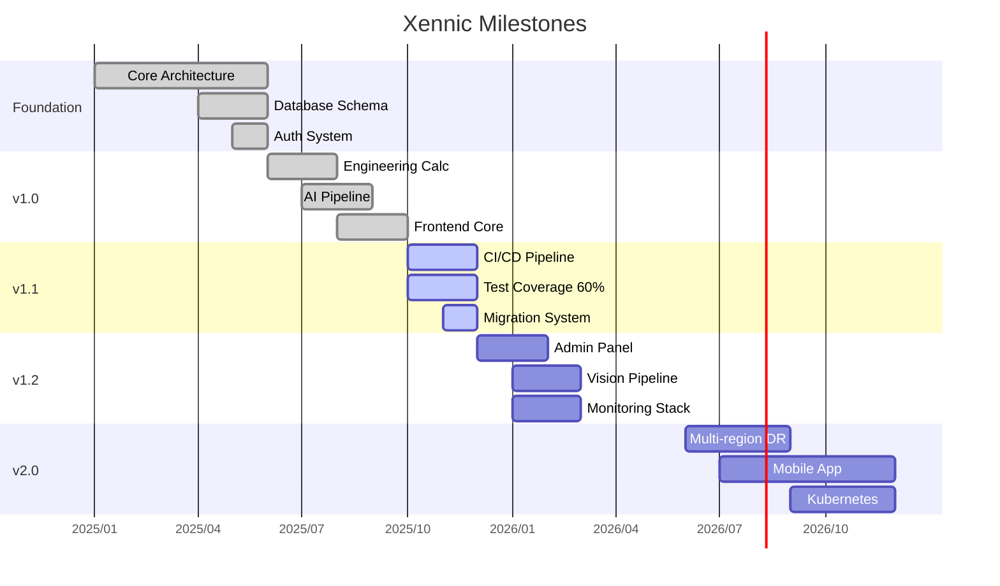

# نقاط عطف — Milestones

**نسخه**: ۱.۰.۰ | **وضعیت**: Active | **آخرین بروزرسانی**: خرداد ۱۴۰۵ | **بازبینی بعدی**: ماهانه

---

## Milestone Timeline

---

## Milestone Details

### M1: Foundation ✅ (۱۴۰۴)
- Monorepo setup
- Core architecture
- Database schema
- Auth system

### M2: v1.0 Release ✅ (۱۴۰۵-۰۳)
- Engineering calculations
- AI/OCR pipeline
- Frontend core
- API complete

### M3: Quality & Automation 🔄 (۱۴۰۵-۰۶, Target)
- CI/CD pipeline
- Test coverage > 60%
- prisma migrate
- Performance baseline

### M4: Feature Complete ⏳ (۱۴۰۵-۰۹)
- Admin Panel
- Vision Pipeline
- Document Analysis
- Monitoring stack

### M5: Enterprise Ready ⏳ (۱۴۰۶)
- Multi-region DR
- Kubernetes
- Mobile app
- Marketplace

---

## Related Documents

| سند | مسیر |
|-----|------|
| Release Board | `project/RELEASE_BOARD.md` |
| Implementation Progress | `project/IMPLEMENTATION_PROGRESS.md` |
| Project Status | `project/PROJECT_STATUS.md` |
| Master Roadmap | `project-management/XENNIC_MASTER_ROADMAP_v1.md` |

---

## Revision History

| نسخه | تاریخ | تغییرات |
|------|-------|---------|
| ۱.۰.۰ | خرداد ۱۴۰۵ | انتشار اولیه |
