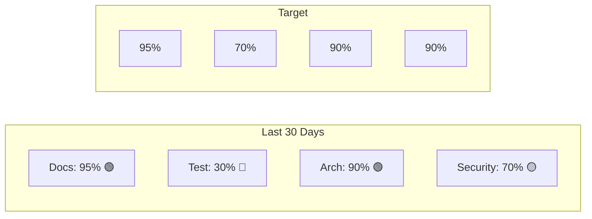

# داشبورد کیفیت — Quality Dashboard

**نسخه**: ۱.۰.۰ | **وضعیت**: Active | **آخرین بروزرسانی**: خرداد ۱۴۰۵ | **بازبینی بعدی**: هفتگی

---

## Metrics

| معیار | امتیاز | وضعیت | هدف |
|-------|--------|-------|------|
| **Documentation Coverage** | ۹۵٪ | 🟢 | > 90% |
| **API Coverage** | ۸۰٪ | 🟢 | > 80% |
| **Testing Coverage** | ۳۰٪ | 🔴 | > 70% |
| **Architecture Coverage** | ۹۰٪ | 🟢 | > 85% |
| **Production Readiness** | ۴۰٪ | 🟡 | > 80% |
| **Security Readiness** | ۷۰٪ | 🟡 | > 90% |
| **Performance Readiness** | ۵۰٪ | 🟡 | > 80% |
| **Technical Debt** | ۶۰٪ | 🟡 | < 20% |

---

## Issues

| نوع | تعداد | روند |
|-----|-------|------|
| **Open Bugs** | ۱۲ | 📈 Increasing |
| **Critical Bugs** | ۲ | ➡️ Stable |
| **High Priority Tasks** | ۵ | 📈 Increasing |
| **Medium Priority Tasks** | ۱۵ | ➡️ Stable |
| **Low Priority Tasks** | ۳۰ | 📉 Decreasing |

---

## Trends

---

## Related Documents

| سند | مسیر |
|-----|------|
| Project Status | `project/PROJECT_STATUS.md` |
| Risk Register | `project/RISK_REGISTER.md` |
| Technical Debt | `project/TECHNICAL_DEBT.md` |
| Known Limitations | `project/KNOWN_LIMITATIONS.md` |

---

## Revision History

| نسخه | تاریخ | تغییرات |
|------|-------|---------|
| ۱.۰.۰ | خرداد ۱۴۰۵ | انتشار اولیه |
