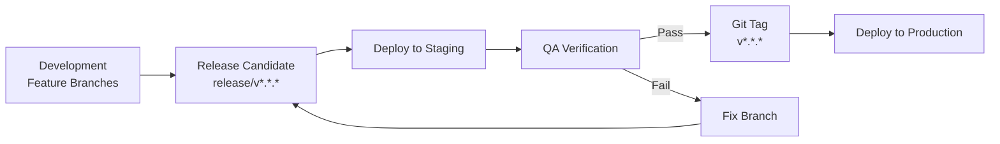

# فرآیند انتشار — Release Process

**نسخه**: ۱.۰.۰ | **وضعیت**: Approved | **آخرین بروزرسانی**: خرداد ۱۴۰۵

---

## Purpose

فرآیند انتشار نسخه جدید پلتفرم Xennic.

---

## Scope

Release lifecycle, versioning, checklist.

---

## Process



---

## Release Types

| نوع | فرکانس | مثال |
|-----|--------|------|
| Major | Yearly | 2.0.0 |
| Minor | Monthly | 1.1.0 |
| Patch | As needed | 1.0.1 |

## Release Checklist

### Pre-release
- [ ] تمام feature branches به develop merged
- [ ] Test coverage >= 70%
- [ ] All tests passing
- [ ] Lint + typecheck passing
- [ ] CHANGELOG.md updated
- [ ] Version bumped in package.json

### Release
- [ ] Release branch created
- [ ] Deployed to staging
- [ ] QA sign-off
- [ ] Git tag created
- [ ] Release notes published

### Post-release
- [ ] Monitor for 24 hours
- [ ] Hotfix ready if needed
- [ ] Retrospective

## Hotfix Process

```bash
git checkout -b hotfix/v1.0.1 main
# Fix the issue
git commit -m "fix: description"
git tag v1.0.1
git push origin main --tags
```

---

## Related Documents

| سند | مسیر |
|-----|------|
| Versioning | `project/VERSIONING.md` |
| CI/CD | `devops/CI_CD.md` |
| Changelog | `project/CHANGELOG.md` |
| Governance | `project-management/XENNIC_DEVELOPMENT_GOVERNANCE_v1.md` |

---

## Revision History

| نسخه | تاریخ | تغییرات |
|------|-------|---------|
| ۱.۰.۰ | خرداد ۱۴۰۵ | انتشار اولیه |
