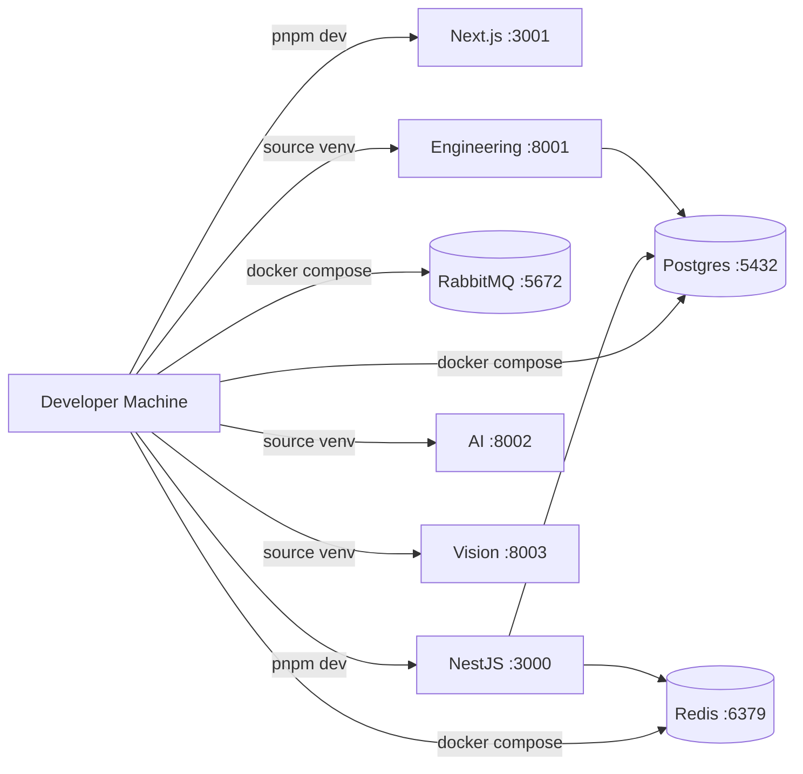
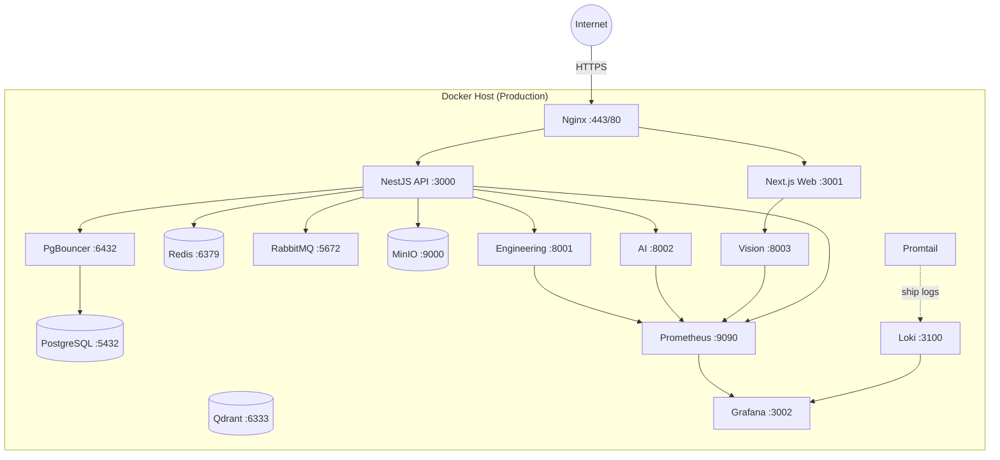
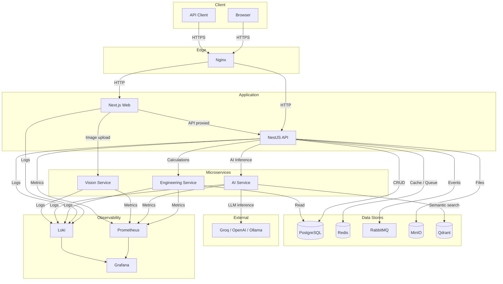

# 1. System Landscape

> **Version:** 1.0.0 | **Status:** Living Document | **Last Updated:** Tir 1405 (June 2026)

## 1.1 Context Diagram

```mermaid
C4Context
  title System Context — Xennic Engineering Intelligence Platform

  Person(engineer, "Engineer", "Electrical engineer performing analysis, calculations, and document review")
  Person(admin, "System Admin", "Platform administrator managing tenants, billing, and operations")
  Person(apiClient, "API Client", "Third-party application integrating via REST API")

  System_Ext(aiProvider, "External AI Services", "Groq, OpenAI, Ollama — LLM providers for AI Service")
  System_Ext(stdBody, "Standards Bodies", "IEC, IEEE, ANSI — published engineering standards")
  System_Ext(mfgr, "Manufacturers", "Electrical equipment manufacturers — motor, transformer specs")

  Boundary(platform, "Xennic Platform", "On-premise / Cloud deployment") {
    System(nginx, "Nginx", "Reverse proxy, TLS termination, rate limiting, WAF")

    System(nestApi, "NestJS API", "Central backend (Fastify, 24 modules, 180+ endpoints)")
    System(webApp, "Next.js Web", "User interface (40+ pages, bilingual FA/EN)")

    SystemDb(pg, "PostgreSQL 17", "Primary database (61 models, multi-tenant via workspace_id)")
    SystemDb(redis, "Redis 8", "Cache, session, BullMQ queues")
    SystemDb(mq, "RabbitMQ 4", "Event bus (configured, not yet wired in code)")
    SystemDb(minio, "MinIO", "S3-compatible object storage")
    SystemDb(qdrant, "Qdrant", "Vector database for semantic search")

    System(engSvc, "Engineering Service", "FastAPI, port 8001 — engineering calculations")
    System(aiSvc, "AI Service", "FastAPI, port 8002 — LLM, RAG, embeddings")
    System(visionSvc, "Vision Service", "FastAPI, port 8003 — OCR, document classification")

    SystemDb(prom, "Prometheus", "Metrics collection")
    SystemDb(grafana, "Grafana", "Dashboards and alerting")
    SystemDb(loki, "Loki + Promtail", "Log aggregation")

    System(pgb, "PgBouncer", "Connection pooling for PostgreSQL")
  }

  Boundary(kf, "Knowledge Factory (Planned)", "10 microservices for document ingestion pipeline") {
    System(intake, "Intake Service", "Document validation, staging")
    System(classify, "Classify Service", "Type/language detection")
    System(parse, "Parse Service", "OCR, PDF, HTML extraction")
    System(extract, "Extract Service", "Entity, concept, relationship extraction")
    System(resolve, "Resolve Service", "Canonical concept mapping")
    System(normalize, "Normalize Service", "Unit conversion, terminology")
    System(chunk, "Chunk Service", "Segmentation for embedding")
    System(embed, "Embed Service", "Vector embedding generation")
    System(enrich, "Enrich Service", "Metadata, cross-references")
    System(publish, "Publish Service", "Atomic write to stores")
  }

  Rel(engineer, nginx, "HTTPS", "Browser, 80/443")
  Rel(admin, nginx, "HTTPS", "Browser, 80/443")
  Rel(apiClient, nginx, "HTTPS", "REST API")

  Rel(aiProvider, aiSvc, "HTTP", "LLM inference API")
  Rel(stdBody, nestApi, "HTTP", "Standards reference data")
  Rel(mfgr, nestApi, "HTTP", "Equipment spec data")

  Rel(nginx, webApp, "HTTP", "Reverse proxy")
  Rel(nginx, nestApi, "HTTP", "Reverse proxy")
  Rel(webApp, nestApi, "HTTP", "Next.js rewrites")
  Rel(webApp, visionSvc, "CORS direct", "Image upload")

  Rel(nestApi, engSvc, "REST", "Calculation requests")
  Rel(nestApi, aiSvc, "REST", "AI inference requests")
  Rel(nestApi, pgb, "TCP 6432", "Database connections")
  Rel(nestApi, redis, "TCP 6379", "Cache and queues")
  Rel(nestApi, mq, "AMQP 5672", "Event publishing")
  Rel(nestApi, minio, "S3 API", "File storage")

  Rel(aiSvc, qdrant, "gRPC 6333", "Vector search")
  Rel(engSvc, pgb, "TCP 6432", "Read-only access")
```



---

## 1.2 External Actors

### Engineer

The primary end user. Performs electrical engineering analysis (motor, transformer, protection, cable calculations), uploads equipment nameplate photos for OCR-based data extraction, uploads utility bills for automated meter reading, searches engineering knowledge, and interacts with AI assistants. Accesses the platform through a web browser via Next.js frontend.

- **Authentication:** JWT (access + refresh tokens)
- **Authorization:** RBAC roles — `ENGINEER`, `VIEWER`
- **Interface:** Web UI (bilingual FA/EN)
- **Protocol:** HTTPS via Nginx reverse proxy

### System Admin

Manages multi-tenant workspaces, configures billing plans, reviews audit logs, monitors system health, manages feature flags, and administers users and roles. Uses a dedicated admin interface and direct API access.

- **Authentication:** JWT + API key
- **Authorization:** RBAC role — `ADMIN`, `WORKSPACE_OWNER`
- **Interface:** Web UI + REST API
- **Protocol:** HTTPS

### API Client

Third-party integrators (e.g., enterprise ERP systems, engineering firms) consuming the Xennic REST API programmatically. Authenticated via API keys with granular permissions scoped to specific workspaces.

- **Authentication:** API key (`X-API-Key` header)
- **Authorization:** Scoped per-key permissions
- **Interface:** REST API
- **Protocol:** HTTPS

### External AI Services

LLM providers that the AI Service delegates inference to. Supported providers:

| Provider | Role | Status |
|----------|------|--------|
| **Groq** | Primary low-latency inference (Llama 3) | Active |
| **OpenAI** | High-quality fallback (GPT-4, GPT-3.5) | Active |
| **Ollama** | Local self-hosted models | Active |
| **Claude** | Future provider | Planned |

- **Protocol:** HTTP REST
- **Authentication:** Provider-specific API keys

### Standards Bodies

External sources of published engineering standards (IEC, IEEE, NEMA, ANSI, VDE). The platform imports and references these standards for engineering calculations, validation rules, and knowledge enrichment. Data ingestion is currently manual or imported via seed scripts; future Knowledge Factory will automate this.

- **Data consumed:** Standards documents, tables, curves
- **Integration method:** Manual / seed import / file upload

### Manufacturers

Electrical equipment manufacturers whose published datasheets, nameplate formats, and technical specifications inform the OCR extraction patterns, validation rules, and engineering knowledge base. Data is loaded during seed or uploaded by engineers.

- **Data consumed:** Datasheets, nameplate templates
- **Integration method:** Manual / file upload

---

## 1.3 Internal Systems

| System | Description |
|--------|-------------|
| **Nginx** | Public-facing reverse proxy. Handles TLS termination (HTTP → HTTPS redirect), rate limiting (100 req/s global, 10 req/s auth endpoints), Web Application Firewall (WAF), and request routing to Next.js Web (port 3001) and NestJS API (port 3000). |
| **Next.js Web** | The primary user interface — a standalone-output Next.js application on port 3001. Renders 40+ pages across engineering calculators, AI chat, knowledge base, marketplace, workspace dashboard, and billing. Bilingual (Persian/English) via next-intl. API calls proxied through Next.js rewrites to NestJS; direct CORS uploads to Vision Service for large images. |
| **NestJS API** | The central backend on port 3000 using the Fastify adapter. 24 NestJS modules exposing 180+ endpoints under `/api/v1`. Responsibilities: authentication (JWT + RBAC), workspace management (multi-tenant), CRUD for all business entities, engineering calculation orchestration, AI session management, file management (MinIO), knowledge CRUD, subscription/billing, search, webhooks, notifications, and rate limiting. |
| **Engineering Service** | Python/FastAPI microservice on port 8001. Executes domain-specific electrical engineering calculations: motor analysis, transformer analysis, protection coordination, cable sizing, power quality (THD, TDD, harmonics), solar, earthing, lighting, and power system studies with IEEE-519 compliance. Implements a modular calculator architecture. |
| **AI Service** | Python/FastAPI microservice on port 8002. Orchestrates LLM inference across Groq, OpenAI, and Ollama. Implements Retrieval-Augmented Generation (RAG) via Qdrant vector search, manages AI agents (electrical engineer, solar consultant, protection engineer, etc.), generates embeddings, and powers the AI chat UI. |
| **Vision Service** | Python/FastAPI microservice on port 8003. Runs OCR pipelines (Cascade fallback: EasyOCR → Tesseract → LLM) with image preprocessing (deskew, denoise, CLAHE enhancement). Detects document type (nameplate vs. utility bill) and extracts structured technical data via regex and knowledge-driven extraction. |
| **PostgreSQL 17** | Primary relational database with 61 Prisma models. Multi-tenant via `workspace_id` on every table. UUIDv7 primary keys, soft-delete support, audit columns, and full-text search indexes. |
| **PgBouncer** | Lightweight connection pooler sitting between NestJS API and PostgreSQL on port 6432. Maintains a pool of persistent connections to reduce PostgreSQL connection overhead. |
| **Redis 8** | In-memory data store used for session cache, rate limiting counters, BullMQ queue backends, and general application caching. |
| **RabbitMQ 4** | AMQP message broker. Configured with exchanges (`xennic.topic`) and queues but **not yet wired to application code**. The Knowledge Factory services will be the primary consumers. |
| **MinIO** | S3-compatible object storage. Stores uploaded documents, images, engineering reports, and generated PDFs. Access controlled via presigned URLs generated by the NestJS API. |
| **Qdrant** | Vector database on port 6333. Stores dense embeddings for semantic search and RAG. Owned by the AI Service; the Knowledge Factory will also write to it. Runs as a standalone Docker Compose stack. |
| **Prometheus** | Metrics collection server. Scrapes `/metrics` endpoints from NestJS API, Engineering Service, AI Service, and Vision Service. |
| **Grafana** | Dashboard and alerting frontend on port 3002. Visualizes Prometheus metrics, Loki logs, and provides alert management. |
| **Loki + Promtail** | Log aggregation stack. Promtail ships container logs to Loki; Grafana queries Loki for log exploration and alerting. |
| **API Gateway** | Reserved placeholder in `services/api-gateway/`. Intended to become the single ingress (Kong or custom) routing all requests, enforcing auth, rate limiting, and request transformation. Currently unimplemented — Nginx and Next.js rewrites fill this role. |

### Planned: Knowledge Factory (10 microservices)

An event-driven document ingestion and knowledge extraction pipeline communicating via RabbitMQ with CloudEvents-compliant messages. Each service is a single-responsibility FastAPI microservice:

| # | Service | Function |
|---|---------|----------|
| 1 | **Intake Service** | Receive documents, validate format, generate checksum, enqueue for processing |
| 2 | **Classify Service** | Detect document type, language, domain; assign taxonomy labels |
| 3 | **Parse Service** | Convert document to machine-readable text (OCR, PDF parse, HTML extract) |
| 4 | **Extract Service** | Identify entities, concepts, relationships, formulas, standards references |
| 5 | **Resolve Service** | Map extracted terms to canonical concepts and synonyms |
| 6 | **Normalize Service** | Convert units to SI, standardize terminology, normalize numerical formats |
| 7 | **Chunk Service** | Split knowledge into optimal segments for embedding and retrieval |
| 8 | **Embed Service** | Generate dense vector embeddings for each chunk |
| 9 | **Enrich Service** | Add metadata, cross-references, provenance, quality tags |
| 10 | **Publish Service** | Write to Qdrant, knowledge graph, and PostgreSQL atomically |

---

## 1.4 Trust Boundaries

```mermaid
graph TB
  subgraph "Public DMZ — Internet facing"
    N[Nginx<br/>Reverse Proxy<br/>TLS (443) / HTTP (80)]
  end

  subgraph "Internal Network — Private"
    direction TB
    subgraph "Application Layer"
      WEB[Next.js Web<br/>Port 3001]
      API[NestJS API<br/>Port 3000]
    end
    subgraph "Service Layer"
      ES[Engineering Service<br/>Port 8001]
      AIS[AI Service<br/>Port 8002]
      VS[Vision Service<br/>Port 8003]
    end
  end

  subgraph "Private Data — Restricted"
    PGB[PgBouncer<br/>Port 6432]
    PG[(PostgreSQL 17<br/>Port 5432)]
    RD[(Redis 8<br/>Port 6379)]
    MQ[RabbitMQ<br/>Port 5672]
    MI[(MinIO<br/>Port 9000)]
    QD[(Qdrant<br/>Port 6333)]
  end

  subgraph "External Third-Party — Untrusted"
    LLM[Groq / OpenAI / Ollama]
    CDN[CDN / DNS]
  end

  USER((User)) -->|HTTPS:443| N
  N -->|HTTP:3001| WEB
  N -->|HTTP:3000| API

  WEB -->|rewrites| API
  WEB -->|CORS direct| VS

  API -->|TCP:6432| PGB --> PG
  API -->|TCP:6379| RD
  API -->|AMQP:5672| MQ
  API -->|S3 API:9000| MI
  API -->|REST| ES
  API -->|REST| AIS

  AIS -->|gRPC:6333| QD
  AIS -->|HTTPS| LLM

  style N fill:#f96,stroke:#333,color:#000
  style WEB fill:#9cf,stroke:#333,color:#000
  style API fill:#9cf,stroke:#333,color:#000
  style ES fill:#69c,stroke:#333,color:#fff
  style AIS fill:#69c,stroke:#333,color:#fff
  style VS fill:#69c,stroke:#333,color:#fff
  style PG fill:#c93,stroke:#333,color:#000
  style PGB fill:#c93,stroke:#333,color:#000
  style RD fill:#c93,stroke:#333,color:#000
  style MQ fill:#c93,stroke:#333,color:#000
  style MI fill:#c93,stroke:#333,color:#000
  style QD fill:#c93,stroke:#333,color:#000
  style LLM fill:#f99,stroke:#333,color:#000
  style CDN fill:#f99,stroke:#333,color:#000
```

| Zone | Services | Access Rules |
|------|----------|-------------|
| **Public DMZ** | Nginx | Exposes ports 80 (redirect) and 443 (TLS). Rate limited (100 req/s global, 10 req/s auth). WAF enabled. Only Nginx is reachable from the internet. |
| **Internal Network** | Next.js, NestJS API, Engineering Service, AI Service, Vision Service | Reachable only from Nginx or from other internal services via Docker bridge network. No direct external access. CORS restricted to permitted origins. |
| **Private Data** | PostgreSQL, PgBouncer, Redis, RabbitMQ, MinIO, Qdrant | No direct external access. Only specific internal services may connect: NestJS API connects to PgBouncer/Redis/RabbitMQ/MinIO; AI Service connects to Qdrant. mTLS planned. |
| **External Third-Party** | Groq, OpenAI, Ollama, CDN, DNS | Untrusted by default. AI Service initiates outbound TLS connections. No inbound exposure. API keys stored as environment variables, never hardcoded. |

### Security Principles

1. **Defense in Depth** — Multiple security layers: WAF → Rate Limiting → Auth → RBAC → Input Validation → Audit
2. **Least Privilege** — Each service connects only to required dependencies
3. **No Direct Database Exposure** — Nginx never routes to PostgreSQL; only the NestJS API and Engineering Service (read-only) reach the database
4. **Encryption in Transit** — TLS 1.2/1.3 externally, HTTP internally within Docker network
5. **CORS Restricted** — Only whitelisted origins (Next.js domain, permitted API clients)

---

## 1.5 Deployment Zones

| Zone | Environment | Purpose | Configuration |
|------|-------------|---------|---------------|
| **Development** | `development` | Local development on developer machines and shared dev server | Docker Compose (base stack), Node.js apps run via `pnpm dev` (hot-reload), `.env.development`, debug logging, Swagger enabled |
| **Staging** | `staging` | Pre-production validation, integration testing, QA | Full Docker Compose or single-server stack, `.env.staging`, production-like data (anonymized), monitoring active, alerts to Slack |
| **Production** | `production` | Customer-facing SaaS | Docker Compose (future: Kubernetes), `.env.production`, multi-tenant, full monitoring + alerting + backup, TLS mandatory, rate limiting active, no debug endpoints |

### Current Phase

The platform is deployed via **Docker Compose** on a single host (Phase 1 of the infrastructure evolution). Future phases will introduce load-balanced multi-server (Phase 2) and Kubernetes orchestration with auto-scaling (Phase 3).

### Development Environment



### Production Environment



---

## 1.6 High-Level Data Flow

### Narrative

1. **User Request Flow —** An engineer opens the Xennic Web UI in their browser. HTTPS request hits Nginx, which terminates TLS and routes to either the Next.js Web (static assets, SSR pages) or the NestJS API (JSON API calls via rewrites). The NestJS API validates the JWT, enforces RBAC, and resolves the workspace.

2. **Engineering Calculation Flow —** The engineer enters motor parameters in a calculation form. The Web UI sends a POST to `/api/v1/engineering/analysis/motor` via Next.js rewrites to the NestJS API. NestJS proxies the request as REST to the Engineering Service (port 8001), which executes the calculation and returns typed results. NestJS persists results to PostgreSQL, then returns a unified JSON response to the UI.

3. **OCR / Vision Flow —** The engineer uploads a nameplate photo. The Web UI sends a multipart POST directly to Vision Service (port 8003) via CORS. Vision Service runs the Cascade OCR pipeline (Preprocessing → EasyOCR/Tesseract/LLM → Document Classification → Data Extraction → Validation). Extracted structured data is returned as JSON. For subsequent engineering analysis, the Web UI forwards extracted data to the NestJS API → Engineering Service.

4. **AI Chat Flow —** The engineer asks a technical question via the AI Chat UI. The Web UI sends the message to NestJS API, which proxies to the AI Service (port 8002). AI Service queries Qdrant for semantically relevant engineering documents (RAG), constructs a prompt with retrieved context, and calls the configured LLM provider (Groq/OpenAI/Ollama). The LLM response is streamed back (SSE) through the API to the UI.

5. **Document Storage Flow —** Any uploaded file is simultaneously stored in MinIO. The NestJS API generates a presigned URL for direct browser upload/download, records file metadata in PostgreSQL, and publishes a `doc.uploaded` event to RabbitMQ. Future Knowledge Factory services will consume these events to trigger ingestion pipelines.

6. **Monitoring Flow —** All application services expose `/metrics` endpoints scraped by Prometheus. Promtail ships container stdout/stderr to Loki. Grafana queries both for dashboards and alerting.

### High-Level Data Flow Diagram


