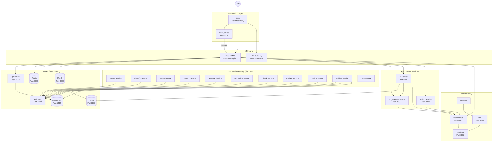
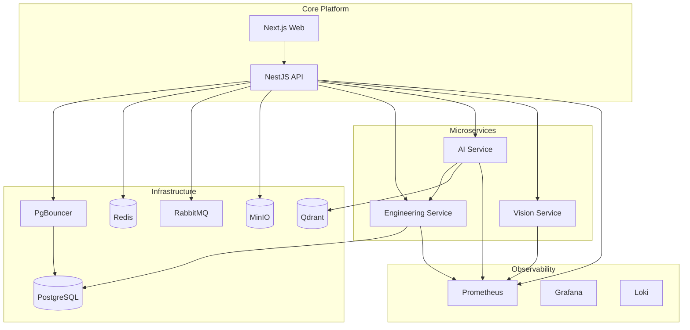

# 2. Service Catalog

> **Version:** 1.0.0 | **Status:** Living Document | **Last Updated:** Tir 1405 (June 2026)

## Service Relationship Diagram



---

## 2.1 NestJS API (`apps/api`)

- **Port:** 3000
- **Framework:** NestJS 11.x + Fastify adapter
- **Language:** TypeScript 6.x
- **Prefix:** `/api/v1`
- **24 modules**, 180+ endpoints
- **OpenAPI:** Swagger UI at `/api/docs`

### Purpose

Central backend API for the Xennic platform. Implements Domain-Driven Design with Clean Architecture. Serves as the synchronous gateway for all user-facing operations.

### Responsibilities

- User authentication and authorization (JWT, RBAC)
- Multi-tenant workspace management
- Engineering calculation orchestration (proxies to Engineering Service)
- AI chat session management (proxies to AI Service)
- Document and file management (MinIO integration)
- Knowledge management CRUD
- Subscription and billing management
- Search across platform entities
- Webhook dispatch
- Email sending
- Feature flag management
- Standards and marketplace management
- Vision document upload orchestration
- Rate limiting (NestJS Throttler: short 10/10s, medium 100/60s, long 1000/3600s)

### Owner

Platform Backend Team

### Inputs

- HTTP requests from Nginx (browsers, mobile apps, API clients)
- Events from RabbitMQ (async notifications)

### Outputs

- JSON responses (unified `{success, data, meta}` / `{success, error}`)
- Events published to RabbitMQ
- Files stored to MinIO
- Database writes via Prisma

### APIs

| Endpoint Group | Description |
|---|---|
| `GET /health` | Health check |
| `POST /api/v1/auth/*` | Register, login, refresh, logout, password reset |
| `GET/PUT/PATCH /api/v1/users/*` | User profile management |
| `GET/POST /api/v1/workspaces/*` | Workspace lifecycle |
| `GET/POST /api/v1/projects/*` | Project CRUD, member management |
| `GET/POST /api/v1/engineering/*` | Engineering calculation proxy |
| `GET/POST /api/v1/knowledge/*` | Knowledge EKO CRUD, search, pipeline status |
| `GET/POST /api/v1/ai/*` | AI chat, agent listing, streaming |
| `POST /api/v1/vision/upload` | Document upload for vision processing |
| `GET/POST /api/v1/storage/*` | File upload/download from MinIO |
| `GET /api/v1/search/*` | Global search across entities |
| `GET/POST /api/v1/subscriptions/*` | Plan management |
| `GET/POST /api/v1/billing/*` | Invoices, payments |
| `GET/POST /api/v1/admin/*` | Platform administration |
| `GET/POST /api/v1/marketplace/*` | Marketplace items |
| `GET/POST /api/v1/standards/*` | Standards library |
| `GET/POST /api/v1/notifications/*` | User notifications |
| `GET/POST /api/v1/webhooks/*` | Webhook configuration |
| `GET/POST /api/v1/api-keys/*` | API key management |
| `GET/POST /api/v1/feature-flags/*` | Feature flag evaluation |
| `GET/POST /api/v1/consultations/*` | Engineering consultation requests |
| `GET/POST /api/v1/rbac/*` | Role/permission management |
| `GET /api/v1/metrics` | Prometheus metrics endpoint |

### Events Published

| Event | Routing Key | Description |
|---|---|---|
| `doc.uploaded` | `api.doc.uploaded.v1` | Document uploaded and staged for processing |

### Events Consumed

| Event | Routing Key | Source |
|---|---|---|
| `eko.published` | `factory.publish.published.v1` | Publish Service |
| `eko.failed` | `factory.*.failed.v1` | Any factory service |
| `quality.escalated` | `factory.quality.escalated.v1` | Quality Gate |

### Dependencies

- PostgreSQL (via PgBouncer)
- Redis (caching, session store)
- RabbitMQ (async event bus)
- MinIO (file storage)
- Engineering Service (HTTP)
- AI Service (HTTP)
- Vision Service (HTTP)

### Scalability

- Stateless horizontal scaling behind Nginx
- Database connections pooled via PgBouncer
- Rate limiting per IP and per route
- Caching via Redis for frequent queries

### Failure Modes

- Database connection exhaustion (mitigated by PgBouncer)
- Upstream microservice unavailability (circuit breaker needed)
- JWT key rotation failure (manual recovery)

### Recovery Strategy

- Health check endpoint (`/health`) for load balancer
- Docker restart policy: `unless-stopped`
- Graceful shutdown via NestJS lifecycle hooks

### Current Status

**Operational** — v0.1.0, active development

### Future Roadmap

- API Gateway integration (BFF pattern)
- GraphQL endpoint for complex queries
- WebSocket for real-time collaboration
- Enhanced circuit breaker and bulkhead patterns

---

## 2.2 Next.js Web (`apps/web`)

- **Port:** 3001
- **Framework:** Next.js 15.3 (App Router)
- **Language:** TypeScript
- **Output:** `standalone`
- **40+ pages**, bilingual (Persian/English via next-intl)

### Purpose

Client-side rendered web application providing the Xennic user interface. Serves as the primary user interaction point for the platform.

### Responsibilities

- Server-side rendering for SEO and initial load performance
- Internationalized routing and content (FA/EN via next-intl)
- API proxy via Next.js rewrites to NestJS API and microservices
- PDF generation (react-pdf, jsPDF)
- Rich text editing (TipTap editor with engineering extensions)
- Engineering calculation UI forms
- AI chat interface with streaming
- Knowledge explorer and search
- Dashboard and analytics visualizations (Recharts)
- Theme support (next-themes)

### Owner

Frontend Team

### Inputs

- HTTP requests from Nginx
- Browser API requests (proxied to backend)

### Outputs

- Server-rendered HTML pages
- Client-side rendered React components
- API proxy requests to backend services

### APIs

The web app does not expose its own API. It proxies all API calls to NestJS via Next.js rewrites:

| Rewrite Source | Destination |
|---|---|
| `/api/v1/vision/:path*` | Vision Service (port 8003) directly |
| `/api/v1/engineering/energy/:path*` | NestJS API (port 3000) |
| `/api/:path*` | NestJS API (port 3000) |

### Events Published

None (client-side consumer only)

### Events Consumed

None (no direct event bus subscription)

### Dependencies

- NestJS API (primary backend)
- Vision Service (direct proxy for uploads)

### Scalability

- Static assets cached by Nginx with 365d TTL
- Standalone output allows containerized deployment
- Next.js ISR for semi-static pages

### Failure Modes

- API backend unreachable (5xx in client)
- Missing API proxy configuration
- i18n message file loading failure

### Recovery Strategy

- Nginx fallback to stale cache
- Docker restart policy: `unless-stopped`
- Client-side error boundaries

### Current Status

**Operational** — v0.1.0, active development (no tests yet per package.json)

### Future Roadmap

- Full test suite (Jest + Cypress)
- PWA support
- Mobile-responsive redesign
- Offline mode with service workers
- Real-time collaboration features

---

## 2.3 Engineering Service (`workspace/services/engineering-service`)

- **Port:** 8001
- **Framework:** FastAPI 0.115
- **Language:** Python 3.12
- **Version:** 0.4.0

### Purpose

Deterministic electrical engineering calculation engine. Provides standards-compliant calculations for power systems, cable sizing, transformer design, protection coordination, power quality analysis, renewable energy systems, and economic analysis.

### Responsibilities

- Execute 30+ engineering calculators registered in `CalculationRegistry`
- Serve calculation APIs to NestJS API and AI Service
- Validate engineering inputs against domain rules
- Return structured results with formula provenance
- OCR support for document text extraction (pdf2image + pytesseract)

### Owner

Engineering Team

### Inputs

- HTTP JSON requests from NestJS API and AI Service
- Engineering parameters (voltages, currents, impedances, etc.)

### Outputs

- Structured calculation results
- OpenAPI 3.x specification

### APIs

All endpoints prefixed with `/api/v1/engineering/`:

| Endpoint Group | Calculators | Standards |
|---|---|---|
| `/basic/*` | Ohm's Law, Active/Reactive/Apparent Power, Power Factor | — |
| `/cable/*` | Ampacity, Voltage Drop, Short-Circuit Withstand, PE Sizing, Tray Sizing | IEC 60364 |
| `/transformer/*` | Sizing, Losses, Regulation, K-Factor, Efficiency | IEC 60076 |
| `/protection/*` | MCCB Selection, Fuse Selection, Arc Flash, Selectivity, Short-Circuit | IEC 60947, IEEE 1584 |
| `/power-quality/*` | THD, TDD, K-Factor, Resonance, Passive/Active Filters, PFC, Capacitor Bank | IEEE 519 |
| `/power-system/*` | Load Flow, Short-Circuit, Motor Starting, Busbar Sizing | IEC 60909 |
| `/lighting/*` | Lumen Method, Road Lighting | — |
| `/grounding/*` | Grounding Grid | IEEE 80 |
| `/renewable/*` | Solar PV, Battery Storage, Inverter Sizing, Motor Starting | — |
| `/economics/*` | ROI, NPV, IRR | — |
| `/switchgear/*` | Main Switch Selection | — |
| `/energy/*` | Energy Analyzer | — |

Additional endpoints:
- `GET /health` — Health check
- `GET /docs`, `GET /redoc` — API documentation

### Events Published

None (synchronous request/response service)

### Events Consumed

None (planned: consume calculation requests via RabbitMQ)

### Dependencies

- PostgreSQL (for persistent calculation records, optional)

### Scalability

- Stateless: each request is independent
- Horizontal scaling behind load balancer
- Heavy calculations (load flow, short-circuit) may need dedicated instances

### Failure Modes

- Invalid input parameters (returns 400 with field-level error)
- Numerical instability in edge cases (IEEE 754 issues)
- Memory exhaustion on large power system models

### Recovery Strategy

- Input validation at FastAPI level (Pydantic schemas)
- Exception handlers for `EngineeringValidationError`, `ValueError`
- Docker health check: `/health` endpoint
- Docker restart policy: `unless-stopped`

### Current Status

**Operational** — v0.4.0, 30+ calculators, active development

### Future Roadmap

- Integration with RabbitMQ for async calculation requests
- More calculators (IEC 60228, IEC 60364-5-52 expansion)
- pandapower-based load flow visualization
- Calculation result storage and history

---

## 2.4 AI Service (`workspace/services/ai-service`)

- **Port:** 8002
- **Framework:** FastAPI 0.115
- **Language:** Python 3.12
- **Version:** 0.2.0

### Purpose

AI gateway providing LLM-powered engineering assistance. Orchestrates multiple AI agents, manages vector store interactions, and serves as the intelligence layer for the platform.

### Responsibilities

- Host and orchestrate AI agents (Electrical Engineer, Document Analyst)
- Multi-LLM provider abstraction (OpenAI, Anthropic, Google, Groq)
- Streaming chat responses via SSE
- RAG (Retrieval-Augmented Generation) with Qdrant vector store
- Document analysis and engineering question answering
- Context management for multi-turn conversations

### Owner

AI/ML Team

### Inputs

- HTTP requests from NestJS API
- Engineering context from Engineering Service (HTTP)
- Vector search queries to Qdrant

### Outputs

- LLM-generated responses (JSON or SSE stream)
- Vector embeddings stored to Qdrant
- Agent status and metadata

### APIs

| Endpoint | Description |
|---|---|
| `GET /health` | Health check |
| `GET /api/v1/ai/agents` | List registered agents with capabilities |
| `POST /api/v1/ai/chat` | Synchronous chat with an agent |
| `POST /api/v1/ai/chat/stream` | SSE-streaming chat with an agent |
| `POST /api/v1/ai/rag/search` | Hybrid search across vector store |
| `POST /api/v1/ai/rag/query` | RAG-enhanced query answering |
| `POST /api/v1/ai/documents/process` | Document analysis pipeline |
| `POST /api/v1/ai/agents/:id/configure` | Configure agent parameters |

### Events Published

None (synchronous request/response service)

### Events Consumed

None (planned: consume extraction/enrichment tasks via RabbitMQ)

### Dependencies

- Engineering Service (HTTP) — for calculation context
- Qdrant (HTTP/gRPC) — vector store for RAG
- Redis (planned) — semantic caching
- External LLM providers (OpenAI, Anthropic, Google, Groq)

### Scalability

- Stateless: agents are instantiated per request
- LLM calls are I/O-bound; async Python handles concurrency well
- File-based vector store fallback when Qdrant unavailable

### Failure Modes

- LLM provider rate limiting or downtime
- LLM timeout (>30s)
- Low confidence extraction results
- Qdrant connection failure (falls back to file-based store)

### Recovery Strategy

- Multiple LLM providers for failover
- Graceful degradation: rule-based fallback when LLM unavailable
- Caching to reduce redundant LLM calls
- Health check for load balancer awareness

### Current Status

**Operational** — v0.2.0, 2 agents registered, active development

### Future Roadmap

- Knowledge Factory integration (serve extraction/classification/enrichment)
- Custom fine-tuned models for engineering domain
- Multi-modal support (diagram analysis)
- Human-in-the-loop feedback for answers

---

## 2.5 Vision Service (`workspace/services/vision-service`)

- **Port:** 8003
- **Framework:** FastAPI
- **Language:** Python 3.12

### Purpose

Document and image processing service for engineering drawings, schematics, and technical documents. Performs OCR, image analysis, and structured data extraction.

### Responsibilities

- PDF text extraction (PyMuPDF)
- OCR for scanned documents (tesseract, hybrid mode)
- Image processing (OpenCV, scikit-image)
- Engineering drawing analysis (planned)
- Document classification and layout analysis (planned)

### Owner

AI/ML Team

### Inputs

- HTTP multipart file uploads from NestJS API and Next.js Web
- Image files (PNG, JPEG, TIFF)
- PDF documents

### Outputs

- Extracted text content
- OCR confidence scores
- Processed document metadata
- Structured document representation

### APIs

| Endpoint | Description |
|---|---|
| `GET /health` | Health check |
| `POST /api/v1/vision/upload` | Upload document for processing |
| `POST /api/v1/vision/process` | Process uploaded document (OCR + extraction) |
| `GET /api/v1/vision/status/:id` | Check processing status |
| `GET /api/v1/vision/result/:id` | Retrieve processing results |

### Events Published

None (synchronous request/response service)

### Events Consumed

None (planned: consume parse tasks via RabbitMQ)

### Dependencies

- LLM providers (Groq, OpenAI) — for hybrid OCR enhancement
- Tesseract OCR (system dependency)

### Scalability

- Memory-bound (2 GB limit per container)
- GPU recommended for production-scale OCR
- Async task processing for long-running documents

### Failure Modes

- OOM on large PDFs (mitigated by memory limit)
- Tesseract not installed or misconfigured
- LLM provider unavailable (falls back to pure OCR)

### Recovery Strategy

- Memory limits (2 GB) prevent host exhaustion
- Hybrid OCR mode: falls back from LLM-enhanced to tesseract-only
- Health check for container orchestration

### Current Status

**Operational** — v0.1.0, active development

### Future Roadmap

- Knowledge Factory integration (Parse Service)
- Engineering drawing symbol recognition
- Handwriting recognition for field notes
- GPU-accelerated processing pipeline
- PaddleOCR integration for Persian text

---

## 2.6 API Gateway (`services/api-gateway`)

- **Port:** N/A
- **Status:** PLACEHOLDER — empty directory

### Purpose

Future API gateway / BFF (Backend for Frontend) layer. Intended to sit between Nginx and backend services.

### Current Status

**Placeholder** — no implementation

### Future Roadmap

- BFF pattern with GraphQL aggregation
- Rate limiting per client/plan tier
- Request/response transformation
- API versioning management
- Circuit breaking and bulkheading

---

## 2.7 PostgreSQL

- **Image:** postgres:17-alpine
- **Port:** 5432
- **ORM:** Prisma 6.x

### Purpose

Primary relational database for all platform data. Multi-tenant with workspace_id isolation on all business entities.

### Responsibilities

- Store all business entities (users, workspaces, projects, calculations, etc.)
- Enforce data integrity via foreign keys and constraints
- Support Prisma migrations and schema management
- Full-text search via PostgreSQL built-in features

### Owner

Platform Backend Team

### Inputs

- SQL queries from NestJS API (via Prisma)
- Direct connections from Engineering Service (production only)

### Outputs

- Query result sets
- WAL stream for replication

### Dependencies

- PgBouncer (connection pooling)

### Scalability

- Vertical scaling (more CPU/RAM)
- Read replicas for analytics queries
- Connection pooling via PgBouncer (25 default pool, 200 max clients)

### Failure Modes

- Connection exhaustion (mitigated by PgBouncer)
- Disk full (monitored, alert threshold)
- Replication lag (read replicas)

### Recovery Strategy

- Persistent volumes for data durability
- Regular backups (see `infrastructure/backup/`)
- Health check via `pg_isready`
- PostgreSQL WAL archiving for PITR

### Current Status

**Operational** — PostgreSQL 17, Prisma-managed schema with migrations

### Future Roadmap

- Read replica deployment for analytics
- TimescaleDB extension for time-series data
- Connection pooling tuning per tenant tier

---

## 2.8 Redis

- **Image:** redis:8-alpine
- **Port:** 6379 (mapped to 6380 externally)
- **Persistence:** AOF enabled

### Purpose

In-memory cache and session store for the platform.

### Responsibilities

- JWT token blacklist and refresh token storage
- Session caching
- AI service response cache (planned)
- Rate limiter state store
- Temporary data storage (queues, pub/sub)

### Owner

Platform Backend Team

### Inputs

- SET/GET/DELETE operations from NestJS API
- Future: AI Service semantic cache

### Outputs

- Cached data retrieval

### Dependencies

None

### Scalability

- Vertical scaling (memory-bound)
- Redis Cluster for horizontal scaling (future)

### Failure Modes

- Memory exhaustion (eviction policy: volatile-lru)
- Persistence write delay
- Network partition

### Recovery Strategy

- AOF persistence for data durability
- Redis Sentinel for high availability (planned)
- Health check via `redis-cli ping`

### Current Status

**Operational** — Redis 8, AOF enabled, password-protected

### Future Roadmap

- Redis Cluster for horizontal scaling
- Redis Stack for search and JSON capabilities
- Sentinel-based HA deployment

---

## 2.9 RabbitMQ

- **Image:** rabbitmq:4-management
- **Port:** 5672 (AMQP), 15672 (Management UI)

### Purpose

Async event bus for the platform. Central nervous system for event-driven communication between services.

### Responsibilities

- Reliable message delivery with publisher confirms
- Topic exchange routing (`xennic.*`)
- Dead-letter queue for failed messages
- Multi-queue competing consumers pattern
- Future: Knowledge Factory pipeline orchestration

### Owner

Platform Backend Team

### Inputs

- Messages from NestJS API
- Future: Messages from all Knowledge Factory services

### Outputs

- Routed messages to subscribed queues

### Exchange Topology

| Exchange | Type | Purpose |
|---|---|---|
| `xennic.factory` | topic | Knowledge Factory pipeline events |
| `xennic.factory.dlq` | topic | Dead-letter queue for failed factory events |
| `xennic.api` | topic | API-generated events (future) |

### Dependencies

None

### Scalability

- Clustering for HA (planned)
- Queue TTL and max length policies
- Competing consumers allow worker scaling

### Failure Modes

- Broker failure (requires cluster for HA)
- Message accumulation (consumer lag)
- DLQ overflow

### Recovery Strategy

- Persistent queues and messages
- Docker volume for data durability
- Health check via `rabbitmq-diagnostics ping`
- Management UI for monitoring

### Current Status

**Operational** — RabbitMQ 4, management plugin enabled

### Future Roadmap

- Cluster deployment for HA
- Shovel/Federation for cross-region replication
- Stream plugin for large message replay
- Integration with Knowledge Factory pipeline

---

## 2.10 MinIO

- **Image:** minio/minio:latest
- **Port:** 9000 (API), 9001 (Console)

### Purpose

S3-compatible object storage for all platform file assets.

### Responsibilities

- Store uploaded engineering documents (PDFs, images, CAD files)
- Store user avatar images
- Store calculation export files
- Store processed document artifacts
- Serve as document store for Knowledge Factory

### Owner

Platform Backend Team

### Inputs

- PUT/GET/DELETE operations from NestJS API (via `minio` npm package)

### Outputs

- Served file objects

### Buckets

| Bucket | Purpose |
|---|---|
| `xennic` | General platform file storage |

### Dependencies

None

### Scalability

- Horizontal scaling with erasure coding
- Gateway mode for cloud storage backends

### Failure Modes

- Disk full
- Network partition
- Credential rotation failure

### Recovery Strategy

- Persistent volume for data durability
- Health check via `mc ready local`
- Docker restart policy: `unless-stopped`

### Current Status

**Operational** — MinIO latest, single-node deployment

### Future Roadmap

- Multi-node distributed deployment
- Lifecycle policies for tiered storage
- Bucket replication for DR
- Presigned URL integration for direct browser upload

---

## 2.11 Qdrant

- **Image:** qdrant/qdrant:v1.13.0
- **Port:** 6333 (HTTP), 6334 (gRPC)

### Purpose

Vector database for semantic search, RAG, and Knowledge Factory embedding storage.

### Responsibilities

- Store document chunk embeddings (1024-dim, multilingual-e5-large)
- Hybrid search (dense + sparse) via RRF fusion
- Payload filtering for multi-tenant isolation (workspace_id)
- Collection per workspace per language (`xennic_{workspace_id}_{language}`)

### Owner

AI/ML Team

### Inputs

- Upsert operations from AI Service and future Knowledge Factory
- Search queries from AI Service

### Outputs

- Ranked vector search results with payload metadata

### Dependencies

None

### Scalability

- Horizontal scaling via Qdrant cluster
- Collection sharding per tenant
- Memory-mapped storage for large datasets

### Failure Modes

- Disk space exhaustion
- Memory pressure on large collections
- Index rebuild failure

### Recovery Strategy

- Persistent volume for data durability
- Health check via HTTP readiness endpoint
- Collection snapshot for backup

### Current Status

**Operational** — Qdrant v1.13.0, single-node deployment

### Future Roadmap

- Distributed cluster deployment
- Quantization for reduced memory footprint
- Multi-vector indexing (late interaction)
- Knowledge Factory integration as primary write path

---

## 2.12 Nginx

- **Image:** nginx:1.27-alpine
- **Port:** 80 (HTTP), 443 (HTTPS)

### Purpose

Reverse proxy and SSL termination for all platform services.

### Responsibilities

- TLS termination (SSL certificates)
- Route `/api/*` to NestJS API (port 3000)
- Route `/` to Next.js Web (port 3001)
- Rate limiting per endpoint group (100/s general, 10/s auth)
- Static asset caching (365d for `/_next/static`)
- WebSocket upgrade for real-time features
- Request logging in JSON format (Loki-compatible)
- Security headers (X-Frame-Options, HSTS, etc.)

### Owner

Platform Infrastructure Team

### Inputs

- HTTP/HTTPS requests from users and clients

### Outputs

- Proxied requests to upstream services

### Upstreams

| Upstream | Target | Routes |
|---|---|---|
| `api_backend` | `api:3000` | `/api/`, `/api/docs`, `/ws/` |
| `web_backend` | `web:3001` | `/` (default), `/_next/static` |

### Dependencies

- NestJS API (must be healthy)
- Next.js Web (must be healthy)

### Scalability

- `worker_processes auto` — uses all CPU cores
- `worker_connections 2048` — high concurrency
- `multi_accept on` — accept multiple connections

### Failure Modes

- SSL certificate expiration (monitored)
- Upstream service unhealthy (502 Bad Gateway)
- Rate limit exhaustion (429 Too Many Requests)

### Recovery Strategy

- `proxy_next_upstream` — retry on 5xx errors
- `proxy_cache_use_stale` — serve stale cache when upstream down
- Health check at `/nginx-health`

### Current Status

**Operational** — Nginx 1.27, SSL configured

### Future Roadmap

- Let's Encrypt auto-renewal for SSL
- HTTP/2 and HTTP/3 support
- WAF rules (ModSecurity)
- A/B testing via traffic splitting

---

## 2.13 PgBouncer

- **Image:** edoburu/pgbouncer:latest
- **Port:** 6432

### Purpose

Lightweight PostgreSQL connection pooler to manage database connections efficiently.

### Responsibilities

- Pool database connections from NestJS API and services
- Transaction-level pooling (`pool_mode = transaction`)
- Limit max connections to PostgreSQL (50 max DB connections)
- Reduce connection overhead for short-lived transactions

### Owner

Platform Infrastructure Team

### Inputs

- Client database connections (Prisma from NestJS API)

### Outputs

- Pooled connections to PostgreSQL

### Pool Configuration

| Setting | Value |
|---|---|
| `pool_mode` | transaction |
| `default_pool_size` | 25 |
| `max_client_conn` | 200 |
| `max_db_connections` | 50 |
| `idle_transaction_timeout` | 300s |
| `query_timeout` | 30s |

### Dependencies

- PostgreSQL (must be healthy)

### Scalability

- Multiple PgBouncer instances for HA (planned)
- Connection limits prevent database overload

### Failure Modes

- Connection pool exhaustion (returns `too many connections`)
- PostgreSQL backend failure
- Configuration mismatch

### Recovery Strategy

- Depends on PostgreSQL health check
- `server_reset_query DISCARD ALL` — reset connections between clients
- Health check via `pg_isready`

### Current Status

**Operational** — configured, deployed in base compose

### Future Roadmap

- PgBouncer clustering with HA
- Load balancing across read replicas
- Per-tenant pool limits

---

## 2.14 Prometheus

- **Image:** prom/prometheus:v2.54.1
- **Port:** 9090
- **Retention:** 15 days

### Purpose

Metrics collection and monitoring system for all platform services.

### Responsibilities

- Scrape metrics from all instrumented services
- Store time-series metrics data
- Alert rule evaluation (future)
- Serve as data source for Grafana

### Owner

Platform Infrastructure Team

### Inputs

- HTTP metric scrapes from configured targets

### Outputs

- Stored time-series data
- Query results via PromQL API

### Scrape Targets

| Job | Target | Path |
|---|---|---|
| `api` | `api:3000` | `/api/v1/metrics` |
| `engineering-service` | `engineering-service:8001` | `/metrics` |
| `ai-service` | `ai-service:8002` | `/metrics` |
| `vision-service` | `vision-service:8003` | `/metrics` |
| `postgres` | `postgres-exporter:9187` | `/metrics` |
| `redis` | `redis-exporter:9121` | `/metrics` |
| `rabbitmq` | `rabbitmq:15692` | `/metrics` |
| `pgbouncer` | `pgbouncer-exporter:9127` | `/metrics` |

### Dependencies

- All scraped services must expose metrics endpoints

### Scalability

- Vertical scaling (memory for WAL and recent data)
- Remote write for long-term storage (future)

### Failure Modes

- Disk full (retention policy, alert warning at 80%)
- Target endpoint unreachable (continues scraping other targets)

### Recovery Strategy

- Persistent volume for data durability
- Health check via `/-/ready` endpoint
- Configuration as code in `prometheus.yml`

### Current Status

**Operational** — Prometheus 2.54.1, scraping 8 targets

### Future Roadmap

- Alertmanager integration (email, Slack, Telegram)
- Thanos for long-term storage and HA
- Service-level objectives (SLOs) and burn rate alerts

---

## 2.15 Grafana

- **Image:** grafana/grafana:11.3.0
- **Port:** 3002 (mapped from internal 3000)

### Purpose

Dashboard and visualization platform for all platform observability data.

### Responsibilities

- Visualize Prometheus metrics
- Visualize Loki logs
- Pre-configured dashboards for each service
- Alerting and notification integration (future)

### Owner

Platform Infrastructure Team

### Inputs

- Queries to Prometheus (Metrics)
- Queries to Loki (Logs)

### Outputs

- Rendered dashboards (web UI)

### Data Sources

| Source | Type |
|---|---|
| Prometheus | Metrics |
| Loki | Logs |

### Dependencies

- Prometheus (metrics data)
- Loki (log data)

### Scalability

- Single instance sufficient for monitoring stack
- Dashboard provisioning via files (`provisioning/`)

### Failure Modes

- Prometheus unavailable (dashboards show no data)
- Disk full (dashboard JSON, plugin data)

### Recovery Strategy

- Persistent volume for dashboard configuration
- Provisioning via files (reproducible)
- Health check via `/api/health`

### Current Status

**Operational** — Grafana 11.3.0, provisioning configured

### Future Roadmap

- Automated dashboard provisioning per service
- Alerting via Grafana Alerting + Notification channels
- Service map and RED metrics dashboards
- Synthetic monitoring integration

---

## 2.16 Loki

- **Image:** grafana/loki:3.1.1
- **Port:** 3100

### Purpose

Log aggregation system for centralized log storage and query.

### Responsibilities

- Receive logs from Promtail (Docker container logs)
- Store logs in compressed, indexed format
- Serve log queries to Grafana
- Retain logs for debugging and auditing

### Owner

Platform Infrastructure Team

### Inputs

- HTTP log pushes from Promtail

### Outputs

- Log query results via LogQL API

### Dependencies

- Promtail (log shipping)

### Scalability

- Simple scalable deployment mode (future)
- Object storage backend for long-term retention (future)

### Failure Modes

- Disk full
- Ingestion rate limit exceeded

### Recovery Strategy

- Persistent volume for data durability
- Configuration as code in `loki.yml`
- Retention policies to manage disk usage

### Current Status

**Operational** — Loki 3.1.1, single-instance deployment

### Future Roadmap

- S3/GCS backend for log storage
- Multi-tenant log isolation
- Log-based alerting

---

## 2.17 Promtail

- **Image:** grafana/promtail:3.1.1

### Purpose

Log collector that ships Docker container logs to Loki.

### Responsibilities

- Read Docker container logs from `/var/lib/docker/containers`
- Attach metadata labels (container name, service name)
- Push logs to Loki via HTTP

### Owner

Platform Infrastructure Team

### Inputs

- Docker container log files

### Outputs

- Log entries pushed to Loki

### Dependencies

- Docker socket (access to container logs)
- Loki (must be healthy)

### Scalability

- One Promtail per Docker host
- Handles all containers on the host

### Failure Modes

- Loki unreachable (buffers logs, retries)
- Docker socket permission denied
- Log rotation conflict

### Recovery Strategy

- Promtail retries on Loki failure
- Configuration as code in `promtail.yml`

### Current Status

**Operational** — Promtail 3.1.1, ships all container logs

### Future Roadmap

- Service discovery via Docker labels
- Pipeline stages for log parsing (JSON extraction, regex)

---

## 2.18–2.27 Knowledge Factory Services (Planned)

The Knowledge Factory (XKF) is an event-driven document ingestion and knowledge extraction pipeline. All services are **planned** (not yet implemented) and will communicate via RabbitMQ with CloudEvents-compliant messages.

### Pipeline Diagram

```mermaid
graph LR
    A[Intake Service] -->|doc.ingested| B[Classify Service]
    B -->|doc.classified| C[Parse Service]
    C -->|doc.parsed| D[Extract Service]
    D -->|extraction.complete| E[Resolve Service]
    E -->|resolution.complete| F[Normalize Service]
    F -->|normalization.complete| G[Chunk Service]
    G -->|chunks.ready| H[Embed Service]
    H -->|embedding.complete| I[Enrich Service]
    I -->|enrichment.complete| J[Publish Service]
    J -->|eko.published| K[(Qdrant + PostgreSQL)]
    J -.->|quality.escalated| L[Quality Gate]
    L -.->|review.completed| J
```



### Event Routing Key Convention

All events use the topic exchange `xennic.factory` with routing keys:
```
factory.{service}.{event}.v{version}
```

Dead-letter exchange: `xennic.factory.dlq`

---

## 2.18 Intake Service (Planned)

### Purpose
Entry point for all documents entering the Knowledge Factory. Receives raw files from any source, validates format and integrity, generates checksum, and stages the document for processing.

### Responsibilities
- Accept document uploads from NestJS API (HTTP + file)
- Validate file format (PDF, DOCX, images), size, and MIME type
- Generate SHA-256 checksum for integrity verification
- Create staged document record in metadata store
- Enqueue document for classification

### Inputs
- Raw file + metadata from NestJS API (`POST /api/v1/knowledge/upload`)
- `doc.uploaded` event from NestJS API

### Outputs
- Staged document record in PostgreSQL metadata store
- `doc.ingested` event published

### Events Published

| Event | Routing Key |
|---|---|
| Document ingested | `factory.intake.ingested.v1` |

### Events Consumed

| Event | Routing Key | Producer |
|---|---|---|
| Document uploaded | `api.doc.uploaded.v1` | NestJS API |

### Dependencies
- PostgreSQL (metadata store)
- RabbitMQ (event bus)
- MinIO (raw file storage)

### Scalability
- Competing consumers on intake queue
- File validation is CPU-light

### Failure Modes
- Invalid file format → REJECT with explanation
- Checksum mismatch → RETRY with re-upload
- Storage unavailable → DLQ with retry

### Recovery Strategy
- 3 retries with exponential backoff
- DLQ with 7-day TTL for manual replay

---

## 2.19 Classify Service (Planned)

### Purpose
Analyze document content to detect document type, language, domain, and assign taxonomy labels.

### Responsibilities
- Detect document type (standard, datasheet, calculation, drawing, etc.)
- Detect language (Persian, English, bilingual)
- Assign domain classification (power, telecom, civil, etc.)
- Assign tier classification (source hierarchy tier 1–5)
- Call AI Service for LLM-powered classification

### Inputs
- Raw file + metadata from Intake Service (via event payload)

### Outputs
- Classified document with taxonomy labels
- `doc.classified` event published

### Events Published

| Event | Routing Key |
|---|---|
| Document classified | `factory.classify.classified.v1` |

### Events Consumed

| Event | Routing Key | Producer |
|---|---|---|
| Document ingested | `factory.intake.ingested.v1` | Intake Service |

### Dependencies
- AI Service (HTTP — `POST /classify`)
- RabbitMQ (event bus)

### Failure Modes
- AI Service unavailable (rule-based fallback classification)
- Classification confidence below threshold (escalate to human)
- Unknown document type (assign generic type)

### Recovery Strategy
- Rule-based fallback (file extension, size heuristic)
- 3 retries with exponential backoff
- DLQ after all retries exhausted

---

## 2.20 Parse Service (Planned)

### Purpose
Convert raw document files into machine-readable structured text with layout information.

### Responsibilities
- Extract text from PDF (direct text extraction + OCR for scanned pages)
- Preserve layout structure (headings, paragraphs, tables, lists)
- Call Vision Service for scanned document OCR
- Extract embedded metadata (author, title, creation date)
- Produce structured text with page and position references

### Inputs
- Raw file reference (from event payload)
- Classification metadata

### Outputs
- Structured text with layout information
- Processing metadata (OCR confidence, page count, language)
- `doc.parsed` event published

### Events Published

| Event | Routing Key |
|---|---|
| Document parsed | `factory.parse.parsed.v1` |

### Events Consumed

| Event | Routing Key | Producer |
|---|---|---|
| Document classified | `factory.classify.classified.v1` | Classify Service |

### Dependencies
- Vision Service (HTTP — OCR for scanned documents)
- MinIO (intermediate file storage)
- RabbitMQ (event bus)

### Failure Modes
- Vision Service OCR failure (retry with different OCR config)
- PDF corruption (extract partial text, flag for human review)
- Memory exhaustion on large documents

### Recovery Strategy
- Retry with degraded OCR (tesseract-only if LLM OCR fails)
- 3 retries with exponential backoff

---

## 2.21 Extract Service (Planned)

### Purpose
Identify entities, concepts, relationships, formulas, and standards references from structured text using LLM and rule-based extraction.

### Responsibilities
- Extract named entities (equipment, standards, materials, manufacturers)
- Extract engineering concepts and terminology
- Identify mathematical formulas and equations
- Detect relationships between entities
- Link to existing ontology and concept registry
- Assign confidence scores to each extraction

### Inputs
- Structured text from Parse Service
- Taxonomy labels from Classify Service

### Outputs
- Extraction graph (entities, concepts, relationships, formulas)
- Confidence scores per extraction
- `extraction.complete` event published

### Events Published

| Event | Routing Key |
|---|---|
| Extraction complete | `factory.extract.complete.v1` |

### Events Consumed

| Event | Routing Key | Producer |
|---|---|---|
| Document parsed | `factory.parse.parsed.v1` | Parse Service |

### Dependencies
- AI Service (HTTP — `POST /extract/concepts`, `POST /extract/relations`, `POST /extract/formulas`)
- Concept Registry (PostgreSQL — canonical concepts)
- RabbitMQ (event bus)

### Failure Modes
- LLM extraction quality below threshold (partial extraction accepted)
- Concept registry lookup failures
- Relationship detection with low confidence

### Recovery Strategy
- Multiple extraction strategies (LLM + rule-based + regex)
- Human review for low-confidence extractions

---

## 2.22 Resolve Service (Planned)

### Purpose
Map extracted terms and entities to canonical concepts, synonyms, and standardized terminology.

### Responsibilities
- Resolve synonyms and abbreviations to canonical terms
- Disambiguate entities with multiple possible meanings
- Map to concept registry entries
- Handle Persian/English term alignment
- Track resolution provenance (source → canonical mapping)

### Inputs
- Extraction graph from Extract Service
- Concept registry data

### Outputs
- Resolved concept graph with canonical references
- Resolution confidence scores
- `resolution.complete` event published

### Events Published

| Event | Routing Key |
|---|---|
| Resolution complete | `factory.resolve.complete.v1` |

### Events Consumed

| Event | Routing Key | Producer |
|---|---|---|
| Extraction complete | `factory.extract.complete.v1` | Extract Service |

### Dependencies
- AI Service (HTTP — `POST /resolve`)
- Concept Registry (PostgreSQL)
- RabbitMQ (event bus)

### Failure Modes
- Term not found in concept registry (create pending entry)
- Low resolution confidence (flag for human review)
- Bilingual term mismatch (prefer source language)

### Recovery Strategy
- Fallback to original extracted term if resolution fails
- Human-in-the-loop for unknown terms

---

## 2.23 Normalize Service (Planned)

### Purpose
Convert all measurements to SI units, standardize terminology, and normalize numerical formats.

### Responsibilities
- Convert all units to SI (via pint library)
- Standardize terminology (e.g., "Current Transformer" → "CT")
- Normalize numerical formats (decimal separator, digit grouping)
- Validate numerical sanity (range checks)
- Format mathematical expressions consistently

### Inputs
- Resolved concept graph from Resolve Service

### Outputs
- Normalized knowledge object
- `normalization.complete` event published

### Events Published

| Event | Routing Key |
|---|---|
| Normalization complete | `factory.normalize.complete.v1` |

### Events Consumed

| Event | Routing Key | Producer |
|---|---|---|
| Resolution complete | `factory.resolve.complete.v1` | Resolve Service |

### Dependencies
- Engineering Service (unit conversion — pint library)
- RabbitMQ (event bus)

### Failure Modes
- Unknown unit → preserve original with warning
- Numerical value out of expected range → flag for review
- Conversion ambiguity (e.g., "ton" = metric ton or short ton)

### Recovery Strategy
- Preserve original value alongside normalized value
- Sanity checks against engineering bounds

---

## 2.24 Chunk Service (Planned)

### Purpose
Split normalized documents into optimal segments for embedding and retrieval.

### Responsibilities
- Semantic chunking (by paragraph, section, topic boundary)
- Respect maximum chunk size (configurable, default 512 tokens)
- Overlap between consecutive chunks for context preservation
- Store chunk metadata (position, source section, hierarchy)
- Handle tables and lists as atomic chunks

### Inputs
- Normalized document text
- Document structure metadata

### Outputs
- Chunked segments with metadata
- `chunks.ready` event published

### Events Published

| Event | Routing Key |
|---|---|
| Chunks ready | `factory.chunk.ready.v1` |

### Events Consumed

| Event | Routing Key | Producer |
|---|---|---|
| Normalization complete | `factory.normalize.complete.v1` | Normalize Service |

### Dependencies
- RabbitMQ (event bus)

### Failure Modes
- Document too large → progressive chunking
- Bad section boundaries → overlapping chunks for safety

### Recovery Strategy
- Adaptive chunk size based on content type

---

## 2.25 Embed Service (Planned)

### Purpose
Generate vector embeddings for each text chunk using configured embedding model.

### Responsibilities
- Generate dense vector embeddings (1024-dim, multilingual-e5-large)
- Support multiple embedding models
- Batch processing for efficiency
- Cache embeddings to avoid recomputation
- Store embeddings in Qdrant with metadata payload

### Inputs
- Text chunks from Chunk Service

### Outputs
- Dense vector per chunk
- `embedding.complete` event published

### Events Published

| Event | Routing Key |
|---|---|
| Embedding complete | `factory.embed.complete.v1` |

### Events Consumed

| Event | Routing Key | Producer |
|---|---|---|
| Chunks ready | `factory.chunk.ready.v1` | Chunk Service |

### Dependencies
- Qdrant (vector storage)
- AI Service or direct embedding model API
- RabbitMQ (event bus)

### Failure Modes
- Embedding model API unavailable (queue for retry)
- Qdrant write failure (batch retry)
- OOM on large batch (reduce batch size)

### Recovery Strategy
- Exponential backoff on API failure
- Batch splitting for memory management

---

## 2.26 Enrich Service (Planned)

### Purpose
Add metadata, cross-references, source provenance, and quality tags to chunks before publication.

### Responsibilities
- Generate bilingual summaries of each chunk
- Suggest cross-references to related EKOs
- Add source provenance tracking (document → chunk → EKO chain)
- Add quality tags (GPT-generated, human-verified, auto-extracted)
- Enrich with domain-specific metadata
- Generate citation-ready references

### Inputs
- Chunks + vectors from Embed Service
- Source document metadata

### Outputs
- Enriched knowledge objects (EKOs) with full metadata
- `enrichment.complete` event published

### Events Published

| Event | Routing Key |
|---|---|
| Enrichment complete | `factory.enrich.complete.v1` |

### Events Consumed

| Event | Routing Key | Producer |
|---|---|---|
| Embedding complete | `factory.embed.complete.v1` | Embed Service |

### Dependencies
- AI Service (HTTP — `POST /enrich/summarize`, `POST /enrich/tag`)
- Qdrant (reference cross-search)
- RabbitMQ (event bus)

### Failure Modes
- AI enrichment unavailable (publish with minimal metadata)
- Cross-reference search timeout
- Incomplete metadata (fail validation later)

### Recovery Strategy
- Graceful degradation: publish with available metadata
- Validate completeness in Quality Gate

---

## 2.27 Publish Service (Planned)

### Purpose
Atomically write EKOs to all target stores: vector store, metadata store, and (future) knowledge graph.

### Responsibilities
- Write vector + metadata to Qdrant
- Write EKO metadata to PostgreSQL
- Validate all required metadata fields are present
- Coordinate atomic publication (all or nothing)
- Trigger Quality Gate validation
- Handle EKO versioning and supersession

### Inputs
- Enriched EKOs from Enrich Service
- Quality Gate approval (optional, for human-reviewed items)

### Outputs
- Published EKOs in Qdrant + PostgreSQL
- `eko.published` event published

### Events Published

| Event | Routing Key |
|---|---|
| EKO published | `factory.publish.published.v1` |
| Quality escalated | `factory.quality.escalated.v1` |

### Events Consumed

| Event | Routing Key | Producer |
|---|---|---|
| Enrichment complete | `factory.enrich.complete.v1` | Enrich Service |
| Review completed | `factory.review.completed.v1` | Quality Gate / Human Review |

### Dependencies
- Qdrant (vector storage)
- PostgreSQL (metadata store)
- RabbitMQ (event bus)

### Failure Modes
- Qdrant write failure (rollback PostgreSQL write)
- PostgreSQL write failure (rollback Qdrant write)
- Version conflict (resolve with SemVer increment)
- Quality Gate rejects (escalate to human)

### Recovery Strategy
- Two-phase commit pattern (best-effort atomicity)
- Compensation events for rollback
- Human review for rejected publications

### Quality Gate (Cross-Cutting)

The Quality Gate is not a standalone service but a validation layer invoked by Publish Service and other stages. It performs 5 gates (QG-1 through QG-5) with scoring as defined in XKF-LIFECYCLE.md:

| Gate | Check | Threshold |
|---|---|---|
| QG-1 | Extraction completeness | >0.7 |
| QG-2 | Resolution accuracy | >0.8 |
| QG-3 | Normalization correctness | >0.9 |
| QG-4 | Validation (contradiction, tier) | >0.8 |
| QG-5 | Pre-publish integrity | 1.0 |

Score range actions: 0.0–0.3 REJECT, 0.3–0.6 ESCALATE, 0.6–0.8 AUTO-APPROVE, 0.8–1.0 AUTO-APPROVE (high confidence).

---

## Service Dependency Matrix



---

## Service Status Summary

| # | Service | Status | Port | Language/Framework |
|---|---|---|---|---|
| 1 | NestJS API | **Operational** | 3000 | TypeScript, NestJS 11 + Fastify |
| 2 | Next.js Web | **Operational** | 3001 | TypeScript, Next.js 15 |
| 3 | Engineering Service | **Operational** | 8001 | Python 3.12, FastAPI |
| 4 | AI Service | **Operational** | 8002 | Python 3.12, FastAPI |
| 5 | Vision Service | **Operational** | 8003 | Python 3.12, FastAPI |
| 6 | API Gateway | **Placeholder** | — | Empty directory |
| 7 | PostgreSQL | **Operational** | 5432 | PostgreSQL 17 |
| 8 | Redis | **Operational** | 6379 | Redis 8 |
| 9 | RabbitMQ | **Operational** | 5672 | RabbitMQ 4 |
| 10 | MinIO | **Operational** | 9000 | MinIO latest |
| 11 | Qdrant | **Operational** | 6333 | Qdrant 1.13 |
| 12 | Nginx | **Operational** | 80/443 | Nginx 1.27 |
| 13 | PgBouncer | **Operational** | 6432 | PgBouncer latest |
| 14 | Prometheus | **Operational** | 9090 | Prometheus 2.54 |
| 15 | Grafana | **Operational** | 3002 | Grafana 11.3 |
| 16 | Loki | **Operational** | 3100 | Loki 3.1 |
| 17 | Promtail | **Operational** | — | Promtail 3.1 |
| 18 | Intake Service | **Planned** | — | Python, FastAPI (future) |
| 19 | Classify Service | **Planned** | — | Python, FastAPI (future) |
| 20 | Parse Service | **Planned** | — | Python, FastAPI (future) |
| 21 | Extract Service | **Planned** | — | Python, FastAPI (future) |
| 22 | Resolve Service | **Planned** | — | Python, FastAPI (future) |
| 23 | Normalize Service | **Planned** | — | Python, FastAPI (future) |
| 24 | Chunk Service | **Planned** | — | Python, FastAPI (future) |
| 25 | Embed Service | **Planned** | — | Python, FastAPI (future) |
| 26 | Enrich Service | **Planned** | — | Python, FastAPI (future) |
| 27 | Publish Service | **Planned** | — | Python, FastAPI (future) |
| — | Quality Gate | **Planned** | — | Cross-cutting component |
