# Data Flow — جریان داده

**Version:** 1.0.0 | **Status:** Draft | **Last Updated:** Tir 1405

---

## Purpose

This document maps the end-to-end lifecycle of data through the Xennic platform. Every flow specifies participating services, data payloads, storage locations, emitted events, and error handling strategies.

---

## Table of Contents

1. [Document Upload Flow](#1-document-upload-flow)
2. [OCR Pipeline](#2-ocr-pipeline)
3. [Metadata Flow](#3-metadata-flow)
4. [Concept Extraction Flow](#4-concept-extraction-flow)
5. [Entity Extraction Flow](#5-entity-extraction-flow)
6. [Chunking & Embedding Flow](#6-chunking--embedding-flow)
7. [Vector Storage Flow](#7-vector-storage-flow)
8. [Knowledge Graph Flow](#8-knowledge-graph-flow)
9. [Reasoning Flow](#9-reasoning-flow)
10. [AI Response Flow](#10-ai-response-flow)
11. [Feedback Loop](#11-feedback-loop)
12. [Human Review Flow](#12-human-review-flow)
13. [Versioning Flow](#13-versioning-flow)

---

## 1. Document Upload Flow

User uploads a document → NestJS API stores it in MinIO → publishes event → Knowledge Factory Intake Service processes it.

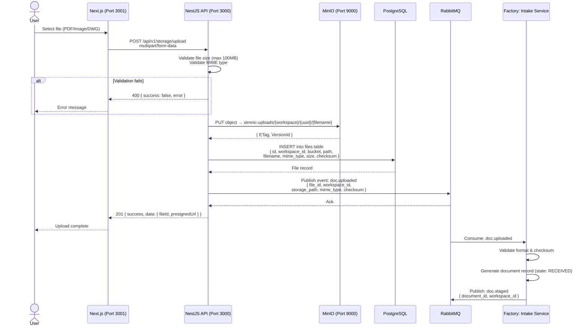

### Data Passed

| Step | Data | Format |
|------|------|--------|
| Upload request | File binary + metadata | `multipart/form-data` |
| MinIO storage | Raw file bytes | Binary object |
| DB record | `id, workspace_id, bucket, path, filename, extension, mime_type, size, checksum, uploaded_by` | Prisma `files` model |
| Upload event | `{ file_id, workspace_id, storage_path, mime_type, checksum }` | JSON (CloudEvents envelope) |

### Storage

| Store | What | Retention |
|-------|------|-----------|
| MinIO: `xennic-uploads` | Raw file | 365 days (transition to warm after 30d) |
| PostgreSQL: `files` | File metadata | Indefinite (soft-delete) |

### Error Handling

| Failure | Response |
|---------|----------|
| File too large (>100MB) | 400 Bad Request |
| Invalid MIME type | 400 Bad Request |
| MinIO unavailable | 503 Service Unavailable |
| Checksum mismatch after upload | Retry upload (max 3) |
| RabbitMQ publish fails | Logged; manual replay via admin |

---

## 2. OCR Pipeline

Scanned document → Vision Service → Tesseract/EasyOCR → text extraction → Engineering Service validation → structured data.

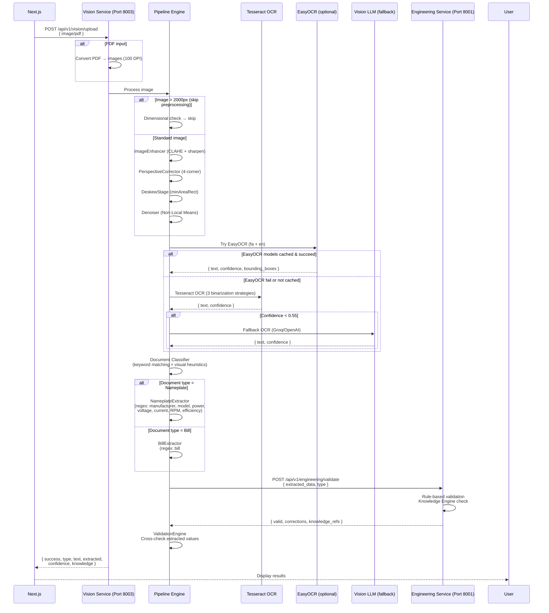

### Data Passed

| Step | Data | Format |
|------|------|--------|
| Input | Image/PDF binary | `multipart/form-data` |
| Preprocessed image | Enhanced image | `numpy array (H×W×C)` |
| OCR raw output | Text + confidence + bounding boxes | `{ text: string, confidence: float, bbox: [[x,y],...] }` |
| Classified document | Type label | `{ type: "nameplate" | "bill" }` |
| Extracted structured data | Equipment parameters / bill fields | `{ manufacturer, model, power_kw, voltage_v, ... }` |
| Validation result | Corrected data + knowledge references | `{ valid, corrections: [], knowledge: [] }` |

### Storage

| Store | What | Retention |
|-------|------|-----------|
| In-memory (pipeline) | Intermediate images | Ephemeral |
| Vision Service logs | OCR artifacts | 90 days |

### Error Handling

| Failure | Fallback |
|---------|----------|
| PDF conversion fails | Return error with suggestion to upload images |
| EasyOCR fail | Cascade to Tesseract |
| Tesseract low confidence | Cascade to Vision LLM |
| All OCR fail | Return error; prompt user for manual entry |
| Engineering Service down | Return raw OCR text without validation |
| Validation fails soft | Return extracted data with `warning` flag |

---

## 3. Metadata Flow

Raw document → Classify → Assign taxonomy → Enrich metadata → Store in PostgreSQL.

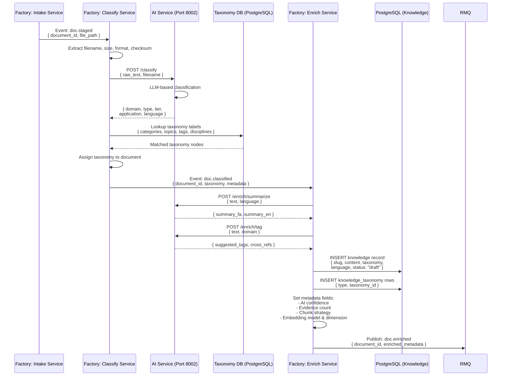

### Data Passed

| Step | Data | Format |
|------|------|--------|
| Classification input | Raw text + filename + format | JSON |
| AI classification result | Domain, type, tier, application, language | `{ domain: "power", type: "standard", tier: 1, ... }` |
| Taxonomy assignment | Knowledge + taxonomy IDs | `{ knowledge_id, taxonomy_type, taxonomy_id }` |
| Enrichment result | Summary, tags, cross-references | `{ summary_fa, summary_en, tags: [], cross_refs: [] }` |
| Persisted metadata | Full knowledge record with taxonomy | Prisma `knowledge` + `knowledge_taxonomy` |

### Storage

| Store | What | Retention |
|-------|------|-----------|
| PostgreSQL: `knowledge` | Article content & metadata | Indefinite |
| PostgreSQL: `knowledge_taxonomy` | Taxonomy assignments | Indefinite |
| PostgreSQL: `categories, topics, tags, disciplines` | Taxonomy reference data | Indefinite |

### Error Handling

| Failure | Action |
|---------|--------|
| AI Service timeout (30s) | Return partial classification; escalate to human review |
| Taxonomy lookup miss | Fallback to generic "uncategorized" label |
| Enrichment LLM failure | Skip enrichment; publish without AI tags |

---

## 4. Concept Extraction Flow

Parsed text → AI Service extraction → Concept resolution → Normalization → Knowledge graph.

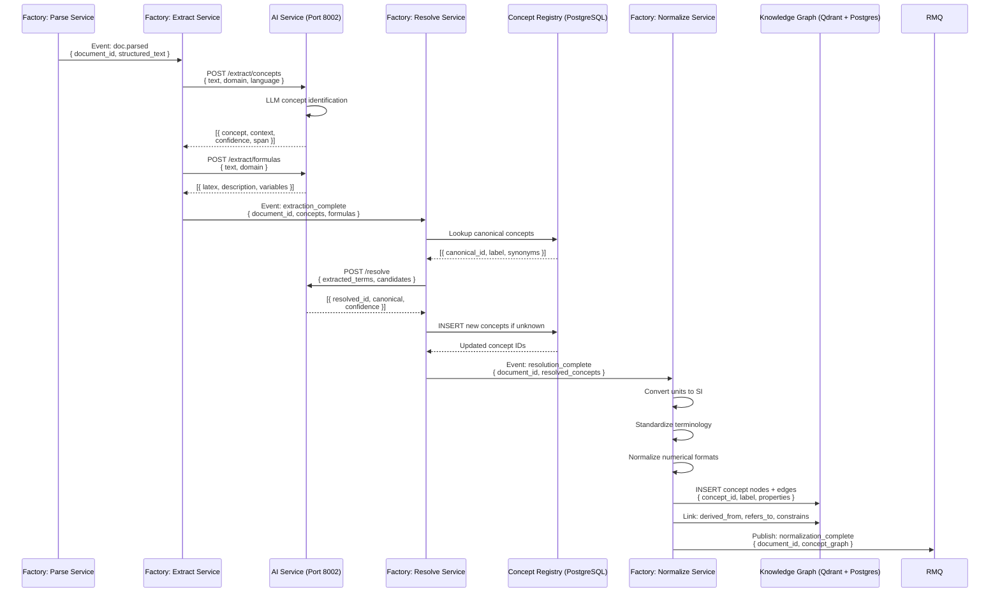

### Data Passed

| Step | Data | Format |
|------|------|--------|
| Parsed text | Structured text with layout | JSON |
| LLM concepts | `[{ concept: "transformer", context: "...", confidence: 0.92, span: [12, 45] }]` | JSON array |
| Formulas | `[{ latex: "S = V × I", description_fa, variables }]` | JSON array |
| Canonical mapping | Extracted → resolved concept ID | `{ extracted: "ترانس", resolved: "transformer" }` |
| Normalized concepts | SI units, standardized terms | JSON |

### Storage

| Store | What | Retention |
|-------|------|-----------|
| PostgreSQL: Concept Registry | Canonical concepts, synonyms, ontology | Indefinite |
| Knowledge Graph (Qdrant + PG) | Concept nodes, relationships | Indefinite |

### Error Handling

| Failure | Action |
|---------|--------|
| LLM extraction low confidence (<0.6) | Escalate to human review |
| Concept not in registry | Create placeholder; flag for review |
| Normalization fails (non-parseable unit) | Keep original value; flag with warning |

---

## 5. Entity Extraction Flow

Text → NER → Entity resolution → Relationship mapping → Graph nodes.

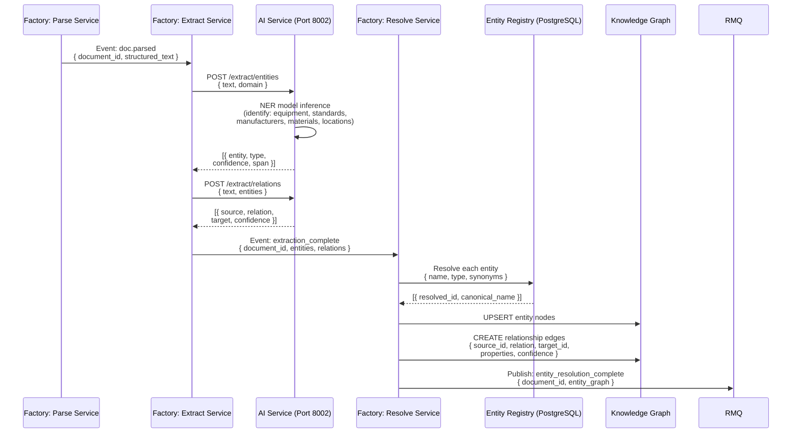

### Data Passed

| Step | Data | Format |
|------|------|--------|
| NER input | Structured text | JSON |
| NER output | Entities with types | `[{ entity: "IEC 60038", type: "standard", confidence: 0.95 }]` |
| Relations | Source → relation → target | `[{ source: "IEC 60038", relation: "defines", target: "400V" }]` |
| Entity resolution | Resolved canonical IDs | `{ extracted: "IEC 60038", resolved: "uuid", label: "IEC 60038" }` |
| Graph payload | Nodes + edges | Cypher / JSON |

### Storage

| Store | What | Retention |
|-------|------|-----------|
| Knowledge Graph | Entity nodes + relationship edges | Indefinite |
| PostgreSQL: Entity Registry | Canonical entity names | Indefinite |

### Error Handling

| Failure | Action |
|---------|--------|
| Entity confidence < 0.5 | Drop entity; log for review |
| Relation extraction fails | Return entities only; flag missing relations |
| Graph write fails | Retry with backoff (max 3); DLQ if persistent |

---

## 6. Chunking & Embedding Flow

Cleaned text → Semantic chunking → Embedding model → Qdrant storage.

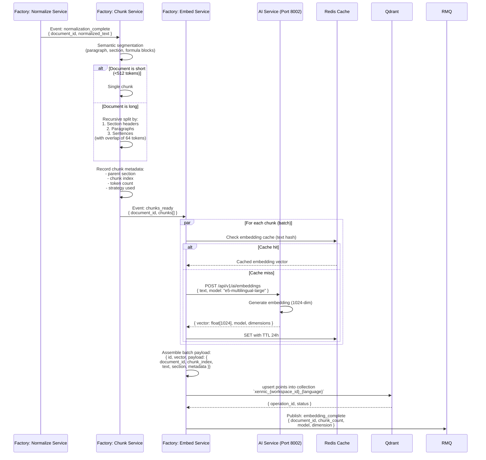

### Data Passed

| Step | Data | Format |
|------|------|--------|
| Normalized text | Clean, structured text | String |
| Chunks | Segments with overlap | `[{ index, text, section, token_count, strategy }]` |
| Embedding request | Text + model ID | JSON |
| Embedding vector | float[1024] | Array of floats |
| Qdrant payload | `{ id, vector, payload }` | Qdrant point |
| Chunk metadata | `{ chunk_index, section, token_count, ... }` | JSON in Qdrant payload |

### Storage

| Store | What | Retention |
|-------|------|-----------|
| Qdrant: `xennic_{ws}_{lang}` | Embedding vectors + payload | Indefinite |
| Redis | Embedding cache (text → vector) | 24h TTL |
| PostgreSQL (via knowledge record) | Chunk count & strategy metadata | Indefinite |

### Error Handling

| Failure | Action |
|---------|--------|
| Embedding model fails | Retry with fallback model (bge-m3) |
| Qdrant write fails | Retry batch with exponential backoff (max 3) |
| All retries exhausted | DLQ; alert operations |
| Cache unavailable | Bypass cache; generate fresh embedding |

---

## 7. Vector Storage Flow

Embeddings → Qdrant upsert → Index update → Search ready.

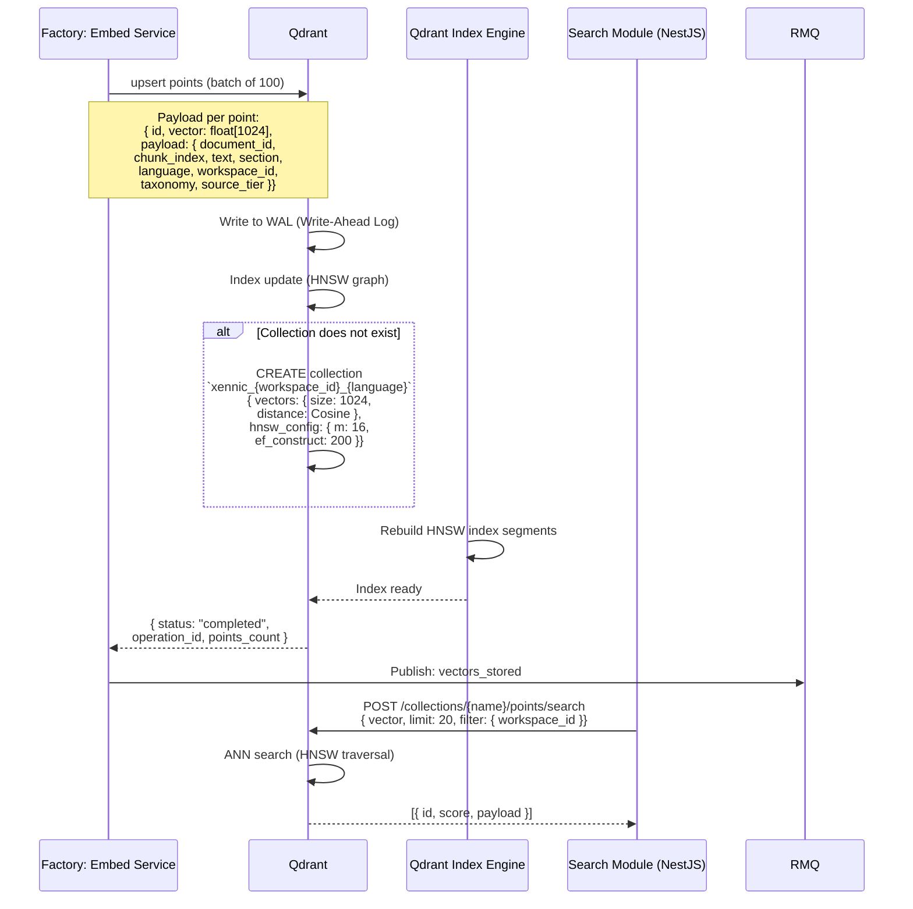

### Data Passed

| Step | Data | Format |
|------|------|--------|
| Upsert payload | Vector + payload + collection name | Qdrant gRPC/REST |
| Search query | Query vector + filters + limit | Qdrant gRPC/REST |
| Search response | `[{ id: uuid, score: float, payload: {...} }]` | JSON |

### Storage

| Store | What | Retention |
|-------|------|-----------|
| Qdrant WAL | Write operations for recovery | Until flush |
| Qdrant HNSW index | In-memory + disk index | Indefinite |
| Qdrant payload index | Filterable field index | Indefinite |

### Error Handling

| Failure | Action |
|---------|--------|
| Qdrant segment full | Force segment merge |
| HNSW index build fails | Rebuild on next write |
| Collection quota exceeded | Reject write; notify admin |

---

## 8. Knowledge Graph Flow

Entities → Graph construction → Relationship edges → Graph queryable.

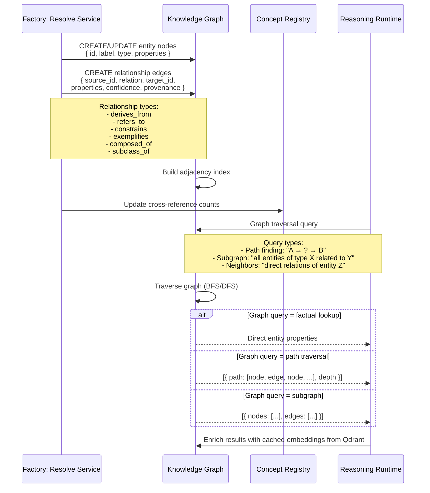

### Data Passed

| Step | Data | Format |
|------|------|--------|
| Node creation | `{ id, label, type, properties, workspace_id }` | JSON |
| Edge creation | `{ source_id, target_id, relation, properties, confidence }` | JSON |
| Graph traversal result | Paths / subgraphs / neighbors | JSON |

### Storage

| Store | What | Retention |
|-------|------|-----------|
| Knowledge Graph | All entity nodes + relationship edges | Indefinite |
| PostgreSQL: Concept Registry | Canonical entities + cross-references | Indefinite |

### Error Handling

| Failure | Action |
|---------|--------|
| Node creation duplicate | UPSERT (merge properties) |
| Edge creation with missing node | Create stub node; flag for enrichment |
| Graph query timeout (>5s) | Return partial results |
| Index corruption | Rebuild from event log |

---

## 9. Reasoning Flow

User query → Context building → Knowledge selection → Vector + Graph retrieval → Evidence collection → Reasoning → Confidence scoring → Citation generation → Answer.

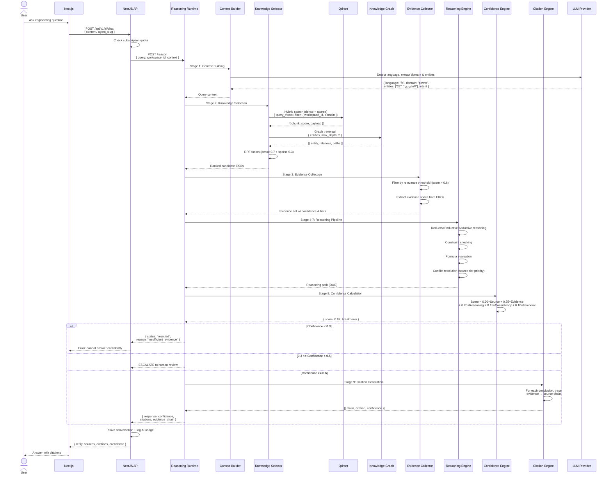

### Data Passed

| Step | Data | Format |
|------|------|--------|
| User query | Natural language question | String |
| Query context | Language, domain, entities, intent | `{ language, domain, entities: [], intent }` |
| Vector search results | Top-K chunks with scores | `[{ id, score, payload }]` |
| Graph traversal results | Entities, relationships, paths | JSON |
| Fused results | Ranked EKOs | `[{ eko_id, relevance_score, source_tier }]` |
| Evidence set | Filtered evidence nodes | `[{ evidence_id, claim, confidence, source_tier }]` |
| Reasoning path | DAG of reasoning steps | `{ nodes: [], edges: [] }` |
| Confidence score | 0.0–1.0 with breakdown | `{ score, breakdown: {...} }` |
| Final answer | Response text + citations | `{ reply, citations: [], confidence }` |

### Storage

| Store | What | Retention |
|-------|------|-----------|
| PostgreSQL: `conversations` + `messages` | Chat history | Indefinite |
| PostgreSQL: `ai_usage` | Token usage per request | Indefinite |
| Reasoning Runtime (in-memory) | Reasoning session state | Ephemeral (session TTL) |

### Error Handling

| Failure | Action |
|---------|--------|
| Qdrant search fails | Fallback to keyword search in PG |
| KG traversal fails | Return vector-only results |
| LLM provider timeout | Retry with fallback provider (Groq ↔ OpenAI ↔ Ollama) |
| All LLMs fail | Return "service unavailable" with cached fallback response |
| Reasoning step fails | Return partial reasoning with explanation |
| Low confidence (<0.3) | Reject query; request clarification |

---

## 10. AI Response Flow

Query → Retrieve context → Build prompt → LLM inference → Format response → Return to user.

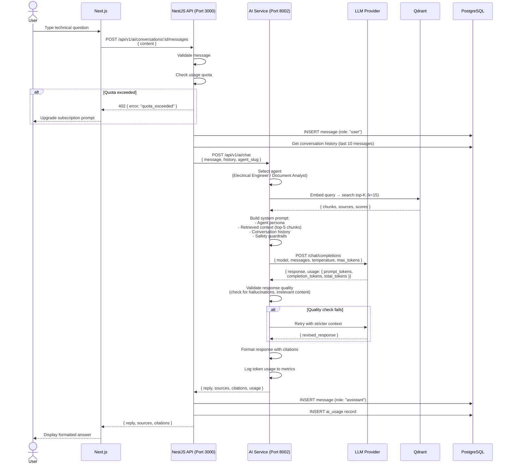

### Data Passed

| Step | Data | Format |
|------|------|--------|
| User message | Text content | `{ content: string }` |
| History | Last N messages | `[{ role, content, created_at }]` |
| Vector results | Top-K relevant chunks | `[{ chunk_id, text, score, source }]` |
| LLM prompt | System + context + history + user message | OpenAI-compatible messages array |
| LLM response | Generated text + token counts | `{ content, usage }` |
| Formatted response | Reply with citations | `{ reply, sources: [], citations: [] }` |

### Storage

| Store | What | Retention |
|-------|------|-----------|
| PostgreSQL: `messages` | Full conversation history | Indefinite |
| PostgreSQL: `ai_usage` | Per-request token costs | Indefinite |

### Error Handling

| Failure | Action |
|---------|--------|
| Usage quota exceeded | Return 402 with upgrade prompt |
| Qdrant search fails | Return LLM response without context |
| LLM provider rate-limited | Retry with backoff; fallback provider |
| LLM response empty | Retry once; return apology on second failure |
| Response quality check fails | Retry with stricter prompt; max 2 retries |

---

## 11. Feedback Loop

User feedback → Quality scoring → Model improvement → Pipeline retraining.

```mermaid
sequenceDiagram
    actor User
    participant Web as Next.js
    participant Nest as NestJS API
    participant PG as PostgreSQL
    participant Analytics as Analytics Pipeline
    participant ML as Model Training
    participant Pipeline as Factory Pipeline

    User->>Web: Thumbs up/down on AI response
    Web->>Nest: POST /api/v1/ai/feedback<br/>{ message_id, rating, comment }

    Nest->>PG: INSERT feedback record<br/>{ message_id, rating (1-5),<br/>  comment, user_id, created_at }
    PG-->>Nest: Recorded

    Nest->>PG: UPDATE knowledge_analytics<br/>{ likes, bookmarks, shares }
    Nest-->>Web: { success: true }

    par Weekly batch job
        Analytics->>PG: Query feedback:<br/>- Low-rated responses<br/>- Common failure patterns<br/>- Missing context gaps
        PG-->>Analytics: [{ message_id, rating,<br/>  comment, context_ids }]
    and
        Analytics->>PG: Query quality metrics:<br/>- Average confidence score<br/>- Citation accuracy rate<br/>- User satisfaction trend
        PG-->>Analytics: Aggregated metrics
    end

    Analytics->>Analytics: Compute quality score per agent/domain

    alt Score < threshold (e.g. < 0.7)
        Analytics->>ML: Trigger retraining job
        ML->>ML: Fine-tune embedding model<br/>on corrected data
        ML->>ML: Update RAG prompt templates
        ML->>Pipeline: Update pipeline config<br/>{ chunk_strategy, embedding_model,<br/>  classifier_version }
    else Score >= threshold
        Analytics->>Analytics: Log metrics; no action needed
    end

    Analytics->>PG: INSERT quality report<br/>{ period, average_score,<br/>  improvements, issues }
```

### Data Passed

| Step | Data | Format |
|------|------|--------|
| User feedback | Rating + optional comment | `{ rating: 1-5, comment?: string }` |
| Quality metrics | Aggregated scores per period | `{ avg_confidence, citation_accuracy, satisfaction }` |
| Retraining trigger | Pipeline config update | `{ model, chunk_strategy, version }` |

### Storage

| Store | What | Retention |
|-------|------|-----------|
| PostgreSQL: feedback (implicit in messages/analytics) | User ratings and comments | Indefinite |
| PostgreSQL: `knowledge_analytics` | View counts, likes, bookmarks | Indefinite |
| MinIO: `xennic-ai-models` | Retrained model artifacts | Versioned |

### Error Handling

| Failure | Action |
|---------|--------|
| Feedback write fails | Logged; no user impact |
| Analytics query fails | Skip batch; retry next cycle |
| Model retraining fails | Alert ML ops; keep previous model |
| Pipeline config update fails | Manual intervention required |

---

## 12. Human Review Flow

Low-confidence EKO → Review queue → Human engineer review → Approve/reject → Publication.

```mermaid
sequenceDiagram
    actor Engineer as Human Engineer
    participant Pipeline as Factory Pipeline
    participant QG as Quality Gate
    participant Queue as Review Queue (PostgreSQL)
    participant Nest as NestJS API
    participant Web as Next.js
    participant PG as PostgreSQL
    participant Pub as Publish Service

    Pipeline->>QG: EKO ready for quality check

    QG->>QG: Run quality gates QG-1 through QG-5

    alt Score >= 0.6 (auto-approve)
        QG->>Pub: Publish directly
    else Score < 0.3 (reject)
        QG->>Pipeline: Discard EKO; log failure
    else 0.3 <= Score < 0.6 (escalate)
        QG->>Queue: INSERT review_request<br/>{ eko_id, score, breakdown,<br/>  pipeline_provenance }
    end

    Engineer->>Web: Open review dashboard
    Web->>Nest: GET /api/v1/knowledge/pending-review
    Nest->>PG: Query review_queue WHERE status = "pending"
    PG-->>Nest: [{ eko_id, score, breakdown,<br/>  source_document, created_at }]
    Nest-->>Web: Pending reviews
    Web-->>Engineer: Review list

    Engineer->>Web: Select EKO to review
    Web->>Nest: GET /api/v1/knowledge/:id/workflow
    Nest->>PG: Get full EKO + pipeline trace
    PG-->>Nest: { eko, source_document,<br/>  extraction_results, confidence }
    Nest-->>Web: Detailed review view
    Web-->>Engineer: EKO detail

    Engineer->>Web: Approve / Reject with comment
    Web->>Nest: POST /api/v1/knowledge/:id/workflow/approve<br/>or /reject

    alt Approve
        Nest->>PG: UPDATE workflow status → "published"<br/>UPDATE knowledge status → "published"
        Nest->>PG: CREATE version snapshot
        PG-->>Nest: Done
        Nest->>Pub: Publish EKO to stores
        Pub->>Pub: Write to Qdrant + Knowledge Graph + PostgreSQL
    else Reject with feedback
        Nest->>PG: UPDATE workflow status → "draft"<br/>UPDATE knowledge status → "draft"
        Nest->>PG: Store reviewer comment
    end

    Nest-->>Web: { success, status }
    Web-->>Engineer: Confirmation
```

### Data Passed

| Step | Data | Format |
|------|------|--------|
| Quality score | 0.0–1.0 with component breakdown | `{ score, components: {...} }` |
| Review request | EKO + pipeline provenance | `{ eko_id, score, source_doc, pipeline_version }` |
| Review decision | Approve/reject + comment | `{ action: "approve"|"reject", comment }` |

### Storage

| Store | What | Retention |
|-------|------|-----------|
| PostgreSQL: `knowledge_workflows` | Workflow state & history | Indefinite |
| PostgreSQL: `knowledge_workflow_history` | Audit trail of all transitions | Indefinite |
| PostgreSQL: `knowledge` | Published/rejected EKOs | Indefinite |

### Error Handling

| Failure | Action |
|---------|--------|
| Quality gate timeout | Escalate to human review by default |
| Publish after approve fails | Leave workflow as "approved pending"; retry with backoff |
| Duplicate review assignment | Lock workflow row; reject concurrent writes |

---

## 13. Versioning Flow

EKO update → New version → Supersession chain → Query shows latest.

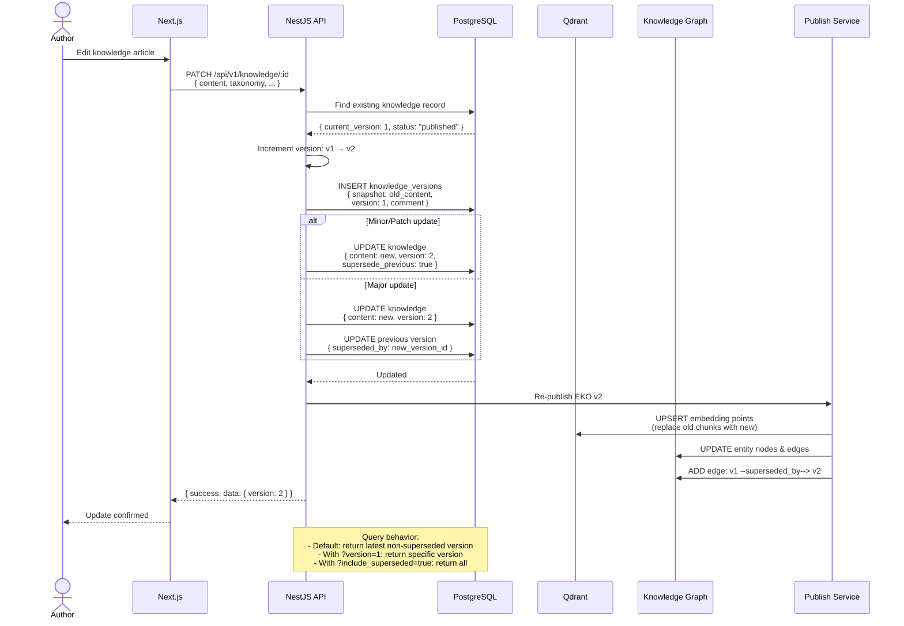

### Data Passed

| Step | Data | Format |
|------|------|--------|
| Update payload | New content + metadata | JSON |
| Version record | `{ version, snapshot, comment, created_by }` | JSON |
| Supersession pointer | `{ superseded_by: new_id }` | UUID |
| Re-publish payload | New + old version IDs | JSON |

### Storage

| Store | What | Retention |
|-------|------|-----------|
| PostgreSQL: `knowledge` | Current version (latest) | Indefinite |
| PostgreSQL: `knowledge_versions` | All historical snapshots | Indefinite |
| Qdrant | Embeddings of latest published version | Indefinite |
| Knowledge Graph | Version nodes + supersession edges | Indefinite |

### Error Handling

| Failure | Action |
|---------|--------|
| Version conflict (concurrent edit) | Reject with 409; reload and retry |
| Qdrant re-index fails | Leave old embeddings; flag for cleanup |
| KG supersession edge fails | Log; versioning still works via PG |

---

## Event Reference

Every pipeline stage emits events conforming to CloudEvents 1.0 specification:

```json
{
  "specversion": "1.0",
  "id": "uuid",
  "source": "/xennic/factory/{service}",
  "type": "com.xennic.factory.{event}",
  "datacontenttype": "application/json",
  "time": "2026-06-26T10:00:00Z",
  "data": {
    "document_id": "uuid",
    "workspace_id": "uuid",
    "pipeline_version": "1.0.0"
  }
}
```

### Event Catalog

| Event | Producer | Consumer(s) | Description |
|-------|----------|-------------|-------------|
| `doc.uploaded` | NestJS Storage | Intake Service | File uploaded to MinIO |
| `doc.staged` | Intake Service | Classify Service | Document validated & staged |
| `doc.classified` | Classify Service | Parse Service | Taxonomy assigned |
| `doc.parsed` | Parse Service | Extract Service | Text extracted via OCR |
| `extraction_complete` | Extract Service | Resolve Service | Concepts + entities extracted |
| `resolution_complete` | Resolve Service | Normalize Service | Terms mapped to canonicals |
| `normalization_complete` | Normalize Service | Chunk Service | Units normalized |
| `chunks_ready` | Chunk Service | Embed Service | Text segmented into chunks |
| `embedding_complete` | Embed Service | Enrich/Publish | Vectors stored in Qdrant |
| `enrichment_complete` | Enrich Service | Publish Service | Metadata enriched |
| `eko.published` | Publish Service | Reasoning, NestJS | EKO available for retrieval |
| `eko.failed` | Any factory | NestJS, Logging | Pipeline stage failed |
| `quality.escalated` | Quality Gate | Human Review | Low-confidence EKO needs review |
| `review.completed` | Human Review | Publish Service | Human approved/rejected |
| `eko.superseded` | Version Manager | Reasoning | Newer version available |
| `eko.archived` | Lifecycle Manager | All stores | EKO removed from active retrieval |

---

## Error Handling Summary

### Retry Strategy

| Stage | Max Retries | Backoff | DLQ |
|-------|-------------|---------|-----|
| Intake validation | 3 | Exponential (1s, 4s, 16s) | Yes |
| OCR pipeline | 2 | Linear (5s, 10s) | No (fallback cascade) |
| LLM extraction | 3 | Exponential (2s, 8s, 32s) | Yes |
| Qdrant upsert | 3 | Exponential (1s, 4s, 16s) | Yes |
| Graph write | 3 | Exponential (1s, 4s, 16s) | Yes |
| Publish | 5 | Exponential (2s, 8s, 32s, 128s, 512s) | Yes (manual replay) |

### Circuit Breaker Thresholds

| Service | Failure Count | Timeout | Half-Open After |
|---------|---------------|---------|-----------------|
| AI Service (LLM) | 5 | 30s | 60s |
| Qdrant | 10 | 5s | 30s |
| Knowledge Graph | 5 | 10s | 30s |
| Engineering Service | 3 | 10s | 30s |
| MinIO | 3 | 10s | 30s |

### Dead Letter Queue

- **Exchange**: `xennic.factory.dlq`
- **TTL**: 7 days
- **Actions**: Manual replay via admin UI or discard after TTL
- **Monitoring**: Prometheus alert on DLQ depth > 100

---

## Storage Architecture Summary

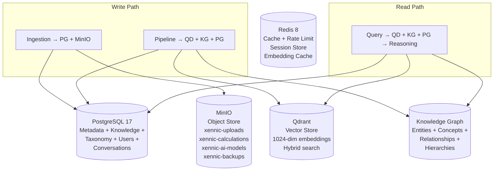

---

## Related Documents

| Document | Path |
|----------|------|
| System Architecture | `architecture/SYSTEM_ARCHITECTURE.md` |
| Service Architecture | `architecture/SERVICE_ARCHITECTURE.md` |
| Event Flow | `architecture/EVENT_FLOW.md` |
| Request Flow | `architecture/REQUEST_FLOW.md` |
| Sequence Diagrams | `architecture/SEQUENCE_DIAGRAMS.md` |
| XKF Architecture | `knowledge-factory/XKF-ARCHITECTURE.md` |
| XKF Lifecycle | `knowledge-factory/XKF-LIFECYCLE.md` |
| Reasoning Runtime | `knowledge/reasoning/reasoning-runtime.md` |
| Storage Architecture | `storage/STORAGE_ARCHITECTURE.md` |

---

## Revision History

| Version | Date | Changes |
|---------|------|---------|
| 1.0.0 | Tir 1405 | Initial release — 13 data flows documented |
