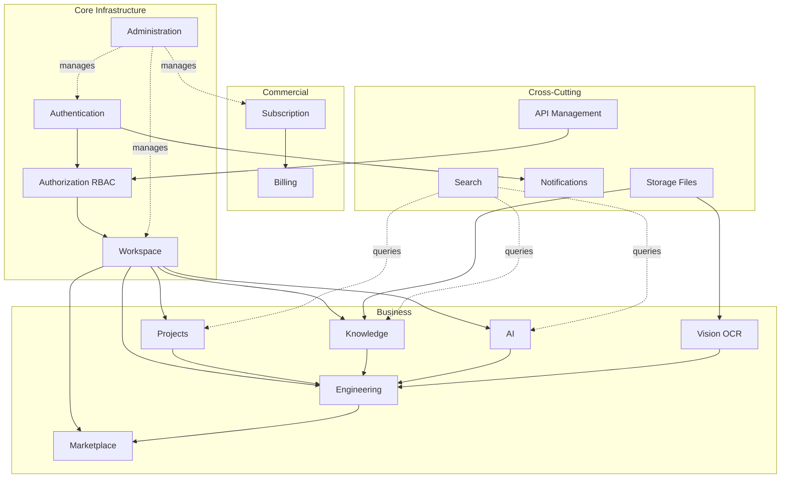
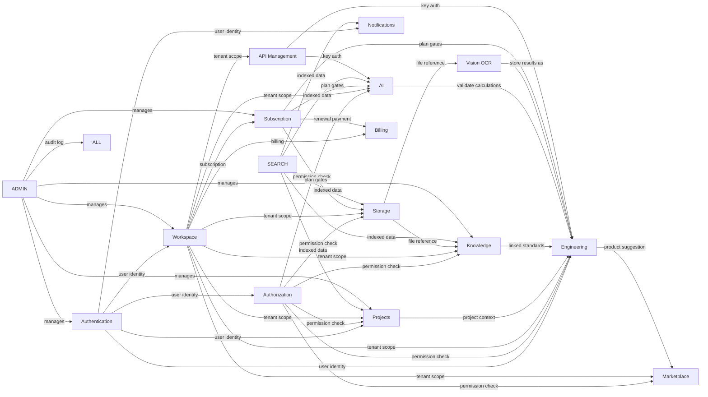

# Domain Map — Business Boundaries & Ownership

> **Version:** 1.0  
> **Status:** Living Document  
> **Last Updated:** 2026-06-26  

This document defines every business domain in the Xennic platform. Each domain section
includes responsibilities, data entities, owning services, API surface, domain events,
and inter-domain dependencies.

---

## Domain Overview

---

## 1. Authentication

### Responsibilities
- User registration, login, and logout
- JWT access/refresh token lifecycle
- Password hashing (Argon2id) and validation
- Password reset flow (forgot → email → reset → change)
- Session tracking (IP, user-agent, expiry)
- Email/password identity verification

### Entities (Prisma)
| Model | Key Fields |
|-------|-----------|
| `users` | `id`, `email`, `phone`, `password`, `first_name`, `last_name`, `is_admin`, `is_active`, `email_verified_at` |
| `sessions` | `id`, `user_id`, `workspace_id`, `ip_address`, `user_agent`, `expires_at`, `last_activity_at` |
| `refresh_tokens` | `id`, `user_id`, `token_hash`, `expires_at`, `revoked_at` |
| `password_reset_tokens` | `id`, `user_id`, `token_hash`, `expires_at`, `used_at` |

### Services
- **NestJS `AuthModule`** (`apps/api/src/modules/auth/`) — all auth flows
- **`AuthService`** — register, login, refresh, logout, password operations
- **`JwtAuthGuard`** — guards protected routes

### APIs (prefix: `/api/v1/auth`)
| Method | Path | Auth |
|--------|------|------|
| POST | `/auth/register` | No |
| POST | `/auth/login` | No |
| POST | `/auth/refresh-token` | No |
| POST | `/auth/logout` | JWT |
| GET | `/auth/me` | JWT |
| POST | `/auth/forgot-password` | No |
| POST | `/auth/reset-password` | No |
| PUT | `/auth/change-password` | JWT |

### Events
- **Emits:** `user.registered`, `user.logged_in`, `user.logged_out`, `user.password_changed`, `user.password_reset`
- **Consumes:** —

### Dependencies
- **→ Authorization (RBAC):** users have roles via `user_roles`
- **→ Workspace:** users own and belong to workspaces via `workspace_members`
- **→ Notifications:** password reset emails, login alerts

---

## 2. Authorization (RBAC)

### Responsibilities
- Role-based access control for all platform operations
- Permission CRUD with `domain.action` naming convention
- Role-permission assignment management
- User-role assignment (scoped to workspace)
- Permission checking via guards and decorators

### Entities (Prisma)
| Model | Key Fields |
|-------|-----------|
| `roles` | `id`, `name`, `slug`, `description` |
| `permissions` | `id`, `name`, `slug`, `domain`, `description` |
| `role_permissions` | `id`, `role_id`, `permission_id` (unique pair) |
| `user_roles` | `id`, `user_id`, `role_id`, `workspace_id` (unique triple) |

### Services
- **NestJS `RbacModule`** (`apps/api/src/modules/rbac/`)
- **`RoleService`** — CRUD roles, assign permissions
- **`PermissionService`** — CRUD permissions, filter by domain
- **`PermissionsGuard`** — decorator-driven permission check
- **`RequirePermissions`** — parameterized decorator

### APIs (prefix: `/api/v1`)
| Method | Path | Permission |
|--------|------|------------|
| GET | `/roles` | — |
| POST | `/roles` | `roles.create` |
| GET | `/roles/:id` | — |
| PUT | `/roles/:id` | `roles.update` |
| DELETE | `/roles/:id` | `roles.delete` |
| POST | `/roles/:id/permissions` | `roles.permissions.assign` |
| GET | `/permissions` | — |
| GET | `/permissions/:id` | — |
| POST | `/permissions` | `permissions.create` |
| DELETE | `/permissions/:id` | `permissions.delete` |

### Events
- **Emits:** `role.created`, `role.updated`, `role.deleted`, `permission.assigned`

### Dependencies
- **Authentication →** consumes JWT identity for user context
- **→ All domains:** permissions are consumed domain-wide for guard checks

---

## 3. Workspace

### Responsibilities
- Multi-tenant workspace lifecycle (create, update, soft/hard delete, restore)
- Workspace membership management (invite, join, remove)
- Workspace invitations (token-based, expiring)
- Workspace-level settings (JSON blob)
- Tenant isolation context provider (`workspace_id`)

### Entities (Prisma)
| Model | Key Fields |
|-------|-----------|
| `workspaces` | `id`, `code`, `name`, `created_by`, `deleted_at` |
| `workspace_members` | `id`, `workspace_id`, `user_id`, `role` (OWNER/MEMBER) |
| `workspace_invitations` | `id`, `workspace_id`, `email`, `token`, `status`, `expires_at` |
| `workspace_settings` | `id`, `workspace_id` (unique), `settings` (JSON) |

### Services
- **NestJS `WorkspaceModule`** (`apps/api/src/modules/workspace/`)
- **`@xennic/database` (TenantContext)** — middleware that resolves `workspace_id` from request header
- **`WorkspaceService`** — CRUD, membership, invitations

### APIs (prefix: `/api/v1`)
| Method | Path |
|--------|------|
| POST | `/workspaces` |
| GET | `/workspaces` |
| GET | `/workspaces/:id` |
| PUT | `/workspaces/:id` |
| DELETE | `/workspaces/:id` |
| PATCH | `/workspaces/:id/restore` |
| DELETE | `/workspaces/:id/hard` |
| GET | `/workspaces/:id/members` |
| POST | `/workspaces/:id/members` |
| DELETE | `/workspaces/:id/members/:userId` |
| GET | `/workspaces/:id/invitations` |
| POST | `/workspaces/:id/invitations` |
| DELETE | `/workspaces/:id/invitations/:id` |
| GET | `/workspaces/:id/settings` |
| PUT | `/workspaces/:id/settings` |

### Events
- **Emits:** `workspace.created`, `workspace.updated`, `workspace.deleted`, `member.joined`, `member.left`, `invitation.sent`, `invitation.accepted`

### Dependencies
- **Authentication →** user identity for membership
- **Authorization →** workspace-scoped role assignments
- **→ All domain entities** carry `workspace_id` for tenant isolation

---

## 4. Projects

### Responsibilities
- Project lifecycle management within a workspace
- Project membership (add/remove users with role: viewer/editor/admin)
- Project notes (free-form text annotations per project)
- Project reports (generated file outputs linked to a project)
- Linking calculations to projects

### Entities (Prisma)
| Model | Key Fields |
|-------|-----------|
| `projects` | `id`, `workspace_id`, `name`, `description`, `status`, `start_date`, `end_date`, `deleted_at` |
| `project_members` | `id`, `project_id`, `user_id`, `role` |
| `project_notes` | `id`, `project_id`, `content`, `created_by` |
| `project_reports` | `id`, `project_id`, `file_id` |

### Services
- **NestJS `ProjectModule`** (`apps/api/src/modules/project/`)

### APIs (prefix: `/api/v1`)
| Method | Path | Permission |
|--------|------|------------|
| GET | `/projects` | `projects.read` |
| POST | `/projects` | `projects.create` |
| GET | `/projects/:id` | `projects.read` |
| PATCH | `/projects/:id` | `projects.update` |
| DELETE | `/projects/:id` | `projects.delete` |
| PATCH | `/projects/:id/restore` | `projects.update` |
| GET | `/projects/:id/members` | `projects.read` |
| POST | `/projects/:id/members` | `projects.update` |
| DELETE | `/projects/:id/members/:userId` | `projects.update` |
| GET | `/projects/:id/notes` | `projects.read` |
| POST | `/projects/:id/notes` | `projects.update` |
| DELETE | `/projects/:id/notes/:noteId` | `projects.update` |

### Events
- **Emits:** `project.created`, `project.updated`, `project.deleted`, `project.member.added`, `project.member.removed`, `project.note.added`

### Dependencies
- **Workspace →** projects belong to a workspace
- **Authentication →** creator identity
- **Engineering →** calculations can be linked to a project (`project_id`)
- **Storage →** project reports reference file IDs

---

## 5. Engineering

### Responsibilities
- Execution of electrical engineering calculations (100+ calculator types)
- Calculation catalog (type registry, plan-gated availability)
- Calculation template management (input/output schemas)
- Engineering standards reference (IEC, IEEE, etc.)
- Persistence of calculation history per workspace/project
- Energy bill OCR analysis and power system studies

### Entities (Prisma)
| Model | Key Fields |
|-------|-----------|
| `calculations` | `id`, `workspace_id`, `project_id`, `user_id`, `type`, `version`, `inputs`, `results`, `engine_version`, `standard_version` |
| `calculation_templates` | `id`, `name`, `type`, `schema` (JSON) |
| `engineering_standards` | `id`, `code`, `title`, `organization`, `version`, `status` |

### Services
- **NestJS `EngineeringModule`** (`apps/api/src/modules/engineering/`) — API gateway, proxy, history
- **Engineering Service (FastAPI, port 8001)** — calculation engine
  - **Calculators:** Basic Electrical, Cable, Transformer, Protection, Power Quality, Switchgear, Lighting, Grounding, Renewable, Economics, Energy Analyzer, Power System Studies
- **`CalculationRegistry`** — in-process registry of all calculator classes
- **Vision Service (FastAPI, port 8003)** — OCR for bills (co-used)

### APIs (NestJS — `/api/v1`)
| Method | Path | Permission |
|--------|------|------------|
| GET | `/engineering/calculations` | `engineering.read` |
| POST | `/engineering/calculations` | `engineering.calculate` |
| GET | `/engineering/calculations/:id` | `engineering.read` |
| DELETE | `/engineering/calculations/:id` | `engineering.calculate` |
| GET | `/engineering/catalog` | `engineering.read` |
| GET | `/engineering/health` | — |
| POST | `/engineering/energy/ocr-bill` | `engineering.calculate` |
| POST | `/engineering/energy/analyze` | `engineering.calculate` |
| POST | `/engineering/energy/manual-analyze` | `engineering.calculate` |

### APIs (FastAPI Engineering Service — `http://localhost:8001/api/v1/engineering/`)
| Prefix | Calculators |
|--------|------------|
| `/basic` | Ohm's Law, Active/Apparent/Reactive Power, Power Factor |
| `/cable` | Ampacity, Voltage Drop, Short Circuit, PE Sizing, Tray Sizing |
| `/transformer` | Sizing, Losses, Regulation, K-Factor, Efficiency |
| `/protection` | MCCB Selection, Fuse Selection, Coordination, Arc Flash, Grounding |
| `/power-quality` | THD, TDD, K-Factor, Resonance, Passive/Active Filter, PFC, Capacitor Bank |
| `/power-system` | Load Flow, Short Circuit, Motor Starting, Busbar Sizing |
| `/switchgear` | Main Switch Calculator |
| `/lighting` | Lumen Method, Road Lighting |
| `/grounding` | Grounding Grid Calculator |
| `/renewable` | Solar PV, Battery Storage, Inverter Sizing, Motor Efficiency |
| `/economics` | ROI, NPV, IRR |

### Events
- **Emits:** `calculation.executed`, `calculation.deleted`

### Dependencies
- **Workspace →** calculations are workspace-scoped
- **Projects →** optional project linkage
- **Authentication →** user attribution
- **Vision/OCR →** bill image processing
- **Subscription →** plan-gated calculator access (catalog filtered by plan)
- **Knowledge →** calculator types linked to knowledge formulas (`calculator_type`)
- **→ Marketplace:** calculation results can suggest matching products

---

## 6. Knowledge

### Responsibilities
- Knowledge article lifecycle (draft → review → published → archived)
- Multi-language content (block-based JSON content, translations)
- Rich taxonomy (categories, topics, tags, disciplines, audiences)
- Media attachments (images, PDFs, CAD, 3D models, video, audio)
- Formulas (LaTeX + MathML, variable definitions, linked calculators)
- Worked examples with step-by-step solutions
- Engineering standards cross-references
- Version snapshots (full content copy on publish)
- Comments and threaded discussions
- Review workflow (submit, assign, approve, reject)
- Analytics (views, likes, bookmarks, shares, downloads, daily stats)
- Full-text search (`search_text` auto-populated)

### Entities (Prisma) — 18 models
| Model | Purpose |
|-------|---------|
| `knowledge` | Core article (content, status, visibility, language, version) |
| `knowledge_translations` | Per-language title, summary, SEO, translated content |
| `categories` | Hierarchical category tree (parent/child) |
| `topics` | Flat topic tags |
| `tags` | Free-form tags |
| `disciplines` | Engineering discipline classification |
| `audiences` | Target audience (beginner, professional, etc.) |
| `knowledge_taxonomy` | Polymorphic assignment: knowledge ↔ (category/topic/tag/discipline/audience) |
| `knowledge_media` | Images, PDFs, videos, CAD files, etc. |
| `knowledge_formulas` | LaTeX, MathML, variables, linked calculator type |
| `knowledge_examples` | Step-by-step worked examples |
| `knowledge_standards` | M:N link between knowledge and engineering_standards |
| `knowledge_versions` | Version snapshots (published content copies) |
| `knowledge_comments` | Threaded comments (parent/replies) |
| `knowledge_workflows` | Single workflow per article (status, assignee, reviewer) |
| `knowledge_workflow_history` | Audit trail of workflow transitions |
| `knowledge_analytics` | View/like/bookmark/share/download counters, daily stats |
| `knowledge_standards` | Pivot: knowledge ↔ engineering_standards |

### Services
- **NestJS `KnowledgeModule`** (`apps/api/src/modules/knowledge/`)
- **`KnowledgeService`** — CRUD, search, workflow, comments, versions, analytics
- **TaxonomyController** — CRUD for taxonomy entities
- *Future: Knowledge Factory microservices*

### APIs (prefix: `/api/v1`)
| Method | Path | Permission |
|--------|------|------------|
| GET | `/knowledge` | `knowledge.read` |
| POST | `/knowledge` | `knowledge.create` |
| GET | `/knowledge/search` | `knowledge.read` |
| GET | `/knowledge/slug/:slug` | `knowledge.read` |
| GET | `/knowledge/:id` | `knowledge.read` |
| PATCH | `/knowledge/:id` | `knowledge.update` |
| DELETE | `/knowledge/:id` | `knowledge.delete` |
| POST | `/knowledge/:id/review` | `knowledge.review` |
| POST | `/knowledge/:id/publish` | `knowledge.publish` |
| POST | `/knowledge/:id/reject` | `knowledge.review` |
| POST | `/knowledge/:id/archive` | `knowledge.update` |
| POST | `/knowledge/:id/restore` | `knowledge.update` |
| GET | `/knowledge/:id/taxonomy` | `knowledge.read` |
| POST | `/knowledge/:id/taxonomy` | `knowledge.update` |
| DELETE | `/knowledge/:id/taxonomy/:taxonomyId` | `knowledge.update` |
| GET | `/knowledge/:id/versions` | `knowledge.read` |
| GET | `/knowledge/:id/versions/:versionId` | `knowledge.read` |
| POST | `/knowledge/:id/versions/:versionId/restore` | `knowledge.publish` |
| GET | `/knowledge/:id/comments` | `knowledge.read` |
| POST | `/knowledge/:id/comments` | `knowledge.create` |
| PATCH | `/knowledge/:id/comments/:commentId` | `knowledge.update` |
| DELETE | `/knowledge/:id/comments/:commentId` | `knowledge.delete` |
| GET | `/knowledge/:id/workflow` | `knowledge.read` |
| POST | `/knowledge/:id/workflow/submit` | `knowledge.update` |
| POST | `/knowledge/:id/workflow/approve` | `knowledge.review` |
| POST | `/knowledge/:id/workflow/reject` | `knowledge.review` |
| GET | `/knowledge/by-calculator/:calculatorType` | `knowledge.read` |
| GET | `/knowledge/:id/related-calculations` | `knowledge.read` |
| GET | `/knowledge/analytics/dashboard` | `knowledge.read` |
| GET | `/knowledge/:id/analytics` | `knowledge.read` |
| POST | `/knowledge/:id/view` | `knowledge.read` |

**Taxonomy CRUD** (separate controllers):
| Method | Path |
|--------|------|
| CRUD | `/categories` |
| CRUD | `/topics` |
| CRUD | `/tags` |
| CRUD | `/disciplines` |
| CRUD | `/audiences` |

### Events
- **Emits:** `knowledge.created`, `knowledge.updated`, `knowledge.published`, `knowledge.archived`, `knowledge.review_requested`, `knowledge.review_approved`, `knowledge.review_rejected`, `knowledge.comment.added`
- **Consumes:** — (standalone domain)

### Dependencies
- **Workspace →** knowledge is workspace-scoped
- **Authentication →** author, reviewer, commenter identity
- **Authorization →** permission guards per operation
- **Engineering →** knowledge.formulas link to calculator types, knowledge ↔ engineering_standards
- **Storage →** knowledge_media references files (URLs to MinIO)
- **Search →** knowledge FTS feeds global search

---

## 7. AI

### Responsibilities
- AI agent definitions and versioning
- Conversation management (create, list, delete)
- Message exchange (user ↔ AI assistant)
- Engineering calculation validation via AI
- AI usage tracking (token counts, cost, provider/model attribution)

### Entities (Prisma)
| Model | Key Fields |
|-------|-----------|
| `agents` | `id`, `name`, `slug`, `version`, `is_active` |
| `conversations` | `id`, `workspace_id`, `agent_id`, `title` |
| `messages` | `id`, `conversation_id`, `role`, `content`, `metadata` |
| `ai_usage` | `id`, `workspace_id`, `user_id`, `agent_id`, `provider`, `model`, `prompt_tokens`, `completion_tokens`, `total_tokens`, `cost` |

### Services
- **NestJS `AiModule`** (`apps/api/src/modules/ai/`) — conversation CRUD, proxy to AI engine
- **AI Service (FastAPI, port 8002)** — *future* — LLM invocation, RAG retrieval

### APIs (prefix: `/api/v1`)
| Method | Path |
|--------|------|
| GET | `/ai/agents` |
| GET | `/ai/conversations` |
| POST | `/ai/conversations` |
| GET | `/ai/conversations/:id` |
| DELETE | `/ai/conversations/:id` |
| POST | `/ai/conversations/:id/messages` |
| POST | `/ai/validate` |
| GET | `/ai/usage` |

### Events
- **Emits:** `conversation.created`, `message.sent`, `ai.validation_requested`

### Dependencies
- **Workspace →** conversations are workspace-scoped
- **Authentication →** user identity for attribution
- **Authorization →** workspace guard
- **Engineering →** AI validates calculation results (`POST /ai/validate`)
- **Knowledge →** RAG context (future)

---

## 8. Vision / OCR

### Responsibilities
- Document image processing (bills, nameplates, general documents)
- Auto-detection of document type (bill vs nameplate vs generic)
- OCR extraction (PaddleOCR engine)
- Structured data extraction from electricity bills
- Equipment nameplate data recognition
- Persistent storage of processing results in calculation history

### Entities
- *No dedicated Prisma models* — results stored in `calculations` table with `type: vision_bill | vision_nameplate | vision_generic`
- Files stored in MinIO (via NestJS StorageModule or direct upload)

### Services
- **Vision Service (FastAPI, port 8003)** — OCR engine, PaddleOCR
- **NestJS `VisionModule`** (`apps/api/src/modules/vision/`) — upload proxy, health check

### APIs (prefix: `/api/v1`)
| Method | Path | Service |
|--------|------|---------|
| POST | `/vision/upload` | NestJS (proxy → FastAPI 8003) |
| GET | `/vision/health` | NestJS |
| POST | `/api/v1/vision/upload` | FastAPI 8003 |
| POST | `/api/v1/vision/bill/read` | FastAPI 8003 |
| GET | `/health` | FastAPI 8003 |

### Events
- **Emits:** `vision.document_processed`, `vision.bill_analyzed`

### Dependencies
- **Engineering →** vision results saved as calculations; OCR bill data feeds energy analysis
- **Storage →** upload handling via NestJS StorageModule
- **Workspace →** results stored per workspace
- **Authentication →** user identity for attribution

---

## 9. Marketplace

### Responsibilities
- Vendor management (name, slug, status)
- Product catalog (engineering equipment: cables, transformers, MCCBs, switchgear, etc.)
- Multi-locale product translations
- Order creation and lifecycle
- Product suggestion based on engineering calculation results

### Entities (Prisma)
| Model | Key Fields |
|-------|-----------|
| `vendors` | `id`, `name`, `slug`, `status` |
| `products` | `id`, `vendor_id`, `type`, `category`, `specifications` (JSON), `sku`, `price`, `currency`, `status` |
| `product_translations` | `id`, `product_id`, `locale`, `title`, `description` |
| `orders` | `id`, `workspace_id`, `user_id`, `status`, `currency`, `total_amount` |
| `order_items` | `id`, `order_id`, `product_id`, `quantity`, `unit_price`, `total_price` |

### Services
- **NestJS `MarketplaceModule`** (`apps/api/src/modules/marketplace/`)
- **`VendorService`** — CRUD vendors
- **`ProductService`** — CRUD products, search, suggest

### APIs (prefix: `/api/v1`)
| Method | Path |
|--------|------|
| GET | `/vendors` |
| GET | `/vendors/:id` |
| POST | `/vendors` |
| PATCH | `/vendors/:id` |
| GET | `/products` |
| GET | `/products/suggest` |
| GET | `/products/:id` |
| POST | `/products` |
| PATCH | `/products/:id` |
| DELETE | `/products/:id` |
| GET | `/orders` |
| GET | `/orders/:id` |
| POST | `/orders` |
| PATCH | `/orders/:id/status` |

### Events
- **Emits:** `vendor.created`, `product.created`, `product.updated`, `order.created`, `order.status_changed`

### Dependencies
- **Engineering →** product suggestion consumes calculation result parameters
- **Workspace →** orders are workspace-scoped
- **Authentication →** order user attribution
- **Knowledge →** products may reference engineering standards

---

## 10. Billing / Subscription

### Responsibilities
- Plan definitions (monthly/yearly pricing, feature JSON)
- Workspace subscription lifecycle (subscribe, cancel, history)
- Usage logging per feature (calculations count, AI tokens, storage)
- Invoice generation and management
- Payment processing (Zarinpal, PayPing gateways)
- Payment method management (save, default, delete)
- Transaction ledger
- Subscription payment history and renewal processing

### Entities (Prisma)
| Model | Key Fields |
|-------|-----------|
| `plans` | `id`, `name`, `slug`, `monthly_price`, `yearly_price`, `features`, `is_active` |
| `subscriptions` | `id`, `workspace_id`, `plan_id`, `status`, `starts_at`, `ends_at`, `cancelled_at` |
| `usage_logs` | `id`, `workspace_id`, `feature`, `amount`, `logged_at` |
| `invoices` | `id`, `workspace_id`, `invoice_number`, `status`, `currency`, `subtotal`, `tax_amount`, `total_amount` |
| `payments` | `id`, `workspace_id`, `invoice_id`, `gateway`, `authority`, `reference_number`, `amount`, `status` |
| `transactions` | `id`, `workspace_id`, `payment_id`, `type`, `amount`, `status`, `metadata` |
| `payment_methods` | `id`, `workspace_id`, `user_id`, `gateway`, `gateway_customer_id`, `masked_number`, `is_default` |
| `subscription_payments` | `id`, `workspace_id`, `subscription_id`, `invoice_id`, `payment_id`, `amount`, `status`, `period_start`, `period_end` |

### Services
- **NestJS `SubscriptionModule`** (`apps/api/src/modules/subscription/`) — plans, subscriptions, usage
- **NestJS `BillingModule`** (`apps/api/src/modules/billing/`) — invoices, payments, transactions, payment methods (PARTIALLY IMPLEMENTED)
- **`SubscriptionBillingService`** — subscription payment + renewal

### APIs
**Subscriptions** (prefix: `/api/v1`):
| Method | Path |
|--------|------|
| GET | `/subscriptions/plans` |
| GET | `/subscriptions/plans/:id` |
| GET | `/workspaces/:workspaceId/subscription` |
| POST | `/workspaces/:workspaceId/subscription` |
| POST | `/workspaces/:workspaceId/subscription/:subscriptionId/cancel` |
| GET | `/workspaces/:workspaceId/subscription/history` |
| GET | `/workspaces/:workspaceId/subscription/usage` |

**Billing** (prefix: `/api/v1`):
| Method | Path |
|--------|------|
| GET | `/billing/invoices` |
| GET | `/billing/invoices/:id` |
| POST | `/billing/invoices` |
| GET | `/billing/payments` |
| POST | `/billing/payments` |
| POST | `/billing/payments/request` |
| POST | `/billing/payments/verify` |
| GET | `/billing/transactions` |
| GET | `/billing/payment-methods` |
| POST | `/billing/payment-methods` |
| DELETE | `/billing/payment-methods/:id` |
| POST | `/billing/payment-methods/:id/default` |
| GET | `/billing/subscription-payments` |
| POST | `/billing/subscription-payments/renew` |
| GET | `/billing/dashboard` |

### Events
- **Emits:** `plan.created`, `subscription.activated`, `subscription.cancelled`, `subscription.expired`, `invoice.issued`, `invoice.paid`, `payment.received`, `payment.failed`

### Dependencies
- **Workspace →** subscriptions are workspace-scoped
- **Authentication →** payment method user attribution
- **→ Engineering:** plan gates calculator access (`planSlug` filter on catalog)
- **→ All domains:** usage_logs for feature metering

---

## 11. Storage / Files

### Responsibilities
- File upload (multipart, max 100MB)
- MinIO bucket storage with workspace isolation
- File download (presigned URLs or direct streaming)
- File versioning (multiple versions per file with checksum)
- File metadata (original name, MIME type, size, checksum)
- Storage statistics (total files, space used)
- Soft delete with restore capability

### Entities (Prisma)
| Model | Key Fields |
|-------|-----------|
| `files` | `id`, `workspace_id`, `bucket`, `path`, `filename`, `original_name`, `extension`, `mime_type`, `size`, `checksum`, `uploaded_by`, `deleted_at` |
| `file_versions` | `id`, `file_id`, `version`, `path`, `checksum` |

### Services
- **NestJS `StorageModule`** (`apps/api/src/modules/storage/`)
- **MinIO** — object storage (buckets: `public`, `private`, `reports`, `documents`, `engineering`, `ai`)
- **`StorageService`** — upload, download, presigned URL, versioning, stats

### APIs (prefix: `/api/v1`)
| Method | Path | Permission |
|--------|------|------------|
| POST | `/storage/upload` | `files.upload` |
| GET | `/storage/files` | `files.read` |
| GET | `/storage/files/:id` | `files.read` |
| GET | `/storage/files/:id/download` | `files.read` |
| DELETE | `/storage/files/:id` | `files.delete` |
| GET | `/storage/stats` | `files.read` |
| GET | `/storage/health` | — |

### Events
- **Emits:** `file.uploaded`, `file.deleted`, `file.version.created`

### Dependencies
- **Workspace →** files are workspace-scoped
- **Authentication →** upload attribution
- **→ Knowledge:** knowledge_media URLs reference stored files
- **→ Vision/OCR:** uploaded documents for processing
- **→ Projects:** project_reports reference file IDs

---

## 12. Notifications

### Responsibilities
- In-app notification delivery
- Notification status tracking (pending → sent → read → failed)
- Per-user notification list with pagination and status filtering
- Mark single/all notifications as read
- Delete notifications

### Entities (Prisma)
| Model | Key Fields |
|-------|-----------|
| `notifications` | `id`, `user_id`, `type`, `channel`, `title`, `content`, `status`, `sent_at` |

### Services
- **NestJS `NotificationModule`** (`apps/api/src/modules/notification/`)

### APIs (prefix: `/api/v1`)
| Method | Path |
|--------|------|
| GET | `/notifications` |
| GET | `/notifications/unread-count` |
| PATCH | `/notifications/:id/read` |
| PATCH | `/notifications/read-all` |
| DELETE | `/notifications/:id` |
| POST | `/notifications/send` |

### Events
- **Emits:** `notification.created`, `notification.sent`, `notification.read`
- **Consumes:** reacts to events from other domains (future)

### Dependencies
- **Authentication →** notification ownership via `user_id`
- **→ All domains:** notification consumers can trigger from domain events

---

## 13. Search

### Responsibilities
- Global cross-domain search across projects, standards, conversations, articles, files, notifications
- Full-text search via PostgreSQL FTS (`knowledge.search_text` column)
- Vector search via Qdrant (future/planned)
- Type-filtered, scoped to workspace

### Entities
- *No dedicated Prisma models* — consumes search data from other domains
- Uses `knowledge` FTS column, Prisma full-text search, Qdrant vector index

### Services
- **NestJS `SearchModule`** (`apps/api/src/modules/search/`)
- **`SearchService`** — paginated search across registered entity types
- **Command palette** — frontend shortcut-driven global search

### APIs (prefix: `/api/v1`)
| Method | Path | Params |
|--------|------|--------|
| GET | `/search` | `q`, `type[]`, `page`, `limit` |

**Supported types:** `project`, `standard`, `conversation`, `article`, `file`, `notification`

### Events
- **Consumes:** domain-specific data events for index refresh (planned)

### Dependencies
- **→ Projects, Knowledge, AI, Storage, Notifications:** searches across these domains' data
- **Workspace →** search is workspace-scoped
- **Authentication →** JWT + workspace guard

---

## 14. Administration

### Responsibilities
- Platform-wide dashboard statistics
- User management (list, update, soft-delete, admin toggle)
- Workspace management (list, plan override)
- Plan management (list, update pricing/features)
- Consultation ticket management (list, reply, status change)
- Article management (admin create, status override)
- Broadcast notifications to all users or per-plan
- System settings (key-value store)
- Feature flags management (per-plan or per-workspace)
- Audit log viewer (action trail, entity changes)

### Entities (Prisma)
| Model | Key Fields |
|-------|-----------|
| `system_settings` | `id`, `key` (unique), `value` |
| `feature_flags` | `id`, `name` (unique), `enabled`, `plan_id`, `workspace_id` |
| `audit_logs` | `id`, `workspace_id`, `user_id`, `ip_address`, `action`, `entity`, `entity_id`, `old_values`, `new_values`, `metadata` |

### Services
- **NestJS `AdminModule`** (`apps/api/src/modules/admin/`)
- **NestJS `FeatureFlagsModule`** (`apps/api/src/modules/feature-flags/`)
- **`AdminGuard`** — restricted to `is_admin` users

### APIs (prefix: `/api/v1`)
**Admin:**
| Method | Path |
|--------|------|
| GET | `/admin/dashboard` |
| GET | `/admin/dashboard/chart` |
| GET | `/admin/users` |
| PATCH | `/admin/users/:id` |
| DELETE | `/admin/users/:id` |
| GET | `/admin/workspaces` |
| PATCH | `/admin/workspaces/:id/plan` |
| GET | `/admin/plans` |
| PUT | `/admin/plans/:id` |
| GET | `/admin/consultations` |
| POST | `/admin/consultations/:id/reply` |
| PATCH | `/admin/consultations/:id/status` |
| POST | `/admin/articles` |
| PATCH | `/admin/articles/:id/status` |
| POST | `/admin/notifications/broadcast` |
| GET | `/admin/audit-log` |
| GET | `/admin/settings` |
| PUT | `/admin/settings` |

**Feature Flags:**
| Method | Path |
|--------|------|
| GET | `/feature-flags` |
| POST | `/feature-flags` |
| PATCH | `/feature-flags/:id` |
| DELETE | `/feature-flags/:id` |
| GET | `/admin/feature-flags` |
| POST | `/admin/feature-flags` |
| PATCH | `/admin/feature-flags/:id` |
| DELETE | `/admin/feature-flags/:id` |

**Taxonomy (Admin):**
| Method | Path |
|--------|------|
| CRUD | `/admin/taxonomy/categories` |
| CRUD | `/admin/taxonomy/topics` |
| CRUD | `/admin/taxonomy/tags` |
| CRUD | `/admin/taxonomy/disciplines` |
| CRUD | `/admin/taxonomy/audiences` |

### Events
- **Emits:** `admin.action_performed`, `feature_flag.updated`, `settings.updated`
- **Consumes:** audit-worthy events from all domains

### Dependencies
- **Authentication →** admin identity check (`is_admin`)
- **→ All domains:** administrative oversight of entities
- **Audit logs →** consumed from all domain operations

---

## 15. API Management

### Responsibilities
- API key generation (one-time raw key reveal)
- API key validation (public endpoint for microservice auth)
- API key lifecycle (create, list, revoke, delete)
- Webhook registration per workspace
- Webhook lifecycle (create, update, toggle active, delete)
- Webhook event subscription configuration

### Entities (Prisma)
| Model | Key Fields |
|-------|-----------|
| `api_keys` | `id`, `workspace_id`, `name`, `key_hash`, `last_used_at`, `expires_at` |
| `webhooks` | `id`, `workspace_id`, `url`, `secret`, `events` (JSON), `is_active` |

### Services
- **NestJS `ApiKeysModule`** (`apps/api/src/modules/api-keys/`)
- **NestJS `WebhooksModule`** (`apps/api/src/modules/webhooks/`)

### APIs (prefix: `/api/v1`)
**API Keys:**
| Method | Path | Permission |
|--------|------|------------|
| POST | `/api-keys` | `api_keys.create` |
| GET | `/api-keys` | `api_keys.read` |
| GET | `/api-keys/:id` | `api_keys.read` |
| POST | `/api-keys/:id/revoke` | `api_keys.revoke` |
| DELETE | `/api-keys/:id` | `api_keys.delete` |
| POST | `/api-keys/validate` | Public |

**Webhooks:**
| Method | Path | Permission |
|--------|------|------------|
| POST | `/webhooks` | `webhooks.create` |
| GET | `/webhooks` | `webhooks.read` |
| GET | `/webhooks/:id` | `webhooks.read` |
| PATCH | `/webhooks/:id` | `webhooks.update` |
| DELETE | `/webhooks/:id` | `webhooks.delete` |

### Events
- **Emits:** (webhook delivery events — consumed externally)
- **Consumes:** webhook dispatching based on subscribed events

### Dependencies
- **Workspace →** keys and webhooks are workspace-scoped
- **Authentication →** JWT guard for CRUD; key-based auth for public validate endpoint
- **Authorization →** permission guards on all CRUD operations
- **→ All domains:** webhooks deliver domain events to external URLs

---

## Inter-Domain Dependency Graph

**Legend:**
- `A -->|label| B`: Domain A depends on Domain B
- Dependencies flow in the direction of the arrow

---

## Domain Ownership Matrix

| Domain | Module | Service(s) | Database Schema | Primary API Prefix |
|--------|--------|-----------|----------------|-------------------|
| Authentication | `AuthModule` | NestJS | `users`, `sessions`, `refresh_tokens`, `password_reset_tokens` | `/auth` |
| Authorization | `RbacModule` | NestJS | `roles`, `permissions`, `role_permissions`, `user_roles` | `/roles`, `/permissions` |
| Workspace | `WorkspaceModule` | NestJS + TenantContext | `workspaces`, `workspace_members`, `workspace_invitations`, `workspace_settings` | `/workspaces` |
| Projects | `ProjectModule` | NestJS | `projects`, `project_members`, `project_notes`, `project_reports` | `/projects` |
| Engineering | `EngineeringModule` | NestJS + FastAPI 8001 | `calculations`, `calculation_templates`, `engineering_standards` | `/engineering` |
| Knowledge | `KnowledgeModule` | NestJS | 18 models (knowledge → ...) | `/knowledge` |
| AI | `AiModule` | NestJS + FastAPI 8002 | `agents`, `conversations`, `messages`, `ai_usage` | `/ai` |
| Vision/OCR | `VisionModule` | FastAPI 8003 | — (uses `calculations` table) | `/vision` |
| Marketplace | `MarketplaceModule` | NestJS | `vendors`, `products`, `product_translations`, `orders`, `order_items` | `/vendors`, `/products`, `/orders` |
| Billing | `BillingModule` | NestJS | `invoices`, `payments`, `transactions`, `payment_methods`, `subscription_payments` | `/billing` |
| Subscription | `SubscriptionModule` | NestJS | `plans`, `subscriptions`, `usage_logs` | `/subscriptions` |
| Storage | `StorageModule` | NestJS + MinIO | `files`, `file_versions` | `/storage` |
| Notifications | `NotificationModule` | NestJS | `notifications` | `/notifications` |
| Search | `SearchModule` | NestJS + Qdrant | — (cross-domain) | `/search` |
| Administration | `AdminModule` + `FeatureFlagsModule` | NestJS | `system_settings`, `feature_flags`, `audit_logs` | `/admin` |
| API Management | `ApiKeysModule` + `WebhooksModule` | NestJS | `api_keys`, `webhooks` | `/api-keys`, `/webhooks` |

---

## Domain Boundary Rules

1. **Direct DB access is forbidden across domains.** A domain must use the owning service's API or a published event.
2. **`workspace_id` is the universal tenant discriminator.** Every domain table includes it.
3. **Events are the primary integration mechanism** between domains (future — RabbitMQ/event bus).
4. **Permissions follow `domain.action` naming.** Every domain defines its own permission slugs (e.g. `knowledge.publish`, `engineering.calculate`).
5. **A domain may own multiple Prisma models** but a model belongs to exactly one domain.
6. **Cross-domain joins are done at the service layer**, never in raw SQL.
