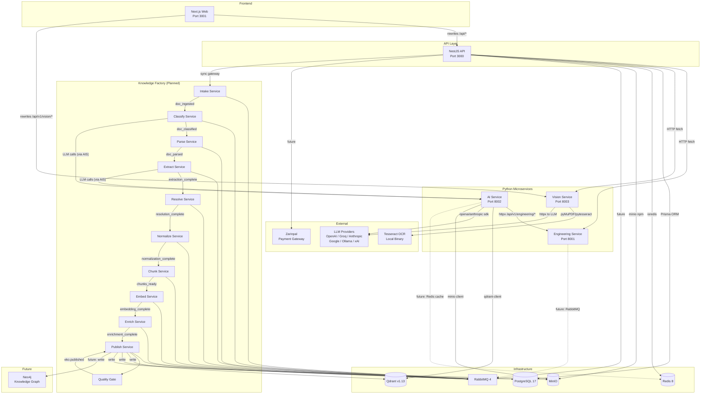
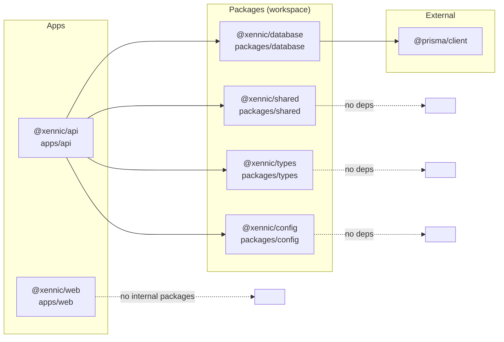
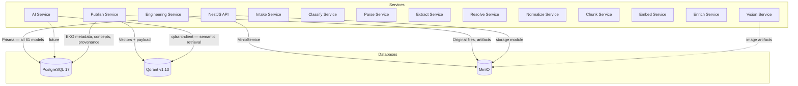
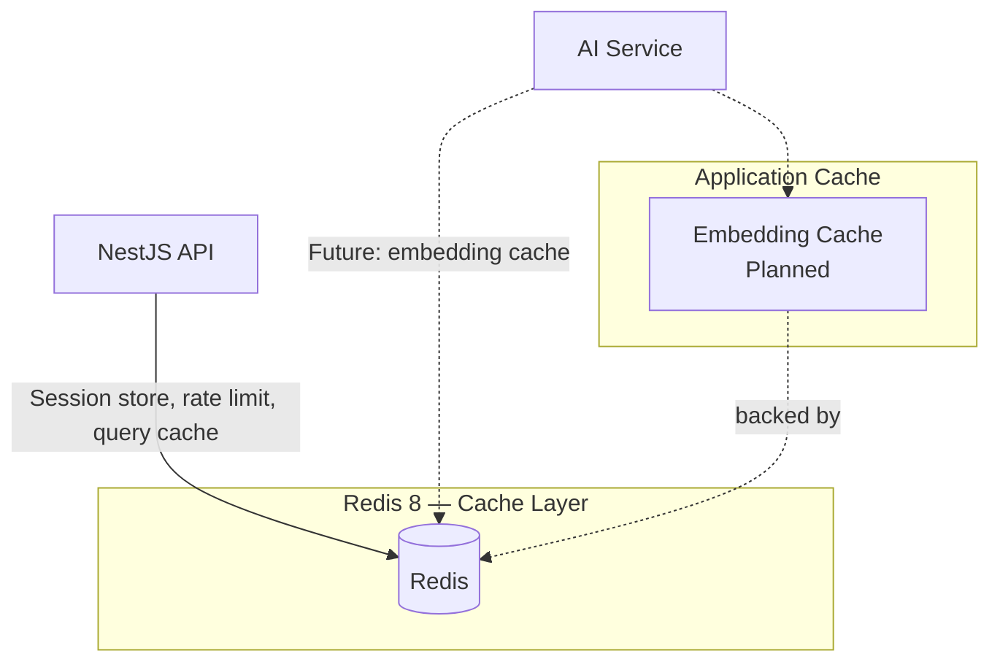
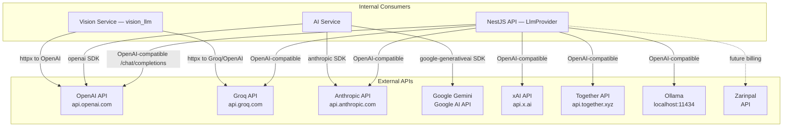
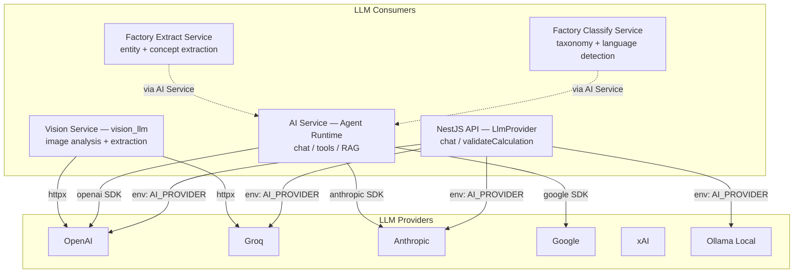
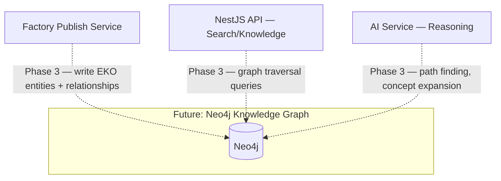
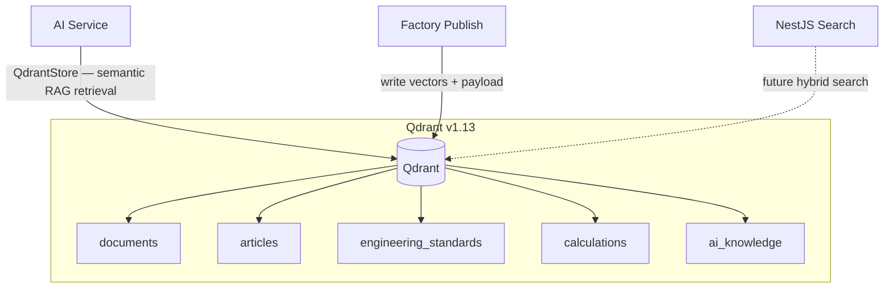

# 5. Dependency Map

> **Version:** 1.0.0 | **Status:** Living Document | **Last Updated:** Tir 1405 (June 2026)

This document exhaustively maps every dependency in the Xennic platform — service-to-service,
package-to-package, infrastructure, queue, cache, storage, external API, LLM, graph, and
vector database dependencies — with direction indicators and granularity verified against
the repository source code.

---

## 5.1 Service → Service Dependencies



### Direction Matrix

| Consumer | Supplier | Protocol | Status |
|----------|----------|----------|--------|
| `Next.js Web` | `NestJS API` | HTTP (rewrite `/api/*`) | Active |
| `Next.js Web` | `Vision Service` | HTTP (rewrite `/api/v1/vision/*`) | Active |
| `NestJS API` | `PostgreSQL` | Prisma ORM (TCP 5432) | Active |
| `NestJS API` | `Redis` | ioredis (TCP 6380) | Active |
| `NestJS API` | `MinIO` | `minio` npm package (TCP 9000) | Active |
| `NestJS API` | `Engineering Service` | HTTP fetch (TCP 8001) | Active |
| `NestJS API` | `Vision Service` | HTTP fetch (TCP 8003) | Active |
| `NestJS API` | `RabbitMQ` | Planned (TCP 5672) | Future |
| `NestJS API` | `Zarinpal` | HTTP (future billing) | Future |
| `NestJS API` | `AI Service` | Planned (AI_SERVICE_URL in env) | Future |
| `AI Service` | `Engineering Service` | HTTP httpx (TCP 8001) | Active |
| `AI Service` | `Qdrant` | `qdrant-client` gRPC/HTTP (TCP 6333) | Active |
| `AI Service` | `MinIO` | `minio` Python client (TCP 9000) | Active |
| `AI Service` | `LLM Providers` | OpenAI/Anthropic SDK (HTTPS) | Active |
| `AI Service` | `PostgreSQL` | Planned (DATABASE_URL in settings) | Future |
| `AI Service` | `Redis` | Planned (embedding cache) | Future |
| `Vision Service` | `Tesseract OCR` | `pytesseract` (local binary) | Active |
| `Vision Service` | `LLM Providers` | `httpx` to Groq/OpenAI | Active |
| `Engineering Service` | `RabbitMQ` | Planned | Future |

---

## 5.2 Package → Package Dependencies



### Package Dependency Table

| Package | Path | Depends On | External Dependencies |
|---------|------|------------|----------------------|
| `@xennic/api` | `apps/api` | `@xennic/database`, `@xennic/shared`, `@xennic/types`, `@xennic/config` | `@nestjs/common`, `@nestjs/core`, `@prisma/client`, `minio`, `zod`, `nodemailer`, `@fastify/multipart` |
| `@xennic/web` | `apps/web` | _(none — standalone)_ | `next`, `react`, `next-intl`, `@radix-ui/*`, `@tanstack/react-query`, `@tiptap/*`, `zustand`, `clsx`, `tailwind-merge`, `lucide-react`, `recharts`, `@react-pdf/renderer`, `katex`, `cmdk`, `class-variance-authority` |
| `@xennic/database` | `packages/database` | _(none — Prisma client wrapper)_ | `@prisma/client` |
| `@xennic/shared` | `packages/shared` | _(none)_ | _(none)_ |
| `@xennic/types` | `packages/types` | _(none)_ | _(none)_ |
| `@xennic/config` | `packages/config` | _(none)_ | _(none)_ |

### Turbo Pipeline Dependencies

| Task | Depends On |
|------|------------|
| `build` | `^build` (upstream packages build first) |
| `test` | `build` (must compile before testing) |
| `typecheck` | `^typecheck` (upstream packages typecheck first) |

The `@xennic/web` package has zero workspace dependencies — it is a fully standalone Next.js application.

---

## 5.3 Database Dependencies



### Database Access Matrix

| Service | PostgreSQL | Qdrant | MinIO | Redis | RabbitMQ |
|---------|-----------|--------|-------|-------|----------|
| NestJS API | ✅ Prisma (active) | ❌ | ✅ (active) | ✅ (active) | 🔜 (planned) |
| Engineering Service | ❌ (stateless) | ❌ | ❌ | ❌ | 🔜 (planned) |
| AI Service | 🔜 (planned) | ✅ (active) | ✅ (active) | 🔜 (planned) | ❌ |
| Vision Service | ❌ (stateless) | ❌ | 🔜 (planned) | ❌ | ❌ |
| Factory Intake | 🔜 | ❌ | 🔜 | ❌ | ✅ |
| Factory Classify | 🔜 | ❌ | 🔜 | ❌ | ✅ |
| Factory Parse | 🔜 | ❌ | 🔜 | ❌ | ✅ |
| Factory Extract | 🔜 | ❌ | 🔜 | ❌ | ✅ |
| Factory Resolve | 🔜 | ❌ | ❌ | ❌ | ✅ |
| Factory Normalize | 🔜 | ❌ | ❌ | ❌ | ✅ |
| Factory Chunk | 🔜 | ❌ | ❌ | ❌ | ✅ |
| Factory Embed | ❌ | ✅ (write) | ❌ | ❌ | ✅ |
| Factory Enrich | 🔜 | ❌ | ❌ | ❌ | ✅ |
| Factory Publish | ✅ (write) | ✅ (write) | ✅ (write) | ❌ | ✅ |

### Volume Persistence

| Data Store | Volume Name | Mount Path | Purpose |
|------------|-------------|------------|---------|
| PostgreSQL | `postgres_data` | `/var/lib/postgresql/data` | All relational data (61 models) |
| Redis | `redis_data` | `/data` | AOF persistence, cache, sessions |
| RabbitMQ | `rabbitmq_data` | `/var/lib/rabbitmq` | Message queue state, queues, exchanges |
| Qdrant | `qdrant_storage` | `/qdrant/storage` | Vector indices, payload storage |

---

## 5.4 Queue Dependencies

```mermaid
graph TB
  subgraph "RabbitMQ 4 — xennic.factory (topic)"
    EXCHANGE[xennic.factory exchange]
    DLX[xennic.factory.dlq\nDead Letter Exchange]
  end

  subgraph "Producers"
    API[NestJS API]
    IN[Intake Service]
    CL[Classify Service]
    PA[Parse Service]
    EX[Extract Service]
    RE[Resolve Service]
    NO[Normalize Service]
    CH[Chunk Service]
    EM[Embed Service]
    EN[Enrich Service]
    PU[Publish Service]
    QG[Quality Gate]
  end

  subgraph "Queues"
    Q_INTAKE[queue: factory.intake]
    Q_CLASSIFY[queue: factory.classify]
    Q_PARSE[queue: factory.parse]
    Q_EXTRACT[queue: factory.extract]
    Q_RESOLVE[queue: factory.resolve]
    Q_NORMALIZE[queue: factory.normalize]
    Q_CHUNK[queue: factory.chunk]
    Q_EMBED[queue: factory.embed]
    Q_ENRICH[queue: factory.enrich]
    Q_PUBLISH[queue: factory.publish]
    Q_DLQ[queue: factory.dlq]
  end

  API -->|"doc.uploaded"| EXCHANGE
  IN -->|"doc.ingested"| EXCHANGE
  CL -->|"doc.classified"| EXCHANGE
  PA -->|"doc.parsed"| EXCHANGE
  EX -->|"extraction.complete"| EXCHANGE
  RE -->|"resolution.complete"| EXCHANGE
  NO -->|"normalization.complete"| EXCHANGE
  CH -->|"chunks.ready"| EXCHANGE
  EM -->|"embedding.complete"| EXCHANGE
  EN -->|"enrichment.complete"| EXCHANGE
  PU -->|"eko.published / eko.failed"| EXCHANGE
  QG -->|"quality.escalated"| EXCHANGE

  EXCHANGE --> Q_INTAKE --> IN
  EXCHANGE --> Q_CLASSIFY --> CL
  EXCHANGE --> Q_PARSE --> PA
  EXCHANGE --> Q_EXTRACT --> EX
  EXCHANGE --> Q_RESOLVE --> RE
  EXCHANGE --> Q_NORMALIZE --> NO
  EXCHANGE --> Q_CHUNK --> CH
  EXCHANGE --> Q_EMBED --> EM
  EXCHANGE --> Q_ENRICH --> EN
  EXCHANGE --> Q_PUBLISH --> PU

  IN -->|"reject (3 retries)"| DLX
  CL -->|"reject (3 retries)"| DLX
  PA -->|"reject (3 retries)"| DLX
  EX -->|"reject (3 retries)"| DLX
  RE -->|"reject (3 retries)"| DLX
  NO -->|"reject (3 retries)"| DLX
  CH -->|"reject (3 retries)"| DLX
  EM -->|"reject (3 retries)"| DLX
  EN -->|"reject (3 retries)"| DLX
  PU -->|"reject (3 retries)"| DLX

  DLX --> Q_DLQ
```



### Queue Topology

| Property | Value |
|----------|-------|
| Exchange Name | `xennic.factory` |
| Exchange Type | `topic` |
| Routing Key Pattern | `factory.{service}.{event}.v{version}` |
| Delivery | Publisher confirms (at-least-once) |
| Consumer Ack | Manual |
| Retry | Exponential backoff, max 3 |
| Dead Letter Exchange | `xennic.factory.dlq` |
| DLQ TTL | 7 days (manual replay or discard) |
| One Queue Per Service | Competing consumers pattern |

### Event Contracts

| Event | Producer | Consumer(s) |
|-------|----------|-------------|
| `doc.uploaded` | NestJS API | Intake Service |
| `doc.ingested` | Intake Service | Classify Service |
| `doc.classified` | Classify Service | Parse Service |
| `doc.parsed` | Parse Service | Extract Service |
| `extraction.complete` | Extract Service | Resolve Service |
| `resolution.complete` | Resolve Service | Normalize Service |
| `normalization.complete` | Normalize Service | Chunk Service |
| `chunks.ready` | Chunk Service | Embed Service |
| `embedding.complete` | Embed Service | Enrich Service |
| `enrichment.complete` | Enrich Service | Publish Service |
| `eko.published` | Publish Service | NestJS API, Reasoning Runtime |
| `eko.failed` | Any factory service | NestJS API (logging) |
| `quality.escalated` | Quality Gate | Human Review Service |
| `review.completed` | Human Review | Publish Service |

---

## 5.5 Cache Dependencies



| Cache Consumer | Purpose | Status |
|----------------|---------|--------|
| NestJS API | Session storage (JWT blacklist, refresh tokens) | Active |
| NestJS API | Rate limiting counter store | Active |
| NestJS API | Throttler storage (`@nestjs/throttler` with Redis) | Active |
| NestJS API | Query result caching (future) | Future |
| AI Service | Embedding vector cache (avoid re-embedding) | Future |
| AI Service | LLM response cache (semantic caching) | Future |

### Redis Configuration

| Setting | Value |
|---------|-------|
| Image | `redis:8-alpine` |
| Port | 6380 (host) → 6379 (container) |
| Persistence | AOF (`--appendonly yes`) |
| Password | `${REDIS_PASSWORD}` |
| Volume | `redis_data:/data` |

---

## 5.6 Storage Dependencies

```mermaid
graph TB
  subgraph "Storage Layer"
    MI[(MinIO\nS3-compatible\nPort 9000)]
    PG[(PostgreSQL 17\nPort 5432)]
    QD[(Qdrant v1.13\nPort 6333/6334)]
  end

  subgraph "Buckets / Collections"
    MI_BUCKETS[public, private, reports,\ndocuments, engineering, ai,\n{workspace}-documents]
    PG_MODELS[61 models across\nIdentity, Workspace, Engineering,\nKnowledge, AI, Billing, etc.]
    QD_COLLECTIONS[documents, articles,\nengineering_standards,\ncalculations, ai_knowledge]
  end

  MI --- MI_BUCKETS
  PG --- PG_MODELS
  QD --- QD_COLLECTIONS

  API[NestJS API] -->|"MinioService"| MI
  API[NestJS API] -->|"Prisma"| PG

  AIS[AI Service] -->|"MinIOClient"| MI
  AIS[AI Service] -->|"QdrantStore"| QD

  VS[Vision Service] -.->|"future"| MI

  PU[Publish Service] -->|"write"| MI
  PU[Publish Service] -->|"write"| PG
  PU[Publish Service] -->|"write"| QD
```

### MinIO Bucket Structure

| Bucket | Purpose | Created By |
|--------|---------|------------|
| `public` | Publicly accessible files | `MinioService.ensureAllBuckets()` |
| `private` | Private user files | `MinioService.ensureAllBuckets()` |
| `reports` | Generated reports | `MinioService.ensureAllBuckets()` |
| `documents` | Workspace documents | `MinioService.ensureAllBuckets()` |
| `engineering` | Engineering calculation artifacts | `MinioService.ensureAllBuckets()` |
| `ai` | AI-generated content | `MinioService.ensureAllBuckets()` |
| `{workspace_id}-documents` | Per-workspace document store | `MinIOClient.ensure_bucket()` |

### PostgreSQL Schema Overview

61 models across domains — see `prisma/schema.prisma` for the full schema.

### Qdrant Collection Naming

```
xennic_{workspace_id}_{collection}
```

| Collection | Vector Size | Distance | Consumers |
|------------|-------------|----------|-----------|
| `documents` | 1536 | Cosine | AI Service, Factory Embed/Publish |
| `articles` | 1536 | Cosine | AI Service, Factory Embed/Publish |
| `engineering_standards` | 1536 | Cosine | AI Service, Factory Embed/Publish |
| `calculations` | 1536 | Cosine | AI Service, Factory Embed/Publish |
| `ai_knowledge` | 1536 | Cosine | AI Service, Factory Embed/Publish |

---

## 5.7 External API Dependencies



### LLM Provider Configuration

| Provider | NestJS API | AI Service | Vision Service |
|----------|-----------|------------|----------------|
| OpenAI | ✅ (`gpt-4o-mini`) | ✅ (`openai` SDK) | ✅ (httpx) |
| Groq | ✅ (`llama-3.1-8b-instant`) | ❌ | ✅ (httpx) |
| Anthropic | ✅ (`claude-3-haiku`) | ✅ (`anthropic` SDK) | ❌ |
| Google Gemini | ❌ | ✅ (`google-generativeai` SDK) | ❌ |
| xAI / Grok | ✅ (`grok-3`) | ❌ | ❌ |
| Together | ✅ (`Llama-3.3-70B`) | ❌ | ❌ |
| Ollama | ✅ (`llama3.2`, localhost) | ❌ | ❌ |
| Mistral | ✅ (`mistral-small-latest`) | ❌ | ❌ |
| OpenRouter | ✅ (`Llama-3.3-70B free`) | ❌ | ❌ |
| Fallback / Mock | ✅ (when no API key) | ❌ | ❌ |

### Non-LLM External APIs

| Consumer | External API | Purpose | Status |
|----------|-------------|---------|--------|
| NestJS API | Zarinpal | Payment gateway for billing | Future |
| Vision Service | Tesseract OCR | Local binary (`pytesseract`) | Active |
| Vision Service | PaddleOCR | Optional Chinese OCR | Optional |

---

## 5.8 LLM Dependencies



### LLM Usage by Feature

| Feature | Consumer | Provider(s) | Model(s) |
|---------|----------|-------------|----------|
| AI Chat Assistant | NestJS API `LlmProvider` | Configurable via `AI_PROVIDER` env | `gpt-4o-mini`, `llama-3.1-8b`, `claude-3-haiku`, `grok-3` |
| Calculation Validation | NestJS API `AiService.validateCalculation()` | Same as AI Chat | Same as AI Chat |
| AI Agent (tool-using) | AI Service (Python) | OpenAI, Anthropic, Google | `gpt-4o-mini`, `claude-3-5-sonnet`, `gemini-1.5-pro` |
| Vision Analysis | Vision Service `vision_llm.py` | Groq, OpenAI | Vision-capable models |
| Document Classification | Factory Classify Service | Via AI Service (future) | TBD |
| Entity Extraction | Factory Extract Service | Via AI Service (future) | TBD |

### Key Architectural Rule

```
AI agents in the AI Service MUST use CalculationTool → Engineering Service for ALL
engineering calculations. AI agents are NEVER allowed to perform calculations themselves.
```

---

## 5.9 Graph Database (Future)



| Property | Detail |
|----------|--------|
| Technology | Neo4j (community or AuraDB) |
| Phase | Phase 3 of XKF Roadmap |
| Contents | Entities, concepts, relationships extracted from documents |
| Query Patterns | Graph traversal, path finding, concept expansion, influence analysis |
| Consumers | Factory Publish (write), NestJS Search (read), AI Service Reasoning (read) |
| Multi-tenancy | Per-workspace database or graph prefix |

---

## 5.10 Vector Database



| Collection | Vector Dim | Distance | Write Path | Read Path |
|-----------|-----------|----------|------------|-----------|
| `documents` | 1536 | Cosine | Factory Embed → Publish | AI Service RAG |
| `articles` | 1536 | Cosine | Factory Embed → Publish | AI Service RAG |
| `engineering_standards` | 1536 | Cosine | Factory Embed → Publish | AI Service RAG |
| `calculations` | 1536 | Cosine | Factory Embed → Publish | AI Service RAG |
| `ai_knowledge` | 1536 | Cosine | AI Service Embed | AI Service RAG |

### Qdrant Configuration

| Property | Value |
|----------|-------|
| Image | `qdrant/qdrant:v1.13.0` |
| HTTP Port | 6333 |
| gRPC Port | 6334 |
| Storage | `qdrant_storage:/qdrant/storage` |
| Client (NestJS) | Not yet integrated |
| Client (AI Service) | `qdrant-client` Python SDK (async) |
| Multi-tenancy | Collection per workspace: `xennic_{workspace_id}_{collection}` |

---

## 5.11 Complete Dependency Matrix

| Dependency Type | From | To | Protocol/Interface | Direction | Status |
|----------------|------|----|--------------------|-----------|--------|
| **Service** | Next.js Web | NestJS API | HTTP rewrite | `→` | Active |
| **Service** | Next.js Web | Vision Service | HTTP rewrite | `→` | Active |
| **Service** | NestJS API | Engineering Service | HTTP fetch | `→` | Active |
| **Service** | NestJS API | Vision Service | HTTP fetch | `→` | Active |
| **Service** | AI Service | Engineering Service | HTTP httpx | `→` | Active |
| **Service** | AI Service | LLM Providers | OpenAI/Anthropic SDK | `→` | Active |
| **Service** | Vision Service | LLM Providers | httpx | `→` | Active |
| **Service** | Factory Classify | AI Service | gRPC/HTTP (future) | `→` | Future |
| **Service** | Factory Extract | AI Service | gRPC/HTTP (future) | `→` | Future |
| **Package** | `@xennic/api` | `@xennic/database` | workspace:* | `→` | Active |
| **Package** | `@xennic/api` | `@xennic/shared` | workspace:* | `→` | Active |
| **Package** | `@xennic/api` | `@xennic/types` | workspace:* | `→` | Active |
| **Package** | `@xennic/api` | `@xennic/config` | workspace:* | `→` | Active |
| **Package** | `@xennic/database` | `@prisma/client` | npm | `→` | Active |
| **Database** | NestJS API | PostgreSQL | Prisma ORM (TCP 5432) | `→` | Active |
| **Database** | AI Service | Qdrant | gRPC/HTTP (TCP 6333) | `→` | Active |
| **Database** | AI Service | MinIO | S3 (TCP 9000) | `→` | Active |
| **Database** | Factory Publish | PostgreSQL | SQL | `→` | Future |
| **Database** | Factory Publish | Qdrant | gRPC | `→` | Future |
| **Database** | Factory Publish | MinIO | S3 | `→` | Future |
| **Database** | NestJS API | MinIO | S3 (minio npm) | `→` | Active |
| **Database** | NestJS API | Redis | ioredis (TCP 6380) | `→` | Active |
| **Queue** | NestJS API | RabbitMQ | AMQP (TCP 5672) | `→` | Future |
| **Queue** | Factory Services | RabbitMQ | AMQP | `↔` | Future |
| **Queue** | Factory Services | DLQ | AMQP | `→` | Future |
| **Cache** | NestJS API | Redis | ioredis | `→` | Active |
| **Cache** | AI Service | Redis | future | `→` | Future |
| **Storage** | NestJS API | MinIO | S3 | `→` | Active |
| **Storage** | AI Service | MinIO | S3 | `→` | Active |
| **Storage** | Vision Service | MinIO | S3 | `→` | Future |
| **Storage** | Factory Services | MinIO | S3 | `→` | Future |
| **External** | NestJS API | Zarinpal | HTTPS | `→` | Future |
| **External** | Vision Service | Tesseract | Local binary | `→` | Active |
| **External** | AI Service | OpenAI/Groq/etc | HTTPS | `→` | Active |
| **Graph** | Factory Publish | Neo4j | Bolt (TCP 7687) | `→` | Future |
| **Graph** | NestJS API | Neo4j | Bolt | `→` | Future |
| **Vector** | AI Service | Qdrant | gRPC | `→` | Active |
| **Vector** | Factory Publish | Qdrant | gRPC | `→` | Future |
