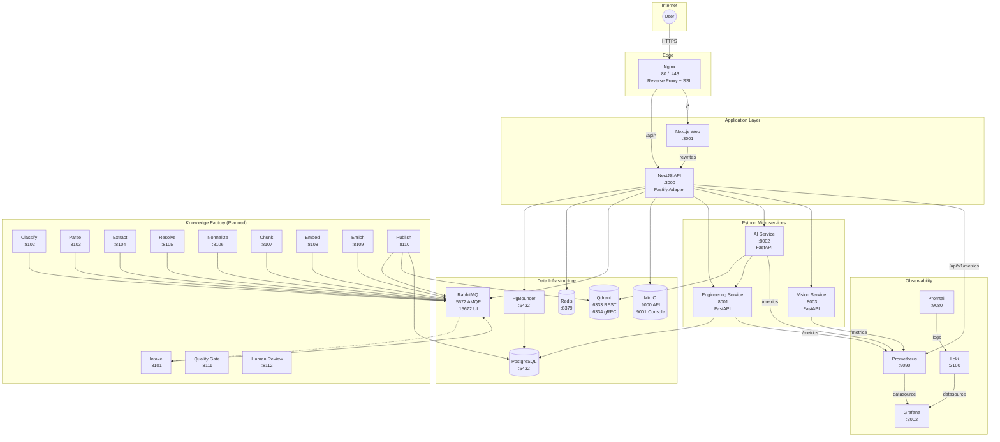
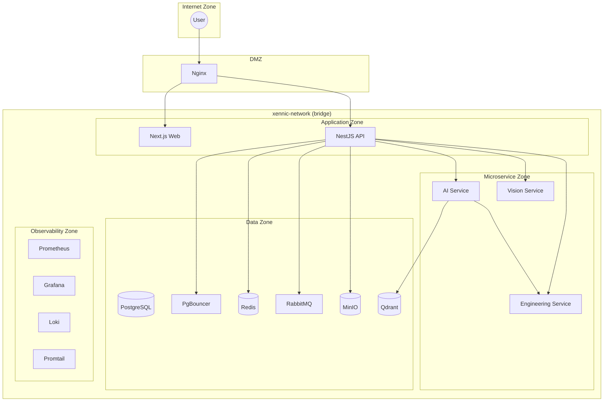
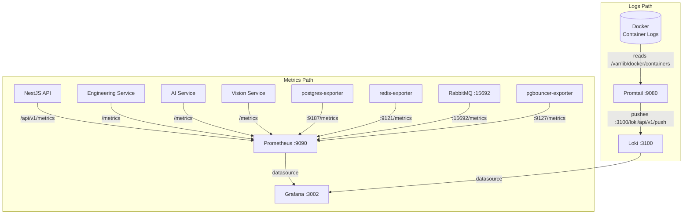

# 6. Runtime Topology

> **Version:** 1.0.0 | **Status:** Living Document | **Last Updated:** Tir 1405 (June 2026)

## Production Runtime Topology



---

## 1. Docker Compose Architecture

The platform uses three Docker Compose files:

### 1.1 Base Stack (Development)

**File:** `infrastructure/docker/compose/base/docker-compose.yml`

| Service | Image | Internal Port | Host Port |
|---------|-------|---------------|-----------|
| PostgreSQL | `postgres:17-alpine` | 5432 | 5432 |
| PgBouncer | `edoburu/pgbouncer:latest` | 6432 | 6432 |
| Redis | `redis:8-alpine` | 6379 | 6380 |
| RabbitMQ | `rabbitmq:4-management` | 5672 / 15672 | 5672 / 15672 |
| Engineering Service | Build from `workspace/services/engineering-service` | 8001 | 8001 |
| AI Service | Build from `workspace/services/ai-service` | 8002 | 8002 |
| Vision Service | Build from `workspace/services/vision-service` | 8003 | 8003 |

The base stack does not define `networks:` per-service; services without explicit networks use the default bridge. PgBouncer, Engineering, AI, and Vision services explicitly join `xennic-network`.

Started via:
```bash
infrastructure/docker/scripts/up.sh
# or:
docker compose --env-file ../.env -f ../compose/base/docker-compose.yml up -d
```

### 1.2 Production Stack

**File:** `infrastructure/docker/compose/production/docker-compose.yml`

Includes all base services plus:

| Service | Image | Internal Port | Host Port |
|---------|-------|---------------|-----------|
| Nginx | `nginx:1.27-alpine` | 80 / 443 | 80 / 443 |
| NestJS API | Build from `apps/api/Dockerfile` | 3000 | 3000 |
| Next.js Web | Build from `apps/web/Dockerfile` | 3001 | 3001 |
| MinIO | `minio/minio:latest` | 9000 / 9001 | 9000 / 9001 |
| Prometheus | `prom/prometheus:v2.54.1` | 9090 | 9090 |
| Grafana | `grafana/grafana:11.3.0` | 3000 | 3002 |
| Loki | `grafana/loki:3.1.1` | 3100 | 3100 |
| Promtail | `grafana/promtail:3.1.1` | 9080 | — (unpublished) |

All services in the production stack join the `xennic-network` bridge network.

### 1.3 Vector Database (Standalone)

**File:** `workspace/docker-compose.yml`

| Service | Image | Ports | Volume |
|---------|-------|-------|--------|
| Qdrant | `qdrant/qdrant:v1.13.0` | 6333 (REST), 6334 (gRPC) | `qdrant_storage` |

Runs independently on the same `xennic-network` bridge network.

---

## 2. Port Allocation Table

| Service | Port(s) | Protocol | Scope | Notes |
|---------|---------|----------|-------|-------|
| Nginx HTTP | 80 | TCP | Public | HTTP → HTTPS redirect |
| Nginx HTTPS | 443 | TCP | Public | TLS termination |
| NestJS API | 3000 | TCP | Internal (Nginx) | Fastify adapter |
| Next.js Web | 3001 | TCP | Internal (Nginx) | Standalone output |
| Grafana | 3002 | TCP | Internal (Nginx) | Mapped from container :3000 |
| Engineering Service | 8001 | TCP | Internal | FastAPI |
| AI Service | 8002 | TCP | Internal | FastAPI |
| Vision Service | 8003 | TCP | Internal | FastAPI |
| Intake Service | 8101 | HTTP/gRPC | Internal | Planned Knowledge Factory |
| Classify Service | 8102 | HTTP/gRPC | Internal | Planned Knowledge Factory |
| Parse Service | 8103 | HTTP/gRPC | Internal | Planned Knowledge Factory |
| Extract Service | 8104 | HTTP/gRPC | Internal | Planned Knowledge Factory |
| Resolve Service | 8105 | HTTP/gRPC | Internal | Planned Knowledge Factory |
| Normalize Service | 8106 | HTTP/gRPC | Internal | Planned Knowledge Factory |
| Chunk Service | 8107 | HTTP/gRPC | Internal | Planned Knowledge Factory |
| Embed Service | 8108 | HTTP/gRPC | Internal | Planned Knowledge Factory |
| Enrich Service | 8109 | HTTP/gRPC | Internal | Planned Knowledge Factory |
| Publish Service | 8110 | HTTP/gRPC | Internal | Planned Knowledge Factory |
| Quality Gate | 8111 | HTTP | Internal | Planned |
| Human Review API | 8112 | HTTP | Internal (via NestJS) | Planned |
| PostgreSQL | 5432 | TCP | Internal | Direct access (not through PgBouncer) |
| PgBouncer | 6432 | TCP | Internal | Connection pooler |
| Redis (container) | 6379 | TCP | Internal | Base stack default |
| Redis (host) | 6380 | TCP | Host | Mapped from container 6379 in base |
| RabbitMQ AMQP | 5672 | TCP | Internal | Message broker |
| RabbitMQ Management | 15672 | TCP | Internal | Management UI |
| MinIO API | 9000 | TCP | Internal | S3-compatible API |
| MinIO Console | 9001 | TCP | Internal | Web admin console |
| Qdrant REST | 6333 | TCP | Internal | Vector DB HTTP API |
| Qdrant gRPC | 6334 | TCP | Internal | Vector DB gRPC API |
| Prometheus | 9090 | TCP | Internal | Metrics storage |
| Loki | 3100 | TCP | Internal | Log aggregation |
| Promtail | 9080 | TCP | Internal | Log collector (unpublished) |

**Port allocation rationale:**

- **3000–3002**: Application servers (API, Web, Grafana)
- **8001–8112**: Python microservices (FastAPI)
- **5432–6432**: Database infrastructure
- **6333–6380**: Data stores (Qdrant, Redis)
- **9000–9090**: Infrastructure services (MinIO, Prometheus)
- **15672–15692**: Management interfaces

---

## 3. Networks

### 3.1 Primary Network



### 3.2 Network Definition

- **Name:** `xennic-network`
- **Driver:** `bridge`
- **Scope:** All services in both base and production compose files

### 3.3 Network Security Zones

| Zone | Services | Access | Description |
|------|----------|--------|-------------|
| **Internet** | — | Public | External user traffic |
| **DMZ** | Nginx | Public (:80/:443) | Reverse proxy, SSL termination |
| **Application** | Web, API | Nginx only | Core application services |
| **Microservice** | Engineering, AI, Vision | API only | Python compute services |
| **Data** | PostgreSQL, PgBouncer, Redis, RabbitMQ, MinIO, Qdrant | Application + Microservice | Data stores |
| **Observability** | Prometheus, Grafana, Loki, Promtail | API + Microservice | Monitoring infrastructure |

### 3.4 Future Knowledge Factory Network

The planned Knowledge Factory services (ports 8101–8112) will reside in a new **Factory Zone** within the same `xennic-network`, with access restricted to RabbitMQ (event bus), PostgreSQL, Qdrant, and MinIO. No external port exposure.

---

## 4. Volumes

| Volume | Mount Point | Service(s) | Persistence |
|--------|-------------|------------|-------------|
| `postgres_data` | `/var/lib/postgresql/data` | PostgreSQL | Database files |
| `redis_data` | `/data` | Redis | AOF + RDB snapshots |
| `rabbitmq_data` | `/var/lib/rabbitmq` | RabbitMQ | Message store |
| `prometheus_data` | `/prometheus` | Prometheus | TSDB blocks (15d retention) |
| `grafana_data` | `/var/lib/grafana` | Grafana | Dashboards, plugins, settings |
| `loki_data` | `/loki` | Loki | Log chunks + index |
| `minio_data` | `/data` | MinIO | Object storage |
| `web_next_static` | — | Nginx (mounted) | Next.js static export |
| `qdrant_storage` | `/qdrant/storage` | Qdrant | Vector index + payload |

### Volume Configuration

- **Driver:** `local` (default) for all volumes
- **Backup:** `infrastructure/backup/backup.sh` — `pg_dump` custom format for PostgreSQL, MinIO `mc mirror` for objects
- **Retention:** Default Docker volume lifecycle; production backups via cron (see `infrastructure/backup/`)

---

## 5. Secrets

### 5.1 Docker Secrets (Production)

| Secret | Source File | Mount Path | Used By |
|--------|-------------|------------|---------|
| `jwt_private_key` | `infrastructure/docker/secrets/jwtRS256.key` | `/run/secrets/jwt_private_key` | NestJS API |
| `jwt_public_key` | `infrastructure/docker/secrets/jwtRS256.key.pub` | `/run/secrets/jwt_public_key` | NestJS API |

JWT keys are RSA 4096-bit PEM pairs, generated with:
```bash
ssh-keygen -t rsa -b 4096 -m PEM -f jwtRS256.key
openssl rsa -in jwtRS256.key -pubout > jwtRS256.key.pub
```

### 5.2 Environment Variable Secrets

| Variable | Source | Used By | Purpose |
|----------|--------|---------|---------|
| `POSTGRES_PASSWORD` | `.env` | PostgreSQL, PgBouncer, all services | Database authentication |
| `REDIS_PASSWORD` | `.env` | Redis, API | Redis AUTH |
| `RABBITMQ_DEFAULT_PASS` | `.env` | RabbitMQ, API | AMQP credentials |
| `MINIO_ROOT_PASSWORD` | `.env` | MinIO, API | S3 credentials |
| `GROQ_API_KEY` | `.env` | AI Service, Vision Service | LLM provider |
| `OPENAI_API_KEY` | `.env` | AI Service, Vision Service | LLM provider |
| `ANTHROPIC_API_KEY` | `.env` | AI Service | LLM provider |
| `GOOGLE_API_KEY` | `.env` | AI Service | LLM provider |

### 5.3 Secret Management

- **Dev:** Static values in `infrastructure/docker/.env`
- **Production:** `.env.production.example` documents all required variables; production `.env` is in `.gitignore`
- **Rotation:** Manual process; no automated rotation currently

---

## 6. Certificates

### 6.1 Self-Signed (Development)

| File | Location | Purpose |
|------|----------|---------|
| `fullchain.pem` | `infrastructure/nginx/ssl/fullchain.pem` | SSL certificate (self-signed) |
| `privkey.pem` | `infrastructure/nginx/ssl/privkey.pem` | SSL private key |

### 6.2 Production SSL (Planned)

- **Provider:** Let's Encrypt (planned, not yet configured)
- **Auto-renewal:** Certbot with `/.well-known/acme-challenge/` location already configured in Nginx
- **Path:** Same `infrastructure/nginx/ssl/` directory

### 6.3 Nginx SSL Configuration

```nginx
ssl_protocols TLSv1.2 TLSv1.3;
ssl_ciphers ECDHE-ECDSA-AES128-GCM-SHA256:ECDHE-RSA-AES128-GCM-SHA256:...;
ssl_prefer_server_ciphers off;
ssl_session_cache shared:SSL:10m;
ssl_session_timeout 1d;
ssl_session_tickets off;
ssl_stapling on;
ssl_stapling_verify on;
```

---

## 7. Monitoring

### 7.1 Monitoring Flow



### 7.2 Prometheus Scrape Targets

Configured in `infrastructure/monitoring/prometheus/prometheus.yml`:

| Job | Target | Metrics Path | Scrape Interval |
|-----|--------|-------------|-----------------|
| `api` | `api:3000` | `/api/v1/metrics` | 15s |
| `engineering-service` | `engineering-service:8001` | `/metrics` | 15s |
| `ai-service` | `ai-service:8002` | `/metrics` | 15s |
| `vision-service` | `vision-service:8003` | `/metrics` | 15s |
| `postgres` | `postgres-exporter:9187` | `/metrics` | 15s |
| `redis` | `redis-exporter:9121` | `/metrics` | 15s |
| `rabbitmq` | `rabbitmq:15692` | `/metrics` | 15s |
| `pgbouncer` | `pgbouncer-exporter:9127` | `/metrics` | 15s |

**Note:** `postgres-exporter`, `redis-exporter`, and `pgbouncer-exporter` are referenced in the Prometheus config but are not defined in the current docker-compose files (planned additions).

### 7.3 Grafana Datasources (Auto-Provisioned)

Configured in `infrastructure/monitoring/grafana/provisioning/datasources/`:

| Datasource | Type | URL | Default |
|------------|------|-----|---------|
| Prometheus | prometheus | `http://prometheus:9090` | Yes |
| Loki | loki | `http://loki:3100` | No |

Dashboard provisioning configured at `infrastructure/monitoring/grafana/provisioning/dashboards/dashboard.yml`:
- Provider: `default`
- Folder: `/var/lib/grafana/dashboards`
- Update interval: 30s

### 7.4 Loki Log Aggregation

Configured in `infrastructure/monitoring/loki/loki.yml`:

| Setting | Value |
|---------|-------|
| Auth | Disabled |
| HTTP port | 3100 |
| Storage | Filesystem (`/loki/chunks`, `/loki/rules`) |
| Schema | v11, boltdb-shipper |
| Ingestion rate | 10 MB/s |
| Ingestion burst | 20 MB |
| Reject old samples | Yes (max age 168h) |
| Replication factor | 1 |

### 7.5 Promtail Docker Log Discovery

Configured in `infrastructure/monitoring/promtail/promtail.yml`:

- **Discovery:** Docker service discovery via `/var/run/docker.sock`
- **Refresh interval:** 15s
- **Labels attached:**
  - `container` — Docker container name
  - `logstream` — stdout/stderr
  - `service` — Docker Compose service name
- **Push target:** `http://loki:3100/loki/api/v1/push`
- **Port:** 9080 (HTTP), gRPC disabled

---

## 8. Tracing

### 8.1 OpenTelemetry

- `@opentelemetry/api` exists in `pnpm-lock.yaml` as a dependency (via NestJS/Next.js transitive dependencies)
- **No OpenTelemetry instrumentation is currently implemented** in any application code
- No trace exporter, collector, or sampling configuration exists

### 8.2 Planned Distributed Tracing

| Aspect | Target |
|--------|--------|
| **Backend** | NestJS auto-instrumentation (`@opentelemetry/instrumentation-http`, `@opentelemetry/instrumentation-nestjs-core`) |
| **Python services** | OpenTelemetry Python SDK with FastAPI instrumentation |
| **Exporter** | OTLP gRPC (planned: send to a self-hosted collector or Grafana Tempo) |
| **Trace context propagation** | W3C TraceContext (traceparent header) across HTTP and RabbitMQ |
| **Visualization** | Grafana Tempo (planned) or Jaeger (alternative) |
| **Status** | **Not implemented** — dependency available, no instrumentation code |

### 8.3 Trace Flow (Planned)

```
Browser → Nginx → NestJS API (traceparent injected)
  ├──→ Engineering Service (HTTP)
  ├──→ AI Service (HTTP → Qdrant)
  └──→ Vision Service (HTTP)
RabbitMQ → Knowledge Factory services → span context via message headers
```

---

## 9. Logging

### 9.1 Strategy

All services use JSON-formatted structured logging with the `json-file` Docker logging driver.

### 9.2 Docker Logging Configuration

All services use:
```yaml
logging:
  driver: "json-file"
  options:
    max-size: "10m"
    max-file: "3"
```

### 9.3 Nginx Logging

Nginx uses a custom JSON log format via `infrastructure/nginx/nginx.conf`:

```nginx
log_format json escape=json '{'
  '"timestamp":"$time_iso8601",'
  '"remote_addr":"$remote_addr",'
  '"request":"$request",'
  '"status":$status,'
  '"body_bytes":$body_bytes_sent,'
  '"request_time":$request_time,'
  '"referrer":"$http_referer",'
  '"user_agent":"$http_user_agent",'
  '"x_request_id":"$http_x_request_id"'
'}';
```

### 9.4 Log Pipeline

```
Docker Container (json-file driver)
  → /var/lib/docker/containers/*.log
    → Promtail (service discovery + label attachment)
      → Loki (push API :3100/loki/api/v1/push)
        → Grafana (LogQL queries)
```

### 9.5 Log Retention Policies

| Component | Retention | Mechanism |
|-----------|-----------|-----------|
| Docker (per container) | 3 files × 10 MB | `max-file=3`, `max-size=10m` |
| Loki | 7 days (reject older samples) | `reject_old_samples_max_age: 168h` |
| Loki storage | Configurable via `limits_config` | Filesystem in `/loki` volume |
| Planned | 30-day hot, 90-day cold | S3/GCS backend for long-term |

---

## 10. Scaling

### 10.1 Current Architecture

| Aspect | Approach |
|--------|----------|
| **Model** | Single-node Docker Compose |
| **Direction** | Vertical scaling only |
| **Orchestration** | Docker Compose on a single VPS/VM |
| **Networking** | Single bridge network (`xennic-network`) |
| **Stateless services** | API, Web, AI Service, Engineering Service, Vision Service |
| **Stateful services** | PostgreSQL, Redis, RabbitMQ, MinIO, Qdrant |

### 10.2 Vertical Scaling Limits

| Service | Bottleneck | Limit |
|---------|------------|-------|
| NestJS API | CPU / Event Loop | 1 Node.js process |
| Next.js Web | CPU / Memory | 1 Node.js process |
| Engineering Service | CPU (calculations) | 1 Python process |
| AI Service | I/O (LLM calls) | Async concurrency |
| Vision Service | Memory (OCR) | 2 GB container limit |
| PostgreSQL | CPU / RAM / Disk I/O | Single instance |
| Qdrant | RAM (vector index) | Memory-mapped files |
| Redis | RAM | Single instance |
| RabbitMQ | Disk I/O (message store) | Single instance |

### 10.3 Planned Horizontal Scaling

| Phase | Orchestrator | Features | Status |
|-------|-------------|----------|--------|
| **Alpha** | Docker Compose (single node) | All services, vertical scaling | Current |
| **Beta** | Docker Swarm | Service replicas, per-service scaling | Planned |
| **GA** | Kubernetes | HPA, node pools, multi-region | Planned |

### 10.4 Stateless Service Scaling Targets

| Service | Replicas (Beta) | HPA Metric (GA) |
|---------|-----------------|-----------------|
| NestJS API | 2–4 | CPU > 70%, request latency |
| Next.js Web | 2–3 | CPU > 70% |
| Engineering Service | 2–3 | CPU > 70%, queue depth |
| AI Service | 2–4 | Request latency, queue depth |
| Vision Service | 1–2 | Memory > 80%, queue depth |

### 10.5 Stateful Service Scaling Approach

| Service | Beta Approach | GA Approach |
|---------|--------------|-------------|
| PostgreSQL | Read replicas + PgBouncer pooling | Patroni cluster |
| Redis | Redis Sentinel | Redis Cluster |
| RabbitMQ | Clustered deployment | Clustered + Federation |
| MinIO | Distributed mode (erasure coding) | Distributed multi-node |
| Qdrant | Single node with more RAM | Distributed cluster |

---

## Appendix: Compose File Locations

| Stack | File |
|-------|------|
| Development (base) | `infrastructure/docker/compose/base/docker-compose.yml` |
| Production | `infrastructure/docker/compose/production/docker-compose.yml` |
| Qdrant (standalone) | `workspace/docker-compose.yml` |
| Environment (dev) | `infrastructure/docker/.env` |
| Environment (prod example) | `infrastructure/docker/compose/production/.env.production.example` |

## Appendix: Startup Scripts

| Script | Location |
|--------|----------|
| Start base stack | `infrastructure/docker/scripts/up.sh` |
| Stop base stack | `infrastructure/docker/scripts/down.sh` |
| Reset stack | `infrastructure/docker/scripts/reset.sh` |
| Database backup | `infrastructure/backup/backup.sh` |
| Database restore | `infrastructure/backup/restore.sh` |
| Backup verification | `infrastructure/backup/verify.sh` |
