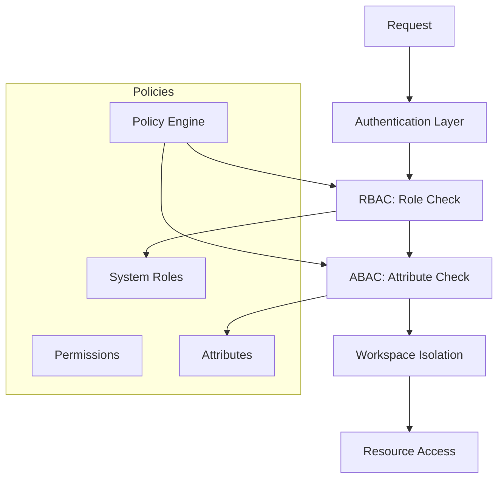

# کنترل دسترسی — Access Control

**نسخه**: ۱.۰.۰ | **وضعیت**: Approved | **آخرین بروزرسانی**: خرداد ۱۴۰۵

---

## Purpose

مدل کنترل دسترسی پلتفرم Xennic شامل RBAC و ABAC را توصیف می‌کند.

---

## Scope

Role management, permission evaluation, workspace isolation.

---

## Architecture



---

## Role Hierarchy

| سطح | نقش‌ها | دسترسی |
|------|--------|--------|
| System | super_admin | All workspaces, system config |
| Workspace | admin, editor, viewer | Per-workspace resources |
| Project | manager, engineer, reviewer | Per-project resources |

## Permission Model

```typescript
interface Permission {
  action: 'create' | 'read' | 'update' | 'delete' | 'approve';
  resource: string; // e.g. 'project', 'calculation', 'document'
  conditions?: {
    field: string;
    operator: 'eq' | 'in' | 'lt' | 'gt';
    value: any;
  }[];
}
```

## Policy Evaluation

```typescript
function evaluateAccess(user: User, request: Request): boolean {
  // 1. Super admin bypass
  if (user.role === 'super_admin') return true;
  
  // 2. Workspace membership check
  if (!user.workspaces.includes(request.workspace_id)) return false;
  
  // 3. Role-based permission check
  const rolePerms = getRolePermissions(user.role);
  if (!rolePerms.some(p => matches(p, request))) return false;
  
  // 4. Attribute-based conditions
  return evaluateConditions(request, rolePerms);
}
```

---

## Related Documents

| سند | مسیر |
|-----|------|
| Security Model | `security/SECURITY_MODEL.md` |
| Authentication | `backend/AUTHENTICATION.md` |
| JWT | `security/JWT.md` |
| Auth Spec | `architecture/XENNIC_AUTHORIZATION_SPEC_v1.md` |

---

## Revision History

| نسخه | تاریخ | تغییرات |
|------|-------|---------|
| ۱.۰.۰ | خرداد ۱۴۰۵ | انتشار اولیه |
