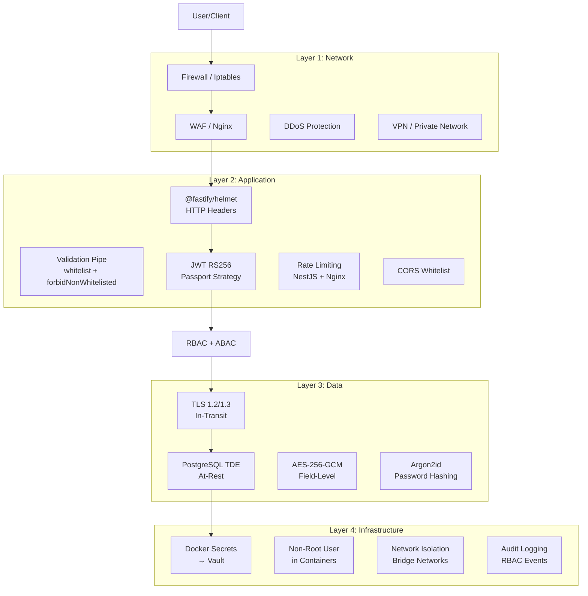
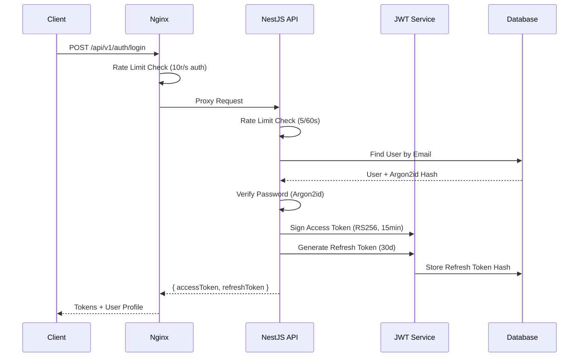
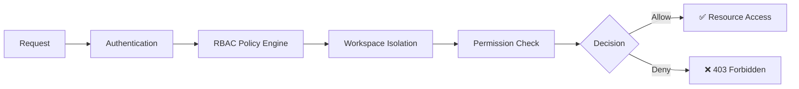
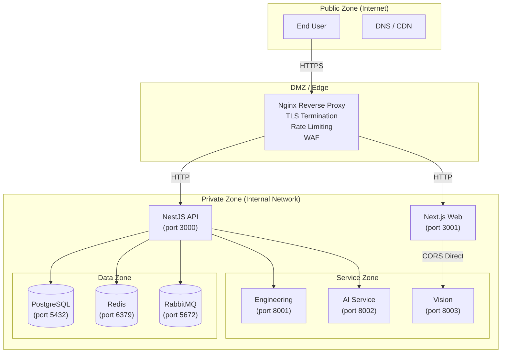

# Security Architecture — معماری امنیتی

**نسخه**: ۱.۰.۰ | **وضعیت**: Draft | **آخرین بروزرسانی**: خرداد ۱۴۰۵

---

## Purpose

این سند معماری کلی امنیتی پلتفرم Xennic را بر اساس مدل Defense in Depth توصیف می‌کند. لایه‌های امنیتی، جریان احراز هویت، مجوزدهی، رمزنگاری داده‌ها، مدیریت اسرار، و مرزهای اعتماد پلتفرم در این سند پوشش داده شده‌اند.

---

## Scope

Network Security, Application Security, Data Security, Infrastructure Security, Secrets Management.

---

## Defense in Depth — لایه‌های دفاعی



| لایه | مؤلفه‌ها | وضعیت |
|------|---------|--------|
| **Network** | Firewall, Nginx WAF, DDoS Protection, VPN | 🔄 در حال پیاده‌سازی |
| **Application** | Helmet, ValidationPipe, JWT, Rate Limiting, CORS | ✅ فعال |
| **Data** | TLS 1.2/1.3, AES-256-GCM, Argon2id | ✅ فعال (جزئی نیاز به تکمیل) |
| **Infrastructure** | Docker Secrets, Non-Root User, Network Isolation | ✅ فعال (Vault در برنامه) |

---

## Authentication Flow — جریان احراز هویت



### Password Hashing

| پارامتر | مقدار |
|---------|-------|
| Algorithm | **Argon2id** |
| Implementation | `argon2` npm package |
| Memory Cost | 19 KiB |
| Time Cost | 2 iterations |
| Parallelism | 1 thread |
| Salt Length | 16 bytes |
| Hash Length | 32 bytes |

### Token Specifications

| توکن | الگوریتم | طول عمر | محل ذخیره |
|------|---------|---------|-----------|
| Access Token | RS256 | **15 دقیقه** (۹۰۰ ثانیه) | Client (memory / HTTP-only cookie) |
| Refresh Token | SHA-256 hash | **۳۰ روز** (۲۵۹۲۰۰۰ ثانیه) | Database (SHA-256 hash) |

---

## Authorization — مجوزدهی (RBAC)



| نقش | سطح دسترسی |
|-----|------------|
| `super_admin` | تمام workspaceها، تنظیمات سیستم |
| `admin` | مدیریت workspace، مدیریت کاربران |
| `editor` | ایجاد و ویرایش منابع |
| `viewer` | دسترسی فقط‌خواندنی |
| `engineer` | محاسبات مهندسی |
| `reviewer` | بازبینی و تأیید |

> برای جزئیات بیشتر به `ACCESS_CONTROL.md` و `SECURITY_MODEL.md` مراجعه کنید.

---

## Data Encryption — رمزنگاری داده‌ها

### In-Transit (لایه انتقال)

| لایه | پروتکل | پیکربندی |
|------|--------|---------|
| Client → Nginx | **TLS 1.3** (fallback TLS 1.2) | ECDHE + AES-GCM |
| Nginx → Services | HTTP (internal network) | Internal bridge network |
| PostgreSQL | TLS optional | Configurable via `PGSSLMODE` |
| Redis | Password-protected | `--requirepass` |

**پیکربندی Nginx SSL:**
```nginx
ssl_protocols TLSv1.2 TLSv1.3;
ssl_ciphers ECDHE-ECDSA-AES128-GCM-SHA256:ECDHE-RSA-AES128-GCM-SHA256;
ssl_prefer_server_ciphers off;
ssl_session_cache shared:SSL:10m;
ssl_session_timeout 1d;
ssl_session_tickets off;
ssl_stapling on;
```

### At-Rest (ذخیره‌سازی)

| لایه | مکانیزم | توضیح |
|------|---------|-------|
| PostgreSQL | **TDE** (Tablespace-level encryption) | داده‌ها در سطح دیسک رمزنگاری می‌شوند |
| Backups | **AES-256-CBC** | پشتیبان‌گیری با رمزنگاری |
| Field-Level | **AES-256-GCM** | فیلدهای حساس (ایمیل، تلفن، API keys) |

### Sensitive Fields

| فیلد | روش | توضیح |
|------|-----|-------|
| پسورد | Argon2id (hash) | یک‌طرفه، غیرقابل بازگشت |
| ایمیل | AES-256-GCM | رمزنگاری سطح فیلد |
| تلفن | AES-256-GCM | رمزنگاری سطح فیلد |
| API Keys | AES-256-GCM | در دیتابیس رمزنگاری شده |
| JWT Private Key | Docker Secrets → Vault | خارج از container filesystem |

> برای جزئیات بیشتر به `DATA_ENCRYPTION.md` مراجعه کنید.

---

## Secret Management — مدیریت اسرار

| مرحله | وضعیت فعلی | وضعیت هدف |
|-------|------------|-----------|
| **Development** | `.env` files (local) | `.env` files + `.env.example` |
| **Staging** | Docker Secrets | HashiCorp Vault (agent sidecar) |
| **Production** | Docker Secrets | **HashiCorp Vault** (PKI + Dynamic Secrets) |

### مسیر مهاجرت

```
.env files → Docker Secrets → HashiCorp Vault
    ↑             ↑                   ↑
  Dev         Staging/Prod        Production
  (local)     (container)        (dynamic + audit)
```

### اسرار فعلی

| سِری | مکان فعلی | مکان هدف | چرخش |
|------|----------|---------|------|
| `JWT_PRIVATE_KEY` | `infrastructure/docker/secrets/` | Vault PKI | ۹۰ روز |
| `POSTGRES_PASSWORD` | `.env` (commit شده) | Vault Dynamic Secrets | ۳۰ روز |
| `GROQ_API_KEY` | `apps/api/.env` (commit شده) | Vault KV | ۹۰ روز |
| `REDIS_PASSWORD` | `.env` | Vault KV | ۹۰ روز |
| `SMTP_PASS` | `.env` | Vault KV | ۱۸۰ روز |

> **⚠️ خطر**: JWT private key و API keys در Git commit شده‌اند. اقدام فوری: `git filter-branch` برای پاک‌سازی تاریخچه.

> برای جزئیات بیشتر به `SECRETS_MANAGEMENT.md` و `Secrets.md` مراجعه کنید.

---

## Security Boundaries — مرزهای اعتماد



| مرز | دسترسی‌های مجاز | پروتکل |
|-----|---------------|--------|
| **Public → DMZ** | HTTP/HTTPS (ports 80, 443) | TLS 1.2/1.3 |
| **DMZ → Private** | Internal bridge network | HTTP (internal) |
| **Private → Data** | Service-specific ports | TCP + Auth |
| **Service → Service** | Internal DNS + API tokens | HTTP + mTLS (برنامه) |

### اصول جداسازی

1. **Network Segmentation**: همه سرویس‌ها در شبکه `xennic-network` با driver `bridge`
2. **Least Privilege**: هر container فقط به پورت‌های ضروری دسترسی دارد
3. **No Direct DB Access**: فقط NestJS API به PostgreSQL متصل می‌شود
4. **CORS Restricted**: فقط origins مجاز از طریق `CORS_ORIGINS`

---

## Rate Limiting — محدودیت نرخ

| لایه | محدودیت | پیاده‌سازی |
|------|---------|-----------|
| **Nginx Global** | ۱۰۰ req/s | `limit_req_zone api=10m rate=100r/s` |
| **Nginx Auth** | ۱۰ req/s | `limit_req_zone auth=10m rate=10r/s` |
| **NestJS Global** | ۱۰/۱۰s, ۱۰۰/۶۰s, ۱۰۰۰/۱h | `@nestjs/throttler` |
| **NestJS Auth** | ۵/۶۰s (login), ۳/۶۰s (register) | `AuthThrottlerGuard` |
| **NestJS AI** | ۲۰/۶۰s | `@nestjs/throttler` |

> برای جزئیات بیشتر به `RATE_LIMITING.md` مراجعه کنید.

---

## Related Documents

| سند | مسیر |
|-----|------|
| Security Model | `security/SECURITY_MODEL.md` |
| Access Control | `security/ACCESS_CONTROL.md` |
| JWT | `security/JWT.md` |
| Secrets Management | `security/SECRETS_MANAGEMENT.md` |
| Data Encryption | `security/DATA_ENCRYPTION.md` |
| Rate Limiting | `security/RATE_LIMITING.md` |
| Headers | `security/Headers.md` |
| Secrets | `security/Secrets.md` |
| Dependency Audit | `security/Dependency-Audit.md` |
| Production Hardening | `security/Production-Hardening.md` |
| Security Checklist | `security/Security-Checklist.md` |
| Production Readiness | `project/PRODUCTION_READINESS_AUDIT.md` |
| Deployment Spec | `specifications/DEPLOYMENT_SPEC.md` |

---

## Revision History

| نسخه | تاریخ | تغییرات |
|------|-------|---------|
| ۱.۰.۰ | خرداد ۱۴۰۵ | انتشار اولیه — معماری امنیتی جامع |
