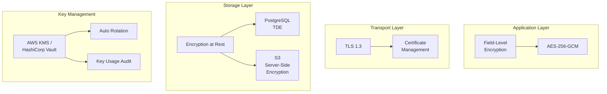

# رمزنگاری داده — Data Encryption

**نسخه**: ۱.۰.۰ | **وضعیت**: Approved | **آخرین بروزرسانی**: خرداد ۱۴۰۵

---

## Purpose

راهبرد رمزنگاری داده‌ها در پلتفرم Xennic شامل Encryption at Rest و Encryption in Transit را توصیف می‌کند.

---

## Scope

Database encryption, TLS, field-level encryption.

---

## Encryption Layers

---

## Encryption Standards

| لایه | الگوریتم | طول کلید | حالت |
|------|----------|---------|------|
| Transport | TLS 1.3 | 256-bit | ECDHE |
| Storage (DB) | AES-256 | 256-bit | GCM |
| Field-level | AES-256 | 256-bit | GCM with AAD |
| Backups | AES-256 | 256-bit | CBC |

## Sensitive Fields

| فیلد | نوع رمزنگاری | توضیح |
|------|-------------|-------|
| passwords | bcrypt (hash) | One-way, salted |
| emails | AES-256-GCM | Searchable encryption |
| phone numbers | AES-256-GCM | Searchable encryption |
| API keys | AES-256-GCM | Application-level |
| PII fields | AES-256-GCM | GDPR/DPA compliance |

---

## Related Documents

| سند | مسیر |
|-----|------|
| Security Model | `security/SECURITY_MODEL.md` |
| Secrets Management | `security/SECRETS_MANAGEMENT.md` |
| Database Design | `database/DATABASE_DESIGN.md` |

---

## Revision History

| نسخه | تاریخ | تغییرات |
|------|-------|---------|
| ۱.۰.۰ | خرداد ۱۴۰۵ | انتشار اولیه |
