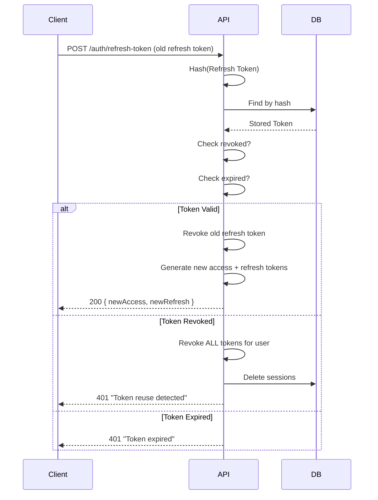

# JWT — JSON Web Token (تکمیل‌شده)

**نسخه**: ۲.۰.۰ | **وضعیت**: Updated | **آخرین بروزرسانی**: خرداد ۱۴۰۵

> این سند نسخه تکمیل‌شده `security/JWT.md` (v1) است. محتوای قبلی حفظ و با جزئیات پیاده‌سازی فعلی به‌روزرسانی شده است.

---

## Purpose

راهبرد احراز هویت مبتنی بر JWT در پلتفرم Xennic — شامل الگوریتم، مدیریت کلید، ساختار توکن، چرخش توکن، و توصیه‌های تولید.

---

## Scope

Token generation, signing, verification, refresh, revocation, security hardening.

---

## JWT Algorithm — الگوریتم

| پارامتر | مقدار |
|---------|-------|
| **Algorithm** | **RS256** (RSA Signature with SHA-256) |
| **Key Type** | Asymmetric (Private/Public key pair) |
| **Key Size** | 2048 bits |
| **Key Format** | PEM (PKCS#8) |
| **Library** | `@nestjs/jwt` + `passport-jwt` |

### چرا RS256 و نه HS256؟

| ویژگی | RS256 (Asymmetric) | HS256 (Symmetric) |
|-------|-------------------|-------------------|
| امضا | Private key | Shared secret |
| تأیید | Public key | Shared secret |
| امنیت | ✅ Private key never shared | ❌ Secret باید بین همه سرویس‌ها به اشتراک گذاشته شود |
| Key Rotation | ✅ بدون downtime | ❌ نیاز به هماهنگی همه سرویس‌ها |
| Microservices | ✅ ایده‌آل | ❌ ریسک لو رفتن secret |

---

## Key Management — مدیریت کلید

### مکان فعلی

| کلید | مسیر | وضعیت |
|------|------|--------|
| Private Key | `infrastructure/docker/secrets/jwtRS256.key` | 🔴 **در Git** |
| Public Key | `infrastructure/docker/secrets/jwtRS256.key.pub` | 🟡 کم‌خطر (عمومی است) |

### تولید کلید جدید

```bash
# تولید کلید 2048-bit RSA
openssl genpkey -algorithm RSA -pkeyopt rsa_keygen_bits:2048 \
  -out jwtRS256.key

# استخراج کلید عمومی
openssl rsa -pubout -in jwtRS256.key -out jwtRS256.key.pub

# مشاهده جزئیات
openssl rsa -text -noout -in jwtRS256.key | head -5
```

### بارگذاری در کد

```typescript
// apps/api/src/modules/auth/infrastructure/jwt/jwt.service.ts
private privateKey: string;
private publicKey: string;

constructor(private readonly jwtService: NestJwtService) {
  this.privateKey = readFileSync(process.env.JWT_PRIVATE_KEY_PATH!, 'utf8');
  this.publicKey = readFileSync(process.env.JWT_PUBLIC_KEY_PATH!, 'utf8');
}
```

### مسیر مهاجرت: Docker Secrets → Vault PKI

```yaml
# Production docker-compose
secrets:
  jwt_private_key:
    file: ../../secrets/jwtRS256.key
  jwt_public_key:
    file: ../../secrets/jwtRS256.key.pub

services:
  api:
    secrets:
      - jwt_private_key
      - jwt_public_key
    environment:
      JWT_PRIVATE_KEY_PATH: /run/secrets/jwt_private_key
      JWT_PUBLIC_KEY_PATH: /run/secrets/jwt_public_key
```

---

## Token Structure — ساختار توکن

### Access Token

**طول عمر**: ۱۵ دقیقه (۹۰۰ ثانیه)

```json
{
  "sub": "550e8400-e29b-41d4-a716-446655440000",
  "email": "user@xennic.com",
  "workspaceId": "660e8400-e29b-41d4-a716-446655440001",
  "roles": ["admin", "engineer"],
  "jti": "7a0e8400-e29b-41d4-a716-446655440002",
  "iat": 1719000000,
  "exp": 1719000900,
  "iss": "xennic-platform",
  "aud": "xennic-client"
}
```

### Refresh Token

**طول عمر**: ۳۰ روز (۲۵۹۲۰۰۰ ثانیه)

```json
{
  "id": "uuid-of-refresh-token",
  "userId": "550e8400-...",
  "tokenHash": "sha256-of-refresh-token",
  "expiresAt": "2025-07-23T00:00:00Z",
  "revokedAt": null,
  "createdAt": "2025-06-23T00:00:00Z"
}
```

> Refresh Token در دیتابیس به صورت SHA-256 hash ذخیره می‌شود (نه plain text).

### Payload Fields

| فیلد | نوع | توضیح | موجود در |
|------|-----|-------|---------|
| `sub` | UUID | شناسه کاربر | Access + Refresh |
| `email` | string | ایمیل کاربر | Access |
| `workspaceId` | UUID | workspace فعال (اختیاری) | Access |
| `roles` | string[] | نقش‌های کاربر | Access |
| `jti` | UUID | شناسه یکتای توکن (برای revoke) | Access |
| `iat` | number | زمان صدور (unix timestamp) | Access + Refresh |
| `exp` | number | زمان انقضا (unix timestamp) | Access |
| `iss` | string | issuer | Access |
| `aud` | string | audience | Access |
| `type` | string | "access" یا "refresh" | داخلی |

---

## Clock Skew Tolerance — تلورانس اختلاف ساعت

```typescript
// JWT Service (verify)
async verify(token: string): Promise<any> {
  return this.jwtService.verify(token, {
    publicKey: this.publicKey,
    algorithms: ['RS256'],
    issuer: process.env.JWT_ISSUER,
    audience: process.env.JWT_AUDIENCE,
    clockTolerance: 30, // 30 seconds
  });
}

// Passport Strategy
super({
  jwtFromRequest: ExtractJwt.fromAuthHeaderAsBearerToken(),
  ignoreExpiration: false,
  secretOrKey: publicKey,
  algorithms: ['RS256'],
  clockTolerance: 30, // 30 seconds
});
```

**مقدار فعلی**: ۳۰ ثانیه — برای جبران اختلاف ساعت بین سرویس‌ها کافی است.

---

## Refresh Token Rotation — چرخش توکن بازخوانی

### جریان



### Reuse Detection — تشخیص استفاده مجدد

```typescript
// auth.service.ts
async refreshToken(refreshToken: string): Promise<AuthResponse> {
  const tokenHash = crypto.createHash('sha256').update(refreshToken).digest('hex');
  const storedToken = await this.refreshTokenRepository.findByTokenHash(tokenHash);

  if (storedToken.isRevoked()) {
    // 🚨 Token reuse detected — revoke ALL user tokens
    await this.refreshTokenRepository.revokeAllByUserId(storedToken.userId);
    await this.sessionRepository.deleteByUserId(storedToken.userId);
    throw new UnauthorizedException('Invalid or expired refresh token');
  }

  // Rotation: revoke old, issue new
  await this.refreshTokenRepository.revoke(storedToken.id);
  const { accessToken, refreshToken: newRefreshToken } = await this.generateTokens(user.id, user.email);
  return this.formatAuthResponse(accessToken, newRefreshToken, user);
}
```

---

## Rate Limiting on Auth Endpoints — محدودیت نرخ

| مسیر | محدودیت | پنجره | پیاده‌سازی |
|------|---------|-------|-----------|
| `POST /auth/login` | **۵** درخواست | ۶۰ ثانیه | `AuthThrottlerGuard` |
| `POST /auth/register` | **۳** درخواست | ۶۰ ثانیه | `AuthThrottlerGuard` |
| `POST /auth/forgot-password` | **۳** درخواست | ۳۰۰ ثانیه | `AuthThrottlerGuard` |
| `POST /auth/refresh-token` | **۱۰** درخواست | ۶۰ ثانیه | `AuthThrottlerGuard` |
| Global Auth (Nginx) | **۱۰** req/s | burst ۵ | Nginx `limit_req_zone` |

### AuthThrottlerGuard

```typescript
protected override async getTracker(req: Record<string, any>): Promise<string> {
  const ip = req.ip || req.headers?.['x-forwarded-for'] || 'unknown';
  const email = req.body?.email || 'unknown';
  return `auth:${ip}:${email}`; // ردیابی ترکیبی IP + ایمیل
}
```

---

## Missing Implementations — پیاده‌سازی‌های缺失

### 1. Key Rotation (چرخش کلید)

**وضعیت**: ❌ پیاده‌سازی نشده

**خطر**: اگر private key لو برود، مهاجم می‌تواند توکن جعلی امضا کند.

**راهکار پیشنهادی**:
```typescript
// معرفی Key ID (kid) در هدر JWT
interface JwkSet {
  keys: {
    kid: string;
    kty: string;
    alg: string;
    use: 'sig';
    n: string;
    e: string;
  }[];
}

// پشتیبانی از چند کلید همزمان (overlap period 48h)
class KeyRotationService {
  private keys: Map<string, { private: string; public: string }> = {};
  
  async sign(payload: any): Promise<string> {
    const activeKey = this.getActiveKey();
    return this.jwtService.sign(payload, {
      key: activeKey.private,
      algorithm: 'RS256',
      header: { kid: activeKey.kid },
    });
  }
}
```

### 2. jti Blacklist (لیست سیاه توکن)

**وضعیت**: ❌ پیاده‌سازی نشده

**خطر**: توکن‌های access قبل از انقضا قابل باطل کردن نیستند.

**راهکار پیشنهادی**:
```typescript
class JtiBlacklistService {
  constructor(@InjectRedis() private redis: Redis) {}

  async blacklist(jti: string, exp: number): Promise<void> {
    const ttl = Math.max(0, exp - Math.floor(Date.now() / 1000));
    await this.redis.set(`jti:blacklist:${jti}`, '1', 'EX', ttl);
  }

  async isBlacklisted(jti: string): Promise<boolean> {
    const result = await this.redis.get(`jti:blacklist:${jti}`);
    return result !== null;
  }
}

// استفاده در JwtStrategy
async validate(payload: JwtPayload) {
  if (await this.blacklistService.isBlacklisted(payload.jti)) {
    throw new UnauthorizedException('Token revoked');
  }
  // ...
}
```

### 3. JWKS Endpoint

**وضعیت**: ❌ پیاده‌سازی نشده

**خطر**: سرویس‌های دیگر نمی‌توانند به صورت پویا کلید عمومی را دریافت کنند.

**راهکار پیشنهادی**:
```typescript
@Get('.well-known/jwks.json')
getJwks(): JwkSet {
  return {
    keys: [{
      kid: 'xennic-v1',
      kty: 'RSA',
      alg: 'RS256',
      use: 'sig',
      n: this.base64url(this.publicKey.n),
      e: this.base64url(this.publicKey.e),
    }],
  };
}
```

---

## Recommendations for Production — توصیه‌های تولید

| # | توصیه | اولویت | تلاش |
|---|-------|--------|------|
| 1 | **جابجایی private key از Git → Vault** | 🔴 P0 | ۴ ساعت |
| 2 | **پیاده‌سازی jti blacklist با Redis** | 🟠 P1 | ۴ ساعت |
| 3 | **پیاده‌سازی JWKS endpoint** | 🟠 P1 | ۲ ساعت |
| 4 | **اضافه کردن key rotation (kid support)** | 🟠 P1 | ۸ ساعت |
| 5 | **کاهش access token TTL به ۵ دقیقه** | 🟡 P2 | ۳۰ دقیقه |
| 6 | **اضافه کردن refresh token rotation metrics** | 🟡 P2 | ۲ ساعت |
| 7 | **ایمیل هشدار برای login از IP جدید** | 🟢 P3 | ۴ ساعت |

---

## Related Documents

| سند | مسیر |
|-----|------|
| Security Architecture | `security/Architecture.md` |
| Security Model (v1) | `security/SECURITY_MODEL.md` |
| Secrets Management | `security/Secrets.md` |
| Access Control | `security/ACCESS_CONTROL.md` |
| Rate Limiting | `security/RATE_LIMITING.md` |
| Production Hardening | `security/Production-Hardening.md` |
| Auth Implementation | `apps/api/src/modules/auth/` |

---

## Revision History

| نسخه | تاریخ | تغییرات |
|------|-------|---------|
| ۲.۰.۰ | خرداد ۱۴۰۵ | **بازنویسی کامل**: اضافه شدن پیاده‌سازی جاری، key management، payload fields، clock skew، reuse detection، rate limiting، missing implementations، production recommendations |
| ۱.۰.۰ | خرداد ۱۴۰۵ | انتشار اولیه |
