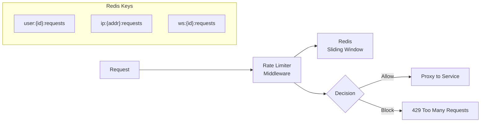

# محدودیت نرخ — Rate Limiting

**نسخه**: ۱.۰.۰ | **وضعیت**: Approved | **آخرین بروزرسانی**: خرداد ۱۴۰۵

---

## Purpose

راهبرد محدودیت نرخ (Rate Limiting) در پلتفرم Xennic را توصیف می‌کند.

---

## Scope

API rate limits, burst handling, per-tenant limits.

---

## Architecture



---

## Rate Limit Tiers

| سطح | محدودیت | پنجره | burst |
|------|---------|-------|-------|
| Public | 100/hour | 1 hour | 10/min |
| Authenticated | 1000/hour | 1 hour | 100/min |
| Professional | 10000/hour | 1 hour | 500/min |
| Enterprise | Custom | Custom | Custom |

## Endpoint-specific Limits

| مسیر | محدودیت | دلیل |
|------|---------|------|
| POST /auth/login | 5/min IP | Brute force prevention |
| POST /auth/register | 3/hour IP | Spam prevention |
| POST /api/v1/projects | 100/hour/user | Resource creation |
| GET /api/v1/search | 60/min/user | Compute intensive |

## Implementation

```typescript
@Injectable()
export class RateLimiter {
  constructor(@InjectRedis() private redis: Redis) {}
  
  async check(key: string, limit: number, window: number): Promise<RateLimitResult> {
    const current = await this.redis.incr(`${key}:${this.getWindow(window)}`);
    if (current === 1) await this.redis.expire(key, window);
    
    return {
      allowed: current <= limit,
      remaining: Math.max(0, limit - current),
      reset: Math.ceil(Date.now() / 1000) + window,
    };
  }
}
```

---

## Related Documents

| سند | مسیر |
|-----|------|
| Security Model | `security/SECURITY_MODEL.md` |
| API Design | `backend/API_DESIGN.md` |
| Error Handling | `backend/ERROR_HANDLING.md` |

---

## Revision History

| نسخه | تاریخ | تغییرات |
|------|-------|---------|
| ۱.۰.۰ | خرداد ۱۴۰۵ | انتشار اولیه |
