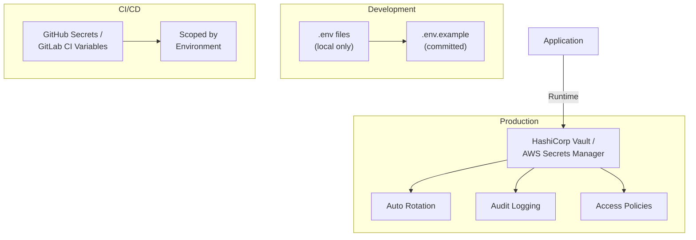

# مدیریت اسرار — Secrets Management

**نسخه**: ۱.۰.۰ | **وضعیت**: Approved | **آخرین بروزرسانی**: خرداد ۱۴۰۵

---

## Purpose

راهبرد مدیریت اسرار (Secrets) در پلتفرم Xennic را توصیف می‌کند.

---

## Scope

API keys, database credentials, service tokens.

---

## Architecture



---

## Secret Categories

| دسته | مثال‌ها | مکان |
|------|---------|------|
| Database | POSTGRES_URL | Vault + .env |
| API Keys | OPENAI_API_KEY | Vault |
| JWT Keys | JWT_PRIVATE_KEY | Vault (PKI) |
| Service Tokens | INTERNAL_API_TOKEN | Vault |
| Third-party | AWS_ACCESS_KEY | Vault |

## Access Control

| اصل | توضیح |
|-----|--------|
| Least Privilege | Only necessary secrets per service |
| Auto-rotation | 90-day cycle for all secrets |
| Audit Trail | All access logged |
| No Hardcoding | Zero secrets in source code |

## Environment-Specific

```yaml
development:
  source: .env files
  rotation: manual
  audit: false
  
staging:
  source: HashiCorp Vault
  rotation: automatic (90 days)
  audit: true
  
production:
  source: AWS Secrets Manager
  rotation: automatic (30 days)
  audit: true
```

---

## Related Documents

| سند | مسیر |
|-----|------|
| Security Model | `security/SECURITY_MODEL.md` |
| Data Encryption | `security/DATA_ENCRYPTION.md` |
| Environment Variables | `deployment/ENVIRONMENT_VARIABLES.md` |

---

## Revision History

| نسخه | تاریخ | تغییرات |
|------|-------|---------|
| ۱.۰.۰ | خرداد ۱۴۰۵ | انتشار اولیه |
