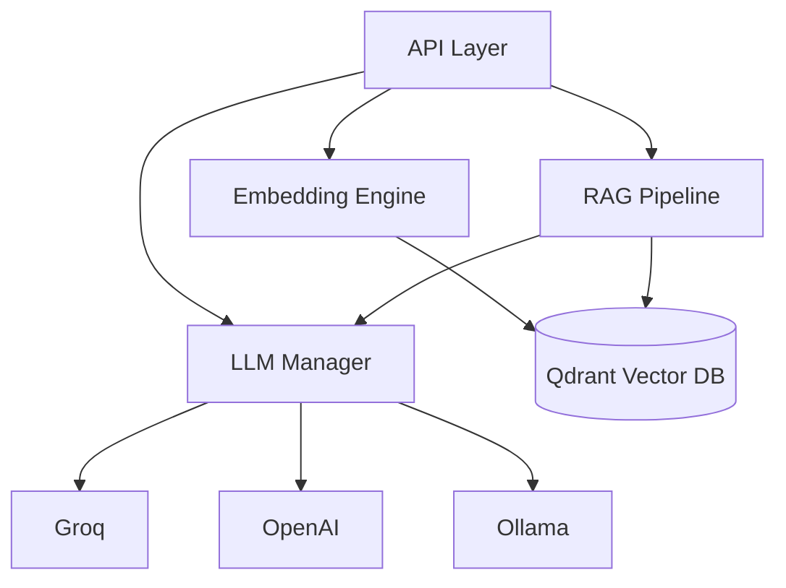

# AI Service — سرویس هوش مصنوعی

**نسخه**: ۱.۰.۰ | **پورت**: ۸۰۰۲ | **زبان**: Python 3.12 | **فریم‌ورک**: FastAPI

---

## هدف

ارائه قابلیت‌های هوش مصنوعی و پردازش زبان طبیعی برای پلتفرم Xennic شامل تحلیل اسناد، جستجوی معنایی، و تولید دانش فنی.

---

## قابلیت‌های فعلی

| قابلیت | وضعیت |
|--------|--------|
| مکالمه با LLM (Chat) | ✅ فعال |
| تولید Embedding | ✅ فعال |
| جستجوی برداری (Qdrant) | ✅ فعال |
| RAG Pipeline | ✅ فعال |
| تحلیل متن | ✅ فعال |
| Document Analysis | ✅ فعال |
| Drawing Analysis | ✅ فعال |

---

## LLM Providers

| Provider | وضعیت | توضیح |
|----------|--------|-------|
| Groq | ✅ فعال | سرعت بالا، Llama 3 |
| OpenAI | ✅ فعال | GPT-4, GPT-3.5 |
| Ollama | ✅ فعال (محلی) | مدل‌های لوکال |

---

## API Endpoints

| مسیر | متد | توضیح |
|------|------|-------|
| `/api/v1/ai/chat` | POST | مکالمه هوشمند |
| `/api/v1/ai/embeddings` | POST | تولید embedding |
| `/api/v1/ai/search` | POST | جستجوی برداری |
| `/api/v1/ai/analyze/text` | POST | تحلیل متن |
| `/api/v1/ai/knowledge` | POST | جستجوی دانش فنی |
| `/api/v1/ai/index` | POST | ایندکس کردن سند |
| `/health` | GET | health check |

---

## معماری

