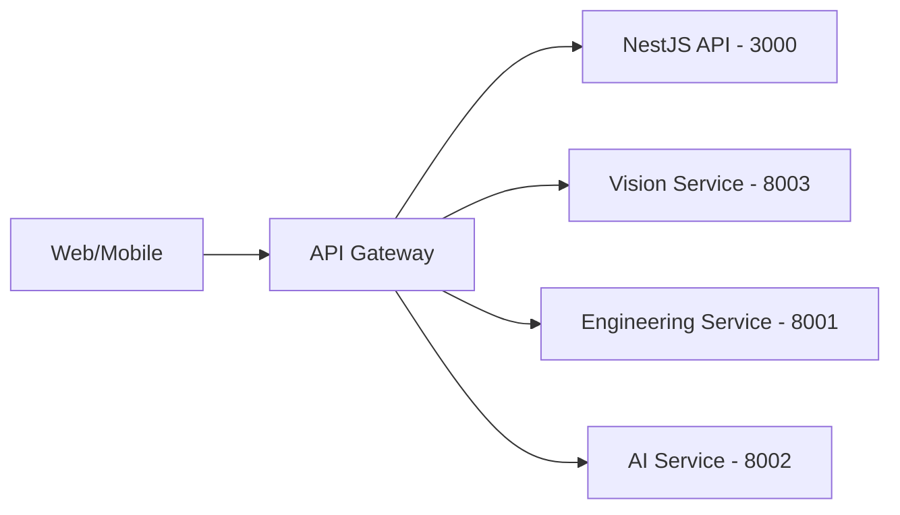

# API Gateway — دروازه API

**نسخه**: ۱.۰.۰ | **وضعیت**: Placeholder (خالی)

---

## وضعیت فعلی

سرویس `services/api-gateway/` یک دایرکتوری placeholder است و هنوز پیاده‌سازی نشده. در حال حاضر:

- درخواست‌های فرانت‌اند به NestJS از طریق Next.js rewrites هدایت می‌شوند
- درخواست‌های Vision Service مستقیماً از فرانت‌اند به Vision Service از طریق CORS ارسال می‌شوند

## معماری هدف

Gateway وظایف زیر را بر عهده خواهد داشت:
- Rate limiting
- Authentication
- Request routing
- Load balancing
- Logging یکپارچه
- CORS مدیریت شده

> جزئیات بیشتر در `XENNIC_ARCHITECTURE_SPEC_v1.md` و `XENNIC_INFRASTRUCTURE_SPEC_v1.md` مستند شده است.
