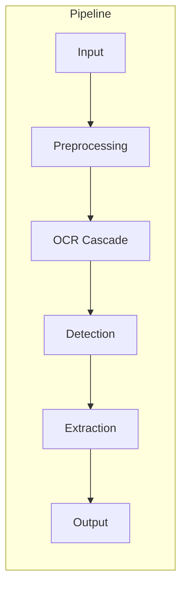

# Vision Service — سرویس بینایی ماشین

**نسخه**: ۱.۰.۰ | **پورت**: ۸۰۰۳ | **زبان**: Python 3.12 | **فریم‌ورک**: FastAPI

---

## هدف

تشخیص و استخراج خودکار اطلاعات فنی از تصاویر و اسناد مهندسی برق شامل پلاک تجهیزات (موتور، ترانسفورماتور و ...) و قبض‌های برق.

---

## معماری Pipeline



### Preprocessing Stages
| Stage | فایل | عملکرد |
|-------|------|--------|
| ImageValidator | `validator.py` | اعتبارسنجی ابعاد، تصاویر بزرگ (>۲۰۰۰px) preprocessing نمی‌شوند |
| ImageEnhancer | `enhancer.py` | CLAHE + Sharpening |
| PerspectiveCorrector | `corrector.py` | تصحیح پرسپکتیو |
| DeskewStage | `deskew.py` | تصحیح چرخش |
| Denoiser | `denoiser.py` | Non-Local Means (h=3) |

### Cascade OCR
```python
if EasyOCR_models_cached:
    result = EasyOCR(image)
    if result.confidence > THRESHOLD:
        return result

result = Tesseract(image)  # 3 strategy: adaptive, otsu, raw
if result.confidence > THRESHOLD:
    return result

if LLM_api_key:
    result = VisionLLM(image)
    if result.success:
        return result
```

### Detection
- DocumentClassifier با `_partial_match` برای تطبیق فازی
- کلمات کلیدی فارسی/انگلیسی برای پلاک و قبض

### Extraction
| Extractor | فیلدها |
|-----------|--------|
| NameplateExtractor | manufacturer, model, power, voltage, current, frequency, speed, phase, insulation, enclosure |
| BillExtractor | bill_number, customer, consumption, amount, period |

---

## API Endpoints

| مسیر | متد | توضیح |
|------|------|-------|
| `/api/v1/vision/upload` | POST | آپلود یکپارچه با auto-detect |
| `/api/v1/vision/nameplate/read` | POST | OCR پلاک تجهیزات |
| `/api/v1/vision/nameplate/analyze` | POST | OCR + تحلیل مهندسی |
| `/api/v1/vision/bill/read` | POST | OCR قبض برق |
| `/api/v1/vision/ocr` | POST | OCR عمومی |
| `/health` | GET | health check |

---

## ویژگی‌های کلیدی

- **Auto-detect سند**: OCR → تطبیق فازی با کلمات کلیدی → fallback به heuristics بصری
- **Fallback OCR**: برای تصاویر بزرگ (>۲۰۰۰px) preprocessing حذف می‌شود
- **سنجش کیفیت**: نسبت کاراکترهای خوانا به کل (آستانه ۰٫۵۵)
- **PDF Processing**: تبدیل با PyMuPDF در DPI=۱۰۰
- **پشتیبانی فارسی**: Tesseract با `fas+eng`، ارقام فارسی/عربی

---

## وابستگی‌ها

| بسته | کاربرد |
|------|--------|
| fastapi | فریم‌ورک API |
| pytesseract | Tesseract OCR |
| easyocr (اختیاری) | OCR عمیق |
| opencv-contrib-python | پردازش تصویر |
| PyMuPDF | PDF→Image |
| Pillow | پردازش تصویر |

---

## مشکلات شناخته شده

1. **PDF timeout**: فایل‌های PDF ممکن است timeout بخورند (راه‌حل: کاهش DPI)
2. **EasyOCR**: مدل‌ها کش نشده، دانلود اولیه زمان‌بر
3. **بدون GPU**: تمام پردازش CPU
4. **تشخیص فارسی/انگلیسی**: Tesseract در متن‌های ترکیبی دقت محدود دارد
