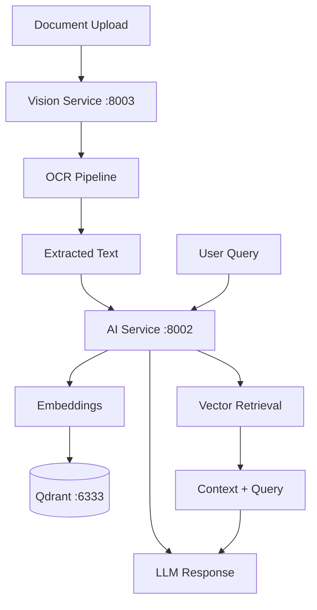

# مشخصات AI — AI Specification

**نسخه**: ۱.۰.۰ | **وضعیت**: Approved | **مالک**: AI Team | **آخرین بروزرسانی**: خرداد ۱۴۰۵ | **بازبینی بعدی**: شهریور ۱۴۰۵

---

## Purpose

مشخصات رسمی AI Engine پلتفرم Xennic.

---

## Scope

AI services, models, pipelines, integration.

---

## Contract

### Services
| سرویس | پورت | فریم‌ورک | وظیفه |
|-------|------|----------|-------|
| AI Service | 8002 | FastAPI | LLM, RAG, Embeddings |
| Vision Service | 8003 | FastAPI | OCR, Image Processing |

### Pipelines
| Pipeline | سرویس | وابستگی‌ها |
|----------|-------|-----------|
| OCR | Vision | Tesseract, OpenCV |
| Vision | Vision | OpenCV, Tesseract |
| RAG | AI | Qdrant, sentence-transformers |
| Document Analysis | AI + Vision | Both pipelines |

### Models
| مدل | نوع | Operator |
|-----|-----|----------|
| all-MiniLM-L6-v2 | Embedding (384d) | AI Service |
| GPT-4 / Claude 3.5 | LLM | External API |
| Tesseract 5 | OCR | Vision Service |

### Data Flow

---

## Related Documents

| سند | مسیر |
|-----|------|
| AI Engine | `ai/AI_ENGINE.md` |
| AI Agents | `ai/AI_AGENTS.md` |
| AI Service | `services/ai-service.md` |
| Vision Service | `services/vision-service.md` |

---

## Revision History

| نسخه | تاریخ | تغییرات |
|------|-------|---------|
| ۱.۰.۰ | خرداد ۱۴۰۵ | انتشار اولیه |
