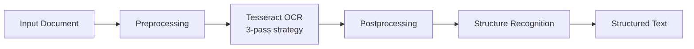

# مشخصات OCR — OCR Specification

**نسخه**: ۱.۰.۰ | **وضعیت**: Approved | **مالک**: AI Team | **آخرین بروزرسانی**: خرداد ۱۴۰۵ | **بازبینی بعدی**: شهریور ۱۴۰۵

---

## Purpose

مشخصات رسمی OCR Pipeline پلتفرم Xennic.

---

## Scope

Text extraction, image preprocessing, supported formats.

---

## Contract

### OCR Engine
| پارامتر | مقدار |
|---------|-------|
| Primary Engine | Tesseract OCR 5 |
| Language Support | English, Persian |
| Image Preprocessing | OpenCV (grayscale, threshold, denoise) |
| Fallback Strategy | 3-pass (default, PSM, custom config) |

### Supported Formats
| فرمت | توضیح |
|------|--------|
| PDF | Multi-page, scanned |
| PNG | Single image |
| JPEG/JPG | Single image |
| TIFF | Multi-page |
| DWG/DXF | Planned for future implementation |

### Accuracy
| زبان | Accuracy |
|------|----------|
| English | ~95% |
| Persian | ~85% |
| Mixed text | ~80% |
| Handwritten | ~60% (requires custom model) |

### Pipeline

---

## Related Documents

| سند | مسیر |
|-----|------|
| OCR Pipeline | `ai/OCR_PIPELINE.md` |
| Vision Pipeline | `ai/VISION_PIPELINE.md` |
| Vision Service | `services/vision-service.md` |
| AI Engine | `ai/AI_ENGINE.md` |

---

## Revision History

| نسخه | تاریخ | تغییرات |
|------|-------|---------|
| ۱.۰.۰ | خرداد ۱۴۰۵ | انتشار اولیه |
