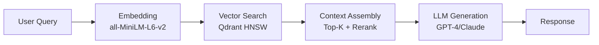

# مشخصات RAG — RAG Specification

**نسخه**: ۱.۰.۰ | **وضعیت**: Approved | **مالک**: AI Team | **آخرین بروزرسانی**: خرداد ۱۴۰۵ | **بازبینی بعدی**: شهریور ۱۴۰۵

---

## Purpose

مشخصات رسمی Retrieval-Augmented Generation (RAG) پلتفرم Xennic.

---

## Scope

Embedding, retrieval, context assembly, generation.

---

## Contract

### Pipeline

### Parameters
| پارامتر | مقدار |
|---------|-------|
| Embedding Model | all-MiniLM-L6-v2 |
| Embedding Dimension | 384 |
| Vector DB | Qdrant |
| Index Type | HNSW |
| Similarity Metric | Cosine |
| Top-K | 5 |
| Rerank | Cross-encoder |
| Context Window | 4K tokens |

### Chunking Strategy
| استراتژی | اندازه | Overlap |
|----------|--------|---------|
| Recursive Character | 512 chars | 64 chars |
| Semantic (planned) | Variable | N/A |

### LLM Providers
| Provider | Models | Status |
|----------|--------|--------|
| OpenAI | GPT-4, GPT-4o | Active |
| Anthropic | Claude 3.5 Sonnet | Active |
| Google | Gemini 1.5 (planned) | Future |
| Local | Llama 3 (planned) | Future |

---

## Related Documents

| سند | مسیر |
|-----|------|
| RAG Architecture | `ai/RAG_ARCHITECTURE.md` |
| AI Engine | `ai/AI_ENGINE.md` |
| LLM Integration | `ai/LLM_INTEGRATION.md` |
| Embedding Pipeline | `ai/EMBEDDING_PIPELINE.md` |
| Vector Database | `ai/VECTOR_DATABASE.md` |

---

## Revision History

| نسخه | تاریخ | تغییرات |
|------|-------|---------|
| ۱.۰.۰ | خرداد ۱۴۰۵ | انتشار اولیه |
