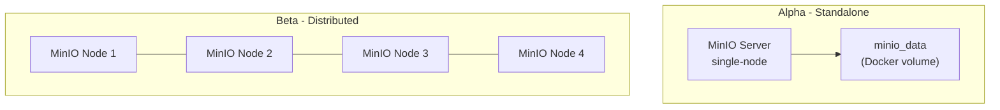

# MinIO Storage Architecture

**Version**: 1.0.0 | **Status**: Draft | **Last Updated**: June 2026

---

## Table of Contents

1. [Overview](#overview)
2. [Deployment Architecture](#deployment-architecture)
3. [Bucket Strategy](#bucket-strategy)
4. [Lifecycle Policies](#lifecycle-policies)
5. [Versioning Strategy](#versioning-strategy)
6. [Backup Policy](#backup-policy)
7. [Access Control & IAM](#access-control--iam)
8. [Connection Details](#connection-details)
9. [Healthcheck & Monitoring](#healthcheck--monitoring)
10. [Disaster Recovery](#disaster-recovery)

---

## Overview

Xennic uses [MinIO](https://min.io/) as its S3-compatible object storage layer. MinIO provides high-performance, scalable object storage for all platform artifacts including user uploads, calculation results, AI model artifacts, backups, and static assets.

---

## Deployment Architecture

### Alpha Phase — Standalone Mode

In the Alpha phase, a single MinIO server instance is deployed via Docker Compose. This is suitable for development, staging, and early production with moderate throughput requirements.

| Attribute | Value |
|-----------|-------|
| Topology | Single-node, single-drive |
| Data path | `/data` (Docker volume `minio_data`) |
| API port | `9000` |
| Console port | `9001` |
| TLS | Terminated at reverse proxy (Nginx) |

### Beta Phase — Distributed Mode

For Beta and beyond, MinIO will be deployed in distributed mode across multiple nodes for high availability and scalability.

| Attribute | Value |
|-----------|-------|
| Topology | Multi-node, multi-drive (at least 4 nodes × 4 drives) |
| Erasure coding | EC:4 (RS parity) — tolerates loss of 4 drives |
| Discovery | Kubernetes StatefulSet or Docker Swarm with DNS-based discovery |
| Minimum nodes | 4 |
| Quorum | Write: N/2+1, Read: N/2 |



---

## Bucket Strategy

Five buckets form the storage foundation:

| Bucket | Purpose | Access Policy | Lifecycle | Versioning |
|--------|---------|--------------|-----------|------------|
| `xennic-uploads` | User-uploaded files (drawings, schematics, documents) | Private | Transition → warm @ 30d, delete @ 365d | SUSPENDED |
| `xennic-calculations` | Calculation results and reports (PDFs, CSVs) | Private | Transition → warm @ 30d, delete @ 365d | SUSPENDED |
| `xennic-backups` | Database + config backups | Private | No auto-delete (manual cleanup) | ENABLED |
| `xennic-ai-models` | AI model artifacts and embeddings | Private | No auto-delete | ENABLED |
| `xennic-public` | Static public assets (logos, landing page assets) | Public (read-only) | No lifecycle | SUSPENDED |

### Detailed Bucket Specifications

#### `xennic-uploads`
- **Access**: Private — accessed via presigned URLs generated by the API
- **Lifecycle**: Transition files older than 30 days to warm storage tier; delete files older than 365 days
- **Versioning**: SUSPENDED — previous versions are not retained for user uploads
- **Use cases**: Drawing files (.dwg, .dxf, .pdf), schematic images, project documents

#### `xennic-calculations`
- **Access**: Private — accessed via presigned URLs, read access granted to engineering-service
- **Lifecycle**: Transition to warm storage after 30 days; delete after 365 days
- **Versioning**: SUSPENDED — each calculation run produces a new object
- **Use cases**: Load calculation PDF reports, equipment schedules, CSV exports

#### `xennic-backups`
- **Access**: Private — only accessible to backup jobs and administrators
- **Lifecycle**: No auto-deletion — backups are managed by the backup retention policy
- **Versioning**: ENABLED — multiple backup versions are retained for point-in-time recovery
- **Use cases**: PostgreSQL dumps, configuration exports, application state snapshots

#### `xennic-ai-models`
- **Access**: Private — read/write for ai-service only
- **Lifecycle**: No auto-deletion — model versions are managed by the AI service
- **Versioning**: ENABLED — model iterations and embedding snapshots are versioned
- **Use cases**: Trained model weights, embedding indices, inference artifacts

#### `xennic-public`
- **Access**: Public (read-only) — no authentication required for GET/HEAD
- **Lifecycle**: No lifecycle rules
- **Versioning**: SUSPENDED
- **Use cases**: Static assets served directly via CDN or reverse proxy

---

## Lifecycle Policies

### Lifecycle Configuration (XML)

```xml
<!-- Applied to: xennic-uploads, xennic-calculations -->
<LifecycleConfiguration>
  <Rule>
    <ID>transition-to-warm</ID>
    <Filter><Prefix></Prefix></Filter>
    <Status>Enabled</Status>
    <Transition>
      <Days>30</Days>
      <StorageClass>WARM</StorageClass>
    </Transition>
  </Rule>
  <Rule>
    <ID>delete-old-data</ID>
    <Filter><Prefix></Prefix></Filter>
    <Status>Enabled</Status>
    <Expiration>
      <Days>365</Days>
    </Expiration>
  </Rule>
</LifecycleConfiguration>
```

---

## Versioning Strategy

| Bucket | Status | Rationale |
|--------|--------|-----------|
| `xennic-uploads` | SUSPENDED | Uploads are mutable working files; old versions add confusion |
| `xennic-calculations` | SUSPENDED | Each result is immutable; regeneration produces a new object |
| `xennic-backups` | ENABLED | Point-in-time recovery requires version history |
| `xennic-ai-models` | ENABLED | Model iteration tracking and rollback capability |
| `xennic-public` | SUSPENDED | Static assets are replaced atomically |

---

## Backup Policy

### Daily Offsite Sync

Backups are synchronized to an external/offsite location daily using the MinIO Client (`mc`).

```bash
# Cron job — runs daily at 02:00 UTC
0 2 * * * /usr/local/bin/mc mirror --watch --overwrite \
  local/xennic-backups \
  offsite/xennic-backups
```

- **Source**: MinIO `xennic-backups` bucket
- **Destination**: External S3-compatible storage or rsync target
- **Schedule**: Daily at 02:00 UTC
- **Retention**: 30 days of daily backups, 12 monthly snapshots
- **Encryption**: TLS in transit; server-side encryption at rest
- **Verification**: Checksum validation after each sync operation

### PostgreSQL Backup Integration

Database backups are written directly to `xennic-backups`:

```bash
pg_dump -h localhost -U xennic xennic | gzip | mc pipe local/xennic-backups/postgres/$(date +%Y%m%d-%H%M%S).sql.gz
```

---

## Access Control & IAM

### IAM Policies

#### `api-service` Policy

Read/write access to uploads and calculations. Used by the NestJS API to generate presigned URLs and manage user files.

```json
{
  "Version": "2012-10-17",
  "Statement": [
    {
      "Effect": "Allow",
      "Action": ["s3:PutObject", "s3:GetObject", "s3:DeleteObject", "s3:ListBucket"],
      "Resource": ["arn:aws:s3:::xennic-uploads/*", "arn:aws:s3:::xennic-uploads",
                   "arn:aws:s3:::xennic-calculations/*", "arn:aws:s3:::xennic-calculations"]
    }
  ]
}
```

#### `ai-service` Policy

Read/write access to AI model artifacts.

```json
{
  "Version": "2012-10-17",
  "Statement": [
    {
      "Effect": "Allow",
      "Action": ["s3:PutObject", "s3:GetObject", "s3:DeleteObject", "s3:ListBucket"],
      "Resource": ["arn:aws:s3:::xennic-ai-models/*", "arn:aws:s3:::xennic-ai-models"]
    }
  ]
}
```

#### `engineering-service` Policy

Read-only access to calculation results.

```json
{
  "Version": "2012-10-17",
  "Statement": [
    {
      "Effect": "Allow",
      "Action": ["s3:GetObject", "s3:ListBucket"],
      "Resource": ["arn:aws:s3:::xennic-calculations/*", "arn:aws:s3:::xennic-calculations"]
    }
  ]
}
```

### Access Key Mapping

| Access Key | Assigned To | Buckets | Permission |
|-----------|-------------|---------|------------|
| `api-service` | NestJS API | uploads, calculations | Read/Write |
| `ai-service` | AI Service (FastAPI) | ai-models | Read/Write |
| `engineering-service` | Engineering Service (FastAPI) | calculations | Read-Only |

---

## Connection Details

### Alpha (Docker Compose)

| Parameter | Value |
|-----------|-------|
| Endpoint (internal) | `http://minio:9000` |
| Endpoint (external) | `https://storage.xennic.com` (via Nginx) |
| Console | `https://storage.xennic.com:9001` or `http://localhost:9001` |
| Region | `us-east-1` (default) |
| Signature v4 | Enabled |
| TLS | Terminated at Nginx reverse proxy |

### Service Configuration

**NestJS API (`apps/api/.env`):**
```
S3_ENDPOINT=http://minio:9000
S3_REGION=us-east-1
S3_ACCESS_KEY=<api-service-access-key>
S3_SECRET_KEY=<api-service-secret-key>
S3_UPLOADS_BUCKET=xennic-uploads
S3_CALCULATIONS_BUCKET=xennic-calculations
S3_FORCE_PATH_STYLE=true
```

**AI Service (`workspace/services/ai-service/.env`):**
```
S3_ENDPOINT=http://minio:9000
S3_ACCESS_KEY=<ai-service-access-key>
S3_SECRET_KEY=<ai-service-secret-key>
S3_MODELS_BUCKET=xennic-ai-models
```

**Engineering Service (`workspace/services/engineering-service/.env`):**
```
S3_ENDPOINT=http://minio:9000
S3_ACCESS_KEY=<engineering-service-access-key>
S3_SECRET_KEY=<engineering-service-secret-key>
S3_CALCULATIONS_BUCKET=xennic-calculations
```

---

## Healthcheck & Monitoring

### Docker Healthcheck

MinIO exposes a healthcheck endpoint at `/minio/health/live`:

```yaml
healthcheck:
  test: ["CMD", "mc", "ready", "local"]
  interval: 30s
  timeout: 10s
  retries: 5
  start_period: 30s
```

### Prometheus Metrics

MinIO exposes Prometheus-compatible metrics at `/minio/v2/metrics/cluster`:

```yaml
# Prometheus scrape config
- job_name: 'minio'
  metrics_path: '/minio/v2/metrics/cluster'
  static_configs:
    - targets: ['minio:9000']
```

### Key Metrics to Monitor

| Metric | Warning | Critical | Description |
|--------|---------|----------|-------------|
| `minio_disk_storage_used_bytes` | > 80% | > 90% | Storage utilization |
| `minio_disk_offline_count` | > 0 | > 1 | Number of offline drives |
| `minio_s3_requests_total` | — | — | Request throughput |
| `minio_s3_errors_total` | > 1% | > 5% | Error rate |
| `minio_heal_objects_total` | > 0 | — | Objects being healed |

### Grafana Dashboard

Import the official MinIO dashboard (ID: 13502) from Grafana Labs for cluster monitoring.

---

## Disaster Recovery

### Recovery Scenarios

#### Scenario 1: MinIO Container Failure

1. Docker Compose restarts the container automatically (`restart: unless-stopped`)
2. Data persists in the `minio_data` Docker volume
3. Verify with `mc ready local`

#### Scenario 2: Data Corruption / Accidental Deletion

1. Restore from versioned backups in `xennic-backups` bucket:
   ```bash
   mc cp --recursive backup/xennic-uploads/ local/xennic-uploads/
   ```
2. If bucket-level corruption, restore from offsite mirror:
   ```bash
   mc mirror --overwrite offsite/xennic-uploads local/xennic-uploads
   ```

#### Scenario 3: Full Site Failure

1. Provision new infrastructure
2. Deploy MinIO and restore from offsite backup:
   ```bash
   mc mirror --overwrite offsite/ local/
   ```
3. Restore PostgreSQL from the most recent dump in `xennic-backups`
4. Verify data integrity with checksums

#### Scenario 4: Drive Failure (Distributed Mode)

MinIO's erasure coding automatically heals data when a replacement drive is available:
```bash
mc admin heal --recursive local/
```

### Recovery Runbook

```bash
# 1. Stop services that write to MinIO
docker compose -f infrastructure/docker/compose/production/docker-compose.yml stop api engineering-service ai-service

# 2. Restore from offsite mirror
mc mirror --overwrite offsite/xennic-uploads local/xennic-uploads
mc mirror --overwrite offsite/xennic-calculations local/xennic-calculations
mc mirror --overwrite offsite/xennic-backups local/xennic-backups
mc mirror --overwrite offsite/xennic-ai-models local/xennic-ai-models

# 3. Restart services
docker compose -f infrastructure/docker/compose/production/docker-compose.yml start api engineering-service ai-service

# 4. Verify
mc ls local/xennic-uploads
mc ls local/xennic-calculations
mc ls local/xennic-backups
mc ls local/xennic-ai-models
mc ls local/xennic-public
```

---

## Related Documents

| Document | Path |
|----------|------|
| Docker Compose | `deployment/DOCKER_COMPOSE.md` |
| Environment Variables | `deployment/ENVIRONMENT_VARIABLES.md` |
| MinIO Setup Script | `scripts/minio-setup.sh` |
| Infrastructure Overview | `infrastructure/INFRASTRUCTURE.md` |

---

## Revision History

| Version | Date | Changes |
|---------|------|---------|
| 1.0.0 | June 2026 | Initial release |
