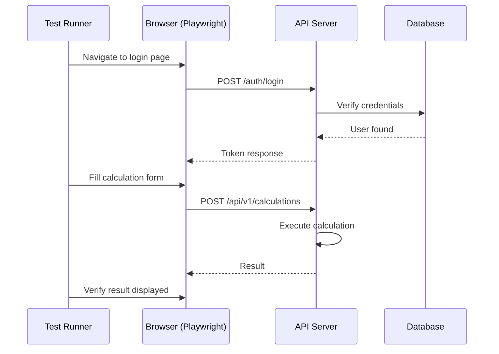

# تست سرتاسری — E2E Tests

**نسخه**: ۱.۰.۰ | **وضعیت**: Approved | **آخرین بروزرسانی**: خرداد ۱۴۰۵

---

## Purpose

راهنمای تست سرتاسری (End-to-End) در پلتفرم Xennic.

---

## Scope

Critical user flows, multi-service scenarios, UI automation.

---

## Tooling

| ابزار | کاربرد |
|-------|--------|
| Playwright | Browser automation |
| Supertest | API chain testing |
| Docker Compose | Test environment |

---

## Flow

---

## Critical Flows

| اولویت | جریان | توضیح |
|--------|-------|-------|
| P0 | User Registration & Login | Auth flow |
| P0 | Project CRUD | Core functionality |
| P0 | Calculation Execution | Engineering core |
| P0 | Document Upload | AI pipeline |
| P1 | Subscription Purchase | Billing |
| P1 | Team Management | Collaboration |
| P2 | Report Generation | Export |
| P2 | Knowledge Search | RAG pipeline |

---

## Related Documents

| سند | مسیر |
|-----|------|
| Test Strategy | `testing/TEST_STRATEGY.md` |
| Integration Tests | `testing/INTEGRATION_TESTS.md` |
| CI/CD | `devops/CI_CD.md` |

---

## Revision History

| نسخه | تاریخ | تغییرات |
|------|-------|---------|
| ۱.۰.۰ | خرداد ۱۴۰۵ | انتشار اولیه |
