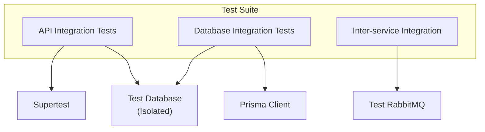

# تست یکپارچه‌سازی — Integration Tests

**نسخه**: ۱.۰.۰ | **وضعیت**: Approved | **آخرین بروزرسانی**: خرداد ۱۴۰۵

---

## Purpose

راهنمای تست یکپارچه‌سازی (Integration Tests) برای پلتفرم Xennic.

---

## Scope

API endpoints, database interactions, inter-service communication.

---

## Architecture



---

## Setup

```typescript
beforeAll(async () => {
  const moduleFixture = await Test.createTestingModule({
    imports: [AppModule],
  }).compile();
  
  app = moduleFixture.createNestApplication();
  await app.init();
});

afterAll(async () => {
  await app.close();
});
```

## Test Database

```yaml
database:
  test:
    url: postgresql://localhost:5432/xennic_test
    setup: prisma migrate deploy
    teardown: drop schema
    isolation: transaction rollback
```

---

## Related Documents

| سند | مسیر |
|-----|------|
| Test Strategy | `testing/TEST_STRATEGY.md` |
| Unit Tests | `testing/UNIT_TESTS.md` |
| E2E Tests | `testing/E2E_TESTS.md` |
| Database | `database/DATABASE_DESIGN.md` |

---

## Revision History

| نسخه | تاریخ | تغییرات |
|------|-------|---------|
| ۱.۰.۰ | خرداد ۱۴۰۵ | انتشار اولیه |
