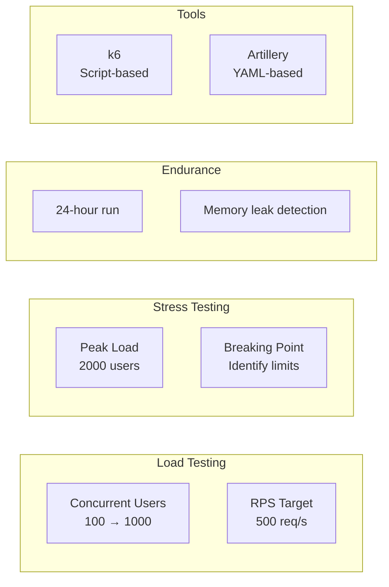

# تست عملکرد — Performance Testing

**نسخه**: ۱.۰.۰ | **وضعیت**: Approved | **آخرین بروزرسانی**: خرداد ۱۴۰۵

---

## Purpose

راهبرد تست عملکرد (Performance Testing) در پلتفرم Xennic.

---

## Scope

Load testing, stress testing, endurance testing.

---

## Scenarios



---

## Performance Targets

| معیار | هدف | آستانه |
|-------|------|--------|
| API Response Time | < 200ms (p95) | < 500ms (p99) |
| Calculation Time | < 1s (p95) | < 3s (p99) |
| OCR Processing | < 5s per page | < 10s |
| Search Response | < 300ms | < 1s |
| Concurrent Users | 1000 | 2000 |
| Database Queries | < 20ms | < 100ms |

## Load Test Script (k6)

```javascript
import http from 'k6/http';
import { check, sleep } from 'k6';

export const options = {
  stages: [
    { duration: '5m', target: 100 },
    { duration: '10m', target: 500 },
    { duration: '5m', target: 1000 },
    { duration: '5m', target: 0 },
  ],
};

export default function () {
  const res = http.get('http://localhost:3000/api/v1/health');
  check(res, { 'status is 200': (r) => r.status === 200 });
  sleep(1);
}
```

---

## Related Documents

| سند | مسیر |
|-----|------|
| Test Strategy | `testing/TEST_STRATEGY.md` |
| Monitoring | `devops/MONITORING.md` |
| Scaling | `deployment/SCALING.md` |
| Infrastructure | `infrastructure/INFRASTRUCTURE.md` |

---

## Revision History

| نسخه | تاریخ | تغییرات |
|------|-------|---------|
| ۱.۰.۰ | خرداد ۱۴۰۵ | انتشار اولیه |
