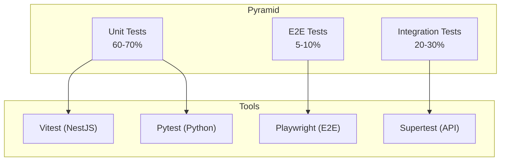

# راهبرد تست — Test Strategy

**نسخه**: ۱.۰.۰ | **وضعیت**: Approved | **آخرین بروزرسانی**: خرداد ۱۴۰۵

---

## Purpose

راهبرد کلی تست‌نویسی در پلتفرم Xennic را توصیف می‌کند.

---

## Scope

Testing pyramid, tooling, coverage requirements, CI integration.

---

## Testing Pyramid



---

## Coverage Targets

| لایه | هدف | حداقل |
|------|------|-------|
| Unit (TS) | 80% | 70% |
| Unit (Python) | 85% | 75% |
| Integration | 60% | 50% |
| E2E | 40% | 30% |

## Test Categories

| نوع | حوزه | فرکانس |
|-----|------|--------|
| Unit | Functions, services, utilities | Every commit |
| Integration | API endpoints, database | Every PR |
| E2E | Critical user flows | Every release |
| Performance | Load, stress, endurance | Weekly |
| Security | Auth, injection, XSS | Monthly |

## CI Integration

```yaml
test:
  steps:
    - pnpm test           # unit + integration
    - pnpm test:e2e       # end-to-end
    - pnpm test:coverage  # coverage report
```

---

## Related Documents

| سند | مسیر |
|-----|------|
| Unit Tests | `testing/UNIT_TESTS.md` |
| Integration Tests | `testing/INTEGRATION_TESTS.md` |
| E2E Tests | `testing/E2E_TESTS.md` |
| Performance Testing | `testing/PERFORMANCE_TESTING.md` |
| CI/CD | `devops/CI_CD.md` |

---

## Revision History

| نسخه | تاریخ | تغییرات |
|------|-------|---------|
| ۱.۰.۰ | خرداد ۱۴۰۵ | انتشار اولیه |
