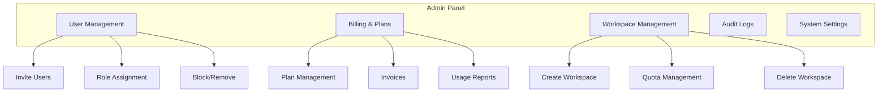

# راهنمای مدیر — Admin Guide

**نسخه**: ۱.۰.۰ | **وضعیت**: Approved | **آخرین بروزرسانی**: خرداد ۱۴۰۵

---

## Purpose

راهنمای مدیران سیستم پلتفرم Xennic.

---

## Scope

User management, billing, workspace configuration.

---

## Admin Console

---

## Admin Tasks

| وظیفه | مسیر | توضیح |
|-------|------|-------|
| مدیریت کاربران | Admin → Users | افزودن، حذف، تغییر نقش |
| مدیریت اشتراک | Admin → Billing | تغییر پلن، مشاهده صورتحساب |
| تنظیمات سیستم | Admin → Settings | پیکربندی global |
| لاگ‌ها | Admin → Audit | مشاهده فعالیت کاربران |
| گزارش‌گیری | Admin → Reports | گزارش مصرف و عملکرد |

---

## Related Documents

| سند | مسیر |
|-----|------|
| User Guide | `user/USER_GUIDE.md` |
| Subscription & Billing | `services/subscription-billing.md` |
| Security Model | `security/SECURITY_MODEL.md` |

---

## Revision History

| نسخه | تاریخ | تغییرات |
|------|-------|---------|
| ۱.۰.۰ | خرداد ۱۴۰۵ | انتشار اولیه |
